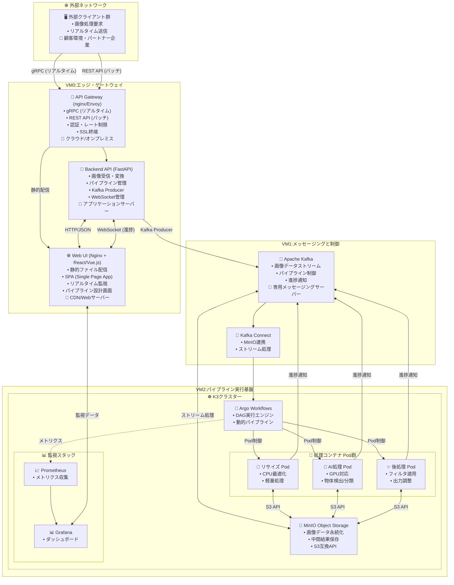
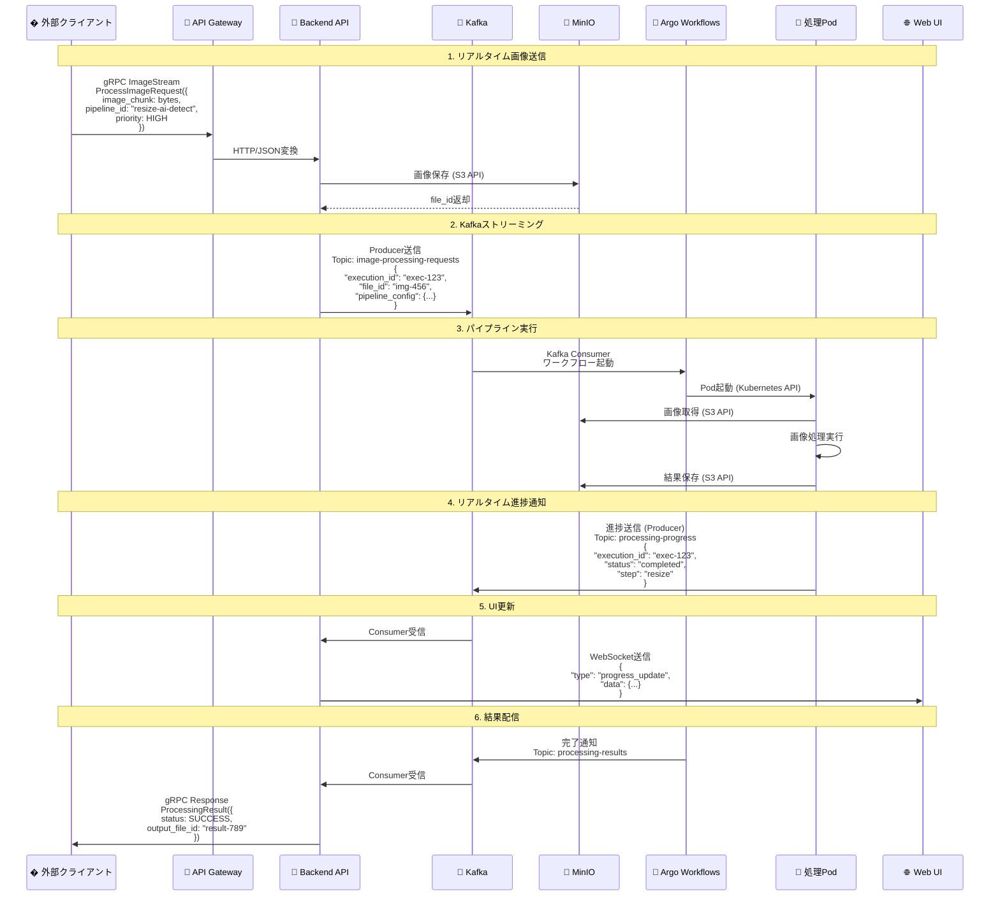
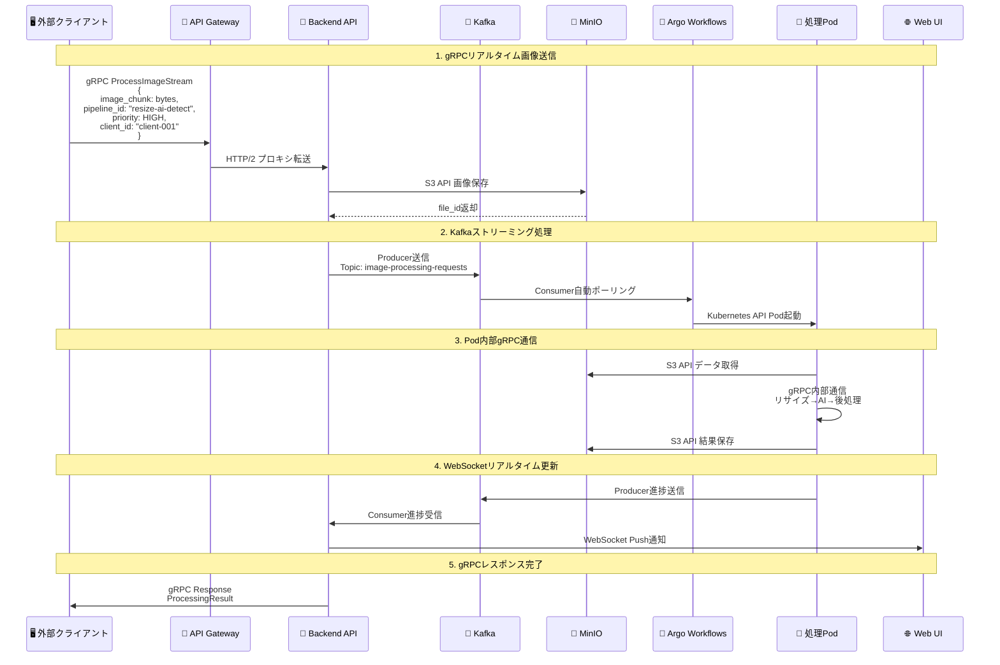
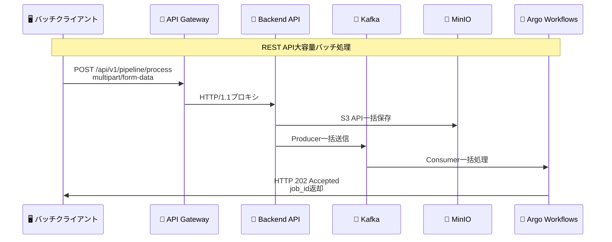
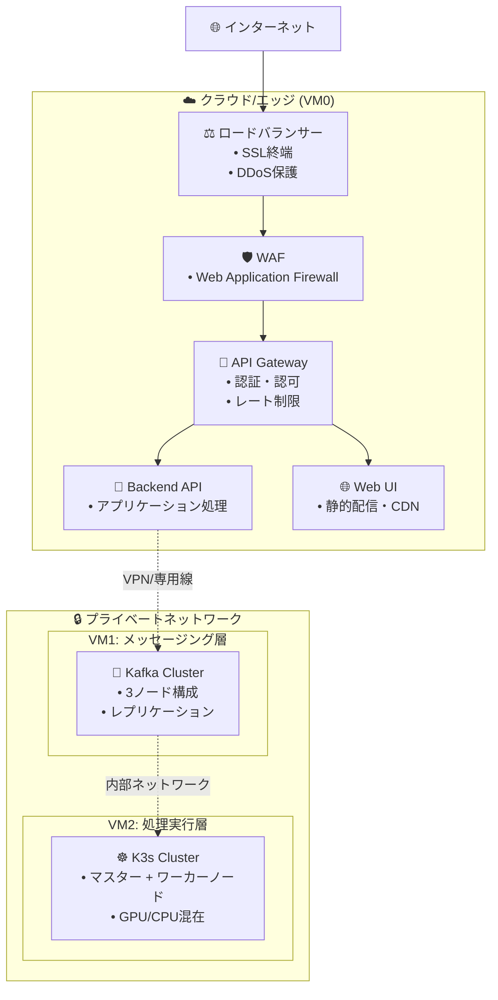

# 要件定義書

## **1. はじめに**

### **1.1. プロジェクトの目的**

本プロジェクトは、ユーザーがWebインターフェースを通じて、画像処理の各機能（前処理、AI処理、後処理など）を「部品」として自由に組み合わせ、動的な処理パイプラインを構築・実行できるシステムを開発することを目的とする。これにより、変化するビジネス要件や新しいAIモデルの導入に、迅速かつ柔軟に対応できる基盤を提供する。

### **1.2. プロジェクトの背景**

従来、画像処理パイプラインは固定的なものが多く、新しい処理の追加や順序の変更には多大な開発コストと時間を要していた。また、処理ごとに異なるライブラリや実行環境の依存関係の管理が複雑化し、システムの拡張性や保守性を著しく低下させる要因となっていた。本システムは、これらの課題を解決し、非エンジニアでも直感的に高度な画像処理ワークフローを構築できる環境を目指す。

### **1.3. 本書の構成**

本書は、開発するシステムの要件を定義するものである。システム概要、機能要件、非機能要件、システムアーキテクチャについて記述する。

## **2. システム概要**

### **2.1. システム構成図**



#### **システム構成の説明**

| コンポーネント         | 役割                                         | ホスティング場所                       | 最適プロトコル                          |
| :--------------------- | :------------------------------------------- | :------------------------------------- | :-------------------------------------- |
| **🖥️ 外部クライアント** | 画像処理要求の送信元                         | 顧客環境・パートナー企業               | gRPC (リアルタイム) / REST API (バッチ) |
| **🚪 API Gateway**      | 外部アクセスの統一窓口・認証・負荷分散       | VM0 (クラウド/オンプレミス)            | HTTP/2 (gRPC), HTTP/1.1 (REST)          |
| **🔧 Backend API**      | ビジネスロジック・画像変換・パイプライン管理 | VM0 (アプリケーションサーバー)         | FastAPI (HTTP)                          |
| **🌐 Web UI**           | 管理画面・パイプライン設計・監視ダッシュ     | VM0 (CDN/Webサーバー)                  | HTTP/WebSocket                          |
| **📨 Apache Kafka**     | 非同期メッセージング・ストリーム処理         | VM1 (専用メッセージングサーバー)       | TCP (Kafka Protocol)                    |
| **🔗 Kafka Connect**    | MinIOとの連携・データパイプライン            | VM1 (専用メッセージングサーバー)       | Kafka Streams                           |
| **☸️ K3s**              | コンテナオーケストレーション基盤             | VM2 (高性能コンピューティングサーバー) | Kubernetes API                          |
| **🔄 Argo Workflows**   | パイプライン実行制御エンジン                 | VM2内のK3s                             | Kubernetes CRD                          |
| **💾 MinIO**            | オブジェクトストレージ・データ永続化         | VM2内のK3s                             | S3 API (HTTP)                           |
| **🐳 処理Pod群**        | 画像処理の実行単位                           | VM2内のK3s                             | 内部通信 (gRPC)                         |
| **🔄 Argo Workflows**   | パイプライン実行制御エンジン                 | VM2内のK3s                             | Kubernetes CRD                          |
| **💾 MinIO**            | オブジェクトストレージ・データ永続化         | VM2内のK3s                             | S3 API (HTTP)                           |
| **🐳 処理Pod群**        | 画像処理の実行単位                           | VM2内のK3s                             | 内部通信 (gRPC)                         |
| **🌐 Web UI**           | 管理インターフェース・監視画面               | フロントエンド                         | WebSocket (リアルタイム更新)            |

#### **データフローの概要**

1. **画像受信**: 外部クライアントから **gRPC (リアルタイム)** または **REST API (バッチ)** で画像データを受信
2. **データ変換**: Backend APIで画像を最適化し、**Kafka** でストリーミング送信
3. **パイプライン起動**: **Kafka Connect** がArgo Workflowsにパイプライン実行を指示
4. **処理実行**: 各PodがMinIOから**S3 API**でデータを取得し、処理を実行
5. **進捗通知**: 処理コンテナが**Kafka**経由で進捗を送信、Web UIに**WebSocket**でリアルタイム通知
6. **結果配信**: 最終結果をMinIOに保存し、**REST API**で外部システムに配信

#### **詳細なデータフロー**



#### **gRPCプロトコル通信フロー**



#### **REST APIバッチ処理フロー**



#### **プロトコル最適化の選択基準**

| 🎯 用途・シナリオ         | 🚀 推奨プロトコル | ⚡ 性能特性                                                            | 📝 選択理由                            |
| :----------------------- | :--------------- | :-------------------------------------------------------------------- | :------------------------------------ |
| **リアルタイム画像処理** | gRPC             | • 低レイテンシ (50-100ms)<br/>• ストリーミング対応<br/>• バイナリ効率 | ライブ配信、監視カメラ、AR/VR用途     |
| **バッチ画像処理**       | REST API         | • 高信頼性<br/>• シンプル統合<br/>• HTTP標準                          | 一括処理、既存システム連携            |
| **システム間連携**       | Kafka            | • 高スループット<br/>• 順序保証<br/>• 耐障害性                        | マイクロサービス間の非同期通信        |
| **UI更新通知**           | WebSocket        | • 双方向通信<br/>• リアルタイム性<br/>• 低オーバーヘッド              | 進捗表示、監視ダッシュボード          |
| **データ永続化**         | S3 API           | • RESTful<br/>• 標準互換<br/>• 高可用性                               | MinIOとの連携、オブジェクトストレージ |
| **Pod間通信**            | gRPC             | • 型安全<br/>• 高性能<br/>• サービスメッシュ対応                      | マイクロサービス内部通信              |

## **3. 機能要件**

### **3.1. パイプライン管理機能**

#### **🔄 F-001: パイプラインの動的構築**
- **概要**: ユーザーはWeb UI上で、登録済みの処理コンポーネント（部品）をドラッグ＆ドロップ等の直感的な操作で選択し、それらの実行順序や依存関係（直列・並列）を定義できる
- **優先度**: 🔴 High
- **入力**: 処理コンポーネント一覧、パイプライン設計画面
- **出力**: パイプライン定義（YAML/JSON）

#### **▶️ F-002: パイプラインの実行**  
- **概要**: ユーザーは構築したパイプラインを、任意の入力データ（画像など）を指定して実行できる。実行時に特定のパラメータ（リサイズ幅など）を動的に上書きできる
- **優先度**: 🔴 High
- **入力**: パイプライン定義、入力データ、実行時パラメータ
- **出力**: 実行ID、初期ステータス

#### **👁️ F-003: パイプラインの実行監視**
- **概要**: 実行中のパイプラインの進捗状況をリアルタイムで可視化する。各ステップの成功、失敗、実行中といったステータスが一覧できる
- **優先度**: 🟡 Medium
- **入力**: 実行ID
- **出力**: リアルタイムステータス表示

#### **📊 F-004: 実行履歴と結果確認**
- **概要**: 過去に実行したパイプラインの履歴を一覧表示できる。各実行の詳細（使用したパラメータ、ログ、生成された成果物）を確認できる
- **優先度**: 🟡 Medium  
- **入力**: 検索条件（日付、ステータス等）
- **出力**: 実行履歴一覧、詳細情報

#### **🔄 F-005: エラーハンドリング**
- **概要**: パイプラインの特定のステップが失敗した場合、定義されたリトライ処理を自動で実行する
- **優先度**: 🟡 Medium
- **入力**: エラー情報、リトライ設定
- **出力**: リトライ実行結果

### **3.2. 処理コンポーネント（部品）管理機能**

#### **📦 F-006: コンポーネントの登録**
- **概要**: 開発者は、新しい処理ロジックを実装したコンテナイメージをシステムに登録できる。登録時には、コンポーネントの名前、説明、入出力パラメータの定義を行う
- **優先度**: 🔴 High
- **入力**: コンテナイメージ、メタデータ（名前、説明、パラメータ定義）
- **出力**: コンポーネントID、登録確認

#### **🏷️ F-007: コンポーネントのバージョン管理**
- **概要**: 各処理コンポーネントはバージョン管理され、パイプライン定義時には使用するバージョンを明示的に指定できる
- **優先度**: 🟡 Medium
- **入力**: コンポーネントID、バージョン情報
- **出力**: バージョン履歴、利用可能バージョン一覧

### **3.3. データ管理機能**

#### **📥 F-008: 外部クライアントからの画像データ受信 (gRPC推奨)**
- **概要**: 外部クライアントシステムからgRPC (リアルタイム) またはREST API (バッチ) を通じて画像データを受信する機能を提供する
- **優先度**: 🔴 High
- **推奨プロトコル**: gRPC (ストリーミング), REST API (ファイルアップロード)
- **入力**: 画像データ（バイナリ）、パイプライン設定、メタデータ
- **出力**: 受信確認、データID、処理キューへの登録

#### **🔄 F-018: ストリーミング画像処理 (gRPC内部通信)**
- **概要**: 大容量画像や連続的な画像ストリームを効率的に処理するため、Pod間gRPC通信とKafkaストリーミングに対応する
- **優先度**: 🟡 Medium
- **推奨プロトコル**: gRPC (Pod間), Kafka (コンポーネント間)
- **入力**: 画像チャンクストリーム、ストリーミング設定
- **出力**: リアルタイム処理結果

#### **📡 F-019: マルチプロトコル対応**
- **概要**: クライアント要件に応じて最適なプロトコルを自動選択する機能を提供する
- **優先度**: 🟡 Medium
- **プロトコル戦略**: 
  - **gRPC**: リアルタイム (< 100ms)
  - **REST API**: バッチ処理 (> 1s)
  - **Kafka**: 非同期メッセージング
  - **WebSocket**: UI更新通知
- **入力**: プロトコル指定、クライアント認証情報
- **出力**: プロトコル固有のレスポンス

#### **💾 F-009: データストレージ**
- **概要**: 受け付けた入力データ、およびパイプラインの各ステップで生成される中間・最終成果物を、オブジェクトストレージに永続的に保存する
- **優先度**: 🔴 High
- **入力**: データファイル、保存先パス
- **出力**: ストレージURL、保存確認

### **3.4. ユーザーインターフェース (UI)**

#### **📊 F-010: ダッシュボード**
- **概要**: パイプラインの実行状況やシステムの状態を概観できるダッシュボードを提供する
- **優先度**: 🟡 Medium
- **機能**:
  - 実行中パイプライン数表示
  - システムリソース使用状況
  - 最近の実行履歴
  - エラー/警告アラート

#### **🎨 F-011: パイプライン定義画面**
- **概要**: F-001で定義した、パイプラインをグラフィカルに構築するための専用画面を提供する
- **優先度**: 🔴 High
- **機能**:
  - ドラッグ＆ドロップによるコンポーネント配置
  - 接続線による依存関係の定義
  - パラメータ設定画面
  - プレビュー機能

#### **📈 F-012: 実行結果表示画面**
- **概要**: F-004で定義した、パイプラインの実行結果（生成画像、ログ等）を詳細に表示する画面を提供する
- **優先度**: 🟡 Medium
- **機能**:
  - 実行ログの表示
  - 生成された画像の表示
  - 実行時間・リソース使用量の表示
  - エラー詳細の表示

#### **📱 F-016: 実行監視画面**
- **概要**: リアルタイムでパイプラインの実行状況を監視する専用画面を提供する
- **優先度**: 🟡 Medium
- **機能**:
  - 実行中パイプラインの一覧表示
  - 各ステップの進捗状況をグラフィカルに表示
  - エラー発生時のアラート表示
  - 実行キャンセル機能
  - リアルタイムログストリーミング

#### **🖼️ F-017: 画像比較・プレビュー画面**
- **概要**: 入力画像と各処理ステップの出力画像を比較表示する機能を提供する
- **優先度**: 🔵 Low
- **機能**:
  - Before/After比較表示
  - 各ステップの中間結果表示
  - 画像の拡大・縮小・パン操作
  - メタデータ（ファイルサイズ、解像度等）の表示

### **3.5. リアルタイム通信機能**

#### **🔔 F-013: リアルタイム進捗通知 (WebSocket推奨)**
- **概要**: パイプラインの実行中、各ステップの開始・完了・エラー情報をWebSocketを通じてWeb UIにリアルタイムで通知する
- **優先度**: 🟡 Medium
- **推奨プロトコル**: WebSocket (双方向リアルタイム)
- **入力**: Kafkaからの進捗メッセージ
- **出力**: Web UIへのリアルタイム通知

#### **📡 F-014: 結果配信API (REST API)**
- **概要**: 処理完了後、最終結果（画像ファイル、メタデータ）をHTTP APIまたはWebhookを通じて外部システムに配信する機能を提供する
- **優先度**: 🟡 Medium
- **推奨プロトコル**: REST API (HTTP Webhook), gRPC (同期レスポンス)
- **入力**: 実行ID、配信先情報
- **出力**: 結果データ（画像、JSON）

#### **🔄 F-015: ステータス同期 (Kafka + WebSocket)**
- **概要**: Web UIで表示される実行状況と、実際のパイプライン実行状況をKafka経由でWebSocketにリアルタイム同期する
- **優先度**: 🔴 High
- **推奨プロトコル**: Kafka (メッセージング) + WebSocket (UI更新)
- **入力**: Kafkaからのリアルタイムメッセージ
- **出力**: UI状態の更新

## **4. 非機能要件**

### **4.1. 性能・拡張性 (Performance & Scalability)**

#### **⚡ NF-001: スループット**
- **要求**: システムは、単位時間あたりに指定された数のパイプラインを処理できること
- **詳細**: ボトルネックとなっている処理コンポーネントを特定し、個別にスケールアウトできる構成であること
- **測定方法**: 同時実行パイプライン数、平均処理時間

#### **📈 NF-002: スケーラビリティ**
- **要求**: 将来的な処理負荷の増大に対応するため、パイプライン実行サーバー（ワーカーノード）をクラスタに容易に追加できること
- **詳細**: 水平スケーリング対応、自動スケーリング機能
- **測定方法**: ノード追加時間、負荷分散効率

#### **🎯 NF-003: リソースの効率的利用**
- **要求**: GPUを必要とする処理はGPU搭載ノードで、CPUのみで十分な処理は汎用ノードで実行するなど、リソースを適材適所で割り当てられること
- **詳細**: リソースアフィニティ設定、動的リソース割り当て
- **測定方法**: リソース使用率、コスト効率

### **4.2. 可用性・信頼性 (Availability & Reliability)**

#### **🛡️ NF-004: 耐障害性**
- **要求**: 特定の処理コンポーネント（コンテナ）で障害が発生しても、その影響が他のコンポーネントやパイプライン全体に波及しないこと
- **詳細**: 障害が発生したコンテナは自動的に再起動されること
- **測定方法**: MTTR（平均復旧時間）、障害影響範囲

#### **💾 NF-005: データ永続性**
- **要求**: 入力データ、中間成果物、最終成果物は、コンテナやノードの障害によって失われないこと
- **詳細**: オブジェクトストレージに永続化されること
- **測定方法**: データ損失率、バックアップ復旧時間

### **4.3. 運用・保守性 (Operability & Maintainability)**

#### **👁️ NF-006: 監視**
- **要求**: システムを構成する各コンポーネント（ノード、Pod、コンテナ）のリソース使用率（CPU、メモリ）や、アプリケーション固有のメトリクスを収集し、可視化できること
- **詳細**: ダッシュボード、アラート機能
- **測定方法**: 監視カバレッジ、アラート精度

#### **📝 NF-007: ロギング**
- **要求**: 全ての処理コンテナから出力されるログを一元的に収集し、検索・分析できること
- **詳細**: 構造化ログ、ログ保持期間設定
- **測定方法**: ログ検索性能、ログ完全性

#### **🚀 NF-008: デプロイの自動化**
- **要求**: 処理コンポーネントのソースコードが更新された際、コンテナイメージのビルドとレジストリへのプッシュが自動的に行われるCI/CDパイプラインを構築できること
- **詳細**: GitOps対応、自動テスト実行
- **測定方法**: デプロイ時間、自動化率

### **4.4. セキュリティ (Security)**

#### **🔐 NF-009: アクセス制御**
- **要求**: MinIOやArgo WorkflowsのUIへのアクセスは、適切な認証・認可によって制御されること
- **詳細**: RBAC（Role-Based Access Control）、多要素認証
- **測定方法**: アクセス制御違反数、認証成功率

#### **🔒 NF-010: 機密情報管理**
- **要求**: データベースのパスワードやAPIキーなどの機密情報は、ソースコードにハードコーディングせず、KubernetesのSecretなどの仕組みを用いて安全に管理すること
- **詳細**: 暗号化、Secret管理
- **測定方法**: 機密情報露出リスク評価

### **4.5. 移行性 (Portability)**

#### **☁️ NF-011: クラウド非依存**
- **要求**: システムはオープンソースの技術を主軸とし、特定のクラウドベンダーの独自サービスへの依存を最小限に抑えること
- **詳細**: 将来的なオンプレミス環境や他クラウドへの移行が容易であること
- **測定方法**: ベンダーロックイン度、移行工数

## **5. システムアーキテクチャ**

### **5.1. 全体アーキテクチャ**

* **マイクロサービスアーキテクチャ**を採用する。各画像処理機能は、それぞれが独立した責務を持つコンテナ（マイクロサービス）として開発・デプロイされる。  
* コンテナのライフサイクル管理は、コンテナオーケストレーション基盤である **K3s (Kubernetes)** が担う。  
* マイクロサービス間の連携およびパイプラインの動的な実行制御は、ワークフローエンジンである **Argo Workflows** が担う。  
* パイプラインのステップ間で受け渡される画像データ等の大きなファイルは、共有オブジェクトストレージである **MinIO** を介して連携する。  
* システム間の非同期なイベント通知には、メッセージングシステムである **Kafka** を利用する。

### **5.2. 技術スタック**

#### **🏗️ インフラストラクチャ層**

| 🔧 技術               | 🎯 役割                       | 📝 選択理由                                                                                                                                                  |
| :------------------- | :--------------------------- | :---------------------------------------------------------------------------------------------------------------------------------------------------------- |
| **☸️ K3s**            | コンテナオーケストレーション | 軽量なKubernetesディストリビューション。Argo Workflowsとのネイティブな親和性と、広大なエコシステムが利用できるため採用                                      |
| **🔄 Argo Workflows** | ワークフローエンジン         | Kubernetesネイティブなワークフローエンジン。「パイプラインの動的構築」という核心要件を実現するため採用。DAG（有向非巡回グラフ）による柔軟なフロー定義が可能 |
| **💾 MinIO**          | オブジェクトストレージ       | S3互換のオープンソースストレージ。パイプラインのステップ間でのデータ共有と、成果物の永続化のために採用                                                      |
| **📨 Kafka**          | メッセージング               | 高スループットな分散メッセージングシステム。パイプラインの起動トリガーなど、コンポーネント間の疎結合な連携を実現するために採用                              |
| **🐳 containerd**     | コンテナランタイム           | K3sが内部で利用する軽量なコンテナランタイム                                                                                                                 |

#### **💻 アプリケーション層**

| 🔧 技術              | 🎯 役割                       | 📝 選択理由                                                     |
| :------------------ | :--------------------------- | :------------------------------------------------------------- |
| **🐍 Python**        | 処理コンテナ開発言語（推奨） | 機械学習ライブラリが豊富であり、処理コンテナの開発に適している |
| **⚛️ React/Vue.js**  | フロントエンドUI（想定）     | モダンなWebUI構築のため                                        |
| **🚀 FastAPI/Flask** | バックエンドAPI（想定）      | PythonベースのAPI開発フレームワーク                            |

#### **🔗 連携・通信層**

| 🔧 技術                         | 🎯 役割                      | 📝 選択理由                                                |
| :----------------------------- | :-------------------------- | :-------------------------------------------------------- |
| **🔌 WebSocket**                | リアルタイム通信            | Web UIとBackend API間での進捗状況のリアルタイム通知のため |
| **📡 Server-Sent Events (SSE)** | 一方向リアルタイム通信      | WebSocketの代替として、シンプルなリアルタイム通知のため   |
| **🔄 kafka-python**             | Kafkaクライアントライブラリ | PythonアプリケーションからKafkaにアクセスするため         |
| **📋 REST API**                 | 同期通信                    | 標準的なHTTP APIによるリクエスト・レスポンス通信のため    |
| **🚀 gRPC**                     | 高性能RPC通信               | 低レイテンシが必要なリアルタイム画像処理のため            |
| **📨 Protocol Buffers**         | シリアライゼーション        | gRPCでの効率的なバイナリデータ転送のため                  |

#### **🖼️ 画像処理・転送層**

| 🔧 技術             | 🎯 役割                   | 📝 選択理由                                 |
| :----------------- | :----------------------- | :----------------------------------------- |
| **📷 OpenCV**       | 画像処理ライブラリ       | 豊富な画像処理機能とPythonとの親和性のため |
| **🗜️ Pillow (PIL)** | 画像フォーマット変換     | 多様な画像フォーマットのサポートのため     |
| **⚡ ImageIO**      | 高性能画像I/O            | 大容量画像ファイルの効率的な読み書きのため |
| **🔐 Base64**       | バイナリエンコーディング | Kafka/JSON経由でのバイナリデータ転送のため |

#### **🔗 通信・連携関連**

| 📘 用語                 | 📖 説明                                                                              | 🔗 関連技術       |
| :--------------------- | :---------------------------------------------------------------------------------- | :--------------- |
| **🔌 WebSocket**        | 双方向リアルタイム通信プロトコル。Web UIでのリアルタイム進捗表示に使用              | HTTP, TCP        |
| **📡 SSE**              | Server-Sent Events。サーバーからクライアントへの一方向リアルタイム通信              | HTTP             |
| **📨 Topic**            | Kafkaにおけるメッセージの論理的なカテゴリ。パブリッシャーとサブスクライバーの仲介役 | Kafka            |
| **🆔 execution_id**     | パイプライン実行を一意に識別するID。全てのシステム間で処理を追跡するために使用      | UUID             |
| **🏷️ file_id**          | MinIOに保存された画像ファイルを一意に識別するID                                     | MinIO, S3        |
| **🚀 gRPC**             | Googleが開発した高性能なRPCフレームワーク。Protocol Buffersを使用                   | HTTP/2, Protobuf |
| **📦 Protocol Buffers** | Googleが開発したシリアライゼーション形式。gRPCのデフォルト形式                      | Binary, Schema   |
| **🔄 Streaming RPC**    | gRPCの機能で、連続的なデータストリームを効率的に転送する仕組み                      | gRPC, HTTP/2     |

#### **📊 データ・画像関連**

| 📘 用語                      | 📖 説明                                                                       | 🔗 関連技術       |
| :-------------------------- | :--------------------------------------------------------------------------- | :--------------- |
| **🗂️ Payload**               | Kafkaメッセージに含まれるデータ本体。JSON形式で構造化されている              | JSON, Kafka      |
| **📋 Pipeline Definition**   | パイプラインの構成（処理ステップ、依存関係、パラメータ）を定義したデータ構造 | YAML, JSON       |
| **📈 Progress Notification** | パイプライン実行中の各ステップの進捗状況を通知するメッセージ                 | Kafka, WebSocket |
| **🧩 Image Chunk**           | 大容量画像を分割したデータ片。ストリーミング転送で使用される                 | Binary, Base64   |
| **🔗 Correlation ID**        | クライアントリクエストと処理結果を紐づけるための一意識別子                   | UUID, String     |
| **📷 Image Metadata**        | 画像の解像度、フォーマット、撮影情報などの付属データ                         | EXIF, JSON       |
| **⚡ Client ID**             | 外部クライアントを一意に識別するID。認証と処理追跡に使用                     | String, UUID     |

## **6. その他**

### **6.1. 用語集**

| 英語 / 日本語                                         | 説明                                                                                    |
| :---------------------------------------------------- | :-------------------------------------------------------------------------------------- |
| **Pipeline / パイプライン**                           | 画像処理の各ステップ（リサイズ、AI処理など）を連結した処理フロー                        |
| **Node / ノード**                                     | K3s上で動作するコンテナの単位。各処理コンポーネントが独立したノードとしてデプロイされる |
| **Pod / ポッド**                                      | K3sにおけるコンテナの集合体。1つ以上のコンテナが協調して動作する単位                    |
| **Service / サービス**                                | K3sにおけるネットワークサービスの定義。ポッドへのアクセスを負荷分散する役割             |
| **Ingress / イングレス**                              | クラスタ外部から内部サービスへのアクセスを制御するK3sのリソース                         |
| **ConfigMap / コンフィグマップ**                      | 環境設定をK3sのリソースとして管理するためのオブジェクト                                 |
| **Secret / シークレット**                             | 機密情報を安全に管理するためのK3sのオブジェクト                                         |
| **Volume / ボリューム**                               | コンテナ間でデータを共有するためのストレージ領域                                        |
| **Namespace / ネームスペース**                        | K3sクラスタ内でリソースを論理的に分離するための単位                                     |
| **Context / コンテキスト**                            | Kubernetesの設定情報をまとめたもの。kubectlコマンドで使用される                         |
| **Kubelet / キューブレット**                          | K3sノード上で動作し、コンテナの実行を管理するエージェント                               |
| **Kube-proxy / キューブプロキシ**                     | Kubernetesサービスへのネットワークアクセスを制御するコンポーネント                      |
| **Argo CD / アルゴCD**                                | Kubernetes向けの継続的デリバリーツール。GitOpsを実現するためのツール                    |
| **Prometheus / プロメテウス**                         | オープンソースの監視システム。メトリクスの収集とアラート機能を提供                      |
| **Grafana / グラフANA**                               | オープンソースのダッシュボード作成ツール。Prometheusと連携して監視情報を可視化          |
| **Elasticsearch / エラスティックサーチ**              | 分散型検索エンジン。ログデータの検索・分析に使用                                        |
| **Kibana / キバナ**                                   | Elasticsearchのデータを可視化するためのツール                                           |
| **Fluentd / フルエンジー**                            | オープンソースのログ収集ツール。ログデータを統合的に管理                                |
| **OpenCV / オープンCV**                               | オープンソースの画像処理ライブラリ。コンピュータビジョン向けの機能を提供                |
| **TensorFlow / テンソルフロー**                       | オープンソースの機械学習ライブラリ。深層学習モデルの構築・訓練に使用                    |
| **PyTorch / パイトーチ**                              | オープンソースの機械学習ライブラリ。動的計算グラフによる柔軟なモデル構築が可能          |
| **scikit-learn / サイキットラーン**                   | 機械学習のためのPythonライブラリ。データ前処理やモデル評価に便利な機能を提供            |
| **PIL / Pillow / ピロー**                             | Python Imaging Library。画像の開閉、変換、フィルタリングなどの機能を提供                |
| **ImageIO / イメージIO**                              | 画像の読み書きを行うPythonライブラリ。多様な画像フォーマットに対応                      |
| **Kafka / カフカ**                                    | 分散型ストリーミングプラットフォーム。リアルタイムデータの処理に使用                    |
| **gRPC / ジーRPC**                                    | Googleが開発した高性能なRPCフレームワーク。Protocol Buffersを使用                       |
| **REST API / レストAPI**                              | HTTPプロトコルを使用したAPI。リソース指向のインターフェースを提供                       |
| **WebSocket / ウェブソケット**                        | 双方向通信を可能にするためのプロトコル。リアルタイム性が求められる通信に使用            |
| **SSE / サーバー送信イベント**                        | サーバーからクライアントへの一方向のリアルタイム通信を行うための技術                    |
| **Base64 / ベース64**                                 | バイナリデータをテキストデータにエンコードする方式。主にデータの転送に使用              |
| **UUID / ユニバーサルユニークID**                     | 世界中で一意となる識別子を生成するための標準。主にデータベースのキーなどに使用          |
| **RBAC / ロールベースアクセス制御**                   | ユーザーのロールに基づいてアクセス権を制御する仕組み                                    |
| **GitOps / ギットオプス**                             | Gitリポジトリを単一の真実の源として、インフラとアプリケーションの管理を行う手法         |
| **CI/CD / 継続的インテグレーション/継続的デリバリー** | ソフトウェア開発の手法。コードの変更を自動的にテスト・ビルド・デプロイするプロセス      |

### **6.2. 画像送信プロトコルの詳細仕様**

#### **📨 Kafka経由の画像送信仕様**

```protobuf
// Kafka Message Schema (JSON形式)
{
  "client_id": "string",           // クライアント識別子
  "correlation_id": "string",      // リクエスト追跡ID
  "image_data": "string",          // Base64エンコード画像データ
  "image_format": "jpeg|png|tiff", // 画像フォーマット
  "image_size_bytes": 1048576,     // 画像サイズ（バイト）
  "pipeline_config": {
    "pipeline_id": "string",
    "parameters": {},
    "priority": "high|normal|low"
  },
  "timestamp": "2025-07-12T10:30:00Z"
}
```

#### **🚀 gRPC画像送信仕様**

```protobuf
// image_processing.proto
syntax = "proto3";

service ImageProcessingService {
  // ストリーミング画像処理
  rpc ProcessImageStream(stream ImageChunk) returns (stream ProcessingResult);
  
  // 単発画像処理
  rpc ProcessSingleImage(ImageRequest) returns (ProcessingResponse);
}

message ImageChunk {
  string correlation_id = 1;
  bytes image_data = 2;
  int32 chunk_index = 3;
  int32 total_chunks = 4;
  bool is_final_chunk = 5;
  ImageMetadata metadata = 6;
}

message ImageMetadata {
  string format = 1;
  int32 width = 2;
  int32 height = 3;
  string client_id = 4;
  PipelineConfig pipeline_config = 5;
}

message PipelineConfig {
  string pipeline_id = 1;
  map<string, string> parameters = 2;
  Priority priority = 3;
}

enum Priority {
  LOW = 0;
  NORMAL = 1;
  HIGH = 2;
}
```

#### **🌐 REST API仕様**

```yaml
# OpenAPI 3.0 Specification
paths:
  /api/v1/pipeline/process:
    post:
      summary: 画像処理パイプライン実行
      requestBody:
        content:
          multipart/form-data:
            schema:
              type: object
              properties:
                image:
                  type: string
                  format: binary
                  description: 処理対象の画像ファイル
                pipeline_config:
                  type: object
                  properties:
                    pipeline_id:
                      type: string
                      example: "resize-ai-detection"
                    parameters:
                      type: object
                      example: {"resize_width": 800}
                    priority:
                      type: string
                      enum: [low, normal, high]
                client_id:
                  type: string
                  example: "client-001"
                correlation_id:
                  type: string
                  example: "req-12345"
      responses:
        '202':
          description: 処理要求受付
          content:
            application/json:
              schema:
                type: object
                properties:
                  execution_id:
                    type: string
                  status:
                    type: string
                    example: "accepted"
                  estimated_completion_time:
                    type: string
                    example: "2025-07-12T10:35:00Z"
```

## **7. ホスティング場所とデプロイメント戦略**

#### **🏗️ VM0: エッジ・ゲートウェイサーバー (フロントエンド層)**

| 🔧 コンポーネント  | 📍 推奨ホスティング場所                                                   | ⚙️ デプロイ方法                        | 🎯 用途・特徴                                                  |
| :---------------- | :----------------------------------------------------------------------- | :------------------------------------ | :------------------------------------------------------------ |
| **🚪 API Gateway** | AWS ALB/CloudFlare<br/>または<br/>オンプレミス nginx                     | Docker Compose<br/>Kubernetes Ingress | • SSL終端・認証<br/>• 負荷分散<br/>• レート制限               |
| **🔧 Backend API** | AWS ECS/GKE<br/>または<br/>オンプレミス Docker                           | FastAPI Container                     | • ビジネスロジック<br/>• Kafka Producer<br/>• WebSocket管理   |
| **🌐 Web UI**      | AWS S3+CloudFront<br/>Azure Static Web Apps<br/>または<br/>nginx静的配信 | React/Vue.js Build<br/>CDN配信        | • SPA (Single Page App)<br/>• 静的ファイル配信<br/>• 管理画面 |

#### **🖥️ VM1: 専用メッセージングサーバー (メッセージング層)**

| 🔧 コンポーネント    | 📍 推奨ホスティング場所                           | ⚙️ デプロイ方法                      | 🎯 用途・特徴                                                         |
| :------------------ | :----------------------------------------------- | :---------------------------------- | :------------------------------------------------------------------- |
| **📨 Apache Kafka**  | 専用物理サーバー<br/>AWS MSK<br/>Confluent Cloud | Kafka Cluster<br/>(3ノード構成推奨) | • 高スループット<br/>• メッセージ永続化<br/>• パーティション並列処理 |
| **🔗 Kafka Connect** | Kafka同居サーバー                                | Docker Container                    | • MinIO連携<br/>• ストリーム処理<br/>• データパイプライン            |

#### **⚡ VM2: 高性能コンピューティングサーバー (処理実行層)**

| 🔧 コンポーネント     | 📍 推奨ホスティング場所                                       | ⚙️ デプロイ方法        | 🎯 用途・特徴                                                     |
| :------------------- | :----------------------------------------------------------- | :-------------------- | :--------------------------------------------------------------- |
| **☸️ K3s Cluster**    | GPU搭載物理サーバー<br/>AWS EC2 G4/P3<br/>GCP Compute Engine | K3s Multi-node        | • GPU/CPU混在環境<br/>• 自動スケーリング<br/>• リソース効率化    |
| **🔄 Argo Workflows** | K3s内部                                                      | Kubernetes CRD        | • パイプライン実行<br/>• DAG管理<br/>• 動的スケーリング          |
| **💾 MinIO**          | 高速SSD/NVMeストレージ                                       | K3s StatefulSet       | • 画像データ永続化<br/>• S3互換API<br/>• 高IOPSストレージ        |
| **🐳 処理Pod群**      | GPU/CPUノード                                                | Kubernetes Deployment | • 画像処理実行<br/>• 動的リソース割り当て<br/>• 水平スケーリング |

#### **🌐 ネットワーク構成とセキュリティ**



#### **📊 リソース要件と推奨スペック**

| 🖥️ サーバー       | 💻 推奨スペック        | 💾 ストレージ | 🌐 ネットワーク | 💰 推定コスト/月 |
| :--------------- | :-------------------- | :----------- | :------------- | :-------------- |
| **VM0 (エッジ)** | 4vCPU, 8GB RAM        | 100GB SSD    | 1Gbps          | $100-200        |
| **VM1 (Kafka)**  | 8vCPU, 16GB RAM       | 500GB SSD    | 10Gbps         | $200-400        |
| **VM2 (K3s)**    | 16vCPU, 64GB RAM, GPU | 1TB NVMe SSD | 10Gbps         | $800-1500       |

#### **🔄 デプロイメント戦略**

1. **段階的デプロイ**: VM0 → VM1 → VM2の順序でデプロイ
2. **Blue-Green デプロイ**: 本番環境でのゼロダウンタイム更新
3. **カナリアリリース**: 新機能の段階的展開
4. **GitOps**: Git リポジトリを真実の源とした自動デプロイ