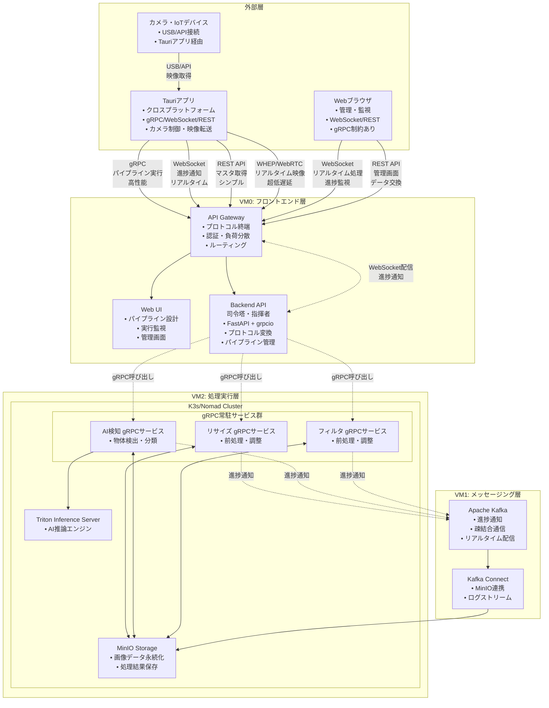
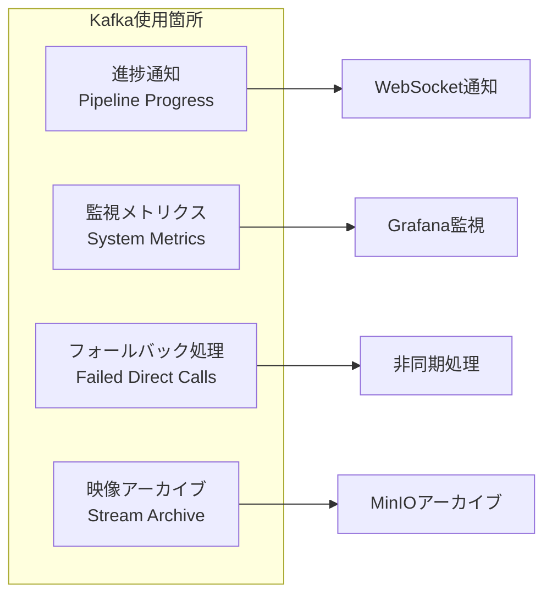

# ImageFlowCanvas システム基本設計書

# 文書管理情報

| 項目       | 内容                               |
| ---------- | ---------------------------------- |
| 文書名     | ImageFlowCanvas システム基本設計書 |
| バージョン | 2.0                                |
| 作成日     | 2025年7月12日                      |
| 更新日     | 2025年7月27日                      |


---

# 1. 概要
## 1.1. 本書の目的

本書は、ImageFlowCanvasシステムの基本設計について詳細に記述するものです。要件定義書で定義された機能要件・非機能要件を実現するための具体的な設計仕様を定義し、開発フェーズでの実装指針を提供します。

## 1.2. 対象読者

- システム開発者
- インフラエンジニア
- プロジェクトマネージャー
- 品質保証担当者

## 1.3. システム概要

ImageFlowCanvasは、Webインターフェースを通じて画像処理の各機能を「部品」として組み合わせ、動的な処理パイプラインを構築・実行できるクラウドネイティブシステムです。また、製造現場での品質管理業務を効率化する検査アプリ機能も統合されています。

**主要特徴：**
- マイクロサービスアーキテクチャによる柔軟な拡張性
- Kubernetesベースのコンテナオーケストレーション
- リアルタイム処理とバッチ処理の両対応
- 動的パイプライン構築機能
- AI検査とモバイルアプリによる現場品質管理
- オフライン対応とリアルタイム同期機能

---

# 2. システム全体構成
## 2.1. 構成図


## 2.2. 技術スタック

### 2.2.1. インフラストラクチャ

| 層             | 技術             | 役割                         | 選定理由                                              |
| -------------- | ---------------- | ---------------------------- | ----------------------------------------------------- |
| コンテナ基盤   | K3s/Nomad        | コンテナオーケストレーション | 軽量でフル機能、gRPC常駐サービス基盤                  |
| 処理エンジン   | gRPC常駐サービス | 超高速パイプライン実行       | 40-100ms処理、Backend経由でアクセス、Protocol Buffers |
| ストレージ     | MinIO            | オブジェクトストレージ       | S3互換、オープンソース                                |
| メッセージング | Apache Kafka     | 進捗通知・疎結合通信         | 高スループット、非同期通知基盤、疎結合アーキテクチャ  |
| AI推論         | Triton Server    | 高性能AI推論エンジン         | GPU最適化、モデル管理、並列処理                       |

### 2.2.2. アプリケーション

| 層                     | 技術                      | 役割                   | 選定理由                                          |
| ---------------------- | ------------------------- | ---------------------- | ------------------------------------------------- |
| クロスプラットフォーム | Tauri + Rust + React      | デスクトップアプリ     | ネイティブ性能、gRPC直接通信、Webview + Rust Core |
| フロントエンド         | React + TypeScript        | Web UI                 | モダンなSPA、型安全性                             |
| バックエンド（司令塔） | FastAPI + grpcio + Python | ハイブリッドAPI        | 複数プロトコル対応、高性能、自動ドキュメント生成  |
| 画像処理               | OpenCV + Python           | 画像処理ライブラリ     | 豊富な機能、Python親和性                          |
| AI処理                 | PyTorch/TensorFlow        | 機械学習フレームワーク | GPU対応、モデル豊富                               |

### 2.2.3. 通信プロトコル（適材適所）

| プロトコル  | 用途                       | 担当システム                 | 選定理由                                     |
| ----------- | -------------------------- | ---------------------------- | -------------------------------------------- |
| gRPC        | AIパイプライン実行         | Tauri ↔ Backend API          | 最高性能、型安全性、バイナリ転送             |
| WebSocket   | リアルタイム進捗通知       | Backend API ↔ 全クライアント | 疎結合、汎用性、Web標準                      |
| WebSocket   | Webアプリリアルタイム処理  | Webブラウザ ↔ Backend API    | gRPC制約回避、ブラウザネイティブサポート     |
| REST API    | 同期的データ交換           | 全クライアント ↔ Backend API | シンプル、ステートレス、成熟したエコシステム |
| WHEP/WebRTC | 超低遅延映像ストリーミング | Tauri ↔ Backend API          | 最低遅延、メディア特化、カメラ統合管理       |
| USB/API     | カメラ映像取得             | カメラ ↔ Tauri               | デバイス直接制御、高画質、安定性             |

## 2.3. システム品質特性

| 品質特性       | 目標値                         | 実現方法                                   |
| -------------- | ------------------------------ | ------------------------------------------ |
| 可用性         | 99.9%                          | 冗長化、自動復旧                           |
| 性能           | 同時100パイプライン            | 水平スケーリング                           |
| 処理速度       | 40-100ms (Backend経由gRPC実行) | gRPC常駐サービス Backend経由呼び出し       |
| リアルタイム性 | <50ms (WebSocket進捗通知)      | Kafka疎結合 + WebSocket配信                |
| 映像遅延       | <20ms (WHEP/WebRTC)            | UDP直接通信、メディア最適化                |
| 拡張性         | ノード追加対応                 | k3s/Nomad                                  |
| セキュリティ   | RBAC対応                       | 認証・認可機能、内部サービス非公開         |
| 疎結合性       | サービス独立性                 | Kafka非同期通信、Backend API司令塔パターン |

---

# 3. システムの通信・連携方式
## 3.1. 処理方式の分類と通信プロトコル

本システムは複数の処理方式をサポートし、それぞれに最適な通信プロトコルを「適材適所」で使い分けます：

### 3.1.1. AIパイプライン実行（gRPC）
- 用途: 画像ファイルのアップロード→AI処理→結果ダウンロード
- 通信: TauriアプリからBackend APIへgRPC（高性能・型安全）
- 処理方式: Backend API司令塔がgRPC常駐サービス群を順次呼び出し
- 性能: 40-100ms処理時間
- 特徴: Protocol Buffers、バイナリ転送、ストリーミング対応

### 3.1.2. リアルタイム進捗通知（WebSocket）
- 用途: 処理進捗のリアルタイム表示
- 通信: Backend APIから全クライアント（Tauri + Web）へWebSocket
- 処理方式: gRPCサービス → Kafka → Backend API → WebSocket配信
- 性能: 疎結合・非同期通知
- 特徴: 汎用性、Web標準、管理画面でも共有可能

### 3.1.3. 同期的データ交換（REST API）
- 用途: 検査マスタ取得、履歴検索、認証など
- 通信: 全クライアントからBackend APIへREST API
- 処理方式: ステートレスなリクエスト・レスポンス
- 性能: シンプル・確実
- 特徴: HTTPキャッシュ、デバッグ容易、成熟したエコシステム

### 3.1.4. Webアプリリアルタイム処理（WebSocket）
- 用途: WebブラウザからのリアルタイムAI処理要求
- 通信: WebブラウザからBackend APIへWebSocket（gRPC制約回避）
- 処理方式: WebSocket → Backend API司令塔 → gRPC常駐サービス群
- 性能: gRPCより若干劣るが、Web標準で実装可能
- 特徴: ブラウザネイティブサポート、gRPC-Web/Envoy不要
- 制約対応: WebブラウザではgRPC直接利用不可のため、WebSocketで代替

### 3.1.5. 超低遅延映像ストリーミング（WHEP/WebRTC）
- 用途: カメラからの連続映像ストリーム処理
- 通信: カメラ → Tauri（USB/API） → Backend API（WebRTC）
- 処理方式: Tauriがカメラを制御し、映像をWebRTCでサーバーに転送
- 性能: <20ms 超低遅延
- 特徴: デバイス統合管理、品質制御、ネットワーク最適化

## 3.2. Webアプリのプロトコル制約とソリューション

### 3.2.1. WebブラウザでのgRPC制約

Webブラウザ環境では、以下の理由でgRPCを直接使用することができません：

1. HTTP/2の制限: ブラウザはHTTP/2の全機能をサポートしていない
2. バイナリフレーミング: gRPCのバイナリプロトコルをブラウザが直接処理できない
3. CORS制約: クロスオリジンリクエストの制限

### 3.2.2. gRPC-Web + Envoyの複雑性

従来のソリューションであるgRPC-Web + Envoyプロキシには以下の課題があります：

```
Webブラウザ → gRPC-Web → Envoy → Backend gRPC
```

- 設定の複雑性: Envoyプロキシの設定とメンテナンスが必要
- パフォーマンスオーバーヘッド: プロトコル変換によるレイテンシ増加
- 運用コスト: 追加のインフラストラクチャ管理が必要
- デバッグの困難性: 複数のレイヤーをまたいだトラブルシューティング

### 3.2.3. WebSocketソリューションの利点

本システムでは、Webブラウザからのリアルタイム処理にWebSocketを採用します：

```
Webブラウザ → WebSocket → Backend API → gRPC
```

- シンプル性: 追加のプロキシ不要、設定が容易
- Web標準: ブラウザネイティブサポート、ライブラリ豊富
- 双方向通信: リアルタイムデータ交換に最適
- 運用性: 既存のHTTPインフラで動作、監視・ログ取得が容易

## 3.3. 通信・連携関連用語集

### 3.3.1. 🔗 通信・連携関連

| 📘 用語              | 📖 説明                                                                             | 🔗 関連技術          |
| :------------------ | :--------------------------------------------------------------------------------- | :------------------ |
| 🏗️ Backend API司令塔 | 全ての通信プロトコルを統合管理し、内部gRPCサービス群を指揮するハイブリッドサーバー | FastAPI + grpcio    |
| 🎯 適材適所通信      | 各処理の特性に最適な通信プロトコルを使い分ける設計思想                             | gRPC/WebSocket/REST |
| 🔌 WebSocket         | 双方向リアルタイム通信プロトコル。進捗通知とWeb管理画面の共通基盤                  | HTTP, TCP           |
| � gRPC              | Tauriアプリのネイティブ能力を活用した高性能AIパイプライン実行                      | HTTP/2, Protobuf    |
| 📡 REST API          | 同期的データ交換用のシンプルなHTTPベースAPI                                        | HTTP, JSON          |
| 📺 WHEP/WebRTC       | 超低遅延映像ストリーミング用のWeb標準プロトコル                                    | UDP, RTP            |
| 📹 カメラ統合管理    | TauriアプリがカメラをUSB/API制御し、WebRTCでサーバーに転送する統合アーキテクチャ   | USB, API, WebRTC    |
| 🔄 疎結合通信        | Kafkaを介した非同期メッセージング。処理サービスとクライアント通信の責任分離        | Kafka, 非同期       |
| 📨 Topic             | Kafkaにおけるメッセージの論理的なカテゴリ。進捗通知とメトリクス収集に使用          | Kafka               |
| 🆔 execution_id      | パイプライン実行を一意に識別するID。全てのシステム間で処理を追跡するために使用     | UUID                |
| 🏷️ file_id           | MinIOに保存された画像ファイルを一意に識別するID                                    | MinIO, S3           |
| 📦 Protocol Buffers  | Googleが開発したシリアライゼーション形式。gRPCのデフォルト形式                     | Binary, Schema      |
| 🔄 Streaming RPC     | gRPCの機能で、連続的なデータストリームを効率的に転送する仕組み                     | gRPC, HTTP/2        |
| 🖥️ Tauri Core        | Tauriアプリのネイティブ部分（Rust）。Web制約を回避してgRPC直接通信を実現           | Rust, Native        |
| 🌐 Webview           | TauriアプリのUI部分（React）。Web技術でUIを構築                                    | React, HTML         |

### 3.3.2. 📊 データ・画像関連

| 📘 用語                  | 📖 説明                                                                       | 🔗 関連技術       |
| :---------------------- | :--------------------------------------------------------------------------- | :--------------- |
| 🗂️ Payload               | Kafkaメッセージに含まれるデータ本体。進捗通知やメトリクス用JSON形式          | JSON, Kafka      |
| 📋 Pipeline Definition   | パイプラインの構成（処理ステップ、依存関係、パラメータ）を定義したデータ構造 | YAML, JSON       |
| 📈 Progress Notification | パイプライン実行中の各ステップの進捗状況を通知するメッセージ                 | Kafka, WebSocket |
| 🧩 Image Chunk           | 大容量画像を分割したデータ片。ストリーミング転送で使用される                 | Binary, Base64   |
| 🔗 Correlation ID        | クライアントリクエストと処理結果を紐づけるための一意識別子                   | UUID, String     |
| 📷 Image Metadata        | 画像の解像度、フォーマット、撮影情報などの付属データ                         | EXIF, JSON       |
| ⚡ Client ID             | 外部クライアントを一意に識別するID。認証と処理追跡に使用                     | String, UUID     |
| 🎬 VideoFrame            | リアルタイム映像ストリーミング用のProtoBufメッセージ形式                     | Protobuf, gRPC   |
| 🎯 ProcessedFrame        | 処理済み映像フレームとAI検出結果を含むレスポンスメッセージ                   | Protobuf, gRPC   |

---

# 4. Backend APIのハイブリッド実装

Backend APIは、複数の通信プロトコルを統合管理する「司令塔」として機能します。
## 4.1. 実装構成

```python
# FastAPI + grpcio のハイブリッドサーバー
from fastapi import FastAPI
import grpc
from concurrent import futures
import asyncio

class HybridBackendAPI:
    def __init__(self):
        # FastAPI: REST API + WebSocket
        self.fastapi_app = FastAPI()
        
        # gRPC Server: 高性能パイプライン実行
        self.grpc_server = grpc.server(futures.ThreadPoolExecutor())
        
        # 内部gRPCサービス群への接続管理
        self.grpc_clients = GRPCClientManager()
    
    async def start_hybrid_server(self):
        # 複数プロトコルを並行実行
        await asyncio.gather(
            self.start_fastapi(),
            self.start_grpc_server(),
            self.start_kafka_consumer()
        )
```

## 4.2. プロトコル別役割

| プロトコル | 実装技術          | 担当機能             | 特徴                     |
| ---------- | ----------------- | -------------------- | ------------------------ |
| FastAPI    | FastAPI + uvicorn | REST API、WebSocket  | 非同期、自動ドキュメント |
| grpcio     | grpcio + asyncio  | gRPCサーバー         | 高性能、型安全           |
| Kafka      | aiokafka          | 進捗通知の購読・配信 | 疎結合、スケーラブル     |

## 4.3. 司令塔としての責務

1. プロトコル変換: 外部からの各種リクエストを内部gRPCサービス呼び出しに変換
2. パイプライン管理: パイプライン定義に基づく処理フローの制御
3. 進捗配信: Kafkaから受信した進捗をWebSocketで全クライアントに配信
4. 認証・認可: 全てのプロトコルに対する統一的なセキュリティ制御
5. エラーハンドリング: 内部サービスの障害を適切にクライアントに通知
6. Web制約対応: WebブラウザのgRPC制約を回避し、WebSocketでリアルタイム処理を提供
7. WebRTC映像処理: Tauriアプリからの映像ストリームを受信し、AI処理パイプラインに転送

---

# 5. Kafkaの役割



**用途**:
1. 進捗通知: パイプライン実行の進捗をリアルタイムで通知
2. 監視メトリクス: システム状態とパフォーマンス指標の収集
3. アーカイブ: リアルタイム映像の選択的永続化