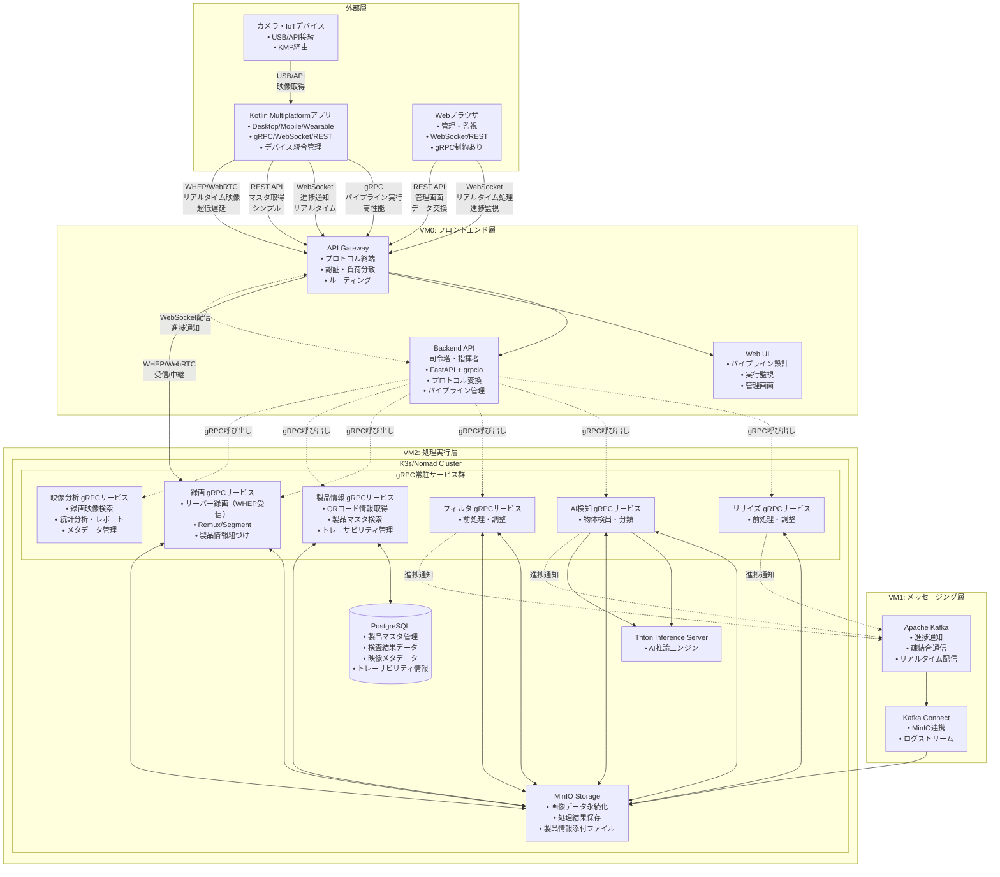

# ImageFlowCanvas システム基本設計書

# 文書管理情報

| 項目       | 内容                               |
| ---------- | ---------------------------------- |
| 文書名     | ImageFlowCanvas システム基本設計書 |
| バージョン | 2.0                                |
| 作成日     | 2025年7月12日                      |
| 更新日     | 2025年8月8日                       |


---

# 1. 概要
## 1.1. 本書の目的

本書は、ImageFlowCanvasシステムの基本設計について詳細に記述するものです。要件定義書で定義された機能要件・非機能要件を実現するための具体的な設計仕様を定義し、開発フェーズでの実装指針を提供します。

## 1.2. 対象読者

- システム開発者
- インフラエンジニア
- プロジェクトマネージャー
- 品質保証担当者

## 1.3. システム概要

ImageFlowCanvasは、Webインターフェースを通じて画像処理の各機能を「部品」として組み合わせ、動的な処理パイプラインを構築・実行できるクラウドネイティブシステムです。また、製造現場での品質管理業務を効率化する検査アプリ機能も統合されています。

**主要特徴：**
- マイクロサービスアーキテクチャによる柔軟な拡張性
- Kubernetesベースのコンテナオーケストレーション
- リアルタイム処理とバッチ処理の両対応
- 動的パイプライン構築機能
- AI検査とマルチプラットフォームアプリによる現場品質管理
- オフライン対応とリアルタイム同期機能
- Kotlin Multiplatformによる統一的なクロスプラットフォーム開発

---

# 2. システム全体構成
## 2.1. 構成図


## 2.2. 技術スタック

### 2.2.1. インフラストラクチャ

| 層             | 技術                    | 役割                           | 選定理由                                              |
| -------------- | ----------------------- | ------------------------------ | ----------------------------------------------------- |
| コンテナ基盤   | K3s/Nomad               | コンテナオーケストレーション   | 軽量でフル機能、gRPC常駐サービス基盤                  |
| 処理エンジン   | gRPC常駐サービス        | 超高速パイプライン実行         | 40-100ms処理、Backend経由でアクセス、Protocol Buffers |
| ストレージ     | MinIO                   | オブジェクトストレージ         | S3互換、オープンソース                                |
| データベース   | PostgreSQL              | 製品情報・検査結果・メタデータ | ACID準拠、JSON対応、豊富なインデックス機能            |
| メッセージング | Apache Kafka            | 進捗通知・疎結合通信           | 高スループット、非同期通知基盤、疎結合アーキテクチャ  |
| AI推論         | Triton Inference Server | 高性能AI推論エンジン           | GPU最適化、モデル管理、並列処理                       |

### 2.2.2. アプリケーション

| 層                     | 技術                           | 役割                                 | 選定理由                                             |
| ---------------------- | ------------------------------ | ------------------------------------ | ---------------------------------------------------- |
| クロスプラットフォーム | Kotlin Multiplatform + Compose | デスクトップ・モバイル・ウェアラブル | 統一コードベース、ネイティブパフォーマンス、gRPC対応 |
| フロントエンド         | React + TypeScript             | Web UI                               | モダンなSPA、型安全性                                |
| バックエンド（司令塔） | FastAPI + grpcio + Python      | ハイブリッドAPI                      | 複数プロトコル対応、高性能、自動ドキュメント生成     |
| 画像処理               | OpenCV + Python                | 画像処理ライブラリ                   | 豊富な機能、Python親和性                             |
| AI処理                 | PyTorch/TensorFlow             | 機械学習フレームワーク               | GPU対応、モデル豊富                                  |

### 2.2.3. 通信プロトコル（適材適所）

| プロトコル  | 用途                       | 担当システム                       | 選定理由                                     |
| ----------- | -------------------------- | ---------------------------------- | -------------------------------------------- |
| gRPC        | AIパイプライン実行         | Kotlin Multiplatform ↔ Backend API | 最高性能、型安全性、バイナリ転送             |
| WebSocket   | リアルタイム進捗通知       | Backend API ↔ 全クライアント       | 疎結合、汎用性、Web標準                      |
| WebSocket   | Webアプリリアルタイム処理  | Webブラウザ ↔ Backend API          | gRPC制約回避、ブラウザネイティブサポート     |
| REST API    | 同期的データ交換           | 全クライアント ↔ Backend API       | シンプル、ステートレス、成熟したエコシステム |
| WHEP/WebRTC | 超低遅延映像ストリーミング | Kotlin Multiplatform ↔ Backend API | 最低遅延、メディア特化、カメラ統合管理       |
| USB/API     | カメラ映像取得             | カメラ ↔ Kotlin Multiplatform      | デバイス直接制御、高画質、安定性             |

## 2.3. システム品質特性

| 品質特性       | 目標値                         | 実現方法                                   |
| -------------- | ------------------------------ | ------------------------------------------ |
| 可用性         | 99.9%                          | 冗長化、自動復旧                           |
| 性能           | 同時100パイプライン            | 水平スケーリング                           |
| 処理速度       | 40-100ms (Backend経由gRPC実行) | gRPC常駐サービス Backend経由呼び出し       |
| リアルタイム性 | <50ms (WebSocket進捗通知)      | Kafka疎結合 + WebSocket配信                |
| 映像遅延       | <20ms (WHEP/WebRTC)            | UDP直接通信、メディア最適化                |
| 拡張性         | ノード追加対応                 | k3s/Nomad                                  |
| セキュリティ   | RBAC対応                       | 認証・認可機能、内部サービス非公開         |
| 疎結合性       | サービス独立性                 | Kafka非同期通信、Backend API司令塔パターン |

---

# 3. システムの通信・連携方式
## 3.1. 処理方式の分類と通信プロトコル

本システムは複数の処理方式をサポートし、それぞれに最適な通信プロトコルを「適材適所」で使い分けます：

### 3.1.1. AIパイプライン実行（gRPC）
- 用途: 画像ファイルのアップロード→AI処理→結果ダウンロード
- 通信: Kotlin Multiplatform/Compose MultiplatformアプリからBackend APIへgRPC（高性能・型安全）
- 処理方式: Backend API司令塔がgRPC常駐サービス群を順次呼び出し
- 性能: 40-100ms処理時間
- 特徴: Protocol Buffers、バイナリ転送、ストリーミング対応

### 3.1.2. リアルタイム進捗通知（WebSocket）
- 用途: 処理進捗のリアルタイム表示
- 通信: Backend APIから全クライアント（Kotlin Multiplatform + Compose + Web）へWebSocket
- 処理方式: gRPCサービス → Kafka → Backend API → WebSocket配信
- 性能: 疎結合・非同期通知
- 特徴: 汎用性、Web標準、管理画面でも共有可能

### 3.1.3. 同期的データ交換（REST API）
- 用途: 検査マスタ取得、履歴検索、認証など
- 通信: 全クライアントからBackend APIへREST API
- 処理方式: ステートレスなリクエスト・レスポンス
- 性能: シンプル・確実
- 特徴: HTTPキャッシュ、デバッグ容易、成熟したエコシステム

### 3.1.4. Webアプリリアルタイム処理（WebSocket）
- 用途: WebブラウザからのリアルタイムAI処理要求
- 通信: WebブラウザからBackend APIへWebSocket（gRPC制約回避）
- 処理方式: WebSocket → Backend API司令塔 → gRPC常駐サービス群
- 性能: gRPCより若干劣るが、Web標準で実装可能
- 特徴: ブラウザネイティブサポート、gRPC-Web/Envoy不要
- 制約対応: WebブラウザではgRPC直接利用不可のため、WebSocketで代替

### 3.1.5. 超低遅延映像ストリーミング（WHEP/WebRTC）
- 用途: カメラからの連続映像ストリーム処理
- 通信: カメラ → Kotlin Multiplatform/Compose（USB/API） → Backend API（WebRTC）
- 処理方式: Kotlin Multiplatform/ComposeがカメラをネイティブAPIで制御し、映像をWebRTCでサーバーに転送
- 性能: <20ms 超低遅延
- 特徴: デバイス統合管理、品質制御、ネットワーク最適化
- プラットフォーム対応: デスクトップ、モバイル、ウェアラブルデバイス

### 3.1.6. 製品情報管理（REST API + gRPC）
- 用途: QRコード情報取得、製品マスタ検索、検査結果・映像の製品情報紐づけ
- 通信: Kotlin Multiplatform/Compose → Backend API → ProductService gRPC
- 処理方式: QRコードデコード結果またはサーバー検索による製品情報取得・紐づけ
- 性能: 高速検索インデックス、キャッシュ機能
- 特徴: 指図番号・指示番号・型式・機番・生産年月日・月連番の統合管理

### 3.1.7. 同時実施の通信構成（WebRTC + サーバー録画 + リアルタイム処理）
- メディア経路: ウェアラブルからH.264（+AAC）をWebRTC（WHEP）でサーバーへ送信
- サーバー側録画: 受信RTPを再エンコードせずfMP4へリマックスし、10–15分のロールリング録画を保持
- リアルタイム処理: 同一ストリームを1回だけデコードして推論パイプラインへ供給（単一デコード原則）
- 制御経路: 録画/配信の開始・停止・品質指示はREST/gRPC、テレメトリ/指示はWebSocket/（必要なら）DataChannel
- 運用方針: 主録画はオンデバイス（4章）。サーバー録画は補助（短期バッファ/監査/追跡）として併用

**詳細な通信プロトコル設計については「0302_サーバーBackend設計.md」を参照してください。**

## 3.3. 通信・連携関連用語集

### 3.3.1. 🔗 通信・連携関連

| 📘 用語                  | 📖 説明                                                                                                  | 🔗 関連技術              |
| :---------------------- | :------------------------------------------------------------------------------------------------------ | :---------------------- |
| 🏗️ Backend API司令塔     | 全ての通信プロトコルを統合管理し、内部gRPCサービス群を指揮するハイブリッドサーバー                      | FastAPI + grpcio        |
| 🎯 適材適所通信          | 各処理の特性に最適な通信プロトコルを使い分ける設計思想                                                  | gRPC/WebSocket/REST     |
| 🔌 WebSocket             | 双方向リアルタイム通信プロトコル。進捗通知とWeb管理画面の共通基盤                                       | HTTP, TCP               |
| � gRPC                  | Kotlin Multiplatformアプリのネイティブ能力を活用した高性能AIパイプライン実行                            | HTTP/2, Protobuf        |
| 📡 REST API              | 同期的データ交換用のシンプルなHTTPベースAPI                                                             | HTTP, JSON              |
| 📺 WHEP/WebRTC           | 超低遅延映像ストリーミング用のWeb標準プロトコル                                                         | UDP, RTP                |
| 📹 カメラ統合管理        | Kotlin Multiplatform/ComposeアプリがカメラをUSB/API制御し、WebRTCでサーバーに転送する統合アーキテクチャ | USB, API, WebRTC        |
| 🔄 疎結合通信            | Kafkaを介した非同期メッセージング。処理サービスとクライアント通信の責任分離                             | Kafka, 非同期           |
| 📨 Topic                 | Kafkaにおけるメッセージの論理的なカテゴリ。進捗通知とメトリクス収集に使用                               | Kafka                   |
| 🆔 execution_id          | パイプライン実行を一意に識別するID。全てのシステム間で処理を追跡するために使用                          | UUID                    |
| 🏷️ file_id               | MinIOに保存された画像ファイルを一意に識別するID                                                         | MinIO, S3               |
| 📦 Protocol Buffers      | Googleが開発したシリアライゼーション形式。gRPCのデフォルト形式                                          | Binary, Schema          |
| 🔄 Streaming RPC         | gRPCの機能で、連続的なデータストリームを効率的に転送する仕組み                                          | gRPC, HTTP/2            |
| 🖥️ Native Backend        | Kotlin Multiplatformアプリのネイティブ部分（Kotlin/Native）。高性能処理を実現                           | Kotlin/Native           |
| 🌐 Compose UI            | Kotlin MultiplatformアプリのUI部分（Compose Multiplatform）。宣言的UIを構築                             | Compose, Kotlin         |
| 🎯 Kotlin Multiplatform  | 統一コードベースでデスクトップ・モバイル・ウェアラブル対応するアプリ開発基盤                            | Kotlin, JVM, Native     |
| 🎨 Compose Multiplatform | 宣言的UIフレームワーク。全プラットフォーム共通のUI構築                                                  | Compose, Kotlin         |
| 📱 Platform Channels     | Kotlin MultiplatformでネイティブAPI（カメラ、センサー）にアクセスする仕組み                             | JNI, Native Binding     |
| 📦 ProductService        | 製品情報管理専用のgRPCサービス。QRコード情報取得と製品マスタ検索を担当                                  | gRPC, PostgreSQL        |
| 📦 VideoAnalysisService  | 録画映像の検索・再生・分析機能を提供するgRPCサービス。                                                  | gRPC, PostgreSQL, MinIO |
| 🏷️ QR Code Decoder       | QRコードから指図番号・指示番号・型式・機番等の製品情報をデコードする機能                                | Computer Vision         |
| 🔍 Product Master        | 製品の基本情報（型式、機番、仕様等）を管理するマスタデータベース                                        | PostgreSQL, Index       |
| 🆔 Work Order ID         | 指図番号。製造指示を一意に識別する番号                                                                  | String, UUID            |
| 📋 Instruction ID        | 指示番号。作業指示を一意に識別する番号                                                                  | String, UUID            |
| 🏭 Product Type          | 型式。製品の種類・モデルを表す識別子                                                                    | String                  |
| 🔢 Machine Number        | 機番。製造機械・設備の識別番号                                                                          | String                  |
| 🎥 Video Recording       | ウェアラブルデバイスで撮影された一人称映像の録画データ                                                  | MP4, Metadata           |
| 🔍 Video Search          | 録画映像を製品情報・日時・検査結果等の条件で検索する機能                                                | SQL, Index              |
| ▶️ Video Playback        | 検索された映像を高品質・高機能で再生する機能                                                            | Streaming, UI           |
| 📊 Video Analytics       | 録画映像データを統計分析し品質改善の洞察を提供する機能                                                  | Analytics, ML           |
| 📅 Production Date       | 生産年月日。製品の製造日                                                                                | Date                    |
| 📊 Monthly Sequence      | 月連番。月内での生産順序を表す連番                                                                      | Integer                 |
| 🔗 Traceability Link     | 製品情報と検査結果・映像を紐づけるトレーサビリティ管理機能                                              | Foreign Key, Index      |

### 3.3.2. 📊 データ・画像関連

| 📘 用語                  | 📖 説明                                                                       | 🔗 関連技術        |
| :---------------------- | :--------------------------------------------------------------------------- | :---------------- |
| 🗂️ Payload               | Kafkaメッセージに含まれるデータ本体。進捗通知やメトリクス用JSON形式          | JSON, Kafka       |
| 📋 Pipeline Definition   | パイプラインの構成（処理ステップ、依存関係、パラメータ）を定義したデータ構造 | YAML, JSON        |
| 📈 Progress Notification | パイプライン実行中の各ステップの進捗状況を通知するメッセージ                 | Kafka, WebSocket  |
| 🧩 Image Chunk           | 大容量画像を分割したデータ片。ストリーミング転送で使用される                 | Binary, Base64    |
| 🔗 Correlation ID        | クライアントリクエストと処理結果を紐づけるための一意識別子                   | UUID, String      |
| 📷 Image Metadata        | 画像の解像度、フォーマット、撮影情報などの付属データ                         | EXIF, JSON        |
| ⚡ Client ID             | 外部クライアントを一意に識別するID。認証と処理追跡に使用                     | String, UUID      |
| 🎬 VideoFrame            | リアルタイム映像ストリーミング用のProtoBufメッセージ形式                     | Protobuf, gRPC    |
| 🎯 ProcessedFrame        | 処理済み映像フレームとAI検出結果を含むレスポンスメッセージ                   | Protobuf, gRPC    |
| 📦 Product Info          | QRコードまたはサーバー検索から取得した製品情報（指図番号、型式、機番等）     | JSON, Database    |
| 🔗 Inspection Link       | 検査結果と製品情報の紐づけ関係を表すデータ構造                               | Foreign Key, JSON |
| 📹 Video Metadata        | 一人称映像に紐づけられた製品情報とタイムスタンプ等のメタデータ               | JSON, Index       |
| 🎯 QR Scan Result        | QRコードスキャンの結果として取得された製品識別情報                           | JSON, String      |
| 🔍 Product Search Query  | サーバーでの製品情報検索に使用するクエリパラメータ                           | JSON, SQL         |
| 📊 Traceability Record   | 製品のトレーサビリティを実現するための履歴記録データ                         | JSON, Audit Log   |

---

# 4. 一人称映像の録画機能（ウェアラブル）

本章は概要のみを記載します。詳細仕様（メディア/ストレージ/同期/制御API/監視/同時実施戦略等）は「0311_THINKLETアプリ設計.md」を参照してください。

## 4.1. 概要
- 目的: 現場作業の一人称映像を継続録画し、ネットワーク状態に応じて安全に同期する
- 運用方針: 主録画=オンデバイス録画（セグメント化・後同期）、補助=サーバーサイド録画（WebRTC受信のロールリング）
- 保存: 365日保存（ライフサイクル管理）
- 通信: 映像はWebRTC（WHEP）でリアルタイム処理に供給、制御はREST/gRPC、通知はKafka/WebSocket

参考: 詳細は docs/0300_設計_アプローチ1/0311_THINKLETアプリ設計.md の「録画機能設計」を参照。

---

# 5. 製品情報管理システム

## 5.1. 概要

製品情報管理システムは、製造現場での検査業務において製品のトレーサビリティを確保するための中核機能です。QRコードスキャンとサーバー検索の両方により製品情報を取得し、検査結果や一人称映像と紐づけて記録します。

## 5.2. システム構成

### 5.2.1. 製品情報管理アーキテクチャ


### 5.2.2. データモデル設計

#### 製品マスタテーブル
```sql
CREATE TABLE product_master (
    id UUID PRIMARY KEY,
    work_order_id VARCHAR(50) NOT NULL,    -- 指図番号
    instruction_id VARCHAR(50) NOT NULL,   -- 指示番号
    product_type VARCHAR(100) NOT NULL,    -- 型式
    machine_number VARCHAR(50) NOT NULL,   -- 機番
    production_date DATE NOT NULL,         -- 生産年月日
    monthly_sequence INTEGER NOT NULL,     -- 月連番
    qr_code_data TEXT,                     -- QRコード情報
    created_at TIMESTAMP DEFAULT NOW(),
    updated_at TIMESTAMP DEFAULT NOW(),
    
    -- インデックス
    INDEX idx_work_order (work_order_id),
    INDEX idx_product_type_machine (product_type, machine_number),
    INDEX idx_production_date (production_date),
    UNIQUE KEY uk_product_sequence (product_type, machine_number, production_date, monthly_sequence)
);
```

#### 検査結果テーブル
```sql
CREATE TABLE inspection_results (
    id UUID PRIMARY KEY,
    product_id UUID NOT NULL,              -- 製品マスタFK
    inspection_type VARCHAR(50) NOT NULL,   -- 検査種別
    result_status VARCHAR(20) NOT NULL,     -- OK/NG
    ai_confidence DECIMAL(5,4),            -- AI信頼度
    human_verified BOOLEAN DEFAULT FALSE,   -- 人による確認
    defect_details JSON,                   -- 不良詳細
    inspector_id VARCHAR(50),              -- 検査者ID
    inspection_timestamp TIMESTAMP DEFAULT NOW(),
    image_files JSON,                      -- 検査画像ファイル一覧
    
    FOREIGN KEY (product_id) REFERENCES product_master(id),
    INDEX idx_product_inspection (product_id, inspection_timestamp),
    INDEX idx_result_status (result_status),
    INDEX idx_inspection_date (inspection_timestamp)
);
```

#### 映像メタデータテーブル
```sql
CREATE TABLE video_metadata (
    id UUID PRIMARY KEY,
    product_id UUID NOT NULL,              -- 製品マスタFK
    video_file_path VARCHAR(500) NOT NULL, -- MinIOファイルパス
    recording_start_time TIMESTAMP NOT NULL,
    recording_end_time TIMESTAMP,
    file_size BIGINT,
    duration_seconds INTEGER,
    device_id VARCHAR(100),                -- 撮影デバイスID
    device_type VARCHAR(50),               -- THINKLET/Mobile等
    metadata JSON,                         -- 追加メタデータ
    
    FOREIGN KEY (product_id) REFERENCES product_master(id),
    INDEX idx_product_video (product_id, recording_start_time),
    INDEX idx_recording_time (recording_start_time),
    INDEX idx_device (device_id)
);
```

## 5.3. 機能詳細

### 5.3.1. QRコード情報取得機能

**処理フロー**:
1. カメラでQRコードをスキャン
2. QRコードのデコード処理
3. デコード結果の検証・パース
4. 製品マスタDBでの情報補完
5. アプリケーションへの情報返却

**実装技術**:
- QRコードライブラリ: ZXing (Android/iOS対応)
- 画像処理: OpenCV (エッジ検出・品質向上)
- デコード検証: 正規表現・チェックサム

### 5.3.2. サーバー情報取得機能

**検索機能**:
- 型式による部分一致検索
- 機番による完全一致検索
- 生産年月日範囲検索
- 複合条件検索

**最適化機能**:
- オートコンプリート (Redis Cache)
- 検索履歴の保存・再利用
- インデックス最適化
- ページネーション対応

### 5.3.3. 製品情報紐づけ機能

**検査結果紐づけ**:
- 検査実行時の自動製品情報取得
- 必須フィールドのバリデーション
- 製品情報と検査結果の整合性チェック
- 一括更新・修正機能

**映像紐づけ**:
- 録画開始時の製品情報埋め込み
- 映像ファイルメタデータへの情報記録
- タイムスタンプ連携
- 工程別セグメンテーション

## 5.4. 非機能要件

### 5.4.1. 性能要件
- QRコードスキャン: <500ms
- 製品検索レスポンス: <200ms
- データベース検索: インデックス利用で<100ms
- 同時接続: 100ユーザー対応

### 5.4.2. 可用性要件
- データベース冗長化: Master-Slave構成
- バックアップ: 日次フルバックアップ + 時間別差分
- 障害時復旧: RTO 1時間以内、RPO 15分以内

### 5.4.3. セキュリティ要件
- アクセス制御: RBAC (検査者・管理者・閲覧者)
- データ暗号化: 保存時・転送時ともにAES-256
- 監査ログ: 全ての更新操作を記録

---

# 6. 録画映像分析システム (VideoAnalysisService)

## 6.1. 概要

ウェアラブルデバイスで録画された一人称映像に対する検索・再生・分析機能を統合的に提供し、品質管理と作業効率向上を支援します。


## 6.2. 録画映像の検索機能設計

### 6.2.1. 検索インターフェース

**主要検索条件**:
- 📦 製品情報: 指図番号・指示番号・型式・機番・月連番
- 📅 録画日時: 日時範囲、相対期間（今日、今週、先月等）
- 👤 録画者: ユーザーID、部署、チーム
- 🔍 検査結果: OK/NG、不良種別、信頼度スコア
- 🏷️ タグ: カスタムタグ、キーワード
- 📍 場所: 工場、ライン、工程

**高度検索機能**:
- 複合条件による絞り込み
- 全文検索（コメント・備考フィールド）
- 類似映像検索（AI画像解析ベース）
- 検索履歴の保存・再利用
- お気に入り検索パターン

### 6.2.2. 検索性能最適化

**インデックス戦略**:
```sql
-- 複合インデックス（主要検索パターン）
CREATE INDEX idx_video_search_main ON video_recordings 
(product_type, machine_number, recorded_date, inspection_result);

-- 全文検索インデックス
CREATE INDEX idx_video_fulltext ON video_recordings 
USING gin(to_tsvector('japanese', comments || ' ' || tags));

-- 製品情報インデックス（高速絞り込み）
CREATE INDEX idx_product_info ON video_recordings 
(work_order_id, instruction_id, month_sequence);
```

**キャッシュ戦略**:
- Redis: 検索結果のキャッシュ（5分TTL）
- 人気検索パターンの事前計算
- 検索履歴ベースの推奨検索

## 6.3. 録画映像の再生機能設計

### 6.3.1. 高品質再生システム

**映像配信最適化**:
- HTTP Adaptive Streaming（HLS/DASH）
- 複数解像度対応（4K/1080p/720p/480p）
- 帯域幅に応じた自動品質調整
- プログレッシブダウンロード対応

**再生制御機能**:
- 可変速度再生（0.25x～4.0x）
- フレーム単位コマ送り・コマ戻し
- 精密タイムラインシーク
- チャプター/ブックマーク機能
- ループ再生・区間リピート

### 6.3.2. AI解析結果重畳表示

**不良検出可視化**:
- 検出箇所のリアルタイムハイライト
- 信頼度スコアのヒートマップ表示
- 検出履歴のタイムライン表示
- アノテーション・コメント重畳

**インタラクティブ機能**:
- 検出箇所クリックで詳細表示
- 判定根拠画像のポップアップ
- 手動アノテーション追加
- 検査員コメントの時系列表示

## 6.4. 録画映像の分析・レポート機能設計

### 6.4.1. 統計ダッシュボード

**録画データ統計**:
- 総録画時間・件数・容量の推移
- 日別・週別・月別の録画パターン
- ユーザー別・設備別の利用状況
- ストレージ使用量とライフサイクル状況

**品質統計**:
- 不良検出率の時系列変化
- 製品別・工程別の品質トレンド
- AI判定精度と人間判定の乖離分析
- 改善効果の定量評価

### 6.4.2. 高度分析機能

**パターン分析**:
- 異常検出アルゴリズムによる品質異常の早期発見
- 機械学習による不良予測モデル
- 作業手順と品質結果の相関分析
- 季節性・周期性の自動検出

**作業効率分析**:
- 作業時間の統計分析
- 手順遵守率の測定
- ベストプラクティスの抽出
- 作業者パフォーマンス比較

### 6.4.3. レポート生成

**定期レポート**:
- 日次・週次・月次の自動レポート生成
- PDF・Excel形式でのエクスポート
- 管理者向けサマリーレポート
- 現場向け改善提案レポート

**カスタムレポート**:
- ユーザー定義のレポートテンプレート
- SQLクエリベースの柔軟な集計
- グラフ・チャートの自動生成
- スケジュール配信機能

## 6.5. 技術仕様

### 6.5.1. API設計
```protobuf
service VideoAnalysisService {
  // 検索機能
  rpc SearchVideos(VideoSearchRequest) returns (VideoSearchResponse);
  rpc GetSearchSuggestions(SuggestionRequest) returns (SuggestionResponse);
  
  // 再生機能
  rpc GetVideoStream(VideoStreamRequest) returns (stream VideoChunk);
  rpc GetVideoMetadata(VideoMetadataRequest) returns (VideoMetadataResponse);
  
  // 分析機能
  rpc GenerateAnalyticsReport(AnalyticsRequest) returns (AnalyticsResponse);
  rpc GetDashboardData(DashboardRequest) returns (DashboardResponse);
}
```

### 6.5.2. 性能要件
- 検索レスポンス: <500ms（通常条件）、<2秒（複雑条件）
- 映像再生開始: <3秒（初回）、<1秒（キャッシュ済み）
- 分析レポート生成: <30秒（標準レポート）、<5分（大規模データ）
- 同時再生: 100ストリーム（1080p）
- 同時検索: 500リクエスト/秒

### 6.5.3. 保存期間とライフサイクル
- 録画映像: 1年間保存
- メタデータ: 3年間保存
- 分析結果: 永続保存
- レポート: 5年間保存

---

# 6. プラットフォーム対応戦略

## 5.1. マルチプラットフォーム開発方針

ImageFlowCanvasシステムは、多様なプラットフォームでの利用を想定し、以下の2つの主要なクロスプラットフォーム技術を併用します：

### 5.1.1. プラットフォーム対応マトリックス

| プラットフォーム | Kotlin Multiplatform | 主要用途                   | 選定理由                   |
| ---------------- | -------------------- | -------------------------- | -------------------------- |
| Windows Desktop  | ✅                    | 管理業務、パイプライン設計 | ネイティブ性能とコード共有 |
| macOS Desktop    | ✅                    | 管理業務、パイプライン設計 | ネイティブ性能とコード共有 |
| Linux Desktop    | ✅                    | 管理業務、パイプライン設計 | ネイティブ性能とコード共有 |
| Android Mobile   | ✅                    | 現場検査、品質管理         | Kotlin MPがモバイル最適    |
| iOS Mobile       | ✅                    | 現場検査、品質管理         | Kotlin MPがモバイル最適    |
| Wear OS          | ✅                    | クイック確認、アラート     | Kotlin MPが専用対応        |
| watchOS          | ✅                    | クイック確認、アラート     | Kotlin MPが専用対応        |

---

---

# 6. Backend API設計概要

**Backend APIの詳細設計・実装仕様については「0302_サーバーBackend設計.md」を参照してください。**

Backend APIは複数の通信プロトコルを統合管理する「司令塔」として機能し、以下の責務を担います：
- プロトコル変換（gRPC、WebSocket、REST APIの統合管理）
- パイプライン実行制御
- リアルタイム進捗配信
- 認証・認可
- Web制約対応

---

# 7. Kafkaメッセージング概要

**Kafkaメッセージング基盤の詳細については「0302_サーバーBackend設計.md」を参照してください。**

Kafkaは以下の用途で使用されます：
- 進捗通知（パイプライン実行状況）
- 監視メトリクス（システム状態）
- 映像アーカイブ（選択的永続化）
- 分析結果配信（リアルタイム通知）