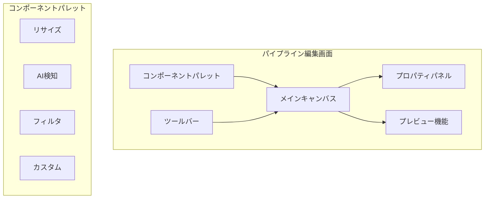
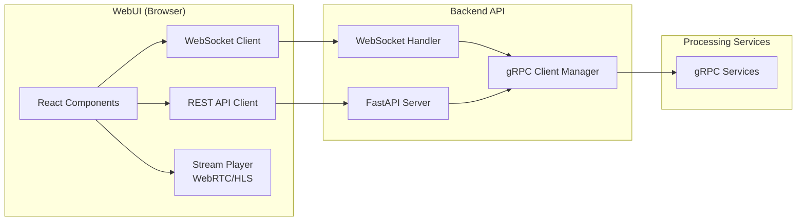
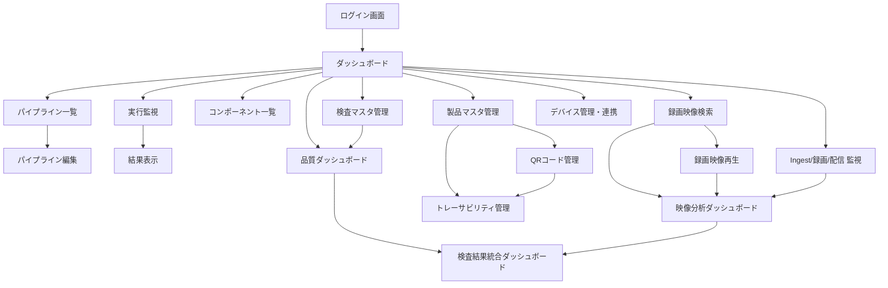

# ImageFlowCanvas WebUI設計書

# 文書管理情報

| 項目       | 内容                        |
| ---------- | --------------------------- |
| 文書名     | ImageFlowCanvas WebUI設計書 |
| バージョン | 1.1                         |
| 作成日     | 2025年7月27日               |
| 更新日     | 2025年8月13日               |

---

# 1. 概要

## 1.1. 本書の目的

本書は、ImageFlowCanvasシステムのWebUIコンポーネントの詳細設計について記述します。要件定義書で定義された機能要件とシステム基本設計書で定義されたアーキテクチャに基づき、Webブラウザでの画像処理パイプライン管理とKotlin Multiplatformアプリケーションとの連携を実現するWebUIの設計仕様を提供します。

## 1.2. WebUIの役割と位置づけ

ImageFlowCanvasシステムにおけるWebUIは以下の役割を担います：

### 1.2.1. パイプライン管理の中核システム
- **パイプライン設計**: ドラッグ&ドロップによる直感的なパイプライン構築
- **コンポーネント管理**: 処理コンポーネントの登録・管理・バージョン管理
- **実行管理**: パイプライン実行・監視・結果確認

### 1.2.2. 統合管理ダッシュボード
- **システム監視**: リアルタイムシステム状況の可視化
- **実行状況管理**: 全パイプライン実行の監視・制御
- **品質管理**: 検査結果の統計・分析・レポート生成
- **製品情報管理**: 製品マスタ・QRコード情報・トレーサビリティの一元管理

### 1.2.3. Kotlin Multiplatformアプリとの連携基盤
- **パイプライン共有**: WebUIで定義したパイプラインをKotlin Multiplatformアプリで利用
- **検査マスタ管理**: 検査対象・項目の一元管理
- **製品マスタ管理**: 製品情報・QRコード・トレーサビリティデータの統合管理
- **結果統合表示**: Kotlin Multiplatformアプリからの検査結果・映像を統合表示

## 1.3. WebブラウザでのgRPC制約とソリューション

### 1.3.1. 制約事項
Webブラウザ環境では以下の制約により、gRPCを直接利用できません：
- HTTP/2の機能制限
- バイナリプロトコルサポートの不完全性
- CORS（Cross-Origin Resource Sharing）制約

### 1.3.2. WebSocketソリューション

本システムでは、gRPC-Web + Envoyの複雑性を避け、WebSocketベースのソリューションを採用します：

```
Webブラウザ → WebSocket → Backend API → gRPC Services
```

**利点:**
- シンプルな設定・運用
- Web標準による高い互換性
- リアルタイム双方向通信
- 既存HTTPインフラでの動作

補足（映像視聴）:
- ブラウザでの映像視聴は、サーバ分岐された配信（WebRTC/HLS）をプレイヤーで受信します。ブラウザ自体は映像インジェストを行いません（THINKLETはWHEPで単一路インジェスト）。

# 2. WebUIでのパイプライン作成

## 2.1. パイプライン設計インターフェース

WebUIでは、ユーザーが直感的にパイプラインを設計・実行できるよう、以下の機能を提供します。

### 2.1.1. ビジュアルパイプライン編集画面



### 2.1.2. パイプライン構築フロー

1. **コンポーネント配置**: パレットからキャンバスへドラッグ&ドロップ
2. **接続定義**: コンポーネント間を接続線で結合
3. **パラメータ設定**: 各コンポーネントの詳細パラメータ設定
4. **実行順序定義**: 直列・並列実行の組み合わせ設定
5. **テスト実行**: サンプル画像での動作確認
6. **保存・公開**: パイプライン定義の保存と検査システムでの利用開始

## 2.2. コンポーネント管理機能

### 2.2.1. 登録済みコンポーネント
- **リサイズサービス**: 画像サイズ調整・アスペクト比制御
- **AI検知サービス**: YOLO/CNN等による物体検出・分類
- **フィルタサービス**: ノイズ除去・エッジ強調等の前後処理
- **カスタムサービス**: ユーザー定義の追加処理コンポーネント

### 2.2.2. コンポーネント詳細管理
- バージョン管理・更新履歴
- パフォーマンス統計・使用状況
- 入出力スキーマ定義・バリデーション
- リソース要件・制約事項

# 3. 処理方式設計

## 3.1. バッチ処理（パイプライン実行）概要

- **実行方式**: Backend経由gRPC呼び出し（メイン）
- **処理時間**: 40-100ms
- **データ永続化**: MinIOに保存
- **進捗通知**: WebSocket + Kafka
- **用途**: 画像ファイル処理、バッチ分析

## 3.2. リアルタイム処理（ストリーミング）概要

- **実行方式**: 
  - THINKLET: WebRTC(WHEP)でサーバーへ単一路インジェスト（サーバ分岐）
  - 端末アプリ（ハンディーターミナル/デスクトップ）: gRPCストリーミングでサーバーと双方向通信
- **視聴/監視（WebUI）**: WebSocketで結果・統計を購読、配信映像（WebRTC/HLS）をプレイヤーで再生
- **レイテンシ目標**: <20ms（WHEP経路）。gRPC経路はアプリ→サーバで<50msを目標
- **用途**: ライブ映像監視、AI結果のリアルタイム表示、状態・統計可視化

---

# 4. 検査マスタ設定・統合管理

## 4.1. 検査対象マスタ管理

### 4.1.1. 製品・部品マスタ
- **製品情報管理**: 製品コード・名称・バージョン・説明
- **検査項目関連付け**: 製品別検査項目の定義・管理
- **パイプライン割り当て**: 各検査項目で使用するパイプラインの指定
- **バージョン管理**: 検査仕様の変更履歴・ロールバック

### 4.1.2. 検査項目詳細設定
- **項目種別**: 外観検査・寸法検査・機能検査・文字認識
- **AI有効化**: AI検査の有効/無効設定
- **判定基準**: OK/NG判定基準・許容誤差・単位設定
- **実行順序**: 検査項目の実行順序・必須/任意設定

## 4.2. Kotlin Multiplatformアプリとの連携

### 4.2.1. マスタデータ同期
- **定期同期**: 検査マスタの自動同期（差分更新）
- **オンデマンド同期**: ユーザー要求による即座同期
- **バージョン管理**: マスタデータのバージョン管理・競合解決
- **オフライン対応**: ネットワーク断時のローカルマスタ利用

### 4.2.2. パイプライン配信
- **パイプライン公開**: WebUIで設計したパイプラインの検査システムへの配信
- **設定検証**: パイプライン設定の整合性チェック
- **性能最適化**: 検査環境に応じたパラメータ最適化
- **更新通知**: パイプライン更新時のKotlin Multiplatformアプリへの通知

# 5. 結果確認・分析機能

## 5.1. リアルタイム実行監視

### 5.1.1. 実行状況ダッシュボード
- **同時実行監視**: 複数パイプライン実行の並行監視
- **進捗可視化**: 各ステップの実行状況リアルタイム表示
- **リソース監視**: CPU・GPU・メモリ使用量の監視
- **エラー検出**: 異常発生時の即座アラート・詳細情報表示

### 5.1.2. WebSocketベースリアルタイム通信

```javascript
// 進捗通知の受信例（概要）
{
  "type": "execution_progress",
  "execution_id": "exec-12345",
  "current_step": "ai_detection",
  "progress_percentage": 75.5,
  // ... その他詳細情報
}
```

## 5.2. 実行履歴・結果分析

### 5.2.1. 履歴管理機能
- **検索・フィルタリング**: 日付・ステータス・パイプライン別検索
- **詳細表示**: 実行ログ・パラメータ・生成画像の詳細確認
- **比較分析**: 複数実行結果の比較・差分表示
- **エクスポート**: 結果データのCSV・PDF出力

### 5.2.2. 統計・品質分析
- **実行統計**: 成功率・平均処理時間・エラー傾向分析
- **品質メトリクス**: AI検査精度・人による修正率の追跡
- **パフォーマンス分析**: 処理時間分析・ボトルネック特定
- **トレンド分析**: 長期品質傾向・改善点の可視化

## 5.3. 検査結果統合表示

### 5.3.1. Kotlin Multiplatformアプリ検査結果の統合
- **検査履歴一覧**: 全検査結果の統合表示
- **品質ダッシュボード**: 合格率・不良率・不良傾向の可視化
- **トレーサビリティ**: 製品ごとの検査履歴追跡
- **アラート管理**: 不良検出・異常傾向の通知管理

### 5.3.2. レポート機能
- **定期レポート**: 日次・週次・月次の品質レポート自動生成
- **カスタムレポート**: ユーザー定義条件でのレポート作成
- **グラフィカル表示**: チャート・グラフによる視覚的分析
- **データエクスポート**: 分析データの外部システム連携

---

# 6. UI/UX設計 

## 6.1. アーキテクチャ概要

### 6.1.1. 技術スタック
- **フロントエンド**: React + TypeScript + Material-UI
- **状態管理**: React Context + Redux Toolkit
- **通信**: WebSocket (リアルタイム) + REST API (データ交換)
- **ビルドツール**: Vite (高速開発・ビルド)
- **テスト**: Jest + React Testing Library

### 6.1.2. 通信アーキテクチャ


## 6.2. UI コンポーネント設計

### 6.2.1. 画面構成・ナビゲーション



### 6.2.2. 主要画面仕様

| 画面名                     | 機能                   | UI要素                                                                                           | 特記事項                           |
| -------------------------- | ---------------------- | ------------------------------------------------------------------------------------------------ | ---------------------------------- |
| ダッシュボード             | システム状況表示       | ・実行中パイプライン数<br/>・リソース使用状況<br/>・最近の実行履歴<br/>・検査統計サマリー        | WebSocket通信でリアルタイム更新    |
| パイプライン編集           | 視覚的パイプライン構築 | ・コンポーネントパレット<br/>・ドラッグ&ドロップエディタ<br/>・接続線描画<br/>・プロパティパネル | React DnD使用                      |
| 実行監視                   | リアルタイム進捗表示   | ・進捗バー<br/>・ステップ状況<br/>・ログストリーミング<br/>・キャンセル機能                      | WebSocket進捗通知                  |
| 結果表示                   | 処理結果確認           | ・画像ビューア<br/>・Before/After比較<br/>・メタデータ表示<br/>・ダウンロード機能                | 画像表示最適化                     |
| 録画映像検索               | 映像検索・絞り込み     | ・製品情報検索<br/>・期間条件絞り込み<br/>・高度検索<br/>・検索結果一覧                          | ・一括操作機能                     |
| 録画映像再生               | 4K映像再生・解析       | ・4K映像プレイヤー<br/>・AI解析結果重畳<br/>・コメント機能<br/>・詳細情報表示                    | ・フレーム単位制御                 |
| 映像分析ダッシュボード     | 統計・レポート分析     | ・録画統計<br/>・品質分析グラフ<br/>・レポート生成<br/>・アラート表示                            | ・Chart.js使用                     |
| 製品マスタ管理             | 製品情報CRUD           | ・製品一覧<br/>・編集フォーム<br/>・QRコード生成<br/>・一括操作                                  | ページネーション・監査ログ         |
| QRコード管理               | QRスキャン履歴管理     | ・スキャン履歴<br/>・生成管理<br/>・フォーマット設定<br/>・印刷機能                              | PDF出力・履歴追跡                  |
| トレーサビリティ管理       | 製品追跡・履歴表示     | ・製品検索<br/>・タイムライン表示<br/>・関連ファイル<br/>・詳細情報                              | 時系列表示・ファイル連携           |
| 検査マスタ管理             | 検査設定管理           | ・製品マスタCRUD<br/>・検査項目設定<br/>・パイプライン割り当て<br/>・同期状況表示                | Kotlin Multiplatformアプリとの連携 |
| 品質ダッシュボード         | 検査結果分析           | ・統計チャート<br/>・トレンド分析<br/>・アラート表示<br/>・レポート生成                          | Chart.js使用                       |
| 検査結果統合ダッシュボード | 統合品質管理           | ・KPIサマリー<br/>・製品別品質状況<br/>・時系列トレンド<br/>・映像管理統計                       | WebUI+アプリ統合表示               |
| デバイス管理・連携         | アプリ連携状況管理     | ・同期状況表示<br/>・デバイス一覧<br/>・使用統計<br/>・手動同期                                  | リアルタイム状態監視               |
| Ingest/録画/配信 監視      | 映像経路監視           | ・接続数<br/>・E2E遅延<br/>・ドロップ率<br/>・復旧時間<br/>・未送信件数<br/>・キュー滞留        | WebSocketリアルタイム更新          |

## 6.3. 詳細画面設計

### 6.3.1. ダッシュボード画面
**レイアウト**: 4×3グリッドベースのカード型レイアウト

**主要カード**:
- システム状況: 稼働時間・ヘルスステータス
- パイプライン実行状況: 実行中・完了・失敗数の表示  
- リソース監視: CPU・GPU・メモリ使用率（リアルタイム更新）
- 最近の実行履歴: 最新10件の実行結果
- 検査統計: 日次/週次/月次の合格率・不良率
- アラート: システム・品質に関する警告通知
- クイックアクション: 新規パイプライン作成・実行開始ボタン
- お気に入りパイプライン: よく使用するパイプラインへのクイックアクセス

**リアルタイム更新**:
- WebSocket接続による自動更新（5秒間隔）
- データ更新時のアニメーション効果
- ネットワーク切断時のオフライン表示

### 6.3.2. パイプライン編集画面
**メインキャンバス**:
- 無限スクロール対応のメインエリア
- グリッドスナップ機能付きドラッグ&ドロップ
- ズーム（25%-400%）・パン機能
- 複数選択・一括操作機能

**コンポーネントパレット**:
- カテゴリ別タブ（前処理・AI処理・後処理・カスタム）
- 検索・フィルタリング機能
- ドラッグプレビュー機能
- 使用頻度による並び替え

**プロパティパネル**:
- 選択コンポーネントの詳細設定
- 動的フォーム生成（JSON Schema基づく）
- リアルタイムバリデーション
- 設定プリセット機能

**ツールバー**:
- 保存・読み込み・テスト実行
- 元に戻す・やり直し（Ctrl+Z/Ctrl+Y）
- レイアウト自動整理・エクスポート機能

### 6.3.3. 実行監視画面
**実行一覧**:
- 実行中・完了・失敗パイプラインの一覧表示
- 優先度・実行時間による並び替え
- 検索・フィルタリング機能
- 一括操作（キャンセル・削除）

**詳細監視**:
- パイプライン図での進捗可視化
- 各ステップの実行状況・処理時間
- リアルタイムログストリーミング
- リソース使用量グラフ
- Ingest/AI/録画/配信メトリクス: 接続数・E2E遅延・ドロップ率・復旧時間 等

**アクションパネル**:
- 実行キャンセル・強制停止
- 結果ダウンロード・共有
- 再実行・パラメータ変更実行
- 詳細ログ出力

### 6.3.4. 検査マスタ管理画面
**製品マスタ管理**:
- 製品一覧（ページネーション対応）
- 新規登録・編集・削除機能
- 一括インポート・エクスポート
- 変更履歴・バージョン管理

**検査項目設定**:
- 項目一覧・詳細設定フォーム
- パイプライン選択・パラメータ設定
- 判定基準・許容値設定
- プレビュー・テスト実行機能

**同期管理**:
- Kotlin Multiplatformアプリとの同期状況表示
- 手動同期・自動同期設定
- 競合検出・解決機能
- 同期ログ・エラー表示

### 6.3.5. 録画映像検索画面
**検索フィルタエリア**:
- 製品情報検索（指図番号・指示番号・型式・機番・月連番）
- 期間・条件絞り込み（録画日時・録画者・検査結果・不良種別・工程）
- 高度検索オプション（タグ・キーワード・保存済み検索・お気に入り）

**検索結果表示エリア**:
- 検索結果一覧（録画日時・製品ID・作業者・結果・時間・操作）
- 並び順・表示件数設定
- 一括操作（選択項目の一括ダウンロード・比較再生）

### 6.3.6. 録画映像再生画面
**映像プレイヤーエリア**:
- 4K解像度対応映像表示領域
- 不良箇所ハイライト重畳表示
- 再生制御（再生・一時停止・音量・速度・全画面）
- タイムライン操作・フレーム単位制御

**AI解析結果エリア**:
- 不良検出結果一覧（信頼度・位置・種別）
- 検出箇所へのジャンプ機能
- タイムラインでの解析結果表示

**コメント・注釈エリア**:
- 作業者メモ・管理者コメント表示
- 新規コメント追加機能
- タイムスタンプ付きコメント管理

**詳細情報エリア**:
- 製品情報・作業者情報・録画情報・ファイル情報

### 6.3.7. 映像分析ダッシュボード画面
**統計サマリーエリア**:
- 録画データ統計（総録画時間・ファイル数・使用容量・不良検出率）
- KPI表示（今月の主要指標）

**グラフィカル分析エリア**:
- 録画データ統計（日別録画時間・作業者別録画）
- 品質分析（不良率推移・不良種別分布）
- 作業効率分析（作業時間分析・手順遵守率）

**レポート生成エリア**:
- 定期レポート設定（日次・週次・月次）
- カスタムレポート作成
- エクスポート機能（PDF・Excel・CSV）
- スケジュール配信設定

**アラート・通知エリア**:
- 異常検出アラート
- 改善提案表示
- 通知設定・履歴管理

### 6.3.8. 製品マスタ管理画面

**製品マスタ一覧画面**:
- **検索フィルタエリア**: 指図番号・型式・機番・生産年月日による高速検索
- **一覧表示エリア**: ページネーション対応の製品マスタ一覧
- **一括操作エリア**: 新規登録・一括インポート・エクスポート機能

**製品マスタ編集画面**:
- **基本情報入力**: 指図番号・指示番号・型式・機番・生産年月日・月連番
- **QRコード管理**: QRコードデータ生成・プレビュー機能
- **製品仕様設定**: JSON形式での詳細仕様管理
- **監査ログ**: 変更履歴・ユーザー追跡機能

### 6.3.9. QRコード管理画面

**QRコードスキャン履歴画面**:
- **スキャン履歴一覧**: 時刻・ユーザー・デバイス・結果の表示
- **フィルタリング**: 期間・ユーザー・デバイス・結果による絞り込み
- **詳細表示**: スキャンデータの詳細確認・再処理機能

**QRコード生成・管理画面**:
- **一括生成**: 製品範囲指定による一括QRコード生成
- **フォーマット設定**: カスタマイズ可能なQRコードフォーマット
- **印刷機能**: PDF形式での印刷用ダウンロード
- **生成履歴**: QRコード生成の履歴管理

### 6.3.10. トレーサビリティ管理画面

**製品トレーサビリティ表示画面**:
- **製品検索**: 指図番号・型式・機番による製品特定
- **製品情報表示**: 基本情報・仕様の一覧表示
- **タイムライン表示**: QRスキャン・検査実行・映像記録・検査完了の時系列表示
- **関連ファイル**: 検査画像・作業映像・検査レポートへのアクセス

### 6.3.11. 検査結果統合ダッシュボード

**製品別品質ダッシュボード**:
- **KPIサマリー**: 検査数・合格率・平均処理時間・AI信頼度
- **製品タイプ別品質**: タイプ別の品質状況可視化
- **時系列トレンド**: 合格率・処理時間・AI信頼度の推移
- **アラート通知**: 閾値超過・連続不良の警告表示

**映像管理ダッシュボード**:
- **録画統計**: 録画時間・ファイル数・ストレージ使用量
- **映像検索**: 製品・作業者・期間・工程による検索
- **映像一覧**: 検索結果の一覧表示・再生・ダウンロード機能

### 6.3.12. 製品情報連携機能

**Kotlin Multiplatformアプリ連携状況**:
- **同期状況表示**: 最終同期時刻・同期待ちデータ件数
- **デバイス管理**: 接続デバイス一覧・ステータス監視
- **使用統計**: QRスキャン・検査実行・映像録画の統計情報
- **手動同期**: 即座同期実行機能

### 6.3.13. 画面間ナビゲーション設計

**統合ナビゲーション構成**:
- **パイプライン管理**: パイプライン設計・実行監視・履歴
- **映像管理**: 映像検索・再生・分析レポート
- **製品管理**: 製品マスタ・検査項目・トレーサビリティ
- **システム管理**: ユーザー管理・システム設定・デバイス管理

**映像管理機能の画面遷移**:
- ダッシュボード → 映像検索 → 映像再生 → 詳細分析
- ダッシュボード → 分析ダッシュボード → 詳細レポート
- 再生画面から直接ダウンロード・共有機能へのアクセス

## 6.4. レスポンシブデザイン

### 6.4.1. ブレークポイント設計
- **Desktop (1200px+)**: フル機能表示・マルチパネル
- **Tablet (768px-1199px)**: タブ切り替え・縦積みレイアウト
- **Mobile (767px以下)**: シングルカラム・モーダル表示

### 6.4.2. 適応的UI要素
- ナビゲーション: デスクトップ→横並び、モバイル→ハンバーガーメニュー
- データテーブル: デスクトップ→フルテーブル、モバイル→カード表示
- パイプライン編集: デスクトップ→サイドパネル、モバイル→モーダル表示

## 6.5. パフォーマンス最適化

### 6.5.1. レンダリング最適化
- React.memo・useMemoによる不要再レンダリング防止
- 仮想化（react-window）による大量データ表示最適化
- 画像遅延読み込み・プログレッシブローディング
- コンポーネント分割・動的インポート

### 6.5.2. 通信最適化
- WebSocket接続プール・自動再接続
- データキャッシュ・差分更新
- 画像圧縮・フォーマット最適化
- HTTP/2・gzip圧縮活用

## 6.6. アクセシビリティ・ユーザビリティ

### 6.6.1. アクセシビリティ対応
- WCAG 2.1 AA準拠
- キーボードナビゲーション対応
- スクリーンリーダー対応（ARIA属性）
- 色覚異常対応・コントラスト確保

### 6.6.2. ユーザビリティ強化
- 多言語対応（日本語・英語）
- ダークモード・テーマ切り替え
- ショートカットキー・ホットキー
- コンテキストヘルプ・チュートリアル

## 6.7. エラーハンドリング・フィードバック

### 6.7.1. エラー表示戦略
- トースト通知: 一時的な操作結果・軽微なエラー
- モーダル: 重要なエラー・確認が必要な操作
- インライン: フォーム入力エラー・バリデーション
- ページレベル: システムエラー・権限エラー

### 6.7.2. プログレッシブエンハンスメント
- ローディング状態の可視化（スケルトンUI）
- オフライン対応・ネットワークエラー処理
- 段階的機能提供・フォールバック機能
- ユーザーフィードバック収集機能

---
