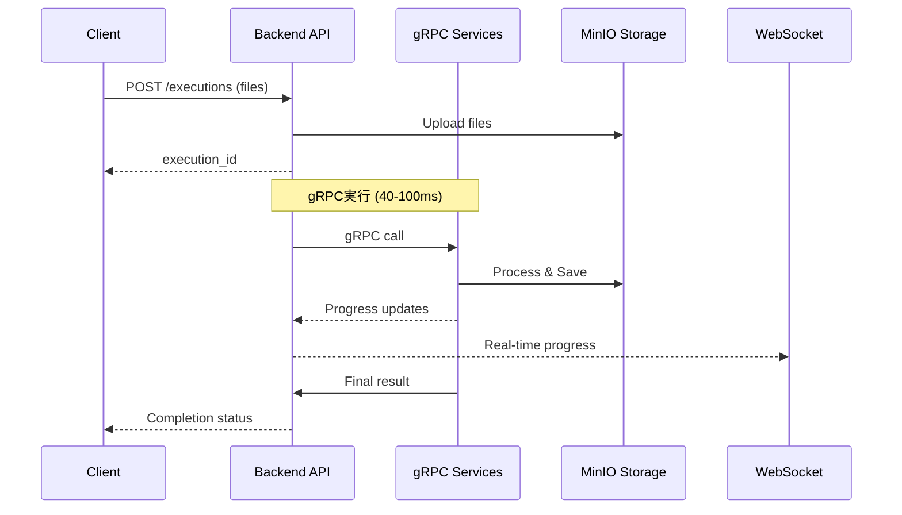
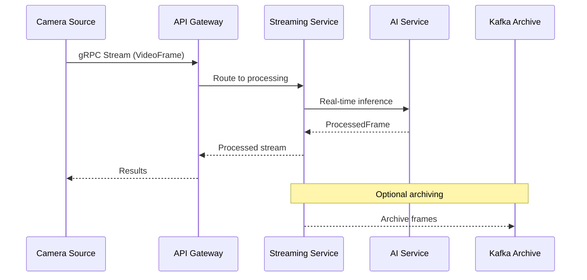

# Webアプリ設計書

# 文書管理情報

| 項目       | 内容            |
| ---------- | --------------- |
| 文書名     | Webアプリ設計書 |
| バージョン | 1.0             |
| 作成日     | 2025年7月27日   |
| 更新日     | 2025年7月27日   |

---

# 1. 概要

---

# 2. Webアプリでのパイプライン作成

Webアプリでは、ユーザーが直感的にパイプラインを設計・実行できるよう、以下の機能を提供します。

---

# 3. 処理方式設計
## 3.1. バッチ処理（パイプライン実行）

処理フロー:

特徴:
- 実行方式: Backend経由gRPC呼び出し（メイン）
- 処理時間: 40-100ms
- データ永続化: MinIOに保存
- 進捗通知: WebSocket + Kafka
- 用途: 画像ファイル処理、バッチ分析

## 3.2. リアルタイム処理（ストリーミング）

処理フロー:

特徴:
- 実行方式: gRPCストリーミング
- レイテンシ: <50ms
- データ: メモリベース処理、選択的アーカイブ
- 用途: ライブ映像処理、リアルタイム監視

---

# 4. マスタ設定

---

# 5. 結果確認