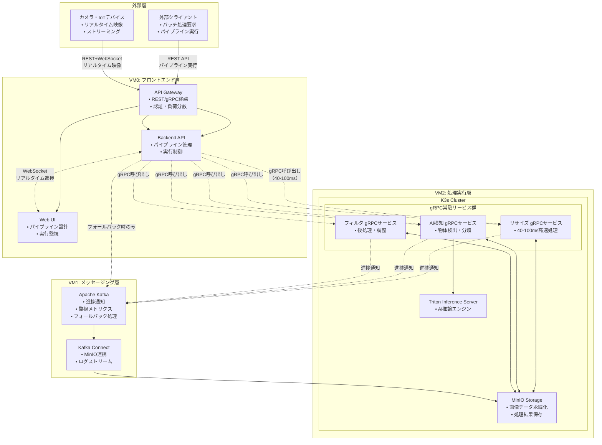

# ImageFlowCanvas システム基本設計書

## **文書管理情報**

| 項目       | 内容                               |
| ---------- | ---------------------------------- |
| 文書名     | ImageFlowCanvas システム基本設計書 |
| バージョン | 1.0                                |
| 作成日     | 2025年7月12日                      |
| 更新日     | 2025年7月12日                      |

---

## **2. システム基本設計**

### **2.1. システム全体構成**

### **2.2. 技術スタック**

#### **2.2.1. インフラストラクチャ**

| 層             | 技術             | 役割                           | 選定理由                                     |
| -------------- | ---------------- | ------------------------------ | -------------------------------------------- |
| コンテナ基盤   | K3s (Kubernetes) | コンテナオーケストレーション   | 軽量でフル機能、gRPC常駐サービス基盤         |
| 処理エンジン   | gRPC常駐サービス | 超高速パイプライン実行         | 40-100ms処理、Backend経由でアクセス、Protocol Buffers |
| ストレージ     | MinIO            | オブジェクトストレージ         | S3互換、オープンソース                       |
| メッセージング | Apache Kafka     | 進捗通知・監視・フォールバック | 高スループット、非同期通知基盤               |
| AI推論         | Triton Server    | 高性能AI推論エンジン           | GPU最適化、モデル管理、並列処理              |

#### **2.2.2. アプリケーション**

| 層             | 技術               | 役割                   | 選定理由                     |
| -------------- | ------------------ | ---------------------- | ---------------------------- |
| フロントエンド | React + TypeScript | Web UI                 | モダンなSPA、型安全性        |
| バックエンド   | FastAPI + Python   | REST API               | 高性能、自動ドキュメント生成 |
| 画像処理       | OpenCV + Python    | 画像処理ライブラリ     | 豊富な機能、Python親和性     |
| AI処理         | PyTorch/TensorFlow | 機械学習フレームワーク | GPU対応、モデル豊富          |

### **2.3. システム品質特性**

| 品質特性       | 目標値                     | 実現方法                     |
| -------------- | -------------------------- | ---------------------------- |
| 可用性         | 99.9%                      | 冗長化、自動復旧             |
| 性能           | 同時100パイプライン        | 水平スケーリング             |
| 処理速度       | 40-100ms (Backend経由gRPC実行) | gRPC常駐サービス Backend経由呼び出し |
| リアルタイム性 | <50ms (WebSocket→gRPCストリーミング) | Backend経由gRPCストリーミング |
| 拡張性         | ノード追加対応             | Kubernetes                   |
| セキュリティ   | RBAC対応                   | 認証・認可機能               |

### **2.4. 処理方式の分類**

本システムは2つの異なる処理方式をサポートします：

#### **2.4.1. バッチ処理（パイプライン実行）**
- **用途**: 画像ファイルのアップロード→処理→結果ダウンロード
- **処理方式**: Backend経由gRPC呼び出し（メイン）、Kafkaフォールバック
- **性能**: 40-100ms処理時間
- **特徴**: ファイルベース、永続化、監査ログ

#### **2.4.2. リアルタイム処理（ストリーミング）**
- **用途**: カメラからの連続映像ストリーム処理
- **処理方式**: WebSocket → Backend → gRPCストリーミング
- **クライアント通信**: すべてのプラットフォームでWebSocketを使用
- **性能**: <50ms レイテンシ
- **特徴**: メモリベース、低遅延、ライブ配信

---

### **2.5. 通信・連携関連用語集**

#### **🔗 通信・連携関連**

| 📘 用語                 | 📖 説明                                                                         | 🔗 関連技術       |
| :--------------------- | :----------------------------------------------------------------------------- | :--------------- |
| **🔌 WebSocket**        | 双方向リアルタイム通信プロトコル。Web UIでのリアルタイム進捗表示に使用         | HTTP, TCP        |
| **📡 SSE**              | Server-Sent Events。サーバーからクライアントへの一方向リアルタイム通信         | HTTP             |
| **📨 Topic**            | Kafkaにおけるメッセージの論理的なカテゴリ。進捗通知とメトリクス収集に使用      | Kafka            |
| **🆔 execution_id**     | パイプライン実行を一意に識別するID。全てのシステム間で処理を追跡するために使用 | UUID             |
| **🏷️ file_id**          | MinIOに保存された画像ファイルを一意に識別するID                                | MinIO, S3        |
| **🚀 gRPC**             | Googleが開発した高性能なRPCフレームワーク。Backend経由でのアクセスで40-100ms処理を実現    | HTTP/2, Protobuf |
| **📦 Protocol Buffers** | Googleが開発したシリアライゼーション形式。gRPCのデフォルト形式                 | Binary, Schema   |
| **🔄 Streaming RPC**    | gRPCの機能で、連続的なデータストリームを効率的に転送する仕組み                 | gRPC, HTTP/2     |
| **⚡ Backend gRPC Call** | KafkaではなくBackend API経由でgRPCサービスを呼び出す高速実行方式                          | gRPC, Backend API   |

#### **📊 データ・画像関連**

| 📘 用語                      | 📖 説明                                                                       | 🔗 関連技術       |
| :-------------------------- | :--------------------------------------------------------------------------- | :--------------- |
| **🗂️ Payload**               | Kafkaメッセージに含まれるデータ本体。進捗通知やメトリクス用JSON形式          | JSON, Kafka      |
| **📋 Pipeline Definition**   | パイプラインの構成（処理ステップ、依存関係、パラメータ）を定義したデータ構造 | YAML, JSON       |
| **📈 Progress Notification** | パイプライン実行中の各ステップの進捗状況を通知するメッセージ                 | Kafka, WebSocket |
| **🧩 Image Chunk**           | 大容量画像を分割したデータ片。ストリーミング転送で使用される                 | Binary, Base64   |
| **🔗 Correlation ID**        | クライアントリクエストと処理結果を紐づけるための一意識別子                   | UUID, String     |
| **📷 Image Metadata**        | 画像の解像度、フォーマット、撮影情報などの付属データ                         | EXIF, JSON       |
| **⚡ Client ID**             | 外部クライアントを一意に識別するID。認証と処理追跡に使用                     | String, UUID     |
| **🎬 VideoFrame**            | リアルタイム映像ストリーミング用のProtoBufメッセージ形式                     | Protobuf, gRPC   |
| **🎯 ProcessedFrame**        | 処理済み映像フレームとAI検出結果を含むレスポンスメッセージ                   | Protobuf, gRPC   |

---

## **関連文書**

- [概要設計](./0300_概要設計.md)
- [アーキテクチャ設計](./0302_アーキテクチャ設計.md)
