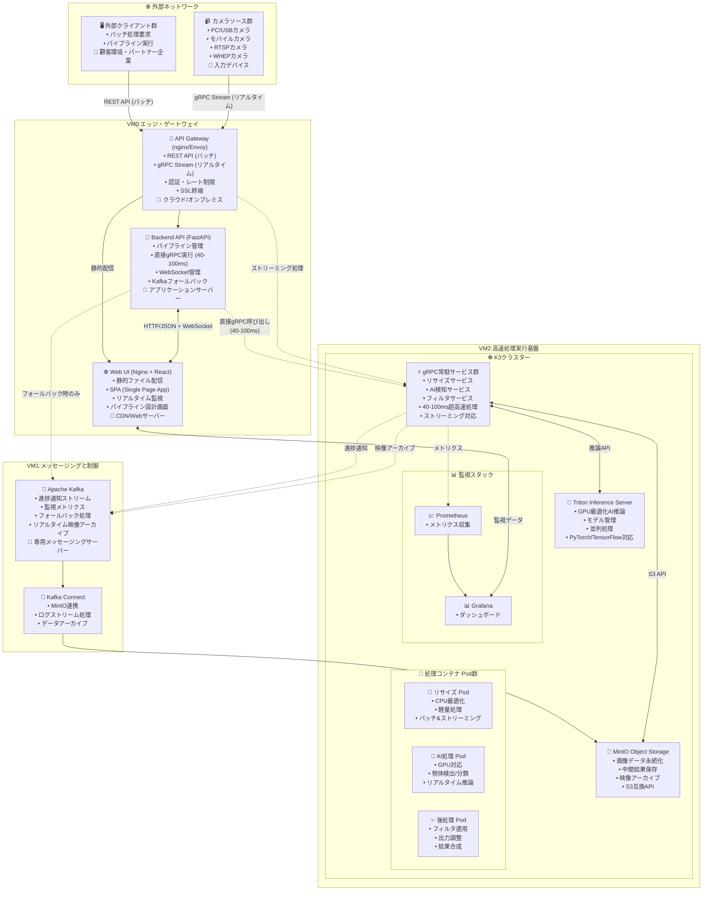
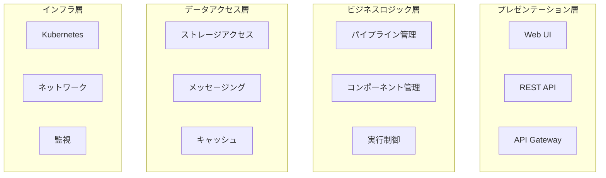
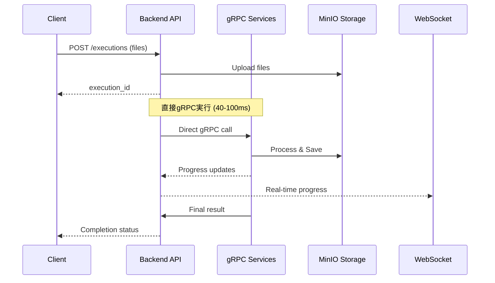
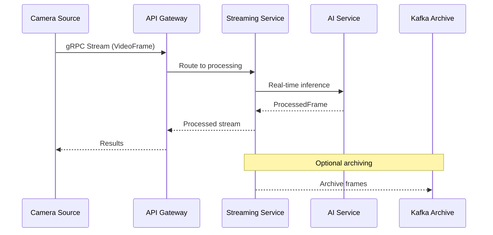
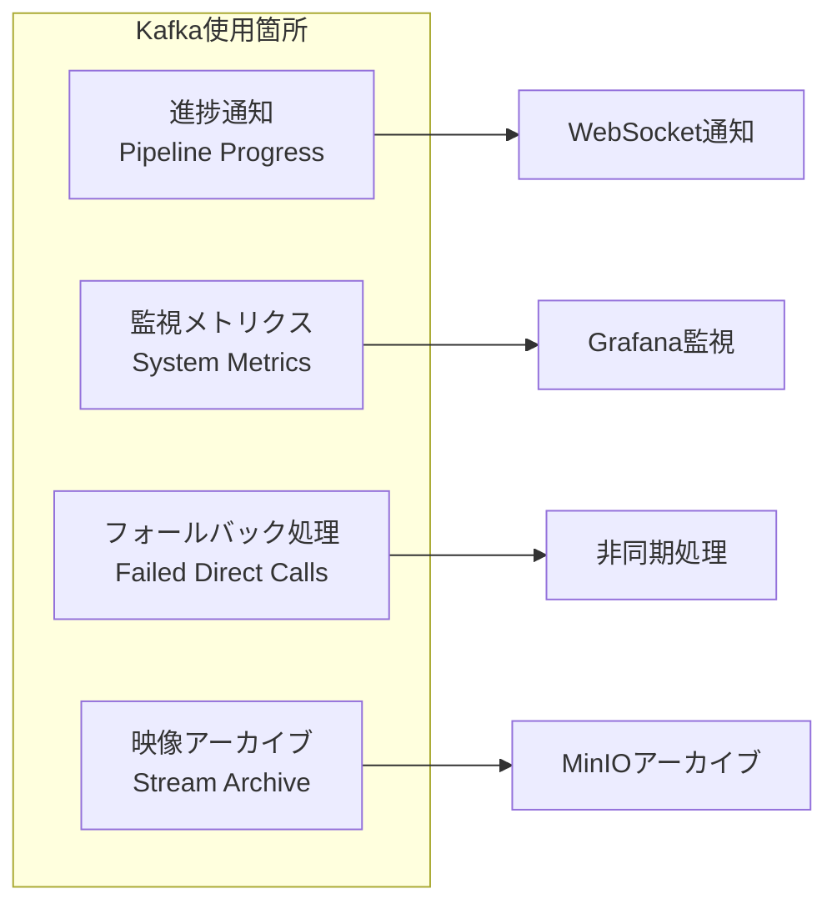
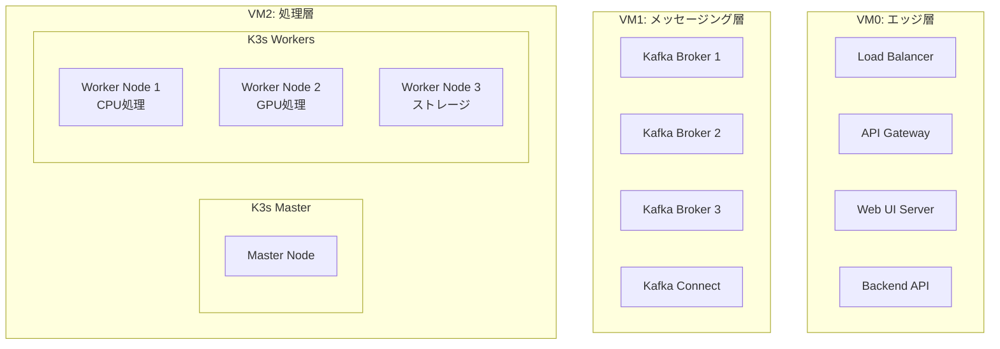

# ImageFlowCanvas アーキテクチャ設計書

## **文書管理情報**

| 項目       | 内容                                 |
| ---------- | ------------------------------------ |
| 文書名     | ImageFlowCanvas アーキテクチャ設計書 |
| バージョン | 1.0                                  |
| 作成日     | 2025年7月12日                        |
| 更新日     | 2025年7月12日                        |

---

## **3. アーキテクチャ設計**

### **3.0. システム全体構成**

#### **3.0.1. システム構成図**

#### **3.0.2. システム構成の説明**

| コンポーネント           | 役割                                        | ホスティング場所                       | 最適プロトコル                    |
| :----------------------- | :------------------------------------------ | :------------------------------------- | :-------------------------------- |
| **🖥️ 外部クライアント**   | バッチ処理要求の送信元                      | 顧客環境・パートナー企業               | REST API (バッチ処理)             |
| **📹 カメラソース群**     | リアルタイム映像ストリーム送信元            | 各種デバイス・ネットワーク             | gRPC Stream (リアルタイム処理)    |
| **🚪 API Gateway**        | 外部アクセスの統一窓口・認証・負荷分散      | VM0 (クラウド/オンプレミス)            | HTTP/2 (gRPC), HTTP/1.1 (REST)    |
| **🔧 Backend API**        | パイプライン管理・直接gRPC実行・制御        | VM0 (アプリケーションサーバー)         | FastAPI (HTTP) + 直接gRPC呼び出し |
| **🌐 Web UI**             | 管理画面・パイプライン設計・監視ダッシュ    | VM0 (CDN/Webサーバー)                  | HTTP/WebSocket                    |
| **📨 Apache Kafka**       | 進捗通知・監視メトリクス・フォールバック    | VM1 (専用メッセージングサーバー)       | TCP (Kafka Protocol)              |
| **🔗 Kafka Connect**      | MinIO連携・ログストリーム・データアーカイブ | VM1 (専用メッセージングサーバー)       | Kafka Streams                     |
| **☸️ K3s**                | コンテナオーケストレーション基盤            | VM2 (高性能コンピューティングサーバー) | Kubernetes API                    |
| **⚡ gRPC常駐サービス群** | 超高速画像処理実行エンジン                  | VM2内のK3s                             | gRPC (Protocol Buffers)           |
| **💾 MinIO**              | オブジェクトストレージ・データ永続化        | VM2内のK3s                             | S3 API (HTTP)                     |
| **🤖 Triton Server**      | AI推論専用サーバー                          | VM2内のK3s                             | gRPC (推論API)                    |

### **3.0.3. 技術スタック**

#### **🏗️ インフラストラクチャ層**

| 🔧 技術                 | 🎯 役割                       | 📝 選択理由                                                                                                                                       |
| :--------------------- | :--------------------------- | :----------------------------------------------------------------------------------------------------------------------------------------------- |
| **☸️ K3s**              | コンテナオーケストレーション | 軽量なKubernetesディストリビューション。gRPC常駐サービス群の安定した運用基盤として採用                                                           |
| **⚡ gRPC常駐サービス** | 超高速処理実行エンジン       | Protocol Buffersベースの高性能バイナリ通信。40-100msの超高速処理を実現するため、直接呼び出し方式を採用。バッチ処理とリアルタイム処理の両方に対応 |
| **💾 MinIO**            | オブジェクトストレージ       | S3互換のオープンソースストレージ。画像データの永続化、gRPCサービス間でのデータ共有、リアルタイム映像アーカイブのために採用                       |
| **📨 Kafka**            | メッセージング               | 高スループットな分散メッセージングシステム。進捗通知、監視メトリクス、フォールバック処理、リアルタイム映像アーカイブを実現するために採用         |
| **🐳 containerd**       | コンテナランタイム           | K3sが内部で利用する軽量なコンテナランタイム                                                                                                      |
| **🤖 Triton Server**    | AI推論エンジン               | GPU最適化されたNVIDIA製推論サーバー。PyTorch/TensorFlowモデルの高性能実行とモデル管理のために採用                                                |

#### **💻 アプリケーション層**

| 🔧 技術        | 🎯 役割                       | 📝 選択理由                                                     |
| :------------ | :--------------------------- | :------------------------------------------------------------- |
| **🐍 Python**  | 処理コンテナ開発言語（推奨） | 機械学習ライブラリが豊富であり、処理コンテナの開発に適している |
| **⚛️ React**   | フロントエンドUI（想定）     | モダンなWebUI構築のため                                        |
| **🚀 FastAPI** | バックエンドAPI（想定）      | PythonベースのAPI開発フレームワーク                            |

#### **🔗 連携・通信層**

| 🔧 技術                         | 🎯 役割                      | 📝 選択理由                                                       |
| :----------------------------- | :-------------------------- | :--------------------------------------------------------------- |
| **🔌 WebSocket**                | リアルタイム通信            | Web UIとBackend API間での進捗状況のリアルタイム通知のため        |
| **📡 Server-Sent Events (SSE)** | 一方向リアルタイム通信      | WebSocketの代替として、シンプルなリアルタイム通知のため          |
| **🔄 kafka-python**             | Kafkaクライアントライブラリ | 進捗通知とメトリクス送信のためのKafkaアクセス用                  |
| **📋 REST API**                 | 同期通信                    | 標準的なHTTP APIによるバッチ処理リクエスト・レスポンス通信のため |
| **🚀 gRPC**                     | 高性能RPC通信               | 低レイテンシが必要なバッチ・リアルタイム画像処理のため           |
| **📨 Protocol Buffers**         | シリアライゼーション        | gRPCでの効率的なバイナリデータ転送のため                         |
| **⚡ Direct gRPC Call**         | 直接実行方式                | Kafkaオーバーヘッドを排除し40-100ms処理を実現するため            |
| **🎬 gRPC Streaming**           | ストリーミング通信          | リアルタイム映像処理用の連続データ転送のため                     |

#### **🖼️ 画像処理・転送層**

| 🔧 技術             | 🎯 役割                   | 📝 選択理由                                 |
| :----------------- | :----------------------- | :----------------------------------------- |
| **📷 OpenCV**       | 画像処理ライブラリ       | 豊富な画像処理機能とPythonとの親和性のため |
| **🗜️ Pillow (PIL)** | 画像フォーマット変換     | 多様な画像フォーマットのサポートのため     |
| **⚡ ImageIO**      | 高性能画像I/O            | 大容量画像ファイルの効率的な読み書きのため |
| **🔐 Base64**       | バイナリエンコーディング | Kafka/JSON経由でのバイナリデータ転送のため |

### **3.1. 論理アーキテクチャ**

#### **3.1.1. レイヤー構造**

#### **3.1.2. マイクロサービス構成**

| サービス名           | 責務                       | 技術スタック   | API種別     | 処理方式     |
| -------------------- | -------------------------- | -------------- | ----------- | ------------ |
| Gateway Service      | 外部アクセス制御           | Nginx/Envoy    | HTTP/gRPC   | 両方対応     |
| Pipeline Service     | パイプライン管理           | FastAPI        | REST        | バッチ処理   |
| Component Service    | コンポーネント管理         | FastAPI        | REST        | バッチ処理   |
| Execution Service    | 実行制御・直接gRPC呼び出し | Python         | 直接gRPC    | バッチ処理   |
| Processing Service   | 画像処理実行               | OpenCV/PyTorch | gRPC        | 両方対応     |
| Streaming Service    | リアルタイム映像処理       | gRPC Stream    | gRPC Stream | リアルタイム |
| Storage Service      | データ永続化               | MinIO Client   | S3 API      | 両方対応     |
| Notification Service | 進捗通知・メトリクス       | Kafka Producer | Kafka       | 非同期通知   |

### **3.3. 処理方式設計**

本システムは2つの異なる処理方式を採用し、それぞれ最適化されたアーキテクチャを提供します。

#### **3.3.1. バッチ処理（パイプライン実行）**

**処理フロー:**

**特徴:**
- **実行方式**: 直接gRPC呼び出し（メイン）、Kafkaフォールバック
- **処理時間**: 40-100ms
- **データ永続化**: MinIOに保存
- **進捗通知**: WebSocket + Kafka
- **用途**: 画像ファイル処理、バッチ分析

#### **3.3.2. リアルタイム処理（ストリーミング）**

**処理フロー:**

**特徴:**
- **実行方式**: gRPCストリーミング
- **レイテンシ**: <50ms
- **データ**: メモリベース処理、選択的アーカイブ
- **用途**: ライブ映像処理、リアルタイム監視

#### **3.3.3. Kafkaの役割**

**用途:**
1. **進捗通知**: パイプライン実行の進捗をリアルタイムで通知
2. **監視メトリクス**: システム状態とパフォーマンス指標の収集
3. **フォールバック**: 直接gRPC実行が失敗した場合の代替処理
4. **アーカイブ**: リアルタイム映像の選択的永続化

#### **3.3.4. 統一通信アーキテクチャ**

本システムでは、すべてのクライアント（Web、モバイル、デスクトップ）で統一された通信方式を採用します。

**通信フロー:**
1. クライアント → Backend: REST API（同期処理）/ WebSocket（非同期・ストリーミング）
2. Backend → gRPCサービス: 直接gRPC呼び出し

**利点:**
- 開発・保守コストの削減（単一のAPI実装）
- 統一されたセキュリティモデル
- ビジネスロジックの一元管理
- 段階的な機能追加・変更が容易

**パフォーマンスへの影響:**
- 追加レイテンシ: 10-15ms（実用上無視可能）
- スケーラビリティ: Backend層での水平スケーリングで対応

### **3.4. 物理アーキテクチャ**

#### **3.4.1. デプロイメント構成**

#### **3.4.2. ネットワーク設計**

| ネットワーク層 | 用途               | プロトコル     | セキュリティ |
| -------------- | ------------------ | -------------- | ------------ |
| External       | インターネット接続 | HTTPS/gRPC     | TLS 1.3      |
| DMZ            | フロントエンド     | HTTP/WebSocket | WAF          |
| Internal       | バックエンド通信   | HTTP/TCP       | VPN          |
| Storage        | データアクセス     | S3 API         | 暗号化       |

---

## **関連文書**

- [概要設計](./0300_概要設計.md)
- [システム基本設計](./0301_システム基本設計.md)
- [インフラ設計](./0307_インフラ設計.md)
