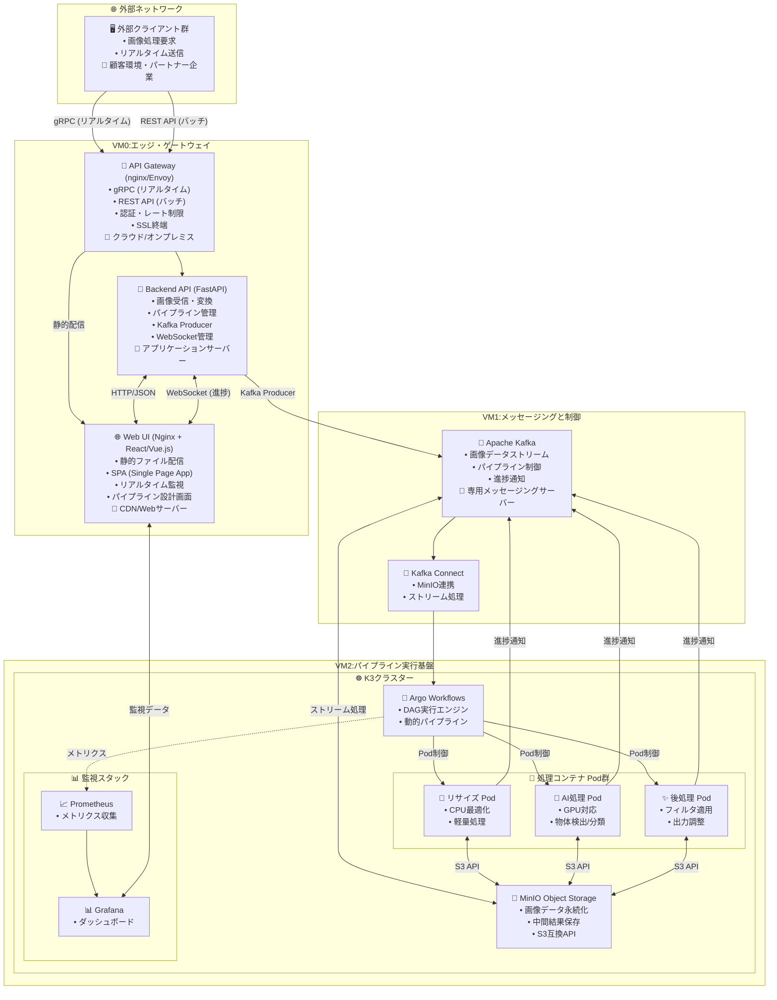
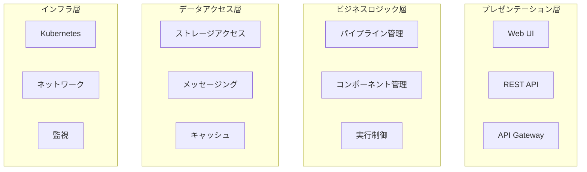
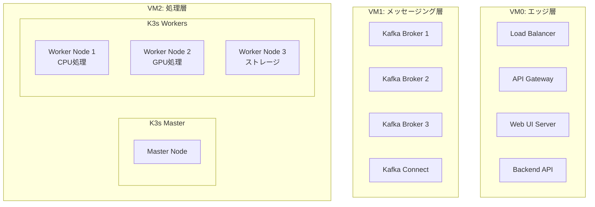

# ImageFlowCanvas アーキテクチャ設計書

## **文書管理情報**

| 項目       | 内容                                 |
| ---------- | ------------------------------------ |
| 文書名     | ImageFlowCanvas アーキテクチャ設計書 |
| バージョン | 1.0                                  |
| 作成日     | 2025年7月12日                        |
| 更新日     | 2025年7月12日                        |

---

## **3. アーキテクチャ設計**

### **3.0. システム全体構成**

#### **3.0.1. システム構成図**

#### **3.0.2. システム構成の説明**

| コンポーネント         | 役割                                         | ホスティング場所                       | 最適プロトコル                          |
| :--------------------- | :------------------------------------------- | :------------------------------------- | :-------------------------------------- |
| **🖥️ 外部クライアント** | 画像処理要求の送信元                         | 顧客環境・パートナー企業               | gRPC (リアルタイム) / REST API (バッチ) |
| **🚪 API Gateway**      | 外部アクセスの統一窓口・認証・負荷分散       | VM0 (クラウド/オンプレミス)            | HTTP/2 (gRPC), HTTP/1.1 (REST)          |
| **🔧 Backend API**      | ビジネスロジック・画像変換・パイプライン管理 | VM0 (アプリケーションサーバー)         | FastAPI (HTTP)                          |
| **🌐 Web UI**           | 管理画面・パイプライン設計・監視ダッシュ     | VM0 (CDN/Webサーバー)                  | HTTP/WebSocket                          |
| **📨 Apache Kafka**     | 非同期メッセージング・ストリーム処理         | VM1 (専用メッセージングサーバー)       | TCP (Kafka Protocol)                    |
| **🔗 Kafka Connect**    | MinIOとの連携・データパイプライン            | VM1 (専用メッセージングサーバー)       | Kafka Streams                           |
| **☸️ K3s**              | コンテナオーケストレーション基盤             | VM2 (高性能コンピューティングサーバー) | Kubernetes API                          |
| **🔄 Argo Workflows**   | パイプライン実行制御エンジン                 | VM2内のK3s                             | Kubernetes CRD                          |
| **💾 MinIO**            | オブジェクトストレージ・データ永続化         | VM2内のK3s                             | S3 API (HTTP)                           |
| **🐳 処理Pod群**        | 画像処理の実行単位                           | VM2内のK3s                             | 内部通信 (gRPC)                         |

### **3.0.3. 技術スタック**

#### **🏗️ インフラストラクチャ層**

| 🔧 技術               | 🎯 役割                       | 📝 選択理由                                                                                                                                                  |
| :------------------- | :--------------------------- | :---------------------------------------------------------------------------------------------------------------------------------------------------------- |
| **☸️ K3s**            | コンテナオーケストレーション | 軽量なKubernetesディストリビューション。Argo Workflowsとのネイティブな親和性と、広大なエコシステムが利用できるため採用                                      |
| **🔄 Argo Workflows** | ワークフローエンジン         | Kubernetesネイティブなワークフローエンジン。「パイプラインの動的構築」という核心要件を実現するため採用。DAG（有向非巡回グラフ）による柔軟なフロー定義が可能 |
| **💾 MinIO**          | オブジェクトストレージ       | S3互換のオープンソースストレージ。パイプラインのステップ間でのデータ共有と、成果物の永続化のために採用                                                      |
| **📨 Kafka**          | メッセージング               | 高スループットな分散メッセージングシステム。パイプラインの起動トリガーなど、コンポーネント間の疎結合な連携を実現するために採用                              |
| **🐳 containerd**     | コンテナランタイム           | K3sが内部で利用する軽量なコンテナランタイム                                                                                                                 |

#### **💻 アプリケーション層**

| 🔧 技術              | 🎯 役割                       | 📝 選択理由                                                     |
| :------------------ | :--------------------------- | :------------------------------------------------------------- |
| **🐍 Python**        | 処理コンテナ開発言語（推奨） | 機械学習ライブラリが豊富であり、処理コンテナの開発に適している |
| **⚛️ React/Vue.js**  | フロントエンドUI（想定）     | モダンなWebUI構築のため                                        |
| **🚀 FastAPI/Flask** | バックエンドAPI（想定）      | PythonベースのAPI開発フレームワーク                            |

#### **🔗 連携・通信層**

| 🔧 技術                         | 🎯 役割                      | 📝 選択理由                                                |
| :----------------------------- | :-------------------------- | :-------------------------------------------------------- |
| **🔌 WebSocket**                | リアルタイム通信            | Web UIとBackend API間での進捗状況のリアルタイム通知のため |
| **📡 Server-Sent Events (SSE)** | 一方向リアルタイム通信      | WebSocketの代替として、シンプルなリアルタイム通知のため   |
| **🔄 kafka-python**             | Kafkaクライアントライブラリ | PythonアプリケーションからKafkaにアクセスするため         |
| **📋 REST API**                 | 同期通信                    | 標準的なHTTP APIによるリクエスト・レスポンス通信のため    |
| **🚀 gRPC**                     | 高性能RPC通信               | 低レイテンシが必要なリアルタイム画像処理のため            |
| **📨 Protocol Buffers**         | シリアライゼーション        | gRPCでの効率的なバイナリデータ転送のため                  |

#### **🖼️ 画像処理・転送層**

| 🔧 技術             | 🎯 役割                   | 📝 選択理由                                 |
| :----------------- | :----------------------- | :----------------------------------------- |
| **📷 OpenCV**       | 画像処理ライブラリ       | 豊富な画像処理機能とPythonとの親和性のため |
| **🗜️ Pillow (PIL)** | 画像フォーマット変換     | 多様な画像フォーマットのサポートのため     |
| **⚡ ImageIO**      | 高性能画像I/O            | 大容量画像ファイルの効率的な読み書きのため |
| **🔐 Base64**       | バイナリエンコーディング | Kafka/JSON経由でのバイナリデータ転送のため |

### **3.1. 論理アーキテクチャ**

#### **3.1.1. レイヤー構造**

#### **3.1.2. マイクロサービス構成**

| サービス名         | 責務               | 技術スタック   | API種別        |
| ------------------ | ------------------ | -------------- | -------------- |
| Gateway Service    | 外部アクセス制御   | Nginx/Envoy    | HTTP/gRPC      |
| Pipeline Service   | パイプライン管理   | FastAPI        | REST           |
| Component Service  | コンポーネント管理 | FastAPI        | REST           |
| Execution Service  | 実行制御           | Python         | Kafka Consumer |
| Processing Service | 画像処理実行       | OpenCV/PyTorch | 内部API        |
| Storage Service    | データ永続化       | MinIO Client   | S3 API         |

### **3.2. 物理アーキテクチャ**

#### **3.2.1. デプロイメント構成**

#### **3.2.2. ネットワーク設計**

| ネットワーク層 | 用途               | プロトコル     | セキュリティ |
| -------------- | ------------------ | -------------- | ------------ |
| External       | インターネット接続 | HTTPS/gRPC     | TLS 1.3      |
| DMZ            | フロントエンド     | HTTP/WebSocket | WAF          |
| Internal       | バックエンド通信   | HTTP/TCP       | VPN          |
| Storage        | データアクセス     | S3 API         | 暗号化       |

---

## **関連文書**

- [概要設計](./0300_概要設計.md)
- [システム基本設計](./0301_システム基本設計.md)
- [インフラ設計](./0307_インフラ設計.md)
