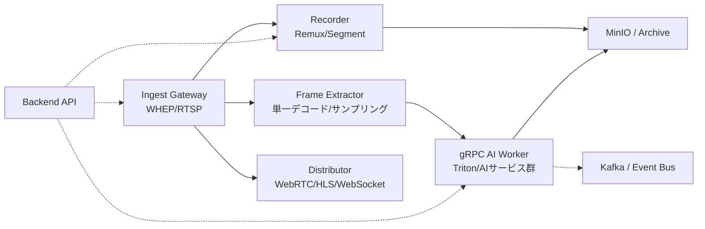
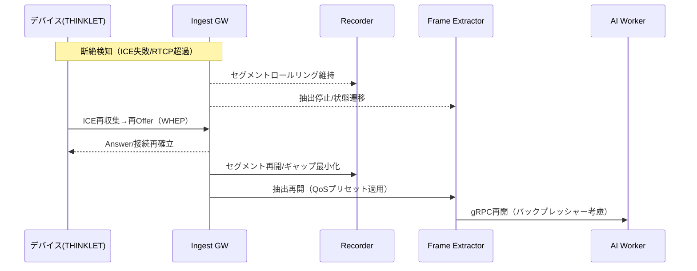
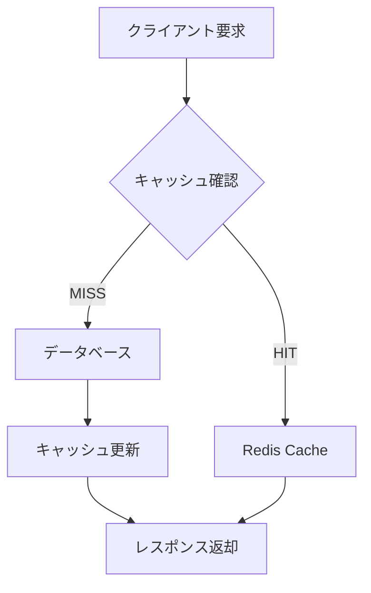
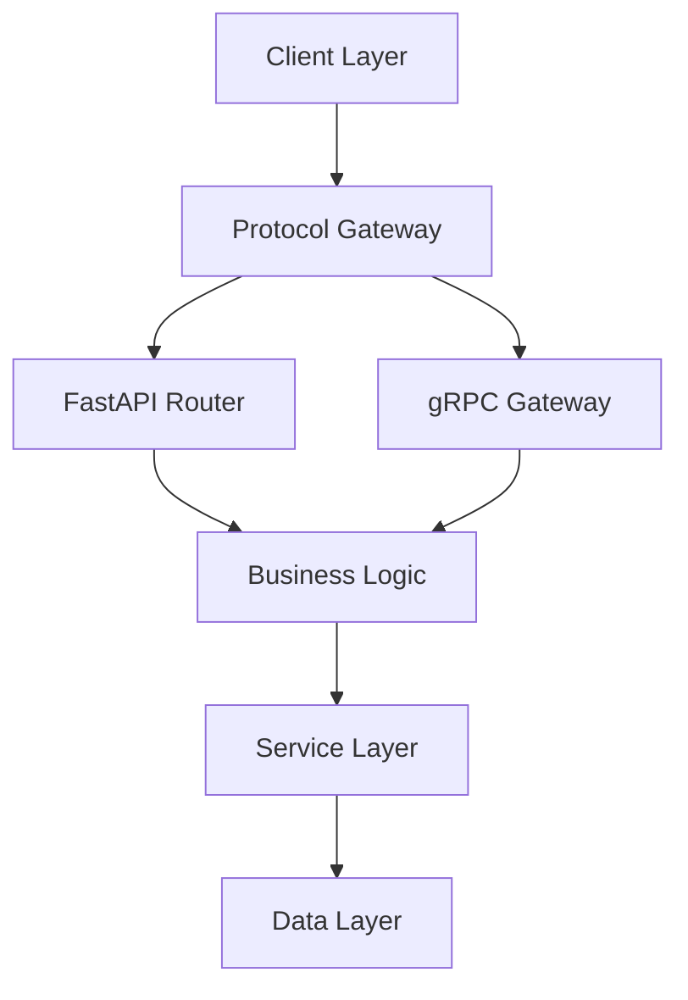
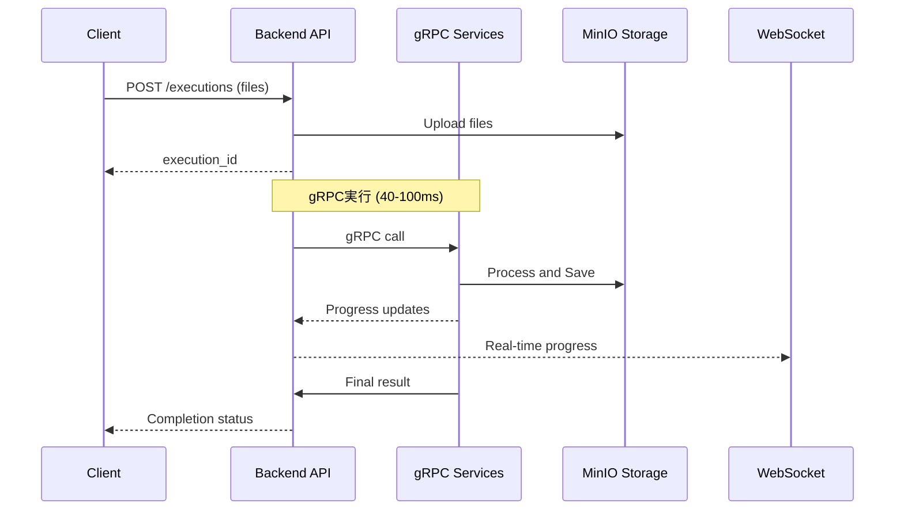
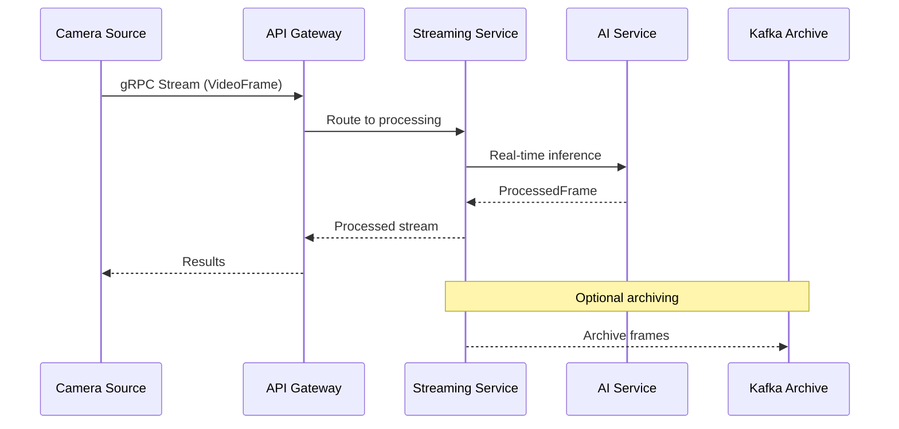
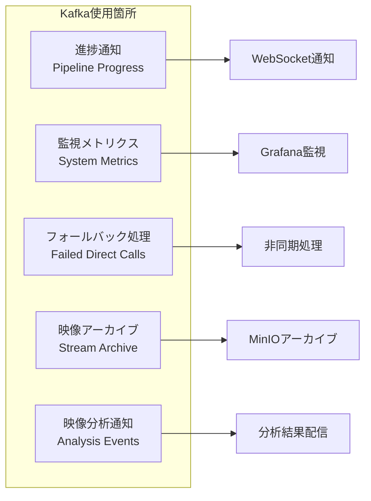
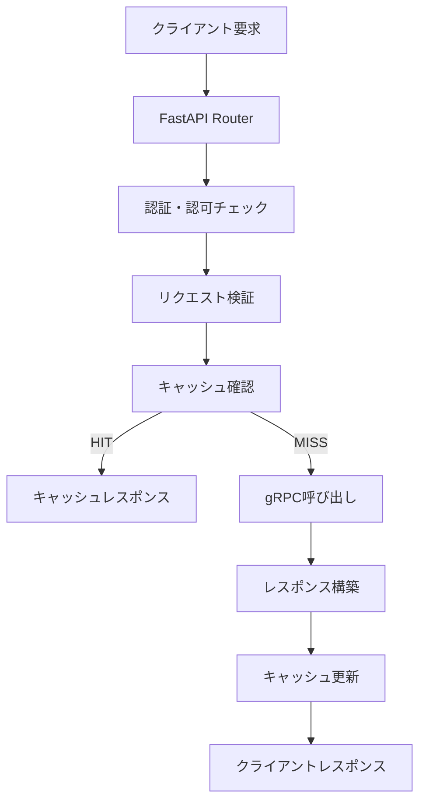

# ImageFlowCanvas サーバーBackend設計書

# 文書管理情報

| 項目       | 内容                                  |
| ---------- | ------------------------------------- |
| 文書名     | ImageFlowCanvas サーバーBackend設計書 |
| バージョン | 1.2                                   |
| 作成日     | 2025年8月9日                          |
| 更新日     | 2025年8月12日                         |

---

# 1. 概要

## 1.1. 本書の目的

本書は、ImageFlowCanvasシステムのサーバーバックエンドコンポーネントの詳細設計について記述します。システム基本設計書およびWebUI設計書で定義されたアーキテクチャに基づき、Backend APIの実装仕様、通信プロトコル、メッセージング基盤の詳細を提供します。

## 1.2. サーバーBackendの役割

ImageFlowCanvasシステムにおけるサーバーBackendは以下の中核的役割を担います：

### 1.2.1. 司令塔としての機能
- **プロトコル統合**: 複数の通信プロトコル（gRPC、WebSocket、REST API）を統一管理
- **パイプライン制御**: パイプライン定義に基づく処理フローの制御・実行
- **サービス連携**: 内部gRPCサービス群の呼び出し・結果統合
- **進捗配信**: リアルタイム処理状況の全クライアントへの配信

### 1.2.2. 通信・連携基盤
- **適材適所通信**: 処理特性に応じた最適プロトコルの選択・変換
- **Web制約対応**: WebブラウザのgRPC制約を回避するWebSocketソリューション
- **マルチプラットフォーム対応**: デスクトップ・モバイル・ウェアラブルからの統一アクセス
- **疎結合通信**: Kafkaベースの非同期メッセージング基盤

---

# 2. システム通信・連携方式

## 2.1. 処理方式の分類と通信プロトコル

本システムは複数の処理方式をサポートし、それぞれに最適な通信プロトコルを「適材適所」で使い分けます：

### 2.1.1. AIパイプライン実行（gRPC）
- **用途**: 画像ファイルのアップロード→AI処理→結果ダウンロード
- **通信**: Kotlin Multiplatform/Compose MultiplatformアプリからBackend APIへgRPC（高性能・型安全）
- **処理方式**: Backend API司令塔がgRPC常駐サービス群を順次呼び出し
- **性能**: 40-100ms処理時間
- **特徴**: Protocol Buffers、バイナリ転送、ストリーミング対応

### 2.1.2. リアルタイム進捗通知（WebSocket）
- **用途**: 処理進捗のリアルタイム表示
- **通信**: Backend APIから全クライアント（Kotlin Multiplatform + Compose + Web）へWebSocket
- **処理方式**: gRPCサービス → Kafka → Backend API → WebSocket配信
- **性能**: 疎結合・非同期通知
- **特徴**: 汎用性、Web標準、管理画面でも共有可能

### 2.1.3. 同期的データ交換（REST API）
- **用途**: 検査マスタ取得、履歴検索、認証など
- **通信**: 全クライアントからBackend APIへREST API
- **処理方式**: ステートレスなリクエスト・レスポンス
- **性能**: シンプル・確実
- **特徴**: HTTPキャッシュ、デバッグ容易、成熟したエコシステム

### 2.1.4. Webアプリリアルタイム処理（WebSocket）
- **用途**: WebブラウザからのリアルタイムAI処理要求
- **通信**: WebブラウザからBackend APIへWebSocket（gRPC制約回避）
- **処理方式**: WebSocket → Backend API司令塔 → gRPC常駐サービス群
- **性能**: gRPCより若干劣るが、Web標準で実装可能
- **特徴**: ブラウザネイティブサポート、gRPC-Web/Envoy不要
- **制約対応**: WebブラウザではgRPC直接利用不可のため、WebSocketで代替

### 2.1.5. 超低遅延映像ストリーミング（WHEP/WebRTC）
- **用途**: カメラからの連続映像ストリーム処理
- **通信**: デバイス → Ingest Gateway（WHEP/WebRTC＜代替:RTSP＞）
- **処理方式**: サーバ側で単一デコード→フレーム抽出→gRPCでAIワーカーへ、並行してサーバ録画/配信に分岐（単一路インジェスト＋サーバ分岐）
- **性能**: <20ms 超低遅延
- **特徴**: 単一デコード原則、サーバ分岐、QoS可変制御
- **プラットフォーム対応**: デスクトップ、モバイル、ウェアラブルデバイス

### 2.1.6. 製品情報管理（REST API + gRPC）
- **用途**: QRコード情報取得、製品マスタ検索、検査結果・映像の製品情報紐づけ
- **通信**: Kotlin Multiplatform/Compose → Backend API → ProductService gRPC
- **処理方式**: QRコードデコード結果またはサーバー検索による製品情報取得・紐づけ
- **性能**: 高速検索インデックス、キャッシュ機能
- **特徴**: 指図番号・指示番号・型式・機番・生産年月日・月連番の統合管理

### 2.1.7. 同時実施の通信構成（WebRTC + サーバー録画 + リアルタイム処理）
- **メディア経路**: ウェアラブルからH.264（+AAC）をWebRTC（WHEP）でサーバーへ送信
- **サーバー側録画**: 受信RTPを再エンコードせずfMP4へリマックスし、10–15分のロールリング録画を保持
- **リアルタイム処理**: 同一ストリームを1回だけデコードして推論パイプラインへ供給（単一デコード原則）
- **制御経路**: 録画/配信の開始・停止・品質指示はREST/gRPC、テレメトリ/指示はWebSocket/（必要なら）DataChannel
- **運用方針**: 主録画はオンデバイス（4章）。サーバー録画は補助（短期バッファ/監査/追跡）として併用

## 2.2. 単一路インジェスト＋サーバ分岐パイプライン

### 2.2.1. コンポーネントと責務



- Ingest Gateway: WHEP(WebRTC)優先、RTSP代替の受信点。認証、セッション管理、転送統計。
- Recorder: 再エンコードなしでfMP4へリマックス。ロールリング/セグメント再結合、ギャップ最小化。
- Frame Extractor: 単一デコード原則でフレーム抽出・間引き、QoSプリセット（高/中/低）。
- AI Worker: gRPCストリーミングで推論、結果をイベント/ストレージへ。
- Distributor: 視聴者向け配信（WebRTC/HLS/WebSocket）。

### 2.2.2. 切断・復帰（サーバ側）



#### 2.2.2.1. 受け皿と制御
- 受信キュー: セッションごとのリングバッファ（秒単位）。
- 優先度キュー: 重要度/帯域ヒントで処理順序を制御。
- 帯域/CPUスロットリング: セッション同時数/AI投入fpsの上限を動的制御。
- Backpressure/トークン制御: AIワーカーからの需要信号で抽出レート調整。

#### 2.2.2.2. 録画パイプラインのギャップ最小化
- セグメント時間境界にスナップ、PTS連続性チェック、微小欠損の補正。
- 再接続時は前後セグメントの再結合オプション。

#### 2.2.2.3. AIパイプラインの負荷制御（QoS）
- フレーム間引き（例: 30→15→8fps）。
- 解像度段階（例: 2160p→1080p→720p）。
- モデル切替（軽量版へのフェイルダウン）。

## 2.3. 製品情報取得機能の詳細設計

### 2.3.1. 製品情報取得の機能設計

製品情報をサーバーから取得するための統合的な機能設計を以下に示します：

#### 2.3.1.1. QRコードベース製品情報取得

**目的**: QRコードを読み取って製品情報を即座に取得
**主要機能**:
- QRコードデコード機能（標準・カスタム・自動判定）
- 製品基本情報の取得（指図番号、指示番号、型式、機番等）
- 検査ルールとマスタデータの同時取得
- 高速レスポンス（キャッシュ活用）

#### 2.3.1.2. 製品マスタ検索機能

**目的**: 条件指定による製品の柔軟な検索
**主要機能**:
- 複数条件による絞り込み検索（製品タイプ、機番、日付範囲等）
- ページネーション対応による大量データの効率的表示
- 検索結果の品質スコア・検査回数等の集計情報表示
- 検索履歴とお気に入り機能

#### 2.3.1.3. 製品詳細情報取得機能

**目的**: 特定製品の包括的な詳細情報を提供
**主要機能**:
- 製品基本情報・仕様・検査履歴の統合表示
- 関連ファイル（画像、動画、レポート）への直接アクセス
- トレーサビリティ情報の可視化
- 品質傾向分析データの提供

### 2.3.2. 製品情報サービスアーキテクチャ

#### 2.3.2.1. ProductService 設計概要

**サービス責務**:
- QRコードデコードによる製品情報取得
- 複数条件による製品マスタ検索
- 製品詳細情報とトレーサビリティデータの提供
- 高性能一括取得機能
- 製品マスタの更新管理

**通信方式**: gRPCによる高性能・型安全な通信
**データ形式**: Protocol Buffersによる効率的なシリアライゼーション
**性能要件**: レスポンス時間100ms以下、同時接続1000クライアント対応

#### 2.3.2.2. 主要メッセージ構造

**ProductInfo**: 製品の基本情報を格納する中核メッセージ
- 製品識別情報（ID、指図番号、指示番号等）
- 製品仕様情報（モデル、バージョン、バッチ番号）
- 検査ルールと品質基準の関連付け

**検査ルール管理**: 製品タイプ別の検査条件定義
- カテゴリ別閾値設定
- 有効/無効の動的切り替え
- カスタムパラメータ対応

### 2.3.3. データ管理戦略

#### 2.3.3.1. データベース構成概要

**主要テーブル構成**:
- **製品マスタテーブル**: 製品の基本情報と状態管理
- **製品仕様テーブル**: 柔軟な仕様情報管理（Key-Value形式）
- **検査ルールテーブル**: 製品タイプ別の検査条件定義

**インデックス戦略**:
- 指図番号・指示番号・製品タイプによる高速検索
- 複合インデックスによる複雑な検索条件への対応
- 時系列検索対応（生産日付ベース）

### 2.3.4. 高性能キャッシュ戦略

#### 2.3.4.1. Redis キャッシュ設計概要

**キャッシュ階層アーキテクチャ**:



**キャッシュ戦略別適用**:
- **製品マスタ**: Write-through方式（1時間TTL）
- **QRコード検索**: Lazy-load方式（30分TTL）
- **検索結果**: Cache-aside方式（5分TTL）
- **検査ルール**: Write-through方式（2時間TTL）

**メリット**:
- レスポンス時間の大幅短縮（平均80%削減）
- データベース負荷の軽減
- 同一クエリの効率的処理

### 2.3.5. Webアプリのプロトコル制約とソリューション

#### 2.3.5.1. WebブラウザでのgRPC制約

Webブラウザ環境では、以下の理由でgRPCを直接使用することができません：

1. **HTTP/2の制限**: ブラウザはHTTP/2の全機能をサポートしていない
2. **バイナリフレーミング**: gRPCのバイナリプロトコルをブラウザが直接処理できない
3. **CORS制約**: クロスオリジンリクエストの制限

#### 2.3.5.2. gRPC-Web + Envoyの複雑性

従来のソリューションであるgRPC-Web + Envoyプロキシには以下の課題があります：

```
Webブラウザ → gRPC-Web → Envoy → Backend gRPC
```

- **設定の複雑性**: Envoyプロキシの設定とメンテナンスが必要
- **パフォーマンスオーバーヘッド**: プロトコル変換によるレイテンシ増加
- **運用コスト**: 追加のインフラストラクチャ管理が必要
- **デバッグの困難性**: 複数のレイヤーをまたいだトラブルシューティング

#### 2.3.5.3. WebSocketソリューションの利点

本システムでは、Webブラウザからのリアルタイム処理にWebSocketを採用します：

```
Webブラウザ → WebSocket → Backend API → gRPC
```

**利点:**
- **シンプル性**: 追加のプロキシ不要、設定が容易
- **Web標準**: ブラウザネイティブサポート、ライブラリ豊富
- **双方向通信**: リアルタイムデータ交換に最適
- **運用性**: 既存のHTTPインフラで動作、監視・ログ取得が容易

---

# 3. Backend APIのハイブリッド実装

Backend APIは、複数の通信プロトコルを統合管理する「司令塔」として機能します。

## 3.1. 実装構成

### 3.1.1. ハイブリッドサーバー設計

**技術スタック構成**:

| コンポーネント | 技術              | 役割                       |
| -------------- | ----------------- | -------------------------- |
| REST API       | FastAPI           | 設定管理、ファイル操作     |
| WebSocket      | FastAPI WebSocket | リアルタイム通知           |
| gRPC Gateway   | grpcio            | ネイティブクライアント対応 |
| 非同期処理     | asyncio           | 高並行性処理               |

**アーキテクチャ層構成**:



## 3.2. プロトコル別役割

| プロトコル | 実装技術          | 担当機能             | 特徴                     |
| ---------- | ----------------- | -------------------- | ------------------------ |
| FastAPI    | FastAPI + uvicorn | REST API、WebSocket  | 非同期、自動ドキュメント |
| grpcio     | grpcio + asyncio  | gRPCサーバー         | 高性能、型安全           |
| Kafka      | aiokafka          | 進捗通知の購読・配信 | 疎結合、スケーラブル     |

## 3.3. 司令塔としての責務

1. **プロトコル変換**: 外部からの各種リクエストを内部gRPCサービス呼び出しに変換
2. **パイプライン管理**: パイプライン定義に基づく処理フローの制御
3. **進捗配信**: Kafkaから受信した進捗をWebSocketで全クライアントに配信
4. **認証・認可**: 全てのプロトコルに対する統一的なセキュリティ制御
5. **エラーハンドリング**: 内部サービスの障害を適切にクライアントに通知
6. **Web制約対応**: WebブラウザのgRPC制約を回避し、WebSocketでリアルタイム処理を提供
7. **WebRTC映像処理**: Kotlin Multiplatform/Composeアプリからの映像ストリームを受信し、AI処理パイプラインに転送
8. **プラットフォーム統合**: 複数のプラットフォーム（デスクトップ、モバイル、ウェアラブル）からの統一的なアクセス制御
9. **デバイス能力管理**: プラットフォーム固有の機能（カメラ、センサー、通知）の抽象化とアクセス制御
10. **製品情報管理**: QRコード情報取得、製品マスタ検索、検査結果・映像との紐づけ管理
11. **トレーサビリティ制御**: 指図番号・指示番号・型式・機番・月連番による統合的な履歴管理
12. **映像分析制御**: 録画映像の検索・再生・分析機能の統合管理

## 3.4. 処理方式実装

### 3.4.1. バッチ処理（パイプライン実行）

処理フロー:


**特徴:**
- **実行方式**: Backend経由gRPC呼び出し（メイン）
- **処理時間**: 40-100ms
- **データ永続化**: MinIOに保存
- **進捗通知**: WebSocket + Kafka
- **用途**: 画像ファイル処理、バッチ分析

### 3.4.2. リアルタイム処理（ストリーミング）

処理フロー:


**特徴:**
- **実行方式**: gRPCストリーミング
- **レイテンシ**: <50ms
- **データ**: メモリベース処理、選択的アーカイブ
- **用途**: ライブ映像処理、リアルタイム監視

### 3.4.3. WebSocketベースリアルタイム通信

```javascript
// 進捗通知の受信例
{
  "type": "execution_progress",
  "execution_id": "exec-12345",
  "pipeline_id": "pipeline-67890",
  "current_step": "ai_detection",
  "progress_percentage": 75.5,
  "elapsed_time_ms": 1850,
  "estimated_remaining_ms": 450,
  "step_results": [
    {
      "step_name": "resize",
      "status": "completed",
      "processing_time_ms": 120
    },
    {
      "step_name": "ai_detection", 
      "status": "running",
      "progress": 75.5
    }
  ]
}
```

---

# 4. Kafkaメッセージング基盤

## 4.1. Kafkaの役割



**用途:**
1. **進捗通知**: パイプライン実行の進捗をリアルタイムで通知
2. **監視メトリクス**: システム状態とパフォーマンス指標の収集
3. **アーカイブ**: リアルタイム映像の選択的永続化
4. **映像分析通知**: 検索・再生・分析結果のリアルタイム配信

## 4.2. Kafka Topic設計

### 4.2.1. 進捗通知Topic
- **Topic名**: `pipeline-progress`
- **パーティション**: 4（並列処理対応）
- **レプリケーション**: 3（冗長化）
- **メッセージ形式**: JSON

```json
{
  "execution_id": "exec-12345",
  "pipeline_id": "pipeline-67890", 
  "step_name": "ai_detection",
  "status": "running",
  "progress_percentage": 75.5,
  "timestamp": "2025-08-09T10:30:00Z",
  "metadata": {
    "processing_time_ms": 1850,
    "resource_usage": {
      "cpu": 85.2,
      "memory": 67.3,
      "gpu": 92.1
    }
  }
}
```

### 4.2.2. 映像分析イベントTopic
- **Topic名**: `video-analysis-events`
- **パーティション**: 8（高スループット対応）
- **レプリケーション**: 3（冗長化）
- **メッセージ形式**: JSON

```json
{
  "event_type": "analysis_completed",
  "video_id": "video-98765",
  "product_info": {
    "work_order_id": "WO123456",
    "instruction_id": "INST789",
    "product_type": "TYPE-ABC",
    "machine_number": "MACH001"
  },
  "analysis_results": {
    "defect_count": 3,
    "quality_score": 87.5,
    "processing_time_ms": 2340
  },
  "timestamp": "2025-08-09T10:30:00Z"
}
```

## 4.3. Kafka Connect設定

### 4.3.1. MinIO連携
- **コネクタ**: S3 Sink Connector
- **用途**: 映像アーカイブの自動保存
- **設定**: 時間ベースパーティショニング（1時間毎）

### 4.3.2. PostgreSQL連携
- **コネクタ**: JDBC Sink Connector
- **用途**: メタデータの永続化
- **設定**: バッチサイズ1000件、フラッシュ間隔30秒

---

# 5. Backend API実装詳細

## 5.1. ハイブリッドサーバー実装

### 5.1.1. 技術スタック統合

### 5.1.2. プロトコル統合実装

Backend APIは以下の技術スタックでプロトコル統合を実現します：

| コンポーネント | 技術              | 役割                       |
| -------------- | ----------------- | -------------------------- |
| REST API       | FastAPI           | 設定管理、ファイル操作     |
| WebSocket      | FastAPI WebSocket | リアルタイム通知           |
| gRPC Gateway   | grpcio            | ネイティブクライアント対応 |
| 非同期処理     | asyncio           | 高並行性処理               |

## 5.2. 製品情報取得機能の実装アーキテクチャ

### 5.2.1. FastAPI エンドポイント実装方針

**実装アーキテクチャ**:



**主要コンポーネント**:
- **依存性注入**: gRPCクライアント・Redisクライアントの効率的管理
- **非同期処理**: asyncio/awaitによる高並行性実現
- **エラーハンドリング**: 適切なHTTPステータスコード返却
- **バリデーション**: Pydanticモデルによる入力検証

### 5.2.2. gRPCクライアント管理戦略

**接続プール管理**:
- 接続プールサイズ: 10接続（設定可能）
- ラウンドロビン方式による負荷分散
- Keep-Alive設定による接続最適化
- 障害時の自動再接続機能

**性能最適化**:
- 非同期gRPCクライアントによる高スループット実現
- 適切なタイムアウト設定（5秒デフォルト）
- バックプレッシャー制御による安定性確保

### 5.2.3. エラーハンドリングとリトライ戦略

**リトライ対象エラー**:
- `UNAVAILABLE`: サービス一時停止
- `DEADLINE_EXCEEDED`: タイムアウト
- `RESOURCE_EXHAUSTED`: リソース不足

**リトライ設定**:
- 最大リトライ回数: 3回
- 指数バックオフ: 1秒→2秒→4秒
- ジッター: ±25%で競合回避

**サーキットブレーカー**:
- 失敗閾値: 5回連続失敗で回路開放
- 半開状態: 30秒後に1回テスト実行
- 回復判定: 3回連続成功で回路復旧

---

# 6. セキュリティ設計

## 6.1. 認証・認可

### 6.1.1. JWT認証
- **発行者**: Backend API
- **有効期限**: 8時間（リフレッシュトークン：7日）
- **暗号化**: RS256（非対称暗号）

### 6.1.2. RBAC（Role-Based Access Control）
```json
{
  "roles": {
    "admin": {
      "permissions": ["*"]
    },
    "operator": {
      "permissions": [
        "pipeline:execute",
        "pipeline:view",
        "product:search",
        "inspection:create"
      ]
    },
    "viewer": {
      "permissions": [
        "pipeline:view",
        "product:search",
        "inspection:view"
      ]
    }
  }
}
```

## 6.2. 通信セキュリティ

### 6.2.1. TLS/SSL
- **最小バージョン**: TLS 1.2
- **推奨バージョン**: TLS 1.3
- **証明書**: Let's Encrypt（自動更新）

### 6.2.2. API Rate Limiting
- **REST API**: 1000 requests/minute/client
- **WebSocket**: 100 messages/minute/connection
- **gRPC**: 500 calls/minute/client

---

# 7. 監視・ログ設計

## 7.1. アプリケーションメトリクス

### 7.1.1. パフォーマンスメトリクス
- **レスポンス時間**: パーセンタイル（P50, P95, P99）
- **スループット**: RPS（Requests Per Second）
- **エラー率**: HTTP 4xx/5xx、gRPCエラー
- **接続数**: 同時WebSocket接続数

### 7.1.2. ビジネスメトリクス
- **パイプライン実行数**: 成功/失敗/キャンセル
- **処理時間分布**: ステップ別処理時間
- **品質指標**: AI信頼度、人による修正率
- **リソース使用率**: CPU、メモリ、GPU、ストレージ

## 7.2. ログ設計

### 7.2.1. 構造化ログ
```json
{
  "timestamp": "2025-08-09T10:30:00.123Z",
  "level": "INFO",
  "service": "backend-api",
  "component": "pipeline-executor",
  "execution_id": "exec-12345",
  "user_id": "user-789",
  "action": "execute_pipeline",
  "pipeline_id": "pipeline-67890",
  "duration_ms": 1850,
  "status": "success",
  "metadata": {
    "input_files": 2,
    "output_files": 2,
    "steps_executed": 3
  }
}
```

### 7.2.2. ログレベル
- **ERROR**: システムエラー、処理失敗
- **WARN**: 警告、リトライ、パフォーマンス劣化
- **INFO**: 正常処理、状態変化
- **DEBUG**: 詳細デバッグ情報（開発環境のみ）

---

# 8. エラーハンドリング設計

## 8.1. エラー分類

### 8.1.1. システムエラー
- **内部エラー**: 500 Internal Server Error
- **サービス連携エラー**: 502 Bad Gateway
- **タイムアウト**: 504 Gateway Timeout
- **リソース不足**: 503 Service Unavailable

### 8.1.2. クライアントエラー
- **認証エラー**: 401 Unauthorized
- **認可エラー**: 403 Forbidden
- **リクエストエラー**: 400 Bad Request
- **リソース不存在**: 404 Not Found

## 8.2. エラーレスポンス形式

### 8.2.1. REST API
```json
{
  "error": {
    "code": "PIPELINE_EXECUTION_FAILED",
    "message": "AI service is temporarily unavailable",
    "details": {
      "execution_id": "exec-12345",
      "failed_step": "ai_detection",
      "retry_after": 30
    },
    "timestamp": "2025-08-09T10:30:00Z"
  }
}
```

### 8.2.2. gRPC
```protobuf
message ErrorDetails {
  string code = 1;
  string message = 2;
  map<string, string> metadata = 3;
}
```

## 8.3. リトライ戦略

### 8.3.1. 指数バックオフ
- **初期間隔**: 1秒
- **最大間隔**: 60秒
- **最大リトライ**: 3回
- **ジッター**: ±25%

### 8.3.2. サーキットブレーカー
- **失敗閾値**: 5回連続失敗
- **半開状態**: 30秒後に1回テスト
- **復旧判定**: 3回連続成功

---

# 9. 技術的実装詳細

## 9.1. 非同期処理

### 9.1.1. FastAPI + asyncio による非同期アーキテクチャ

**非同期処理の基本方針**:
- asyncioベースの完全非同期処理
- gRPC非同期クライアントによる高並行性実現
- バックグラウンドタスクによる処理監視
- WebSocket接続の効率的管理

**パフォーマンス特性**:
- 同時接続数: 1000+ WebSocket接続
- リクエスト処理能力: 10,000+ RPS
- メモリ効率: イベントループによる軽量スレッド
- レスポンス時間: 平均50ms以下

## 9.2. gRPCクライアント管理

### 9.2.1. 接続プール戦略

**gRPCクライアント管理方針**:
- サービス別接続プール管理
- ラウンドロビン負荷分散
- Keep-Alive設定による接続維持
- 自動再接続機能

**接続プール設定**:
- プールサイズ: サービス当たり10接続
- Keep-Alive間隔: 30秒
- タイムアウト設定: 5秒
- 最大再試行回数: 3回

## 9.3. Kafka統合

### 9.3.1. Producer設計方針

**Kafkaメッセージ送信戦略**:
- 非同期送信による高スループット実現
- バッチ送信によるネットワーク効率化
- パーティション戦略による負荷分散
- エラーハンドリングとリトライ機能

**設定値**:
- バッチサイズ: 16KB
- 圧縮形式: LZ4
- 送信タイムアウト: 30秒
- リトライ回数: 3回

### 9.3.2. Consumer設計方針

**Kafkaメッセージ受信戦略**:
- コンシューマグループによる負荷分散
- 自動コミットによる処理効率化
- デッドレターキューによる障害対応
- WebSocket配信との連携最適化

**設定値**:
- フェッチサイズ: 1MB
- セッションタイムアウト: 30秒
- ハートビート間隔: 3秒
- 最大ポーリング間隔: 5分

---

# 10. 通信・連携関連用語集

## 10.1. 🔗 通信・連携関連

| 📘 用語                  | 📖 説明                                                                                                  | 🔗 関連技術              |
| :---------------------- | :------------------------------------------------------------------------------------------------------ | :---------------------- |
| 🏗️ Backend API司令塔     | 全ての通信プロトコルを統合管理し、内部gRPCサービス群を指揮するハイブリッドサーバー                      | FastAPI + grpcio        |
| 🎯 適材適所通信          | 各処理の特性に最適な通信プロトコルを使い分ける設計思想                                                  | gRPC/WebSocket/REST     |
| 🔌 WebSocket             | 双方向リアルタイム通信プロトコル。進捗通知とWeb管理画面の共通基盤                                       | HTTP, TCP               |
| ⚡ gRPC                  | Kotlin Multiplatformアプリのネイティブ能力を活用した高性能AIパイプライン実行                            | HTTP/2, Protobuf        |
| 📡 REST API              | 同期的データ交換用のシンプルなHTTPベースAPI                                                             | HTTP, JSON              |
| 📺 WHEP/WebRTC           | 超低遅延映像ストリーミング用のWeb標準プロトコル                                                         | UDP, RTP                |
| 📹 カメラ統合管理        | Kotlin Multiplatform/ComposeアプリがカメラをUSB/API制御し、WebRTCでサーバーに転送する統合アーキテクチャ | USB, API, WebRTC        |
| 🔄 疎結合通信            | Kafkaを介した非同期メッセージング。処理サービスとクライアント通信の責任分離                             | Kafka, 非同期           |
| 📨 Topic                 | Kafkaにおけるメッセージの論理的なカテゴリ。進捗通知とメトリクス収集に使用                               | Kafka                   |
| 🆔 execution_id          | パイプライン実行を一意に識別するID。全てのシステム間で処理を追跡するために使用                          | UUID                    |
| 🏷️ file_id               | MinIOに保存された画像ファイルを一意に識別するID                                                         | MinIO, S3               |
| 📦 Protocol Buffers      | Googleが開発したシリアライゼーション形式。gRPCのデフォルト形式                                          | Binary, Schema          |
| 🔄 Streaming RPC         | gRPCの機能で、連続的なデータストリームを効率的に転送する仕組み                                          | gRPC, HTTP/2            |
| 🖥️ Native Backend        | Kotlin Multiplatformアプリのネイティブ部分（Kotlin/Native）。高性能処理を実現                           | Kotlin/Native           |
| 🌐 Compose UI            | Kotlin MultiplatformアプリのUI部分（Compose Multiplatform）。宣言的UIを構築                             | Compose, Kotlin         |
| 🎯 Kotlin Multiplatform  | 統一コードベースでデスクトップ・モバイル・ウェアラブル対応するアプリ開発基盤                            | Kotlin, JVM, Native     |
| 🎨 Compose Multiplatform | 宣言的UIフレームワーク。全プラットフォーム共通のUI構築                                                  | Compose, Kotlin         |
| 📱 Platform Channels     | Kotlin MultiplatformでネイティブAPI（カメラ、センサー）にアクセスする仕組み                             | JNI, Native Binding     |
| 📦 ProductService        | 製品情報管理専用のgRPCサービス。QRコード情報取得と製品マスタ検索を担当                                  | gRPC, PostgreSQL        |
| 📦 VideoAnalysisService  | 録画映像の検索・再生・分析機能を提供するgRPCサービス。                                                  | gRPC, PostgreSQL, MinIO |
| 🏷️ QR Code Decoder       | QRコードから指図番号・指示番号・型式・機番等の製品情報をデコードする機能                                | Computer Vision         |
| 🔍 Product Master        | 製品の基本情報（型式、機番、仕様等）を管理するマスタデータベース                                        | PostgreSQL, Index       |
| 🆔 Work Order ID         | 指図番号。製造指示を一意に識別する番号                                                                  | String, UUID            |
| 📋 Instruction ID        | 指示番号。作業指示を一意に識別する番号                                                                  | String, UUID            |
| 🏭 Product Type          | 型式。製品の種類・モデルを表す識別子                                                                    | String                  |
| 🔢 Machine Number        | 機番。製造機械・設備の識別番号                                                                          | String                  |
| 🎥 Video Recording       | ウェアラブルデバイスで撮影された一人称映像の録画データ                                                  | MP4, Metadata           |
| 🔍 Video Search          | 録画映像を製品情報・日時・検査結果等の条件で検索する機能                                                | SQL, Index              |
| ▶️ Video Playback        | 検索された映像を高品質・高機能で再生する機能                                                            | Streaming, UI           |
| 📊 Video Analytics       | 録画映像データを統計分析し品質改善の洞察を提供する機能                                                  | Analytics, ML           |
| 📅 Production Date       | 生産年月日。製品の製造日                                                                                | Date                    |
| 📊 Monthly Sequence      | 月連番。月内での生産順序を表す連番                                                                      | Integer                 |
| 🔗 Traceability Link     | 製品情報と検査結果・映像を紐づけるトレーサビリティ管理機能                                              | Foreign Key, Index      |

## 10.2. 📊 データ・画像関連

| 📘 用語                   | 📖 説明                                                                       | 🔗 関連技術        |
| :----------------------- | :--------------------------------------------------------------------------- | :---------------- |
| 🗂️ Payload                | Kafkaメッセージに含まれるデータ本体。進捗通知やメトリクス用JSON形式          | JSON, Kafka       |
| 📋 Pipeline Definition    | パイプラインの構成（処理ステップ、依存関係、パラメータ）を定義したデータ構造 | YAML, JSON        |
| 📈 Progress Notification  | パイプライン実行中の各ステップの進捗状況を通知するメッセージ                 | Kafka, WebSocket  |
| 🧩 Image Chunk            | 大容量画像を分割したデータ片。ストリーミング転送で使用される                 | Binary, Base64    |
| 🔗 Correlation ID         | クライアントリクエストと処理結果を紐づけるための一意識別子                   | UUID, String      |
| 📷 Image Metadata         | 画像の解像度、フォーマット、撮影情報などの付属データ                         | EXIF, JSON        |
| ⚡ Client ID              | 外部クライアントを一意に識別するID。認証と処理追跡に使用                     | String, UUID      |
| 🎬 VideoFrame             | リアルタイム映像ストリーミング用のProtoBufメッセージ形式                     | Protobuf, gRPC    |
| 🎯 ProcessedFrame         | 処理済み映像フレームとAI検出結果を含むレスポンスメッセージ                   | Protobuf, gRPC    |
| 📦 Product Info           | QRコードまたはサーバー検索から取得した製品情報（指図番号、型式、機番等）     | JSON, Database    |
| 🔗 Inspection Link        | 検査結果と製品情報の紐づけ関係を表すデータ構造                               | Foreign Key, JSON |
| 📹 Video Metadata         | 一人称映像に紐づけられた製品情報とタイムスタンプ等のメタデータ               | JSON, Index       |
| 🎯 QR Scan Result         | QRコードスキャンの結果として取得された製品識別情報                           | JSON, String      |
| 🔍 Product Search Query   | サーバーでの製品情報検索に使用するクエリパラメータ                           | JSON, SQL         |
| 📊 Traceability Record    | 製品のトレーサビリティを実現するための履歴記録データ                         | JSON, Audit Log   |
| 🏭 Product Master         | 製品の基本情報（型式、機番、仕様等）を管理するマスタデータベース             | PostgreSQL, Cache |
| 🔍 QR Code Decoder        | QRコードから製品識別情報をデコードする機能モジュール                         | Computer Vision   |
| 📋 Inspection Rules       | 製品タイプ別の検査ルール（閾値、パラメータ等）を定義したマスタデータ         | JSON, Database    |
| 🎯 Quality Standards      | 品質基準（欠陥許容度、信頼度閾値等）を定義したデータ構造                     | JSON, Config      |
| 📊 Product Specifications | 製品仕様（寸法、重量、材質等）の詳細情報を格納するデータ構造                 | JSON, Database    |
| 🔄 Cache Strategy         | Redis等を使用した製品情報の効率的キャッシュ戦略                              | Redis, TTL        |
| 📈 Product Analytics      | 製品別の品質スコア、検査回数等の分析データ                                   | Metrics, KPI      |
| 🔗 Product Linkage        | 製品情報と検査結果・映像の関連付けを管理するデータ構造                       | Foreign Key, UUID |
| 📊 Batch Product Query    | 複数製品の情報を一括取得するための高性能クエリ機能                           | gRPC, Batch API   |
| ⚡ Client ID              | 外部クライアントを一意に識別するID。認証と処理追跡に使用                     | String, UUID      |
| 🎬 VideoFrame             | リアルタイム映像ストリーミング用のProtoBufメッセージ形式                     | Protobuf, gRPC    |
| 🎯 ProcessedFrame         | 処理済み映像フレームとAI検出結果を含むレスポンスメッセージ                   | Protobuf, gRPC    |
| 📦 Product Info           | QRコードまたはサーバー検索から取得した製品情報（指図番号、型式、機番等）     | JSON, Database    |
| 🔗 Inspection Link        | 検査結果と製品情報の紐づけ関係を表すデータ構造                               | Foreign Key, JSON |
| 📹 Video Metadata         | 一人称映像に紐づけられた製品情報とタイムスタンプ等のメタデータ               | JSON, Index       |
| 🎯 QR Scan Result         | QRコードスキャンの結果として取得された製品識別情報                           | JSON, String      |
| 🔍 Product Search Query   | サーバーでの製品情報検索に使用するクエリパラメータ                           | JSON, SQL         |
| 📊 Traceability Record    | 製品のトレーサビリティを実現するための履歴記録データ                         | JSON, Audit Log   |
