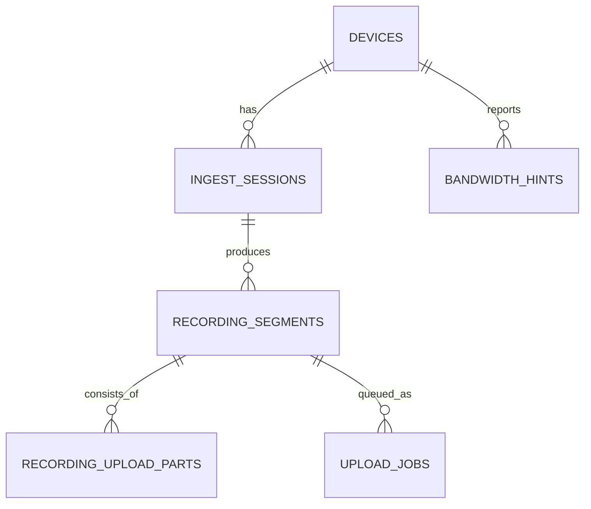

# ImageFlowCanvas データベース設計書

## **文書管理情報**

| 項目       | 内容                               |
| ---------- | ---------------------------------- |
| 文書名     | ImageFlowCanvas データベース設計書 |
| バージョン | 1.1                                |
| 作成日     | 2025年7月12日                      |
| 更新日     | 2025年8月13日                      |


---

## **1. データベース設計**

### **1.1. データストレージ戦略**

ImageFlowCanvasでは、アプリケーション特性に応じて異なるストレージを使い分けます：

| データ種別                             | ストレージ           | 理由                                 |
| -------------------------------------- | -------------------- | ------------------------------------ |
| 画像データ                             | MinIO (オブジェクト) | 大容量、S3互換、高可用性             |
| メタデータ（サーバー）                 | PostgreSQL (RDB)     | ACID特性、関係性、複雑なクエリ対応   |
| ローカルデータ（Kotlin Multiplatform） | SQLite (組み込みDB)  | オフライン対応、軽量、ファイルベース |
| リアルタイム通信                       | Kafka + Redis        | 高スループット、低遅延、一時データ   |

### **1.1.1. ストレージ選択の詳細理由**

**MinIO (画像・成果物)**:
- S3互換APIによる移植性確保
- 大容量画像ファイルの効率的保存
- バージョニング・レプリケーション対応
- REST API経由の直接アクセス

**PostgreSQL (サーバーメタデータ)**:
- トランザクション保証による一貫性確保
- 複雑な検索・集計クエリ対応
- JSON型による柔軟なスキーマ対応
- 高性能インデックス・パーティショニング

**SQLite (Kotlin Multiplatformローカル)**:
- オフライン完全対応
- アプリ組み込み型の軽量DB
- ファイルベースの簡単配布
- 同期による最新データ取得

**Kafka + Redis (リアルタイム)**:
- 非同期メッセージング
- 進捗通知・ステータス更新
- 一時的なセッション管理
- WebSocket配信のバッファリング

### **1.2. データモデル設計**

### **1.2. データモデル設計**

#### **1.2.1. サーバーサイド（PostgreSQL）スキーマ**

**パイプライン管理**
```sql
-- パイプライン定義テーブル
CREATE TABLE pipelines (
    id UUID PRIMARY KEY,
    name VARCHAR(255) NOT NULL,
    description TEXT,
    definition JSONB NOT NULL,  -- DAG定義
    version INTEGER DEFAULT 1,
    created_at TIMESTAMP DEFAULT NOW(),
    updated_at TIMESTAMP DEFAULT NOW(),
    created_by UUID REFERENCES users(id)
);

-- パイプライン実行履歴テーブル
CREATE TABLE pipeline_executions (
    id UUID PRIMARY KEY,
    pipeline_id UUID REFERENCES pipelines(id),
    status VARCHAR(50) NOT NULL,  -- pending, running, completed, failed
    input_data JSONB,
    output_data JSONB,
    error_message TEXT,
    started_at TIMESTAMP,
    completed_at TIMESTAMP,
    created_by UUID REFERENCES users(id)
);
```

**コンポーネント管理**
```sql
-- 処理コンポーネントテーブル
CREATE TABLE components (
    id UUID PRIMARY KEY,
    name VARCHAR(255) NOT NULL,
    description TEXT,
    docker_image VARCHAR(500) NOT NULL,
    version VARCHAR(50) NOT NULL,
    input_schema JSONB,    -- 入力パラメータスキーマ
    output_schema JSONB,   -- 出力データスキーマ
    resource_requirements JSONB,  -- CPU/GPU/メモリ要件
    created_at TIMESTAMP DEFAULT NOW(),
    updated_at TIMESTAMP DEFAULT NOW()
);

-- コンポーネント実行ログテーブル
CREATE TABLE component_executions (
    id UUID PRIMARY KEY,
    execution_id UUID REFERENCES pipeline_executions(id),
    component_id UUID REFERENCES components(id),
    status VARCHAR(50) NOT NULL,
    input_data JSONB,
    output_data JSONB,
    execution_time_ms INTEGER,
    resource_usage JSONB,
    started_at TIMESTAMP,
    completed_at TIMESTAMP
);
```

**ファイル管理**
```sql
-- ファイルメタデータテーブル
CREATE TABLE files (
    id UUID PRIMARY KEY,
    original_name VARCHAR(500),
    mime_type VARCHAR(100),
    file_size BIGINT,
    storage_path VARCHAR(1000) NOT NULL,  -- MinIOパス
    checksum VARCHAR(64),
    metadata JSONB,  -- EXIF等
    created_at TIMESTAMP DEFAULT NOW(),
    created_by UUID REFERENCES users(id)
);

-- Ingest/録画/配信（単一路インジェスト＋サーバ分岐）
-- デバイス・セッション・録画セグメント・アップロード再開(ETag)・優先度キュー
CREATE TABLE devices (
    id UUID PRIMARY KEY,
    device_type VARCHAR(32) NOT NULL,    -- thinklet/mobile/desktop
    model VARCHAR(128),
    owner_user_id UUID REFERENCES users(id),
    registered_at TIMESTAMP DEFAULT NOW(),
    last_seen_at TIMESTAMP
);

CREATE TABLE ingest_sessions (
    id UUID PRIMARY KEY,
    device_id UUID REFERENCES devices(id),
    protocol VARCHAR(16) NOT NULL,       -- whep|rtsp
    qos_preset VARCHAR(16) DEFAULT 'high', -- high|normal|low
    state VARCHAR(16) NOT NULL DEFAULT 'active', -- active|stopped|failed
    started_at TIMESTAMP DEFAULT NOW(),
    stopped_at TIMESTAMP,
    metadata JSONB                        -- 製品情報/タグ等
);

CREATE TABLE recording_segments (
    id UUID PRIMARY KEY,
    ingest_session_id UUID REFERENCES ingest_sessions(id),
    state VARCHAR(16) NOT NULL,          -- LOCAL/UPLOADING/SYNCED/FAILED
    protected BOOLEAN DEFAULT FALSE,     -- リングバッファ保護
    object_key VARCHAR(512),             -- MinIOキー（同期後）
    size_bytes BIGINT,
    duration_sec INTEGER,
    started_at TIMESTAMP NOT NULL,
    ended_at TIMESTAMP,
    created_at TIMESTAMP DEFAULT NOW(),
    updated_at TIMESTAMP DEFAULT NOW()
);

CREATE TABLE recording_upload_parts (
    id BIGSERIAL PRIMARY KEY,
    segment_id UUID REFERENCES recording_segments(id) ON DELETE CASCADE,
    part_number INTEGER NOT NULL,
    etag VARCHAR(128),
    size_bytes INTEGER,
    uploaded_at TIMESTAMP,
    UNIQUE(segment_id, part_number)
);

CREATE TABLE upload_jobs (
    id BIGSERIAL PRIMARY KEY,
    segment_id UUID REFERENCES recording_segments(id) ON DELETE CASCADE,
    priority INTEGER NOT NULL DEFAULT 0, -- high(2)/normal(1)/low(0)
    network VARCHAR(16),                 -- wifi|lte|ethernet
    max_parallel_parts INTEGER,          -- 帯域ヒントに基づく
    retry_count INTEGER DEFAULT 0,
    next_retry_at TIMESTAMP,
    state VARCHAR(16) NOT NULL DEFAULT 'queued', -- queued|running|completed|failed
    created_at TIMESTAMP DEFAULT NOW(),
    completed_at TIMESTAMP
);

CREATE TABLE bandwidth_hints (
    id BIGSERIAL PRIMARY KEY,
    device_id UUID REFERENCES devices(id),
    network VARCHAR(16) NOT NULL,        -- wifi|lte|ethernet
    max_parallel_uploads INTEGER NOT NULL,
    recommended_part_size INTEGER NOT NULL,
    qos_preset VARCHAR(16) NOT NULL,     -- high|normal|low
    measured_at TIMESTAMP DEFAULT NOW()
);

CREATE INDEX idx_ingest_sessions_device_time ON ingest_sessions(device_id, started_at DESC);
CREATE INDEX idx_segments_session_state ON recording_segments(ingest_session_id, state);
CREATE INDEX idx_upload_jobs_state_prio ON upload_jobs(state, priority DESC, created_at);
```

#### **1.2.2. Kotlin Multiplatformアプリ（SQLite）スキーマ**

**基本テーブル構造**
```sql
-- ユーザー認証テーブル
CREATE TABLE users (
    id INTEGER PRIMARY KEY AUTOINCREMENT,
    username TEXT UNIQUE NOT NULL,
    email TEXT UNIQUE,
    password_hash TEXT NOT NULL,
    full_name TEXT,
    role TEXT DEFAULT 'inspector',
    created_at TIMESTAMP DEFAULT CURRENT_TIMESTAMP,
    updated_at TIMESTAMP DEFAULT CURRENT_TIMESTAMP
);

-- 製品マスタテーブル（ローカルキャッシュ）
CREATE TABLE product_master_local (
    id TEXT PRIMARY KEY,                   -- サーバーのUUIDをそのまま使用
    work_order_id TEXT NOT NULL,          -- 指図番号
    instruction_id TEXT NOT NULL,         -- 指示番号
    product_type TEXT NOT NULL,           -- 型式
    machine_number TEXT NOT NULL,         -- 機番
    production_date TEXT NOT NULL,        -- 生産年月日（ISO形式）
    monthly_sequence INTEGER NOT NULL,    -- 月連番
    qr_code_data TEXT,                    -- QRコード情報
    specification TEXT,                   -- 製品仕様（JSON文字列）
    status TEXT DEFAULT 'active',
    sync_status TEXT DEFAULT 'synced',    -- synced, pending, conflict
    last_sync_at TIMESTAMP DEFAULT CURRENT_TIMESTAMP,
    created_at TIMESTAMP DEFAULT CURRENT_TIMESTAMP,
    updated_at TIMESTAMP DEFAULT CURRENT_TIMESTAMP
);

-- 検査対象テーブル（製品情報統合）
CREATE TABLE inspection_targets (
    id TEXT PRIMARY KEY,
    product_id TEXT NOT NULL,             -- 製品マスタFK
    qr_code TEXT NOT NULL,
    scan_timestamp TIMESTAMP DEFAULT CURRENT_TIMESTAMP,
    created_at TIMESTAMP DEFAULT CURRENT_TIMESTAMP,
    updated_at TIMESTAMP DEFAULT CURRENT_TIMESTAMP,
    
    FOREIGN KEY (product_id) REFERENCES product_master_local(id)
);

-- 検査セッションテーブル（製品情報統合）
CREATE TABLE inspection_sessions (
    id TEXT PRIMARY KEY,
    product_id TEXT NOT NULL,             -- 製品マスタFK（直接参照）
    target_id TEXT,                       -- 検査対象FK（オプション）
    user_id INTEGER,
    status TEXT DEFAULT 'pending',
    started_at TIMESTAMP DEFAULT CURRENT_TIMESTAMP,
    completed_at TIMESTAMP,
    sync_status TEXT DEFAULT 'pending',   -- pending, synced, failed
    
    FOREIGN KEY (product_id) REFERENCES product_master_local(id),
    FOREIGN KEY (target_id) REFERENCES inspection_targets(id),
    FOREIGN KEY (user_id) REFERENCES users(id)
);
```

**検査機能専用テーブル（製品情報対応）**
```sql
-- 検査画像テーブル
CREATE TABLE inspection_images (
    id TEXT PRIMARY KEY,
    session_id TEXT NOT NULL,
    product_id TEXT NOT NULL,             -- 製品情報の直接参照
    file_path TEXT NOT NULL,
    image_type TEXT DEFAULT 'capture',
    file_size INTEGER,
    sync_status TEXT DEFAULT 'pending',   -- pending, synced, failed
    created_at TIMESTAMP DEFAULT CURRENT_TIMESTAMP,
    
    FOREIGN KEY (session_id) REFERENCES inspection_sessions(id),
    FOREIGN KEY (product_id) REFERENCES product_master_local(id)
);

-- AI検査結果テーブル（製品情報統合）
CREATE TABLE ai_inspection_results (
    id TEXT PRIMARY KEY,
    session_id TEXT NOT NULL,
    product_id TEXT NOT NULL,             -- 製品情報の直接参照
    pipeline_version TEXT,
    overall_result TEXT NOT NULL,
    confidence REAL NOT NULL,
    processing_time REAL NOT NULL,
    detailed_results TEXT,                -- JSON形式の詳細結果
    sync_status TEXT DEFAULT 'pending',
    created_at TIMESTAMP DEFAULT CURRENT_TIMESTAMP,
    
    FOREIGN KEY (session_id) REFERENCES inspection_sessions(id),
    FOREIGN KEY (product_id) REFERENCES product_master_local(id)
);

-- 人による検証結果テーブル（製品情報統合）
CREATE TABLE human_verification_results (
    id TEXT PRIMARY KEY,
    session_id TEXT NOT NULL,
    product_id TEXT NOT NULL,             -- 製品情報の直接参照
    user_id INTEGER NOT NULL,
    final_result TEXT NOT NULL,
    notes TEXT,
    verification_time REAL NOT NULL,
    sync_status TEXT DEFAULT 'pending',
    created_at TIMESTAMP DEFAULT CURRENT_TIMESTAMP,
    
    FOREIGN KEY (session_id) REFERENCES inspection_sessions(id),
    FOREIGN KEY (product_id) REFERENCES product_master_local(id),
    FOREIGN KEY (user_id) REFERENCES users(id)
);

-- QRコードスキャン履歴テーブル（ローカル）
CREATE TABLE qr_scan_history_local (
    id TEXT PRIMARY KEY,
    product_id TEXT,                      -- 製品が特定できた場合のFK
    qr_raw_data TEXT NOT NULL,           -- 生QRコードデータ
    parse_result TEXT,                   -- パース結果（JSON文字列）
    scan_success INTEGER DEFAULT 0,      -- 0:失敗, 1:成功
    error_message TEXT,                  -- エラーメッセージ
    scanned_by TEXT NOT NULL,            -- スキャン実行者
    device_info TEXT,                    -- デバイス情報
    scan_timestamp TIMESTAMP DEFAULT CURRENT_TIMESTAMP,
    sync_status TEXT DEFAULT 'pending',
    
    FOREIGN KEY (product_id) REFERENCES product_master_local(id)
);

-- 製品検索履歴テーブル（ローカル）
CREATE TABLE product_search_history_local (
    id TEXT PRIMARY KEY,
    search_query TEXT NOT NULL,          -- 検索条件（JSON文字列）
    search_results TEXT,                 -- 検索結果（JSON文字列）
    result_count INTEGER NOT NULL,
    search_source TEXT NOT NULL,         -- 'local' or 'server'
    searched_by TEXT NOT NULL,
    search_timestamp TIMESTAMP DEFAULT CURRENT_TIMESTAMP,
    response_time_ms INTEGER
);

-- 同期待ちキューテーブル
CREATE TABLE sync_queue (
    id INTEGER PRIMARY KEY AUTOINCREMENT,
    entity_type TEXT NOT NULL,           -- 'product', 'inspection', 'video', etc.
    entity_id TEXT NOT NULL,
    operation TEXT NOT NULL,             -- 'INSERT', 'UPDATE', 'DELETE'
    data TEXT NOT NULL,                  -- 同期対象データ（JSON文字列）
    priority INTEGER DEFAULT 0,
    retry_count INTEGER DEFAULT 0,
    last_retry_at TIMESTAMP,
    created_at TIMESTAMP DEFAULT CURRENT_TIMESTAMP,
    processed_at TIMESTAMP
);

-- 録画セグメント状態機械（ローカル）
CREATE TABLE local_recording_segments (
    id TEXT PRIMARY KEY,
    state TEXT NOT NULL,                -- LOCAL/UPLOADING/SYNCED/FAILED
    protected INTEGER DEFAULT 0,
    file_path TEXT NOT NULL,
    size_bytes INTEGER,
    duration_sec INTEGER,
    started_at INTEGER NOT NULL,
    ended_at INTEGER,
    updated_at INTEGER
);

CREATE TABLE local_upload_parts (
    segment_id TEXT NOT NULL,
    part_number INTEGER NOT NULL,
    etag TEXT,
    size_bytes INTEGER,
    uploaded_at INTEGER,
    PRIMARY KEY(segment_id, part_number)
);

CREATE TABLE local_bandwidth_policy (
    network TEXT PRIMARY KEY,           -- wifi|lte|ethernet
    max_parallel_uploads INTEGER,
    recommended_part_size INTEGER,
    qos_preset TEXT
);

-- システム設定テーブル
CREATE TABLE system_config (
    key TEXT PRIMARY KEY,
    value TEXT NOT NULL,
    updated_at TIMESTAMP DEFAULT CURRENT_TIMESTAMP
);

CREATE TABLE human_verification_results (
    id TEXT PRIMARY KEY,
    session_id TEXT NOT NULL,
    user_id INTEGER NOT NULL,
    final_result TEXT NOT NULL,
    notes TEXT,
    verification_time REAL NOT NULL,
    created_at TIMESTAMP DEFAULT CURRENT_TIMESTAMP,
    FOREIGN KEY (session_id) REFERENCES inspection_sessions(id),
    FOREIGN KEY (user_id) REFERENCES users(id)
);

-- システム設定テーブル
CREATE TABLE system_config (
    key TEXT PRIMARY KEY,
    value TEXT NOT NULL,
    updated_at TIMESTAMP DEFAULT CURRENT_TIMESTAMP
);
```

#### **1.2.3. 製品情報管理（PostgreSQL）**

```sql
-- 製品マスタテーブル
CREATE TABLE product_master (
    id UUID PRIMARY KEY,
    work_order_id VARCHAR(50) NOT NULL,    -- 指図番号
    instruction_id VARCHAR(50) NOT NULL,   -- 指示番号
    product_type VARCHAR(100) NOT NULL,    -- 型式
    machine_number VARCHAR(50) NOT NULL,   -- 機番
    production_date DATE NOT NULL,         -- 生産年月日
    monthly_sequence INTEGER NOT NULL,     -- 月連番
    qr_code_data TEXT,                     -- QRコード情報（JSON形式）
    specification JSONB,                   -- 製品仕様情報
    status VARCHAR(20) DEFAULT 'active',   -- active, inactive, obsolete
    created_at TIMESTAMP DEFAULT NOW(),
    updated_at TIMESTAMP DEFAULT NOW(),
    created_by UUID REFERENCES users(id),
    
    -- 製品の一意性制約
    UNIQUE(product_type, machine_number, production_date, monthly_sequence)
);

-- 検査結果テーブル（製品情報紐づけ対応）
CREATE TABLE inspection_results (
    id UUID PRIMARY KEY,
    product_id UUID NOT NULL,              -- 製品マスタFK
    inspection_session_id UUID,            -- 検査セッション
    inspection_type VARCHAR(50) NOT NULL,   -- 検査種別
    result_status VARCHAR(20) NOT NULL,     -- OK/NG/PENDING
    ai_confidence DECIMAL(5,4),            -- AI信頼度
    human_verified BOOLEAN DEFAULT FALSE,   -- 人による確認
    human_result VARCHAR(20),              -- 人による最終判定
    defect_details JSONB,                  -- 不良詳細（位置、種類、重要度等）
    inspector_id VARCHAR(50),              -- 検査者ID
    inspection_timestamp TIMESTAMP DEFAULT NOW(),
    image_files JSONB,                     -- 検査画像ファイル一覧
    pipeline_execution_id UUID,            -- パイプライン実行ID
    processing_time_ms INTEGER,            -- 処理時間
    metadata JSONB,                        -- 追加メタデータ
    
    FOREIGN KEY (product_id) REFERENCES product_master(id),
    FOREIGN KEY (pipeline_execution_id) REFERENCES pipeline_executions(id)
);

-- 映像メタデータテーブル（製品情報紐づけ対応）
CREATE TABLE video_metadata (
    id UUID PRIMARY KEY,
    product_id UUID NOT NULL,              -- 製品マスタFK
    video_file_path VARCHAR(500) NOT NULL, -- MinIOファイルパス
    video_file_size BIGINT,
    recording_start_time TIMESTAMP NOT NULL,
    recording_end_time TIMESTAMP,
    duration_seconds INTEGER,
    frame_rate INTEGER,
    resolution VARCHAR(20),                -- 1920x1080等
    device_id VARCHAR(100),                -- 撮影デバイスID
    device_type VARCHAR(50),               -- THINKLET/Mobile/Desktop等
    recording_quality VARCHAR(20),         -- HIGH/MEDIUM/LOW
    audio_enabled BOOLEAN DEFAULT FALSE,   -- 音声記録有無
    gps_location JSONB,                    -- GPS座標情報
    work_process VARCHAR(100),             -- 作業工程名
    operator_id VARCHAR(50),               -- 作業者ID
    metadata JSONB,                        -- 追加メタデータ
    created_at TIMESTAMP DEFAULT NOW(),
    
    FOREIGN KEY (product_id) REFERENCES product_master(id)
);

-- QRコード履歴テーブル
CREATE TABLE qr_scan_history (
    id UUID PRIMARY KEY,
    product_id UUID NOT NULL,              -- 製品マスタFK
    scanned_by VARCHAR(50) NOT NULL,       -- スキャン実行者
    device_id VARCHAR(100) NOT NULL,       -- スキャンデバイス
    scan_timestamp TIMESTAMP DEFAULT NOW(),
    scan_location JSONB,                   -- スキャン場所（GPS等）
    qr_raw_data TEXT NOT NULL,            -- 生QRコードデータ
    parse_result JSONB,                    -- パース結果
    
    FOREIGN KEY (product_id) REFERENCES product_master(id)
);

-- 製品検索履歴テーブル
CREATE TABLE product_search_history (
    id UUID PRIMARY KEY,
    search_query JSONB NOT NULL,          -- 検索条件
    search_results JSONB,                 -- 検索結果（製品ID一覧）
    result_count INTEGER NOT NULL,
    searched_by VARCHAR(50) NOT NULL,     -- 検索実行者
    device_id VARCHAR(100) NOT NULL,      -- 検索デバイス
    search_timestamp TIMESTAMP DEFAULT NOW(),
    response_time_ms INTEGER              -- レスポンス時間
);

-- トレーサビリティ履歴テーブル
CREATE TABLE traceability_records (
    id UUID PRIMARY KEY,
    product_id UUID NOT NULL,             -- 製品マスタFK
    event_type VARCHAR(50) NOT NULL,      -- INSPECTION/RECORDING/QR_SCAN/SEARCH等
    event_data JSONB NOT NULL,            -- イベント詳細データ
    user_id VARCHAR(50),                  -- 実行ユーザー
    device_id VARCHAR(100),               -- 実行デバイス
    location_data JSONB,                  -- 位置情報
    event_timestamp TIMESTAMP DEFAULT NOW(),
    
    FOREIGN KEY (product_id) REFERENCES product_master(id)
);

-- 録画映像管理テーブル
CREATE TABLE video_recordings (
    id UUID PRIMARY KEY,
    file_id VARCHAR(255) NOT NULL UNIQUE,    -- MinIO上のファイルID
    work_order_id VARCHAR(100),               -- 指図番号
    instruction_id VARCHAR(100),              -- 指示番号
    product_type VARCHAR(100),                -- 型式
    machine_number VARCHAR(100),              -- 機番
    month_sequence INTEGER,                   -- 月連番
    
    -- 録画情報
    recorded_by UUID REFERENCES users(id),   -- 録画者
    recorded_date TIMESTAMP NOT NULL,        -- 録画日時
    duration_seconds INTEGER,                -- 録画時間（秒）
    file_size_bytes BIGINT,                  -- ファイルサイズ
    resolution VARCHAR(20),                   -- 解像度 (e.g., "1920x1080")
    frame_rate INTEGER,                       -- フレームレート
    
    -- 検査情報
    inspection_result VARCHAR(20),            -- OK/NG/PENDING
    inspection_type VARCHAR(50),              -- 検査種別
    defect_types JSONB,                      -- 不良種別一覧
    confidence_scores JSONB,                 -- 信頼度スコア一覧
    
    -- メタデータ
    location VARCHAR(100),                    -- 撮影場所
    process_step VARCHAR(100),               -- 工程
    tags TEXT[],                             -- タグ配列
    comments TEXT,                           -- コメント
    
    -- 管理情報
    created_at TIMESTAMP DEFAULT NOW(),
    updated_at TIMESTAMP DEFAULT NOW(),
    expires_at TIMESTAMP,                    -- 保存期限（1年後）
    archived BOOLEAN DEFAULT false,         -- アーカイブ済みフラグ
    
    FOREIGN KEY (work_order_id, instruction_id) REFERENCES product_master(work_order_id, instruction_id)
);

-- 映像分析レポートテーブル
CREATE TABLE video_analytics_reports (
    id UUID PRIMARY KEY,
    report_type VARCHAR(50) NOT NULL,        -- DAILY, WEEKLY, MONTHLY, CUSTOM
    report_date DATE NOT NULL,               -- レポート対象日
    
    -- 統計データ
    total_recordings INTEGER,                -- 総録画件数
    total_duration_hours DECIMAL(10,2),     -- 総録画時間
    total_size_gb DECIMAL(10,2),            -- 総容量
    defect_rate DECIMAL(5,2),               -- 不良率
    
    -- 詳細統計（JSON形式）
    recording_stats JSONB,                   -- 録画統計
    quality_stats JSONB,                     -- 品質統計
    efficiency_stats JSONB,                  -- 作業効率統計
    trend_analysis JSONB,                    -- トレンド分析
    
    -- レポート情報
    generated_at TIMESTAMP DEFAULT NOW(),
    generated_by UUID REFERENCES users(id),
    report_data JSONB,                       -- レポート詳細データ
    pdf_file_id VARCHAR(255),               -- 生成されたPDFファイルID
    
    UNIQUE(report_type, report_date)
);

-- 映像ブックマークテーブル
CREATE TABLE video_bookmarks (
    id UUID PRIMARY KEY,
    video_id UUID REFERENCES video_recordings(id),
    user_id UUID REFERENCES users(id),
    
    -- ブックマーク情報
    timestamp_seconds INTEGER NOT NULL,     -- 映像内のタイムスタンプ
    title VARCHAR(255),                      -- ブックマークタイトル
    description TEXT,                        -- 説明
    bookmark_type VARCHAR(50),               -- DEFECT, NOTE, IMPORTANT
    
    created_at TIMESTAMP DEFAULT NOW(),
    
    UNIQUE(video_id, user_id, timestamp_seconds)
);

-- 映像検索履歴テーブル
CREATE TABLE video_search_history (
    id UUID PRIMARY KEY,
    user_id UUID REFERENCES users(id),
    
    -- 検索条件
    search_params JSONB NOT NULL,           -- 検索パラメータ
    search_query TEXT,                       -- 検索クエリ文字列
    
    -- 結果情報
    result_count INTEGER,                    -- 検索結果件数
    execution_time_ms INTEGER,              -- 実行時間
    
    -- 管理情報
    created_at TIMESTAMP DEFAULT NOW(),
    is_favorite BOOLEAN DEFAULT false       -- お気に入り検索
);
```

#### **1.2.4. 検査マスタ管理（PostgreSQL拡張）**

```sql
-- 検査対象マスタテーブル（サーバー管理）
CREATE TABLE inspection_targets_master (
    id UUID PRIMARY KEY,
    product_code VARCHAR(100) NOT NULL UNIQUE,
    product_name VARCHAR(255) NOT NULL,
    version VARCHAR(50) NOT NULL,
    description TEXT,
    created_at TIMESTAMP DEFAULT NOW(),
    updated_at TIMESTAMP DEFAULT NOW(),
    created_by UUID REFERENCES users(id)
);

-- 検査項目マスタテーブル
CREATE TABLE inspection_items_master (
    id UUID PRIMARY KEY,
    target_id UUID REFERENCES inspection_targets_master(id),
    item_code VARCHAR(100) NOT NULL,
    item_name VARCHAR(255) NOT NULL,
    inspection_type VARCHAR(50) NOT NULL,  -- VISUAL, DIMENSION, FUNCTION, TEXT
    ai_enabled BOOLEAN DEFAULT false,
    pipeline_id UUID REFERENCES pipelines(id),  -- WebUIで定義されたパイプラインを使用
    criteria JSONB NOT NULL,  -- 判定基準
    order_sequence INTEGER NOT NULL,
    required BOOLEAN DEFAULT true,
    created_at TIMESTAMP DEFAULT NOW(),
    updated_at TIMESTAMP DEFAULT NOW(),
    UNIQUE(target_id, item_code)
);

-- Kotlin Multiplatform同期キューテーブル
CREATE TABLE kmp_sync_queue (
    id SERIAL PRIMARY KEY,
    device_id VARCHAR(255) NOT NULL,
    device_type VARCHAR(50) NOT NULL,     -- mobile, desktop, tablet
    app_version VARCHAR(50) NOT NULL,     -- Kotlin Multiplatformアプリのバージョン
    entity_type VARCHAR(100) NOT NULL,    -- inspection_execution, inspection_result, etc.
    entity_id UUID NOT NULL,
    operation VARCHAR(20) NOT NULL,       -- INSERT, UPDATE, DELETE
    data JSONB NOT NULL,
    priority INTEGER DEFAULT 0,
    retry_count INTEGER DEFAULT 0,
    last_retry_at TIMESTAMP,
    created_at TIMESTAMP DEFAULT NOW(),
    processed_at TIMESTAMP
);
```

### 1.2.5. ER 図（サマリ）**



### **1.3. データアクセスパターン**

#### **1.3.1. 読み取りパターン**

**パイプライン関連**
- パイプライン一覧表示：ページング対応（LIMIT/OFFSET）
- 実行履歴検索：日付範囲、ステータス絞り込み（インデックス活用）
- リアルタイム進捗：WebSocket + Kafka + Redis（メモリベース）
- コンポーネント検索：名前・カテゴリ・バージョン別フィルタリング

**検査機能関連**
- **QRコード検索**: `qr_scan_history.qr_raw_data` → `product_master` → 関連検査項目リスト
- **製品情報検索**: 型式・機番・生産日による複合検索（インデックス活用）
- **検査履歴表示**: 製品別・検査者別・期間別フィルタリング（製品情報紐づけ）
- **品質ダッシュボード**: 製品タイプ別・工程別統計データの集計表示
- **トレーサビリティ検索**: 指図番号・指示番号による製品追跡
- **映像検索**: 製品情報・作業工程・期間による映像ファイル検索
- **マスタデータ同期**: Kotlin Multiplatformアプリへの差分配信

**Ingest/録画/配信関連**
- **未送信キュー照会**: `upload_jobs` と `recording_segments.state` に基づく端末別未送信一覧
- **再開アップロード**: `recording_upload_parts` のETag照合 → 未完了パートのみPUT
- **帯域ヒント集約**: `bandwidth_hints` からネットワーク別の推奨値を返却

**パフォーマンス最適化**
- **レディングレプリカ**: 読み取り専用クエリの分散
- **キャッシング**: Redis活用による頻繁アクセスデータのキャッシュ
- **パーティショニング**: 大量履歴データの月別パーティション
- **インデックス活用**: 複合インデックスによるクエリ最適化

#### **1.3.2. 書き込みパターン**

**パイプライン実行フロー**
- パイプライン実行：トランザクション処理（BEGIN → INSERT → COMMIT）
- 進捗更新：Kafka → PostgreSQL（非同期書き込み）
- ファイル保存：MinIO + メタデータ分離（2フェーズコミット）

**検査データ処理**
- **検査結果保存**: 画像保存 → AI実行 → 結果記録（アトミック処理）
- **Kotlin Multiplatform同期**: オフラインデータの一括処理（バッチインサート）
- **アラート生成**: 検査結果に基づく自動通知（トリガー処理）

**データ整合性保証**
- **トランザクション境界**: 関連データの一括処理
- **外部キー制約**: 参照整合性の自動チェック
- **楽観的ロック**: バージョン番号による競合制御
- **デッドロック回避**: 適切なロック順序・タイムアウト設定

#### **1.3.3. Kotlin Multiplatform同期専用アクセスパターン**

**同期キュー処理**
```sql
-- 未処理同期アイテムの取得
SELECT * FROM kmp_sync_queue 
WHERE processed_at IS NULL 
ORDER BY priority DESC, created_at ASC 
LIMIT 100;

-- バッチ処理完了の更新
UPDATE kmp_sync_queue 
SET processed_at = NOW() 
WHERE id IN (:processed_ids);
```

**差分同期戦略**
- **増分同期**: `last_sync_timestamp`以降の変更データのみ配信
- **競合解決**: タイムスタンプ比較による最新データ優先
- **データ整合性**: チェックサム検証による破損検出
- **リトライ機構**: 失敗時の指数バックオフリトライ

#### **1.3.4. パフォーマンス最適化インデックス設計**

**基本パフォーマンスインデックス**
```sql
-- パイプライン関連
CREATE INDEX idx_pipelines_name ON pipelines(name);
CREATE INDEX idx_pipeline_executions_status_created ON pipeline_executions(status, created_at);
CREATE INDEX idx_component_executions_execution_time ON component_executions(execution_id, started_at);

-- ファイル管理
CREATE INDEX idx_files_storage_path ON files(storage_path);
CREATE INDEX idx_files_created_user ON files(created_by, created_at);

-- 製品情報管理専用インデックス
CREATE INDEX idx_product_master_work_order ON product_master(work_order_id);
CREATE INDEX idx_product_master_instruction ON product_master(instruction_id);
CREATE INDEX idx_product_master_type_machine ON product_master(product_type, machine_number);
CREATE INDEX idx_product_master_production_date ON product_master(production_date);
CREATE INDEX idx_product_master_monthly_seq ON product_master(production_date, monthly_sequence);
CREATE INDEX idx_product_master_qr_code ON product_master USING gin(qr_code_data);

-- 検査結果（製品紐づけ）インデックス
CREATE INDEX idx_inspection_results_product_time ON inspection_results(product_id, inspection_timestamp);
CREATE INDEX idx_inspection_results_status ON inspection_results(result_status, inspection_timestamp);
CREATE INDEX idx_inspection_results_confidence ON inspection_results(ai_confidence, result_status);

-- 映像メタデータインデックス
CREATE INDEX idx_video_metadata_product_time ON video_metadata(product_id, recording_start_time);
CREATE INDEX idx_video_metadata_device ON video_metadata(device_type, device_id);
CREATE INDEX idx_video_metadata_operator ON video_metadata(operator_id, recording_start_time);

-- QRコード・検索履歴インデックス
CREATE INDEX idx_qr_scan_history_product ON qr_scan_history(product_id, scan_timestamp);
CREATE INDEX idx_qr_scan_history_scanned_by ON qr_scan_history(scanned_by, scan_timestamp);
CREATE INDEX idx_product_search_history_user ON product_search_history(searched_by, search_timestamp);

-- トレーサビリティインデックス
CREATE INDEX idx_traceability_product_event ON traceability_records(product_id, event_type, event_timestamp);
CREATE INDEX idx_traceability_user_time ON traceability_records(user_id, event_timestamp);

-- 検査機能専用インデックス
CREATE INDEX idx_inspection_targets_product_code ON inspection_targets_master(product_code);
CREATE INDEX idx_inspection_items_target_sequence ON inspection_items_master(target_id, order_sequence);
CREATE INDEX idx_inspection_items_pipeline ON inspection_items_master(pipeline_id);

-- Kotlin Multiplatform同期最適化
CREATE INDEX idx_kmp_sync_queue_device_priority ON kmp_sync_queue(device_id, device_type, priority, created_at);
CREATE INDEX idx_kmp_sync_queue_unprocessed ON kmp_sync_queue(processed_at) WHERE processed_at IS NULL;

-- 録画映像検索・分析最適化
CREATE INDEX idx_video_recordings_search_main ON video_recordings(product_type, machine_number, recorded_date, inspection_result);
CREATE INDEX idx_video_recordings_user_time ON video_recordings(recorded_by, recorded_date);
CREATE INDEX idx_video_recordings_product_info ON video_recordings(work_order_id, instruction_id, month_sequence);
CREATE INDEX idx_video_recordings_fulltext ON video_recordings USING gin(to_tsvector('japanese', comments || ' ' || tags));
CREATE INDEX idx_video_analytics_reports_date ON video_analytics_reports(report_date, report_type);
```

**検査統計専用インデックス**
```sql
-- 検査統計・分析用複合インデックス
CREATE INDEX idx_ai_results_confidence_time ON ai_inspection_results(confidence, created_at);
CREATE INDEX idx_human_results_final_date ON human_verification_results(final_result, created_at);
CREATE INDEX idx_inspection_sessions_status_completed ON inspection_sessions(status, completed_at);
```

### **1.4. データ移行・バックアップ戦略**

#### **1.4.1. サーバーデータバックアップ**
- **PostgreSQL**: pg_dump による論理バックアップ（日次）
- **MinIO**: レプリケーション + スナップショット（リアルタイム）
- **アーカイブ**: 長期保存用の圧縮・暗号化バックアップ

#### **1.4.2. Kotlin Multiplatformデータ同期戦略**
- **初期同期**: 新規デバイスへの全マスタデータ配信
- **差分同期**: 変更分のみの効率的な更新配信
- **オフライン復旧**: ネットワーク復旧時の自動データ同期
- **データ検証**: 同期データの整合性チェック・修復機能
