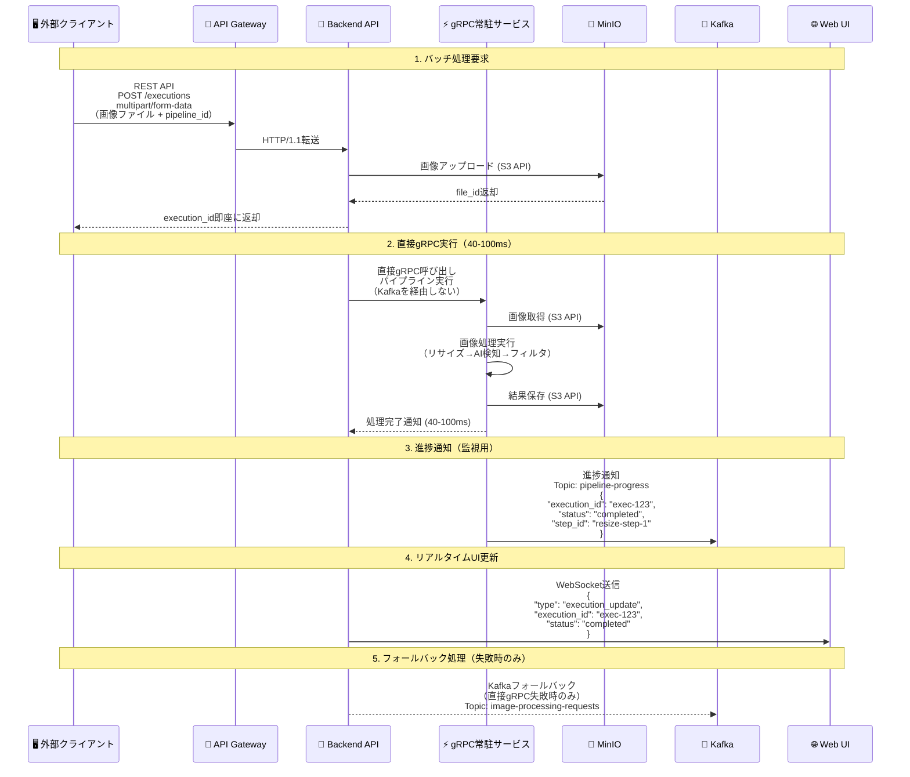
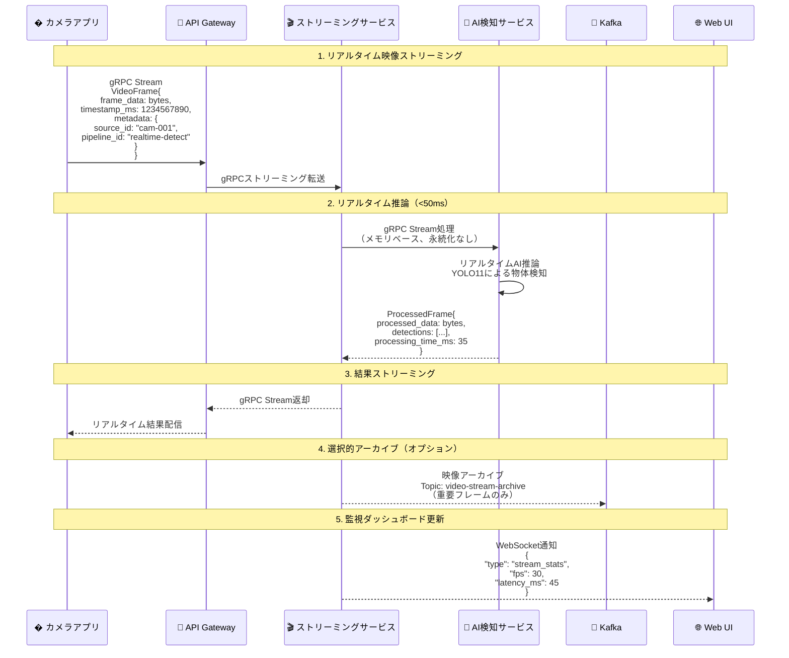

# ImageFlowCanvas API設計書

## **文書管理情報**

| 項目       | 内容                      |
| ---------- | ------------------------- |
| 文書名     | ImageFlowCanvas API設計書 |
| バージョン | 1.0                       |
| 作成日     | 2025年7月12日             |
| 更新日     | 2025年7月12日             |


---

## **5. API設計**

### **5.0. プロトコル設計**

#### **5.0.1. バッチ処理（パイプライン実行）データフロー**


    
#### **5.0.2. リアルタイム処理（映像ストリーミング）データフロー**


```

#### **5.0.3. プロトコル最適化の選択基準**

| 🎯 用途・シナリオ         | 🚀 推奨プロトコル    | ⚡ 性能特性                                                           | 📝 選択理由                             |
| :----------------------- | :------------------ | :------------------------------------------------------------------- | :------------------------------------- |
| **バッチ画像処理**       | REST API + 直接gRPC | • 超高速処理 (40-100ms)<br/>• ファイル永続化<br/>• 高信頼性          | パイプライン実行、結果保存が必要な用途 |
| **リアルタイム映像処理** | gRPC Streaming      | • 極低レイテンシ (<50ms)<br/>• ストリーミング対応<br/>• メモリベース | ライブ配信、監視カメラ、AR/VR用途      |
| **進捗通知・監視**       | Kafka + WebSocket   | • 非同期通知<br/>• 高スループット<br/>• リアルタイム性               | システム監視、ダッシュボード更新       |
| **フォールバック処理**   | Kafka Consumer      | • 高信頼性<br/>• 順序保証<br/>• 耐障害性                             | 直接gRPC失敗時の代替処理               |
| **UI更新通知**           | WebSocket           | • 双方向通信<br/>• リアルタイム性<br/>• 低オーバーヘッド             | 進捗表示、監視ダッシュボード           |
| **データ永続化**         | S3 API              | • RESTful<br/>• 標準互換<br/>• 高可用性                              | MinIOとの連携、オブジェクトストレージ  |
| **サービス間内部通信**   | 直接gRPC            | • 型安全<br/>• 超高性能<br/>• Protocol Buffers                       | マイクロサービス内部の高速通信         |

#### **5.0.4. 処理方式別プロトコル仕様**

##### **� バッチ処理（パイプライン実行）仕様**

```json
// REST API Request (multipart/form-data)
POST /v1/executions
Content-Type: multipart/form-data

{
  "pipeline_id": "uuid-string",
  "input_files": [File, File, ...],    // 画像ファイル
  "parameters": {
    "resize_width": 800,
    "ai_model": "yolo11",
    "output_format": "jpeg"
  },
  "priority": "normal"
}

// Immediate Response (40-100ms後に完了)
{
  "execution_id": "exec-uuid-123",
  "status": "pending",
  "estimated_completion": "2025-07-21T10:30:01.100Z"  // 約100ms後
}

// WebSocket Progress Update
{
  "type": "execution_update",
  "execution_id": "exec-uuid-123",
  "status": "completed",
  "progress": {
    "percentage": 100.0,
    "processing_time_ms": 85
  },
  "output_files": [...]
}
```

##### **🎬 リアルタイム処理（映像ストリーミング）仕様**

```protobuf
// camera_stream.proto
syntax = "proto3";

service CameraStreamProcessor {
  // 双方向ストリーミングRPC（<50msレイテンシ）
  rpc ProcessVideoStream(stream VideoFrame) returns (stream ProcessedFrame);
}

// 映像フレーム入力
message VideoFrame {
  bytes frame_data = 1;          // JPEG/PNGエンコード画像データ
  int64 timestamp_ms = 2;        // フレーム取得時のタイムスタンプ
  VideoMetadata metadata = 3;    // メタデータ
}

message VideoMetadata {
  string source_id = 1;          // カメラの一意なID
  int32 width = 2;               // 幅
  int32 height = 3;              // 高さ
  string pipeline_id = 4;        // 適用する処理パイプラインのID
  map<string, string> processing_params = 5; // AIモデル名などの動的パラメータ
}

// 処理済みフレーム出力
message ProcessedFrame {
  bytes processed_data = 1;       // 処理後の画像データ（オプション）
  string source_id = 2;           // 元のカメラID
  int64 processing_time_ms = 3;   // サーバーサイドでの処理時間
  repeated Detection detections = 4; // AIによる検出結果
}

message Detection {
  string class_name = 1;          // 物体クラス名 ("person", "car")
  float confidence = 2;           // 信頼度 (0.0 ~ 1.0)
  BoundingBox bbox = 3;           // バウンディングボックス
}
```

##### **📨 監視・通知プロトコル仕様**

```json
// Kafka Progress Notification Schema
Topic: "pipeline-progress"
{
  "execution_id": "exec-uuid-123",
  "step_id": "resize-step-1", 
  "status": "completed",
  "timestamp": "2025-07-21T10:30:01.085Z",
  "data": {
    "component_name": "resize",
    "processing_time_ms": 25,
    "output_path": "exec-123/resize-output.jpg"
  }
}

// Kafka Metrics Schema  
Topic: "execution-metrics"
{
  "timestamp": "2025-07-21T10:30:01.100Z",
  "total_executions": 1247,
  "pending_executions": 2,
  "running_executions": 8,
  "worker_mode": "direct_grpc"
}

// Kafka Fallback Processing Schema (失敗時のみ)
Topic: "image-processing-requests"
{
  "execution_id": "exec-uuid-123",
  "pipeline_id": "pipeline-uuid-456",
  "input_files": ["file-id-1", "file-id-2"],
  "parameters": {...},
  "priority": "normal",
  "retry_count": 1
}
```

### **5.1. API アーキテクチャ**

#### **5.1.1. RESTful API設計**

**ベースURL**: `https://api.imageflowcanvas.com/v1`

**共通仕様**:
- プロトコル：HTTPS
- 認証：Bearer Token (JWT)
- コンテンツタイプ：`application/json`
- エラーフォーマット：RFC 7807準拠

#### **5.1.2. API エンドポイント一覧**

| カテゴリ       | エンドポイント            | メソッド | 用途                 |
| -------------- | ------------------------- | -------- | -------------------- |
| 認証           | `/auth/login`             | POST     | ログイン             |
| 認証           | `/auth/logout`            | POST     | ログアウト           |
| パイプライン   | `/pipelines`              | GET      | パイプライン一覧     |
| パイプライン   | `/pipelines`              | POST     | パイプライン作成     |
| パイプライン   | `/pipelines/{id}`         | GET      | パイプライン詳細     |
| パイプライン   | `/pipelines/{id}`         | PUT      | パイプライン更新     |
| パイプライン   | `/pipelines/{id}`         | DELETE   | パイプライン削除     |
| 実行           | `/executions`             | POST     | パイプライン実行     |
| 実行           | `/executions/{id}`        | GET      | 実行状況取得         |
| 実行           | `/executions/{id}/cancel` | POST     | 実行キャンセル       |
| コンポーネント | `/components`             | GET      | コンポーネント一覧   |
| コンポーネント | `/components/{id}`        | GET      | コンポーネント詳細   |
| ファイル       | `/files`                  | POST     | ファイルアップロード |
| ファイル       | `/files/{id}`             | GET      | ファイルダウンロード |

### **5.2. API詳細仕様**

#### **5.2.1. パイプライン実行API（直接gRPC実行）**

```yaml
# POST /v1/executions
requestBody:
  content:
    multipart/form-data:
      schema:
        type: object
        properties:
          pipeline_id:
            type: string
            format: uuid
            description: 実行するパイプラインのID
          input_files:
            type: array
            items:
              type: string
              format: binary
            description: 入力画像ファイル（複数対応）
          parameters:
            type: object
            description: 実行時パラメータ（JSON文字列）
            example: |
              {
                "resize_width": 800,
                "ai_model": "yolo11",
                "output_format": "jpeg"
              }
          priority:
            type: string
            enum: [low, normal, high]
            default: normal

responses:
  '202':
    description: 実行要求即座受付（40-100ms後に完了）
    content:
      application/json:
        schema:
          type: object
          properties:
            execution_id:
              type: string
              format: uuid
            status:
              type: string
              example: "pending"
              description: "即座にrunning→completedに変化"
            estimated_completion:
              type: string
              format: date-time
              description: "約100ms後に完了予定"

  '400':
    description: 無効なリクエスト
    content:
      application/json:
        schema:
          type: object
          properties:
            error:
              type: string
              example: "Invalid pipeline_id or missing input_files"

  '500':
    description: 直接gRPC実行失敗（Kafkaフォールバック）
    content:
      application/json:
        schema:
          type: object
          properties:
            execution_id:
              type: string
            status:
              type: string
              example: "pending"
            fallback_mode:
              type: boolean
              example: true
            message:
              type: string
              example: "Direct gRPC execution failed, using Kafka fallback"
```

#### **5.2.2. 実行状況取得API（超高速完了対応）**

```yaml
# GET /v1/executions/{execution_id}
responses:
  '200':
    description: 実行状況（通常40-100ms後にcompletedステータス）
    content:
      application/json:
        schema:
          type: object
          properties:
            execution_id:
              type: string
              format: uuid
            pipeline_id:
              type: string
              format: uuid
            status:
              type: string
              enum: [pending, running, completed, failed, cancelled]
              description: "直接gRPC実行では瞬時にcompletedになる"
            execution_mode:
              type: string
              enum: [direct_grpc, kafka_fallback]
              description: "実行方式の表示"
            processing_time_ms:
              type: number
              format: float
              example: 85.5
              description: "実際の処理時間（ms）"
            progress:
              type: object
              properties:
                current_step:
                  type: string
                  example: "完了"
                total_steps:
                  type: integer
                  example: 3
                completed_steps:
                  type: integer
                  example: 3
                percentage:
                  type: number
                  format: float
                  example: 100.0
            steps:
              type: array
              items:
                type: object
                properties:
                  step_id:
                    type: string
                    example: "resize-step-0"
                  component_name:
                    type: string
                    example: "resize"
                  status:
                    type: string
                    enum: [pending, running, completed, failed]
                  started_at:
                    type: string
                    format: date-time
                  completed_at:
                    type: string
                    format: date-time
                  processing_time_ms:
                    type: number
                    format: float
                    example: 25.3
            output_files:
              type: array
              items:
                type: object
                properties:
                  file_id:
                    type: string
                    description: "MinIOオブジェクト名（拡張子なし）"
                  filename:
                    type: string
                    example: "exec-123-resize-output.jpg"
                  file_size:
                    type: integer
                    format: int64
                  content_type:
                    type: string
                    example: "image/jpeg"
                  download_url:
                    type: string
                    example: "/api/files/exec-123-resize-output"
            created_at:
              type: string
              format: date-time
            started_at:
              type: string
              format: date-time
            completed_at:
              type: string
              format: date-time
              description: "直接gRPC実行では作成から100ms程度後"
```

### **5.3. gRPC API設計**

#### **5.3.1. リアルタイム映像処理gRPC**

```protobuf
syntax = "proto3";

package imageflow.v1;

// リアルタイム映像ストリーミングサービス
service CameraStreamProcessor {
  // 双方向ストリーミング映像処理（<50msレイテンシ）
  rpc ProcessVideoStream(stream VideoFrame) returns (stream ProcessedFrame);
  
  // 実行監視（バッチ処理用）
  rpc WatchExecution(WatchRequest) returns (stream ExecutionUpdate);
}

// バッチ処理用直接gRPCサービス
service DirectPipelineExecutor {
  // 直接パイプライン実行（40-100ms処理）
  rpc ExecutePipeline(PipelineRequest) returns (PipelineResult);
  
  // ヘルスチェック
  rpc HealthCheck(HealthRequest) returns (HealthResponse);
}

// リアルタイム映像フレーム
message VideoFrame {
  bytes frame_data = 1;          // JPEG/PNGエンコード画像データ
  int64 timestamp_ms = 2;        // フレーム取得時のタイムスタンプ
  VideoMetadata metadata = 3;    // メタデータ
}

message VideoMetadata {
  string source_id = 1;          // カメラの一意なID
  int32 width = 2;               // 幅
  int32 height = 3;              // 高さ
  string pipeline_id = 4;        // 適用する処理パイプラインのID
  map<string, string> processing_params = 5; // AIモデル名などのパラメータ
}

// 処理済み映像フレーム
message ProcessedFrame {
  bytes processed_data = 1;       // 処理後の画像データ（オプション）
  string source_id = 2;           // 元のカメラID
  int64 processing_time_ms = 3;   // サーバーサイドでの処理時間
  repeated Detection detections = 4; // AIによる検出結果
  ProcessingStats stats = 5;      // 処理統計
}

// バッチ処理用パイプライン実行
message PipelineRequest {
  string pipeline_id = 1;
  repeated string input_file_ids = 2;  // MinIOファイルID
  map<string, string> parameters = 3;
  Priority priority = 4;
}

message PipelineResult {
  string execution_id = 1;
  ExecutionStatus status = 2;
  repeated OutputFile output_files = 3;
  int64 processing_time_ms = 4;
  string error_message = 5;
}

// 共通メッセージ
message Detection {
  string class_name = 1;          // 物体クラス名 ("person", "car")
  float confidence = 2;           // 信頼度 (0.0 ~ 1.0)
  BoundingBox bbox = 3;           // バウンディングボックス
}

message BoundingBox {
  float x = 1;
  float y = 2;
  float width = 3;
  float height = 4;
}

message ProcessingStats {
  int64 total_processing_time_ms = 1;
  int64 ai_inference_time_ms = 2;
  int64 resize_time_ms = 3;
  int64 filter_time_ms = 4;
}

enum Priority {
  PRIORITY_LOW = 0;
  PRIORITY_NORMAL = 1;
  PRIORITY_HIGH = 2;
}

enum ExecutionStatus {
  STATUS_PENDING = 0;
  STATUS_RUNNING = 1;
  STATUS_COMPLETED = 2;
  STATUS_FAILED = 3;
}

message OutputFile {
  string file_id = 1;
  string filename = 2;
  string download_url = 3;
  int64 file_size = 4;
  string content_type = 5;
}
```

**個別処理サービス**

```protobuf
// リサイズサービス（10-20ms処理）
service ResizeService {
  rpc Resize(ResizeRequest) returns (ResizeResponse);
}

message ResizeRequest {
  string input_file_id = 1;      // MinIOファイルID
  int32 target_width = 2;
  int32 target_height = 3;
  ResizeMode mode = 4;           // STRETCH, ASPECT_RATIO_KEEP, CROP
}

// AI検出サービス（20-50ms処理、GPU利用時）
service AIDetectionService {
  rpc Detect(DetectionRequest) returns (DetectionResponse);
}

message DetectionRequest {
  string input_file_id = 1;
  string model_name = 2;         // "yolo11n", "yolo11s", etc
  float confidence_threshold = 3; // デフォルト: 0.5
  repeated string target_classes = 4; // フィルタ対象クラス
}

// フィルタサービス（5-15ms処理）
service FilterService {
  rpc ApplyFilter(FilterRequest) returns (FilterResponse);
}

message FilterRequest {
  string input_file_id = 1;
  FilterType filter_type = 2;
  map<string, float> parameters = 3; // ガウシアンの σ値等
}

enum FilterType {
  FILTER_BLUR = 0;
  FILTER_SHARPEN = 1;
  FILTER_EDGE_DETECTION = 2;
  FILTER_BRIGHTNESS = 3;
  FILTER_CONTRAST = 4;
}

// 共通レスポンス構造
message ResizeResponse {
  string output_file_id = 1;
  int64 processing_time_ms = 2;
  ProcessingError error = 3;
}

message DetectionResponse {
  string output_file_id = 1;      // 検出結果の重畳画像（オプション）
  repeated Detection detections = 2;
  int64 processing_time_ms = 3;
  ProcessingError error = 4;
}

message FilterResponse {
  string output_file_id = 1;
  int64 processing_time_ms = 2;
  ProcessingError error = 3;
}

message ProcessingError {
  int32 code = 1;
  string message = 2;
  string details = 3;
}
```

**サービス接続性**

```yaml
# gRPCサービス接続情報
services:
  resize:
    endpoint: "resize-grpc-app:50051"
    timeout: "30s"
    retry_policy:
      max_attempts: 3
      initial_backoff: "100ms"
      
  ai_detection:
    endpoint: "ai-detection-grpc-app:50052"
    timeout: "60s"  # AI処理のため長めのタイムアウト
    retry_policy:
      max_attempts: 2
      initial_backoff: "200ms"
      
  filter:
    endpoint: "filter-grpc-app:50053"
    timeout: "20s"
    retry_policy:
      max_attempts: 3
      initial_backoff: "50ms"

# 冗長性設定
redundancy:
  kafka_fallback: true          # gRPC失敗時のKafka切り替え
  health_check_interval: "10s"  # サービス監視間隔
  circuit_breaker:
    failure_threshold: 5
    recovery_timeout: "30s"
```

### **5.4. WebSocket API設計**

#### **5.4.1. リアルタイム進捗通知**

```javascript
// WebSocket接続エンドポイント
ws://localhost:8080/ws/execution/{execution_id}

// 進捗通知メッセージ形式
{
  "type": "progress",
  "execution_id": "exec-uuid-123",
  "step": "ai_detection",
  "progress": 65.5,
  "status": "processing",
  "timestamp": "2025-07-21T10:30:01.085Z",
  "data": {
    "current_component": "AI Detection Service",
    "elapsed_time_ms": 1750,
    "estimated_remaining_ms": 850
  }
}

// 完了通知
{
  "type": "completed",
  "execution_id": "exec-uuid-123",
  "total_time_ms": 87,
  "output_files": [
    {
      "file_id": "output-123",
      "filename": "result.jpg",
      "download_url": "/api/v1/files/output-123/download"
    }
  ]
}

// エラー通知
{
  "type": "error",
  "execution_id": "exec-uuid-123",
  "error": {
    "code": "AI_SERVICE_UNAVAILABLE",
    "message": "AI Detection Service temporarily unavailable",
    "retry_after": 30
  }
}
```

```protobuf
syntax = "proto3";

package imageflow.v1;

// リアルタイム映像ストリーミングサービス
service CameraStreamProcessor {
  // 双方向ストリーミング映像処理（<50msレイテンシ）
  rpc ProcessVideoStream(stream VideoFrame) returns (stream ProcessedFrame);
  
  // 実行監視（バッチ処理用）
  rpc WatchExecution(WatchRequest) returns (stream ExecutionUpdate);
}

// バッチ処理用直接gRPCサービス
service DirectPipelineExecutor {
  // 直接パイプライン実行（40-100ms処理）
  rpc ExecutePipeline(PipelineRequest) returns (PipelineResult);
  
  // ヘルスチェック
  rpc HealthCheck(HealthRequest) returns (HealthResponse);
}

// リアルタイム映像フレーム
message VideoFrame {
  bytes frame_data = 1;          // JPEG/PNGエンコード画像データ
  int64 timestamp_ms = 2;        // フレーム取得時のタイムスタンプ
  VideoMetadata metadata = 3;    // メタデータ
}

message VideoMetadata {
  string source_id = 1;          // カメラの一意なID
  int32 width = 2;               // 幅
  int32 height = 3;              // 高さ
  string pipeline_id = 4;        // 適用する処理パイプラインのID
  map<string, string> processing_params = 5; // AIモデル名などのパラメータ
}

// 処理済み映像フレーム
message ProcessedFrame {
  bytes processed_data = 1;       // 処理後の画像データ（オプション）
  string source_id = 2;           // 元のカメラID
  int64 processing_time_ms = 3;   // サーバーサイドでの処理時間
  repeated Detection detections = 4; // AIによる検出結果
  ProcessingStats stats = 5;      // 処理統計
}

// バッチ処理用パイプライン実行
message PipelineRequest {
  string pipeline_id = 1;
  repeated string input_file_ids = 2;  // MinIOファイルID
  map<string, string> parameters = 3;
  Priority priority = 4;
}

message PipelineResult {
  string execution_id = 1;
  ExecutionStatus status = 2;
  repeated OutputFile output_files = 3;
  int64 processing_time_ms = 4;
  string error_message = 5;
}

// 共通メッセージ
message Detection {
  string class_name = 1;          // 物体クラス名 ("person", "car")
  float confidence = 2;           // 信頼度 (0.0 ~ 1.0)
  BoundingBox bbox = 3;           // バウンディングボックス
}

message BoundingBox {
  float x = 1;
  float y = 2;
  float width = 3;
  float height = 4;
}

message ProcessingStats {
  int64 total_processing_time_ms = 1;
  int64 ai_inference_time_ms = 2;
  int64 resize_time_ms = 3;
  int64 filter_time_ms = 4;
}

enum Priority {
  PRIORITY_LOW = 0;
  PRIORITY_NORMAL = 1;
  PRIORITY_HIGH = 2;
}

enum ExecutionStatus {
  STATUS_PENDING = 0;
  STATUS_RUNNING = 1;
  STATUS_COMPLETED = 2;
  STATUS_FAILED = 3;
}

message OutputFile {
  string file_id = 1;
  string filename = 2;
  string download_url = 3;
  int64 file_size = 4;
  string content_type = 5;
}
```

### **5.4. WebSocket API設計**

#### **5.4.1. リアルタイム進捗通知**

```typescript
// WebSocket接続：wss://api.imageflowcanvas.com/v1/ws

// 認証メッセージ
interface AuthMessage {
  type: 'auth';
  token: string;
}

// 実行監視開始
interface WatchMessage {
  type: 'watch';
  execution_id: string;
}

// 進捗通知
interface ProgressMessage {
  type: 'progress';
  execution_id: string;
  data: {
    status: 'pending' | 'running' | 'completed' | 'failed';
    current_step: string;
    progress_percentage: number;
    step_details: {
      component_name: string;
      status: string;
      started_at?: string;
      completed_at?: string;
      resource_usage?: {
        cpu_usage: number;
        memory_usage: number;
        gpu_usage?: number;
      };
#### **5.4.2. ストリーミング映像配信**

```javascript
// リアルタイム映像配信WebSocket
ws://localhost:8080/ws/stream/{camera_id}

// 映像フレーム配信メッセージ
{
  "type": "video_frame",
  "camera_id": "cam-office-1", 
  "frame_data": "base64_encoded_frame_data",
  "timestamp": "2025-07-21T10:30:01.045Z",
  "detections": [
    {
      "class": "person",
      "confidence": 0.92,
      "bbox": {
        "x": 150,
        "y": 200,
        "width": 80,
        "height": 180
      }
    }
  ],
  "processing_stats": {
    "frame_processing_time_ms": 35,
    "total_detections": 2,
    "fps": 28.5
  }
}

// ストリーミング制御メッセージ
{
  "type": "stream_control",
  "action": "start|stop|pause",
  "camera_id": "cam-office-1",
  "processing_pipeline": "yolo11n-detection"
}
```

#### **5.4.3. TypeScript型定義**

```typescript
// WebSocket メッセージ型定義
export interface ProgressMessage {
  type: 'progress';
  execution_id: string;
  step: string;
  progress: number;
  status: 'pending' | 'running' | 'completed' | 'failed';
  timestamp: string;
  data: {
    current_component: string;
    elapsed_time_ms: number;
    estimated_remaining_ms: number;
  };
}

export interface CompletedMessage {
  type: 'completed';
  execution_id: string;
  total_time_ms: number;
  output_files: {
    file_id: string;
    filename: string;
    download_url: string;
  }[];
}

export interface ErrorMessage {
  type: 'error';
  execution_id: string;
  error: {
    code: string;
    message: string;
    details?: any;
  };
}

export interface VideoFrameMessage {
  type: 'video_frame';
  camera_id: string;
  frame_data: string;  // base64
  timestamp: string;
  detections: Detection[];
  processing_stats: {
    frame_processing_time_ms: number;
    total_detections: number;
    fps: number;
  };
}

export interface Detection {
  class: string;
  confidence: number;
  bbox: {
    x: number;
    y: number;
    width: number;
    height: number;
  };
}
```

---

## **関連文書**

- [概要設計](./0300_概要設計.md)
- [データベース設計](./0303_データベース設計.md)
- [セキュリティ設計](./0306_セキュリティ設計.md)
