_# ImageFlowCanvas API設計書

_# 文書管理情報

| 項目       | 内容                      |
| ---------- | ------------------------- |
| 文書名     | ImageFlowCanvas API設計書 |
| バージョン | 1.3                       |
| 作成日     | 2025年7月12日             |
| 更新日     | 2025年8月24日             |


---

# 1. プロトコル設計

## 1.1. バッチ処理（パイプライン実行）データフロー

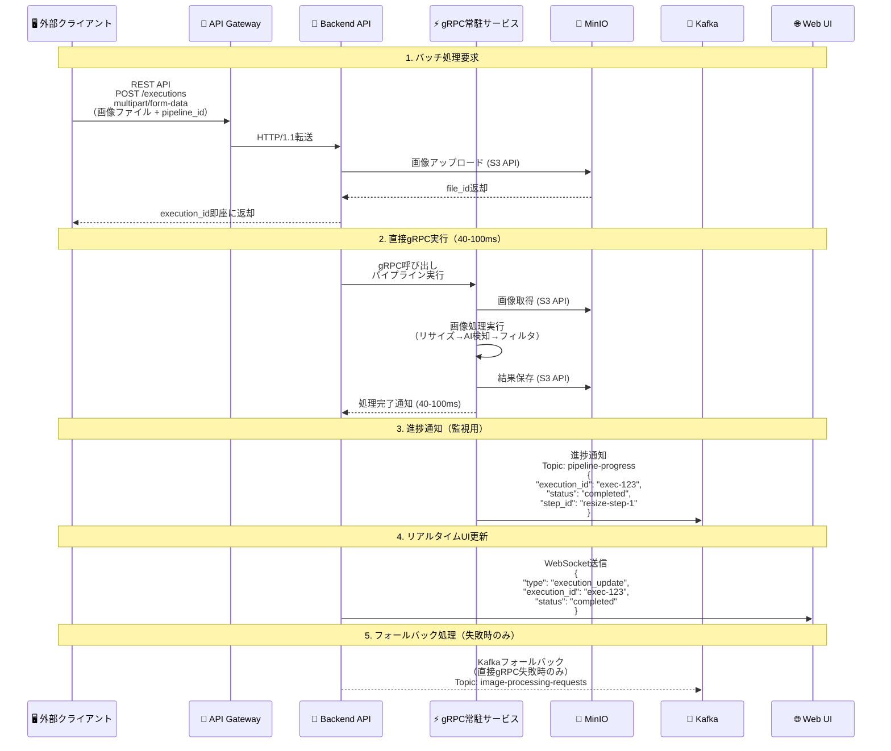
    
## 1.2. リアルタイム処理（映像ストリーミング）データフロー

### 1.2.1. 単一路インジェスト＋サーバ分岐（WHEP/WebRTC）

本システムでは、デバイス（THINKLET等）からの映像/音声は WHEP/WebRTC による「単一路インジェスト」で Ingest Gateway に送信し、サーバ側でAI/録画/配信に分岐します。端末アプリやWebはサーバから配信・通知を受け取ります。

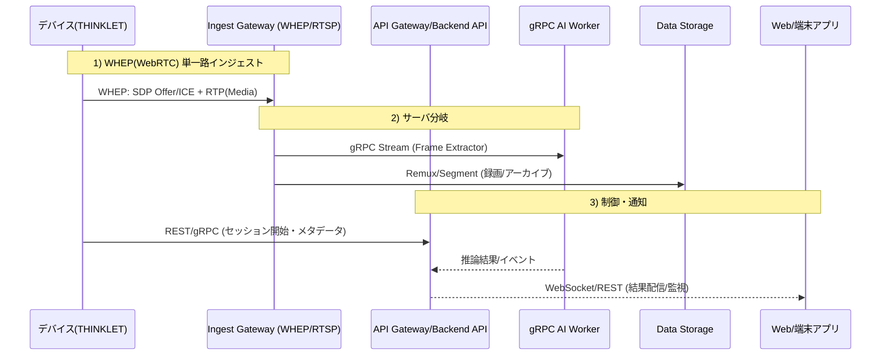

### 1.2.2. クライアント接続の使い分け（WHEP中心）

| クライアント種別           | 通信プロトコル                     | 役割・利点                                      |
| :------------------------- | :--------------------------------- | :---------------------------------------------- |
| **🖥️ デバイス(THINKLET等)** | WebRTC(WHEP), REST/gRPC(制御/メタ) | 単一路インジェスト、制御/メタデータ、再接続制御 |
| **🖥️ 端末アプリ**           | REST/gRPC, WebSocket               | 結果取得、設定/制御、監視通知                   |
| **🌐 Webブラウザ**          | WebSocket, REST                    | 監視ダッシュボード、リアルタイム通知、管理操作  |

---

### 1.2.3. 端末アプリ（ハンディーターミナル/デスクトップ）→ gRPC ストリーミング

端末アプリ（Kotlin Multiplatform: ハンディーターミナル/デスクトップ）は、WebRTCのインジェストではなく、gRPC双方向ストリーミングでサーバーへフレーム（または圧縮画像チャンク）を送信し、低遅延なAI結果を受信します。制御・メタデータはgRPC/REST、通知はWebSocketで配信します。

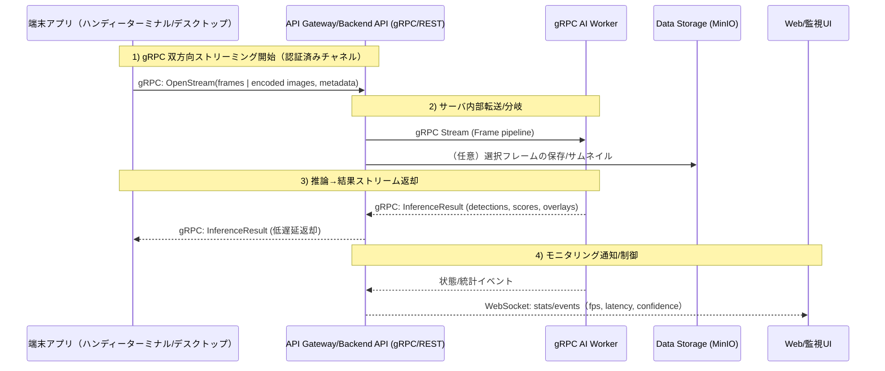

端末アプリ gRPC ストリーミングのI/O仕様（代表）

- 入力（Term→API）
  - ストリームメッセージ: `FrameChunk { content_type, bytes | zero-copy ref, ts, product_info?, session_id }`
  - 制御メッセージ: `Control { start/stop, qos, crop/roi, rate_hint }`
- 出力（API→Term）
  - ストリームメッセージ: `InferenceResult { detections[], score, overlay?, processing_ms }`
  - エラー/状態: `Status { code, message, retry_after? }`

補足
- アーカイブが必要な場合は、端末側は静止画/必要フレームをRESTでアップロード、またはAPIが選択フレームをMinIOへ保存します。
- 帯域・電力状況に応じたQoSは、`Control` とサーバ側のポリシーで双方向制御します。

## 1.3. プロトコル最適化の選択基準

| 🎯 用途・シナリオ     | 🖥️ クライアント種別           | 🚀 推奨プロトコル    | ⚡ 性能特性                                                       | 📝 選択理由                               |
| :------------------- | :--------------------------- | :------------------ | :--------------------------------------------------------------- | :--------------------------------------- |
| バッチ画像処理       | Kotlin Multiplatform/Web共通 | REST API + 直接gRPC | • 超高速処理 (40-100ms)<br/>• ファイル永続化<br/>• 高信頼性      | パイプライン実行、結果保存が必要な用途   |
| リアルタイム映像処理 | 🖥️ Kotlin Multiplatformアプリ | gRPC Streaming      | • 極低レイテンシ (<30ms)<br/>• ネイティブ性能<br/>• バイナリ効率 | ライブ配信、監視カメラ、検査システム用途 |
| リアルタイム映像処理 | 🌐 Webブラウザ                | WebSocket           | • ブラウザ互換性<br/>• 中レイテンシ (<100ms)<br/>• JSON形式      | ブラウザベース監視、ダッシュボード       |
| 進捗通知・監視       | Kotlin Multiplatform/Web共通 | Kafka + WebSocket   | • 非同期通知<br/>• 高スループット<br/>• リアルタイム性           | システム監視、ダッシュボード更新         |
| フォールバック処理   | サーバー内部                 | Kafka Consumer      | • 高信頼性<br/>• 順序保証<br/>• 耐障害性                         | 直接gRPC失敗時の代替処理                 |
| UI更新通知           | 🖥️ Kotlin Multiplatformアプリ | gRPC Push/WebSocket | • 双方向通信<br/>• 型安全<br/>• 低オーバーヘッド                 | Kotlin Multiplatformアプリ内の進捗表示   |
| UI更新通知           | 🌐 Webブラウザ                | WebSocket           | • 双方向通信<br/>• リアルタイム性<br/>• ブラウザ標準             | Web監視ダッシュボード                    |
| データ永続化         | サーバー内部                 | S3 API              | • RESTful<br/>• 標準互換<br/>• 高可用性                          | MinIOとの連携、オブジェクトストレージ    |
| サービス間内部通信   | サーバー内部                 | 直接gRPC            | • 型安全<br/>• 超高性能<br/>• Protocol Buffers                   | マイクロサービス内部の高速通信           |

## 1.4. 処理方式別プロトコル仕様

### 1.4.1. 📋 バッチ処理（パイプライン実行）仕様

REST API multipart/form-dataでの画像アップロードと、直接gRPC実行による40-100ms高速処理を提供。
実行完了後、WebSocketで進捗通知を送信します。

### 1.4.2. 🎬 リアルタイム処理（映像ストリーミング）仕様

クライアント種別に応じた最適化されたストリーミング実装：

**🖥️ Kotlin Multiplatformアプリ向け - gRPCストリーミング**
- プロトコル: ネイティブgRPC bidirectional streaming
- レイテンシ: <30ms（最高性能）
- データ形式: Protocol Buffers（バイナリ効率）
- 接続方式: 直接API Gateway接続

**🌐 Webブラウザ向け - WebSocketストリーミング**
- プロトコル: WebSocket binary/text messaging
- レイテンシ: <100ms（ブラウザ制約内）
- データ形式: JSON + Base64エンコード（互換性重視）
- 接続方式: API Gateway経由でのプロトコル変換

### 1.4.3. 📨 監視・通知プロトコル仕様

Kafkaによる進捗通知とWebSocketによるリアルタイム更新で、
実行状況の監視とダッシュボード表示を行います。

# 2. API アーキテクチャ

## 2.1. ハイブリッドAPIアーキテクチャ

### 2.1.1. Backend API設計思想

ImageFlowCanvasのBackend APIは、**FastAPI + grpcio**によるハイブリッド実装を採用し、複数のプロトコルを統合管理する「司令塔」として機能します。

#### 2.1.1.1. **アーキテクチャ構成**

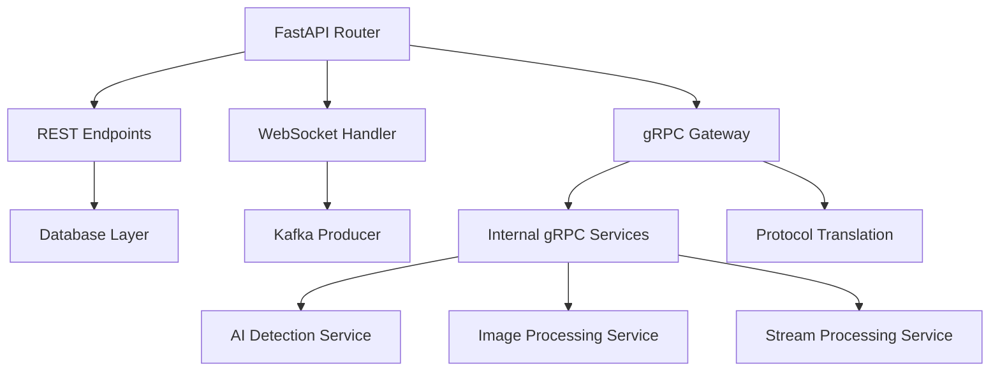

#### 2.1.1.2. **プロトコル選択方針**

| 用途             | プロトコル | 理由                                   |
| ---------------- | ---------- | -------------------------------------- |
| 管理画面・設定   | REST API   | シンプルな操作、キャッシュ効率         |
| リアルタイム通知 | WebSocket  | ブラウザ互換性、双方向通信             |
| 高性能AI処理     | gRPC       | 型安全性、ストリーミング、低レイテンシ |
| 非同期処理       | Kafka      | 高スループット、耐障害性               |


### 2.1.2. プロトコル統合戦略

| プロトコル         | 担当領域             | 実装技術          | 特徴                               |
| ------------------ | -------------------- | ----------------- | ---------------------------------- |
| **FastAPI**        | REST API + WebSocket | uvicorn + asyncio | 自動ドキュメント生成、非同期処理   |
| **grpcio**         | gRPCサーバー         | grpcio + asyncio  | 高性能、型安全性、Protocol Buffers |
| **WebSocket**      | リアルタイム通知     | FastAPI WebSocket | 双方向通信、疎結合アーキテクチャ   |
| **Kafka Consumer** | 進捗配信             | aiokafka          | 非同期メッセージング、スケーラブル |

## 2.2. RESTful API設計

### 2.2.1. 基本仕様
- ベースURL: `https://api.imageflowcanvas.com/v1`
- プロトコル：HTTPS必須
- 認証：Bearer Token (JWT)
- コンテンツタイプ：`application/json`
- エラーフォーマット：RFC 7807準拠

### 2.2.2. 実装済みエンドポイント一覧

| カテゴリ         | エンドポイント                  | メソッド  | 用途                 | 実装状況 |
| ---------------- | ------------------------------- | --------- | -------------------- | -------- |
| 認証             | `/auth/login`                   | POST      | ログイン             | ✅        |
| 認証             | `/auth/logout`                  | POST      | ログアウト           | ✅        |
| ヘルスチェック   | `/health`                       | GET       | システム状態確認     | ✅        |
| パイプライン     | `/pipelines`                    | GET       | パイプライン一覧     | ✅        |
| パイプライン     | `/pipelines`                    | POST      | パイプライン作成     | ✅        |
| パイプライン     | `/pipelines/{id}`               | GET       | パイプライン詳細     | ✅        |
| パイプライン     | `/pipelines/{id}`               | PUT       | パイプライン更新     | ✅        |
| パイプライン     | `/pipelines/{id}`               | DELETE    | パイプライン削除     | ✅        |
| 実行             | `/executions`                   | POST      | パイプライン実行     | ✅        |
| 実行             | `/executions/{id}`              | GET       | 実行状況取得         | ✅        |
| 実行             | `/executions/{id}/cancel`       | POST      | 実行キャンセル       | ✅        |
| コンポーネント   | `/components`                   | GET       | コンポーネント一覧   | ✅        |
| コンポーネント   | `/components/{id}`              | GET       | コンポーネント詳細   | ✅        |
| ファイル         | `/files`                        | POST      | ファイルアップロード | ✅        |
| ファイル         | `/files/{id}`                   | GET       | ファイルダウンロード | ✅        |
| 検査マスタ       | `/inspection-instructions`      | GET       | 検査指示一覧         | ✅        |
| 検査マスタ       | `/inspection-instructions`      | POST      | 検査指示作成         | ✅        |
| 検査マスタ       | `/inspection-instructions/{id}` | GET       | 検査指示詳細         | ✅        |
| 検査実行         | `/inspection-executions`        | POST      | 検査実行             | ✅        |
| 検査実行         | `/inspection-executions/{id}`   | GET       | 検査結果取得         | ✅        |
| gRPCサービス     | `/grpc-services`                | GET       | gRPCサービス状況     | ✅        |
| カメラストリーム | `/camera-stream`                | WebSocket | リアルタイム映像     | ✅        |

### 2.2.3. WebSocket専用エンドポイント
- `/ws/execution/{execution_id}`: パイプライン実行進捗通知
- `/ws/inspection/{execution_id}`: 検査実行進捗通知  
- `/ws/system-status`: システム状況リアルタイム更新
- `/ws/camera-stream`: カメラストリーミング

# 3. API詳細仕様

## 3.1. パイプライン実行API（直接gRPC実行）

エンドポイント: `POST /v1/executions`

機能: 画像ファイルをアップロードしてパイプライン処理を実行

リクエスト形式: multipart/form-data
- pipeline_id (必須): 実行するパイプラインのUUID
- input_files (必須): 入力画像ファイル（複数対応）
- parameters (オプション): 実行時パラメータ（JSON形式）
- priority (オプション): 優先度（low/normal/high）

### 3.1.1. パイプライン実行API詳細仕様
```
POST /api/v1/executions
Content-Type: application/json

{
  "pipeline_id": "pipeline-67890",
  "input_files": ["file1.jpg", "file2.png"],
  "parameters": {
    "resize_width": 512,
    "ai_threshold": 0.8
  },
  "client_id": "client-123"
}

Response:
{
  "execution_id": "exec-12345",
  "status": "queued",
  "estimated_duration_ms": 5000,
  "websocket_url": "ws://api.example.com/ws/exec-12345"
}
```

### 3.1.2. 検査指示管理API

#### 3.1.2.1. 検査指示一覧取得API
```
GET /api/v1/inspection-instructions?page=1&per_page=20

Response:
{
  "instructions": [
    {
      "id": "instruction-12345",
      "name": "基板A型式検査",
      "description": "基板A型式の外観検査",
      "product_code": "PROD-001",
      "version": "1.0",
      "created_at": "2025-08-08T10:00:00Z"
    }
  ],
  "total_count": 1,
  "page": 1,
  "per_page": 20
}
```

#### 3.1.2.2. 検査指示詳細取得API
```
GET /api/v1/inspection-instructions/{id}

Response:
{
  "id": "instruction-12345",
  "name": "基板A型式検査",
  "description": "基板A型式の外観検査",
  "product_code": "PROD-001",
  "version": "1.0",
  "metadata": {
    "qr_pattern": "PROD-001-{YYYYMMDD}-{SEQ}",
    "specifications": {...}
  },
  "inspection_items": [
    {
      "id": "item-001",
      "name": "表面傷チェック",
      "description": "基板表面の傷を検査"
    }
  ],
  "created_at": "2025-08-08T10:00:00Z"
}
```

### 3.1.3. 検査実行API

#### 3.1.3.1. 検査実行開始API
```
POST /api/v1/inspection-executions
Content-Type: multipart/form-data

FormData:
- instruction_id: "instruction-12345"
- qr_code: "PROD-001-20250808-001" (optional)
- images: [File1.jpg, File2.jpg] (multiple files)

Response:
{
  "execution_id": "exec-12345",
  "instruction_id": "instruction-12345",
  "status": "pending",
  "estimated_duration_ms": 5000,
  "websocket_url": "ws://api.example.com/ws/inspection/exec-12345"
}
```

#### 3.1.3.2. 検査結果取得API
```
GET /api/v1/inspection-executions/{execution_id}

Response:
{
  "execution_id": "exec-12345",
  "instruction_id": "instruction-12345",
  "status": "completed",
  "qr_code": "PROD-001-20250808-001",
  "execution_time_ms": 4250,
  "overall_result": "PASS",
  "confidence": 0.95,
  "ai_results": [
    {
      "item_id": "item-001",
      "result": "PASS",
      "confidence": 0.98,
      "detection_data": {...}
    }
  ],
  "human_verification": {
    "final_result": "PASS",
    "notes": "外観良好",
    "verified_by": "user-123",
    "verified_at": "2025-08-08T10:05:00Z"
  },
  "created_at": "2025-08-08T10:00:00Z",
  "completed_at": "2025-08-08T10:05:00Z"
}
```

レスポンス:
- 202: 実行要求受付（40-100ms後に完了予定）
- 400: 無効なリクエスト
- 500: 直接gRPC実行失敗（Kafkaフォールバック）

## 3.2. 実行状況取得API（超高速完了対応）

エンドポイント: `GET /v1/executions/{execution_id}`

機能: パイプライン実行の状況を取得

### 3.2.1. パイプライン状況取得API詳細仕様
```
GET /api/v1/executions/{execution_id}

Response:
{
  "execution_id": "exec-12345",
  "pipeline_id": "pipeline-67890",
  "status": "running",
  "progress_percentage": 75.5,
  "current_step": "ai_detection",
  "elapsed_time_ms": 3750,
  "estimated_remaining_ms": 1250,
  "results": {
    "output_files": ["processed_file1.jpg"],
    "metadata": {...}
  }
}
```

レスポンス情報:
- execution_id: 実行ID
- status: 実行状況（pending/running/completed/failed/cancelled）
- execution_mode: 実行方式（direct_grpc/kafka_fallback）
- processing_time_ms: 実際の処理時間
- progress: 進捗情報
- steps: 各ステップの詳細状況
- output_files: 出力ファイル情報

## 3.3. THINKLET 一人称映像 API（統合映像管理基盤）

THINKLETデバイスの一人称映像を統合管理するAPI群。

### 3.3.1. エンドポイント一覧（/api/v1/thinklet/*）

| 区分       | パス                                               | メソッド | 概要                                        |
| ---------- | -------------------------------------------------- | -------- | ------------------------------------------- |
| デバイス   | `/api/v1/thinklet/devices/register`                | POST     | THINKLETデバイスの登録                      |
| セッション | `/api/v1/thinklet/sessions`                        | POST     | インジェストセッション作成（WHEP発行）      |
| セッション | `/api/v1/thinklet/sessions/{session_id}/telemetry` | POST     | テレメトリ/ハートビート送信                 |
| 制御       | `/api/v1/thinklet/control`                         | POST     | 録画開始/停止・プライバシー停止・QoS切替    |
| 検査連携   | `/api/v1/thinklet/inspections/start`               | POST     | 検査コンテキスト開始（製品情報紐づけ）      |
| セグメント | `/api/v1/thinklet/segments/close`                  | POST     | 検査セグメント確定（メタ/オブジェクト紐付） |

注意:
- メディア自体のWHEP信号交換とRTPは Ingest/配信ゲートウェイ（例: MediaMTX）が担当し、本APIはURL/トークンのブローカーとして動作する。
- RBACにより、装着者自身/品質管理者/管理者のみが該当データへアクセス可能。

### 3.3.2. セッション作成API（WHEP発行）

エンドポイント: `POST /api/v1/thinklet/sessions`

目的: 単一路インジェストの開始に先立ち、WHEP URLと認可トークンを払い出す。検査文脈を同時にスナップショット化して `ingest_sessions.metadata` に保持（0302参照）。

リクエスト（例）:
```json
POST /api/v1/thinklet/sessions
Content-Type: application/json

{
  "thinklet_device_id": "THINKLET-001",
  "worker_id": "worker_123",
  "product": {
    "product_id": "a3f1...",
    "work_order_id": "WO-20250824-001",
    "instruction_id": "INS-20250824-001"
  },
  "qos_preset": "high",       
  "view_angle": "horizontal_wide"
}
```

レスポンス（例）:
```json
{
  "session_id": "b28f...",
  "whep_url": "https://ingest.example.local/whep/thinklet/THINKLET-001",
  "auth_token": "eyJhbGci...",
  "expires_at": "2025-08-24T10:00:00Z"
}
```

備考:
- `session_id` は `ingest_sessions.id` に一致。`qos_preset` は 0302の抽出レート制御と対応。

### 3.3.3. テレメトリAPI（ハートビート）

エンドポイント: `POST /api/v1/thinklet/sessions/{session_id}/telemetry`

目的: 接続状態・QoS・装着状態・視野角などを時系列で受信し、`thinklet_stream_metrics` に蓄積。

リクエスト（例）:
```json
POST /api/v1/thinklet/sessions/b28f.../telemetry
Content-Type: application/json

{
  "fps": 15,
  "bitrate_kbps": 1200,
  "packet_loss": 0.2,
  "rtt_ms": 12,
  "wearing_state": "proper",
  "view_angle": "horizontal_wide",
  "qos_preset": "high"
}
```

レスポンス: `202 Accepted`

### 3.3.4. 制御API（プライバシーゾーン）

エンドポイント: `POST /api/v1/thinklet/control`

目的: THINKLETからのプライバシー入退室制御を受け、サーバ側コンポーネント（Ingest/Recorder/配信）を強制停止/復帰する。

リクエスト（例、入室）:
```json
{
  "action": "privacy_suspend",
  "session_id": "b28f...",
  "device_id": "THINKLET-001",
  "zone_id": "WC-A1",
  "beacon_id": "beac-123",
  "rssi": -63,
  "timestamp": "2025-08-24T01:23:45Z"
}
```

リクエスト（例、退出）:
```json
{
  "action": "privacy_resume",
  "session_id": "b28f...",
  "device_id": "THINKLET-001",
  "zone_id": "WC-A1",
  "timestamp": "2025-08-24T01:35:12Z",
  "confirmation": "user_button|exit_qr"
}
```

レスポンス: `202 Accepted`

検証:
- 認可: デバイス自身/管理者。RBAC必須。
- 監査: すべての制御要求は `privacy_zone_events` に記録。

### 3.3.5. プライバシーゾーン/ビーコン管理API（管理者向け）

| 区分   | パス                                 | メソッド | 概要                         |
| ------ | ------------------------------------ | -------- | ---------------------------- |
| 登録   | `/api/v1/privacy-zones/beacons`      | POST     | ビーコン登録                 |
| 一覧   | `/api/v1/privacy-zones/beacons`      | GET      | ビーコン一覧・検索           |
| 詳細   | `/api/v1/privacy-zones/beacons/{id}` | GET      | ビーコン詳細                 |
| 更新   | `/api/v1/privacy-zones/beacons/{id}` | PUT      | 識別子/交換予定日の更新等    |
| 健全性 | `/api/v1/privacy-zones/health`       | GET      | last_seen/vbattの健全性レポート |

セキュリティ: 管理者ロールのみ。全操作は監査記録。

## 3.4. VMS 映像管理 API（/api/v1/vms/*）

ソース非依存の映像管理API。THINKLET/固定カメラ/端末アプリの映像を一貫したIFで検索・取得・再生する。

### 3.4.1. エンドポイント一覧

| 区分       | パス                                         | メソッド | 概要                              |
| ---------- | -------------------------------------------- | -------- | --------------------------------- |
| 検索       | `/api/v1/vms/search`                         | GET      | セグメント検索                    |
| 詳細       | `/api/v1/vms/segments/{segment_id}`          | GET      | セグメント詳細取得                |
| 再生       | `/api/v1/vms/segments/{segment_id}/playback` | GET      | 署名URL or Viewerトークン発行     |
| ライブ視聴 | `/api/v1/vms/live/{source}/{id}/whep`        | GET      | ライブ視聴用WHEP URL/トークン発行 |

source 例: `thinklet | cctv | terminal`。`id` はソースごとの識別子（デバイスID等）。

### 3.4.2. 検索API

エンドポイント: `GET /api/v1/vms/search`

クエリパラメータ（代表）:
- `source`（任意、default=all）
- `device_id` / `thinklet_id`（任意）
- `worker_id`（任意）
- `product_id` / `work_order_id` / `instruction_id`（任意）
- `from` / `to`（ISO8601）
- `view_angle`（enum: horizontal_wide|vertical_wide|standard）
- `quality_result`（enum: PASS|FAIL|WARNING 等）
- `limit`（デフォルト200、最大1000）

レスポンス（例）:
```json
{
  "items": [
    {
      "segment_id": "c912...",
      "source": "thinklet",
      "device_id": "THINKLET-001",
      "worker_id": "worker_123",
      "product_id": "a3f1...",
      "recording_start_time": "2025-08-24T01:23:45Z",
      "recording_end_time": "2025-08-24T01:35:12Z",
      "duration_seconds": 687,
      "quality_status": "PASS",
      "object_key": "vms/thinklet/THINKLET-001/2025/08/24/01/...mp4"
    }
  ],
  "total": 1
}
```

実装メモ:
- THINKLETのデータは `thinklet_inspection_segments` を主に走査（DB 1.7.2）。
- 他ソースは将来の `cctv_segments` 等と統合ビューで提供（例: `vms_segments`）。

### 3.4.3. 再生API（署名URL/Viewerトークン）

エンドポイント: `GET /api/v1/vms/segments/{segment_id}/playback`

目的: セグメントの再生を安全に提供。MinIO 署名付きURLまたは配信ゲートウェイ（WHEP）トークンを返す。

レスポンス（例、署名URL方式）:
```json
{
  "playback": {
    "type": "signed_url",
    "url": "https://minio.example.local/vms/thinklet/...mp4?X-Amz-Expires=1800"
  }
}
```

レスポンス（例、WHEP視聴方式）:
```json
{
  "playback": {
    "type": "whep",
    "url": "https://distrib.example.local/whep/view/THINKLET-001",
    "viewer_token": "eyJhbGci...",
    "expires_at": "2025-08-24T10:00:00Z"
  }
}
```

セキュリティ:
- 期限付き発行。RBACでアクセス制御。操作は `traceability_records` に監査記録。
- 既定はプライバシー処理済み派生データを返す。原本再生は承認ワークフロー後の期限付きトークンのみ許可。

# 4. gRPC API設計

## 4.1. 実装済みgRPCサービス

### 4.1.1. サービス構成

ImageFlowCanvasでは、以下のgRPCサービスが実装・稼働しています：

| サービス名              | エンドポイント                 | 機能                 | Protocol Buffers      |
| ----------------------- | ------------------------------ | -------------------- | --------------------- |
| **ResizeService**       | `resize-grpc-app:50051`        | 画像リサイズ処理     | `resize.proto`        |
| **AIDetectionService**  | `ai-detection-grpc-app:50052`  | AI物体検出・分類     | `ai_detection.proto`  |
| **FilterService**       | `filter-grpc-app:50053`        | 画像フィルタ処理     | `filter.proto`        |
| **CameraStreamService** | `camera-stream-grpc-app:50054` | リアルタイム映像処理 | `camera_stream.proto` |

### 4.1.2. 共通プロトコル定義（common.proto）

```protobuf
syntax = "proto3";
package imageflow.v1;

// 共通画像データ構造
message ImageData {
  string bucket = 1;
  string object_key = 2;
  string content_type = 3;
  int64 size_bytes = 4;
  int32 width = 5;
  int32 height = 6;
  google.protobuf.Timestamp created_at = 7;
}

// 直接画像バイト（リアルタイム処理用）
message ImageBytes {
  bytes data = 1;
  string format = 2;  // "JPEG", "PNG"
  int32 width = 3;
  int32 height = 4;
}

// 処理ステータス
enum ProcessingStatus {
  PROCESSING_STATUS_UNSPECIFIED = 0;
  PROCESSING_STATUS_PENDING = 1;
  PROCESSING_STATUS_RUNNING = 2;
  PROCESSING_STATUS_COMPLETED = 3;
  PROCESSING_STATUS_FAILED = 4;
}

// 処理結果共通構造
message ProcessingResult {
  ProcessingStatus status = 1;
  string message = 2;
  ImageData output_image = 3;
  bytes output_data = 7;  // リアルタイム処理用
  map<string, string> metadata = 4;
  google.protobuf.Timestamp processed_at = 5;
  double processing_time_seconds = 6;
}
```

### 4.1.3. 検査マスタ管理Service

```protobuf
service InspectionMasterService {
  // 検査指示の管理
  rpc CreateinspectionInstruction(CreateinspectionInstructionRequest) returns (inspectionInstruction);
  rpc GetinspectionInstruction(GetinspectionInstructionRequest) returns (inspectionInstruction);
  rpc ListinspectionInstructions(ListinspectionInstructionsRequest) returns (ListinspectionInstructionsResponse);
  rpc UpdateinspectionInstruction(UpdateinspectionInstructionRequest) returns (inspectionInstruction);
  rpc DeleteinspectionInstruction(DeleteinspectionInstructionRequest) returns (google.protobuf.Empty);

  // 検査項目の管理
  rpc CreateInspectionItem(CreateInspectionItemRequest) returns (InspectionItem);
  rpc GetInspectionItem(GetInspectionItemRequest) returns (InspectionItem);
  rpc ListInspectionItems(ListInspectionItemsRequest) returns (ListInspectionItemsResponse);
}

message inspectionInstruction {
  string id = 1;
  string name = 2;
  string description = 3;
  string product_code = 4;
  string version = 5;
  map<string, string> metadata = 6;
  google.protobuf.Timestamp created_at = 7;
}

message CreateinspectionInstructionRequest {
  string name = 1;
  string description = 2;
  string product_code = 3;
  map<string, string> metadata = 4;
}
```

### 4.1.4. 検査実行Service

```protobuf
service InspectionExecutionService {
  // 検査実行
  rpc ExecuteInspection(ExecuteInspectionRequest) returns (ExecuteInspectionResponse);
  rpc GetInspectionExecution(GetInspectionExecutionRequest) returns (InspectionExecution);
  rpc ListInspectionExecutions(ListInspectionExecutionsRequest) returns (ListInspectionExecutionsResponse);
  
  // 検査結果の管理
  rpc SaveInspectionResult(SaveInspectionResultRequest) returns (InspectionResult);
  rpc GetInspectionResult(GetInspectionResultRequest) returns (InspectionResult);
}

message ExecuteInspectionRequest {
  string instruction_id = 1;
  repeated ImageData input_images = 2;
  string qr_code = 3;  // Optional QR code data
  map<string, string> parameters = 4;
}

message ExecuteInspectionResponse {
  string execution_id = 1;
  ProcessingStatus status = 2;
  int64 estimated_duration_ms = 3;
}
```

### 4.1.5. 統合パイプライン実行Service

```protobuf
service PipelineService {
  rpc ExecutePipeline(ExecutePipelineRequest) returns (ExecutePipelineResponse);
  rpc StreamProgress(ProgressRequest) returns (stream ProgressUpdate);
  rpc CancelExecution(CancelRequest) returns (CancelResponse);
}

message ExecutePipelineRequest {
  string pipeline_id = 1;
  repeated string input_file_ids = 2;
  map<string, string> parameters = 3;
  string client_id = 4;
}

message ExecutePipelineResponse {
  string execution_id = 1;
  ProcessingStatus status = 2;
  int64 estimated_duration_ms = 3;
}

message ProgressUpdate {
  string execution_id = 1;
  string current_step = 2;
  float progress_percentage = 3;
  ProcessingStatus status = 4;
  google.protobuf.Timestamp timestamp = 5;
}
```

## 4.2. 個別サービス仕様

### 4.2.1. ResizeService (resize.proto)

**機能**: 画像リサイズ・形式変換
**処理時間**: 10-20ms
**エンドポイント**: resize-grpc-app:50051

```protobuf
service ResizeService {
  rpc Resize(ResizeRequest) returns (ResizeResponse);
  rpc HealthCheck(HealthCheckRequest) returns (HealthCheckResponse);
}

message ResizeRequest {
  ImageData input_image = 1;
  int32 instruction_width = 2;
  int32 instruction_height = 3;
  string resize_mode = 4;  // "fit", "fill", "stretch"
  bool maintain_aspect_ratio = 5;
}

message ResizeResponse {
  ProcessingResult result = 1;
}
```

### 4.2.2. AIDetectionService (ai_detection.proto)

**機能**: AI物体検出・分類
**処理時間**: 20-50ms (GPU使用時)
**エンドポイント**: ai-detection-grpc-app:50052

```protobuf
service AIDetectionService {
  rpc Detect(DetectionRequest) returns (DetectionResponse);
  rpc HealthCheck(HealthCheckRequest) returns (HealthCheckResponse);
}

message DetectionRequest {
  ImageData input_image = 1;
  string model_name = 2;      // "yolo11", "resnet50"
  float confidence_threshold = 3;
  repeated string instruction_classes = 4;
}

message DetectionResponse {
  ProcessingResult result = 1;
  repeated Detection detections = 2;
}

message Detection {
  string class_name = 1;
  float confidence = 2;
  BoundingBox bbox = 3;
}

message BoundingBox {
  float x = 1;
  float y = 2;
  float width = 3;
  float height = 4;
}
```

### 4.2.3. FilterService (filter.proto)

**機能**: 画像フィルタ・前後処理
**処理時間**: 5-15ms
**エンドポイント**: filter-grpc-app:50053

```protobuf
service FilterService {
  rpc ApplyFilter(FilterRequest) returns (FilterResponse);
  rpc HealthCheck(HealthCheckRequest) returns (HealthCheckResponse);
}

message FilterRequest {
  ImageData input_image = 1;
  string filter_type = 2;    // "blur", "sharpen", "edge"
  map<string, string> parameters = 3;
}

message FilterResponse {
  ProcessingResult result = 1;
}
```

### 4.2.4. CameraStreamProcessor (camera_stream.proto)

**機能**: リアルタイム映像ストリーミング処理
**レイテンシ**: <50ms
**エンドポイント**:
- Docker Compose: `camera-stream-grpc:9090`
- Kubernetes: `camera-stream-grpc-service.image-processing.svc.cluster.local:9090`
- Nomad/オンプレ例: `192.168.5.15:9094`（例）
**認証**: gRPC Metadata `authorization: Bearer <JWT>`
**暗号化**: 運用時はTLS推奨（LB/Ingress終端 or サーバー証明書）

```protobuf
service CameraStreamProcessor {
  rpc ProcessVideoStream(stream VideoFrame) returns (stream ProcessedFrame);
  rpc HealthCheck(HealthCheckRequest) returns (HealthCheckResponse);
}

message VideoFrame {
  bytes frame_data = 1;                 // JPEG/PNG encoded frame
  int64 timestamp_ms = 2;               // Unix epoch millis
  VideoMetadata metadata = 3;           // Source and processing parameters
}

message ProcessedFrame {
  bytes processed_data = 1;             // Optional processed image
  string source_id = 2;                 // Echo of VideoMetadata.source_id
  int64 processing_time_ms = 3;         // Server-side processing time
  repeated Detection detections = 4;    // AI detection results
  StreamProcessingStatus status = 5;    // SUCCESS/PARTIAL/FAILED/SKIPPED
  string error_message = 6;             // Error detail on failure
  google.protobuf.Timestamp processed_at = 7;
}

message VideoMetadata {
  string source_id = 1;                 // Unique camera/source ID
  int32 width = 2;                      // Frame width
  int32 height = 3;                     // Frame height
  string pipeline_id = 4;               // Processing pipeline identifier
  map<string, string> processing_params = 5; // e.g., model_name, qos hints
}
```

## 4.3. サービス接続管理

### 4.3.1. 内部gRPCサービス一覧

| サービス名            | エンドポイント例（Compose/K8s）                                                | タイムアウト | リトライ回数 | 主要機能             |
| --------------------- | ------------------------------------------------------------------------------ | ------------ | ------------ | -------------------- |
| resize-service        | resize-grpc:9090 / resize-grpc-service.image-processing.svc:9090               | 30秒         | 3回          | 画像リサイズ・正規化 |
| ai-detection-service  | ai-detection-grpc:9090 / ai-detection-grpc-service.image-processing.svc:9090   | 60秒         | 2回          | AI物体検知・分析     |
| filter-service        | filter-grpc:9090 / filter-grpc-service.image-processing.svc:9090               | 20秒         | 3回          | 画像フィルタ・補正   |
| camera-stream-service | camera-stream-grpc:9090 / camera-stream-grpc-service.image-processing.svc:9090 | 10秒         | 1回          | リアルタイム映像処理 |

### 4.3.2. 接続管理方針

| 設定項目           | 方針                 | 理由                     |
| ------------------ | -------------------- | ------------------------ |
| コネクションプール | 各サービス最大10接続 | 負荷分散とリソース効率   |
| ヘルスチェック     | 30秒間隔             | 障害の早期検出           |
| 回復処理           | 指数バックオフ       | ネットワーク障害への対応 |
| 負荷分散           | ラウンドロビン       | 均等な処理分散           |

### 4.3.3. ヘルスチェック・冗長性
- **ヘルスチェック間隔**: 10秒
- **サーキットブレーカー**: 失敗閾値5回、復旧タイムアウト30秒
- **Kafkaフォールバック**: 直接gRPC失敗時の代替処理
- **ロードバランシング**: サービス別の負荷分散

# 5. WebSocket API設計

## 5.1. リアルタイム進捗通知

### 5.1.1. 接続・認証
```javascript
// 接続例
const ws = new WebSocket('ws://api.example.com/ws');

// 認証メッセージ
ws.send(JSON.stringify({
  type: 'auth',
  token: 'jwt-token-here',
  client_id: 'client-123'
}));

// 認証応答
{
  type: 'auth_response',
  status: 'success',
  client_id: 'client-123'
}
```

### 5.1.2. 進捗通知メッセージ
```javascript
// サーバーからの進捗通知
{
  type: 'execution_progress',
  data: {
    execution_id: 'exec-12345',
    pipeline_id: 'pipeline-67890',
    current_step: 'ai_detection',
    progress_percentage: 75.5,
    elapsed_time_ms: 3750,
    estimated_remaining_ms: 1250
  }
}

// 実行完了通知
{
  type: 'execution_completed',
  data: {
    execution_id: 'exec-12345',
    status: 'success',
    total_time_ms: 5000,
    output_files: ['processed_file1.jpg', 'processed_file2.png']
  }
}

// エラー通知
{
  type: 'execution_error',
  data: {
    execution_id: 'exec-12345',
    error_code: 'AI_PROCESSING_FAILED',
    error_message: 'AI service timeout',
    failed_step: 'ai_detection'
  }
}
```

```javascript
// WebSocket接続エンドポイント
ws://localhost:8080/ws/execution/{execution_id}

// 進捗通知メッセージ形式
{
  "type": "progress",
  "execution_id": "exec-uuid-123",
  "step": "ai_detection",
  "progress": 65.5,
  "status": "processing",
  "timestamp": "2025-07-21T10:30:01.085Z",
  "data": {
    "current_component": "AI Detection Service",
    "elapsed_time_ms": 1750,
    "estimated_remaining_ms": 850
  }
}

// 完了通知
{
  "type": "completed",
  "execution_id": "exec-uuid-123",
  "total_time_ms": 87,
  "output_files": [
    {
      "file_id": "output-123",
      "filename": "result.jpg",
      "download_url": "/api/v1/files/output-123/download"
    }
  ]
}

// エラー通知
{
  "type": "error",
  "execution_id": "exec-uuid-123",
  "error": {
    "code": "AI_SERVICE_UNAVAILABLE",
    "message": "AI Detection Service temporarily unavailable",
    "retry_after": 30
  }
}
```

# 6. 製品情報管理API設計

## 6.1. 製品情報取得API

### 6.1.1. QRコード情報取得API

**QRコードデコード・製品情報取得**
```http
POST /api/v1/products/qr-decode
```

リクエスト例:
```json
{
  "qr_code_data": "PROD|WO123456|INST789|TYPE-ABC|MACH001|20250808|001",
  "device_id": "device-001",
  "scanned_by": "user-123",
  "scan_location": {
    "latitude": 35.6762,
    "longitude": 139.6503
  }
}
```

レスポンス例:
```json
{
  "success": true,
  "product_info": {
    "id": "prod-uuid-12345",
    "work_order_id": "WO123456",
    "instruction_id": "INST789",
    "product_code": "TYPE-ABC",
    "machine_number": "MACH001",
    "production_date": "2025-08-08",
    "monthly_sequence": 1,
    "specification": {
      "model": "ABC-100",
      "size": "100x200mm",
      "weight": "1.5kg"
    },
    "status": "active"
  },
  "scan_history_id": "scan-uuid-67890",
  "response_time_ms": 150
}
```

**QRコードスキャン履歴**
```http
GET /api/v1/products/qr-scan-history
GET /api/v1/products/qr-scan-history/{history_id}
```

### 6.1.2. 製品情報検索API

**製品マスタ検索**
```http
GET /api/v1/products/search
POST /api/v1/products/search
```

検索パラメータ例:
```json
{
  "query": {
    "work_order_id": "WO123*",
    "product_code": "TYPE-ABC",
    "machine_number": "MACH001",
    "production_date_from": "2025-08-01",
    "production_date_to": "2025-08-31",
    "monthly_sequence_min": 1,
    "monthly_sequence_max": 100
  },
  "sort": {
    "field": "production_date",
    "direction": "desc"
  },
  "pagination": {
    "page": 1,
    "limit": 20
  }
}
```

レスポンス例:
```json
{
  "success": true,
  "results": [
    {
      "id": "prod-uuid-12345",
      "work_order_id": "WO123456",
      "instruction_id": "INST789",
      "product_code": "TYPE-ABC",
      "machine_number": "MACH001",
      "production_date": "2025-08-08",
      "monthly_sequence": 1,
      "status": "active",
      "created_at": "2025-08-08T09:00:00Z"
    }
  ],
  "pagination": {
    "total": 150,
    "page": 1,
    "limit": 20,
    "total_pages": 8
  },
  "search_history_id": "search-uuid-111",
  "response_time_ms": 200
}
```

**オートコンプリート**
```http
GET /api/v1/products/autocomplete/{field}?q={query}
```

### 6.1.3. 製品情報管理API

**製品マスタCRUD**
```http
POST /api/v1/products
GET /api/v1/products/{product_id}
PUT /api/v1/products/{product_id}
DELETE /api/v1/products/{product_id}
GET /api/v1/products
```

**製品情報一括登録**
```http
POST /api/v1/products/bulk-import
```

## 6.2. 検査結果紐づけAPI

### 6.2.1. 検査結果記録API

**製品情報紐づけ検査結果記録**
```http
POST /api/v1/inspection/results
```

リクエスト例:
```json
{
  "product_id": "prod-uuid-12345",
  "inspection_session_id": "session-uuid-67890",
  "inspection_type": "visual_inspection",
  "result_status": "OK",
  "ai_confidence": 0.95,
  "human_verified": true,
  "human_result": "OK",
  "defect_details": {
    "defects": [],
    "quality_score": 95
  },
  "inspector_id": "user-123",
  "image_files": [
    {
      "file_path": "/inspection/images/IMG_001.jpg",
      "file_size": 2048576,
      "image_type": "capture"
    }
  ],
  "pipeline_execution_id": "pipeline-exec-456",
  "processing_time_ms": 1200,
  "metadata": {
    "camera_settings": {
      "resolution": "1920x1080",
      "iso": 100
    }
  }
}
```

**検査結果検索（製品情報ベース）**
```http
GET /api/v1/inspection/results/by-product/{product_id}
POST /api/v1/inspection/results/search
```

## 6.3. 映像紐づけAPI

### 6.3.1. 映像メタデータ記録API

**製品情報紐づけ映像記録**
```http
POST /api/v1/videos/metadata
```

リクエスト例:
```json
{
  "product_id": "prod-uuid-12345",
  "video_file_path": "/videos/thinklet/VIDEO_001.mp4",
  "video_file_size": 104857600,
  "recording_start_time": "2025-08-08T10:00:00Z",
  "recording_end_time": "2025-08-08T10:05:00Z",
  "duration_seconds": 300,
  "frame_rate": 30,
  "resolution": "1920x1080",
  "device_id": "thinklet-001",
  "device_type": "THINKLET",
  "recording_quality": "HIGH",
  "audio_enabled": true,
  "gps_location": {
    "latitude": 35.6762,
    "longitude": 139.6503,
    "altitude": 10.5
  },
  "work_process": "final_inspection",
  "operator_id": "user-123",
  "metadata": {
    "battery_level": 85,
    "storage_remaining": "2.5GB"
  }
}
```

**映像検索（製品情報ベース）**
```http
GET /api/v1/videos/by-product/{product_id}
POST /api/v1/videos/search
```

## 6.4. トレーサビリティAPI

### 6.4.1. トレーサビリティ記録API

**製品トレーサビリティ記録**
```http
POST /api/v1/traceability/records
```

**製品トレーサビリティ検索**
```http
GET /api/v1/traceability/products/{product_id}
POST /api/v1/traceability/search
```

レスポンス例:
```json
{
  "success": true,
  "traceability": {
    "product_info": {
      "id": "prod-uuid-12345",
      "work_order_id": "WO123456",
      "instruction_id": "INST789",
      "product_code": "TYPE-ABC",
      "machine_number": "MACH001",
      "production_date": "2025-08-08",
      "monthly_sequence": 1
    },
    "events": [
      {
        "event_type": "QR_SCAN",
        "event_timestamp": "2025-08-08T09:00:00Z",
        "user_id": "user-123",
        "device_id": "mobile-001",
        "event_data": {
          "scan_result": "success",
          "location": "Line-A Station-1"
        }
      },
      {
        "event_type": "INSPECTION",
        "event_timestamp": "2025-08-08T09:30:00Z",
        "user_id": "user-456",
        "device_id": "mobile-002",
        "event_data": {
          "inspection_type": "visual_inspection",
          "result": "OK",
          "confidence": 0.95
        }
      },
      {
        "event_type": "RECORDING",
        "event_timestamp": "2025-08-08T10:00:00Z",
        "user_id": "user-789",
        "device_id": "thinklet-001",
        "event_data": {
          "video_duration": 300,
          "work_process": "final_inspection"
        }
      }
    ]
  }
}
```

# 7. 検査機能API設計

# 8. 検査機能API設計

## 8.1. Kotlin Multiplatform検査アプリAPI

### 8.1.1. 検査マスタ管理API（製品情報統合）

**検査指示マスタ**
```http
GET /api/v1/inspection/instructions
POST /api/v1/inspection/instructions
GET /api/v1/inspection/instructions/{instruction_id}
PUT /api/v1/inspection/instructions/{instruction_id}
DELETE /api/v1/inspection/instructions/{instruction_id}
```

**検査項目マスタ（製品タイプ別）**
```http
GET /api/v1/inspection/instructions/{instruction_id}/items
GET /api/v1/inspection/items/by-product-code/{product_code}
POST /api/v1/inspection/instructions/{instruction_id}/items
GET /api/v1/inspection/items/{item_id}
PUT /api/v1/inspection/items/{item_id}
DELETE /api/v1/inspection/items/{item_id}
```

### 8.1.2. 検査実行API（製品情報紐づけ対応）

**検査セッション管理（製品情報必須）**
```http
POST /api/v1/inspection/sessions
```

リクエスト例（製品情報紐づけ）:
```json
{
  "product_id": "prod-uuid-12345",
  "qr_scan_history_id": "scan-uuid-67890",
  "inspector_id": "user-123",
  "device_id": "mobile-001",
  "session_metadata": {
    "work_station": "Line-A Station-1",
    "shift": "morning",
    "batch_number": "BATCH-001"
  }
}
```

```http
GET /api/v1/inspection/sessions/{session_id}
PUT /api/v1/inspection/sessions/{session_id}
POST /api/v1/inspection/sessions/{session_id}/complete
```

**AI検査実行（製品情報自動紐づけ）**
```http
POST /api/v1/inspection/sessions/{session_id}/ai-inspection
```

リクエスト例:
```json
{
  "session_id": "session-12345",
  "item_id": "item-67890",
  "image_file_path": "/path/to/captured/image.jpg",
  "pipeline_id": "pipeline-ai-detect-v1.2",
  "parameters": {
    "confidence_threshold": 0.8,
    "model_name": "yolo11"
  },
  "auto_link_product": true
}
```

レスポンス例（製品情報含む）:
```json
{
  "ai_result": {
    "overall_result": "NG",
    "confidence": 0.92,
    "detections": [
      {
        "class_name": "defect",
        "confidence": 0.92,
        "bbox": {"x": 150, "y": 200, "width": 50, "height": 30}
      }
    ]
  },
  "processing_time_ms": 1250,
  "pipeline_version": "v1.2",
  "product_info": {
    "work_order_id": "WO123456",
    "instruction_id": "INST789",
    "product_code": "TYPE-ABC",
    "machine_number": "MACH001",
    "monthly_sequence": 1
  },
  "inspection_result_id": "inspection-result-uuid-999",
  "created_at": "2025-07-27T10:30:00Z"
}
```

**人による検証API（製品情報自動継承）**
```http
POST /api/v1/inspection/sessions/{session_id}/human-verification
```

### 8.1.3. 検査データ同期API（製品情報統合）

**オフライン同期**
```http
POST /api/v1/inspection/sync/upload
GET /api/v1/inspection/sync/download
```

**差分同期**
```http
GET /api/v1/inspection/sync/changes?since={timestamp}
POST /api/v1/inspection/sync/apply-changes
```

## 8.2. 統計・レポートAPI

### 8.2.1. 検査統計API

**基本統計情報**
```http
GET /api/v1/inspection/statistics?start_date={date}&end_date={date}
```

レスポンス例:
```json
{
  "summary": {
    "total_inspections": 1250,
    "ok_count": 1180,
    "ng_count": 70,
    "ok_rate": 94.4
  },
  "daily_trends": [
    {
      "date": "2025-07-27",
      "total": 85,
      "ok": 80,
      "ng": 5
    }
  ],
  "defect_analysis": {
    "scratch": 35,
    "contamination": 20,
    "deformation": 15
  }
}
```

### 8.2.2. 品質ダッシュボード用API

**リアルタイム品質指標**
```http
GET /api/v1/inspection/quality/realtime
WebSocket: /ws/quality-metrics
```

**検査傾向分析**
```http
GET /api/v1/inspection/quality/trends
GET /api/v1/inspection/quality/alerts
```

## 8.3. パイプライン統合API

### 8.3.1. 検査用パイプライン管理

**検査項目とパイプラインの関連付け**
```http
GET /api/v1/inspection/items/{item_id}/pipeline
PUT /api/v1/inspection/items/{item_id}/pipeline
```

**パイプライン実行結果の検査結果への変換**
```http
POST /api/v1/inspection/pipeline-results/convert
```

### 8.3.2. Kotlin Multiplatformアプリ専用エンドポイント

**デバイス登録・認証**
```http
POST /api/v1/kmp/devices/register
POST /api/v1/kmp/auth/login
```

**アプリ設定同期**
```http
GET /api/v1/kmp/config
PUT /api/v1/kmp/config
```

## 8.4. WebSocket API設計

### 8.4.1. リアルタイム進捗通知

WebSocket接続により、パイプライン実行の進捗をリアルタイムで通知します。

**接続エンドポイント**
```
ws://localhost:8080/ws/execution/{execution_id}
ws://localhost:8080/ws/system-status
ws://localhost:8080/ws/camera-stream
ws://localhost:8080/ws/quality-metrics
```

**進捗通知メッセージ形式**
```javascript
// パイプライン実行進捗
{
  "type": "progress",
  "execution_id": "exec-uuid-123",
  "step": "ai_detection",
  "progress": 65.5,
  "status": "processing",
  "timestamp": "2025-07-27T10:30:01.085Z",
  "data": {
    "current_component": "AI Detection Service",
    "elapsed_time_ms": 1750,
    "estimated_remaining_ms": 850
  }
}

// 完了通知
{
  "type": "completed",
  "execution_id": "exec-uuid-123",
  "total_time_ms": 87,
  "output_files": [
    {
      "file_id": "output-123",
      "filename": "result.jpg",
      "download_url": "/api/v1/files/output-123/download"
    }
  ]
}

// エラー通知
{
  "type": "error",
  "execution_id": "exec-uuid-123",
  "error": {
    "code": "AI_SERVICE_UNAVAILABLE",
    "message": "AI Detection Service temporarily unavailable",
    "retry_after": 30
  }
}
```

### 8.4.2. 検査品質リアルタイム通知

```javascript
// 品質メトリクス更新
{
  "type": "quality_update",
  "timestamp": "2025-07-27T10:30:00Z",
  "metrics": {
    "hourly_ok_rate": 95.2,
    "current_ng_count": 3,
    "active_inspectors": 12
  }
}

// 品質アラート
{
  "type": "quality_alert",
  "severity": "high",
  "message": "NG rate exceeded threshold (>5%)",
  "data": {
    "current_ng_rate": 7.2,
    "threshold": 5.0,
    "time_window": "last_hour"
  }
}
```

### 8.4.3. ストリーミング映像配信

リアルタイム映像処理の結果をWebSocketで配信します。
- 映像フレームデータの配信
- AI検出結果の送信
- 処理統計情報の通知
- ストリーミング制御機能

---

## 8.5. Ingest/Upload/Resume API（単一路インジェスト対応）

本節では、デバイス側の「映像=WebRTC/WHEP単一路」、および録画セグメントの再開・未送信管理・帯域ヒントに関するAPIを定義します。デバイス→サーバのgRPCは制御・メタデータ・軽量イベントに限定されます。

### 8.5.1. Ingest セッション管理

```http
POST /api/v1/ingest/sessions/start
Authorization: Bearer <JWT>
Content-Type: application/json

{
  "device_id": "dev-123",
  "protocol": "whep",             // whep | rtsp
  "stream_tags": ["line-A", "fpv"],
  "product_info": { "order_no": "O-001", "model": "X", "serial": "S-001" }
}

200 OK
{
  "session_id": "sess-abc",
  "whep_endpoint": "https://gw.example.com/whep/sess-abc",
  "ice_servers": [{"urls": ["stun:stun.l.google.com:19302"]}],
  "qos_preset": "high"             // high | normal | low
}
```

```http
POST /api/v1/ingest/sessions/{session_id}/stop
Authorization: Bearer <JWT>

204 No Content
```

### 8.5.2. 録画セグメント再開（Resume）

マルチパートアップロードを採用し、ETagでチャンク整合性を検証します。中断再開時は未完了チャンクだけを送信します。

```http
POST /api/v1/upload/segments
Authorization: Bearer <JWT>
Content-Type: application/json

{
  "device_id": "dev-123",
  "segment_id": "seg-001",
  "size_bytes": 734003200,
  "priority": "high"               // high | normal | low
}

200 OK
{
  "upload_id": "up-xyz",
  "part_size": 5242880
}
```

```http
PUT /api/v1/upload/segments/{segment_id}/parts/{part_number}
Authorization: Bearer <JWT>
Content-Type: application/octet-stream
Content-Range: bytes <start>-<end>/<total>
If-Match: <previous-etag-or-empty>

<binary body>

200 OK
ETag: "part-etag-abc"
```

```http
POST /api/v1/upload/segments/{segment_id}/complete
Authorization: Bearer <JWT>
Content-Type: application/json

{
  "upload_id": "up-xyz",
  "parts": [
    {"part_number": 1, "etag": "part-etag-1"},
    {"part_number": 2, "etag": "part-etag-2"}
  ]
}

201 Created
{
  "object_url": "s3://archive/2025/08/seg-001.mp4",
  "checksum": "sha256:..."
}
```

### 8.5.3. 未送信キュー照会

```http
GET /api/v1/devices/{device_id}/unsent-queue
Authorization: Bearer <JWT>

200 OK
{
  "device_id": "dev-123",
  "queue": [
    {"segment_id": "seg-001", "state": "LOCAL", "size": 734003200, "protected": false},
    {"segment_id": "seg-002", "state": "FAILED", "retries": 3, "last_error": "etag-mismatch"}
  ]
}
```

### 8.5.4. 帯域ヒント取得

```http
GET /api/v1/devices/{device_id}/bandwidth-hint?network=wifi
Authorization: Bearer <JWT>

200 OK
{
  "network": "wifi",               // wifi | lte | ethernet
  "max_parallel_uploads": 6,
  "recommended_part_size": 5242880,
  "qos_preset": "high"
}
```

### 8.5.5. リトライ/バックオフ方針
- 指数バックオフ: 0.5→1→2→4秒、最大5回。
- ETag不一致時は該当パート再送、連続不一致3回でセグメント再検証APIへ。
- 優先度: high→normal→low でキュー処理順を決定。

## 8.6. エラーハンドリング・レスポンス仕様

### 8.6.1. 標準エラーレスポンス（RFC 7807準拠）

```json
{
  "type": "https://api.imageflowcanvas.com/errors/validation-error",
  "title": "入力データが無効です",
  "status": 400,
  "detail": "confidence_thresholdは0.0-1.0の範囲で指定してください",
  "instance": "/api/v1/inspection/sessions/session-123/ai-inspection",
  "validation_errors": [
    {
      "field": "confidence_threshold",
      "message": "値は0.0以上1.0以下である必要があります",
      "value": 1.5
    }
  ]
}
```

### 8.6.2. 検査機能特有のエラー

```json
{
  "type": "https://api.imageflowcanvas.com/errors/inspection-error",
  "title": "検査実行エラー",
  "status": 422,
  "detail": "指定されたパイプラインが検査項目と互換性がありません",
  "inspection_context": {
    "session_id": "session-123",
    "item_id": "item-456",
    "pipeline_id": "pipeline-789"
  }
}
```

# 9. Kotlin MultiplatformからBackend APIへのgRPC通信

## 9.1. Kotlin Multiplatform gRPC クライアント設計

Kotlin MultiplatformアプリケーションからBackend APIへの通信は、効率性とリアルタイム性を重視したgRPCベースの設計を採用します。

### 9.1.1. 通信アーキテクチャ

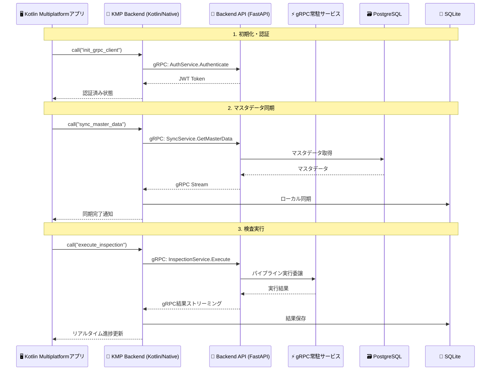

### 9.1.2. gRPCクライアント設計方針

#### 9.1.2.1. **依存関係と技術スタック**

Kotlin Multiplatformアプリケーションでは、以下の技術要素を使用してgRPC通信を実現します：

| 技術要素              | 用途                             | 選定理由                          |
| --------------------- | -------------------------------- | --------------------------------- |
| gRPC Kotlin Stub      | コルーチンベースgRPCクライアント | Kotlin/Nativeでの非同期処理に最適 |
| Protocol Buffers      | データシリアライゼーション       | 型安全性とバイナリ効率            |
| OkHttp                | HTTP/2通信基盤                   | マルチプラットフォーム対応        |
| Kotlinx Coroutines    | 非同期処理                       | プラットフォーム統一API           |
| Kotlinx Serialization | JSON変換                         | 軽量かつ高性能                    |

#### 9.1.2.2. **アーキテクチャパターン**

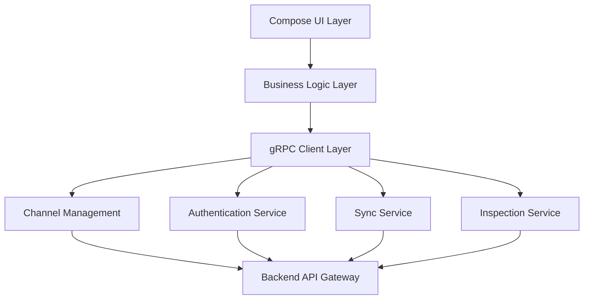

#### 9.1.2.3. **通信フロー設計**

**認証フロー**:
1. アプリ起動時にgRPCチャネル初期化
2. デバイス認証情報でJWTトークン取得
3. 以降の通信でトークンをメタデータとして送信

**データ同期フロー**:
1. マスタデータの差分取得要求
2. ストリーミングによる大容量データ受信
3. ローカルSQLiteへの段階的更新

**検査実行フロー**:
1. 検査パラメータのバリデーション
2. gRPCストリーミングでリアルタイム実行
3. 進捗更新とエラーハンドリング
    
### 9.1.3. UI統合設計（Compose Multiplatform）

#### 9.1.3.1. **状態管理パターン**

Kotlin MultiplatformアプリケーションにおけるgRPC通信の状態管理は、以下のパターンを採用します：

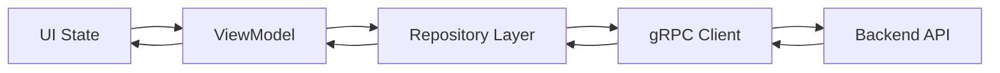

#### 9.1.3.2. **非同期処理設計**

| 処理種別   | パターン              | 状態管理              | エラー処理       |
| ---------- | --------------------- | --------------------- | ---------------- |
| 認証処理   | Single Shot           | Loading/Success/Error | リトライ機能付き |
| データ同期 | Streaming             | Progress/Complete     | 部分成功対応     |
| 検査実行   | Bi-directional Stream | Real-time Progress    | 中断・再開対応   |
| 設定更新   | Request-Response      | Optimistic Update     | ロールバック対応 |

#### 9.1.3.3. **ライフサイクル管理**

**接続管理**:
- アプリ起動時: gRPCチャネル初期化
- フォアグラウンド復帰: 接続状態確認・復旧
- バックグラウンド移行: 接続保持（モバイル）/ 切断（デスクトップ）
- アプリ終了時: グレースフルシャットダウン

**リソース管理**:
- メモリ効率的なストリーミング
- 大容量データの分割受信
- 自動ガベージコレクション対応

# 10. Backend APIでの定義済みパイプラインの実行

## 10.1. パイプライン実行エンジン設計

Backend APIは、事前に定義されたパイプラインを効率的に実行するためのオーケストレーション機能を提供します。

### 10.1.1. パイプライン実行フロー

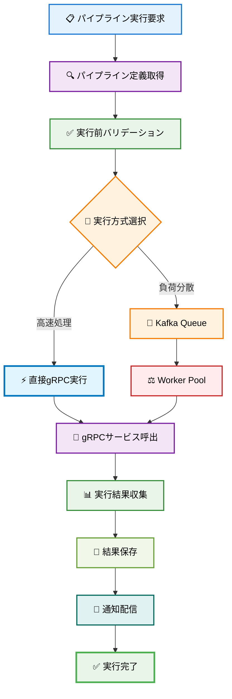

### 10.1.2. パイプライン定義管理

**パイプライン定義スキーマ**:
```json
{
  "pipeline_id": "quality-inspection-v1",
  "name": "品質検査パイプライン",
  "version": "1.0.0",
  "description": "AI による欠陥検出と品質評価",
  "execution_mode": "direct_grpc", 
  "steps": [
    {
      "step_id": "resize",
      "service": "ResizeService",
      "method": "Resize",
      "input_schema": {
        "width": "integer",
        "height": "integer", 
        "maintain_aspect_ratio": "boolean"
      },
      "timeout_ms": 5000,
      "retry_count": 3
    },
    {
      "step_id": "ai_detection",
      "service": "AIDetectionService", 
      "method": "DetectDefects",
      "depends_on": ["resize"],
      "input_schema": {
        "model_name": "string",
        "confidence_threshold": "float"
      },
      "timeout_ms": 30000,
      "retry_count": 2
    },
    {
      "step_id": "quality_filter",
      "service": "FilterService",
      "method": "ApplyQualityFilter", 
      "depends_on": ["ai_detection"],
      "input_schema": {
        "filter_type": "enum",
        "parameters": "object"
      },
      "timeout_ms": 10000,
      "retry_count": 3
    }
  ],
  "error_handling": {
    "strategy": "fail_fast",
    "rollback_enabled": true,
    "notification_on_failure": true
  }
}
```

### 10.1.3. 実行エンジン設計

#### 10.1.3.1. **実行モード選択**

| 実行モード  | 用途             | 特徴                     | 適用条件                   |
| ----------- | ---------------- | ------------------------ | -------------------------- |
| DIRECT_GRPC | リアルタイム処理 | 低レイテンシ（<100ms）   | 小容量データ、即座結果必要 |
| KAFKA_QUEUE | バッチ処理       | 高スループット、耐障害性 | 大容量データ、非同期処理可 |
| HYBRID      | 複合処理         | 最適化された組み合わせ   | 複雑なパイプライン         |

#### 10.1.3.2. **パイプラインステップ設計**

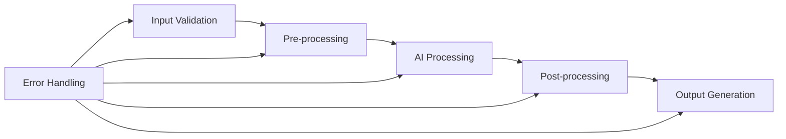

#### 10.1.3.3. **実行制御フロー**

| フェーズ | 処理内容                     | 失敗時対応                   |
| -------- | ---------------------------- | ---------------------------- |
| 初期化   | リソース確保、パラメータ検証 | 即座終了、エラー通知         |
| 前処理   | 画像正規化、フォーマット変換 | リトライ3回、代替処理        |
| AI処理   | 推論実行、結果生成           | キューイング、別インスタンス |
| 後処理   | 結果整形、メタデータ付与     | 部分結果保存                 |
| 出力     | ファイル保存、通知配信       | 再配信機能                   |
   
# 11. 定義済みパイプラインでの常駐gRPCサービスの使用

## 11.1. 常駐gRPCサービス アーキテクチャ

定義済みパイプラインは、高性能処理のために常駐gRPCサービスプールを活用します。

### 11.1.1. サービスプール管理

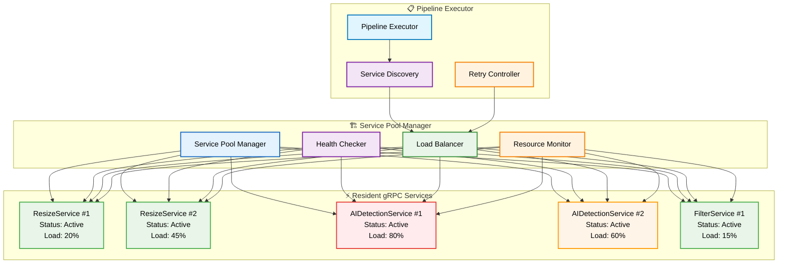

### 11.1.2. サービス発見・負荷分散設計

#### 11.1.2.1. **サービス状態管理**

| ステータス  | 説明           | 新規接続         | ヘルスチェック       |
| ----------- | -------------- | ---------------- | -------------------- |
| ACTIVE      | 正常稼働中     | 受け入れ         | 30秒間隔             |
| BUSY        | 負荷高状態     | 制限付き受け入れ | 15秒間隔             |
| UNAVAILABLE | 応答不可       | 拒否             | 60秒間隔（復旧検出） |
| MAINTENANCE | メンテナンス中 | 拒否             | 停止                 |

#### 11.1.2.2. **負荷分散アルゴリズム**

| アルゴリズム      | 用途             | 選択基準                    |
| ----------------- | ---------------- | --------------------------- |
| Least Connections | リアルタイム処理 | 接続数最小のインスタンス    |
| Round Robin       | バッチ処理       | 順次ローテーション          |
| Response Time     | 高性能要求       | 応答時間最短のインスタンス  |
| CPU Usage         | CPU集約処理      | CPU使用率最低のインスタンス |

#### 11.1.2.3. **サービス発見フロー**

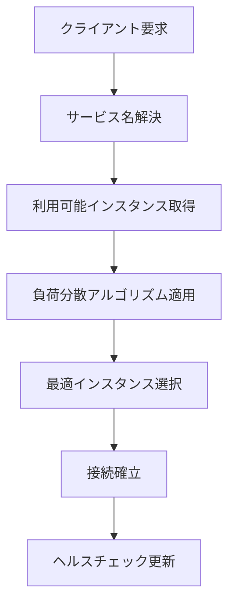
         
### 11.1.3. パフォーマンス監視・最適化設計

#### 11.1.3.1. **メトリクス収集項目**

| カテゴリ     | 監視項目                          | 収集間隔     | 活用目的                   |
| ------------ | --------------------------------- | ------------ | -------------------------- |
| パイプライン | 実行時間、成功率、スループット    | リアルタイム | 性能分析、ボトルネック特定 |
| サービス     | CPU使用率、メモリ使用率、応答時間 | 30秒         | リソース最適化             |
| ネットワーク | レイテンシ、帯域使用率、エラー率  | 10秒         | 通信品質管理               |
| ビジネス     | 処理精度、ユーザー満足度          | 1時間        | システム改善指標           |

#### 11.1.3.2. **最適化戦略**

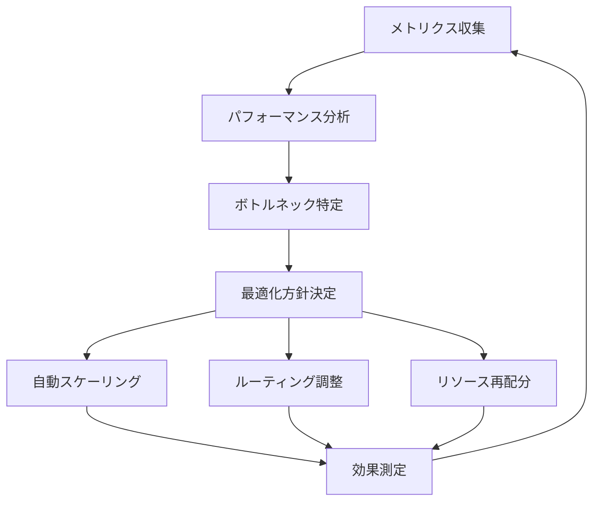

#### 11.1.3.3. **自動最適化ルール**

| 条件               | アクション                 | 効果           |
| ------------------ | -------------------------- | -------------- |
| CPU使用率 > 80%    | インスタンス追加           | 負荷分散       |
| 応答時間 > 500ms   | 高速インスタンスへ切り替え | レスポンス改善 |
| エラー率 > 5%      | 代替サービス利用           | 可用性向上     |
| メモリ使用率 > 90% | ガベージコレクション実行   | メモリ効率化   |
       

---

# 12. 録画API設計（ウェアラブル一人称映像）

## 12.1. 録画制御 REST API

ベースURL: `https://api.imageflowcanvas.com/v1`

エンドポイント一覧:
- `POST /devices/{device_id}/recordings/start`
    - body: `{ "mode": "normal|event", "quality": "high|balanced|low", "labels": ["..."], "execution_id": "optional" }`
    - 202/409/401/403
- `POST /devices/{device_id}/recordings/stop`
    - body: `{ "execution_id": "optional" }`
    - 202/404/409
- `POST /devices/{device_id}/recordings/pause`
- `POST /devices/{device_id}/recordings/resume`
- `GET  /devices/{device_id}/recordings?from={iso}&to={iso}&status={local|synced|server}`
- `GET  /recordings/{recording_id}` メタ+署名URL返却

エラーモデル: RFC7807準拠（type/title/status/detail/instance）。代表コード: `DEVICE_UNAUTHORIZED`, `RECORDING_IN_PROGRESS`, `EXECUTION_NOT_FOUND`。

認可/RBAC:
- デバイスはデバイス証明/JWT必須。操作は device:recordings:* スコープ。
- 管理者/監督者は閲覧系（list/get）に限定可能。

## 12.2. 録画制御 gRPC API（RecordingControlService）

サービス概要:
```
service RecordingControlService {
    rpc Start(StartRequest) returns (StartResponse);
    rpc Stop(StopRequest) returns (StopResponse);
    rpc Pause(PauseRequest) returns (PauseResponse);
    rpc Resume(ResumeRequest) returns (ResumeResponse);
    rpc List(ListRequest) returns (ListResponse);
    rpc Get(GetRequest) returns (GetResponse);
}
```
共通フィールド: device_id, execution_id(optional), labels(map<string,string>)。エラーは gRPC status + details にRFC7807相当ペイロード。

## 12.3. WebRTC/WHEP シグナリングとサーバー録画

- WHEPエンドポイント: `POST /rtc/whep`（SDP Offer受領→Answer返却）
- STUN/TURN設定取得: `GET /api/v1/rtc/config`（ICEサーバ一覧と資格情報を返却）
- サーバー録画: 受信RTPをremuxしてロールリング録画（再エンコード無し）。保存先はMinIOの recordings バケット。
- セッション再開: 断時はクライアント再Offer。Serverは前回execution_idをキーに連続記録を試行。

## 12.4. オブジェクトアップロード（S3互換・プレサインド）

フロー:
1) `POST /api/v1/recordings/uploads/presign` → `url`, `fields`, `part_urls[]` を返却
2) クライアントはマルチパートPUT（ETag収集）
3) `POST /api/v1/recordings/uploads/complete`（part番号とETag列挙）

要件:
- URL有効期限は短命（推奨: 10分）。スコープは当該オブジェクトみに限定。
- 途中中断時はETagにより再開可能。

## 12.5. 録画メタデータ スキーマ

JSON sidecar（拡張可能な契約、`schema_version`で管理）:
```json
{
    "schema_version": "1.0",
    "recording_id": "uuid",
    "device_id": "thinklet-xxxxx",
    "execution_id": "optional-uuid",
    "start_ts": "2025-08-08T01:23:45.678Z",
    "end_ts": "2025-08-08T01:24:45.678Z",
    "duration_ms": 60000,
    "fps": 30,
    "resolution": "1920x1080",
    "video_codec": "h264",
    "audio_codec": "aac",
    "bitrate_kbps": 6000,
    "location": { "lat": 35.0, "lon": 139.0 },
    "pose": { "roll": 0.0, "pitch": 0.0, "yaw": 0.0 },
    "battery_pct": 72,
    "temperature_c": 44.2,
    "storage_url": "s3://recordings/.../segment_...mp4",
    "checksum": "etag-or-md5",
    "labels": ["lineA", "process1"],
    "tags": { "shift": "day" },
    "notes": "optional"
}
```

検索用インデックス: device_id, execution_id, start_ts, labels, tags。

## 12.6. イベント/通知（Kafka Topics）

Topicsと例:
- `recording.started`
```json
{ "recording_id": "...", "device_id": "...", "execution_id": "...", "ts": "..." }
```
- `recording.stopped`
```json
{ "recording_id": "...", "device_id": "...", "duration_ms": 60000, "ts": "..." }
```
- `recording.segment.stored`
```json
{ "recording_id": "...", "device_id": "...", "object_key": "...", "etag": "...", "ts": "..." }
```
- `recording.synced`
```json
{ "recording_id": "...", "device_id": "...", "parts": 8, "bytes": 73400320, "ts": "..." }
```
- `recording.error`
```json
{ "recording_id": "...", "device_id": "...", "code": "STORAGE_LOW|OVERHEAT|NETWORK", "message": "...", "ts": "..." }
```

## 12.7. セキュリティ/ライフサイクル
- 認証: デバイスは相互TLSまたはJWT。ユーザーはOAuth2/JWT。
- 認可: RBACでrecordingsスコープ制御。
- 保存: 365日。ライフサイクル違反検知メトリクスをエクスポート。
- 暗号化: SSE-S3（既定）/ SSE-C（機密）。転送はTLS 1.2+。

---

# 13. 録画映像管理API

## 13.1. 映像検索API

### 13.1.1. VideoAnalysisService - 映像検索

**gRPC Service Definition**:
```protobuf
service VideoAnalysisService {
  // 録画映像検索
  rpc SearchVideos(VideoSearchRequest) returns (VideoSearchResponse);
  rpc GetSearchSuggestions(SuggestionRequest) returns (SuggestionResponse);
  rpc SaveSearchQuery(SaveSearchRequest) returns (SaveSearchResponse);
  rpc GetSearchHistory(SearchHistoryRequest) returns (SearchHistoryResponse);
  
  // 映像再生・メタデータ
  rpc GetVideoMetadata(VideoMetadataRequest) returns (VideoMetadataResponse);
  rpc GetVideoStream(VideoStreamRequest) returns (stream VideoChunk);
  rpc GetVideoBookmarks(BookmarkRequest) returns (BookmarkResponse);
  rpc CreateBookmark(CreateBookmarkRequest) returns (CreateBookmarkResponse);
  
  // 分析・レポート
  rpc GenerateAnalyticsReport(AnalyticsRequest) returns (AnalyticsResponse);
  rpc GetDashboardData(DashboardRequest) returns (DashboardResponse);
  rpc ScheduleReport(ScheduleReportRequest) returns (ScheduleReportResponse);
}

message VideoSearchRequest {
  // 製品情報検索
  optional string work_order_id = 1;      // 指図番号
  optional string instruction_id = 2;     // 指示番号
  optional string product_code = 3;       // 型式コード
  optional string machine_number = 4;     // 機番
  optional int32 month_sequence = 5;      // 月連番
  
  // 時間範囲検索
  optional int64 start_timestamp = 10;    // 開始時刻（Unix timestamp）
  optional int64 end_timestamp = 11;      // 終了時刻（Unix timestamp）
  
  // 属性検索
  repeated string recorded_by = 20;       // 録画者ID一覧
  repeated string inspection_result = 21; // 検査結果（OK/NG/PENDING）
  repeated string defect_types = 22;      // 不良種別
  repeated string locations = 23;         // 撮影場所
  repeated string process_steps = 24;     // 工程
  
  // テキスト検索
  optional string keywords = 30;          // キーワード検索
  repeated string tags = 31;              // タグ検索
  optional string fulltext_query = 32;    // 全文検索クエリ
  
  // ページング・ソート
  optional int32 page = 40;               // ページ番号（1から開始）
  optional int32 page_size = 41;          // ページサイズ（デフォルト20）
  optional string sort_by = 42;           // ソート項目
  optional bool sort_desc = 43;           // 降順フラグ
  
  // オプション
  optional bool include_archived = 50;    // アーカイブ済み映像を含める
  optional bool favorites_only = 51;      // お気に入り検索のみ
}

message VideoSearchResponse {
  repeated VideoSummary videos = 1;       // 検索結果
  int32 total_count = 2;                  // 総件数
  int32 current_page = 3;                 // 現在ページ
  int32 total_pages = 4;                  // 総ページ数
  int32 execution_time_ms = 5;            // 検索実行時間
  SearchStats stats = 6;                  // 検索統計
}

message VideoSummary {
  string video_id = 1;                    // 映像ID
  string file_id = 2;                     // ファイルID
  ProductInfo product_info = 3;           // 製品情報
  RecordingInfo recording_info = 4;       // 録画情報
  InspectionInfo inspection_info = 5;     // 検査情報
  string thumbnail_url = 6;               // サムネイルURL
  int64 created_at = 7;                   // 作成日時
}
```

### 13.1.2. REST API（WebUI用）

**エンドポイント**:
```
GET /api/v1/videos/search
```

**リクエストパラメータ**:
```json
{
  "product_info": {
    "work_order_id": "WO123456",
    "product_code": "TYPE-ABC-001"
  },
  "time_range": {
    "start": "2025-08-01T00:00:00Z",
    "end": "2025-08-31T23:59:59Z"
  },
  "filters": {
    "recorded_by": ["user-789"],
    "inspection_result": ["NG"],
    "locations": ["LINE-A", "LINE-B"]
  },
  "search_text": {
    "keywords": "外観不良",
    "tags": ["重要", "要確認"]
  },
  "pagination": {
    "page": 1,
    "page_size": 20,
    "sort_by": "recorded_date",
    "sort_desc": true
  }
}
```

**レスポンス**:
```json
{
  "videos": [
    {
      "video_id": "video-001",
      "file_id": "file-001",
      "product_info": {
        "work_order_id": "WO123456",
        "instruction_id": "INS789",
        "product_code": "TYPE-ABC-001",
        "machine_number": "MC001",
        "month_sequence": 15
      },
      "recording_info": {
        "recorded_by": "user-789",
        "recorded_date": "2025-08-08T10:00:00Z",
        "duration_seconds": 324,
        "file_size_bytes": 52428800,
        "resolution": "1920x1080",
        "frame_rate": 30
      },
      "inspection_info": {
        "result": "NG",
        "defect_types": ["外観不良", "寸法不良"],
        "confidence_scores": [0.92, 0.87]
      },
      "thumbnail_url": "/api/v1/videos/video-001/thumbnail",
      "created_at": "2025-08-08T10:00:00Z"
    }
  ],
  "pagination": {
    "total_count": 245,
    "current_page": 1,
    "total_pages": 13,
    "execution_time_ms": 156
  },
  "stats": {
    "ok_count": 189,
    "ng_count": 56,
    "average_duration": 298
  }
}
```

## 13.2. 映像再生API

### 13.2.1. 映像ストリーミング

**gRPC Streaming**:
```protobuf
message VideoStreamRequest {
  string video_id = 1;                    // 映像ID
  optional int32 start_seconds = 2;       // 開始秒数
  optional int32 end_seconds = 3;         // 終了秒数
  optional string quality = 4;            // 品質（4K/1080p/720p/480p）
  optional bool include_ai_overlay = 5;   // AI解析結果重畳
}

message VideoChunk {
  bytes data = 1;                         // 映像データチャンク
  int32 sequence = 2;                     // シーケンス番号
  int32 timestamp_ms = 3;                 // タイムスタンプ（ミリ秒）
  AIOverlay ai_overlay = 4;               // AI解析結果（オプション）
}

message AIOverlay {
  repeated DetectionResult detections = 1; // 検出結果一覧
  float confidence_score = 2;             // 信頼度
  string detection_type = 3;              // 検出種別
}
```

**REST API（HTTP Adaptive Streaming）**:
```
GET /api/v1/videos/{video_id}/stream
GET /api/v1/videos/{video_id}/stream.m3u8        # HLS
GET /api/v1/videos/{video_id}/stream.mpd         # DASH
GET /api/v1/videos/{video_id}/thumbnail          # サムネイル
GET /api/v1/videos/{video_id}/metadata           # メタデータ
```

### 13.2.2. ブックマーク管理

**エンドポイント**:
```
GET    /api/v1/videos/{video_id}/bookmarks       # ブックマーク一覧
POST   /api/v1/videos/{video_id}/bookmarks       # ブックマーク作成
PUT    /api/v1/videos/{video_id}/bookmarks/{id}  # ブックマーク更新
DELETE /api/v1/videos/{video_id}/bookmarks/{id}  # ブックマーク削除
```

**ブックマーク作成リクエスト**:
```json
{
  "timestamp_seconds": 124,
  "title": "外観不良検出箇所",
  "description": "左上部品に傷あり",
  "bookmark_type": "DEFECT"
}
```

## 13.3. 分析・レポートAPI

### 13.3.1. ダッシュボードデータ

**エンドポイント**:
```
GET /api/v1/analytics/dashboard
```

**レスポンス**:
```json
{
  "summary": {
    "total_recordings": 1240,
    "total_duration_hours": 186.5,
    "total_size_gb": 8.2,
    "defect_rate": 12.3,
    "period": "2025-08"
  },
  "recording_stats": {
    "daily_counts": [
      { "date": "2025-08-01", "count": 42, "duration_hours": 6.2 },
      { "date": "2025-08-02", "count": 38, "duration_hours": 5.8 }
    ],
    "user_distribution": [
      { "user_id": "user-789", "count": 156, "percentage": 12.6 },
      { "user_id": "user-456", "count": 134, "percentage": 10.8 }
    ]
  },
  "quality_stats": {
    "defect_trend": [
      { "date": "2025-08-01", "defect_rate": 11.2 },
      { "date": "2025-08-02", "defect_rate": 13.1 }
    ],
    "defect_types": [
      { "type": "外観不良", "count": 89, "percentage": 38.5 },
      { "type": "寸法不良", "count": 67, "percentage": 29.0 }
    ]
  },
  "efficiency_stats": {
    "average_work_time": 298,
    "procedure_compliance": 94.2,
    "improvement_opportunities": [
      {
        "area": "LINE-A照明",
        "impact": "不良率-3%",
        "priority": "HIGH"
      }
    ]
  }
}
```

### 13.3.2. レポート生成

**エンドポイント**:
```
POST /api/v1/analytics/reports/generate
GET  /api/v1/analytics/reports
GET  /api/v1/analytics/reports/{report_id}
```

**レポート生成リクエスト**:
```json
{
  "report_type": "MONTHLY",
  "instruction_date": "2025-08-31",
  "filters": {
    "locations": ["LINE-A", "LINE-B"],
    "product_codes": ["TYPE-ABC-001"]
  },
  "format": "PDF",
  "schedule": {
    "enabled": true,
    "frequency": "MONTHLY",
    "recipients": ["manager@company.com"]
  }
}
```

**レポート生成レスポンス**:
```json
{
  "report_id": "report-001",
  "status": "GENERATING",
  "estimated_completion": "2025-08-08T12:05:00Z",
  "download_url": null
}
```

## 13.4. WebSocket通知（リアルタイム更新）

### 13.4.1. 映像分析イベント

**接続**:
```
ws://api.example.com/ws/video-analysis
```

**認証**:
```json
{
  "type": "auth",
  "token": "jwt_token_here"
}
```

**購読**:
```json
{
  "type": "subscribe",
  "topics": ["search_results", "analysis_progress", "report_status"]
}
```

**通知例**:
```json
{
  "type": "search_completed",
  "search_id": "search-123",
  "result_count": 245,
  "execution_time_ms": 156,
  "timestamp": "2025-08-08T11:30:00Z"
}

{
  "type": "report_generated",
  "report_id": "report-001",
  "status": "COMPLETED",
  "download_url": "/api/v1/analytics/reports/report-001/download",
  "timestamp": "2025-08-08T12:05:00Z"
}

{
  "type": "analysis_alert",
  "alert_type": "DEFECT_RATE_HIGH",
  "location": "LINE-A",
  "current_rate": 18.5,
  "threshold": 15.0,
  "timestamp": "2025-08-08T14:30:00Z"
}
```

## 13.5. 性能要件・制約

### 13.5.1. 応答時間目標
- 映像検索: <500ms（通常条件）、<2秒（複雑条件）
- 映像再生開始: <3秒（初回）、<1秒（キャッシュ済み）
- ダッシュボード読み込み: <1秒
- レポート生成: <30秒（標準）、<5分（大規模）

### 13.5.2. 同時処理能力
- 映像検索: 500リクエスト/秒
- 映像再生: 100同時ストリーム（1080p）
- WebSocket接続: 1,000同時接続

### 13.5.3. データ制約
- 検索結果: 最大10,000件（ページング必須）
- レポートサイズ: 最大100MB
- 映像ファイル: 最大2GB/ファイル
---

# 14. 検査マスタ ←→ 製品連携

## 14.1. 製品に紐づく検査項目取得 API

- エンドポイント: `GET /v1/inspection/products/{product_id}/items`
- 概要: Webで設定した検査項目を、指定の製品に対応づけて取得する。
- 目的: KMPのハンディ/デスクトップアプリが、選択した製品に対して実行すべき検査項目と順序をサーバーから取得し、そのまま検査フローに反映できるようにする。
- パスパラメータ:
  - `product_id`: 製品ID（UUID または `work_order_instruction_machine_seq` 生成ID）
- クエリ:
  - `page` (default: 1)
  - `page_size` (default: 50, max: 200)
- 応答: ページネーションレスポンス
```
{
  "items": [
    {
      "id": "...",
      "instruction_id": "...",
      "name": "外観検査1",
      "description": "...",
      "type": "VISUAL_INSPECTION",
      "pipeline_id": "...",
      "pipeline_params": {"threshold": "0.5"},
      "execution_order": 1,
      "is_required": true,
      "criteria_id": "..."
    }
  ],
  "total_count": 3,
  "page": 1,
  "page_size": 50,
  "total_pages": 1
}
```
- マッピング仕様（重要）:
  - `ProductMaster.product_code` と `inspectionInstruction.product_code` を一致キーとして紐づける。
  - 一致しない場合、フォールバックとして `ProductMaster.work_order_id` と `inspectionInstruction.product_code` の一致も試行する。
  - 対応する `inspectionInstruction` が無い場合は `items=[]` を返す（404ではなく空配列）。

このAPIにより、Web UIで設定した「検査項目（並び順/必須/パイプライン）」がそのまま端末アプリに配信される。

## 14.2. 型式グループ管理 API

運用上、型式コード単位の項目管理は煩雑なため、型式コードを「型式グループ」に紐付け、グループ単位で検査項目を設定できるようにする。

- グループCRUD
  - POST `/v1/inspection/type-groups` — 作成
  - GET `/v1/inspection/type-groups` — 一覧（ページング）
  - PUT `/v1/inspection/type-groups/{group_id}` — 更新
  - DELETE `/v1/inspection/type-groups/{group_id}` — 削除
- メンバー管理（型式コードの追加/削除）
  - POST `/v1/inspection/type-groups/{group_id}/members` — 追加（body: { product_code })
  - GET `/v1/inspection/type-groups/{group_id}/members` — 一覧
  - DELETE `/v1/inspection/type-groups/{group_id}/members/{product_code}` — 削除

グループと検査ターゲット（inspectionInstruction）の関係:
- `inspectionInstruction.group_id` により、グループ単位で検査項目（InspectionItem）を定義できる。
- 端末アプリから製品に対する検査項目取得時は、以下の順でマッピングする。
  1) `product_code` が所属するグループを探索（基準は ProductMaster.`product_code`）→ `inspectionInstruction.group_id` が一致するターゲットを優先
  2) フォールバック: `inspectionInstruction.product_code` ≡ 製品`product_code`（＝ProductMaster.`product_code`）
  3) さらにフォールバック: `inspectionInstruction.product_code` ≡ `product.work_order_id`

### 14.2.1. リクエスト/レスポンス例

1) グループ作成（POST /v1/inspection/type-groups）
```
Request
{
  "name": "GROUP-A",
  "description": "モデルA派生群の検査設定"
}

Response
{
  "id": "5f4c...",
  "name": "GROUP-A",
  "description": "モデルA派生群の検査設定",
  "created_at": 1723756800000,
  "updated_at": 1723756800000,
  "created_by": "..."
}
```

2) メンバー追加（POST /v1/inspection/type-groups/{group_id}/members）
```
Request
{ "product_code": "MODEL-A1" }

Response
{
  "id": "9a71...",
  "group_id": "5f4c...",
  "product_code": "MODEL-A1",
  "created_at": 1723756800000
}
```

3) グループ一覧（GET /v1/inspection/type-groups?page=1&page_size=50）
```
{
  "items": [ { "id": "5f4c...", "name": "GROUP-A", "description": "...", "created_at": 1723756800000, "updated_at": 1723756800000 } ],
  "total_count": 1,
  "page": 1,
  "page_size": 50,
  "total_pages": 1
}
```

4) グループと検査指示の設定例（inspectionInstruction）
```
{
  "name": "グループA向け検査指示",
  "group_id": "5f4c...",
  "group_name": "GROUP-A",
  "version": "1.0",
  "metadata": {}
}
```

この設定により、GROUP-Aに属する任意の `product_code`（例: MODEL-A, MODEL-A1, MODEL-A2）が選択された場合、当該ターゲットに紐づけられた検査項目が端末アプリに配信される。

## 14.3. 検査マスタ API（型式グループ + 工程）

### 14.3.1. 追加 API
- 工程マスタ
  - `POST /v1/inspection/processes` … 追加
  - `GET /v1/inspection/processes` … 一覧（検索: process_code, process_name）
  - `GET /v1/inspection/processes/{process_code}` … 取得
  - `PUT /v1/inspection/processes/{process_code}` … 更新
  - `DELETE /v1/inspection/processes/{process_code}` … 削除

### 14.3.2. 変更 API（検査マスタ）
- 旧: `POST /v1/inspection/instructions`（body に `product_code` or `group_id`）
- 新: `POST /v1/inspection/instructions`（body に必須 `group_id`, `process_code`）
  - 例:
  ```json
  {
    "name": "外観検査 v1",
    "group_id": "<uuid-of-group>",
    "process_code": "PRC-10",
    "version": "1.0",
    "metadata": {}
  }
  ```

- 取得/一覧
  - `GET /v1/inspection/instructions?group_id=...&process_code=...&page=...`
  - レスポンスは `group_id`, `process_code` を含む

### 14.3.3. マッピング API
- 製品＋工程から検査項目を取得
  - 旧: `GET /v1/inspection/products/{product_id}/items`
  - 新: `GET /v1/inspection/products/{product_id}/processes/{process_code}/items`
  - 処理: product_id → product_code → group_id 解決 → (group_id, process_code) でターゲット特定 → items 返却

### 14.3.4. 型式グループ API 拡張
- `product_code_groups`
  - 追加フィールド: `group_code`（検索/参照に使用）
  - `GET /v1/inspection/type-groups?group_code=...` で検索可能に

### 14.3.5. 後方互換
- 当面 `product_code` 直紐付けを受け付けるが、作成/更新での使用は非推奨（レスポンスにも `group_id`/`process_code` を優先表示）
