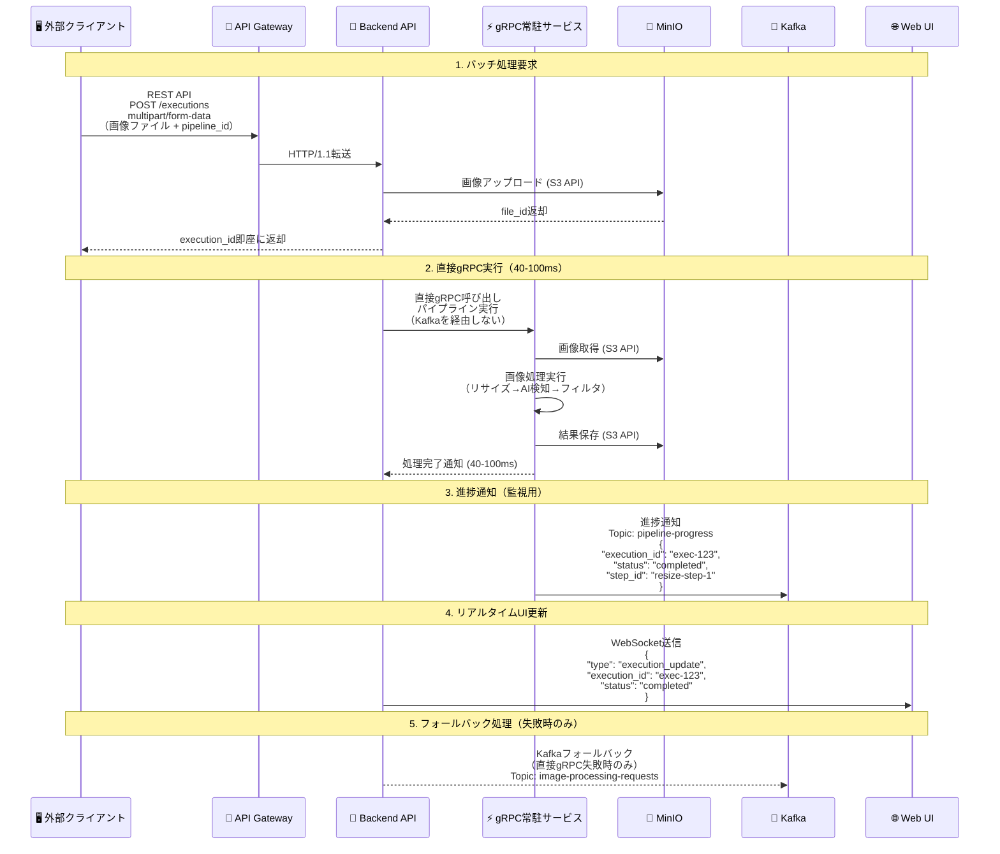
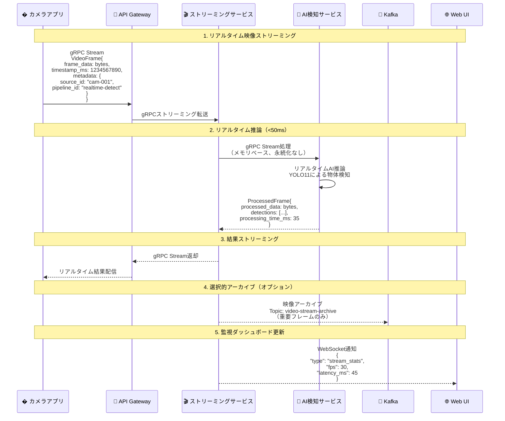

# ImageFlowCanvas API設計書

# 文書管理情報

| 項目       | 内容                      |
| ---------- | ------------------------- |
| 文書名     | ImageFlowCanvas API設計書 |
| バージョン | 1.0                       |
| 作成日     | 2025年7月12日             |
| 更新日     | 2025年7月12日             |


---

# 1. プロトコル設計

## 1.1. バッチ処理（パイプライン実行）データフロー


    
## 1.2. リアルタイム処理（映像ストリーミング）データフロー



## 1.3. プロトコル最適化の選択基準

| 🎯 用途・シナリオ     | 🚀 推奨プロトコル    | ⚡ 性能特性                                                           | 📝 選択理由                               |
| :------------------- | :------------------ | :------------------------------------------------------------------- | :--------------------------------------- |
| バッチ画像処理       | REST API + 直接gRPC | • 超高速処理 (40-100ms)<br/>• ファイル永続化<br/>• 高信頼性          | パイプライン実行、結果保存が必要な用途   |
| リアルタイム映像処理 | gRPC Streaming      | • 極低レイテンシ (<50ms)<br/>• ストリーミング対応<br/>• メモリベース | ライブ配信、監視カメラ、検査システム用途 |
| 進捗通知・監視       | Kafka + WebSocket   | • 非同期通知<br/>• 高スループット<br/>• リアルタイム性               | システム監視、ダッシュボード更新         |
| フォールバック処理   | Kafka Consumer      | • 高信頼性<br/>• 順序保証<br/>• 耐障害性                             | 直接gRPC失敗時の代替処理                 |
| UI更新通知           | WebSocket           | • 双方向通信<br/>• リアルタイム性<br/>• 低オーバーヘッド             | 進捗表示、監視ダッシュボード             |
| データ永続化         | S3 API              | • RESTful<br/>• 標準互換<br/>• 高可用性                              | MinIOとの連携、オブジェクトストレージ    |
| サービス間内部通信   | 直接gRPC            | • 型安全<br/>• 超高性能<br/>• Protocol Buffers                       | マイクロサービス内部の高速通信           |

## 1.4. 処理方式別プロトコル仕様

### 1.4.1. 📋 バッチ処理（パイプライン実行）仕様

REST API multipart/form-dataでの画像アップロードと、直接gRPC実行による40-100ms高速処理を提供。
実行完了後、WebSocketで進捗通知を送信します。

### 1.4.2. 🎬 リアルタイム処理（映像ストリーミング）仕様

gRPCストリーミングによるリアルタイム映像処理。50ms以下のレイテンシで
AI検出結果を含む処理済みフレームを返却します。

### 1.4.3. 📨 監視・通知プロトコル仕様

Kafkaによる進捗通知とWebSocketによるリアルタイム更新で、
実行状況の監視とダッシュボード表示を行います。

# 2. API アーキテクチャ

## 2.1. ハイブリッドAPIアーキテクチャ

### 2.1.1. Backend API設計思想

ImageFlowCanvasのBackend APIは、**FastAPI + grpcio**によるハイブリッド実装を採用し、複数のプロトコルを統合管理する「司令塔」として機能します。

```python
# ハイブリッドサーバー構成例
from fastapi import FastAPI
import grpc
from concurrent import futures
import asyncio

class HybridBackendAPI:
    def __init__(self):
        # FastAPI: REST + WebSocket
        self.fastapi_app = FastAPI()
        
        # gRPC Server: 高性能処理
        self.grpc_server = grpc.server(futures.ThreadPoolExecutor())
        
        # 内部サービス接続管理
        self.grpc_clients = GRPCClientManager()
```

### 2.1.2. プロトコル統合戦略

| プロトコル | 担当領域 | 実装技術 | 特徴 |
|------------|----------|----------|------|
| **FastAPI** | REST API + WebSocket | uvicorn + asyncio | 自動ドキュメント生成、非同期処理 |
| **grpcio** | gRPCサーバー | grpcio + asyncio | 高性能、型安全性、Protocol Buffers |
| **WebSocket** | リアルタイム通知 | FastAPI WebSocket | 双方向通信、疎結合アーキテクチャ |
| **Kafka Consumer** | 進捗配信 | aiokafka | 非同期メッセージング、スケーラブル |

## 2.2. RESTful API設計

### 2.2.1. 基本仕様
- ベースURL: `https://api.imageflowcanvas.com/v1`
- プロトコル：HTTPS必須
- 認証：Bearer Token (JWT)
- コンテンツタイプ：`application/json`
- エラーフォーマット：RFC 7807準拠

### 2.2.2. 実装済みエンドポイント一覧

| カテゴリ       | エンドポイント            | メソッド | 用途                 | 実装状況 |
| -------------- | ------------------------- | -------- | -------------------- | -------- |
| 認証           | `/auth/login`             | POST     | ログイン             | ✅ |
| 認証           | `/auth/logout`            | POST     | ログアウト           | ✅ |
| ヘルスチェック | `/health`                 | GET      | システム状態確認     | ✅ |
| パイプライン   | `/pipelines`              | GET      | パイプライン一覧     | ✅ |
| パイプライン   | `/pipelines`              | POST     | パイプライン作成     | ✅ |
| パイプライン   | `/pipelines/{id}`         | GET      | パイプライン詳細     | ✅ |
| パイプライン   | `/pipelines/{id}`         | PUT      | パイプライン更新     | ✅ |
| パイプライン   | `/pipelines/{id}`         | DELETE   | パイプライン削除     | ✅ |
| 実行           | `/executions`             | POST     | パイプライン実行     | ✅ |
| 実行           | `/executions/{id}`        | GET      | 実行状況取得         | ✅ |
| 実行           | `/executions/{id}/cancel` | POST     | 実行キャンセル       | ✅ |
| コンポーネント | `/components`             | GET      | コンポーネント一覧   | ✅ |
| コンポーネント | `/components/{id}`        | GET      | コンポーネント詳細   | ✅ |
| ファイル       | `/files`                  | POST     | ファイルアップロード | ✅ |
| ファイル       | `/files/{id}`             | GET      | ファイルダウンロード | ✅ |
| gRPCサービス   | `/grpc-services`          | GET      | gRPCサービス状況     | ✅ |
| カメラストリーム | `/camera-stream`         | WebSocket | リアルタイム映像     | ✅ |

### 2.2.3. WebSocket専用エンドポイント
- `/ws/execution/{execution_id}`: 実行進捗通知
- `/ws/system-status`: システム状況リアルタイム更新
- `/ws/camera-stream`: カメラストリーミング

# 3. API詳細仕様

## 3.1. パイプライン実行API（直接gRPC実行）

エンドポイント: `POST /v1/executions`

機能: 画像ファイルをアップロードしてパイプライン処理を実行

リクエスト形式: multipart/form-data
- pipeline_id (必須): 実行するパイプラインのUUID
- input_files (必須): 入力画像ファイル（複数対応）
- parameters (オプション): 実行時パラメータ（JSON形式）
- priority (オプション): 優先度（low/normal/high）

レスポンス:
- 202: 実行要求受付（40-100ms後に完了予定）
- 400: 無効なリクエスト
- 500: 直接gRPC実行失敗（Kafkaフォールバック）

## 3.2. 実行状況取得API（超高速完了対応）

エンドポイント: `GET /v1/executions/{execution_id}`

機能: パイプライン実行の状況を取得

レスポンス情報:
- execution_id: 実行ID
- status: 実行状況（pending/running/completed/failed/cancelled）
- execution_mode: 実行方式（direct_grpc/kafka_fallback）
- processing_time_ms: 実際の処理時間
- progress: 進捗情報
- steps: 各ステップの詳細状況
- output_files: 出力ファイル情報

# 4. gRPC API設計

## 4.1. 実装済みgRPCサービス

### 4.1.1. サービス構成

ImageFlowCanvasでは、以下のgRPCサービスが実装・稼働しています：

| サービス名 | エンドポイント | 機能 | Protocol Buffers |
|------------|----------------|------|------------------|
| **ResizeService** | `resize-grpc-app:50051` | 画像リサイズ処理 | `resize.proto` |
| **AIDetectionService** | `ai-detection-grpc-app:50052` | AI物体検出・分類 | `ai_detection.proto` |
| **FilterService** | `filter-grpc-app:50053` | 画像フィルタ処理 | `filter.proto` |
| **CameraStreamService** | `camera-stream-grpc-app:50054` | リアルタイム映像処理 | `camera_stream.proto` |

### 4.1.2. 共通プロトコル定義（common.proto）

```protobuf
syntax = "proto3";
package imageflow.v1;

// 共通画像データ構造
message ImageData {
  string bucket = 1;
  string object_key = 2;
  string content_type = 3;
  int64 size_bytes = 4;
  int32 width = 5;
  int32 height = 6;
  google.protobuf.Timestamp created_at = 7;
}

// 直接画像バイト（リアルタイム処理用）
message ImageBytes {
  bytes data = 1;
  string format = 2;  // "JPEG", "PNG"
  int32 width = 3;
  int32 height = 4;
}

// 処理ステータス
enum ProcessingStatus {
  PROCESSING_STATUS_UNSPECIFIED = 0;
  PROCESSING_STATUS_PENDING = 1;
  PROCESSING_STATUS_RUNNING = 2;
  PROCESSING_STATUS_COMPLETED = 3;
  PROCESSING_STATUS_FAILED = 4;
}

// 処理結果共通構造
message ProcessingResult {
  ProcessingStatus status = 1;
  string message = 2;
  ImageData output_image = 3;
  bytes output_data = 7;  // リアルタイム処理用
  map<string, string> metadata = 4;
  google.protobuf.Timestamp processed_at = 5;
  double processing_time_seconds = 6;
}
```

## 4.2. 個別サービス仕様

### 4.2.1. ResizeService (resize.proto)

**機能**: 画像リサイズ・形式変換
**処理時間**: 10-20ms
**エンドポイント**: resize-grpc-app:50051

```protobuf
service ResizeService {
  rpc Resize(ResizeRequest) returns (ResizeResponse);
  rpc HealthCheck(HealthCheckRequest) returns (HealthCheckResponse);
}

message ResizeRequest {
  ImageData input_image = 1;
  int32 target_width = 2;
  int32 target_height = 3;
  string resize_mode = 4;  // "fit", "fill", "stretch"
  bool maintain_aspect_ratio = 5;
}

message ResizeResponse {
  ProcessingResult result = 1;
}
```

### 4.2.2. AIDetectionService (ai_detection.proto)

**機能**: AI物体検出・分類
**処理時間**: 20-50ms (GPU使用時)
**エンドポイント**: ai-detection-grpc-app:50052

```protobuf
service AIDetectionService {
  rpc Detect(DetectionRequest) returns (DetectionResponse);
  rpc HealthCheck(HealthCheckRequest) returns (HealthCheckResponse);
}

message DetectionRequest {
  ImageData input_image = 1;
  string model_name = 2;      // "yolo11", "resnet50"
  float confidence_threshold = 3;
  repeated string target_classes = 4;
}

message DetectionResponse {
  ProcessingResult result = 1;
  repeated Detection detections = 2;
}

message Detection {
  string class_name = 1;
  float confidence = 2;
  BoundingBox bbox = 3;
}

message BoundingBox {
  float x = 1;
  float y = 2;
  float width = 3;
  float height = 4;
}
```

### 4.2.3. FilterService (filter.proto)

**機能**: 画像フィルタ・前後処理
**処理時間**: 5-15ms
**エンドポイント**: filter-grpc-app:50053

```protobuf
service FilterService {
  rpc ApplyFilter(FilterRequest) returns (FilterResponse);
  rpc HealthCheck(HealthCheckRequest) returns (HealthCheckResponse);
}

message FilterRequest {
  ImageData input_image = 1;
  string filter_type = 2;    // "blur", "sharpen", "edge"
  map<string, string> parameters = 3;
}

message FilterResponse {
  ProcessingResult result = 1;
}
```

### 4.2.4. CameraStreamService (camera_stream.proto)

**機能**: リアルタイム映像ストリーミング処理
**レイテンシ**: <50ms
**エンドポイント**: camera-stream-grpc-app:50054

```protobuf
service CameraStreamService {
  rpc ProcessVideoStream(stream VideoFrame) returns (stream ProcessedFrame);
  rpc HealthCheck(HealthCheckRequest) returns (HealthCheckResponse);
}

message VideoFrame {
  bytes frame_data = 1;
  int64 timestamp_ms = 2;
  map<string, string> metadata = 3;
}

message ProcessedFrame {
  bytes processed_data = 1;
  repeated Detection detections = 2;
  int64 processing_time_ms = 3;
  map<string, string> processing_stats = 4;
}
```

## 4.3. サービス接続管理

### 4.3.1. 接続設定
```python
# gRPCクライアント設定例
GRPC_SERVICES = {
    "resize": {
        "address": "resize-grpc-app:50051",
        "timeout": 30,
        "retry_count": 3
    },
    "ai_detection": {
        "address": "ai-detection-grpc-app:50052", 
        "timeout": 60,
        "retry_count": 2
    },
    "filter": {
        "address": "filter-grpc-app:50053",
        "timeout": 20, 
        "retry_count": 3
    },
    "camera_stream": {
        "address": "camera-stream-grpc-app:50054",
        "timeout": 10,
        "retry_count": 1
    }
}
```

### 4.3.2. ヘルスチェック・冗長性
- **ヘルスチェック間隔**: 10秒
- **サーキットブレーカー**: 失敗閾値5回、復旧タイムアウト30秒
- **Kafkaフォールバック**: 直接gRPC失敗時の代替処理
- **ロードバランシング**: サービス別の負荷分散

# 5. WebSocket API設計

## 5.1. リアルタイム進捗通知

```javascript
// WebSocket接続エンドポイント
ws://localhost:8080/ws/execution/{execution_id}

// 進捗通知メッセージ形式
{
  "type": "progress",
  "execution_id": "exec-uuid-123",
  "step": "ai_detection",
  "progress": 65.5,
  "status": "processing",
  "timestamp": "2025-07-21T10:30:01.085Z",
  "data": {
    "current_component": "AI Detection Service",
    "elapsed_time_ms": 1750,
    "estimated_remaining_ms": 850
  }
}

// 完了通知
{
  "type": "completed",
  "execution_id": "exec-uuid-123",
  "total_time_ms": 87,
  "output_files": [
    {
      "file_id": "output-123",
      "filename": "result.jpg",
      "download_url": "/api/v1/files/output-123/download"
    }
  ]
}

// エラー通知
{
  "type": "error",
  "execution_id": "exec-uuid-123",
  "error": {
    "code": "AI_SERVICE_UNAVAILABLE",
    "message": "AI Detection Service temporarily unavailable",
    "retry_after": 30
  }
}
```

# 6. 検査機能API設計

## 6.1. Tauri検査アプリAPI

### 6.1.1. 検査マスタ管理API

**検査対象マスタ**
```http
GET /api/v1/inspection/targets
POST /api/v1/inspection/targets
GET /api/v1/inspection/targets/{target_id}
PUT /api/v1/inspection/targets/{target_id}
DELETE /api/v1/inspection/targets/{target_id}
```

**検査項目マスタ**
```http
GET /api/v1/inspection/targets/{target_id}/items
POST /api/v1/inspection/targets/{target_id}/items
GET /api/v1/inspection/items/{item_id}
PUT /api/v1/inspection/items/{item_id}
DELETE /api/v1/inspection/items/{item_id}
```

### 6.1.2. 検査実行API

**検査セッション管理**
```http
POST /api/v1/inspection/sessions
GET /api/v1/inspection/sessions/{session_id}
PUT /api/v1/inspection/sessions/{session_id}
POST /api/v1/inspection/sessions/{session_id}/complete
```

**AI検査実行（パイプライン連携）**
```http
POST /api/v1/inspection/sessions/{session_id}/ai-inspection
```

リクエスト例:
```json
{
  "session_id": "session-12345",
  "item_id": "item-67890",
  "image_file_path": "/path/to/captured/image.jpg",
  "pipeline_id": "pipeline-ai-detect-v1.2",
  "parameters": {
    "confidence_threshold": 0.8,
    "model_name": "yolo11"
  }
}
```

レスポンス例:
```json
{
  "ai_result": {
    "overall_result": "NG",
    "confidence": 0.92,
    "detections": [
      {
        "class_name": "defect",
        "confidence": 0.92,
        "bbox": {"x": 150, "y": 200, "width": 50, "height": 30}
      }
    ]
  },
  "processing_time_ms": 1250,
  "pipeline_version": "v1.2",
  "created_at": "2025-07-27T10:30:00Z"
}
```

**人による検証API**
```http
POST /api/v1/inspection/sessions/{session_id}/human-verification
```

### 6.1.3. 検査データ同期API

**オフライン同期**
```http
POST /api/v1/inspection/sync/upload
GET /api/v1/inspection/sync/download
```

**差分同期**
```http
GET /api/v1/inspection/sync/changes?since={timestamp}
POST /api/v1/inspection/sync/apply-changes
```

## 6.2. 統計・レポートAPI

### 6.2.1. 検査統計API

**基本統計情報**
```http
GET /api/v1/inspection/statistics?start_date={date}&end_date={date}
```

レスポンス例:
```json
{
  "summary": {
    "total_inspections": 1250,
    "ok_count": 1180,
    "ng_count": 70,
    "ok_rate": 94.4
  },
  "daily_trends": [
    {
      "date": "2025-07-27",
      "total": 85,
      "ok": 80,
      "ng": 5
    }
  ],
  "defect_analysis": {
    "scratch": 35,
    "contamination": 20,
    "deformation": 15
  }
}
```

### 6.2.2. 品質ダッシュボード用API

**リアルタイム品質指標**
```http
GET /api/v1/inspection/quality/realtime
WebSocket: /ws/quality-metrics
```

**検査傾向分析**
```http
GET /api/v1/inspection/quality/trends
GET /api/v1/inspection/quality/alerts
```

## 6.3. パイプライン統合API

### 6.3.1. 検査用パイプライン管理

**検査項目とパイプラインの関連付け**
```http
GET /api/v1/inspection/items/{item_id}/pipeline
PUT /api/v1/inspection/items/{item_id}/pipeline
```

**パイプライン実行結果の検査結果への変換**
```http
POST /api/v1/inspection/pipeline-results/convert
```

### 6.3.2. Tauriアプリ専用エンドポイント

**デバイス登録・認証**
```http
POST /api/v1/tauri/devices/register
POST /api/v1/tauri/auth/login
```

**アプリ設定同期**
```http
GET /api/v1/tauri/config
PUT /api/v1/tauri/config
```

## 6.4. WebSocket API設計

### 6.4.1. リアルタイム進捗通知

WebSocket接続により、パイプライン実行の進捗をリアルタイムで通知します。

**接続エンドポイント**
```
ws://localhost:8080/ws/execution/{execution_id}
ws://localhost:8080/ws/system-status
ws://localhost:8080/ws/camera-stream
ws://localhost:8080/ws/quality-metrics
```

**進捗通知メッセージ形式**
```javascript
// パイプライン実行進捗
{
  "type": "progress",
  "execution_id": "exec-uuid-123",
  "step": "ai_detection",
  "progress": 65.5,
  "status": "processing",
  "timestamp": "2025-07-27T10:30:01.085Z",
  "data": {
    "current_component": "AI Detection Service",
    "elapsed_time_ms": 1750,
    "estimated_remaining_ms": 850
  }
}

// 完了通知
{
  "type": "completed",
  "execution_id": "exec-uuid-123",
  "total_time_ms": 87,
  "output_files": [
    {
      "file_id": "output-123",
      "filename": "result.jpg",
      "download_url": "/api/v1/files/output-123/download"
    }
  ]
}

// エラー通知
{
  "type": "error",
  "execution_id": "exec-uuid-123",
  "error": {
    "code": "AI_SERVICE_UNAVAILABLE",
    "message": "AI Detection Service temporarily unavailable",
    "retry_after": 30
  }
}
```

### 6.4.2. 検査品質リアルタイム通知

```javascript
// 品質メトリクス更新
{
  "type": "quality_update",
  "timestamp": "2025-07-27T10:30:00Z",
  "metrics": {
    "hourly_ok_rate": 95.2,
    "current_ng_count": 3,
    "active_inspectors": 12
  }
}

// 品質アラート
{
  "type": "quality_alert",
  "severity": "high",
  "message": "NG rate exceeded threshold (>5%)",
  "data": {
    "current_ng_rate": 7.2,
    "threshold": 5.0,
    "time_window": "last_hour"
  }
}
```

### 6.4.3. ストリーミング映像配信

リアルタイム映像処理の結果をWebSocketで配信します。
- 映像フレームデータの配信
- AI検出結果の送信
- 処理統計情報の通知
- ストリーミング制御機能

## 6.5. エラーハンドリング・レスポンス仕様

### 6.5.1. 標準エラーレスポンス（RFC 7807準拠）

```json
{
  "type": "https://api.imageflowcanvas.com/errors/validation-error",
  "title": "入力データが無効です",
  "status": 400,
  "detail": "confidence_thresholdは0.0-1.0の範囲で指定してください",
  "instance": "/api/v1/inspection/sessions/session-123/ai-inspection",
  "validation_errors": [
    {
      "field": "confidence_threshold",
      "message": "値は0.0以上1.0以下である必要があります",
      "value": 1.5
    }
  ]
}
```

### 6.5.2. 検査機能特有のエラー

```json
{
  "type": "https://api.imageflowcanvas.com/errors/inspection-error",
  "title": "検査実行エラー",
  "status": 422,
  "detail": "指定されたパイプラインが検査項目と互換性がありません",
  "inspection_context": {
    "session_id": "session-123",
    "item_id": "item-456",
    "pipeline_id": "pipeline-789"
  }
}
```