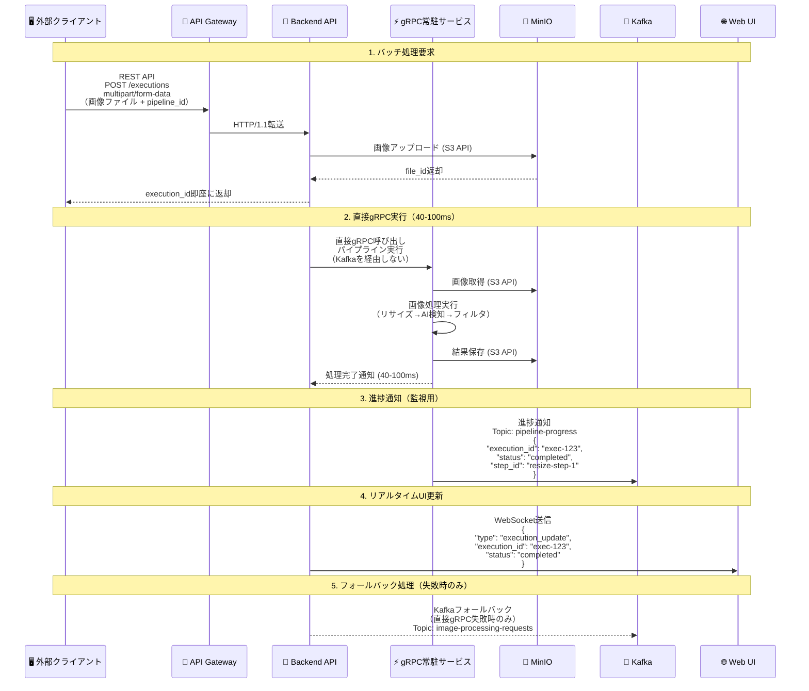
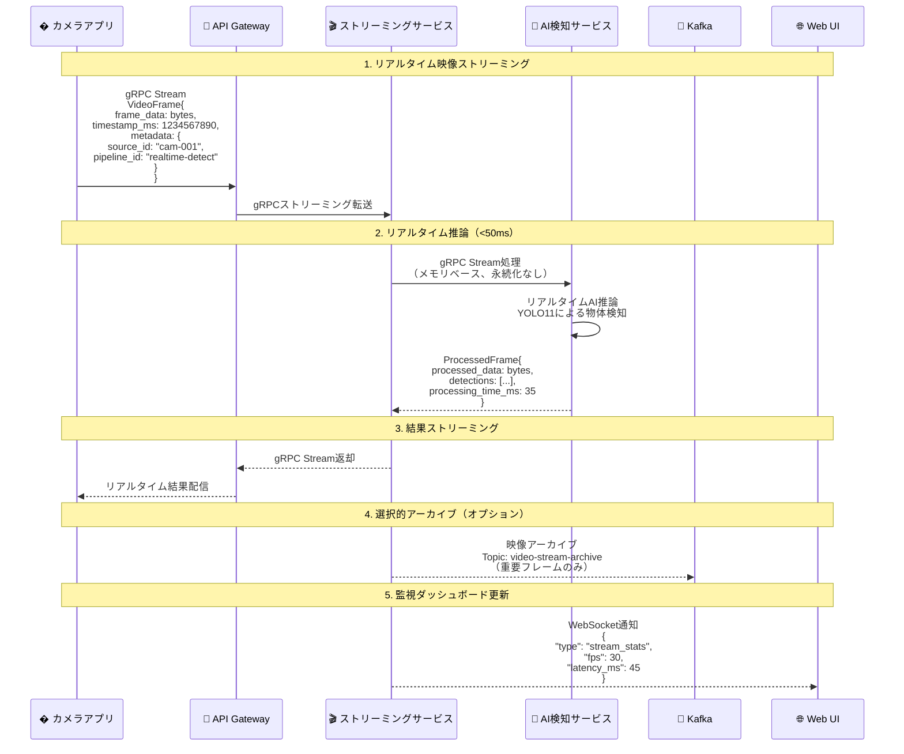

# ImageFlowCanvas API設計書

## **文書管理情報**

| 項目       | 内容                      |
| ---------- | ------------------------- |
| 文書名     | ImageFlowCanvas API設計書 |
| バージョン | 1.0                       |
| 作成日     | 2025年7月12日             |
| 更新日     | 2025年7月12日             |


---

## **5. API設計**

### **5.0. プロトコル設計**

#### **5.0.1. バッチ処理（パイプライン実行）データフロー**


    
#### **5.0.2. リアルタイム処理（映像ストリーミング）データフロー**



#### **5.0.3. プロトコル最適化の選択基準**

| 🎯 用途・シナリオ         | 🚀 推奨プロトコル    | ⚡ 性能特性                                                           | 📝 選択理由                               |
| :----------------------- | :------------------ | :------------------------------------------------------------------- | :--------------------------------------- |
| **バッチ画像処理**       | REST API + 直接gRPC | • 超高速処理 (40-100ms)<br/>• ファイル永続化<br/>• 高信頼性          | パイプライン実行、結果保存が必要な用途   |
| **リアルタイム映像処理** | gRPC Streaming      | • 極低レイテンシ (<50ms)<br/>• ストリーミング対応<br/>• メモリベース | ライブ配信、監視カメラ、検査システム用途 |
| **進捗通知・監視**       | Kafka + WebSocket   | • 非同期通知<br/>• 高スループット<br/>• リアルタイム性               | システム監視、ダッシュボード更新         |
| **フォールバック処理**   | Kafka Consumer      | • 高信頼性<br/>• 順序保証<br/>• 耐障害性                             | 直接gRPC失敗時の代替処理                 |
| **UI更新通知**           | WebSocket           | • 双方向通信<br/>• リアルタイム性<br/>• 低オーバーヘッド             | 進捗表示、監視ダッシュボード             |
| **データ永続化**         | S3 API              | • RESTful<br/>• 標準互換<br/>• 高可用性                              | MinIOとの連携、オブジェクトストレージ    |
| **サービス間内部通信**   | 直接gRPC            | • 型安全<br/>• 超高性能<br/>• Protocol Buffers                       | マイクロサービス内部の高速通信           |

#### **5.0.4. 処理方式別プロトコル仕様**

##### **📋 バッチ処理（パイプライン実行）仕様**

REST API multipart/form-dataでの画像アップロードと、直接gRPC実行による40-100ms高速処理を提供。
実行完了後、WebSocketで進捗通知を送信します。

##### **🎬 リアルタイム処理（映像ストリーミング）仕様**

gRPCストリーミングによるリアルタイム映像処理。50ms以下のレイテンシで
AI検出結果を含む処理済みフレームを返却します。

##### **📨 監視・通知プロトコル仕様**

Kafkaによる進捗通知とWebSocketによるリアルタイム更新で、
実行状況の監視とダッシュボード表示を行います。

### **5.1. API アーキテクチャ**

#### **5.1.1. RESTful API設計**

**ベースURL**: `https://api.imageflowcanvas.com/v1`

**共通仕様**:
- プロトコル：HTTPS
- 認証：Bearer Token (JWT)
- コンテンツタイプ：`application/json`
- エラーフォーマット：RFC 7807準拠

#### **5.1.2. API エンドポイント一覧**

| カテゴリ       | エンドポイント            | メソッド | 用途                 |
| -------------- | ------------------------- | -------- | -------------------- |
| 認証           | `/auth/login`             | POST     | ログイン             |
| 認証           | `/auth/logout`            | POST     | ログアウト           |
| パイプライン   | `/pipelines`              | GET      | パイプライン一覧     |
| パイプライン   | `/pipelines`              | POST     | パイプライン作成     |
| パイプライン   | `/pipelines/{id}`         | GET      | パイプライン詳細     |
| パイプライン   | `/pipelines/{id}`         | PUT      | パイプライン更新     |
| パイプライン   | `/pipelines/{id}`         | DELETE   | パイプライン削除     |
| 実行           | `/executions`             | POST     | パイプライン実行     |
| 実行           | `/executions/{id}`        | GET      | 実行状況取得         |
| 実行           | `/executions/{id}/cancel` | POST     | 実行キャンセル       |
| コンポーネント | `/components`             | GET      | コンポーネント一覧   |
| コンポーネント | `/components/{id}`        | GET      | コンポーネント詳細   |
| ファイル       | `/files`                  | POST     | ファイルアップロード |
| ファイル       | `/files/{id}`             | GET      | ファイルダウンロード |

### **5.2. API詳細仕様**

#### **5.2.1. パイプライン実行API（直接gRPC実行）**

**エンドポイント**: `POST /v1/executions`

**機能**: 画像ファイルをアップロードしてパイプライン処理を実行

**リクエスト形式**: multipart/form-data
- pipeline_id (必須): 実行するパイプラインのUUID
- input_files (必須): 入力画像ファイル（複数対応）
- parameters (オプション): 実行時パラメータ（JSON形式）
- priority (オプション): 優先度（low/normal/high）

**レスポンス**:
- 202: 実行要求受付（40-100ms後に完了予定）
- 400: 無効なリクエスト
- 500: 直接gRPC実行失敗（Kafkaフォールバック）

#### **5.2.2. 実行状況取得API（超高速完了対応）**

**エンドポイント**: `GET /v1/executions/{execution_id}`

**機能**: パイプライン実行の状況を取得

**レスポンス情報**:
- execution_id: 実行ID
- status: 実行状況（pending/running/completed/failed/cancelled）
- execution_mode: 実行方式（direct_grpc/kafka_fallback）
- processing_time_ms: 実際の処理時間
- progress: 進捗情報
- steps: 各ステップの詳細状況
- output_files: 出力ファイル情報

### **5.3. gRPC API設計**

#### **5.3.1. リアルタイム映像処理gRPC**

**主要サービスインターフェース**:

**CameraStreamProcessor**
- ProcessVideoStream: 双方向ストリーミング映像処理（<50msレイテンシ）
- WatchExecution: 実行監視（バッチ処理用）

**DirectPipelineExecutor**
- ExecutePipeline: 直接パイプライン実行（40-100ms処理）
- HealthCheck: ヘルスチェック

**主要メッセージ構造**:
- VideoFrame: 映像フレームデータ（frame_data, timestamp_ms, metadata）
- ProcessedFrame: 処理済みフレーム（processed_data, detections, processing_stats）
- PipelineRequest: パイプライン実行要求（pipeline_id, input_file_ids, parameters）
- Detection: 検出結果（class_name, confidence, bbox）

#### **5.3.2. 個別処理サービス**

**ResizeService**
- 機能: 画像リサイズ処理（10-20ms）
- インターフェース: Resize(ResizeRequest) → ResizeResponse
- パラメータ: target_width, target_height, resize_mode

**AIDetectionService**
- 機能: AI物体検出処理（20-50ms、GPU利用時）
- インターフェース: Detect(DetectionRequest) → DetectionResponse
- パラメータ: model_name, confidence_threshold, target_classes

**FilterService**
- 機能: 画像フィルタ処理（5-15ms）
- インターフェース: ApplyFilter(FilterRequest) → FilterResponse
- パラメータ: filter_type, parameters

#### **5.3.3. サービス接続性設定**

**エンドポイント情報**:
- resize: resize-grpc-app:50051（タイムアウト: 30s）
- ai_detection: ai-detection-grpc-app:50052（タイムアウト: 60s）
- filter: filter-grpc-app:50053（タイムアウト: 20s）

**冗長性設定**:
- Kafkaフォールバック機能
- ヘルスチェック間隔: 10s
- サーキットブレーカー: 失敗閾値5回、復旧タイムアウト30s

### **5.4. WebSocket API設計**

#### **5.4.1. リアルタイム進捗通知**

```javascript
// WebSocket接続エンドポイント
ws://localhost:8080/ws/execution/{execution_id}

// 進捗通知メッセージ形式
{
  "type": "progress",
  "execution_id": "exec-uuid-123",
  "step": "ai_detection",
  "progress": 65.5,
  "status": "processing",
  "timestamp": "2025-07-21T10:30:01.085Z",
  "data": {
    "current_component": "AI Detection Service",
    "elapsed_time_ms": 1750,
    "estimated_remaining_ms": 850
  }
}

// 完了通知
{
  "type": "completed",
  "execution_id": "exec-uuid-123",
  "total_time_ms": 87,
  "output_files": [
    {
      "file_id": "output-123",
      "filename": "result.jpg",
      "download_url": "/api/v1/files/output-123/download"
    }
  ]
}

// エラー通知
{
  "type": "error",
  "execution_id": "exec-uuid-123",
  "error": {
    "code": "AI_SERVICE_UNAVAILABLE",
    "message": "AI Detection Service temporarily unavailable",
    "retry_after": 30
  }
}
```

### **5.4. 検査機能API設計**

#### **5.4.1. 検査マスタ管理API**

**エンドポイント**: `/api/v1/inspection/targets`

**機能**:
- POST: 検査対象新規登録
- GET: 検査対象一覧取得（ページネーション対応）

**データ構造**:
- product_code: 製品コード
- product_name: 製品名
- version: バージョン
- description: 説明

**エンドポイント**: `/api/v1/inspection/targets/{target_id}`
- GET: 検査対象詳細取得

**エンドポイント**: `/api/v1/inspection/targets/{target_id}/items`
- GET: 検査項目一覧取得

#### **5.4.2. 検査実行API**

検査機能のAPI設計については、Tauriベースのクロスプラットフォームアプリケーションでの実装が予定されています。

#### **5.4.3. 検査統計・レポートAPI**

**エンドポイント**: `/api/v1/inspection/statistics`

**機能**: 検査統計データ取得

**パラメータ**:
- start_date: 開始日
- end_date: 終了日
- inspector_id: 検査者ID
- target_id: 検査対象ID

**レスポンス構造**:
- summary: 総合統計（総検査数、OK数、NG数、OK率）
- daily_trends: 日次トレンド
- defect_analysis: 不良分析

#### **5.4.4. 検査機能用データスキーマ**

検査機能のデータスキーマについては、Tauriアプリケーション用に最適化された構造で設計されます。

### **5.5. WebSocket API設計**

#### **5.5.1. リアルタイム進捗通知**

WebSocket接続により、パイプライン実行の進捗をリアルタイムで通知します。
- 実行状況の更新
- 完了通知
- エラー通知
- リソース使用状況の監視

#### **5.5.2. ストリーミング映像配信**

リアルタイム映像処理の結果をWebSocketで配信します。
- 映像フレームデータの配信
- AI検出結果の送信
- 処理統計情報の通知
- ストリーミング制御機能