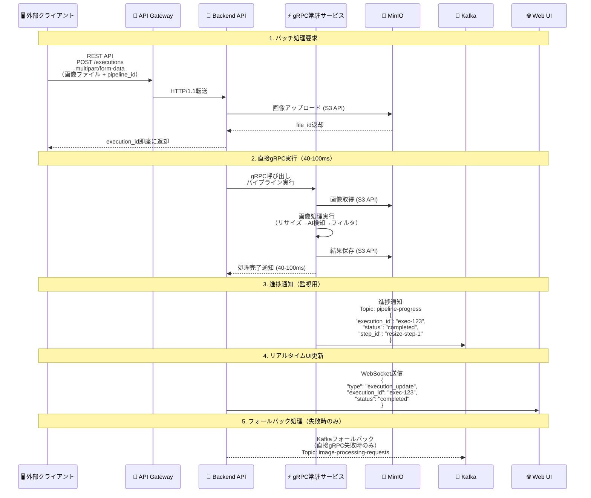
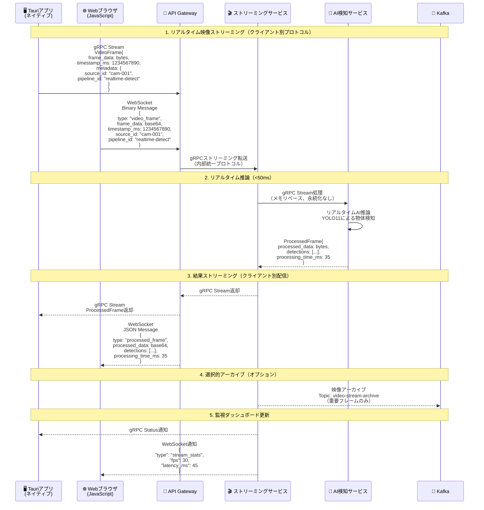
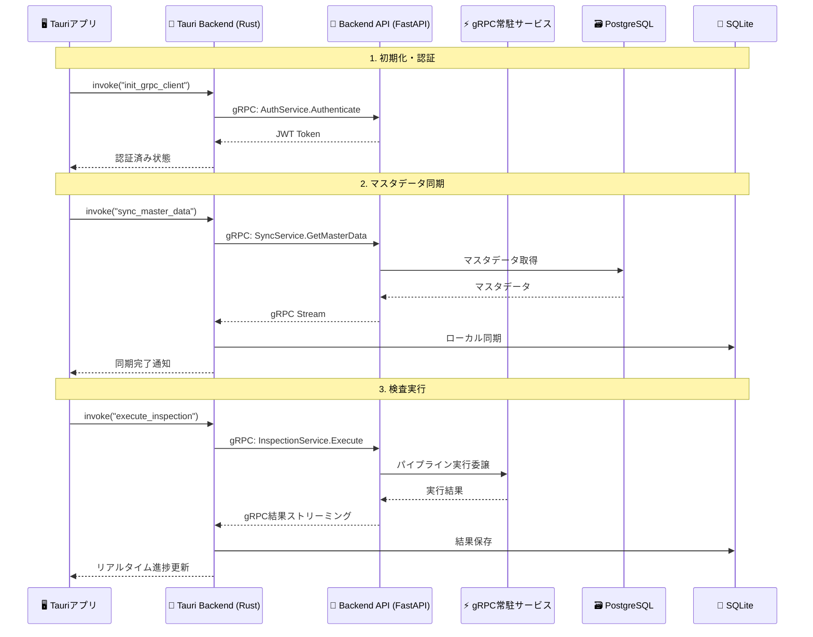
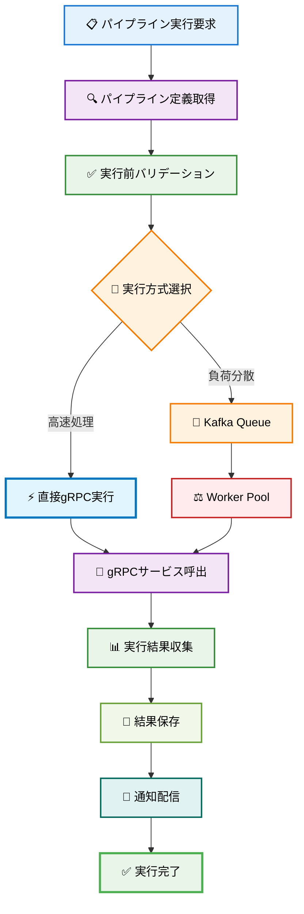
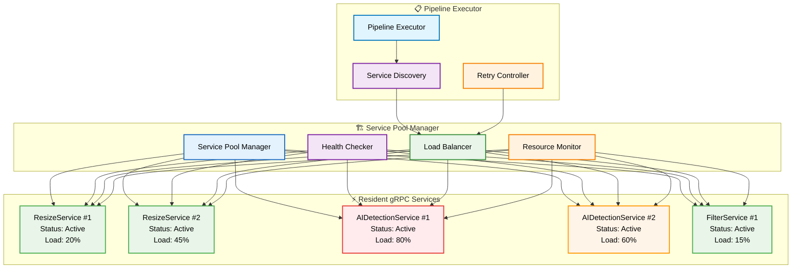

# ImageFlowCanvas API設計書

# 文書管理情報

| 項目       | 内容                      |
| ---------- | ------------------------- |
| 文書名     | ImageFlowCanvas API設計書 |
| バージョン | 1.0                       |
| 作成日     | 2025年7月12日             |
| 更新日     | 2025年7月12日             |


---

# 1. プロトコル設計

## 1.1. バッチ処理（パイプライン実行）データフロー


    
## 1.2. リアルタイム処理（映像ストリーミング）データフロー

### クライアント接続プロトコルの使い分け

本システムでは、クライアントアプリケーションの種類に応じて最適な通信プロトコルを選択します：

- **🖥️ Tauriアプリケーション**: ネイティブgRPC接続によるストリーミング処理（低レイテンシ、高性能）
- **🌐 Webブラウザクライアント**: WebSocket接続による映像ストリーミング（ブラウザ制約対応）



### プロトコル選択の技術的背景

| クライアント種別  | 通信プロトコル | 技術的制約・利点                                                                                                                      |
| :---------------- | :------------- | :------------------------------------------------------------------------------------------------------------------------------------ |
| **🖥️ Tauriアプリ** | gRPC Stream    | • RustネイティブgRPCクライアント<br/>• 最高性能（<30ms）<br/>• Protocol Buffersによる型安全性<br/>• バイナリデータ効率転送            |
| **🌐 Webブラウザ** | WebSocket      | • ブラウザのgRPC制約回避<br/>• gRPC-Web + Envoyの複雑性排除<br/>• JSONベース（可読性重視）<br/>• Base64エンコーディング（互換性重視） |

## 1.3. プロトコル最適化の選択基準

| 🎯 用途・シナリオ     | 🖥️ クライアント種別 | 🚀 推奨プロトコル    | ⚡ 性能特性                                                       | 📝 選択理由                               |
| :------------------- | :----------------- | :------------------ | :--------------------------------------------------------------- | :--------------------------------------- |
| バッチ画像処理       | Tauri/Web共通      | REST API + 直接gRPC | • 超高速処理 (40-100ms)<br/>• ファイル永続化<br/>• 高信頼性      | パイプライン実行、結果保存が必要な用途   |
| リアルタイム映像処理 | 🖥️ Tauriアプリ      | gRPC Streaming      | • 極低レイテンシ (<30ms)<br/>• ネイティブ性能<br/>• バイナリ効率 | ライブ配信、監視カメラ、検査システム用途 |
| リアルタイム映像処理 | 🌐 Webブラウザ      | WebSocket           | • ブラウザ互換性<br/>• 中レイテンシ (<100ms)<br/>• JSON形式      | ブラウザベース監視、ダッシュボード       |
| 進捗通知・監視       | Tauri/Web共通      | Kafka + WebSocket   | • 非同期通知<br/>• 高スループット<br/>• リアルタイム性           | システム監視、ダッシュボード更新         |
| フォールバック処理   | サーバー内部       | Kafka Consumer      | • 高信頼性<br/>• 順序保証<br/>• 耐障害性                         | 直接gRPC失敗時の代替処理                 |
| UI更新通知           | 🖥️ Tauriアプリ      | gRPC Push/WebSocket | • 双方向通信<br/>• 型安全<br/>• 低オーバーヘッド                 | Tauriアプリ内の進捗表示                  |
| UI更新通知           | 🌐 Webブラウザ      | WebSocket           | • 双方向通信<br/>• リアルタイム性<br/>• ブラウザ標準             | Web監視ダッシュボード                    |
| データ永続化         | サーバー内部       | S3 API              | • RESTful<br/>• 標準互換<br/>• 高可用性                          | MinIOとの連携、オブジェクトストレージ    |
| サービス間内部通信   | サーバー内部       | 直接gRPC            | • 型安全<br/>• 超高性能<br/>• Protocol Buffers                   | マイクロサービス内部の高速通信           |

## 1.4. 処理方式別プロトコル仕様

### 1.4.1. 📋 バッチ処理（パイプライン実行）仕様

REST API multipart/form-dataでの画像アップロードと、直接gRPC実行による40-100ms高速処理を提供。
実行完了後、WebSocketで進捗通知を送信します。

### 1.4.2. 🎬 リアルタイム処理（映像ストリーミング）仕様

クライアント種別に応じた最適化されたストリーミング実装：

**🖥️ Tauriアプリ向け - gRPCストリーミング**
- プロトコル: ネイティブgRPC bidirectional streaming
- レイテンシ: <30ms（最高性能）
- データ形式: Protocol Buffers（バイナリ効率）
- 接続方式: 直接API Gateway接続

**🌐 Webブラウザ向け - WebSocketストリーミング**
- プロトコル: WebSocket binary/text messaging
- レイテンシ: <100ms（ブラウザ制約内）
- データ形式: JSON + Base64エンコード（互換性重視）
- 接続方式: API Gateway経由でのプロトコル変換

### 1.4.3. 📨 監視・通知プロトコル仕様

Kafkaによる進捗通知とWebSocketによるリアルタイム更新で、
実行状況の監視とダッシュボード表示を行います。

# 2. API アーキテクチャ

## 2.1. ハイブリッドAPIアーキテクチャ

### 2.1.1. Backend API設計思想

ImageFlowCanvasのBackend APIは、**FastAPI + grpcio**によるハイブリッド実装を採用し、複数のプロトコルを統合管理する「司令塔」として機能します。

```python
# ハイブリッドサーバー構成例
from fastapi import FastAPI
import grpc
from concurrent import futures
import asyncio

class HybridBackendAPI:
    def __init__(self):
        # FastAPI: REST + WebSocket
        self.fastapi_app = FastAPI()
        
        # gRPC Server: 高性能処理
        self.grpc_server = grpc.server(futures.ThreadPoolExecutor())
        
        # 内部サービス接続管理
        self.grpc_clients = GRPCClientManager()
```

### 2.1.2. プロトコル統合戦略

| プロトコル         | 担当領域             | 実装技術          | 特徴                               |
| ------------------ | -------------------- | ----------------- | ---------------------------------- |
| **FastAPI**        | REST API + WebSocket | uvicorn + asyncio | 自動ドキュメント生成、非同期処理   |
| **grpcio**         | gRPCサーバー         | grpcio + asyncio  | 高性能、型安全性、Protocol Buffers |
| **WebSocket**      | リアルタイム通知     | FastAPI WebSocket | 双方向通信、疎結合アーキテクチャ   |
| **Kafka Consumer** | 進捗配信             | aiokafka          | 非同期メッセージング、スケーラブル |

## 2.2. RESTful API設計

### 2.2.1. 基本仕様
- ベースURL: `https://api.imageflowcanvas.com/v1`
- プロトコル：HTTPS必須
- 認証：Bearer Token (JWT)
- コンテンツタイプ：`application/json`
- エラーフォーマット：RFC 7807準拠

### 2.2.2. 実装済みエンドポイント一覧

| カテゴリ         | エンドポイント            | メソッド  | 用途                 | 実装状況 |
| ---------------- | ------------------------- | --------- | -------------------- | -------- |
| 認証             | `/auth/login`             | POST      | ログイン             | ✅        |
| 認証             | `/auth/logout`            | POST      | ログアウト           | ✅        |
| ヘルスチェック   | `/health`                 | GET       | システム状態確認     | ✅        |
| パイプライン     | `/pipelines`              | GET       | パイプライン一覧     | ✅        |
| パイプライン     | `/pipelines`              | POST      | パイプライン作成     | ✅        |
| パイプライン     | `/pipelines/{id}`         | GET       | パイプライン詳細     | ✅        |
| パイプライン     | `/pipelines/{id}`         | PUT       | パイプライン更新     | ✅        |
| パイプライン     | `/pipelines/{id}`         | DELETE    | パイプライン削除     | ✅        |
| 実行             | `/executions`             | POST      | パイプライン実行     | ✅        |
| 実行             | `/executions/{id}`        | GET       | 実行状況取得         | ✅        |
| 実行             | `/executions/{id}/cancel` | POST      | 実行キャンセル       | ✅        |
| コンポーネント   | `/components`             | GET       | コンポーネント一覧   | ✅        |
| コンポーネント   | `/components/{id}`        | GET       | コンポーネント詳細   | ✅        |
| ファイル         | `/files`                  | POST      | ファイルアップロード | ✅        |
| ファイル         | `/files/{id}`             | GET       | ファイルダウンロード | ✅        |
| gRPCサービス     | `/grpc-services`          | GET       | gRPCサービス状況     | ✅        |
| カメラストリーム | `/camera-stream`          | WebSocket | リアルタイム映像     | ✅        |

### 2.2.3. WebSocket専用エンドポイント
- `/ws/execution/{execution_id}`: 実行進捗通知
- `/ws/system-status`: システム状況リアルタイム更新
- `/ws/camera-stream`: カメラストリーミング

# 3. API詳細仕様

## 3.1. パイプライン実行API（直接gRPC実行）

エンドポイント: `POST /v1/executions`

機能: 画像ファイルをアップロードしてパイプライン処理を実行

リクエスト形式: multipart/form-data
- pipeline_id (必須): 実行するパイプラインのUUID
- input_files (必須): 入力画像ファイル（複数対応）
- parameters (オプション): 実行時パラメータ（JSON形式）
- priority (オプション): 優先度（low/normal/high）

レスポンス:
- 202: 実行要求受付（40-100ms後に完了予定）
- 400: 無効なリクエスト
- 500: 直接gRPC実行失敗（Kafkaフォールバック）

## 3.2. 実行状況取得API（超高速完了対応）

エンドポイント: `GET /v1/executions/{execution_id}`

機能: パイプライン実行の状況を取得

レスポンス情報:
- execution_id: 実行ID
- status: 実行状況（pending/running/completed/failed/cancelled）
- execution_mode: 実行方式（direct_grpc/kafka_fallback）
- processing_time_ms: 実際の処理時間
- progress: 進捗情報
- steps: 各ステップの詳細状況
- output_files: 出力ファイル情報

# 4. gRPC API設計

## 4.1. 実装済みgRPCサービス

### 4.1.1. サービス構成

ImageFlowCanvasでは、以下のgRPCサービスが実装・稼働しています：

| サービス名              | エンドポイント                 | 機能                 | Protocol Buffers      |
| ----------------------- | ------------------------------ | -------------------- | --------------------- |
| **ResizeService**       | `resize-grpc-app:50051`        | 画像リサイズ処理     | `resize.proto`        |
| **AIDetectionService**  | `ai-detection-grpc-app:50052`  | AI物体検出・分類     | `ai_detection.proto`  |
| **FilterService**       | `filter-grpc-app:50053`        | 画像フィルタ処理     | `filter.proto`        |
| **CameraStreamService** | `camera-stream-grpc-app:50054` | リアルタイム映像処理 | `camera_stream.proto` |

### 4.1.2. 共通プロトコル定義（common.proto）

```protobuf
syntax = "proto3";
package imageflow.v1;

// 共通画像データ構造
message ImageData {
  string bucket = 1;
  string object_key = 2;
  string content_type = 3;
  int64 size_bytes = 4;
  int32 width = 5;
  int32 height = 6;
  google.protobuf.Timestamp created_at = 7;
}

// 直接画像バイト（リアルタイム処理用）
message ImageBytes {
  bytes data = 1;
  string format = 2;  // "JPEG", "PNG"
  int32 width = 3;
  int32 height = 4;
}

// 処理ステータス
enum ProcessingStatus {
  PROCESSING_STATUS_UNSPECIFIED = 0;
  PROCESSING_STATUS_PENDING = 1;
  PROCESSING_STATUS_RUNNING = 2;
  PROCESSING_STATUS_COMPLETED = 3;
  PROCESSING_STATUS_FAILED = 4;
}

// 処理結果共通構造
message ProcessingResult {
  ProcessingStatus status = 1;
  string message = 2;
  ImageData output_image = 3;
  bytes output_data = 7;  // リアルタイム処理用
  map<string, string> metadata = 4;
  google.protobuf.Timestamp processed_at = 5;
  double processing_time_seconds = 6;
}
```

## 4.2. 個別サービス仕様

### 4.2.1. ResizeService (resize.proto)

**機能**: 画像リサイズ・形式変換
**処理時間**: 10-20ms
**エンドポイント**: resize-grpc-app:50051

```protobuf
service ResizeService {
  rpc Resize(ResizeRequest) returns (ResizeResponse);
  rpc HealthCheck(HealthCheckRequest) returns (HealthCheckResponse);
}

message ResizeRequest {
  ImageData input_image = 1;
  int32 target_width = 2;
  int32 target_height = 3;
  string resize_mode = 4;  // "fit", "fill", "stretch"
  bool maintain_aspect_ratio = 5;
}

message ResizeResponse {
  ProcessingResult result = 1;
}
```

### 4.2.2. AIDetectionService (ai_detection.proto)

**機能**: AI物体検出・分類
**処理時間**: 20-50ms (GPU使用時)
**エンドポイント**: ai-detection-grpc-app:50052

```protobuf
service AIDetectionService {
  rpc Detect(DetectionRequest) returns (DetectionResponse);
  rpc HealthCheck(HealthCheckRequest) returns (HealthCheckResponse);
}

message DetectionRequest {
  ImageData input_image = 1;
  string model_name = 2;      // "yolo11", "resnet50"
  float confidence_threshold = 3;
  repeated string target_classes = 4;
}

message DetectionResponse {
  ProcessingResult result = 1;
  repeated Detection detections = 2;
}

message Detection {
  string class_name = 1;
  float confidence = 2;
  BoundingBox bbox = 3;
}

message BoundingBox {
  float x = 1;
  float y = 2;
  float width = 3;
  float height = 4;
}
```

### 4.2.3. FilterService (filter.proto)

**機能**: 画像フィルタ・前後処理
**処理時間**: 5-15ms
**エンドポイント**: filter-grpc-app:50053

```protobuf
service FilterService {
  rpc ApplyFilter(FilterRequest) returns (FilterResponse);
  rpc HealthCheck(HealthCheckRequest) returns (HealthCheckResponse);
}

message FilterRequest {
  ImageData input_image = 1;
  string filter_type = 2;    // "blur", "sharpen", "edge"
  map<string, string> parameters = 3;
}

message FilterResponse {
  ProcessingResult result = 1;
}
```

### 4.2.4. CameraStreamService (camera_stream.proto)

**機能**: リアルタイム映像ストリーミング処理
**レイテンシ**: <50ms
**エンドポイント**: camera-stream-grpc-app:50054

```protobuf
service CameraStreamService {
  rpc ProcessVideoStream(stream VideoFrame) returns (stream ProcessedFrame);
  rpc HealthCheck(HealthCheckRequest) returns (HealthCheckResponse);
}

message VideoFrame {
  bytes frame_data = 1;
  int64 timestamp_ms = 2;
  map<string, string> metadata = 3;
}

message ProcessedFrame {
  bytes processed_data = 1;
  repeated Detection detections = 2;
  int64 processing_time_ms = 3;
  map<string, string> processing_stats = 4;
}
```

## 4.3. サービス接続管理

### 4.3.1. 接続設定
```python
# gRPCクライアント設定例
GRPC_SERVICES = {
    "resize": {
        "address": "resize-grpc-app:50051",
        "timeout": 30,
        "retry_count": 3
    },
    "ai_detection": {
        "address": "ai-detection-grpc-app:50052", 
        "timeout": 60,
        "retry_count": 2
    },
    "filter": {
        "address": "filter-grpc-app:50053",
        "timeout": 20, 
        "retry_count": 3
    },
    "camera_stream": {
        "address": "camera-stream-grpc-app:50054",
        "timeout": 10,
        "retry_count": 1
    }
}
```

### 4.3.2. ヘルスチェック・冗長性
- **ヘルスチェック間隔**: 10秒
- **サーキットブレーカー**: 失敗閾値5回、復旧タイムアウト30秒
- **Kafkaフォールバック**: 直接gRPC失敗時の代替処理
- **ロードバランシング**: サービス別の負荷分散

# 5. WebSocket API設計

## 5.1. リアルタイム進捗通知

```javascript
// WebSocket接続エンドポイント
ws://localhost:8080/ws/execution/{execution_id}

// 進捗通知メッセージ形式
{
  "type": "progress",
  "execution_id": "exec-uuid-123",
  "step": "ai_detection",
  "progress": 65.5,
  "status": "processing",
  "timestamp": "2025-07-21T10:30:01.085Z",
  "data": {
    "current_component": "AI Detection Service",
    "elapsed_time_ms": 1750,
    "estimated_remaining_ms": 850
  }
}

// 完了通知
{
  "type": "completed",
  "execution_id": "exec-uuid-123",
  "total_time_ms": 87,
  "output_files": [
    {
      "file_id": "output-123",
      "filename": "result.jpg",
      "download_url": "/api/v1/files/output-123/download"
    }
  ]
}

// エラー通知
{
  "type": "error",
  "execution_id": "exec-uuid-123",
  "error": {
    "code": "AI_SERVICE_UNAVAILABLE",
    "message": "AI Detection Service temporarily unavailable",
    "retry_after": 30
  }
}
```

# 6. 検査機能API設計

## 6.1. Tauri検査アプリAPI

### 6.1.1. 検査マスタ管理API

**検査対象マスタ**
```http
GET /api/v1/inspection/targets
POST /api/v1/inspection/targets
GET /api/v1/inspection/targets/{target_id}
PUT /api/v1/inspection/targets/{target_id}
DELETE /api/v1/inspection/targets/{target_id}
```

**検査項目マスタ**
```http
GET /api/v1/inspection/targets/{target_id}/items
POST /api/v1/inspection/targets/{target_id}/items
GET /api/v1/inspection/items/{item_id}
PUT /api/v1/inspection/items/{item_id}
DELETE /api/v1/inspection/items/{item_id}
```

### 6.1.2. 検査実行API

**検査セッション管理**
```http
POST /api/v1/inspection/sessions
GET /api/v1/inspection/sessions/{session_id}
PUT /api/v1/inspection/sessions/{session_id}
POST /api/v1/inspection/sessions/{session_id}/complete
```

**AI検査実行（パイプライン連携）**
```http
POST /api/v1/inspection/sessions/{session_id}/ai-inspection
```

リクエスト例:
```json
{
  "session_id": "session-12345",
  "item_id": "item-67890",
  "image_file_path": "/path/to/captured/image.jpg",
  "pipeline_id": "pipeline-ai-detect-v1.2",
  "parameters": {
    "confidence_threshold": 0.8,
    "model_name": "yolo11"
  }
}
```

レスポンス例:
```json
{
  "ai_result": {
    "overall_result": "NG",
    "confidence": 0.92,
    "detections": [
      {
        "class_name": "defect",
        "confidence": 0.92,
        "bbox": {"x": 150, "y": 200, "width": 50, "height": 30}
      }
    ]
  },
  "processing_time_ms": 1250,
  "pipeline_version": "v1.2",
  "created_at": "2025-07-27T10:30:00Z"
}
```

**人による検証API**
```http
POST /api/v1/inspection/sessions/{session_id}/human-verification
```

### 6.1.3. 検査データ同期API

**オフライン同期**
```http
POST /api/v1/inspection/sync/upload
GET /api/v1/inspection/sync/download
```

**差分同期**
```http
GET /api/v1/inspection/sync/changes?since={timestamp}
POST /api/v1/inspection/sync/apply-changes
```

## 6.2. 統計・レポートAPI

### 6.2.1. 検査統計API

**基本統計情報**
```http
GET /api/v1/inspection/statistics?start_date={date}&end_date={date}
```

レスポンス例:
```json
{
  "summary": {
    "total_inspections": 1250,
    "ok_count": 1180,
    "ng_count": 70,
    "ok_rate": 94.4
  },
  "daily_trends": [
    {
      "date": "2025-07-27",
      "total": 85,
      "ok": 80,
      "ng": 5
    }
  ],
  "defect_analysis": {
    "scratch": 35,
    "contamination": 20,
    "deformation": 15
  }
}
```

### 6.2.2. 品質ダッシュボード用API

**リアルタイム品質指標**
```http
GET /api/v1/inspection/quality/realtime
WebSocket: /ws/quality-metrics
```

**検査傾向分析**
```http
GET /api/v1/inspection/quality/trends
GET /api/v1/inspection/quality/alerts
```

## 6.3. パイプライン統合API

### 6.3.1. 検査用パイプライン管理

**検査項目とパイプラインの関連付け**
```http
GET /api/v1/inspection/items/{item_id}/pipeline
PUT /api/v1/inspection/items/{item_id}/pipeline
```

**パイプライン実行結果の検査結果への変換**
```http
POST /api/v1/inspection/pipeline-results/convert
```

### 6.3.2. Tauriアプリ専用エンドポイント

**デバイス登録・認証**
```http
POST /api/v1/tauri/devices/register
POST /api/v1/tauri/auth/login
```

**アプリ設定同期**
```http
GET /api/v1/tauri/config
PUT /api/v1/tauri/config
```

## 6.4. WebSocket API設計

### 6.4.1. リアルタイム進捗通知

WebSocket接続により、パイプライン実行の進捗をリアルタイムで通知します。

**接続エンドポイント**
```
ws://localhost:8080/ws/execution/{execution_id}
ws://localhost:8080/ws/system-status
ws://localhost:8080/ws/camera-stream
ws://localhost:8080/ws/quality-metrics
```

**進捗通知メッセージ形式**
```javascript
// パイプライン実行進捗
{
  "type": "progress",
  "execution_id": "exec-uuid-123",
  "step": "ai_detection",
  "progress": 65.5,
  "status": "processing",
  "timestamp": "2025-07-27T10:30:01.085Z",
  "data": {
    "current_component": "AI Detection Service",
    "elapsed_time_ms": 1750,
    "estimated_remaining_ms": 850
  }
}

// 完了通知
{
  "type": "completed",
  "execution_id": "exec-uuid-123",
  "total_time_ms": 87,
  "output_files": [
    {
      "file_id": "output-123",
      "filename": "result.jpg",
      "download_url": "/api/v1/files/output-123/download"
    }
  ]
}

// エラー通知
{
  "type": "error",
  "execution_id": "exec-uuid-123",
  "error": {
    "code": "AI_SERVICE_UNAVAILABLE",
    "message": "AI Detection Service temporarily unavailable",
    "retry_after": 30
  }
}
```

### 6.4.2. 検査品質リアルタイム通知

```javascript
// 品質メトリクス更新
{
  "type": "quality_update",
  "timestamp": "2025-07-27T10:30:00Z",
  "metrics": {
    "hourly_ok_rate": 95.2,
    "current_ng_count": 3,
    "active_inspectors": 12
  }
}

// 品質アラート
{
  "type": "quality_alert",
  "severity": "high",
  "message": "NG rate exceeded threshold (>5%)",
  "data": {
    "current_ng_rate": 7.2,
    "threshold": 5.0,
    "time_window": "last_hour"
  }
}
```

### 6.4.3. ストリーミング映像配信

リアルタイム映像処理の結果をWebSocketで配信します。
- 映像フレームデータの配信
- AI検出結果の送信
- 処理統計情報の通知
- ストリーミング制御機能

## 6.5. エラーハンドリング・レスポンス仕様

### 6.5.1. 標準エラーレスポンス（RFC 7807準拠）

```json
{
  "type": "https://api.imageflowcanvas.com/errors/validation-error",
  "title": "入力データが無効です",
  "status": 400,
  "detail": "confidence_thresholdは0.0-1.0の範囲で指定してください",
  "instance": "/api/v1/inspection/sessions/session-123/ai-inspection",
  "validation_errors": [
    {
      "field": "confidence_threshold",
      "message": "値は0.0以上1.0以下である必要があります",
      "value": 1.5
    }
  ]
}
```

### 6.5.2. 検査機能特有のエラー

```json
{
  "type": "https://api.imageflowcanvas.com/errors/inspection-error",
  "title": "検査実行エラー",
  "status": 422,
  "detail": "指定されたパイプラインが検査項目と互換性がありません",
  "inspection_context": {
    "session_id": "session-123",
    "item_id": "item-456",
    "pipeline_id": "pipeline-789"
  }
}
```

# 7. TauriからBackend APIへのgRPC通信

## 7.1. Tauri gRPC クライアント設計

TauriアプリケーションからBackend APIへの通信は、効率性とリアルタイム性を重視したgRPCベースの設計を採用します。

### 7.1.1. 通信アーキテクチャ



### 7.1.2. gRPCクライアント実装（Rust）

**Cargo.toml依存関係**:
```toml
[dependencies]
tonic = "0.8"
prost = "0.11"
tokio = { version = "1.0", features = ["full"] }
tokio-stream = "0.1"
serde = { version = "1.0", features = ["derive"] }
tauri = { version = "1.0", features = ["api-all"] }

[build-dependencies]
tonic-build = "0.8"
```

**gRPCクライアント実装**:
```rust
use tonic::transport::Channel;
use tonic::Request;
use std::sync::Arc;
use tokio::sync::RwLock;

// 自動生成されたgRPCクライアント
use crate::proto::{
    auth_service_client::AuthServiceClient,
    sync_service_client::SyncServiceClient,
    inspection_service_client::InspectionServiceClient,
};

#[derive(Clone)]
pub struct TauriGrpcClient {
    channel: Channel,
    auth_client: Arc<RwLock<AuthServiceClient<Channel>>>,
    sync_client: Arc<RwLock<SyncServiceClient<Channel>>>,
    inspection_client: Arc<RwLock<InspectionServiceClient<Channel>>>,
    jwt_token: Arc<RwLock<Option<String>>>,
}

impl TauriGrpcClient {
    pub async fn new(endpoint: &str) -> Result<Self, Box<dyn std::error::Error>> {
        let channel = Channel::from_static(endpoint).connect().await?;
        
        Ok(Self {
            channel: channel.clone(),
            auth_client: Arc::new(RwLock::new(AuthServiceClient::new(channel.clone()))),
            sync_client: Arc::new(RwLock::new(SyncServiceClient::new(channel.clone()))), 
            inspection_client: Arc::new(RwLock::new(InspectionServiceClient::new(channel.clone()))),
            jwt_token: Arc::new(RwLock::new(None)),
        })
    }

    pub async fn authenticate(&self, username: &str, password: &str) -> Result<String, Box<dyn std::error::Error>> {
        let mut client = self.auth_client.write().await;
        let request = Request::new(AuthRequest {
            username: username.to_string(),
            password: password.to_string(),
        });
        
        let response = client.authenticate(request).await?;
        let token = response.into_inner().token;
        
        *self.jwt_token.write().await = Some(token.clone());
        Ok(token)
    }

    pub async fn sync_master_data(&self) -> Result<(), Box<dyn std::error::Error>> {
        let mut client = self.sync_client.write().await;
        let token = self.jwt_token.read().await.clone()
            .ok_or("Not authenticated")?;
            
        let mut request = Request::new(SyncRequest {
            last_sync_timestamp: self.get_last_sync_timestamp().await?,
        });
        request.metadata_mut().insert("authorization", format!("Bearer {}", token).parse()?);
        
        let mut stream = client.get_master_data(request).await?.into_inner();
        
        while let Some(sync_data) = stream.message().await? {
            self.process_sync_data(sync_data).await?;
        }
        
        Ok(())
    }
}

// Tauriコマンド実装
#[tauri::command]
pub async fn init_grpc_client(endpoint: String) -> Result<String, String> {
    let client = TauriGrpcClient::new(&endpoint).await
        .map_err(|e| e.to_string())?;
    
    // グローバル状態に保存
    Ok("gRPC client initialized".to_string())
}

#[tauri::command]
pub async fn sync_master_data() -> Result<String, String> {
    // グローバル状態からクライアント取得
    let client = get_global_client().await?;
    client.sync_master_data().await
        .map_err(|e| e.to_string())?;
    
    Ok("Master data synchronized".to_string())
}
```

### 7.1.3. フロントエンド統合（TypeScript）

```typescript
import { invoke } from '@tauri-apps/api/tauri';

export class TauriApiClient {
    private initialized = false;

    async initialize(endpoint: string): Promise<void> {
        try {
            await invoke('init_grpc_client', { endpoint });
            this.initialized = true;
        } catch (error) {
            throw new Error(`gRPC client initialization failed: ${error}`);
        }
    }

    async syncMasterData(): Promise<void> {
        if (!this.initialized) {
            throw new Error('Client not initialized');
        }

        try {
            await invoke('sync_master_data');
        } catch (error) {
            throw new Error(`Master data sync failed: ${error}`);
        }
    }

    async executeInspection(pipelineId: string, imageData: ArrayBuffer): Promise<string> {
        if (!this.initialized) {
            throw new Error('Client not initialized');
        }

        try {
            const result = await invoke('execute_inspection', {
                pipelineId,
                imageData: Array.from(new Uint8Array(imageData))
            });
            return result as string;
        } catch (error) {
            throw new Error(`Inspection execution failed: ${error}`);
        }
    }
}
```

# 8. Backend APIでの定義済みパイプラインの実行

## 8.1. パイプライン実行エンジン設計

Backend APIは、事前に定義されたパイプラインを効率的に実行するためのオーケストレーション機能を提供します。

### 8.1.1. パイプライン実行フロー



### 8.1.2. パイプライン定義管理

**パイプライン定義スキーマ**:
```json
{
  "pipeline_id": "quality-inspection-v1",
  "name": "品質検査パイプライン",
  "version": "1.0.0",
  "description": "AI による欠陥検出と品質評価",
  "execution_mode": "direct_grpc", 
  "steps": [
    {
      "step_id": "resize",
      "service": "ResizeService",
      "method": "Resize",
      "input_schema": {
        "width": "integer",
        "height": "integer", 
        "maintain_aspect_ratio": "boolean"
      },
      "timeout_ms": 5000,
      "retry_count": 3
    },
    {
      "step_id": "ai_detection",
      "service": "AIDetectionService", 
      "method": "DetectDefects",
      "depends_on": ["resize"],
      "input_schema": {
        "model_name": "string",
        "confidence_threshold": "float"
      },
      "timeout_ms": 30000,
      "retry_count": 2
    },
    {
      "step_id": "quality_filter",
      "service": "FilterService",
      "method": "ApplyQualityFilter", 
      "depends_on": ["ai_detection"],
      "input_schema": {
        "filter_type": "enum",
        "parameters": "object"
      },
      "timeout_ms": 10000,
      "retry_count": 3
    }
  ],
  "error_handling": {
    "strategy": "fail_fast",
    "rollback_enabled": true,
    "notification_on_failure": true
  }
}
```

### 8.1.3. 実行エンジン実装（Python FastAPI）

```python
from typing import Dict, List, Any, Optional
from dataclasses import dataclass
from enum import Enum
import asyncio
import json
import grpc
from concurrent.futures import ThreadPoolExecutor

class ExecutionMode(Enum):
    DIRECT_GRPC = "direct_grpc"
    KAFKA_QUEUE = "kafka_queue"
    HYBRID = "hybrid"

@dataclass
class PipelineStep:
    step_id: str
    service: str
    method: str
    input_schema: Dict[str, Any]
    depends_on: List[str]
    timeout_ms: int
    retry_count: int

@dataclass 
class PipelineDefinition:
    pipeline_id: str
    name: str
    version: str
    execution_mode: ExecutionMode
    steps: List[PipelineStep]
    error_handling: Dict[str, Any]

class PipelineExecutor:
    def __init__(self):
        self.grpc_clients = {}
        self.executor = ThreadPoolExecutor(max_workers=10)
        
    async def execute_pipeline(
        self, 
        pipeline_id: str, 
        input_data: Dict[str, Any]
    ) -> Dict[str, Any]:
        """事前定義されたパイプラインを実行"""
        
        # 1. パイプライン定義取得
        pipeline_def = await self.get_pipeline_definition(pipeline_id)
        
        # 2. 実行前バリデーション
        await self.validate_execution_context(pipeline_def, input_data)
        
        # 3. 実行方式に応じた処理
        if pipeline_def.execution_mode == ExecutionMode.DIRECT_GRPC:
            return await self.execute_direct_grpc(pipeline_def, input_data)
        elif pipeline_def.execution_mode == ExecutionMode.KAFKA_QUEUE:
            return await self.execute_via_kafka(pipeline_def, input_data)
        else:
            return await self.execute_hybrid(pipeline_def, input_data)
    
    async def execute_direct_grpc(
        self, 
        pipeline_def: PipelineDefinition, 
        input_data: Dict[str, Any]
    ) -> Dict[str, Any]:
        """直接gRPC実行（40-100ms高速処理）"""
        
        execution_context = {
            "pipeline_id": pipeline_def.pipeline_id,
            "execution_id": self.generate_execution_id(),
            "start_time": asyncio.get_event_loop().time(),
            "step_results": {}
        }
        
        try:
            # 依存関係に基づくステップ順序決定
            execution_order = self.resolve_dependencies(pipeline_def.steps)
            
            # 各ステップを順次実行
            for step in execution_order:
                step_input = self.prepare_step_input(
                    step, input_data, execution_context["step_results"]
                )
                
                # gRPCサービス呼び出し
                step_result = await self.call_grpc_service(
                    step.service, step.method, step_input, step.timeout_ms
                )
                
                execution_context["step_results"][step.step_id] = step_result
                
                # 進捗通知
                await self.notify_progress(
                    execution_context["execution_id"], 
                    step.step_id, 
                    "completed"
                )
            
            # 実行完了
            execution_context["status"] = "completed"
            execution_context["end_time"] = asyncio.get_event_loop().time()
            
            return {
                "execution_id": execution_context["execution_id"],
                "status": "completed",
                "results": execution_context["step_results"],
                "execution_time_ms": int(
                    (execution_context["end_time"] - execution_context["start_time"]) * 1000
                )
            }
            
        except Exception as e:
            await self.handle_execution_error(execution_context, e)
            raise
    
    async def call_grpc_service(
        self, 
        service_name: str, 
        method_name: str, 
        input_data: Dict[str, Any],
        timeout_ms: int
    ) -> Dict[str, Any]:
        """gRPCサービス呼び出し"""
        
        client = self.grpc_clients.get(service_name)
        if not client:
            raise ValueError(f"gRPC client not found for service: {service_name}")
        
        try:
            # タイムアウト設定でgRPC呼び出し
            async with asyncio.timeout(timeout_ms / 1000):
                method = getattr(client, method_name)
                response = await method(input_data)
                return response
                
        except asyncio.TimeoutError:
            raise Exception(f"gRPC call timeout: {service_name}.{method_name}")
        except grpc.RpcError as e:
            raise Exception(f"gRPC error: {e.details()}")

# FastAPI エンドポイント実装
@app.post("/api/v1/pipelines/{pipeline_id}/execute")
async def execute_predefined_pipeline(
    pipeline_id: str,
    request: PipelineExecutionRequest
):
    """定義済みパイプライン実行API"""
    
    executor = PipelineExecutor()
    
    try:
        result = await executor.execute_pipeline(
            pipeline_id=pipeline_id,
            input_data=request.input_data
        )
        
        return {
            "success": True,
            "execution_id": result["execution_id"],
            "status": result["status"],
            "results": result["results"],
            "execution_time_ms": result["execution_time_ms"]
        }
        
    except Exception as e:
        return {
            "success": False,
            "error": {
                "type": "pipeline_execution_error",
                "message": str(e),
                "pipeline_id": pipeline_id
            }
        }
```

# 9. 定義済みパイプラインでの常駐gRPCサービスの使用

## 9.1. 常駐gRPCサービス アーキテクチャ

定義済みパイプラインは、高性能処理のために常駐gRPCサービスプールを活用します。

### 9.1.1. サービスプール管理



### 9.1.2. サービス発見・負荷分散

**Service Registry実装**:
```python
import asyncio
from typing import Dict, List, Optional
from dataclasses import dataclass, field
from enum import Enum
import random
import time

class ServiceStatus(Enum):
    ACTIVE = "active"
    BUSY = "busy" 
    UNAVAILABLE = "unavailable"
    MAINTENANCE = "maintenance"

@dataclass
class ServiceInstance:
    service_name: str
    instance_id: str
    endpoint: str
    status: ServiceStatus
    current_connections: int = 0
    max_connections: int = 100
    cpu_usage: float = 0.0
    memory_usage: float = 0.0
    last_health_check: float = field(default_factory=time.time)
    response_time_ms: float = 0.0

class ServiceRegistry:
    def __init__(self):
        self.services: Dict[str, List[ServiceInstance]] = {}
        self.health_check_interval = 30  # 30秒
        self.running = False
        
    async def register_service(self, instance: ServiceInstance):
        """サービスインスタンス登録"""
        if instance.service_name not in self.services:
            self.services[instance.service_name] = []
        self.services[instance.service_name].append(instance)
        
    async def discover_service(
        self, 
        service_name: str, 
        load_balancing: str = "least_connections"
    ) -> Optional[ServiceInstance]:
        """サービス発見・負荷分散"""
        
        if service_name not in self.services:
            return None
            
        available_instances = [
            instance for instance in self.services[service_name]
            if instance.status == ServiceStatus.ACTIVE
        ]
        
        if not available_instances:
            return None
            
        # 負荷分散アルゴリズム適用
        if load_balancing == "least_connections":
            return min(available_instances, key=lambda x: x.current_connections)
        elif load_balancing == "response_time":
            return min(available_instances, key=lambda x: x.response_time_ms)
        elif load_balancing == "cpu_usage":
            return min(available_instances, key=lambda x: x.cpu_usage)
        else:  # random
            return random.choice(available_instances)
    
    async def start_health_monitoring(self):
        """ヘルスチェック開始"""
        self.running = True
        while self.running:
            await self.perform_health_checks()
            await asyncio.sleep(self.health_check_interval)
    
    async def perform_health_checks(self):
        """全サービスインスタンスのヘルスチェック"""
        for service_name, instances in self.services.items():
            for instance in instances:
                try:
                    # gRPCヘルスチェック実行
                    health_response = await self.check_instance_health(instance)
                    
                    if health_response["healthy"]:
                        instance.status = ServiceStatus.ACTIVE
                        instance.cpu_usage = health_response["cpu_usage"]
                        instance.memory_usage = health_response["memory_usage"]
                        instance.current_connections = health_response["connections"]
                        instance.response_time_ms = health_response["response_time_ms"]
                    else:
                        instance.status = ServiceStatus.UNAVAILABLE
                        
                    instance.last_health_check = time.time()
                    
                except Exception as e:
                    instance.status = ServiceStatus.UNAVAILABLE
                    print(f"Health check failed for {instance.instance_id}: {e}")

class PipelineGrpcClient:
    def __init__(self, service_registry: ServiceRegistry):
        self.service_registry = service_registry
        self.grpc_connections = {}
        
    async def execute_step(
        self, 
        service_name: str, 
        method_name: str, 
        input_data: Dict[str, Any],
        timeout_ms: int = 30000,
        max_retries: int = 3
    ) -> Dict[str, Any]:
        """パイプラインステップ実行（自動リトライ付き）"""
        
        last_error = None
        
        for attempt in range(max_retries + 1):
            try:
                # サービス発見
                instance = await self.service_registry.discover_service(
                    service_name, "least_connections"
                )
                
                if not instance:
                    raise Exception(f"No available instance for service: {service_name}")
                
                # gRPC接続取得/作成
                client = await self.get_grpc_client(instance)
                
                # 接続数カウント増加
                instance.current_connections += 1
                
                try:
                    # メソッド実行
                    start_time = time.time()
                    method = getattr(client, method_name)
                    
                    async with asyncio.timeout(timeout_ms / 1000):
                        result = await method(input_data)
                    
                    # レスポンス時間更新
                    instance.response_time_ms = (time.time() - start_time) * 1000
                    
                    return result
                    
                finally:
                    # 接続数カウント減少
                    instance.current_connections = max(0, instance.current_connections - 1)
                    
            except Exception as e:
                last_error = e
                if attempt < max_retries:
                    # 指数バックオフでリトライ
                    wait_time = (2 ** attempt) * 0.1
                    await asyncio.sleep(wait_time)
                    continue
                else:
                    break
        
        raise Exception(f"gRPC call failed after {max_retries + 1} attempts: {last_error}")
    
    async def get_grpc_client(self, instance: ServiceInstance):
        """gRPCクライアント取得（コネクションプール）"""
        
        if instance.endpoint not in self.grpc_connections:
            # 新しい接続を作成
            channel = grpc.aio.insecure_channel(instance.endpoint)
            
            # サービス名に応じたクライアント作成
            if instance.service_name == "ResizeService":
                from .proto.resize_pb2_grpc import ResizeServiceStub
                client = ResizeServiceStub(channel)
            elif instance.service_name == "AIDetectionService":
                from .proto.ai_detection_pb2_grpc import AIDetectionServiceStub
                client = AIDetectionServiceStub(channel)
            elif instance.service_name == "FilterService":
                from .proto.filter_pb2_grpc import FilterServiceStub
                client = FilterServiceStub(channel)
            else:
                raise ValueError(f"Unknown service: {instance.service_name}")
                
            self.grpc_connections[instance.endpoint] = client
        
        return self.grpc_connections[instance.endpoint]

# 統合例：パイプライン実行での使用
class EnhancedPipelineExecutor:
    def __init__(self):
        self.service_registry = ServiceRegistry()
        self.grpc_client = PipelineGrpcClient(self.service_registry)
        
    async def initialize(self):
        """常駐サービス発見・登録"""
        
        # 利用可能なサービスインスタンスを発見・登録
        resize_instances = [
            ServiceInstance("ResizeService", "resize-1", "localhost:50051", ServiceStatus.ACTIVE),
            ServiceInstance("ResizeService", "resize-2", "localhost:50052", ServiceStatus.ACTIVE),
        ]
        
        ai_instances = [
            ServiceInstance("AIDetectionService", "ai-1", "localhost:50061", ServiceStatus.ACTIVE, max_connections=50),
            ServiceInstance("AIDetectionService", "ai-2", "localhost:50062", ServiceStatus.ACTIVE, max_connections=50),
        ]
        
        filter_instances = [
            ServiceInstance("FilterService", "filter-1", "localhost:50071", ServiceStatus.ACTIVE),
        ]
        
        for instance in resize_instances + ai_instances + filter_instances:
            await self.service_registry.register_service(instance)
        
        # ヘルスモニタリング開始
        asyncio.create_task(self.service_registry.start_health_monitoring())
    
    async def execute_pipeline_step(
        self, 
        step: PipelineStep, 
        input_data: Dict[str, Any]
    ) -> Dict[str, Any]:
        """常駐gRPCサービスを使用したステップ実行"""
        
        return await self.grpc_client.execute_step(
            service_name=step.service,
            method_name=step.method,
            input_data=input_data,
            timeout_ms=step.timeout_ms,
            max_retries=step.retry_count
        )
```

### 9.1.3. パフォーマンス監視・最適化

**メトリクス収集**:
```python
from dataclasses import dataclass
from typing import Dict, List
import time
import statistics

@dataclass
class PipelineMetrics:
    pipeline_id: str
    execution_id: str
    total_execution_time_ms: float
    step_metrics: Dict[str, Dict[str, float]]
    service_metrics: Dict[str, Dict[str, float]]
    resource_usage: Dict[str, float]

class MetricsCollector:
    def __init__(self):
        self.metrics_history: List[PipelineMetrics] = []
        
    async def collect_pipeline_metrics(
        self, 
        pipeline_id: str, 
        execution_context: Dict[str, Any]
    ) -> PipelineMetrics:
        """パイプライン実行メトリクス収集"""
        
        metrics = PipelineMetrics(
            pipeline_id=pipeline_id,
            execution_id=execution_context["execution_id"],
            total_execution_time_ms=execution_context.get("execution_time_ms", 0),
            step_metrics={},
            service_metrics={},
            resource_usage={}
        )
        
        # ステップ毎のメトリクス
        for step_id, step_result in execution_context["step_results"].items():
            metrics.step_metrics[step_id] = {
                "execution_time_ms": step_result.get("execution_time_ms", 0),
                "input_size_bytes": step_result.get("input_size_bytes", 0),
                "output_size_bytes": step_result.get("output_size_bytes", 0),
                "retry_count": step_result.get("retry_count", 0)
            }
        
        # サービス毎の集計メトリクス
        service_times = {}
        for step_id, step_result in execution_context["step_results"].items():
            service_name = step_result.get("service_name")
            if service_name:
                if service_name not in service_times:
                    service_times[service_name] = []
                service_times[service_name].append(
                    step_result.get("execution_time_ms", 0)
                )
        
        for service_name, times in service_times.items():
            metrics.service_metrics[service_name] = {
                "avg_execution_time_ms": statistics.mean(times),
                "max_execution_time_ms": max(times),
                "min_execution_time_ms": min(times),
                "total_calls": len(times)
            }
        
        self.metrics_history.append(metrics)
        return metrics
    
    def get_performance_insights(self, pipeline_id: str) -> Dict[str, Any]:
        """パフォーマンス分析・最適化提案"""
        
        pipeline_metrics = [m for m in self.metrics_history if m.pipeline_id == pipeline_id]
        
        if not pipeline_metrics:
            return {"error": "No metrics found for pipeline"}
        
        # 実行時間トレンド分析
        execution_times = [m.total_execution_time_ms for m in pipeline_metrics]
        
        insights = {
            "performance_summary": {
                "total_executions": len(pipeline_metrics),
                "avg_execution_time_ms": statistics.mean(execution_times),
                "95th_percentile_ms": statistics.quantiles(execution_times, n=20)[18] if len(execution_times) > 20 else max(execution_times),
                "improvement_trend": self.calculate_trend(execution_times)
            },
            "bottleneck_analysis": self.identify_bottlenecks(pipeline_metrics),
            "optimization_recommendations": self.generate_optimization_recommendations(pipeline_metrics)
        }
        
        return insights

# FastAPI統合
@app.get("/api/v1/pipelines/{pipeline_id}/metrics")
async def get_pipeline_metrics(pipeline_id: str):
    """パイプラインパフォーマンスメトリクス取得"""
    
    collector = MetricsCollector()
    insights = collector.get_performance_insights(pipeline_id)
    
    return {
        "pipeline_id": pipeline_id,
        "metrics": insights,
        "timestamp": time.time()
    }
```

これらの新しい章により、TauriアプリからBackend APIへのgRPC通信、定義済みパイプラインの実行、および常駐gRPCサービスの使用について包括的な設計仕様が提供されます。