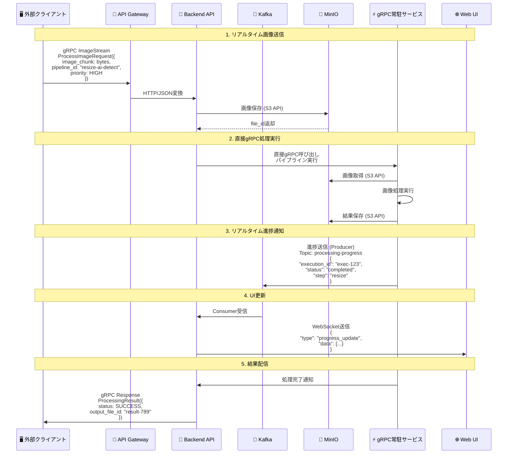
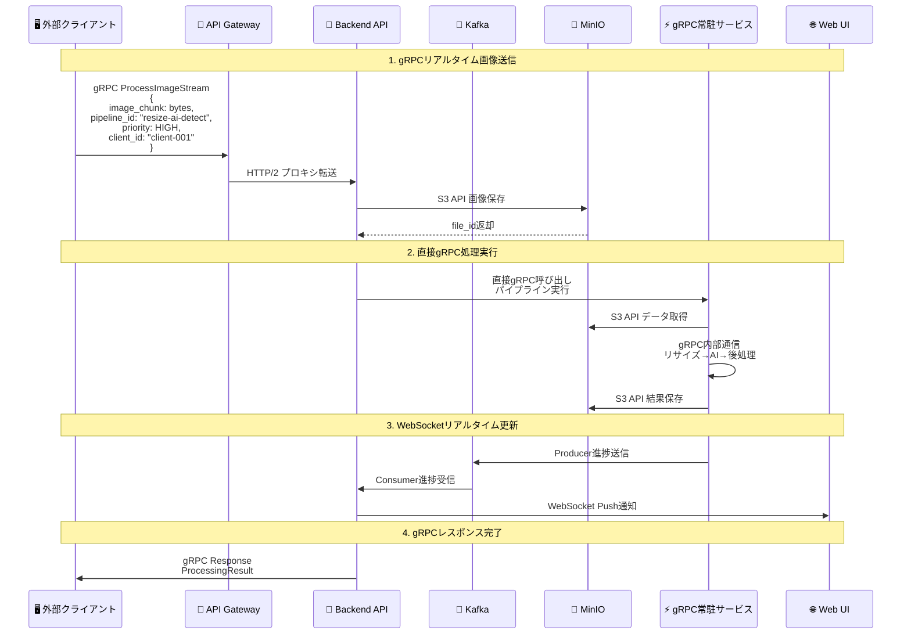

# ImageFlowCanvas API設計書

## **文書管理情報**

| 項目       | 内容                      |
| ---------- | ------------------------- |
| 文書名     | ImageFlowCanvas API設計書 |
| バージョン | 1.0                       |
| 作成日     | 2025年7月12日             |
| 更新日     | 2025年7月12日             |


---

## **5. API設計**

### **5.0. プロトコル設計**

#### **5.0.1. 詳細なデータフロー**



#### **5.0.2. gRPCプロトコル通信フロー**



#### **5.0.3. プロトコル最適化の選択基準**

| 🎯 用途・シナリオ         | 🚀 推奨プロトコル | ⚡ 性能特性                                                            | 📝 選択理由                            |
| :----------------------- | :--------------- | :-------------------------------------------------------------------- | :------------------------------------ |
| **リアルタイム画像処理** | gRPC             | • 低レイテンシ (50-100ms)<br/>• ストリーミング対応<br/>• バイナリ効率 | ライブ配信、監視カメラ、AR/VR用途     |
| **バッチ画像処理**       | REST API         | • 高信頼性<br/>• シンプル統合<br/>• HTTP標準                          | 一括処理、既存システム連携            |
| **システム間連携**       | Kafka            | • 高スループット<br/>• 順序保証<br/>• 耐障害性                        | マイクロサービス間の非同期通信        |
| **UI更新通知**           | WebSocket        | • 双方向通信<br/>• リアルタイム性<br/>• 低オーバーヘッド              | 進捗表示、監視ダッシュボード          |
| **データ永続化**         | S3 API           | • RESTful<br/>• 標準互換<br/>• 高可用性                               | MinIOとの連携、オブジェクトストレージ |
| **Pod間通信**            | gRPC             | • 型安全<br/>• 高性能<br/>• サービスメッシュ対応                      | マイクロサービス内部通信              |

#### **5.0.4. 画像送信プロトコルの詳細仕様**

##### **📨 Kafka経由の画像送信仕様**

```json
// Kafka Message Schema (JSON形式)
{
  "client_id": "string",           // クライアント識別子
  "correlation_id": "string",      // リクエスト追跡ID
  "image_data": "string",          // Base64エンコード画像データ
  "image_format": "jpeg|png|tiff", // 画像フォーマット
  "image_size_bytes": 1048576,     // 画像サイズ（バイト）
  "pipeline_config": {
    "pipeline_id": "string",
    "parameters": {},
    "priority": "high|normal|low"
  },
  "timestamp": "2025-07-12T10:30:00Z"
}
```

##### **🚀 gRPC画像送信仕様**

```protobuf
// image_processing.proto
syntax = "proto3";

service ImageProcessingService {
  // ストリーミング画像処理
  rpc ProcessImageStream(stream ImageChunk) returns (stream ProcessingResult);
  
  // 単発画像処理
  rpc ProcessSingleImage(ImageRequest) returns (ProcessingResponse);
}

message ImageChunk {
  string correlation_id = 1;
  bytes image_data = 2;
  int32 chunk_index = 3;
  int32 total_chunks = 4;
  bool is_final_chunk = 5;
  ImageMetadata metadata = 6;
}

message ImageMetadata {
  string format = 1;
  int32 width = 2;
  int32 height = 3;
  string client_id = 4;
  PipelineConfig pipeline_config = 5;
}

message PipelineConfig {
  string pipeline_id = 1;
  map<string, string> parameters = 2;
  Priority priority = 3;
}

enum Priority {
  LOW = 0;
  NORMAL = 1;
  HIGH = 2;
}
```

### **5.1. API アーキテクチャ**

#### **5.1.1. RESTful API設計**

**ベースURL**: `https://api.imageflowcanvas.com/v1`

**共通仕様**:
- プロトコル：HTTPS
- 認証：Bearer Token (JWT)
- コンテンツタイプ：`application/json`
- エラーフォーマット：RFC 7807準拠

#### **5.1.2. API エンドポイント一覧**

| カテゴリ       | エンドポイント            | メソッド | 用途                 |
| -------------- | ------------------------- | -------- | -------------------- |
| 認証           | `/auth/login`             | POST     | ログイン             |
| 認証           | `/auth/logout`            | POST     | ログアウト           |
| パイプライン   | `/pipelines`              | GET      | パイプライン一覧     |
| パイプライン   | `/pipelines`              | POST     | パイプライン作成     |
| パイプライン   | `/pipelines/{id}`         | GET      | パイプライン詳細     |
| パイプライン   | `/pipelines/{id}`         | PUT      | パイプライン更新     |
| パイプライン   | `/pipelines/{id}`         | DELETE   | パイプライン削除     |
| 実行           | `/executions`             | POST     | パイプライン実行     |
| 実行           | `/executions/{id}`        | GET      | 実行状況取得         |
| 実行           | `/executions/{id}/cancel` | POST     | 実行キャンセル       |
| コンポーネント | `/components`             | GET      | コンポーネント一覧   |
| コンポーネント | `/components/{id}`        | GET      | コンポーネント詳細   |
| ファイル       | `/files`                  | POST     | ファイルアップロード |
| ファイル       | `/files/{id}`             | GET      | ファイルダウンロード |

### **5.2. API詳細仕様**

#### **5.2.1. パイプライン実行API**

```yaml
# POST /v1/executions
requestBody:
  content:
    multipart/form-data:
      schema:
        type: object
        properties:
          pipeline_id:
            type: string
            format: uuid
            description: 実行するパイプラインのID
          input_files:
            type: array
            items:
              type: string
              format: binary
            description: 入力画像ファイル
          parameters:
            type: object
            description: 実行時パラメータ
            example:
              resize_width: 800
              ai_model: "yolo11"
              output_format: "jpeg"
          priority:
            type: string
            enum: [low, normal, high]
            default: normal

responses:
  '202':
    description: 実行要求受付
    content:
      application/json:
        schema:
          type: object
          properties:
            execution_id:
              type: string
              format: uuid
            status:
              type: string
              example: "pending"
            estimated_completion:
              type: string
              format: date-time
```

#### **5.2.2. 実行状況取得API**

```yaml
# GET /v1/executions/{execution_id}
responses:
  '200':
    description: 実行状況
    content:
      application/json:
        schema:
          type: object
          properties:
            execution_id:
              type: string
              format: uuid
            pipeline_id:
              type: string
              format: uuid
            status:
              type: string
              enum: [pending, running, completed, failed, cancelled]
            progress:
              type: object
              properties:
                current_step:
                  type: string
                total_steps:
                  type: integer
                completed_steps:
                  type: integer
                percentage:
                  type: number
                  format: float
            steps:
              type: array
              items:
                type: object
                properties:
                  component_name:
                    type: string
                  status:
                    type: string
                  started_at:
                    type: string
                    format: date-time
                  completed_at:
                    type: string
                    format: date-time
            output_files:
              type: array
              items:
                type: object
                properties:
                  file_id:
                    type: string
                    format: uuid
                  filename:
                    type: string
                  download_url:
                    type: string
```

### **5.3. gRPC API設計**

#### **5.3.1. リアルタイム画像処理**

```protobuf
syntax = "proto3";

package imageflow.v1;

service ImageProcessingService {
  // ストリーミング画像処理
  rpc ProcessImageStream(stream ImageChunk) returns (stream ProcessingResult);
  
  // 進捗監視
  rpc WatchExecution(WatchRequest) returns (stream ExecutionUpdate);
}

message ImageChunk {
  string correlation_id = 1;
  bytes data = 2;
  int32 chunk_index = 3;
  int32 total_chunks = 4;
  bool is_final = 5;
  ImageMetadata metadata = 6;
}

message ImageMetadata {
  string format = 1;          // jpeg, png, tiff
  int32 width = 2;
  int32 height = 3;
  int64 file_size = 4;
  PipelineConfig pipeline = 5;
}

message PipelineConfig {
  string pipeline_id = 1;
  map<string, string> parameters = 2;
  Priority priority = 3;
}

enum Priority {
  PRIORITY_LOW = 0;
  PRIORITY_NORMAL = 1;
  PRIORITY_HIGH = 2;
}

message ProcessingResult {
  string execution_id = 1;
  Status status = 2;
  repeated OutputFile output_files = 3;
  string error_message = 4;
}

enum Status {
  STATUS_PENDING = 0;
  STATUS_RUNNING = 1;
  STATUS_COMPLETED = 2;
  STATUS_FAILED = 3;
}

message OutputFile {
  string file_id = 1;
  string filename = 2;
  string download_url = 3;
  int64 file_size = 4;
}
```

### **5.4. WebSocket API設計**

#### **5.4.1. リアルタイム進捗通知**

```typescript
// WebSocket接続：wss://api.imageflowcanvas.com/v1/ws

// 認証メッセージ
interface AuthMessage {
  type: 'auth';
  token: string;
}

// 実行監視開始
interface WatchMessage {
  type: 'watch';
  execution_id: string;
}

// 進捗通知
interface ProgressMessage {
  type: 'progress';
  execution_id: string;
  data: {
    status: 'pending' | 'running' | 'completed' | 'failed';
    current_step: string;
    progress_percentage: number;
    step_details: {
      component_name: string;
      status: string;
      started_at?: string;
      completed_at?: string;
      resource_usage?: {
        cpu_usage: number;
        memory_usage: number;
        gpu_usage?: number;
      };
    }[];
  };
}

// エラー通知
interface ErrorMessage {
  type: 'error';
  execution_id: string;
  error: {
    code: string;
    message: string;
    details?: any;
  };
}
```

---

## **関連文書**

- [概要設計](./0300_概要設計.md)
- [データベース設計](./0303_データベース設計.md)
- [セキュリティ設計](./0306_セキュリティ設計.md)
