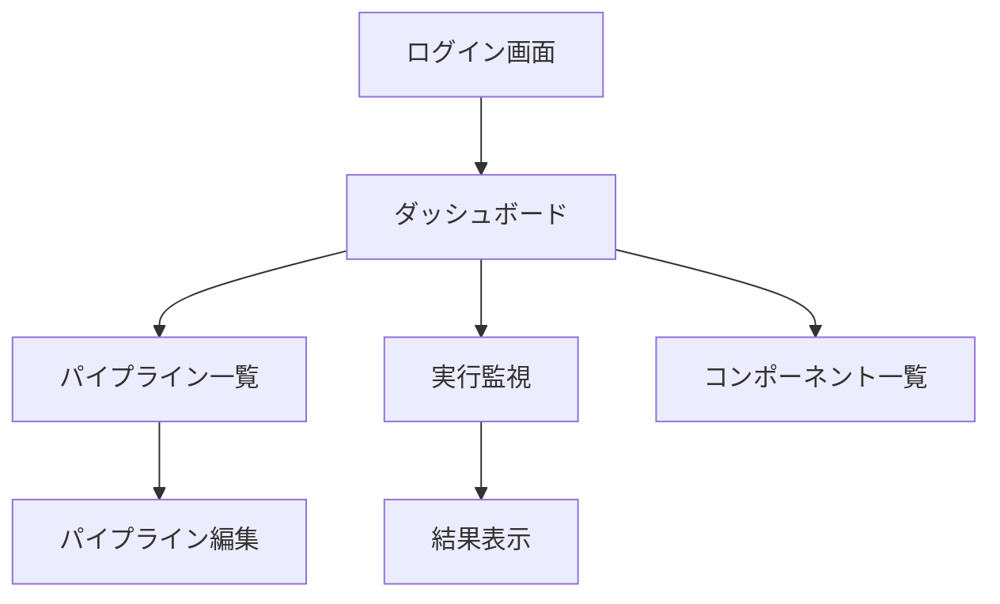

# ImageFlowCanvas UI/UX設計書

## **文書管理情報**

| 項目       | 内容                        |
| ---------- | --------------------------- |
| 文書名     | ImageFlowCanvas UI/UX設計書 |
| バージョン | 1.0                         |
| 作成日     | 2025年7月12日               |
| 更新日     | 2025年7月12日               |


---

## **6. UI/UX設計**

### **6.1. UI コンポーネント設計**

#### **6.1.1. 画面構成**



#### **6.1.2. 主要画面仕様**

| 画面名           | 機能                   | UI要素                                                                    |
| ---------------- | ---------------------- | ------------------------------------------------------------------------- |
| ダッシュボード   | システム状況表示       | ・実行中パイプライン数<br/>・リソース使用状況<br/>・最近の実行履歴        |
| パイプライン編集 | 視覚的パイプライン構築 | ・コンポーネントパレット<br/>・ドラッグ&ドロップエディタ<br/>・接続線描画 |
| 実行監視         | リアルタイム進捗表示   | ・進捗バー<br/>・ステップ状況<br/>・ログストリーミング                    |
| 結果表示         | 処理結果確認           | ・画像ビューア<br/>・Before/After比較<br/>・メタデータ表示                |

### **6.2. パイプライン編集画面詳細**

#### **6.2.1. コンポーネントパレット**

```typescript
interface ComponentPalette {
  categories: ComponentCategory[];
}

interface ComponentCategory {
  name: string;
  icon: string;
  components: Component[];
}

interface Component {
  id: string;
  name: string;
  description: string;
  icon: string;
  inputPorts: Port[];
  outputPorts: Port[];
  parameters: Parameter[];
  resourceRequirements: ResourceRequirements;
}

interface Port {
  name: string;
  dataType: 'image' | 'metadata' | 'array';
  required: boolean;
}

interface Parameter {
  name: string;
  type: 'string' | 'number' | 'boolean' | 'select';
  defaultValue: any;
  validation?: {
    min?: number;
    max?: number;
    options?: string[];
  };
}
```

#### **6.2.2. ビジュアルエディタ**

```typescript
interface PipelineEditor {
  canvas: {
    width: number;
    height: number;
    zoom: number;
    panX: number;
    panY: number;
  };
  nodes: PipelineNode[];
  connections: Connection[];
  selectedNodes: string[];
  clipboard: ClipboardData;
}

interface PipelineNode {
  id: string;
  componentId: string;
  position: { x: number; y: number };
  parameters: Record<string, any>;
  customName?: string;
}

interface Connection {
  id: string;
  sourceNodeId: string;
  sourcePort: string;
  targetNodeId: string;
  targetPort: string;
}
```

### **6.3. 実行監視画面詳細**

#### **6.3.1. 進捗表示コンポーネント**

```typescript
interface ExecutionMonitor {
  execution: {
    id: string;
    pipelineName: string;
    status: ExecutionStatus;
    startTime: Date;
    estimatedCompletion?: Date;
    progress: {
      percentage: number;
      currentStep: string;
      totalSteps: number;
      completedSteps: number;
    };
  };
  steps: ExecutionStep[];
  realTimeUpdates: boolean;
}

interface ExecutionStep {
  componentName: string;
  status: 'pending' | 'running' | 'completed' | 'failed';
  startTime?: Date;
  endTime?: Date;
  duration?: number;
  resourceUsage?: {
    cpu: number;
    memory: number;
    gpu?: number;
  };
  logs: LogEntry[];
}

interface LogEntry {
  timestamp: Date;
  level: 'info' | 'warn' | 'error';
  message: string;
}
```

### **6.4. 検査機能UI設計**

#### **6.4.1. 検査管理ダッシュボード**

```typescript
interface InspectionDashboard {
  summaryCards: {
    todayInspections: number;
    okRate: number;
    ngCount: number;
    avgProcessingTime: number;
  };
  
  realtimeChart: {
    timeRange: '1h' | '6h' | '24h';
    data: {
      timestamp: Date;
      inspectionCount: number;
      okRate: number;
    }[];
  };
  
  defectTrendChart: {
    period: 'week' | 'month' | 'quarter';
    data: {
      defectType: string;
      count: number;
      trend: 'up' | 'down' | 'stable';
    }[];
  };
  
  recentAlerts: Alert[];
}

interface Alert {
  id: string;
  type: 'defect_detected' | 'threshold_exceeded' | 'system_error';
  severity: 'low' | 'medium' | 'high' | 'critical';
  message: string;
  timestamp: Date;
  acknowledged: boolean;
}
```

#### **6.4.2. 検査マスタ管理画面**

```typescript
interface InspectionMasterUI {
  targetList: {
    items: InspectionTarget[];
    pagination: Pagination;
    filters: {
      productCode: string;
      dateRange: DateRange;
      status: string;
    };
    actions: {
      create: () => void;
      edit: (id: string) => void;
      delete: (id: string) => void;
      export: () => void;
    };
  };
  
  targetDetail: {
    target: InspectionTarget;
    items: InspectionItem[];
    itemActions: {
      addItem: () => void;
      editItem: (id: string) => void;
      reorderItems: (items: InspectionItem[]) => void;
    };
  };
  
  itemEditor: {
    form: InspectionItemForm;
    criteriaEditor: CriteriaEditor;
    previewSection: PreviewSection;
  };
}

interface InspectionItemForm {
  itemCode: string;
  itemName: string;
  inspectionType: 'VISUAL' | 'DIMENSION' | 'FUNCTION' | 'TEXT';
  aiEnabled: boolean;
  required: boolean;
  orderSequence: number;
  description: string;
}

interface CriteriaEditor {
  type: 'OK_NG' | 'NUMERIC_RANGE' | 'COLOR_MATCH' | 'TEXT_PATTERN';
  thresholds: {
    okThreshold?: number;
    ngThreshold?: number;
    tolerance?: number;
    unit?: string;
    colorReference?: string;
    textPattern?: string;
  };
}
```

#### **6.4.3. 検査実行監視画面**

```typescript
interface InspectionMonitorUI {
  activeInspections: {
    list: ActiveInspection[];
    refreshInterval: number;
    filters: {
      inspector: string;
      location: string;
      status: string;
    };
  };
  
  inspectionDetail: {
    execution: InspectionExecution;
    progress: {
      currentItem: number;
      totalItems: number;
      percentage: number;
      estimatedTimeRemaining: number;
    };
    
    itemsStatus: {
      item: InspectionItem;
      status: 'pending' | 'in_progress' | 'ai_completed' | 'human_review' | 'completed';
      aiResult?: AIInspectionResult;
      humanReview?: HumanReview;
      processingTime?: number;
    }[];
    
    liveUpdates: boolean;
  };
  
  imageViewer: {
    originalImage: string;
    aiAnnotations: {
      boundingBoxes: BoundingBox[];
      heatmap?: string;
      defectMarkers: DefectMarker[];
    };
    
    viewerControls: {
      zoom: number;
      pan: { x: number; y: number };
      annotations: boolean;
      comparison: boolean;
    };
  };
}

interface ActiveInspection {
  executionId: string;
  productName: string;
  inspectorName: string;
  location: string;
  status: string;
  startedAt: Date;
  currentItem: string;
  progress: number;
}

interface DefectMarker {
  x: number;
  y: number;
  type: string;
  severity: 'low' | 'medium' | 'high';
  confidence: number;
  description: string;
}
```

#### **6.4.4. 検査結果分析画面**

```typescript
interface InspectionAnalyticsUI {
  filterPanel: {
    dateRange: DateRange;
    inspectors: string[];
    products: string[];
    locations: string[];
    judgments: ('OK' | 'NG')[];
  };
  
  summaryMetrics: {
    totalInspections: number;
    okRate: number;
    avgProcessingTime: number;
    aiAccuracy: number;
    topDefects: {
      type: string;
      count: number;
      trend: number;
    }[];
  };
  
  charts: {
    timeSeriesChart: {
      type: 'line' | 'bar';
      metric: 'count' | 'ok_rate' | 'processing_time';
      granularity: 'hour' | 'day' | 'week' | 'month';
      data: ChartDataPoint[];
    };
    
    defectDistribution: {
      type: 'pie' | 'donut';
      data: {
        defectType: string;
        count: number;
        percentage: number;
      }[];
    };
    
    inspectorPerformance: {
      type: 'table' | 'bar';
      data: {
        inspectorName: string;
        inspectionCount: number;
        okRate: number;
        avgTime: number;
        accuracy: number;
      }[];
    };
  };
  
  exportOptions: {
    format: 'pdf' | 'excel' | 'csv';
    includeCharts: boolean;
    includeRawData: boolean;
    emailRecipients: string[];
  };
}
```

#### **6.4.5. モバイルアプリUI設計特記事項**

```typescript
// モバイル特有のUI要件
interface MobileUIRequirements {
  touchTargets: {
    minimumSize: '44px'; // iOS Human Interface Guidelines
    spacing: '8px';
    hitArea: 'expanded';
  };
  
  navigation: {
    type: 'bottom-tabs' | 'stack' | 'drawer';
    backButton: 'hardware' | 'software';
    gestureNavigation: boolean;
  };
  
  cameraInterface: {
    viewfinder: {
      aspectRatio: '4:3' | '16:9' | 'square';
      gridLines: boolean;
      focusIndicator: boolean;
    };
    
    controls: {
      captureButton: {
        size: '80px';
        position: 'center-bottom';
        hapticFeedback: boolean;
      };
      
      flashToggle: {
        position: 'top-right';
        states: ['auto', 'on', 'off'];
      };
      
      settingsButton: {
        position: 'top-left';
        quickAccess: ['quality', 'resolution', 'timer'];
      };
    };
  };
  
  offlineIndicator: {
    position: 'top-center';
    style: 'banner' | 'badge';
    animation: 'pulse' | 'fade';
    syncProgress: boolean;
  };
  
  progressIndicators: {
    type: 'linear' | 'circular' | 'step';
    showPercentage: boolean;
    showTimeRemaining: boolean;
    allowCancel: boolean;
  };
}
```

### **6.5. レスポンシブデザイン**

#### **6.5.1. ブレークポイント**

| デバイス | 幅             | レイアウト            | 検査機能対応                 |
| -------- | -------------- | --------------------- | ---------------------------- |
| Mobile   | < 768px        | 単一カラム、簡略表示  | モバイル検査アプリ専用UI     |
| Tablet   | 768px - 1024px | 2カラム、タッチ最適化 | 検査監視、タブレット検査対応 |
| Desktop  | > 1024px       | 3カラム、フル機能     | 管理機能、分析ダッシュボード |

#### **6.5.2. アクセシビリティ**

- WCAG 2.1 AA準拠
- キーボードナビゲーション対応
- スクリーンリーダー対応
- 高コントラストモード
- **現場作業環境対応**：
  - 手袋着用時の操作性
  - 明るい環境での視認性
  - 大きなタッチターゲット
  - 音声フィードバック対応

---

## **関連文書**

- [概要設計](./0300_概要設計.md)
- [API設計](./0304_API設計.md)
