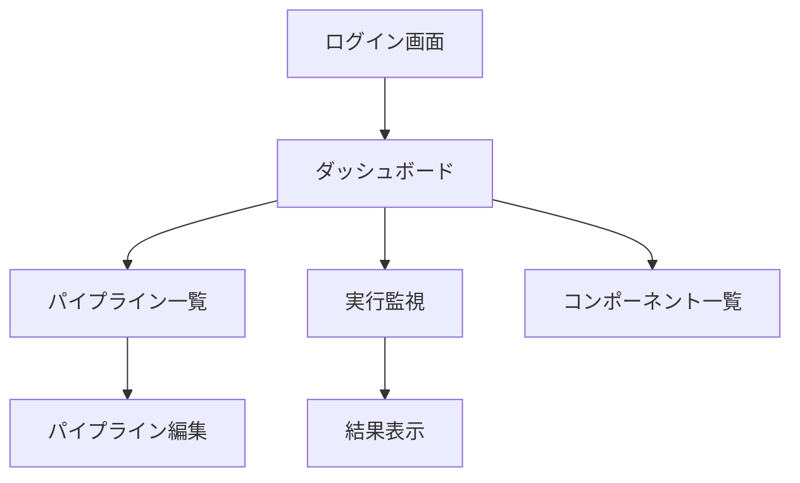

# ImageFlowCanvas UI/UX設計書

## **文書管理情報**

| 項目       | 内容                        |
| ---------- | --------------------------- |
| 文書名     | ImageFlowCanvas UI/UX設計書 |
| バージョン | 1.0                         |
| 作成日     | 2025年7月12日               |
| 更新日     | 2025年7月12日               |
| 作成者     | Daiichiro Noda              |

---

## **6. UI/UX設計**

### **6.1. UI コンポーネント設計**

#### **6.1.1. 画面構成**



#### **6.1.2. 主要画面仕様**

| 画面名           | 機能                   | UI要素                                                                    |
| ---------------- | ---------------------- | ------------------------------------------------------------------------- |
| ダッシュボード   | システム状況表示       | ・実行中パイプライン数<br/>・リソース使用状況<br/>・最近の実行履歴        |
| パイプライン編集 | 視覚的パイプライン構築 | ・コンポーネントパレット<br/>・ドラッグ&ドロップエディタ<br/>・接続線描画 |
| 実行監視         | リアルタイム進捗表示   | ・進捗バー<br/>・ステップ状況<br/>・ログストリーミング                    |
| 結果表示         | 処理結果確認           | ・画像ビューア<br/>・Before/After比較<br/>・メタデータ表示                |

### **6.2. パイプライン編集画面詳細**

#### **6.2.1. コンポーネントパレット**

```typescript
interface ComponentPalette {
  categories: ComponentCategory[];
}

interface ComponentCategory {
  name: string;
  icon: string;
  components: Component[];
}

interface Component {
  id: string;
  name: string;
  description: string;
  icon: string;
  inputPorts: Port[];
  outputPorts: Port[];
  parameters: Parameter[];
  resourceRequirements: ResourceRequirements;
}

interface Port {
  name: string;
  dataType: 'image' | 'metadata' | 'array';
  required: boolean;
}

interface Parameter {
  name: string;
  type: 'string' | 'number' | 'boolean' | 'select';
  defaultValue: any;
  validation?: {
    min?: number;
    max?: number;
    options?: string[];
  };
}
```

#### **6.2.2. ビジュアルエディタ**

```typescript
interface PipelineEditor {
  canvas: {
    width: number;
    height: number;
    zoom: number;
    panX: number;
    panY: number;
  };
  nodes: PipelineNode[];
  connections: Connection[];
  selectedNodes: string[];
  clipboard: ClipboardData;
}

interface PipelineNode {
  id: string;
  componentId: string;
  position: { x: number; y: number };
  parameters: Record<string, any>;
  customName?: string;
}

interface Connection {
  id: string;
  sourceNodeId: string;
  sourcePort: string;
  targetNodeId: string;
  targetPort: string;
}
```

### **6.3. 実行監視画面詳細**

#### **6.3.1. 進捗表示コンポーネント**

```typescript
interface ExecutionMonitor {
  execution: {
    id: string;
    pipelineName: string;
    status: ExecutionStatus;
    startTime: Date;
    estimatedCompletion?: Date;
    progress: {
      percentage: number;
      currentStep: string;
      totalSteps: number;
      completedSteps: number;
    };
  };
  steps: ExecutionStep[];
  realTimeUpdates: boolean;
}

interface ExecutionStep {
  componentName: string;
  status: 'pending' | 'running' | 'completed' | 'failed';
  startTime?: Date;
  endTime?: Date;
  duration?: number;
  resourceUsage?: {
    cpu: number;
    memory: number;
    gpu?: number;
  };
  logs: LogEntry[];
}

interface LogEntry {
  timestamp: Date;
  level: 'info' | 'warn' | 'error';
  message: string;
}
```

### **6.4. レスポンシブデザイン**

#### **6.4.1. ブレークポイント**

| デバイス | 幅             | レイアウト            |
| -------- | -------------- | --------------------- |
| Mobile   | < 768px        | 単一カラム、簡略表示  |
| Tablet   | 768px - 1024px | 2カラム、タッチ最適化 |
| Desktop  | > 1024px       | 3カラム、フル機能     |

#### **6.4.2. アクセシビリティ**

- WCAG 2.1 AA準拠
- キーボードナビゲーション対応
- スクリーンリーダー対応
- 高コントラストモード

---

## **関連文書**

- [概要設計](./0300_概要設計.md)
- [API設計](./0304_API設計.md)
