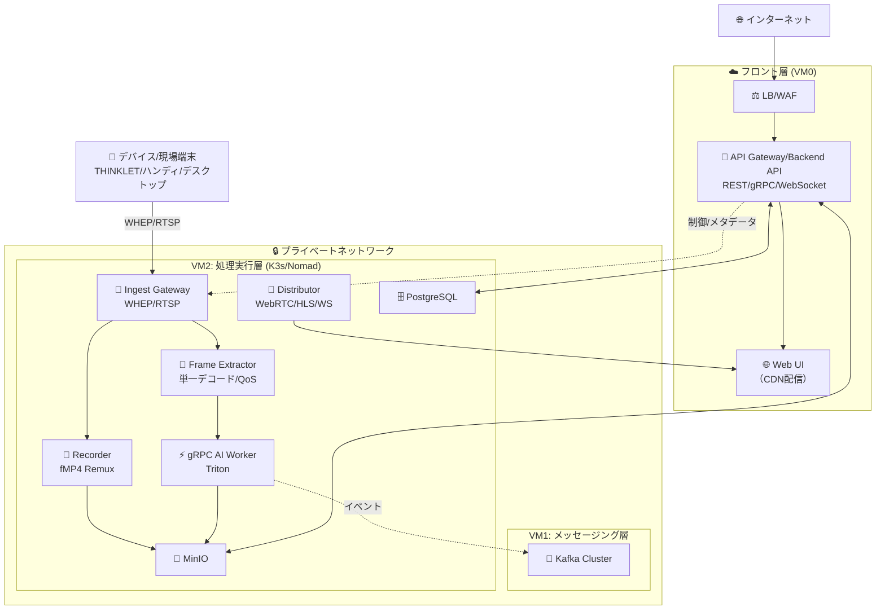
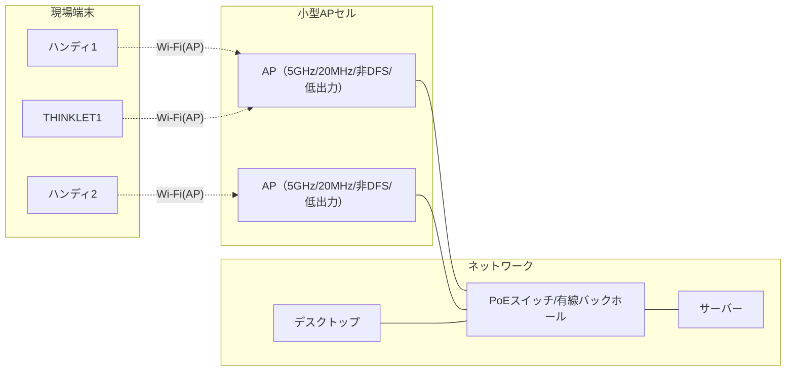

# ImageFlowCanvas インフラ設計書

# **文書管理情報**

| 項目       | 内容                           |
| ---------- | ------------------------------ |
| 文書名     | ImageFlowCanvas インフラ設計書 |
| バージョン | 1.3                            |
| 作成日     | 2025年7月12日                  |
| 更新日     | 2025年8月13日                  |

---

# 1. インフラ設計

## 1.1. ホスティング場所とデプロイメント戦略

### 1.1.1. VM0: エッジ・ゲートウェイ（フロント層）

| 🔧 コンポーネント                        | 📍 推奨ホスティング場所                                                   | ⚙️ デプロイ方法          | 🎯 用途・特徴                                                                                      |
| :-------------------------------------- | :----------------------------------------------------------------------- | :---------------------- | :------------------------------------------------------------------------------------------------ |
| **⚖️ LB / WAF**                          | クラウドLB + WAF（例: AWS ALB+WAF, Cloudflare）                          | マネージド              | • SSL終端・WAF・DDoS保護                                                                          |
| **🚪 API Gateway/Backend API（司令塔）** | AWS ECS/GKE または オンプレミス Docker                           | FastAPI Container       | • REST/gRPC/WebSocket 集約 • パイプライン制御 • 認証・認可 • Kafka 連携（疎結合通知） |
| **🌐 Web UI**                            | AWS S3+CloudFront Azure Static Web Apps または nginx静的配信 | React Build CDN配信 | • SPA (管理画面/ダッシュボード) • キャッシュ・配信最適化                                      |

### 1.1.2. VM1: 専用メッセージングサーバー (メッセージング層)

| 🔧 コンポーネント    | 📍 推奨ホスティング場所                           | ⚙️ デプロイ方法                      | 🎯 用途・特徴                                                         |
| :------------------ | :----------------------------------------------- | :---------------------------------- | :------------------------------------------------------------------- |
| **📨 Apache Kafka**  | 専用物理サーバー AWS MSK Confluent Cloud | Kafka Cluster (3ノード構成推奨) | • 高スループット • メッセージ永続化 • パーティション並列処理 |
| **🔗 Kafka Connect** | Kafka同居サーバー                                | Docker Container                    | • MinIO連携 • ストリーム処理 • データパイプライン            |

### 1.1.3. VM2: 高性能コンピューティング（処理層）

| 🔧 コンポーネント               | 📍 推奨ホスティング場所                                       | ⚙️ デプロイ方法         | 🎯 用途・特徴                                                       |
| :----------------------------- | :----------------------------------------------------------- | :--------------------- | :----------------------------------------------------------------- |
| **☸️ K3s/Nomad Cluster**        | GPU搭載物理サーバー AWS EC2 G4/P3 GCP Compute Engine | K3s Multi-node / Nomad | • GPU/CPU混在環境 • 自動スケーリング • リソース効率化      |
| **🎥 Ingest Gateway**           | K3s/Nomad内部                                                | Kubernetes Deployment  | • WHEP/WebRTC（代替: RTSP）インジェスト • 認証・セッション管理 |
| **📼 Recorder**                 | K3s/Nomad内部                                                | Kubernetes Deployment  | • 再エンコードなしのRemux→fMP4セグメント化 • ロールリング録画  |
| **🧩 Frame Extractor**          | K3s/Nomad内部                                                | Kubernetes Deployment  | • 単一デコード原則でフレーム抽出・サンプリング • QoS制御       |
| **⚡ gRPC AI Worker（Triton）** | K3s/Nomad内部                                                | Kubernetes Deployment  | • gRPCストリーミング推論 • モデル管理（Triton）                |
| **📡 Distributor**              | K3s/Nomad内部                                                | Kubernetes Deployment  | • WebRTC/HLS/WebSocket 配信                                        |
| **💾 MinIO**                    | 高速SSD/NVMeストレージ                                       | K3s StatefulSet        | • 画像/動画のオブジェクト永続化（S3互換）                          |
| **🗄️ PostgreSQL**               | K3s/Nomad内部（または専用VM）                                | K3s StatefulSet        | • メタデータ/検査結果/製品情報のRDBMS（ACID）                      |

### 1.1.4. ネットワーク構成とセキュリティ

### 1.1.5. リソース要件と推奨スペック

| 🖥️ サーバー      | 💻 推奨スペック        | 💾 ストレージ | 🌐 ネットワーク | 💰 推定コスト/月 |
| :-------------- | :-------------------- | :----------- | :------------- | :-------------- |
| VM0 (エッジ)    | 4vCPU, 8GB RAM        | 100GB SSD    | 1Gbps          | $100-200        |
| VM1 (Kafka)     | 8vCPU, 16GB RAM       | 500GB SSD    | 10Gbps         | $200-400        |
| VM2 (K3s/Nomad) | 16vCPU, 64GB RAM, GPU | 1TB NVMe SSD | 10Gbps         | $800-1500       |

### 1.1.6. デプロイメント戦略

1. **段階的デプロイ**: VM0 → VM1 → VM2の順序でデプロイ
2. **Blue-Green デプロイ**: 本番環境でのゼロダウンタイム更新
3. **カナリアリリース**: 新機能の段階的展開
4. **GitOps**: Git リポジトリを真実の源とした自動デプロイ

補足: デプロイ・監視方針は「0306_運用監視設計.md」に準拠（SLO/アラート・ダッシュボードの整合）。

---

## 1.2. 構成要素と他設計書の整合性マッピング

| コンポーネント                      | 本書での配置     | 関連設計書                                | 整合ポイント                                 |
| ----------------------------------- | ---------------- | ----------------------------------------- | -------------------------------------------- |
| API Gateway/Backend API（司令塔）   | VM0              | 0300 基本設計, 0302 Backend設計, 0304 API | REST/gRPC/WS 集約、司令塔パターン、認証/認可 |
| Ingest Gateway（WHEP/RTSP）         | VM2（K3s/Nomad） | 0300 基本設計, 0302 Backend設計           | 単一路インジェスト、セッション管理           |
| Recorder（Remux/Segment）           | VM2（K3s/Nomad） | 0300 基本設計, 0302 Backend設計           | 再エンコード無しfMP4、ロールリング           |
| Frame Extractor（単一デコード/QoS） | VM2（K3s/Nomad） | 0300 基本設計, 0302 Backend設計           | 単一デコード原則、QoS制御、gRPC投入          |
| gRPC AI Worker（Triton）            | VM2（K3s/Nomad） | 0300 基本設計, 0302 Backend設計           | gRPCストリーミング推論、モデル管理           |
| Distributor（WebRTC/HLS/WebSocket） | VM2（K3s/Nomad） | 0300 基本設計, 0302 Backend設計           | 視聴配信パス、低遅延配信                     |
| MinIO（オブジェクトストレージ）     | VM2（K3s/Nomad） | 0300 基本設計, 0303 DB設計                | 画像/動画/成果物保存                         |
| PostgreSQL（RDBMS）                 | VM2（K3s/Nomad） | 0300 基本設計, 0303 DB設計                | メタデータ・結果・製品情報の永続化           |
| Kafka（イベントバス）               | VM1              | 0300 基本設計, 0302 Backend設計           | 疎結合通知、進捗配信、イベントドリブン       |

---

---

## 1.3. 現場ネットワーク設計（小型AP＋有線バックホール）

本システムの現場（工場・ライン）における無線方式は、「小型AP（5GHz/20MHz/非DFS/低出力）＋有線バックホール」に統一する。端末増加や移動時の電波干渉・ローミング課題を、設計と運用で安定的に解決することを目的とする。

### 1.3.1. 運用ポリシー
- 周波数/帯域幅: 5GHz固定・20MHzチャネル幅・非DFSチャネル
- 電力設計: 低出力（小セル化）でセル境界を明確化
- バックホール: すべて有線（ギガビット以上、PoE推奨）
- SSID設計: 全APで共通SSID/セキュリティを統一
- 運用: チャネル計画・出力チューニング・ローミング最適化（設計で吸収）

### 1.3.2. 規模別設計の目安
| 端末数  | 小型APセル設計                           | 備考                            |
| ------- | ---------------------------------------- | ------------------------------- |
| 1台     | 単一セルで十分                           | 干渉少、最小構成                |
| 2-4台   | 2-3セルに分割、チャネル固定              | 20MHz幅で同時通信の安定確保     |
| 5台以上 | 小セル多数＋有線BH、同一SSIDでローミング | セル再利用で面積/台数に線形対応 |

### 1.3.3. コスト・運用比較（参考）

| 方式                             | 初期投資                             | 拡張性                          | 干渉/混線対策                            | ローミング                         | 運用・保守                | 主なリスク/補足                                | セキュリティ要件                           | 導入期間                     | 総保有コスト（TCO）                            |
| -------------------------------- | ------------------------------------ | ------------------------------- | ---------------------------------------- | ---------------------------------- | ------------------------- | ---------------------------------------------- | ------------------------------------------ | ---------------------------- | ---------------------------------------------- |
| 小型AP＋有線バックホール（推奨） | 低〜中（小型AP/PoEスイッチ段階導入） | 高（セル追加で面積/台数に線形） | 非DFS/20MHz/低出力＋チャネル計画で抑制   | 良（同一SSID、802.11k/v/r対応時◎） | 一元管理・監視が容易      | 現地サイトサーベイ/出力調整が必要              | 中〜高（WPA2/WPA3、VLAN/802.1Xで高水準可） | 短〜中（現地調査・配線含む） | 低〜中（段階投資・運用容易で抑制）             |
| エンタープライズAP集中設計       | 中〜高（高性能AP/コントローラ導入）  | 中（高密度ではセル設計が前提）  | 大出力はセル肥大で干渉増の懸念、設計次第 | 中（機種/設定依存）                | 専任スキル/保守契約が前提 | 金属反射/DFS制約、費用対効果が環境依存         | 高（802.1X/RADIUS、NAC、集中管理）         | 中（設計/調整/ベンダ調整）   | 中〜高（保守・ライセンス・専任要員が前提）     |
| SoftAP（PC/端末AP化）            | 低（既存機器で開始可）               | 低（同時接続/安定性に限界）     | 低（端末AP乱立で干渉しやすい）           | なし（基本固定接続）               | 端末個別設定で運用負荷高  | セキュリティ/電波安定性/省電力に課題           | 低（PSK中心、端末設定依存・統制困難）      | 短（即日開始可）             | 低（初期低コストだが運用負荷で隠れコスト発生） |
| ローカル5G（プライベート5G）     | 非常に高（免許/設備/設計/端末調達）  | 高（大規模/専用帯域で拡張容易） | 非常に高（専用帯域で干渉少）             | 良（基地局設計次第）               | 高（専門要員/維持費が大） | 導入期間長/端末エコシステム/継続コストが大きい | 非常に高（SIM/eSIM、閉域、厳格な端末認証） | 長（免許取得〜本設まで）     | 非常に高（設備維持・ライセンス・人件費）       |
| Wi‑Fi Directブリッジ方式         | 低〜中（デスクトップPC追加/設定）    | 低〜中（PC台数/接続上限に依存） | 低（P2P混在で抑制困難）                  | 悪（切断→再接続が前提）            | PC/ドライバ管理の運用負荷 | 切替遅延/安定性課題、台数増で複雑性/負荷が増大 | 低〜中（P2P中心、経路統制/監視が弱い）     | 短（PC設定で導入）           | 中（台数増で運用負荷・障害対応コストが増大）   |

### 1.3.4. 想定ネットワーク構成

### 1.3.5. ローミング・干渉対策（設計指針）
- チャネル計画: 2.4GHzは原則不使用、5GHzの非DFS（36/40/44/48, 149/153/157/161）を固定割当
- 出力最適化: セルオーバーラップは−65〜−70 dBm程度で収束するよう低出力運用
- ローミング誘導: 最低接続RSSI（例: −70 dBm）を閾値に端末側で再探索、同一SSIDで切替
- 機能活用（対応時）: 802.11k/v/r, band steering, minimum RSSI enforce
- アプリ側吸収: 一時的な電波劣化時は送信キューイングと再送、継続セッションでUX維持

### 1.3.6. 運用手順（接続・ローミング）
1. SSID/セキュリティ統一（WPA2/WPA3、可能ならEnterprise）
2. 非DFSチャネル固定（5GHz、20MHz幅）
3. 低出力設定で小セル化（セル境界で−65〜−70 dBm）
4. 端末は同一SSIDへ接続し、最低RSSI閾値を下回ったら再探索
5. 有線バックホール（PoE/GbE）でサーバー・デスクトップと接続

ローミング時の処理
- セッション維持: 同一SSID＋アプリ層の再送/キューイングでUX維持
- 切替時間の最小化: 端末/APが対応する場合は 802.11k/v/r を有効化
- データ保護: 一時バッファリング（録画セグメントのリングバッファ、protectedタグ除外）と再試行ポリシー（指数バックオフ）
- 自動復旧: RSSI回復・再接続時に未送信データを優先度別（高→通常→低）に送出、差分転送・ETag照合で再開

### 1.3.7. 段階的導入アプローチ
| フェーズ | 実装内容                          | 効果                               |
| -------- | --------------------------------- | ---------------------------------- |
| 1        | 単一APで試験導入                  | 基本通信/スループットの実測確認    |
| 2        | 2-3セル分割＋チャネル固定         | 同時接続時の干渉低減・安定化       |
| 3        | 小セル多数化＋有線バックホール    | 面積拡大/端末増に線形拡張          |
| 4        | 監視/最適化（出力調整・ログ分析） | ローミング安定・混線時の迅速な是正 |
