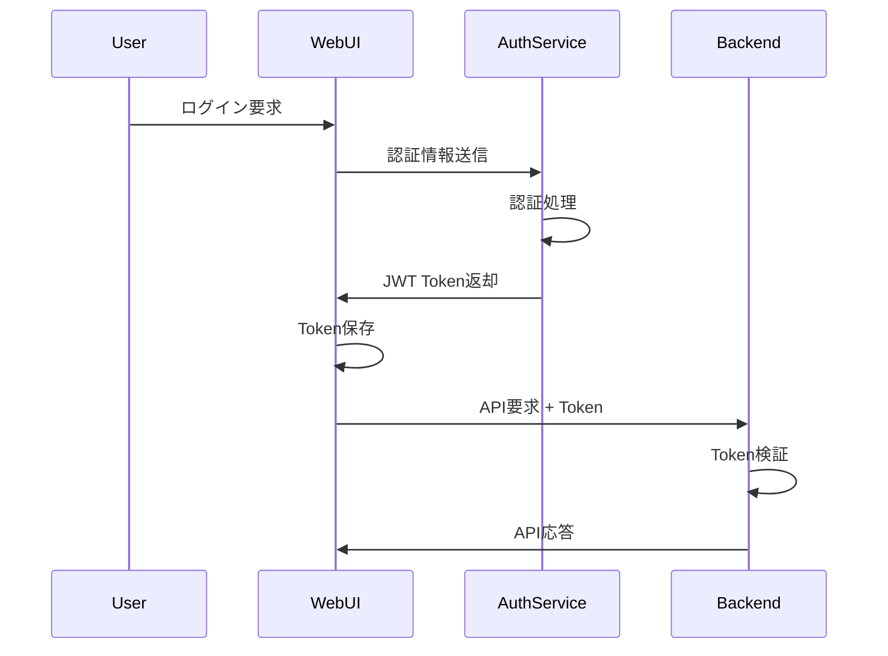

# ImageFlowCanvas セキュリティ設計書

## **文書管理情報**

| 項目       | 内容                               |
| ---------- | ---------------------------------- |
| 文書名     | ImageFlowCanvas セキュリティ設計書 |
| バージョン | 1.0                                |
| 作成日     | 2025年7月12日                      |
| 更新日     | 2025年7月12日                      |


---

## **7. セキュリティ設計**

### **7.1. 認証・認可**

#### **7.1.1. 認証方式**



#### **7.1.2. 認可制御（RBAC）**

```sql
-- ロール定義
CREATE TABLE roles (
    id UUID PRIMARY KEY,
    name VARCHAR(100) NOT NULL UNIQUE,
    description TEXT
);

-- ユーザーロール関連
CREATE TABLE user_roles (
    user_id UUID REFERENCES users(id),
    role_id UUID REFERENCES roles(id),
    granted_at TIMESTAMP DEFAULT NOW(),
    granted_by UUID REFERENCES users(id),
    PRIMARY KEY (user_id, role_id)
);

-- 権限定義
CREATE TABLE permissions (
    id UUID PRIMARY KEY,
    resource VARCHAR(100) NOT NULL,  -- pipeline, component, execution
    action VARCHAR(50) NOT NULL,     -- create, read, update, delete, execute
    condition JSONB                  -- 条件（自分が作成したもののみ等）
);

-- ロール権限関連
CREATE TABLE role_permissions (
    role_id UUID REFERENCES roles(id),
    permission_id UUID REFERENCES permissions(id),
    PRIMARY KEY (role_id, permission_id)
);
```

**標準ロール定義：**

| ロール            | 権限                   | 用途           |
| ----------------- | ---------------------- | -------------- |
| admin             | 全操作                 | システム管理者 |
| pipeline_creator  | パイプライン作成・実行 | 開発者         |
| pipeline_operator | パイプライン実行のみ   | オペレーター   |
| viewer            | 読み取りのみ           | 閲覧者         |

### **7.2. データ保護**

#### **7.2.1. 暗号化**

| 対象       | 方式           | 用途                |
| ---------- | -------------- | ------------------- |
| 通信       | TLS 1.3        | HTTPS/gRPC          |
| 保存データ | AES-256        | MinIO暗号化         |
| 機密情報   | Secret Manager | パスワード・APIキー |
| Token      | RS256          | JWT署名             |

#### **7.2.2. データアクセス制御**

```yaml
# MinIO Bucket Policy例
{
  "Version": "2012-10-17",
  "Statement": [
    {
      "Effect": "Allow",
      "Principal": {"AWS": "arn:aws:iam::ACCOUNT:user/pipeline-service"},
      "Action": ["s3:GetObject", "s3:PutObject"],
      "Resource": "arn:aws:s3:::imageflow-data/*",
      "Condition": {
        "StringEquals": {
          "s3:x-amz-meta-owner": "${aws:username}"
        }
      }
    }
  ]
}
```

### **7.3. セキュリティ監視**

#### **7.3.1. ログ監視**

```yaml
# セキュリティログ例
security_events:
  - event_type: "authentication_failure"
    timestamp: "2025-07-12T10:30:00Z"
    source_ip: "192.168.1.100"
    user_agent: "Mozilla/5.0..."
    attempted_username: "admin"
    
  - event_type: "unauthorized_access"
    timestamp: "2025-07-12T10:31:00Z"
    user_id: "user-123"
    resource: "/api/v1/admin/users"
    action: "GET"
    result: "DENIED"
```

#### **7.3.2. 脅威検知**

| 脅威                 | 検知方法                 | 対応             |
| -------------------- | ------------------------ | ---------------- |
| ブルートフォース攻撃 | ログイン失敗回数監視     | アカウントロック |
| SQLインジェクション  | WAF + パラメータ化クエリ | 接続遮断         |
| DDoS攻撃             | レート制限               | Traffic Shaping  |
| 異常アクセス         | 行動分析                 | アラート通知     |

---

## **関連文書**

- [概要設計](./0300_概要設計.md)
- [API設計](./0304_API設計.md)
- [データベース設計](./0303_データベース設計.md)
