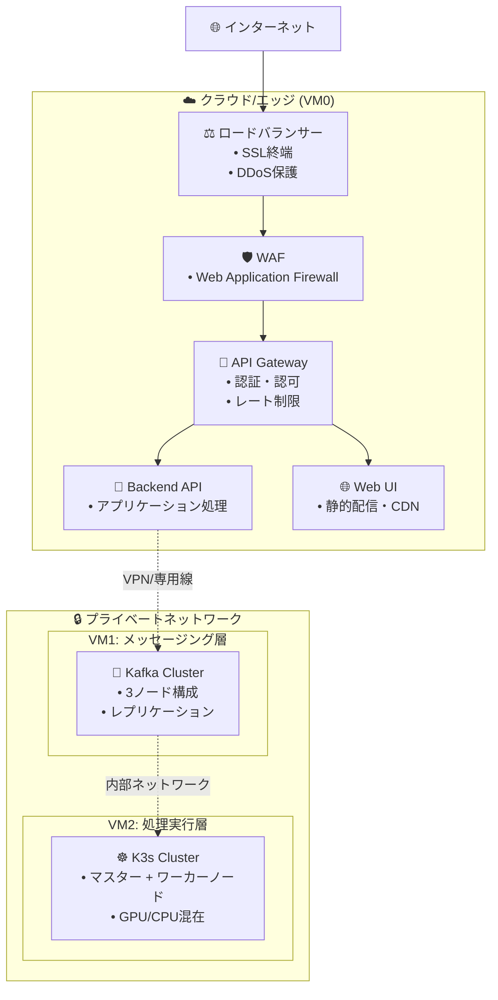
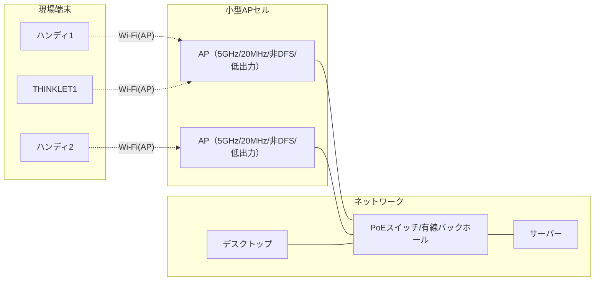

# ImageFlowCanvas インフラ設計書

## **文書管理情報**

| 項目       | 内容                           |
| ---------- | ------------------------------ |
| 文書名     | ImageFlowCanvas インフラ設計書 |
| バージョン | 1.1                            |
| 作成日     | 2025年7月12日                  |
| 更新日     | 2025年8月11日                  |


---

## **8. インフラ設計**

### **8.0. ホスティング場所とデプロイメント戦略**

#### **8.0.1. VM0: エッジ・ゲートウェイサーバー (フロントエンド層)**

| 🔧 コンポーネント  | 📍 推奨ホスティング場所                                                   | ⚙️ デプロイ方法                        | 🎯 用途・特徴                                                  |
| :---------------- | :----------------------------------------------------------------------- | :------------------------------------ | :------------------------------------------------------------ |
| **🚪 API Gateway** | AWS ALB/CloudFlare<br/>または<br/>オンプレミス nginx                     | Docker Compose<br/>Kubernetes Ingress | • SSL終端・認証<br/>• 負荷分散<br/>• レート制限               |
| **🔧 Backend API** | AWS ECS/GKE<br/>または<br/>オンプレミス Docker                           | FastAPI Container                     | • ビジネスロジック<br/>• Kafka Producer<br/>• WebSocket管理   |
| **🌐 Web UI**      | AWS S3+CloudFront<br/>Azure Static Web Apps<br/>または<br/>nginx静的配信 | React Build<br/>CDN配信               | • SPA (Single Page App)<br/>• 静的ファイル配信<br/>• 管理画面 |

#### **8.0.2. VM1: 専用メッセージングサーバー (メッセージング層)**

| 🔧 コンポーネント    | 📍 推奨ホスティング場所                           | ⚙️ デプロイ方法                      | 🎯 用途・特徴                                                         |
| :------------------ | :----------------------------------------------- | :---------------------------------- | :------------------------------------------------------------------- |
| **📨 Apache Kafka**  | 専用物理サーバー<br/>AWS MSK<br/>Confluent Cloud | Kafka Cluster<br/>(3ノード構成推奨) | • 高スループット<br/>• メッセージ永続化<br/>• パーティション並列処理 |
| **🔗 Kafka Connect** | Kafka同居サーバー                                | Docker Container                    | • MinIO連携<br/>• ストリーム処理<br/>• データパイプライン            |

#### **8.0.3. VM2: 高性能コンピューティングサーバー (処理実行層)**

| 🔧 コンポーネント         | 📍 推奨ホスティング場所                                       | ⚙️ デプロイ方法        | 🎯 用途・特徴                                                     |
| :----------------------- | :----------------------------------------------------------- | :-------------------- | :--------------------------------------------------------------- |
| **☸️ K3s Cluster**        | GPU搭載物理サーバー<br/>AWS EC2 G4/P3<br/>GCP Compute Engine | K3s Multi-node        | • GPU/CPU混在環境<br/>• 自動スケーリング<br/>• リソース効率化    |
| **⚡ gRPC常駐サービス群** | K3s内部                                                      | Kubernetes Deployment | • 直接gRPC呼び出し<br/>• 超高速処理<br/>• 動的パイプライン制御   |
| **💾 MinIO**              | 高速SSD/NVMeストレージ                                       | K3s StatefulSet       | • 画像データ永続化<br/>• S3互換API<br/>• 高IOPSストレージ        |
| **🐳 処理Pod群**          | GPU/CPUノード                                                | Kubernetes Deployment | • 画像処理実行<br/>• 動的リソース割り当て<br/>• 水平スケーリング |

#### **8.0.4. ネットワーク構成とセキュリティ**



#### **8.0.5. リソース要件と推奨スペック**

| 🖥️ サーバー       | 💻 推奨スペック        | 💾 ストレージ | 🌐 ネットワーク | 💰 推定コスト/月 |
| :--------------- | :-------------------- | :----------- | :------------- | :-------------- |
| **VM0 (エッジ)** | 4vCPU, 8GB RAM        | 100GB SSD    | 1Gbps          | $100-200        |
| **VM1 (Kafka)**  | 8vCPU, 16GB RAM       | 500GB SSD    | 10Gbps         | $200-400        |
| **VM2 (K3s)**    | 16vCPU, 64GB RAM, GPU | 1TB NVMe SSD | 10Gbps         | $800-1500       |

#### **8.0.6. デプロイメント戦略**

1. **段階的デプロイ**: VM0 → VM1 → VM2の順序でデプロイ
2. **Blue-Green デプロイ**: 本番環境でのゼロダウンタイム更新
3. **カナリアリリース**: 新機能の段階的展開
4. **GitOps**: Git リポジトリを真実の源とした自動デプロイ

### **8.1. Kubernetesクラスタ設計**

#### **8.1.1. クラスタ構成**

```yaml
# K3s クラスタ構成
cluster:
  name: imageflow-k3s
  version: v1.28.9+k3s1
  
  master_nodes:
    - name: k3s-master-01
      ip: 10.0.1.10
      resources:
        cpu: 4
        memory: 8Gi
        storage: 100Gi
  
  worker_nodes:
    - name: k3s-worker-01
      ip: 10.0.1.11
      resources:
        cpu: 8
        memory: 16Gi
        storage: 500Gi
      labels:
        node-type: cpu-intensive
        
    - name: k3s-worker-02
      ip: 10.0.1.12
      resources:
        cpu: 8
        memory: 32Gi
        gpu: 1
        storage: 1Ti
      labels:
        node-type: gpu-enabled
        
    - name: k3s-worker-03
      ip: 10.0.1.13
      resources:
        cpu: 4
        memory: 8Gi
        storage: 2Ti
      labels:
        node-type: storage-optimized
```

#### **8.1.2. Namespace設計**

```yaml
# Namespace構成
namespaces:
  - name: imageflow-web
    purpose: Web UI, API Gateway
    
  - name: imageflow-backend
    purpose: Backend API Services
    
  - name: imageflow-processing
    purpose: gRPC Processing Services
    
  - name: imageflow-storage
    purpose: MinIO, Database
    
  - name: imageflow-monitoring
    purpose: Prometheus, Grafana
```

---

### **8.1.3. 現場ネットワーク設計（小型AP＋有線バックホール）**

本システムの現場（工場・ライン）における無線方式は、「小型AP（5GHz/20MHz/非DFS/低出力）＋有線バックホール」に統一する。端末増加や移動時の電波干渉・ローミング課題を、設計と運用で安定的に解決することを目的とする。

#### 8.1.3.1 運用ポリシー
- 周波数/帯域幅: 5GHz固定・20MHzチャネル幅・非DFSチャネル
- 電力設計: 低出力（小セル化）でセル境界を明確化
- バックホール: すべて有線（ギガビット以上、PoE推奨）
- SSID設計: 全APで共通SSID/セキュリティを統一
- 運用: チャネル計画・出力チューニング・ローミング最適化（設計で吸収）

#### 8.1.3.2 規模別設計の目安
| 端末数  | 小型APセル設計                           | 備考                            |
| ------- | ---------------------------------------- | ------------------------------- |
| 1台     | 単一セルで十分                           | 干渉少、最小構成                |
| 2-4台   | 2-3セルに分割、チャネル固定              | 20MHz幅で同時通信の安定確保     |
| 5台以上 | 小セル多数＋有線BH、同一SSIDでローミング | セル再利用で面積/台数に線形対応 |

#### 8.1.3.3 コスト・運用比較（参考）

| 方式                             | 初期投資                             | 拡張性                          | 干渉/混線対策                            | ローミング                         | 運用・保守                | 主なリスク/補足                                | セキュリティ要件                           | 導入期間                     | 総保有コスト（TCO）                            |
| -------------------------------- | ------------------------------------ | ------------------------------- | ---------------------------------------- | ---------------------------------- | ------------------------- | ---------------------------------------------- | ------------------------------------------ | ---------------------------- | ---------------------------------------------- |
| 小型AP＋有線バックホール（推奨） | 低〜中（小型AP/PoEスイッチ段階導入） | 高（セル追加で面積/台数に線形） | 非DFS/20MHz/低出力＋チャネル計画で抑制   | 良（同一SSID、802.11k/v/r対応時◎） | 一元管理・監視が容易      | 現地サイトサーベイ/出力調整が必要              | 中〜高（WPA2/WPA3、VLAN/802.1Xで高水準可） | 短〜中（現地調査・配線含む） | 低〜中（段階投資・運用容易で抑制）             |
| エンタープライズAP集中設計       | 中〜高（高性能AP/コントローラ導入）  | 中（高密度ではセル設計が前提）  | 大出力はセル肥大で干渉増の懸念、設計次第 | 中（機種/設定依存）                | 専任スキル/保守契約が前提 | 金属反射/DFS制約、費用対効果が環境依存         | 高（802.1X/RADIUS、NAC、集中管理）         | 中（設計/調整/ベンダ調整）   | 中〜高（保守・ライセンス・専任要員が前提）     |
| SoftAP（PC/端末AP化）            | 低（既存機器で開始可）               | 低（同時接続/安定性に限界）     | 低（端末AP乱立で干渉しやすい）           | なし（基本固定接続）               | 端末個別設定で運用負荷高  | セキュリティ/電波安定性/省電力に課題           | 低（PSK中心、端末設定依存・統制困難）      | 短（即日開始可）             | 低（初期低コストだが運用負荷で隠れコスト発生） |
| ローカル5G（プライベート5G）     | 非常に高（免許/設備/設計/端末調達）  | 高（大規模/専用帯域で拡張容易） | 非常に高（専用帯域で干渉少）             | 良（基地局設計次第）               | 高（専門要員/維持費が大） | 導入期間長/端末エコシステム/継続コストが大きい | 非常に高（SIM/eSIM、閉域、厳格な端末認証） | 長（免許取得〜本設まで）     | 非常に高（設備維持・ライセンス・人件費）       |
| Wi‑Fi Directブリッジ方式         | 低〜中（デスクトップPC追加/設定）    | 低〜中（PC台数/接続上限に依存） | 低（P2P混在で抑制困難）                  | 悪（切断→再接続が前提）            | PC/ドライバ管理の運用負荷 | 切替遅延/安定性課題、台数増で複雑性/負荷が増大 | 低〜中（P2P中心、経路統制/監視が弱い）     | 短（PC設定で導入）           | 中（台数増で運用負荷・障害対応コストが増大）   |

#### 8.1.3.4 想定ネットワーク構成


#### 8.1.3.5 ローミング・干渉対策（設計指針）
- チャネル計画: 2.4GHzは原則不使用、5GHzの非DFS（36/40/44/48, 149/153/157/161）を固定割当
- 出力最適化: セルオーバーラップは−65〜−70 dBm程度で収束するよう低出力運用
- ローミング誘導: 最低接続RSSI（例: −70 dBm）を閾値に端末側で再探索、同一SSIDで切替
- 機能活用（対応時）: 802.11k/v/r, band steering, minimum RSSI enforce
- アプリ側吸収: 一時的な電波劣化時は送信キューイングと再送、継続セッションでUX維持

#### 8.1.3.6 運用手順（接続・ローミング）
1. SSID/セキュリティ統一（WPA2/WPA3、可能ならEnterprise）
2. 非DFSチャネル固定（5GHz、20MHz幅）
3. 低出力設定で小セル化（セル境界で−65〜−70 dBm）
4. 端末は同一SSIDへ接続し、最低RSSI閾値を下回ったら再探索
5. 有線バックホール（PoE/GbE）でサーバー・デスクトップと接続

ローミング時の処理
- セッション維持: 同一SSID＋アプリ層の再送/キューイングでUX維持
- 切替時間の最小化: 端末/APが対応する場合は 802.11k/v/r を有効化
- データ保護: 一時バッファリングと再試行ポリシー
- 自動復旧: RSSI回復・再接続時に未送信データを送信

#### 8.1.3.7 段階的導入アプローチ
| フェーズ | 実装内容                          | 効果                               |
| -------- | --------------------------------- | ---------------------------------- |
| 1        | 単一APで試験導入                  | 基本通信/スループットの実測確認    |
| 2        | 2-3セル分割＋チャネル固定         | 同時接続時の干渉低減・安定化       |
| 3        | 小セル多数化＋有線バックホール    | 面積拡大/端末増に線形拡張          |
| 4        | 監視/最適化（出力調整・ログ分析） | ローミング安定・混線時の迅速な是正 |

参考: 端末アプリ側の通信の使い分け・機能連携は `0313_端末アプリ（ハンディターミナル・デスクトップ）設計.md` を参照。

#### **8.1.4. OpenTelemetryインフラ設計**

##### **8.1.4.1. OpenTelemetry Collector DaemonSet**

```yaml
# OpenTelemetry Collector DaemonSet
apiVersion: apps/v1
kind: DaemonSet
metadata:
  name: otel-agent
  namespace: imageflow-observability
spec:
  selector:
    matchLabels:
      app: otel-agent
  template:
    metadata:
      labels:
        app: otel-agent
    spec:
      serviceAccount: otel-agent
      containers:
      - name: otel-agent
        image: otel/opentelemetry-collector-contrib:0.97.0
        args:
          - --config=/etc/otelcol-contrib/config.yaml
        volumeMounts:
        - name: config
          mountPath: /etc/otelcol-contrib
        - name: varlog
          mountPath: /var/log
          readOnly: true
        - name: varlibdockercontainers
          mountPath: /var/lib/docker/containers
          readOnly: true
        env:
        - name: KUBE_NODE_NAME
          valueFrom:
            fieldRef:
              fieldPath: spec.nodeName
        - name: KUBE_POD_NAME
          valueFrom:
            fieldRef:
              fieldPath: metadata.name
        - name: KUBE_POD_UID
          valueFrom:
            fieldRef:
              fieldPath: metadata.uid
        - name: KUBE_NAMESPACE
          valueFrom:
            fieldRef:
              fieldPath: metadata.namespace
        resources:
          requests:
            memory: 100Mi
            cpu: 100m
          limits:
            memory: 200Mi
            cpu: 200m
        ports:
        - containerPort: 4317  # OTLP gRPC
        - containerPort: 4318  # OTLP HTTP
        - containerPort: 8888  # Prometheus metrics
      volumes:
      - name: config
        configMap:
          name: otel-agent-config
      - name: varlog
        hostPath:
          path: /var/log
      - name: varlibdockercontainers
        hostPath:
          path: /var/lib/docker/containers
      tolerations:
      - key: node-role.kubernetes.io/master
        operator: Exists
        effect: NoSchedule
```

##### **8.1.4.2. Grafana Tempo設定**

```yaml
# Grafana Tempo for distributed tracing
apiVersion: apps/v1
kind: StatefulSet
metadata:
  name: tempo
  namespace: imageflow-observability
spec:
  serviceName: tempo
  replicas: 1
  selector:
    matchLabels:
      app: tempo
  template:
    metadata:
      labels:
        app: tempo
    spec:
      containers:
      - name: tempo
        image: grafana/tempo:2.4.0
        args:
          - -config.file=/etc/tempo/tempo.yaml
          - -mem-ballast-size-mbs=1024
        volumeMounts:
        - name: config
          mountPath: /etc/tempo
        - name: data
          mountPath: /var/tempo
        env:
        - name: TEMPO_STORAGE_TRACE_BACKEND
          value: "local"
        - name: TEMPO_STORAGE_TRACE_LOCAL_PATH
          value: "/var/tempo"
        resources:
          requests:
            memory: 1Gi
            cpu: 500m
          limits:
            memory: 2Gi
            cpu: 1000m
        ports:
        - containerPort: 3200  # HTTP
        - containerPort: 4317  # OTLP gRPC
        - containerPort: 14250 # Jaeger gRPC
      volumes:
      - name: config
        configMap:
          name: tempo-config
  volumeClaimTemplates:
  - metadata:
      name: data
    spec:
      accessModes: ["ReadWriteOnce"]
      resources:
        requests:
          storage: 10Gi
```

### **8.2. ストレージ設計**

#### **8.2.1. MinIO設定**

```yaml
# MinIO分散構成
apiVersion: v1
kind: ConfigMap
metadata:
  name: minio-config
  namespace: imageflow-storage
data:
  # 分散構成（4ノード）
  MINIO_DISTRIBUTED_MODE: "true"
  MINIO_DISTRIBUTED_NODES: "4"
  
  # セキュリティ設定
  MINIO_REGION: "us-east-1"
  MINIO_BROWSER: "on"
  MINIO_DOMAIN: "minio.imageflow.local"
  
  # バケット設定
  MINIO_DEFAULT_BUCKETS: |
    raw-images:rw
    processed-images:rw
    system-logs:r
```

#### **8.2.2. 永続ボリューム設計**

```yaml
# StorageClass定義
apiVersion: storage.k8s.io/v1
kind: StorageClass
metadata:
  name: fast-ssd
provisioner: kubernetes.io/no-provisioner
volumeBindingMode: WaitForFirstConsumer
parameters:
  type: ssd
  iops: "3000"

---
# 高性能ストレージ用PV
apiVersion: v1
kind: PersistentVolume
metadata:
  name: minio-data-01
spec:
  capacity:
    storage: 1Ti
  accessModes:
    - ReadWriteOnce
  persistentVolumeReclaimPolicy: Retain
  storageClassName: fast-ssd
  hostPath:
    path: /data/minio/01
```

### **8.3. ネットワーク設計**

#### **8.3.1. Service Mesh（Istio）**

```yaml
# Istio VirtualService
apiVersion: networking.istio.io/v1beta1
kind: VirtualService
metadata:
  name: imageflow-api
  namespace: imageflow-backend
spec:
  hosts:
  - api.imageflow.com
  gateways:
  - imageflow-gateway
  http:
  - match:
    - uri:
        prefix: /v1/
    route:
    - destination:
        host: backend-api
        port:
          number: 8000
    fault:
      delay:
        percentage:
          value: 0.1
        fixedDelay: 5s
    retries:
      attempts: 3
      perTryTimeout: 10s
```

#### **8.3.2. ネットワークポリシー**

```yaml
# ネットワーク分離
apiVersion: networking.k8s.io/v1
kind: NetworkPolicy
metadata:
  name: processing-isolation
  namespace: imageflow-processing
spec:
  podSelector:
    matchLabels:
      tier: processing
  policyTypes:
  - Ingress
  - Egress
  ingress:
  - from:
    - namespaceSelector:
        matchLabels:
          name: imageflow-backend
    ports:
    - protocol: TCP
      port: 8080
  egress:
  - to:
    - namespaceSelector:
        matchLabels:
          name: imageflow-storage
    ports:
    - protocol: TCP
      port: 9000  # MinIO
```
