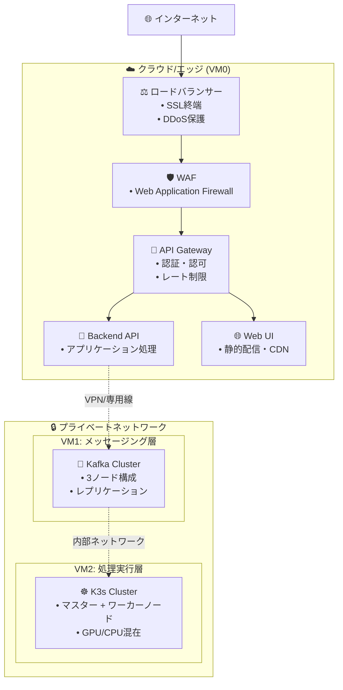

# ImageFlowCanvas インフラ設計書

## **文書管理情報**

| 項目       | 内容                           |
| ---------- | ------------------------------ |
| 文書名     | ImageFlowCanvas インフラ設計書 |
| バージョン | 1.0                            |
| 作成日     | 2025年7月12日                  |
| 更新日     | 2025年7月12日                  |


---

## **8. インフラ設計**

### **8.0. ホスティング場所とデプロイメント戦略**

#### **8.0.1. VM0: エッジ・ゲートウェイサーバー (フロントエンド層)**

| 🔧 コンポーネント  | 📍 推奨ホスティング場所                                                   | ⚙️ デプロイ方法                        | 🎯 用途・特徴                                                  |
| :---------------- | :----------------------------------------------------------------------- | :------------------------------------ | :------------------------------------------------------------ |
| **🚪 API Gateway** | AWS ALB/CloudFlare<br/>または<br/>オンプレミス nginx                     | Docker Compose<br/>Kubernetes Ingress | • SSL終端・認証<br/>• 負荷分散<br/>• レート制限               |
| **🔧 Backend API** | AWS ECS/GKE<br/>または<br/>オンプレミス Docker                           | FastAPI Container                     | • ビジネスロジック<br/>• Kafka Producer<br/>• WebSocket管理   |
| **🌐 Web UI**      | AWS S3+CloudFront<br/>Azure Static Web Apps<br/>または<br/>nginx静的配信 | React Build<br/>CDN配信               | • SPA (Single Page App)<br/>• 静的ファイル配信<br/>• 管理画面 |

#### **8.0.2. VM1: 専用メッセージングサーバー (メッセージング層)**

| 🔧 コンポーネント    | 📍 推奨ホスティング場所                           | ⚙️ デプロイ方法                      | 🎯 用途・特徴                                                         |
| :------------------ | :----------------------------------------------- | :---------------------------------- | :------------------------------------------------------------------- |
| **📨 Apache Kafka**  | 専用物理サーバー<br/>AWS MSK<br/>Confluent Cloud | Kafka Cluster<br/>(3ノード構成推奨) | • 高スループット<br/>• メッセージ永続化<br/>• パーティション並列処理 |
| **🔗 Kafka Connect** | Kafka同居サーバー                                | Docker Container                    | • MinIO連携<br/>• ストリーム処理<br/>• データパイプライン            |

#### **8.0.3. VM2: 高性能コンピューティングサーバー (処理実行層)**

| 🔧 コンポーネント         | 📍 推奨ホスティング場所                                       | ⚙️ デプロイ方法        | 🎯 用途・特徴                                                     |
| :----------------------- | :----------------------------------------------------------- | :-------------------- | :--------------------------------------------------------------- |
| **☸️ K3s Cluster**        | GPU搭載物理サーバー<br/>AWS EC2 G4/P3<br/>GCP Compute Engine | K3s Multi-node        | • GPU/CPU混在環境<br/>• 自動スケーリング<br/>• リソース効率化    |
| **⚡ gRPC常駐サービス群** | K3s内部                                                      | Kubernetes Deployment | • 直接gRPC呼び出し<br/>• 超高速処理<br/>• 動的パイプライン制御   |
| **💾 MinIO**              | 高速SSD/NVMeストレージ                                       | K3s StatefulSet       | • 画像データ永続化<br/>• S3互換API<br/>• 高IOPSストレージ        |
| **🐳 処理Pod群**          | GPU/CPUノード                                                | Kubernetes Deployment | • 画像処理実行<br/>• 動的リソース割り当て<br/>• 水平スケーリング |

#### **8.0.4. ネットワーク構成とセキュリティ**



#### **8.0.5. リソース要件と推奨スペック**

| 🖥️ サーバー       | 💻 推奨スペック        | 💾 ストレージ | 🌐 ネットワーク | 💰 推定コスト/月 |
| :--------------- | :-------------------- | :----------- | :------------- | :-------------- |
| **VM0 (エッジ)** | 4vCPU, 8GB RAM        | 100GB SSD    | 1Gbps          | $100-200        |
| **VM1 (Kafka)**  | 8vCPU, 16GB RAM       | 500GB SSD    | 10Gbps         | $200-400        |
| **VM2 (K3s)**    | 16vCPU, 64GB RAM, GPU | 1TB NVMe SSD | 10Gbps         | $800-1500       |

#### **8.0.6. デプロイメント戦略**

1. **段階的デプロイ**: VM0 → VM1 → VM2の順序でデプロイ
2. **Blue-Green デプロイ**: 本番環境でのゼロダウンタイム更新
3. **カナリアリリース**: 新機能の段階的展開
4. **GitOps**: Git リポジトリを真実の源とした自動デプロイ

### **8.1. Kubernetesクラスタ設計**

#### **8.1.1. クラスタ構成**

```yaml
# K3s クラスタ構成
cluster:
  name: imageflow-k3s
  version: v1.28.9+k3s1
  
  master_nodes:
    - name: k3s-master-01
      ip: 10.0.1.10
      resources:
        cpu: 4
        memory: 8Gi
        storage: 100Gi
  
  worker_nodes:
    - name: k3s-worker-01
      ip: 10.0.1.11
      resources:
        cpu: 8
        memory: 16Gi
        storage: 500Gi
      labels:
        node-type: cpu-intensive
        
    - name: k3s-worker-02
      ip: 10.0.1.12
      resources:
        cpu: 8
        memory: 32Gi
        gpu: 1
        storage: 1Ti
      labels:
        node-type: gpu-enabled
        
    - name: k3s-worker-03
      ip: 10.0.1.13
      resources:
        cpu: 4
        memory: 8Gi
        storage: 2Ti
      labels:
        node-type: storage-optimized
```

#### **8.1.2. Namespace設計**

```yaml
# Namespace構成
namespaces:
  - name: imageflow-web
    purpose: Web UI, API Gateway
    
  - name: imageflow-backend
    purpose: Backend API Services
    
  - name: imageflow-processing
    purpose: gRPC Processing Services
    
  - name: imageflow-storage
    purpose: MinIO, Database
    
  - name: imageflow-monitoring
    purpose: Prometheus, Grafana
```

#### **8.1.3. OpenTelemetryインフラ設計**

##### **8.1.3.1. OpenTelemetry Collector DaemonSet**

```yaml
# OpenTelemetry Collector DaemonSet
apiVersion: apps/v1
kind: DaemonSet
metadata:
  name: otel-agent
  namespace: imageflow-observability
spec:
  selector:
    matchLabels:
      app: otel-agent
  template:
    metadata:
      labels:
        app: otel-agent
    spec:
      serviceAccount: otel-agent
      containers:
      - name: otel-agent
        image: otel/opentelemetry-collector-contrib:0.97.0
        args:
          - --config=/etc/otelcol-contrib/config.yaml
        volumeMounts:
        - name: config
          mountPath: /etc/otelcol-contrib
        - name: varlog
          mountPath: /var/log
          readOnly: true
        - name: varlibdockercontainers
          mountPath: /var/lib/docker/containers
          readOnly: true
        env:
        - name: KUBE_NODE_NAME
          valueFrom:
            fieldRef:
              fieldPath: spec.nodeName
        - name: KUBE_POD_NAME
          valueFrom:
            fieldRef:
              fieldPath: metadata.name
        - name: KUBE_POD_UID
          valueFrom:
            fieldRef:
              fieldPath: metadata.uid
        - name: KUBE_NAMESPACE
          valueFrom:
            fieldRef:
              fieldPath: metadata.namespace
        resources:
          requests:
            memory: 100Mi
            cpu: 100m
          limits:
            memory: 200Mi
            cpu: 200m
        ports:
        - containerPort: 4317  # OTLP gRPC
        - containerPort: 4318  # OTLP HTTP
        - containerPort: 8888  # Prometheus metrics
      volumes:
      - name: config
        configMap:
          name: otel-agent-config
      - name: varlog
        hostPath:
          path: /var/log
      - name: varlibdockercontainers
        hostPath:
          path: /var/lib/docker/containers
      tolerations:
      - key: node-role.kubernetes.io/master
        operator: Exists
        effect: NoSchedule
```

##### **8.1.3.2. Grafana Tempo設定**

```yaml
# Grafana Tempo for distributed tracing
apiVersion: apps/v1
kind: StatefulSet
metadata:
  name: tempo
  namespace: imageflow-observability
spec:
  serviceName: tempo
  replicas: 1
  selector:
    matchLabels:
      app: tempo
  template:
    metadata:
      labels:
        app: tempo
    spec:
      containers:
      - name: tempo
        image: grafana/tempo:2.4.0
        args:
          - -config.file=/etc/tempo/tempo.yaml
          - -mem-ballast-size-mbs=1024
        volumeMounts:
        - name: config
          mountPath: /etc/tempo
        - name: data
          mountPath: /var/tempo
        env:
        - name: TEMPO_STORAGE_TRACE_BACKEND
          value: "local"
        - name: TEMPO_STORAGE_TRACE_LOCAL_PATH
          value: "/var/tempo"
        resources:
          requests:
            memory: 1Gi
            cpu: 500m
          limits:
            memory: 2Gi
            cpu: 1000m
        ports:
        - containerPort: 3200  # HTTP
        - containerPort: 4317  # OTLP gRPC
        - containerPort: 14250 # Jaeger gRPC
      volumes:
      - name: config
        configMap:
          name: tempo-config
  volumeClaimTemplates:
  - metadata:
      name: data
    spec:
      accessModes: ["ReadWriteOnce"]
      resources:
        requests:
          storage: 10Gi
```

### **8.2. ストレージ設計**

#### **8.2.1. MinIO設定**

```yaml
# MinIO分散構成
apiVersion: v1
kind: ConfigMap
metadata:
  name: minio-config
  namespace: imageflow-storage
data:
  # 分散構成（4ノード）
  MINIO_DISTRIBUTED_MODE: "true"
  MINIO_DISTRIBUTED_NODES: "4"
  
  # セキュリティ設定
  MINIO_REGION: "us-east-1"
  MINIO_BROWSER: "on"
  MINIO_DOMAIN: "minio.imageflow.local"
  
  # バケット設定
  MINIO_DEFAULT_BUCKETS: |
    raw-images:rw
    processed-images:rw
    system-logs:r
```

#### **8.2.2. 永続ボリューム設計**

```yaml
# StorageClass定義
apiVersion: storage.k8s.io/v1
kind: StorageClass
metadata:
  name: fast-ssd
provisioner: kubernetes.io/no-provisioner
volumeBindingMode: WaitForFirstConsumer
parameters:
  type: ssd
  iops: "3000"

---
# 高性能ストレージ用PV
apiVersion: v1
kind: PersistentVolume
metadata:
  name: minio-data-01
spec:
  capacity:
    storage: 1Ti
  accessModes:
    - ReadWriteOnce
  persistentVolumeReclaimPolicy: Retain
  storageClassName: fast-ssd
  hostPath:
    path: /data/minio/01
```

### **8.3. ネットワーク設計**

#### **8.3.1. Service Mesh（Istio）**

```yaml
# Istio VirtualService
apiVersion: networking.istio.io/v1beta1
kind: VirtualService
metadata:
  name: imageflow-api
  namespace: imageflow-backend
spec:
  hosts:
  - api.imageflow.com
  gateways:
  - imageflow-gateway
  http:
  - match:
    - uri:
        prefix: /v1/
    route:
    - destination:
        host: backend-api
        port:
          number: 8000
    fault:
      delay:
        percentage:
          value: 0.1
        fixedDelay: 5s
    retries:
      attempts: 3
      perTryTimeout: 10s
```

#### **8.3.2. ネットワークポリシー**

```yaml
# ネットワーク分離
apiVersion: networking.k8s.io/v1
kind: NetworkPolicy
metadata:
  name: processing-isolation
  namespace: imageflow-processing
spec:
  podSelector:
    matchLabels:
      tier: processing
  policyTypes:
  - Ingress
  - Egress
  ingress:
  - from:
    - namespaceSelector:
        matchLabels:
          name: imageflow-backend
    ports:
    - protocol: TCP
      port: 8080
  egress:
  - to:
    - namespaceSelector:
        matchLabels:
          name: imageflow-storage
    ports:
    - protocol: TCP
      port: 9000  # MinIO
```

---

## **関連文書**

- [概要設計](./0300_概要設計.md)
- [アーキテクチャ設計](./0302_アーキテクチャ設計.md)
- [運用・監視設計](./0308_運用監視設計.md)
