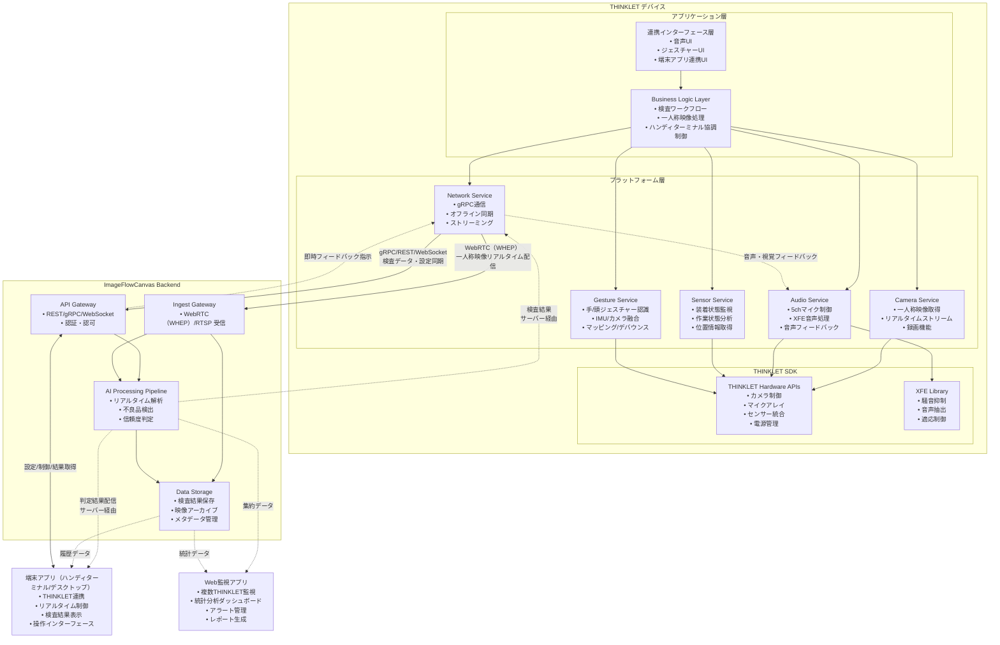
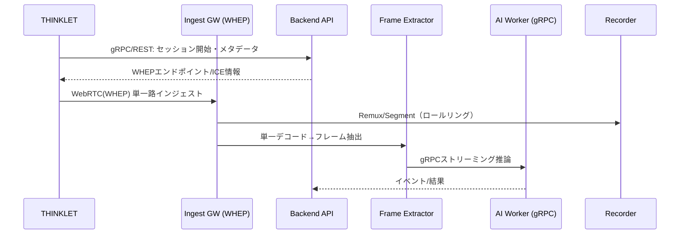
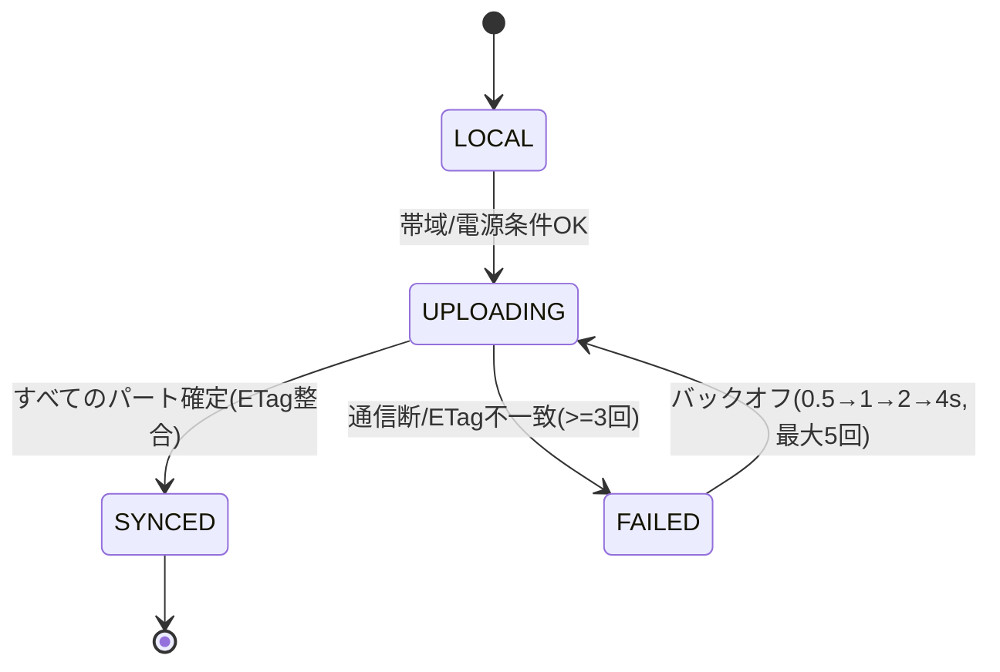
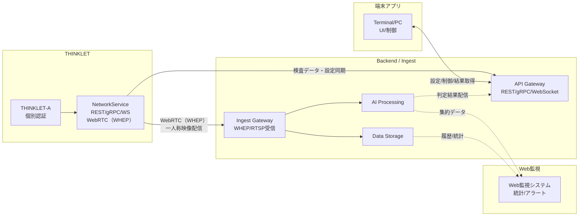
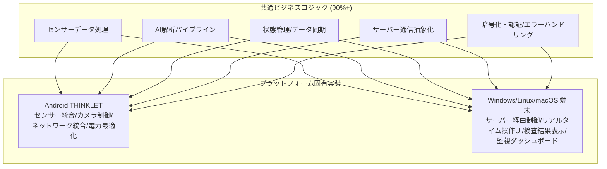

# THINKLET アプリ設計書

# 文書管理情報

| 項目       | 内容                  |
| ---------- | --------------------- |
| 文書名     | THINKLET アプリ設計書 |
| バージョン | 1.3                   |
| 作成日     | 2025年8月7日          |
| 更新日     | 2025年8月24日         |

---

# 1. 概要

## 1.1. 本書の目的

本書は、ImageFlowCanvasシステムにおけるTHINKLETウェアラブルデバイス向けアプリケーションの詳細設計について記述するものです。THINKLETの特性を最大限に活用したセンサーデータ処理と端末アプリ連携機能（ハンディターミナル・デスクトップ）の実装指針を提供します。

## 1.2. 対象読者

- THINKLETアプリ開発者
- ウェアラブルデバイス技術者
- システム設計者
- 品質保証担当者

## 1.3. THINKLETアプリの特徴と位置づけ

**THINKLETは"必須ではない"が、現場の効率とカバー範囲を大きく伸ばす"任意の拡張"**です。端末アプリ（ハンディターミナル・デスクトップ）は完全に独立して動作可能で、その上にTHINKLETを載せることで以下の特徴を持つ特化型アプリケーションとして機能します：

- **センサーデータ処理**: 装着者視点でのリアルタイム環境データ収集・解析
- **ハンズフリー操作**: 音声コマンドとジェスチャー制御（UI操作は連携端末で実施）
- **連携端末のセンサー役**: 端末アプリ（ハンディターミナル・デスクトップ）の映像・音声・センサー拡張機能
- **超低遅延**: <20ms の映像処理とフィードバック（連携端末経由表示）
- **バッテリー最適化**: 8時間連続稼働を実現
- **端末アプリ連携**: リアルタイム検査結果の端末アプリ表示（ハンディターミナル・デスクトップ対応）

**連携方針:**
- **基本**: 各アプリ独立で完全動作（THINKLET不要でも基本検査業務は成立）
- **拡張**: THINKLETによりハンズフリー・視点拡張・精度補完（導入推奨）
- **実装**: Wi-Fiアクセスポイント経由でのサーバー統合（サーバー経由で統合管理）

---

# 1.4. プライバシーゾーン（BLE/QR）対応の位置づけ
- 目的: トイレ・更衣室等の入室時に録画・配信・音声を自動停止し、退出後のみ復帰させる。
- 手段: BLEビーコン（主）＋署名付きQR（副）。サーバは `SUSPENDED(privacy)` で強制ブロック。
- フェイルセーフ: 検知失敗時は音声ガイドで手動停止、最小滞在時間内の復帰禁止、冗長ビーコン。

---

# 2. THINKLET デバイス仕様と制約

## 2.1. ハードウェア仕様

### 2.1.1. 基本性能

| 項目           | 仕様                            | 設計への影響                           |
| -------------- | ------------------------------- | -------------------------------------- |
| **OS**         | Fairy OS（AOSP ベースの独自OS） | Android SDK互換、Kotlin対応            |
| **CPU**        | Qualcomm Snapdragon シリーズ    | 中程度の処理能力、効率重視設計が必要   |
| **RAM**        | 4GB                             | メモリ効率の最適化が重要               |
| **ストレージ** | 64GB+128GB（オンボードSDXC）    | ローカルキャッシュとオフライン対応可能 |
| **重量**       | 約170g                          | 軽量化設計、バッテリー消費最適化       |
| **バッテリー** | 1350 mAh                        | 省電力アーキテクチャが必須             |

### 2.1.2. カメラ性能

| 項目                   | 仕様                 | 活用方法                 |
| ---------------------- | -------------------- | ------------------------ |
| **解像度**             | 8MP                  | 高精細な検査画像の取得   |
| **視野角（横広角機）** | 水平120度×垂直90度   | 広範囲作業エリアのカバー |
| **視野角（縦広角機）** | 水平90度×垂直120度   | 縦長対象物の検査に最適   |
| **画像安定性**         | 肩掛け固定による安定 | 手ブレのない安定した映像 |

### 2.1.3. 音声機能

| 項目             | 仕様                              | 活用方法                         |
| ---------------- | --------------------------------- | -------------------------------- |
| **マイク**       | 5ch マイクアレイ、48kHz/24bit相当 | 高品質音声入力、騒音抑制         |
| **XFE技術**      | 環境騒音抑制、装着者音声抽出      | 工場騒音下での確実な音声認識     |
| **スピーカー**   | 1ch 内蔵スピーカー                | 音声フィードバック、アラート通知 |
| **外部音声出力** | Bluetooth、有線イヤホン対応       | 騒音環境での確実な情報伝達       |

### 2.1.4. センサー

| センサー          | 用途             | 検査アプリでの活用             |
| ----------------- | ---------------- | ------------------------------ |
| **9軸モーション** | 姿勢、動作検出   | 作業状態分析、装着状態監視     |
| **近接センサー**  | 装着検出         | アプリ自動起動、省電力制御     |
| **ジェスチャー**  | ハンズフリー操作 | 検査開始/停止、画面操作        |
| **GNSS**          | 位置情報取得     | 検査場所記録、トレーサビリティ |

## 2.2. 環境制約

### 2.2.1. 物理環境

- **防塵性能**: IP5X相当 → 粉塵の多い工場環境での使用
- **防水性能**: IPX4 → 飛沫のある環境での使用
- **動作温度**: 工場・建設現場の温度変化に対応
- **振動耐性**: 機械作業時の振動に耐える構造

### 2.2.2. ネットワーク環境

- **4G/LTE**: Band 1/3/8/9/18/19/41 対応
- **Wi-Fi**: 2.4GHz/5GHz デュアルバンド（現場では5GHz/20MHz/非DFS/低出力の小型AP設計を標準採用）
- **オフライン対応**: ネットワーク不安定環境での継続動作

**端末間通信方針:**
- **標準**: 小型Wi-Fiアクセスポイント＋有線バックホールに全端末を同一SSIDで接続、サーバー経由で制御
- **非推奨**: Wi-Fi Direct常用／端末AP化（SoftAP）常用は避ける（運用・安定性負債）

---

# 3. アプリケーション アーキテクチャ

## 3.1. 全体構成



## 3.2. レイヤー構成

### 3.2.1. 端末アプリ連携インターフェース層（AP配下統合通信）

THINKLETは画面を持たないため、端末アプリ（ハンディターミナル・デスクトップ）との連携により以下のインターフェースを提供します。連携はサーバー（Backend API）経由で行い、P2P接続は行いません。**連携は任意で、各アプリ単独でも完全動作可能**です：

- **音声インターフェース（ハンズフリー拡張）:**
  - 主要コマンド: 「検査開始」「検査停止」「次の項目」「結果確認」「ヘルプ」（サーバー経由で即時実行）
  - 製品音声入力: 「型式 TYPE-ABC」「機番 MACH001」（サーバー経由で端末アプリと整合）
  - 状況報告: 「検査完了しました」「不良を検出しました」「接続を確認してください」（サーバー経由で端末アプリ/監視UIに反映）
  - フィードバック: 認識時の音声応答・端末アプリ画面更新連動（サーバー経由の通知）
- データ記録: 音声コマンド履歴のサーバー同期（後処理）

**ジェスチャーインターフェース（非接触拡張）:**
- 検査制御: 首振り（次の検査項目）、うなずき（検査開始・確認）（Wi-Fi経由認証即座実行）
- 操作制御: 手を上げる（一時停止）、指差し（対象選択・端末アプリでの詳細表示）
- システム制御: 装着状態による自動開始・停止（緊急時対応）

**通信方式:**
- **標準**: Wi-Fiアクセスポイント経由でのサーバー統合（暗号化・即時制御、データ統合・監査）

### 3.2.2. フィードバックシステム（端末アプリ協調・Wi-Fi経由通信）

- **LEDフィードバック**: デバイス状態表示（Wi-Fi経由暗号化通信制御）
  - 青色光: 正常動作中・端末アプリ暗号化接続済み
  - 赤色光: 不良検出アラート・端末アプリ緊急表示（Wi-Fi経由即座反応）
  - 緑色光: 検査完了通知・端末アプリ完了画面
- **音声フィードバック**: 状況に応じた音声案内（端末アプリ設定のWi-Fi経由連動）
- **振動フィードバック**: 緊急時のアラートパターン（専用周波数・遅延なし）

### 3.2.3. Business Logic Layer（端末アプリ連携統合・Wi-Fi経由通信方式）

センサーデータ処理管理では、THINKLETの特性を活かしたリアルタイムデータ収集機能と、端末アプリ（ハンディターミナル・デスクトップ）との密接な混線回避連携を実装します。

**センサーデータ検査の実行フロー**
1. **装着状態確認**: センサーによる適切な装着状態の検証（ローカル処理）
2. **サーバー接続**: ローカルWi‑Fi（小型AP）経由でBackend APIへ暗号化接続・認証（混線回避設計）
3. **製品情報受信**: サーバー経由で端末アプリからの順序情報を受信（同一SSID運用・暗号化通信）
   - **順序情報同期**: 型式・機番・月連番等の検査指示情報（即座同期・認証済み）
   - **検査項目受信**: 端末アプリで設定された検査項目リスト（暗号化転送）
   - **作業指示受信**: 検査手順・注意事項の受信（混線なし通信）
4. **センサーデータ収集開始**: 環境データ・動作データの継続取得・バックエンド送信（サーバー経由永続化）
5. **音声/ジェスチャー監視**: 音声コマンドとジェスチャー入力の同時監視（近接認証実行）
6. **リアルタイムAI処理**: バックエンドでの並列データ解析（サーバー経由）
7. **端末アプリ結果配信**: 検査結果のサーバー経由配信・永続化

**フレーム処理とフィードバック（端末アプリ連携）:**
- 映像フレームへのメタデータ付与（端末アプリ提供の製品情報、位置情報、デバイス姿勢、環境データ）
- 端末アプリ指定の検査項目に基づくAI処理パイプライン適用
- 検査結果のサーバー経由での端末アプリ即時配信
- サーバー指示に基づく音声・振動フィードバック制御
- 詳細結果・操作画面の端末アプリ表示

**重要検査結果の緊急フィードバック（端末アプリ連携）:**
- **重大欠陥検出**: THINKLETアラート音 + 端末アプリ緊急画面表示 + 音声案内
- **一般欠陥検出**: THINKLETアラート音 + 端末アプリ警告表示 + 詳細情報表示
- **軽微欠陥検出**: 端末アプリ通知表示のみ

---

# 3.3. プライバシーゾーン制御（BLE/QR）

## 3.3.1. BLEスキャン・状態機械
- フォアグラウンドサービスで `BluetoothLeScanner` を起動。
- フィルタ: iBeacon/Eddystone-UID/EID。ホワイトリストに登録された `beacon_id ↔ zone_id` のみ有効。
- 判定: 入室 RSSI > −70dBm 2秒連続、退出 RSSI < −80dBm 5秒連続（現場で調整）。
- 状態遷移: `ACTIVE → SUSPENDING(privacy) → SUSPENDED(privacy) → RESUMING → ACTIVE`。
- フェイルクローズ: 一度 `SUSPENDED(privacy)` に入ったら最小滞在時間（例: 2分）未満の自動復帰を禁止。

## 3.3.2. ローカル即時処理
- 入室確定時に、端末ローカルで録画・配信・音声を即時停止（ネットワーク断でも効く）。
- 停止直前の未コミット・未紐づけセグメントは端末内破棄（アップロード不可）。
- LED/音/振動で「プライバシーモード中」を明示。

## 3.3.3. サーバ連携
- `POST /api/v1/thinklet/control` で `privacy_suspend` / `privacy_resume` を送信。`zone_id`,`rssi`,`session_id` を含む。
- `POST /api/v1/thinklet/sessions/{id}/telemetry` に入退室イベントとメトリクスを送信（監査）。
- サーバは当該セッションのIngest/Recorder/配信を強制停止（保存不可）。

## 3.3.4. 署名付きQR（フォールバック）
- 入口掲示の `IFCZ1|zone=privacy|zone_id=...|expires=...|sig=...` をスキャン→検証→同制御を実施。
- 退出側にも復帰QRを掲示。誤復帰防止のため復帰は自動検知＋明示操作のAND条件。

## 3.3.5. 故障・電池切れ対策
- 冗長ビーコン（N+1）、TLM対応モデル優先、年1回の計画交換、交換台帳。
- 「予定ゾーンでビーコン未検知」時は音声ガイドで手動停止を促し、telemetryへ記録。

**端末アプリ連携機能（統合制御）:**
- **検査結果自動送信**: 検査結果・分析データの端末アプリ自動転送
- **製品別判定結果表示**: <100ms遅延での製品特定AI判定結果表示
- **製品トレーサビリティアラート**: 製品情報紐づけ不良検出時の緊急通知
- **製品別統計データ送信**: 製品タイプ・機番別検査パフォーマンスデータの定期送信

**製品情報管理専用機能:**
- **QRコード一人称認識**: THINKLETカメラによる動的QRコードスキャン
- **製品履歴自動記録**: 映像開始/終了時の製品トレーサビリティ自動更新
- **音声製品確認**: 「現在の製品: 型式 TYPE-ABC、機番 MACH001」の音声読み上げ
- **製品切り替え通知**: 異なる製品QRコード検出時の自動切り替えアラート

### 3.2.3. Camera Service (一人称映像特化)

THINKLET専用カメラサービスでは、広角カメラを活用した一人称映像処理を最適化します。

**一人称映像ストリーミング機能:**
- **最適カメラ設定**: 8MP解像度、30fps、高品質映像
- **視野角最適化**: 作業環境に応じた最適視野角の自動選択
- **映像安定化**: 肩掛け固定に対応した手ブレ補正
- **自動調整**: オートフォーカス、自動露出、低照度最適化

**作業環境別視野角選択:**
- **組立ライン作業**: 横広角（120度×90度）- 作業台全体をカバー
- **縦型検査作業**: 縦広角（90度×120度）- 縦長対象物に最適化
- **詳細検査作業**: 標準視野角 - 細部作業に集中
- **デフォルト**: 横広角設定

**一人称映像の前処理:**
- フレームID生成とタイムスタンプ付与
- デバイス姿勢情報の付与
- 照明状態とフォーカス品質の分析
- 作業コンテキストの記録

**バッテリー効率録画:**
- 圧縮品質のバッテリー最適化
- 最大8時間連続録画対応
- 音声付き録画機能

### 3.2.4. Audio Service (XFE技術活用)

THINKLET音声サービスでは、XFE技術を活用した高性能音声処理を実現します。

**音声コマンド検出（XFE技術活用）:**
- **5chマイクアレイ設定**: 48kHz/24bit高品質音声収集
- **XFE音声前処理**: 
  - 工場騒音抑制機能
  - 装着者音声抽出機能
  - 適応音量制御機能
  - 風切り音抑制機能

**工場騒音下での音声コマンド認識:**
- **高精度認識**: 日本語音声認識（信頼度閾値0.8以上）
- **騒音耐性**: 高騒音環境対応設計
- **専用語彙**: 検査業務特化語彙セット

**検査専用音声コマンド語彙:**
- 検査制御: 「検査開始」「検査終了」「緊急停止」
- 撮影制御: 「撮影」「録画開始」「録画停止」
- 結果確認: 「結果確認」「不良報告」

**環境騒音対応音声フィードバック:**
- **適応音量調整**: 環境騒音レベルに応じた自動音量調整
- **音声品質最適化**: 音声認識向け高明度設定
- **緊急時対応**: 重要度に応じた繰り返し回数調整
  - 緊急時（Critical）: 3回繰り返し
  - 高優先度（High）: 2回繰り返し
  - 通常（Normal）: 1回のみ

---

### 3.2.5. Gesture Service (ジェスチャー認識)

THINKLETのカメラとIMU（加速度/ジャイロ）を融合し、ハンズフリー操作を実現します。

**役割:**
- 手/指/頭部の動作からジェスチャーを検出し、業務コマンドへ変換
- 誤検知抑制、環境ロバスト性、低遅延動作の両立

**入出力（契約）:**
- 入力: カメラフレーム（省電力時は縮小/間引き）、IMUストリーム（100Hz）、装着/環境状態
- 出力: GestureEvent { type, confidence, timestamp, duration, source }、Telemetry（latencyMs, f1Rolling, cpu%, battDrain/h）
- エラー: SensorUnavailable, LowConfidence, OverheatThrottled

**処理パイプライン:**
1. 前処理: 手領域推定（手袋対応閾値）、IMUフィルタリング（ローパス/補償）
2. 特徴抽出: 手指キーポイント/骨格、動きベクトル、首振り/うなずき検出
3. センサーフュージョン: 連続時系列の統合推定（Complementary Filter/HMM）
4. 分類: ルール + 軽量ML（TFLite/ONNX）ハイブリッド
5. ポスト処理: デバウンス、ダブルアクション（ホールド+動作）、領域/姿勢制約
6. マッピング: Gesture→Command（業務プリセット/カスタム）
7. フィードバック: 成功/失敗の音声/振動、ハンディターミナル画面ハイライト

**誤検知低減と安全:**
- 信頼度しきい値θ=0.8（省電力時0.85）、連続フレームN=3-5
- 危険環境フラグ中は一部ジェスチャー無効化、重大操作は意図確認を要求

**キャリブレーション:**
- 初回ウィザード（利き手・可動域・装着角度）、3秒クイック再調整、プロファイル保存/同期

**ジェスチャーマップ:**
- プリセット（検査/撮影/ナビ/マーカー）、現場別/個人別カスタム、監査ログ出力

**省電力モード:**
- 高性能: カメラ+IMU常時、有効遅延<150ms
- バランス: 低解像度カメラ前処理+IMU優先、遅延<200ms
- 省電力: IMU中心（首振り/うなずき/傾き）、必要時のみカメラ起動

## 3.3. リアルタイム処理アーキテクチャ

### 3.3.1. 超低遅延ストリーミング

超低遅延映像ストリーミング（20ms未満）では、高効率な並列処理により高性能を実現します。

**超低遅延ストリーミング機能:**
- **フレーム送信時刻記録**: 遅延測定用タイムスタンプ付与
- **バッファリング最適化**: 30フレームチャンク単位での効率処理
- **並列処理**: 複数フレームの同時処理によるスループット向上
- **遅延監視**: 20ms閾値超過時の警告機能

**リアルタイム処理フロー:**
1. 映像フレームの受信とタイムスタンプ記録
2. 30フレーム単位でのチャンク処理
3. gRPCストリーミングによるバックエンド送信
4. 並列AI処理の実行
5. 遅延測定と性能監視
6. エラー時のローカル処理フォールバック

### 3.3.2. オフライン処理対応

ネットワーク切断時には、ローカルAI処理による業務継続性を確保します。

**オフライン処理機能:**
- **軽量ローカルAI**: 基本的な検査機能をローカルで実行
- **データ保存**: 検査結果をローカルデータベースに一時保存
- **同期状態管理**: ネットワーク復旧時の自動同期準備

**ネットワーク復旧時同期:**
- **保留レコード処理**: ローカル保存された未同期データの自動送信
- **サーバー再処理**: 高精度AIによる再解析実行
- **結果更新**: ローカル結果の高精度バージョンへの更新
- **エラーハンドリング**: 同期失敗時のリトライキュー管理

### 3.3.3. 通信方式の整理（単一路インジェスト）

- 映像/音声: WebRTC/WHEPを「唯一のデバイス側インジェスト」（代替: RTSP）。
- 制御/メタデータ/軽量イベント: gRPC/REST。
- AI推論: サーバ側でフレーム抽出し、サーバ内（またはサーバ→AIワーカー間）をgRPCストリーミング。



## 3.4. 切断・復帰設計（デバイス側）

### 3.4.1. 録画セグメント状態機械とリングバッファ



- リングバッファ: 容量しきい値で削除優先度（最古SYNCED→LOCAL）。`protected`タグは除外。
- マルチパートアップロード+ETag管理で中断再開。
- 同時アップロード本数: LTE 1–2、Wi‑Fi 4–6。
- 重要度別キュー: 高→通常→低（復帰時の優先同期）。

### 3.4.2. オフライン運用
- オフライン時も録画継続・軽量ローカルAIで最低限判定。
- 復帰時は差分転送（未完了パートのみ）・競合解決・進捗可視化。

### 3.4.3. WebRTC送信再接続
- 段階: 断絶検知 → ICE再収集 → 再Offer（WHEP） → 接続再確立 → 正常化。
- タイムアウト: 2s/試行、最大試行: 5回。
- フォールバック: WHEP不可時はRTSPへ切替（再生性重視）。

### 3.4.4. メトリクス
- リトライ回数、平均帯域、復旧時間、キュー滞留、フレームドロップ率。

---

# 4. THINKLET固有バッテリー・熱制御

## 4.1. THINKLET特化バッテリー管理

THINKLET固有の1350mAhバッテリーにおいて、8時間連続稼働を実現するための最適化戦略を実装します。

**THINKLET用電力配分:**
- **カメラシステム**: 全消費電力の40%（映像処理とストリーミング）
- **音声処理（XFE）**: 全消費電力の25%（5chマイクアレイとXFE処理）
- **センサー統合**: 全消費電力の15%（9軸モーション、近接、GNSS）
- **通信モジュール**: 全消費電力の15%（4G/LTE、Wi-Fi）
- **その他システム**: 全消費電力の5%（OS、アプリ処理）

**8時間稼働目標の動的調整:**
- **現在残量監視**: 30分間隔でのバッテリーレベルチェック
- **予測消費量計算**: 現在の使用パターンから8時間後の残量予測
- **段階的制限**: 予測残量に応じた機能制限の段階的適用

## 4.2. THINKLET熱制御

工場・建設現場の過酷環境におけるデバイス温度管理を実現します。

**環境別熱制御:**
- **屋内作業（25-35℃）**: 標準動作、最大性能維持
- **屋外作業（35-45℃）**: 軽度制限、フレームレート調整
- **高温環境（45-55℃）**: 中度制限、解像度・処理能力調整
- **危険環境（55℃超）**: 重度制限、緊急保護モード

---

# 5. 作業状態監視

## 5.1. 装着状態検出

装着状態の継続監視により、適切な機器使用状況を確保します。

**装着状態監視機能:**
- **近接センサー監視**: 身体接触の継続検出
- **モーションセンサー監視**: デバイスの動作安定性測定
- **姿勢センサー監視**: デバイスの装着角度・向き確認
- **統合判定**: 複数センサーデータの組み合わせ評価

**不適切装着の検出:**
- **装着なし**: デバイスが身体から離れている状態
- **不安定装着**: 振動や揺れによる不安定な装着状態
- **傾斜装着**: 30度を超える傾斜での装着状態
- **不確実状態**: センサー信頼度が低い状態

## 5.2. 作業分析

作業パターンの分析により、作業効率と品質の向上を支援します。

**作業パターン分析機能:**
- **活動分類**: モーションデータから作業活動の種類を判定
- **作業エリア分析**: 映像から作業対象領域を特定
- **作業強度計算**: 動作データから作業負荷を測定
- **効率性評価**: 作業パターンと成果の相関分析

**作業効率指標:**
- **生産性スコア**: 活動パターンに基づく生産性評価
- **集中度レベル**: 作業エリアへの注意集中度測定
- **動作効率性**: 無駄な動作の検出と改善提案
- **総合効率性**: 全体的な作業効率の統合評価

---

# 6. 技術アーキテクチャ

## 6.1. 混線回避対応技術スタック

```
[THINKLETアプリ アーキテクチャ - 多作業者対応]

┌─────────────────────────────────────────────────┐
│                プレゼンテーション層                 │
├─────────────────────────────────────────────────┤
│ センサーUI    │ 音声UI    │ ジェスチャーUI        │
│ (Compose MP)  │(音声処理) │ (センサー統合)        │
├─────────────────────────────────────────────────┤
│                ビジネスロジック層                   │
├─────────────────────────────────────────────────┤
│ 検査制御   │ データ処理 │ 状態管理 │ 無線管理      │
│ (共通Logic)│ (KMP共通) │(共通状態)│(混線回避)      │
├─────────────────────────────────────────────────┤
│                   通信層                         │
├─────────────────────────────────────────────────┤
│ ローカルWi‑Fi(AP) │ HTTP通信  │ 暗号化処理│ 認証管理    │
│ (同一SSID)       │(サーバー) │(AES-256) │(干渉防止)   │
├─────────────────────────────────────────────────┤
│                データアクセス層                     │
├─────────────────────────────────────────────────┤
│ ローカルDB   │ 設定管理  │ ファイル  │ 混線管理DB  │
│ (SQLite)     │(Prefs)    │(一時保存) │(デバイス情報)│
└─────────────────────────────────────────────────┘
```

## 6.2. 混線回避通信アーキテクチャ

| レイヤー               | 技術仕様                | 混線回避仕様                |
| ---------------------- | ----------------------- | --------------------------- |
| **ローカル直結**       | ローカルWi‑Fi（小型AP） | 同一SSID・暗号化・認証      |
| **プロトコル**         | TCP/UDP + TLS 1.3       | AES-256暗号化・デバイス認証 |
| **サーバー通信**       | HTTPS + WebSocket       | TLS暗号化・トークン認証     |
| **データシリアライズ** | Protocol Buffers        | データ暗号化・整合性検証    |
| **ローカルストレージ** | SQLite Encrypted        | 暗号化DB・デバイス固有鍵    |

## 6.3. 端末連携 + Web監視アーキテクチャ（サーバー経由）



## 6.4. Kotlin Multiplatform実装アーキテクチャ



注: 複数デバイス監視・統計分析・レポート機能は別途Webアプリケーションで提供

---

# 7. 緊急時対応

## 7.1. 異常検知

緊急事態の自動検出により、作業者の安全を確保します。

**緊急事態検出機能:**
- **動作センサー分析**: 急激な落下や異常な動作パターンの検出
- **音声分析**: 異常音（爆発音、警報音）や救助要請の検出
- **映像分析**: 火災・煙・危険物の視覚的検出
- **行動分析**: 長時間の静止状態や意識不明の可能性検出

**検出対象の緊急事態:**
- **急激な落下**: 転倒や事故による急激な姿勢変化
- **異常音検出**: 工場警報や危険を示す音響信号
- **作業者意識不明**: 長時間の静止状態
- **火災検出**: 炎や煙の映像解析
- **救助要請**: 作業者の呼び声や救助信号

## 7.2. 緊急通報機能

緊急事態発生時の自動対応により、迅速な救助活動を支援します。

**緊急事態発生時の自動対応フロー:**
1. **緊急通報**: 即座のアラート送信
2. **音声警告**: 緊急事態の音声案内
3. **証拠映像保存**: 事故状況の記録保存
4. **位置追跡開始**: 継続的な位置情報送信
5. **緊急連絡先通知**: 関係者への自動通知

**緊急データ収集項目:**
- 事象タイプ、発生時刻、位置情報
- デバイスID、作業者ID
- バイタルサイン、環境データ

**緊急時映像録画:**
- **録画時間**: 10分間の自動録画
- **品質設定**: 高品質での証拠保全
- **音声付き**: 現場音声の同時記録
- **自動アップロード**: サーバーへの即座転送


---

# 8. THINKLET固有テスト戦略

## 8.1. ハードウェア統合テスト

THINKLET固有のハードウェア機能に対する包括的なテスト戦略を実装します。

**一人称映像キャプチャーテスト:**
- **映像ストリーム検証**: 30フレーム/秒での安定ストリーミング
- **視野角確認**: 横広角120度×90度、縦広角90度×120度の切り替え
- **XFE音声処理検証**: 85dB騒音環境での音声認識精度テスト
- **装着者音声抽出**: 5chマイクアレイによる選択的音声集音検証

**ジェスチャー認識統合テスト:**
- **遅延計測**: カメラ+IMU融合でのエンドツーエンド<200ms検証
- **精度評価**: 主要ジェスチャーでF1>0.95（標準環境）確認
- **環境ロバスト性**: 手袋着用、強照度、振動環境での安定性テスト
- **省電力動作**: バッテリーモードごとの機能切替確認

## 8.2. 過酷環境テスト

工場・建設現場での長時間稼働における安定性と耐性を検証します。

**環境耐性テスト:**
- **防塵性能**: IP5X相当での粉塵環境テスト
- **防水性能**: IPX4での飛沫環境テスト
- **温度耐性**: 45-55℃環境での熱制御機能検証
- **振動耐性**: 機械作業時の振動下での動作確認

**8時間連続稼働テスト:**
- **バッテリー管理**: 1350mAhでの8時間稼働検証
- **熱制御**: 長時間動作での過熱防止機能確認
- **データ整合性**: 長時間録画でのデータ欠損防止確認

---

# 8. デプロイメント・運用

## 8.1. THINKLET専用アプリ配布

THINKLET専用アプリケーションの配布とTHINKLET固有の運用監視を提供します。

**THINKLET固有配布仕様:**
- **ターゲットOS**: Fairy OS（AOSP ベース）
- **THINKLET固有権限**:
  - 5chマイクアレイアクセス権限
  - XFE処理ライブラリアクセス権限
  - 広角カメラ統合制御権限
  - ジェスチャーセンサー統合権限

**Fairy OS固有設定:**
- **XFE機能**: 有効化設定
- **バッテリー最適化**: 8時間稼働対応
- **熱管理**: 工場環境での安定動作保証

**THINKLETネイティブライブラリ:**
- THINKLET SDK ライブラリ
- XFE音声処理ライブラリ
- 軽量ジェスチャー推論モデル（TFLite/ONNX）

## 8.2. THINKLET運用監視

THINKLETデバイスの健康状態と運用状況を包括的に監視します。

**THINKLET固有監視項目:**
- **XFE音声処理**: 騒音抑制効果、音声認識精度
- **ジェスチャー認識**: 認識遅延、信頼度平均、誤検知率
- **装着状態**: 適切な装着状況の継続確認
- **視野角状態**: 横広角・縦広角の自動切り替え状況
- **一人称映像品質**: フレームレート、解像度、手ブレ補正状況

---

# 9. まとめ

## 9.1. THINKLETアプリの価値

本設計に基づくTHINKLETアプリは、以下の革新的価値を提供します：

1. **一人称映像による品質検査革命**
   - 装着者視点でのリアルタイム品質判定
   - ハンズフリーでの検査業務実行
   - 作業プロセスの自動記録・分析

2. **過酷環境での安定稼働**
   - 工場・建設現場での8時間連続動作
   - 騒音環境下での確実な音声認識
   - 防塵防水性能による環境耐性

3. **超低遅延フィードバック**
   - 20ms以下のリアルタイム検査結果
   - 即座の音声・視覚フィードバック
   - 緊急時の自動対応機能

4. **ハンディターミナル統合連携**
   - ハンディターミナルでの統合制御・結果表示
   - 検査データ・分析結果のハンディターミナル表示
   - 現場作業者向けの直感的操作インターフェース

## 9.2. 技術的達成点

- **XFE技術の活用**: 工場騒音下での高精度音声認識
- **バッテリー最適化**: 1350mAhで8時間稼働を実現
- **熱管理**: 過酷環境での安定動作
- **オフライン対応**: ネットワーク不安定環境での業務継続

## 9.3. 通信設計の判断

本設計における重要な設計判断として、以下の通信方針を採用しました：

### 9.3.1. 判断フラグ

- **THINKLET**: 任意拡張。ハンズフリー・視点拡張・精度補完が必要 → **導入推奨**。不要なら無しでOK。
- **端末間通信**: **Wi-Fiアクセスポイント＋サーバー基盤**で統合運用。

## 9.3. 今後の拡張可能性

- **他ウェアラブルデバイス対応**: MRデバイスへの展開
- **AI機能強化**: デバイス内AIによる即座判定
- **作業分析高度化**: 作業効率・安全性の詳細分析
- **多言語対応**: グローバル展開に向けた言語サポート

この設計により、THINKLETアプリはウェアラブルデバイスとハンディターミナルが連携した次世代品質管理システムの先駆けとなり、製造業のDXに大きく貢献することが期待されます。特に、一人称映像のリアルタイム解析とハンディターミナルアプリでの統合制御により、現場作業者が効率的に品質管理プロセスを実行できるシステムを実現します。

---

# 10. 一人称映像活用システム（統合映像管理基盤）

## 10.1. システム概要

THINKLET デバイスからの一人称映像を含む大規模映像管理システムの設計について以下に記述します。

### 10.1.1. 基本要件

| 項目                 | 仕様                                              |
| -------------------- | ------------------------------------------------- |
| **対象カメラ台数**   | 200台（THINKLET含む）                             |
| **録画時間**         | 毎日13時間連続録画                                |
| **保存期間**         | オンプレ90日 + クラウド3年（ハイブリッド構成）    |
| **映像品質**         | H.264/H.265 1080p（15-30fps、用途別プロファイル） |
| **リアルタイム配信** | WebRTC（WHEP）による超低遅延ストリーミング        |
| **メタデータ統合**   | AI解析結果、検査データ、位置情報の統合管理        |
| **SLO目標**          | API可用性99.9%、検索P95<1.5s、再生開始P95<2.5s    |

### 10.1.2. THINKLET一人称映像の特殊要件

- **装着者視点映像**: 作業者の一人称視点での品質検査記録
- **広角映像対応**: 横広角（120°×90°）、縦広角（90°×120°）の動的切替
- **作業連動録画**: 検査開始・終了の自動録画制御
- **音声付き録画**: XFE技術による高品質音声の同期録画
- **リアルタイム解析**: AI品質判定との即時連携
- **トレーサビリティ**: 製品情報との自動紐付け

## 10.2. 統合映像管理アーキテクチャ

サーバー側（VMS: Video Management Service）の詳細は「0302_サーバーBackend設計.md」2.4章に集約しました。THINKLETアプリ側で扱う範囲は以下です。
- メディア送出: WHEP/WebRTC（単一路インジェスト）
- メタ付与: worker_id, view_angle, wearing_state, work_context, sensor_data
- セグメント区切り: 検査開始/終了イベント
- 制御連携: 録画開始/停止、QoSプリセット切替（サーバーAPI経由）

## 10.3. THINKLET一人称映像処理パイプライン

### 10.3.1. 映像受信・前処理

**THINKLET専用受信処理:**
- WebRTC（WHEP）による超低遅延受信（<20ms）
- 装着者メタデータの自動付与（装着状態、作業コンテキスト）
- 視野角情報の動的記録（横広角⇔縦広角切替履歴）
- XFE音声処理結果との同期

### 10.3.2. AI統合処理

**THINKLET映像専用AI処理:**
- **品質検査AI**: 一人称視点での製品品質判定
- **作業分析AI**: 作業手順・効率性の自動分析
- **安全監視AI**: 安全装具装着確認、危険行動検出
- **トレーサビリティAI**: QRコード・バーコードの自動認識

### 10.3.3. 検査データとの統合

検査結果との自動紐付けのスキーマ/インデックスは「0303_データベース設計.md」1.7章（THINKLET拡張）に集約。THINKLET側はセグメントID/製品ID/作業者ID等のメタを送出します。

## 10.4. ストレージ設計（THINKLET対応）

サーバー側の保存パス/保持/アーカイブは「0302_サーバーBackend設計.md」2.4.3、データモデルは「0303_データベース設計.md」1.7 に集約。THINKLET側は必要な識別情報（device_id/segment_id/タイムスタンプ等）をメタで提供します。

## 10.5. 検索・再生機能（参照）

検索・再生API仕様は「0304_API設計.md」の VMS セクション（/api/v1/vms/*）に集約。プレイヤーUIはWeb/端末アプリ設計（0301/0309）で定義。THINKLET側はメタデータ付与とセグメント区切りイベント送出に注力します。

## 10.6. アーカイブ・ライフサイクル管理（参照）

保持・アーカイブ戦略はサーバー設計に集約しています。「0302_サーバーBackend設計.md」2.4.9 を参照してください。

## 10.7. 運用・監視（参照）

運用メトリクス・ダッシュボードのサーバ側仕様は「0302_サーバーBackend設計.md」2.4.8 に集約しました。THINKLET側はテレメトリ（wearing_state/view_angle/fps等）の定期送信を実装します。

## 10.8. コスト試算（THINKLET統合）

### 10.8.1. 初期導入コスト

| 区分                     | 金額          | 備考                               |
| ------------------------ | ------------- | ---------------------------------- |
| **オンプレ基盤**         | 3,820万円     | サーバー・ストレージ・ネットワーク |
| **THINKLET統合開発**     | 1,200万円     | 専用API・プレイヤー・AI統合        |
| **映像管理システム構築** | 800万円       | UI・検索・アーカイブ機能           |
| **システム統合・テスト** | 500万円       | 統合テスト・性能調整               |
| **初期導入費用合計**     | **6,320万円** |                                    |

### 10.8.2. 年間運用コスト

| 区分                   | 年額          | 備考                          |
| ---------------------- | ------------- | ----------------------------- |
| **クラウドストレージ** | 2,222万円     | ADLS 3年保存                  |
| **オンプレ保守**       | 600万円       | ハードウェア保守              |
| **電力・ラック**       | 400万円       | 30kW想定                      |
| **運用人件費**         | 1,200万円     | 1.5名相当（THINKLET対応込み） |
| **THINKLET保守・更新** | 300万円       | デバイス保守・ソフト更新      |
| **年間運用費用合計**   | **4,722万円** |                               |

### 10.8.3. ROI分析

**THINKLET導入効果:**
- 検査精度向上: 15-25%の品質向上
- 作業効率改善: 20-30%の時間短縮
- 人的ミス削減: 年間500万円の損失削減想定
- トレーサビリティ強化: 品質問題対応コスト50%削減

**投資回収期間: 約3.5年**

## 10.9. セキュリティ・プライバシー

### 10.9.1. THINKLET固有セキュリティ

**デバイス認証:**
- デバイス固有証明書による相互認証
- 定期的な認証キーローテーション
- 不正デバイス検出・遮断機能

**作業者プライバシー:**
- 顔認識データの暗号化保存
- プライバシーマスク機能（設定可能エリア）
- 作業者同意管理機能

### 10.9.2. データガバナンス（参照）

サーバー側のアクセス制御・監査・ライフサイクルは「0302_サーバーBackend設計.md」2.4.10 を参照してください。

**一人称映像の適切な管理:**
- 作業者個人情報の最小化
- アクセス権限の厳格な管理
- 監査ログの完全な記録
- GDPR・個人情報保護法への準拠

---

# 11. 実装ロードマップ（統合）

## 11.1. Phase 0: PoC（3ヶ月）

**目標:** THINKLET 2台 + 18台での機能検証
- THINKLET映像受信・処理パイプラインの構築
- 基本的な検査データ統合
- 一人称映像プレイヤーのプロトタイプ

## 11.2. Phase 1: パイロット運用（6ヶ月）

**目標:** THINKLET 50台での実運用検証
- 本格的なAI統合処理の実装
- アーカイブ機能の本番化
- 運用監視機能の充実

## 11.3. Phase 2: 本格運用（12ヶ月）

**目標:** 全200台での本格運用開始
- 性能最適化・スケーラビリティ確保
- コスト最適化（圧縮・階層化）
- 高度な分析・レポート機能

## 11.4. Phase 3: 機能拡張（継続）

**目標:** 次世代機能の追加
- リアルタイム品質予測
- 作業訓練システム統合
- 他拠点展開への準備
