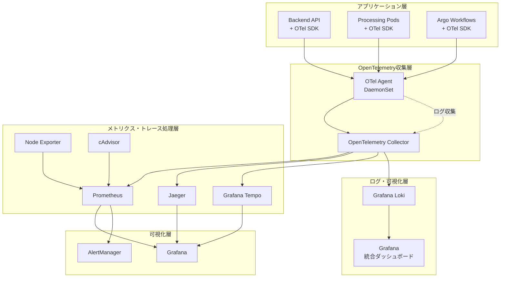
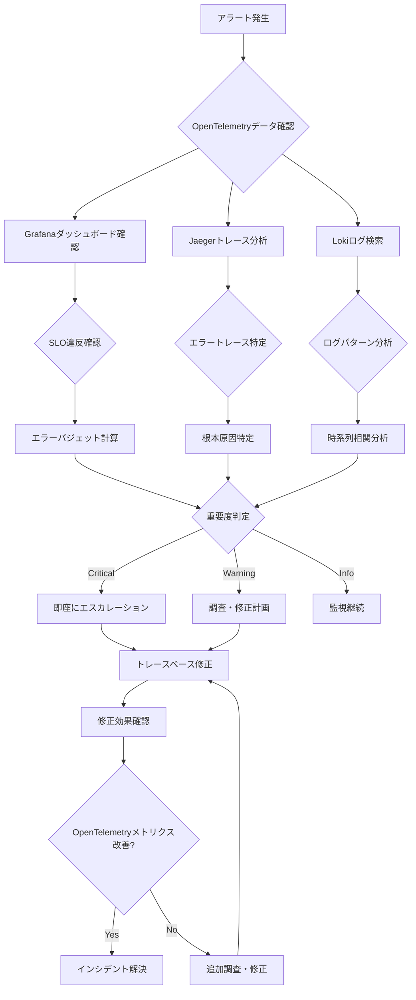

# ImageFlowCanvas 運用・監視設計書

## **文書管理情報**

| 項目       | 内容                             |
| ---------- | -------------------------------- |
| 文書名     | ImageFlowCanvas 運用・監視設計書 |
| バージョン | 1.0                              |
| 作成日     | 2025年7月12日                    |
| 更新日     | 2025年7月12日                    |


---

## **9. 運用・監視設計**

### **9.1. 監視アーキテクチャ**

#### **9.1.1. OpenTelemetryベース監視アーキテクチャ**



#### **9.1.2. 主要メトリクス**

| カテゴリ | メトリクス     | 説明                     | 閾値   |
| -------- | -------------- | ------------------------ | ------ |
| システム | CPU使用率      | ノード別CPU使用率        | > 80%  |
| システム | メモリ使用率   | ノード別メモリ使用率     | > 85%  |
| システム | ディスク使用率 | ストレージ使用率         | > 90%  |
| アプリ   | API応答時間    | REST API平均応答時間     | > 2秒  |
| アプリ   | エラー率       | HTTP 5xx エラー率        | > 5%   |
| アプリ   | 同時実行数     | パイプライン同時実行数   | > 100  |
| ビジネス | 処理成功率     | パイプライン成功率       | < 95%  |
| ビジネス | 平均処理時間   | パイプライン平均実行時間 | > 10分 |

### **9.2. ログ管理とObservability**

#### **9.2.1. OpenTelemetryログ統合**

```json
{
  "timestamp": "2025-07-12T10:30:00.123Z",
  "level": "info",
  "service": "backend-api",
  "version": "1.2.3",
  "trace_id": "abc123def456789012345678",
  "span_id": "def456ghi789",
  "user_id": "user-123",
  "execution_id": "exec-456",
  "message": "Pipeline execution started",
  "metadata": {
    "pipeline_id": "pipeline-789",
    "input_files": ["file1.jpg", "file2.jpg"],
    "parameters": {
      "resize_width": 800
    }
  },
  "otel": {
    "resource": {
      "service.name": "imageflow-backend-api",
      "service.version": "1.2.3",
      "deployment.environment": "production",
      "k8s.namespace.name": "imageflow-backend",
      "k8s.pod.name": "backend-api-7b8c9d5f6-xyz12"
    },
    "attributes": {
      "http.method": "POST",
      "http.url": "/v1/executions",
      "http.status_code": 202,
      "user.id": "user-123",
      "pipeline.id": "pipeline-789"
    }
  }
}
```

#### **9.2.2. OpenTelemetryログ収集パイプライン**

```yaml
# OpenTelemetry Collector設定（ログ特化）
apiVersion: v1
kind: ConfigMap
metadata:
  name: otel-collector-logs-config
  namespace: monitoring
data:
  config.yaml: |
    receivers:
      # コンテナログ受信
      filelog:
        include:
          - /var/log/containers/*.log
        exclude:
          - /var/log/containers/*otel-collector*.log
        operators:
          - type: json_parser
            timestamp:
              parse_from: attributes.time
              layout: '%Y-%m-%dT%H:%M:%S.%fZ'
          - type: add
            field: attributes.k8s_cluster
            value: "imageflow-production"
            
      # OTLP経由のアプリケーションログ
      otlp:
        protocols:
          grpc:
            endpoint: 0.0.0.0:4317
          http:
            endpoint: 0.0.0.0:4318
            
      # Kubernetesイベント
      k8s_events:
        auth_type: serviceAccount
        
    processors:
      # ログレベル正規化
      attributes:
        actions:
          - key: severity
            from_attribute: level
            action: upsert
          - key: log.level
            from_attribute: severity
            action: insert
            
      # リソース情報追加
      resource:
        attributes:
          - key: service.name
            from_attribute: k8s.container.name
            action: insert
          - key: service.namespace
            from_attribute: k8s.namespace.name
            action: insert
          - key: service.instance.id
            from_attribute: k8s.pod.name
            action: insert
            
      # バッチ処理
      batch:
        timeout: 5s
        send_batch_size: 512
        
      # ログサンプリング（デバッグログは10%、エラーログは100%）
      probabilistic_sampler:
        hash_seed: 22
        sampling_percentage: 10
        
    exporters:
      # Grafana Lokiエクスポート
      loki:
        endpoint: http://loki:3100/loki/api/v1/push
        tenant_id: "imageflow"
        labels:
          resource:
            - service.name
            - service.namespace
            - k8s.pod.name
          attributes:
            - severity
            - log.level
            
      # OpenSearch/Elasticsearchエクスポート（オプション）
      opensearch:
        endpoint: http://opensearch:9200
        index: "imageflow-logs-{yyyy.MM.dd}"
        
      # デバッグ用
      logging:
        loglevel: info
        
    service:
      pipelines:
        logs:
          receivers: [filelog, otlp, k8s_events]
          processors: [resource, attributes, batch]
          exporters: [loki, logging]
          
        logs/debug:
          receivers: [otlp]
          processors: [resource, attributes, probabilistic_sampler, batch]
          exporters: [loki]
```

#### **9.2.3. アプリケーションログ統合**

```python
# PythonアプリケーションでのOpenTelemetryログ統合
import logging
import json
from opentelemetry import trace
from opentelemetry.instrumentation.logging import LoggingInstrumentor
from opentelemetry.exporter.otlp.proto.grpc._log_exporter import OTLPLogExporter
from opentelemetry._logs import set_logger_provider
from opentelemetry.sdk._logs import LoggerProvider, LoggingHandler
from opentelemetry.sdk._logs.export import BatchLogRecordProcessor
from opentelemetry.sdk.resources import Resource

class StructuredOTelLogger:
    def __init__(self, service_name: str, service_version: str):
        # リソース設定
        resource = Resource.create({
            "service.name": service_name,
            "service.version": service_version,
            "service.namespace": "imageflow",
        })
        
        # ログプロバイダー設定
        logger_provider = LoggerProvider(resource=resource)
        
        # OTLPログエクスポーター
        otlp_exporter = OTLPLogExporter(
            endpoint="http://otel-collector:4317",
            insecure=True
        )
        
        # ログプロセッサー追加
        logger_provider.add_log_record_processor(
            BatchLogRecordProcessor(otlp_exporter)
        )
        
        set_logger_provider(logger_provider)
        
        # ログハンドラー設定
        handler = LoggingHandler(
            level=logging.NOTSET,
            logger_provider=logger_provider
        )
        
        # 標準ログ設定
        logging.basicConfig(
            level=logging.INFO,
            format='{"timestamp": "%(asctime)s", "level": "%(levelname)s", "service": "' + service_name + '", "message": "%(message)s", "trace_id": "%(otelTraceID)s", "span_id": "%(otelSpanID)s"}',
            handlers=[handler]
        )
        
        # OpenTelemetryログインストルメンテーション
        LoggingInstrumentor().instrument(set_logging_format=True)
        
        self.logger = logging.getLogger(service_name)
        self.tracer = trace.get_tracer(__name__)
    
    def log_with_trace_context(self, level: str, message: str, **kwargs):
        """トレースコンテキスト付きログ出力"""
        current_span = trace.get_current_span()
        
        log_record = {
            "message": message,
            "trace_id": f"{current_span.get_span_context().trace_id:032x}" if current_span else None,
            "span_id": f"{current_span.get_span_context().span_id:016x}" if current_span else None,
            **kwargs
        }
        
        getattr(self.logger, level.lower())(
            json.dumps(log_record),
            extra={"otel.trace_id": current_span.get_span_context().trace_id if current_span else None}
        )

# 使用例
logger = StructuredOTelLogger("image-processor", "v1.0")

with logger.tracer.start_as_current_span("process_image") as span:
    logger.log_with_trace_context("info", "Starting image processing",
                                   input_file="image.jpg",
                                   processing_params={"width": 800, "height": 600})
    
    try:
        # 画像処理実行
        result = process_image()
        
        logger.log_with_trace_context("info", "Image processing completed",
                                       output_file="processed_image.jpg",
                                       processing_time_ms=1250)
    except Exception as e:
        span.record_exception(e)
        logger.log_with_trace_context("error", f"Image processing failed: {str(e)}",
                                       error_type=type(e).__name__)
        raise
```

#### **9.2.4. ログ保持期間とアーカイブ戦略（OpenTelemetry統合）**

| ログ種別             | 保持期間 | 保存場所       | 用途               | OpenTelemetryメタデータ       | 収集方法          |
| -------------------- | -------- | -------------- | ------------------ | ----------------------------- | ----------------- |
| アプリケーションログ | 30日     | Grafana Loki   | デバッグ・監査     | trace_id, span_id, resource.* | OTLP gRPC/HTTP    |
| アクセスログ         | 90日     | Grafana Loki   | アクセス分析       | trace_id, user_id, http.*     | OTLP + Filelog    |
| セキュリティログ     | 1年      | 長期ストレージ | セキュリティ監査   | trace_id, user_id, security.* | OTLP + Archive    |
| システムログ         | 7日      | Grafana Loki   | システム診断       | resource.k8s.*, node.*        | Filelog Receiver  |
| トレースデータ       | 7日      | Jaeger/Tempo   | 分散トレーシング   | full trace context            | OTLP Receiver     |
| メトリクスデータ     | 6ヶ月    | Prometheus     | パフォーマンス分析 | labels, exemplars, trace_id   | OTLP + Prometheus |

#### **9.2.5. ログクエリとコリレーション**

```yaml
# Grafana Loki LogQLクエリ例（OpenTelemetry統合）
log_queries:
  # トレースIDでのログ相関検索
  trace_correlation: |
    {service_name="imageflow-backend"} 
    | json 
    | trace_id="4bf92f3577b34da6a3ce929d0e0e4736"
    
  # エラーログとトレース相関
  error_with_traces: |
    {service_name=~"imageflow-.*", level="error"} 
    | json 
    | trace_id != ""
    
  # 特定パイプライン実行のログ追跡
  pipeline_execution_logs: |
    {service_namespace="imageflow"} 
    | json 
    | execution_id="exec-123456"
    | line_format "{{.timestamp}} [{{.level}}] {{.message}}"
    
  # パフォーマンス分析用ログ
  performance_logs: |
    {service_name=~"imageflow-.*"} 
    | json 
    | duration_ms > 1000
    | stats avg(duration_ms) by service_name
    
  # セキュリティ監査ログ
  security_audit: |
    {service_name=~"imageflow-.*", level=~"warn|error"} 
    | json 
    | user_id != ""
    | line_format "{{.timestamp}} User:{{.user_id}} Action:{{.action}} Result:{{.result}}"
```

### **9.3. SLO/SLI設計とObservability**

#### **9.3.1. OpenTelemetryベースSLI定義**

| SLI カテゴリ | 指標名               | OpenTelemetry メトリクス                     | 計算方法            | 目標値  |
| ------------ | -------------------- | -------------------------------------------- | ------------------- | ------- |
| 可用性       | API可用性            | `http_requests_total`                        | (2xx + 3xx) / total | 99.9%   |
| レイテンシ   | API応答時間          | `http_request_duration_seconds`              | P95値               | < 2秒   |
| スループット | パイプライン処理能力 | `pipeline_executions_total`                  | 成功実行数/時間     | > 100/h |
| エラー率     | パイプライン失敗率   | `pipeline_executions_total{status="failed"}` | failed / total      | < 5%    |

#### **9.3.2. SLO監視クエリ**

```promql
# API可用性SLI
(
  sum(rate(http_requests_total{job="backend-api",code=~"2..|3.."}[5m])) /
  sum(rate(http_requests_total{job="backend-api"}[5m]))
) * 100

# APIレイテンシSLI（P95）
histogram_quantile(0.95, 
  sum(rate(http_request_duration_seconds_bucket{job="backend-api"}[5m])) by (le)
)

# パイプライン成功率SLI
(
  sum(rate(pipeline_executions_total{status="success"}[5m])) /
  sum(rate(pipeline_executions_total[5m]))
) * 100

# エラーバジェット消費率
1 - (
  sum(rate(pipeline_executions_total{status="success"}[28d])) /
  sum(rate(pipeline_executions_total[28d]))
)
```

#### **9.3.3. アラートルール（OpenTelemetry統合）**

```yaml
# Prometheus Alert Rules with OpenTelemetry metrics
groups:
- name: imageflow-slo-alerts
  rules:
  - alert: APIAvailabilitySLOBreach
    expr: |
      (
        sum(rate(http_requests_total{job="backend-api",code=~"2..|3.."}[5m])) /
        sum(rate(http_requests_total{job="backend-api"}[5m]))
      ) < 0.999
    for: 2m
    labels:
      severity: critical
      slo: availability
    annotations:
      summary: "API availability SLO breach"
      description: "API availability is {{ $value | humanizePercentage }} (below 99.9%)"
      trace_query: "jaeger?service=imageflow-backend-api&operation=http_request"
      
  - alert: APILatencySLOBreach
    expr: |
      histogram_quantile(0.95,
        sum(rate(http_request_duration_seconds_bucket{job="backend-api"}[5m])) by (le)
      ) > 2
    for: 5m
    labels:
      severity: warning
      slo: latency
    annotations:
      summary: "API latency SLO breach"
      description: "API P95 latency is {{ $value }}s (above 2s)"
      trace_query: "jaeger?service=imageflow-backend-api&tags={\"http.status_code\":\"5xx\"}"

  - alert: PipelineErrorRateSLOBreach
    expr: |
      (
        sum(rate(pipeline_executions_total{status=~"failed|error"}[5m])) /
        sum(rate(pipeline_executions_total[5m]))
      ) > 0.05
    for: 3m
    labels:
      severity: critical
      slo: error_rate
    annotations:
      summary: "Pipeline error rate SLO breach"
      description: "Pipeline error rate is {{ $value | humanizePercentage }} (above 5%)"
      trace_query: "jaeger?service=imageflow-processing&tags={\"error\":\"true\"}"
```

#### **9.3.4. OpenTelemetry統合観測可能性ダッシュボード**

```yaml
# Grafana統合ダッシュボード設定（OpenTelemetry Complete）
dashboard_config:
  title: "ImageFlow Canvas - Complete Observability"
  
  panels:
    # 分散トレーシングサービスマップ
    - title: "Service Map & Dependencies"
      type: "nodeGraph"
      datasource: "Jaeger"
      description: "OpenTelemetryトレースから生成されたサービス依存関係マップ"
      targets:
        - expr: "jaeger_service_dependencies"
          format: "node_graph"
      
    # SLO概要（OpenTelemetryメトリクス）
    - title: "SLO Dashboard"
      type: "stat"
      datasource: "Prometheus"
      targets:
        - expr: |
            (
              sum(rate(http_requests_total{service_name="imageflow-backend",status_code=~"2..|3.."}[5m])) /
              sum(rate(http_requests_total{service_name="imageflow-backend"}[5m]))
            ) * 100
          legendFormat: "API Availability"
        - expr: |
            histogram_quantile(0.95,
              sum(rate(http_request_duration_seconds_bucket{service_name="imageflow-backend"}[5m])) by (le)
            )
          legendFormat: "P95 Latency"
      thresholds:
        - { color: "green", value: 99.5 }
        - { color: "yellow", value: 99.0 }
        - { color: "red", value: 98.0 }
    
    # トレース分析とエラー率
    - title: "Error Rate with Trace Links"
      type: "timeseries"
      datasource: "Prometheus"
      targets:
        - expr: |
            rate(http_requests_total{service_name=~"imageflow-.*",status_code=~"5.."}[5m])
          legendFormat: "{{service_name}} - {{status_code}}"
      # Exemplarsでトレースリンクを表示
      exemplars: true
      
    # ログボリュームとエラー分析
    - title: "Log Volume & Error Analysis"
      type: "timeseries" 
      datasource: "Loki"
      targets:
        - expr: |
            sum(rate({service_namespace="imageflow"}[5m])) by (service_name, level)
          legendFormat: "{{service_name}} - {{level}}"
          
    # トレースレイテンシヒートマップ
    - title: "Trace Latency Heatmap"
      type: "heatmap"
      datasource: "Prometheus"
      targets:
        - expr: |
            increase(trace_duration_seconds_bucket{service_name=~"imageflow-.*"}[5m])
          legendFormat: "{{le}}"
          
    # カスタムビジネスメトリクス
    - title: "Business Metrics"
      type: "timeseries"
      datasource: "Prometheus"
      targets:
        - expr: "pipeline_executions_total"
          legendFormat: "Pipeline Executions"
        - expr: "ai_model_inference_duration_seconds"
          legendFormat: "AI Inference Time"
        - expr: "image_processing_throughput_bytes_per_second"
          legendFormat: "Processing Throughput"
          
    # ログストリーム（エラー重視）
    - title: "Recent Error Logs with Trace Context"
      type: "logs"
      datasource: "Loki"
      targets:
        - expr: |
            {service_namespace="imageflow", level=~"error|warn"} 
            | json 
            | line_format "{{.timestamp}} [{{.service_name}}] {{.message}} (trace: {{.trace_id}})"
      options:
        showTime: true
        showLabels: true
        enableLogDetails: true
        
    # OpenTelemetryコレクター健全性
    - title: "OpenTelemetry Collector Health"
      type: "stat"
      datasource: "Prometheus"
      targets:
        - expr: "up{job=~'.*otel-collector.*'}"
          legendFormat: "{{instance}}"
        - expr: "otelcol_process_uptime"
          legendFormat: "Uptime"
        - expr: "rate(otelcol_receiver_accepted_spans_total[5m])"
          legendFormat: "Spans/sec"
        - expr: "rate(otelcol_receiver_accepted_metric_points_total[5m])"
          legendFormat: "Metrics/sec"
        - expr: "rate(otelcol_receiver_accepted_log_records_total[5m])"
          legendFormat: "Logs/sec"

# アラート統合設定
alert_integrations:
  - name: "Trace-aware alerts"
    webhook_url: "http://alertmanager:9093/api/v1/alerts"
    templates:
      - alert: "HighErrorRateWithTraces"
        message: |
          Service {{.service_name}} has high error rate: {{.value}}%
          Recent traces: http://jaeger:16686/search?service={{.service_name}}&tags={"error":"true"}
          Recent logs: http://grafana:3000/explore?left=["now-1h","now","Loki",{"expr":"{service_name=\"{{.service_name}}\",level=\"error\"}"}]
```

#### **9.3.5. OpenTelemetryメトリクス統合運用**

```yaml
# 運用自動化スクリプト（OpenTelemetry統合）
apiVersion: v1
kind: ConfigMap
metadata:
  name: otel-operations-scripts
  namespace: monitoring
data:
  check-observability-health.sh: |
    #!/bin/bash
    # OpenTelemetry統合ヘルスチェック
    
    echo "=== OpenTelemetry Collector Health ==="
    kubectl get pods -n monitoring -l app=otel-collector
    
    echo "=== Metrics Collection Rate ==="
    curl -s "http://prometheus:9090/api/v1/query?query=rate(otelcol_receiver_accepted_metric_points_total[5m])" | jq '.data.result'
    
    echo "=== Trace Collection Rate ==="
    curl -s "http://prometheus:9090/api/v1/query?query=rate(otelcol_receiver_accepted_spans_total[5m])" | jq '.data.result'
    
    echo "=== Log Collection Rate ==="
    curl -s "http://prometheus:9090/api/v1/query?query=rate(otelcol_receiver_accepted_log_records_total[5m])" | jq '.data.result'
    
    echo "=== Service Discovery ==="
    curl -s "http://jaeger:16686/api/services" | jq '.data[]'
    
    echo "=== Recent Error Traces ==="
    curl -s "http://jaeger:16686/api/traces?service=imageflow-backend&tags={\"error\":\"true\"}&limit=5" | jq '.data[].traceID'
    
  generate-slo-report.py: |
    #!/usr/bin/env python3
    import requests
    import json
    from datetime import datetime, timedelta
    
    class ObservabilityReporter:
        def __init__(self):
            self.prometheus_url = "http://prometheus:9090"
            self.jaeger_url = "http://jaeger:16686"
            self.loki_url = "http://loki:3100"
            
        def generate_slo_report(self, hours=24):
            """OpenTelemetryデータを使ったSLOレポート生成"""
            end_time = datetime.now()
            start_time = end_time - timedelta(hours=hours)
            
            # SLI収集
            availability = self.get_availability_sli()
            latency_p95 = self.get_latency_p95_sli()
            error_rate = self.get_error_rate_sli()
            
            # トレース分析
            trace_analysis = self.analyze_traces(start_time, end_time)
            
            # ログ分析
            log_analysis = self.analyze_logs(start_time, end_time)
            
            report = {
                "report_period": {"start": start_time.isoformat(), "end": end_time.isoformat()},
                "sli_metrics": {
                    "availability": availability,
                    "latency_p95": latency_p95,
                    "error_rate": error_rate
                },
                "trace_analysis": trace_analysis,
                "log_analysis": log_analysis,
                "recommendations": self.generate_recommendations(availability, latency_p95, error_rate)
            }
            
            return json.dumps(report, indent=2)
            
        def get_availability_sli(self):
            query = """
            (
              sum(rate(http_requests_total{service_name="imageflow-backend",status_code=~"2..|3.."}[5m])) /
              sum(rate(http_requests_total{service_name="imageflow-backend"}[5m]))
            ) * 100
            """
            return self.query_prometheus(query)
            
        def analyze_traces(self, start_time, end_time):
            """分散トレース分析"""
            # Jaeger APIを使用してトレース分析
            params = {
                "service": "imageflow-backend",
                "start": int(start_time.timestamp() * 1000000),
                "end": int(end_time.timestamp() * 1000000),
                "limit": 100
            }
            
            response = requests.get(f"{self.jaeger_url}/api/traces", params=params)
            traces = response.json().get("data", [])
            
            return {
                "total_traces": len(traces),
                "avg_trace_duration": self.calculate_avg_trace_duration(traces),
                "error_traces": len([t for t in traces if self.has_error_spans(t)]),
                "slowest_operations": self.identify_slow_operations(traces)
            }
```

---

## **9.4. OpenTelemetryベース運用プロシージャ**

### **9.4.1. 日常運用チェックリスト（OpenTelemetry統合）**

| 項目                       | 頻度 | OpenTelemetryベース確認方法                    | 対応アクション                 |
| -------------------------- | ---- | ---------------------------------------------- | ------------------------------ |
| **OTelコレクター健全性**   | 毎時 | `kubectl get pods -l app=otel-collector`       | コレクター再起動、設定確認     |
| **テレメトリデータ収集率** | 毎時 | Prometheusで`otelcol_receiver_*`メトリクス確認 | サンプリング率調整、容量増設   |
| **分散トレース完全性**     | 毎時 | Jaegerでサービスマップとトレース欠損確認       | インストルメンテーション修正   |
| **SLI/SLO達成状況**        | 毎日 | OpenTelemetryメトリクスベースSLIダッシュボード | パフォーマンス改善、容量調整   |
| **エラートレース分析**     | 毎日 | Jaegerでエラータグ付きトレース分析             | 根本原因分析、修正計画策定     |
| **ログ相関分析**           | 毎日 | LokiでトレースID相関ログ検索                   | 異常パターン調査、アラート調整 |
| **リソース使用量**         | 毎日 | OpenTelemetryメトリクスによるリソース監視      | スケーリング、最適化           |
| **セキュリティ監査ログ**   | 週次 | 構造化ログでユーザー行動分析                   | セキュリティポリシー見直し     |

### **9.4.2. OpenTelemetryトラブルシューティングプレイブック**

```bash
# OpenTelemetry統合トラブルシューティングコマンド集

# 1. OpenTelemetryコレクター状況確認
echo "=== OTel Collector Status ==="
kubectl get pods -n monitoring -l app=otel-collector -o wide
kubectl logs -n monitoring deployment/otel-collector --tail=50

# 2. テレメトリデータ収集状況確認
echo "=== Telemetry Data Collection ==="
curl -s "http://prometheus:9090/api/v1/query?query=otelcol_receiver_accepted_spans_total" | jq
curl -s "http://prometheus:9090/api/v1/query?query=otelcol_receiver_accepted_metric_points_total" | jq
curl -s "http://prometheus:9090/api/v1/query?query=otelcol_receiver_accepted_log_records_total" | jq

# 3. サービス発見とトレース確認
echo "=== Service Discovery ==="
curl -s "http://jaeger:16686/api/services" | jq '.data[]'

# 4. 分散トレース完全性チェック
echo "=== Trace Completeness Check ==="
RECENT_TRACE=$(curl -s "http://jaeger:16686/api/traces?service=imageflow-backend&limit=1" | jq -r '.data[0].traceID')
curl -s "http://jaeger:16686/api/traces/${RECENT_TRACE}" | jq '.data[0].spans | length'

# 5. エラートレース詳細分析
echo "=== Error Trace Analysis ==="
curl -s "http://jaeger:16686/api/traces?service=imageflow-backend&tags={\"error\":\"true\"}&limit=5" | \
  jq '.data[] | {traceID, spans: [.spans[] | select(.tags[] | select(.key=="error" and .value=="true")) | .operationName]}'

# 6. ログとトレース相関確認
echo "=== Log-Trace Correlation ==="
TRACE_ID="your-trace-id-here"
curl -G "http://loki:3100/loki/api/v1/query" \
  --data-urlencode "query={service_namespace=\"imageflow\"} | json | trace_id=\"${TRACE_ID}\""

# 7. OpenTelemetryメトリクス健全性
echo "=== OTel Metrics Health ==="
curl -s "http://otel-collector:8889/metrics" | grep -E "(otelcol_|imageflow_)"

# 8. パフォーマンス異常検出
echo "=== Performance Anomaly Detection ==="
curl -s "http://prometheus:9090/api/v1/query?query=histogram_quantile(0.95, rate(http_request_duration_seconds_bucket[5m])) > 2" | jq

# 9. リソース制約確認
echo "=== Resource Constraints ==="
kubectl top pods -n monitoring --sort-by=memory
kubectl describe pod -n monitoring -l app=otel-collector | grep -A5 "Limits\|Requests"

# 10. OpenTelemetry設定検証
echo "=== OTel Configuration Validation ==="
kubectl get configmap otel-collector-config -n monitoring -o yaml | yq '.data."config.yaml"'
```

### **9.4.3. パフォーマンス最適化手順（OpenTelemetry）**

```yaml
# OpenTelemetryパフォーマンス最適化設定
optimization_procedures:
  
  # 1. サンプリング最適化
  sampling_optimization:
    head_sampling:  # フロントエンドサンプリング
      percentage: 10  # 10%サンプリング
      
    tail_sampling:  # バックエンドサンプリング
      policies:
        - name: "errors_always"
          type: "status_code" 
          status_code: [ERROR]
          
        - name: "slow_requests" 
          type: "latency"
          threshold_ms: 1000
          
        - name: "random_sampling"
          type: "probabilistic"
          percentage: 5
          
  # 2. バッチ処理最適化
  batch_optimization:
    timeout: 1s
    send_batch_size: 1024
    send_batch_max_size: 2048
    
  # 3. メモリ使用量最適化
  memory_optimization:
    limit_mib: 512
    spike_limit_mib: 128
    check_interval: 5s
    
  # 4. エクスポーター最適化
  exporter_optimization:
    prometheus:
      send_timestamps: false
      metric_expiration: 5m
      
    jaeger:
      queue_size: 1000
      num_workers: 8
      
    loki:
      batch_wait: 1s
      batch_size: 1024
```

### **9.4.4. インシデント対応フロー（OpenTelemetry統合）**



## **関連文書**

- [概要設計](./0300_概要設計.md)
- [インフラ設計](./0307_インフラ設計.md)
- [開発・デプロイ設計](./0309_開発デプロイ設計.md)
- [Argo Workflows設計](./0310_ArgoWorkflows設計.md)

---

**文書履歴**

| バージョン | 日付       | 変更内容                      | 作成者             |
| ---------- | ---------- | ----------------------------- | ------------------ |
| 1.0        | 2025-07-12 | 初版作成                      | システム設計チーム |
| 1.1        | 2025-07-20 | OpenTelemetry完全統合設計追加 | システム設計チーム |
