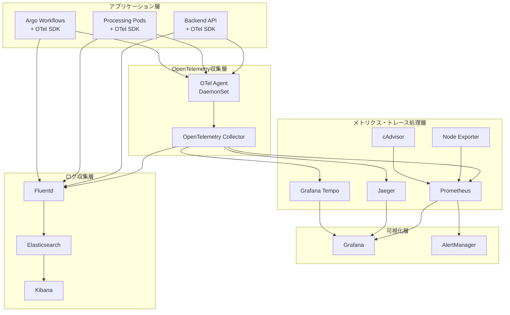

# ImageFlowCanvas 運用・監視設計書

## **文書管理情報**

| 項目       | 内容                             |
| ---------- | -------------------------------- |
| 文書名     | ImageFlowCanvas 運用・監視設計書 |
| バージョン | 1.0                              |
| 作成日     | 2025年7月12日                    |
| 更新日     | 2025年7月12日                    |


---

## **9. 運用・監視設計**

### **9.1. 監視アーキテクチャ**

#### **9.1.1. OpenTelemetryベース監視アーキテクチャ**



#### **9.1.2. 主要メトリクス**

| カテゴリ | メトリクス     | 説明                     | 閾値   |
| -------- | -------------- | ------------------------ | ------ |
| システム | CPU使用率      | ノード別CPU使用率        | > 80%  |
| システム | メモリ使用率   | ノード別メモリ使用率     | > 85%  |
| システム | ディスク使用率 | ストレージ使用率         | > 90%  |
| アプリ   | API応答時間    | REST API平均応答時間     | > 2秒  |
| アプリ   | エラー率       | HTTP 5xx エラー率        | > 5%   |
| アプリ   | 同時実行数     | パイプライン同時実行数   | > 100  |
| ビジネス | 処理成功率     | パイプライン成功率       | < 95%  |
| ビジネス | 平均処理時間   | パイプライン平均実行時間 | > 10分 |

### **9.2. ログ管理とObservability**

#### **9.2.1. OpenTelemetryログ統合**

```json
{
  "timestamp": "2025-07-12T10:30:00.123Z",
  "level": "info",
  "service": "backend-api",
  "version": "1.2.3",
  "trace_id": "abc123def456789012345678",
  "span_id": "def456ghi789",
  "user_id": "user-123",
  "execution_id": "exec-456",
  "message": "Pipeline execution started",
  "metadata": {
    "pipeline_id": "pipeline-789",
    "input_files": ["file1.jpg", "file2.jpg"],
    "parameters": {
      "resize_width": 800
    }
  },
  "otel": {
    "resource": {
      "service.name": "imageflow-backend-api",
      "service.version": "1.2.3",
      "deployment.environment": "production",
      "k8s.namespace.name": "imageflow-backend",
      "k8s.pod.name": "backend-api-7b8c9d5f6-xyz12"
    },
    "attributes": {
      "http.method": "POST",
      "http.url": "/v1/executions",
      "http.status_code": 202,
      "user.id": "user-123",
      "pipeline.id": "pipeline-789"
    }
  }
}
```

#### **9.2.2. ログ保持期間とアーカイブ戦略**

| ログ種別             | 保持期間 | 保存場所       | 用途               | OpenTelemetryメタデータ |
| -------------------- | -------- | -------------- | ------------------ | ----------------------- |
| アプリケーションログ | 30日     | Elasticsearch  | デバッグ・監査     | trace_id, span_id       |
| アクセスログ         | 90日     | Elasticsearch  | アクセス分析       | trace_id, user_id       |
| セキュリティログ     | 1年      | 長期ストレージ | セキュリティ監査   | trace_id, user_id       |
| システムログ         | 7日      | ローカル       | システム診断       | resource.attributes     |
| トレースデータ       | 7日      | Jaeger/Tempo   | 分散トレーシング   | full trace context      |
| メトリクスデータ     | 6ヶ月    | Prometheus     | パフォーマンス分析 | labels, exemplars       |

### **9.3. SLO/SLI設計とObservability**

#### **9.3.1. OpenTelemetryベースSLI定義**

| SLI カテゴリ | 指標名               | OpenTelemetry メトリクス                     | 計算方法            | 目標値  |
| ------------ | -------------------- | -------------------------------------------- | ------------------- | ------- |
| 可用性       | API可用性            | `http_requests_total`                        | (2xx + 3xx) / total | 99.9%   |
| レイテンシ   | API応答時間          | `http_request_duration_seconds`              | P95値               | < 2秒   |
| スループット | パイプライン処理能力 | `pipeline_executions_total`                  | 成功実行数/時間     | > 100/h |
| エラー率     | パイプライン失敗率   | `pipeline_executions_total{status="failed"}` | failed / total      | < 5%    |

#### **9.3.2. SLO監視クエリ**

```promql
# API可用性SLI
(
  sum(rate(http_requests_total{job="backend-api",code=~"2..|3.."}[5m])) /
  sum(rate(http_requests_total{job="backend-api"}[5m]))
) * 100

# APIレイテンシSLI（P95）
histogram_quantile(0.95, 
  sum(rate(http_request_duration_seconds_bucket{job="backend-api"}[5m])) by (le)
)

# パイプライン成功率SLI
(
  sum(rate(pipeline_executions_total{status="success"}[5m])) /
  sum(rate(pipeline_executions_total[5m]))
) * 100

# エラーバジェット消費率
1 - (
  sum(rate(pipeline_executions_total{status="success"}[28d])) /
  sum(rate(pipeline_executions_total[28d]))
)
```

#### **9.3.3. アラートルール（OpenTelemetry統合）**

```yaml
# Prometheus Alert Rules with OpenTelemetry metrics
groups:
- name: imageflow-slo-alerts
  rules:
  - alert: APIAvailabilitySLOBreach
    expr: |
      (
        sum(rate(http_requests_total{job="backend-api",code=~"2..|3.."}[5m])) /
        sum(rate(http_requests_total{job="backend-api"}[5m]))
      ) < 0.999
    for: 2m
    labels:
      severity: critical
      slo: availability
    annotations:
      summary: "API availability SLO breach"
      description: "API availability is {{ $value | humanizePercentage }} (below 99.9%)"
      trace_query: "jaeger?service=imageflow-backend-api&operation=http_request"
      
  - alert: APILatencySLOBreach
    expr: |
      histogram_quantile(0.95,
        sum(rate(http_request_duration_seconds_bucket{job="backend-api"}[5m])) by (le)
      ) > 2
    for: 5m
    labels:
      severity: warning
      slo: latency
    annotations:
      summary: "API latency SLO breach"
      description: "API P95 latency is {{ $value }}s (above 2s)"
      trace_query: "jaeger?service=imageflow-backend-api&tags={\"http.status_code\":\"5xx\"}"

  - alert: PipelineErrorRateSLOBreach
    expr: |
      (
        sum(rate(pipeline_executions_total{status=~"failed|error"}[5m])) /
        sum(rate(pipeline_executions_total[5m]))
      ) > 0.05
    for: 3m
    labels:
      severity: critical
      slo: error_rate
    annotations:
      summary: "Pipeline error rate SLO breach"
      description: "Pipeline error rate is {{ $value | humanizePercentage }} (above 5%)"
      trace_query: "jaeger?service=imageflow-processing&tags={\"error\":\"true\"}"
```

#### **9.3.4. Observabilityダッシュボード設計**

```yaml
# Grafana Dashboard for Observability
dashboard_panels:
  - title: "Service Map (Distributed Tracing)"
    type: "jaeger"
    description: "マイクロサービス間の依存関係とトレースフロー"
    
  - title: "SLO Overview"
    type: "stat"
    metrics:
      - api_availability_sli
      - api_latency_p95_sli
      - pipeline_success_rate_sli
    thresholds:
      - green: "> 99.5%"
      - yellow: "99% - 99.5%"
      - red: "< 99%"
    
  - title: "Error Rate Trends"
    type: "timeseries"
    metrics:
      - http_requests_total{code=~"5.."}
      - pipeline_executions_total{status="failed"}
    exemplars: true  # OpenTelemetryトレースリンク表示
    
  - title: "Trace Sampling and Volume"
    type: "timeseries"
    metrics:
      - otelcol_processor_batch_batch_send_size_sum
      - otelcol_exporter_sent_spans_total
      - jaeger_traces_received_total
    
  - title: "Custom Business Metrics"
    type: "timeseries"
    metrics:
      - pipeline_processing_steps_duration_seconds
      - ai_model_inference_duration_seconds
      - image_processing_throughput_bytes_per_second
```

---

## **関連文書**

- [概要設計](./0300_概要設計.md)
- [インフラ設計](./0307_インフラ設計.md)
- [開発・デプロイ設計](./0309_開発デプロイ設計.md)
