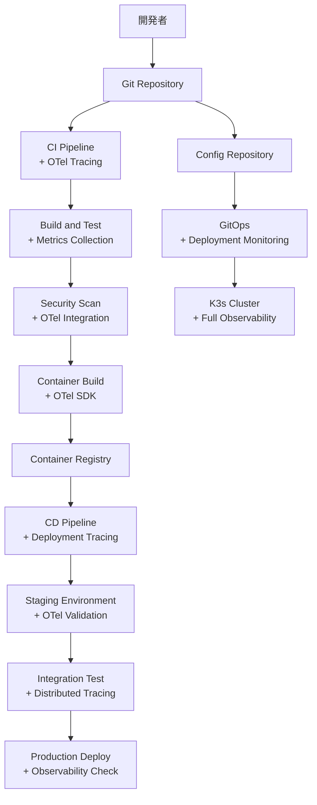

# ImageFlowCanvas 開発・デプロイ設計書

## **文書管理情報**

| 項目       | 内容                                 |
| ---------- | ------------------------------------ |
| 文書名     | ImageFlowCanvas 開発・デプロイ設計書 |
| バージョン | 1.0                                  |
| 作成日     | 2025年7月12日                        |
| 更新日     | 2025年7月12日                        |


---

## **10. 開発・デプロイ設計（OpenTelemetry統合）**

### **10.1. CI/CDパイプラインでのObservability**

#### **10.1.1. OpenTelemetry統合CI/CDワークフロー**



#### **10.1.2. GitHub Actions with OpenTelemetry**

```yaml
# .github/workflows/ci-with-otel.yml
name: CI/CD Pipeline with OpenTelemetry

on:
  push:
    branches: [main, develop]
  pull_request:
    branches: [main]

env:
  OTEL_EXPORTER_OTLP_ENDPOINT: "https://api.honeycomb.io"
  OTEL_EXPORTER_OTLP_HEADERS: "x-honeycomb-team=${{ secrets.HONEYCOMB_API_KEY }}"
  OTEL_SERVICE_NAME: "imageflow-ci-cd"
  OTEL_SERVICE_VERSION: ${{ github.sha }}

jobs:
  test:
    runs-on: ubuntu-latest
    steps:
    - uses: actions/checkout@v3
    
    - name: Setup OpenTelemetry
      run: |
        # OpenTelemetry CLI インストール
        curl -L https://github.com/open-telemetry/opentelemetry-collector-releases/releases/download/v0.97.0/otelcol_0.97.0_linux_amd64.tar.gz | tar xz
        ./otelcol --config .github/otel-ci-config.yaml &
        echo "OTEL_PID=$!" >> $GITHUB_ENV
    
    - name: Setup Python with OTel
      uses: actions/setup-python@v4
      with:
        python-version: '3.11'
        
    - name: Install dependencies with tracing
      run: |
        # OpenTelemetryで依存関係インストールを計測
        export OTEL_RESOURCE_ATTRIBUTES="ci.step=install_dependencies,ci.job=${{ github.job }}"
        pip install opentelemetry-distro opentelemetry-exporter-otlp
        opentelemetry-bootstrap -a install
        pip install -r requirements.txt
        pip install -r requirements-dev.txt
        
    - name: Lint with OpenTelemetry
      run: |
        export OTEL_RESOURCE_ATTRIBUTES="ci.step=lint,ci.job=${{ github.job }}"
        opentelemetry-instrument flake8 src/
        opentelemetry-instrument black --check src/
        opentelemetry-instrument mypy src/
        
    - name: Unit Tests with Tracing
      run: |
        export OTEL_RESOURCE_ATTRIBUTES="ci.step=unit_tests,ci.job=${{ github.job }}"
        opentelemetry-instrument pytest tests/unit/ --cov=src --cov-report=xml
        
    - name: Integration Tests with Distributed Tracing
      run: |
        export OTEL_RESOURCE_ATTRIBUTES="ci.step=integration_tests,ci.job=${{ github.job }}"
        docker-compose -f docker-compose.test.yml up -d
        # テスト環境にもOpenTelemetryエージェントを設定
        opentelemetry-instrument pytest tests/integration/
        docker-compose -f docker-compose.test.yml down
    
    - name: Upload Test Traces
      if: always()
      run: |
        # テスト実行のトレースデータをアップロード
        curl -X POST "${OTEL_EXPORTER_OTLP_ENDPOINT}/v1/traces" \
          -H "Content-Type: application/x-protobuf" \
          -H "$OTEL_EXPORTER_OTLP_HEADERS" \
          --data-binary @test-traces.pb
    
    - name: Cleanup OpenTelemetry
      if: always()
      run: |
        if [ ! -z "$OTEL_PID" ]; then
          kill $OTEL_PID
        fi

  security-with-observability:
    runs-on: ubuntu-latest
    steps:
    - uses: actions/checkout@v3
    
    - name: Security Scan with OTel
      run: |
        export OTEL_RESOURCE_ATTRIBUTES="ci.step=security_scan,ci.job=${{ github.job }}"
        # セキュリティスキャンの実行時間と結果を計測
        opentelemetry-instrument trivy fs --security-checks vuln,config .
        opentelemetry-instrument safety check -r requirements.txt

  build-with-observability:
    needs: [test, security-with-observability]
    runs-on: ubuntu-latest
    if: github.ref == 'refs/heads/main'
    steps:
    - uses: actions/checkout@v3
    
    - name: Build Docker Image with OTel
      run: |
        export OTEL_RESOURCE_ATTRIBUTES="ci.step=docker_build,ci.job=${{ github.job }}"
        # DockerビルドプロセスをOpenTelemetryで計測
        opentelemetry-instrument docker build \
          --build-arg OTEL_SDK_ENABLED=true \
          --build-arg OTEL_EXPORTER_OTLP_ENDPOINT=$OTEL_EXPORTER_OTLP_ENDPOINT \
          -t imageflow/backend-api:${{ github.sha }} .
        docker tag imageflow/backend-api:${{ github.sha }} imageflow/backend-api:latest
        
    - name: Container Image Scan
      run: |
        export OTEL_RESOURCE_ATTRIBUTES="ci.step=image_scan,ci.job=${{ github.job }}"
        opentelemetry-instrument trivy image imageflow/backend-api:${{ github.sha }}
        
    - name: Push with Build Telemetry
      run: |
        export OTEL_RESOURCE_ATTRIBUTES="ci.step=registry_push,ci.job=${{ github.job }}"
        echo "${{ secrets.DOCKER_PASSWORD }}" | docker login -u "${{ secrets.DOCKER_USERNAME }}" --password-stdin
        opentelemetry-instrument docker push imageflow/backend-api:${{ github.sha }}
        opentelemetry-instrument docker push imageflow/backend-api:latest

  deploy-with-monitoring:
    needs: build-with-observability
    runs-on: ubuntu-latest
    if: github.ref == 'refs/heads/main'
    steps:
    - name: Deploy with Observability Validation
      run: |
        export OTEL_RESOURCE_ATTRIBUTES="ci.step=deployment,ci.job=${{ github.job }}"
        
        # デプロイメント前のObservabilityチェック
        curl -f "http://otel-gateway.imageflow-observability:8888/metrics" || exit 1
        curl -f "http://jaeger.imageflow-observability:16686/api/services" || exit 1
        
        # Kubernetesマニフェスト更新（OpenTelemetry設定含む）
        git clone https://${{ secrets.GIT_TOKEN }}@github.com/org/imageflow-config.git
        cd imageflow-config
        
        # デプロイメント設定にOpenTelemetry環境変数を追加
        sed -i 's|imageflow/backend-api:.*|imageflow/backend-api:${{ github.sha }}|' k8s/backend-api/deployment.yaml
        
        # OpenTelemetry設定の更新も含める
        yq eval '.spec.template.spec.containers[0].env += [
          {"name": "OTEL_EXPORTER_OTLP_ENDPOINT", "value": "http://otel-gateway.imageflow-observability:4317"},
          {"name": "OTEL_SERVICE_VERSION", "value": "${{ github.sha }}"},
          {"name": "OTEL_RESOURCE_ATTRIBUTES", "value": "deployment.version=${{ github.sha }},deployment.environment=production"}
        ]' -i k8s/backend-api/deployment.yaml
        
        git add .
        git commit -m "Update backend-api to ${{ github.sha }} with OTel config"
        git push
        
    - name: Post-Deploy Observability Check
      run: |
        # デプロイ後のヘルスチェックとメトリクス確認
        sleep 60  # デプロイ完了待機
        
        # アプリケーションのヘルスチェック
        curl -f "https://api.imageflow.com/health" || exit 1
        
        # OpenTelemetryメトリクスの生成確認
        curl -s "http://prometheus.imageflow-monitoring:9090/api/v1/query?query=up{job='backend-api'}" | jq '.data.result[0].value[1]' | grep -q "1" || exit 1
        
        # 新バージョンのトレースが生成されているか確認
        curl -s "http://jaeger.imageflow-observability:16686/api/traces?service=imageflow-backend-api&tag=service.version:${{ github.sha }}" | jq '.data | length' | grep -q -v "0" || exit 1
```

### **10.2. OpenTelemetryテスト戦略**

#### **10.2.1. 計装テスト**

```python
# OpenTelemetry計装のテスト例
import pytest
from opentelemetry import trace
from opentelemetry.sdk.trace import TracerProvider
from opentelemetry.sdk.trace.export import SimpleSpanProcessor
from opentelemetry.sdk.trace.export.in_memory_span_exporter import InMemorySpanExporter

@pytest.fixture
def trace_setup():
    """テスト用のOpenTelemetryセットアップ"""
    tracer_provider = TracerProvider()
    memory_exporter = InMemorySpanExporter()
    span_processor = SimpleSpanProcessor(memory_exporter)
    tracer_provider.add_span_processor(span_processor)
    trace.set_tracer_provider(tracer_provider)
    
    yield memory_exporter
    
    # クリーンアップ
    memory_exporter.clear()

def test_pipeline_execution_tracing(trace_setup):
    """パイプライン実行のトレース生成をテスト"""
    from your_app import execute_pipeline
    
    # パイプライン実行
    result = execute_pipeline("test-pipeline", {"input": "test.jpg"})
    
    # トレースデータの検証
    spans = trace_setup.get_finished_spans()
    
    assert len(spans) > 0
    assert any(span.name == "execute_pipeline" for span in spans)
    
    root_span = next(span for span in spans if span.name == "execute_pipeline")
    assert root_span.attributes["pipeline.id"] == "test-pipeline"
    assert root_span.attributes["input.file_count"] == 1
    assert root_span.status.status_code == trace.StatusCode.OK
```

### **10.3. 本番環境でのObservability運用**

#### **10.3.1. OpenTelemetryサンプリング戦略**

```yaml
# 本番環境用サンプリング設定
sampling_strategies:
  default_strategy:
    type: probabilistic
    param: 0.001  # 0.1%のサンプリング率
  
  per_service_strategies:
    - service: "imageflow-backend-api"
      type: adaptive
      max_traces_per_second: 100
      
    - service: "imageflow-processing"
      type: probabilistic
      param: 0.01  # 1%のサンプリング率（処理ワークロードは詳細分析が必要）
      
    - service: "imageflow-frontend"
      type: probabilistic
      param: 0.0001  # 0.01%（UI系は低頻度）
  
  operation_strategies:
    - operation: "health_check"
      type: probabilistic
      param: 0.0001  # ヘルスチェックは最小限
      
    - operation: "pipeline_execution"
      type: adaptive
      max_traces_per_second: 50  # 重要な処理は詳細に
```

#### **10.3.2. アラートとエスカレーション**

```yaml
# OpenTelemetryベースアラート
alert_rules:
  - name: "High Trace Error Rate"
    condition: |
      (
        sum(rate(traces_total{status="error"}[5m])) /
        sum(rate(traces_total[5m]))
      ) > 0.05
    for: 2m
    severity: critical
    actions:
      - pagerduty: "on-call-team"
      - slack: "#incidents"
      - create_ticket: true
    
  - name: "OpenTelemetry Collector Down"
    condition: 'up{job="otel-collector"} == 0'
    for: 30s
    severity: critical
    actions:
      - pagerduty: "platform-team"
      - auto_restart: true
    
  - name: "High Sampling Drop Rate"
    condition: 'rate(otelcol_processor_dropped_spans_total[5m]) > 100'
    for: 1m
    severity: warning
    actions:
      - slack: "#observability"
      - scale_collector: true
```

---

## **付録：OpenTelemetry統合リファレンス**

### **A. OpenTelemetryバージョン互換性**

| コンポーネント          | バージョン | 互換性 |
| ----------------------- | ---------- | ------ |
| OpenTelemetry Collector | 0.97.0+    | 推奨   |
| Python SDK              | 1.21.0+    | 必須   |
| JavaScript SDK          | 1.18.0+    | 必須   |
| Go SDK                  | 1.21.0+    | 必須   |
| Jaeger                  | 1.57+      | 推奨   |
| Grafana Tempo           | 2.4.0+     | 推奨   |

### **B. OpenTelemetryメトリクス命名規則**

| プレフィックス          | 用途             | 例                                      |
| ----------------------- | ---------------- | --------------------------------------- |
| `imageflow_pipeline_`   | パイプライン関連 | `imageflow_pipeline_executions_total`   |
| `imageflow_processing_` | 画像処理関連     | `imageflow_processing_duration_seconds` |
| `imageflow_api_`        | API関連          | `imageflow_api_requests_total`          |
| `imageflow_storage_`    | ストレージ関連   | `imageflow_storage_operations_total`    |

### **C. トラブルシューティングガイド**

| 問題                   | 原因             | 解決方法                       |
| ---------------------- | ---------------- | ------------------------------ |
| トレースが表示されない | サンプリング設定 | サンプリング率を一時的に100%に |
| 高いメモリ使用量       | バッチサイズ設定 | Collectorのbatch_sizeを調整    |
| スパンが欠落           | ネットワーク問題 | OTel Agentの接続状況確認       |
| メトリクスが不正確     | 時刻同期問題     | NTPサーバーとの同期確認        |

---

## **関連文書**

- [概要設計](./0300_概要設計.md)
- [インフラ設計](./0307_インフラ設計.md)
- [運用・監視設計](./0308_運用監視設計.md)
