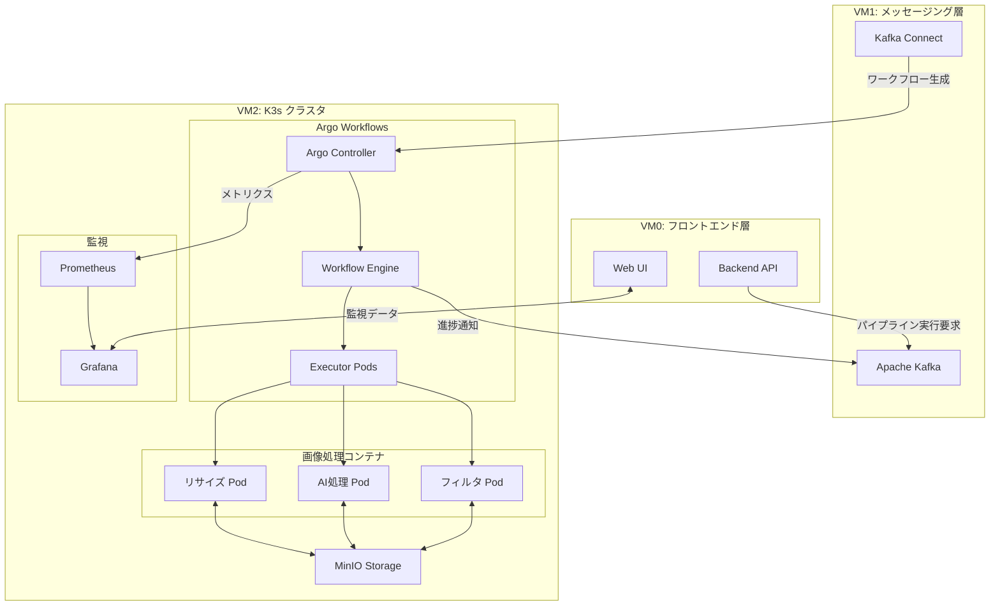

# ImageFlowCanvas Argo Workflows設計書

## **文書管理情報**

| 項目       | 内容                                                 |
| ---------- | ---------------------------------------------------- |
| 文書名     | ImageFlowCanvas Argo Workflows設計書                 |
| バージョン | 1.0                                                  |
| 作成日     | 2025年7月19日                                        |
| 更新日     | 2025年7月19日                                        |
| 関連文書   | 要件定義書、アーキテクチャ設計書、システム基本設計書 |

---

## **1. 概要**

### **1.1. 文書の目的**

本文書では、ImageFlowCanvasシステムにおけるArgo Workflowsの詳細設計について記述します。動的な画像処理パイプラインの実行エンジンとしてのArgo Workflowsの構成、ワークフロー定義、統合方式、運用方法について詳細に定義します。

### **1.2. Argo Workflowsの役割**

Argo WorkflowsはImageFlowCanvasシステムにおいて以下の役割を担います：

- **動的パイプライン実行**: ユーザーが定義した処理フローの動的実行
- **DAG管理**: 複雑な依存関係を持つ処理の順序制御
- **リソース管理**: Kubernetesクラスタ上での効率的なリソース配分
- **エラーハンドリング**: 処理失敗時の自動リトライと復旧
- **進捗監視**: リアルタイムでの実行状況追跡

---

## **2. アーキテクチャ設計**

### **2.1. システム内でのArgo Workflowsの位置づけ**



### **2.2. Argo Workflowsコンポーネント構成**

#### **2.2.1. コアコンポーネント**

| コンポーネント          | 役割                               | デプロイ方式   | リソース要件             |
| ----------------------- | ---------------------------------- | -------------- | ------------------------ |
| **Argo Controller**     | ワークフロー管理・スケジューリング | Deployment     | CPU: 100m, Memory: 128Mi |
| **Argo Server**         | Web UI・API提供                    | Deployment     | CPU: 100m, Memory: 128Mi |
| **Workflow Executor**   | 実際の処理実行                     | Pod (動的生成) | 処理内容により可変       |
| **Artifact Repository** | 中間成果物管理                     | MinIO統合      | N/A                      |

#### **2.2.2. Namespace構成**

```yaml
# Argo Workflowsの名前空間設計
apiVersion: v1
kind: Namespace
metadata:
  name: argo
  labels:
    app.kubernetes.io/name: argo-workflows
    app.kubernetes.io/component: workflow-controller
---
apiVersion: v1
kind: Namespace
metadata:
  name: image-processing
  labels:
    app.kubernetes.io/name: image-flow-canvas
    app.kubernetes.io/component: processing-pipelines
```

---

## **3. ワークフロー設計**

### **3.1. 動的パイプライン定義**

#### **3.1.1. パイプライン設定スキーマ**

```json
{
  "pipelineId": "string",
  "pipelineName": "string", 
  "version": "string",
  "metadata": {
    "createdBy": "string",
    "createdAt": "string",
    "description": "string"
  },
  "steps": [
    {
      "stepId": "string",
      "componentName": "string",
      "componentVersion": "string",
      "dependencies": ["string"],
      "parameters": {
        "key": "value"
      },
      "resources": {
        "cpu": "string",
        "memory": "string",
        "gpu": "string"
      },
      "retryPolicy": {
        "maxRetries": "number",
        "backoffFactor": "number"
      }
    }
  ],
  "globalParameters": {
    "inputPath": "string",
    "outputPath": "string",
    "executionId": "string"
  }
}
```

#### **3.1.2. ワークフローテンプレート生成**

```yaml
# 動的生成されるワークフローテンプレート例
apiVersion: argoproj.io/v1alpha1
kind: WorkflowTemplate
metadata:
  name: image-processing-pipeline-{{.PipelineId}}
  namespace: image-processing
spec:
  entrypoint: main
  
  # アーティファクト設定
  artifactRepositoryRef:
    configMap: artifact-repositories
    key: minio
  
  # グローバルパラメータ
  arguments:
    parameters:
    - name: execution-id
      value: "{{.ExecutionId}}"
    - name: input-path
      value: "{{.InputPath}}"
    - name: output-path
      value: "{{.OutputPath}}"
  
  # テンプレート定義
  templates:
  - name: main
    dag:
      tasks:
      {{range .Steps}}
      - name: {{.StepId}}
        template: {{.ComponentName}}
        {{if .Dependencies}}
        dependencies: [{{join .Dependencies ", "}}]
        {{end}}
        arguments:
          parameters:
          {{range $key, $value := .Parameters}}
          - name: {{$key}}
            value: "{{$value}}"
          {{end}}
      {{end}}
  
  {{range .UniqueComponents}}
  - name: {{.ComponentName}}
    container:
      image: {{.ImageRegistry}}/{{.ComponentName}}:{{.ComponentVersion}}
      command: [python, /app/main.py]
      env:
      - name: EXECUTION_ID
        value: "{{`{{workflow.parameters.execution-id}}`}}"
      - name: STEP_ID
        value: "{{`{{pod.name}}`}}"
      resources:
        requests:
          cpu: {{.Resources.CPU}}
          memory: {{.Resources.Memory}}
        {{if .Resources.GPU}}
        limits:
          nvidia.com/gpu: {{.Resources.GPU}}
        {{end}}
      volumeMounts:
      - name: minio-config
        mountPath: /etc/minio
        readOnly: true
    volumes:
    - name: minio-config
      secret:
        secretName: minio-credentials
    
    # リトライポリシー
    retryStrategy:
      limit: {{.RetryPolicy.MaxRetries}}
      backoff:
        duration: "30s"
        factor: {{.RetryPolicy.BackoffFactor}}
  {{end}}
```

### **3.2. 標準処理コンポーネント**

#### **3.2.1. リサイズコンポーネント**

```yaml
apiVersion: argoproj.io/v1alpha1
kind: WorkflowTemplate
metadata:
  name: resize-component
  namespace: image-processing
spec:
  templates:
  - name: resize
    inputs:
      parameters:
      - name: input-path
      - name: output-path  
      - name: width
        value: "800"
      - name: height
        value: "600"
      - name: maintain-aspect-ratio
        value: "true"
    container:
      image: imageflow/resize:v1.0
      command: [python, /app/resize.py]
      env:
      - name: INPUT_PATH
        value: "{{inputs.parameters.input-path}}"
      - name: OUTPUT_PATH
        value: "{{inputs.parameters.output-path}}"
      - name: WIDTH
        value: "{{inputs.parameters.width}}"
      - name: HEIGHT
        value: "{{inputs.parameters.height}}"
      - name: MAINTAIN_ASPECT_RATIO
        value: "{{inputs.parameters.maintain-aspect-ratio}}"
      - name: MINIO_ENDPOINT
        valueFrom:
          secretKeyRef:
            name: minio-credentials
            key: endpoint
      - name: MINIO_ACCESS_KEY
        valueFrom:
          secretKeyRef:
            name: minio-credentials
            key: access-key
      - name: MINIO_SECRET_KEY
        valueFrom:
          secretKeyRef:
            name: minio-credentials
            key: secret-key
      resources:
        requests:
          cpu: 100m
          memory: 256Mi
        limits:
          cpu: 500m
          memory: 512Mi
```

#### **3.2.2. AI処理コンポーネント**

```yaml
apiVersion: argoproj.io/v1alpha1
kind: WorkflowTemplate
metadata:
  name: ai-processing-component
  namespace: image-processing
spec:
  templates:
  - name: object-detection
    inputs:
      parameters:
      - name: input-path
      - name: output-path
      - name: model-name
        value: "yolo11"
      - name: confidence-threshold
        value: "0.5"
      - name: nms-threshold
        value: "0.4"
    container:
      image: imageflow/ai-processing:v1.0
      command: [python, /app/detect.py]
      env:
      - name: INPUT_PATH
        value: "{{inputs.parameters.input-path}}"
      - name: OUTPUT_PATH
        value: "{{inputs.parameters.output-path}}"
      - name: MODEL_NAME
        value: "{{inputs.parameters.model-name}}"
      - name: CONFIDENCE_THRESHOLD
        value: "{{inputs.parameters.confidence-threshold}}"
      - name: NMS_THRESHOLD
        value: "{{inputs.parameters.nms-threshold}}"
      - name: TRITON_SERVER_URL
        value: "triton-server:8000"
      resources:
        requests:
          cpu: 500m
          memory: 1Gi
        limits:
          cpu: 2
          memory: 4Gi
          nvidia.com/gpu: 1
      volumeMounts:
      - name: model-storage
        mountPath: /models
        readOnly: true
    volumes:
    - name: model-storage
      persistentVolumeClaim:
        claimName: triton-model-pvc
```

#### **3.2.3. フィルタコンポーネント**

```yaml
apiVersion: argoproj.io/v1alpha1
kind: WorkflowTemplate
metadata:
  name: filter-component
  namespace: image-processing
spec:
  templates:
  - name: apply-filter
    inputs:
      parameters:
      - name: input-path
      - name: output-path
      - name: filter-type
        value: "gaussian"
      - name: filter-intensity
        value: "1.0"
    container:
      image: imageflow/filter:v1.0
      command: [python, /app/filter.py]
      env:
      - name: INPUT_PATH
        value: "{{inputs.parameters.input-path}}"
      - name: OUTPUT_PATH
        value: "{{inputs.parameters.output-path}}"
      - name: FILTER_TYPE
        value: "{{inputs.parameters.filter-type}}"
      - name: FILTER_INTENSITY
        value: "{{inputs.parameters.filter-intensity}}"
      resources:
        requests:
          cpu: 100m
          memory: 256Mi
        limits:
          cpu: 500m
          memory: 512Mi
```

---

## **4. 統合設計**

### **4.1. Kafkaとの統合**

#### **4.1.1. ワークフロー実行トリガー**

```go
// Kafka Consumer for Pipeline Execution
type PipelineExecutionMessage struct {
    ExecutionID    string            `json:"execution_id"`
    PipelineConfig PipelineConfig    `json:"pipeline_config"`
    InputData      InputDataInfo     `json:"input_data"`
    Parameters     map[string]string `json:"parameters"`
}

type ArgoWorkflowService struct {
    argoClient     argoclientv1alpha1.WorkflowInterface
    templateEngine *template.Template
}

func (s *ArgoWorkflowService) ProcessPipelineExecution(msg PipelineExecutionMessage) error {
    // 1. ワークフローテンプレート生成
    workflow, err := s.generateWorkflow(msg)
    if err != nil {
        return fmt.Errorf("failed to generate workflow: %w", err)
    }
    
    // 2. Argo Workflowsに実行要求送信
    createdWf, err := s.argoClient.Create(context.TODO(), workflow, metav1.CreateOptions{})
    if err != nil {
        return fmt.Errorf("failed to create workflow: %w", err)
    }
    
    // 3. 実行開始通知をKafkaに送信
    s.publishExecutionStarted(msg.ExecutionID, createdWf.Name)
    
    return nil
}
```

#### **4.1.2. 進捗通知システム**

```yaml
# ワークフロー内の進捗通知設定
apiVersion: argoproj.io/v1alpha1
kind: WorkflowTemplate
metadata:
  name: progress-notifier
  namespace: image-processing
spec:
  templates:
  - name: notify-progress
    inputs:
      parameters:
      - name: execution-id
      - name: step-id
      - name: status
      - name: message
    script:
      image: confluentinc/cp-kafka:latest
      command: [sh]
      source: |
        cat <<EOF | kafka-console-producer --broker-list kafka:9092 --topic pipeline-progress
        {
          "execution_id": "{{inputs.parameters.execution-id}}",
          "step_id": "{{inputs.parameters.step-id}}",
          "status": "{{inputs.parameters.status}}",
          "message": "{{inputs.parameters.message}}",
          "timestamp": "$(date -u +%Y-%m-%dT%H:%M:%SZ)"
        }
        EOF
```

### **4.2. MinIOとの統合**

#### **4.2.1. アーティファクトリポジトリ設定**

```yaml
apiVersion: v1
kind: ConfigMap
metadata:
  name: artifact-repositories
  namespace: image-processing
data:
  minio: |
    s3:
      endpoint: minio:9000
      insecure: true
      bucket: image-flow-artifacts
      keyFormat: "artifacts/{{workflow.namespace}}/{{workflow.name}}/{{pod.name}}"
      accessKeySecret:
        name: minio-credentials
        key: access-key
      secretKeySecret:
        name: minio-credentials
        key: secret-key
```

#### **4.2.2. データフロー管理**

```python
# 処理コンテナ内でのMinIO統合例
import boto3
from minio import Minio
import os

class MinIODataManager:
    def __init__(self):
        self.client = Minio(
            endpoint=os.environ['MINIO_ENDPOINT'],
            access_key=os.environ['MINIO_ACCESS_KEY'],
            secret_key=os.environ['MINIO_SECRET_KEY'],
            secure=False
        )
        self.bucket = 'image-flow-data'
    
    def download_input(self, object_path: str, local_path: str):
        """入力データをダウンロード"""
        self.client.fget_object(self.bucket, object_path, local_path)
    
    def upload_output(self, local_path: str, object_path: str):
        """出力データをアップロード"""
        self.client.fput_object(self.bucket, object_path, local_path)
    
    def upload_metadata(self, metadata: dict, object_path: str):
        """メタデータをJSONとしてアップロード"""
        import json
        json_data = json.dumps(metadata)
        self.client.put_object(
            self.bucket, 
            object_path, 
            io.BytesIO(json_data.encode()),
            len(json_data),
            content_type='application/json'
        )
```

---

## **5. エラーハンドリング・リトライ戦略**

### **5.1. 階層的エラーハンドリング**

#### **5.1.1. ステップレベルエラーハンドリング**

```yaml
# リトライ戦略の設定
apiVersion: argoproj.io/v1alpha1
kind: WorkflowTemplate
metadata:
  name: error-handling-example
spec:
  templates:
  - name: robust-processing-step
    retryStrategy:
      limit: 3
      backoff:
        duration: "30s"
        factor: 2
        maxDuration: "5m"
      retryPolicy: "Always"
      expression: "asInt(lastRetry.exitCode) != 2"  # exitCode=2の場合はリトライしない
    
    container:
      image: imageflow/processing:v1.0
      command: [python, /app/main.py]
      
    # 失敗時のクリーンアップ処理
    onExit:
      template: cleanup-on-failure
      when: "{{status}} != Succeeded"
  
  - name: cleanup-on-failure
    script:
      image: imageflow/utils:v1.0
      command: [sh]
      source: |
        echo "Cleaning up failed step resources..."
        # 一時ファイルの削除
        # エラーログの保存
        # 通知の送信
```

#### **5.1.2. パイプラインレベルエラーハンドリング**

```yaml
# パイプライン全体のエラーハンドリング
apiVersion: argoproj.io/v1alpha1
kind: Workflow
metadata:
  name: pipeline-with-error-handling
spec:
  entrypoint: main
  
  # 全体の失敗時処理
  onExit: pipeline-cleanup
  
  templates:
  - name: main
    dag:
      failFast: false  # 一部失敗でも他のステップを継続
      tasks:
      - name: step1
        template: processing-step-1
        
      - name: step2
        template: processing-step-2
        dependencies: [step1]
        
      - name: step3
        template: processing-step-3
        dependencies: [step1]
        
      # エラー通知専用タスク
      - name: error-notification
        template: notify-error
        dependencies: [step1, step2, step3]
        when: "{{workflow.status}} == Failed"
  
  - name: pipeline-cleanup
    script:
      image: imageflow/utils:v1.0
      command: [python]
      source: |
        import requests
        import os
        
        # 実行状況をKafkaに通知
        status = "{{workflow.status}}"
        execution_id = "{{workflow.parameters.execution-id}}"
        
        notification = {
            "execution_id": execution_id,
            "status": status,
            "completed_at": "{{workflow.finishedAt}}",
            "message": "Pipeline execution completed with status: " + status
        }
        
        # Kafka通知（簡易実装）
        # 実際はKafka Pythonクライアントを使用
        print(f"Sending notification: {notification}")
```

### **5.2. 部分的障害の回復**

#### **5.2.1. ステップスキップ機能**

```yaml
# 特定ステップをスキップしてパイプラインを継続
apiVersion: argoproj.io/v1alpha1
kind: WorkflowTemplate
metadata:
  name: skip-on-failure-template
spec:
  templates:
  - name: optional-processing-step
    inputs:
      parameters:
      - name: skip-on-failure
        value: "true"
    
    steps:
    - - name: main-processing
        template: processing-logic
        continueOn:
          failed: "{{inputs.parameters.skip-on-failure}}"
    
    - - name: fallback-processing
        template: fallback-logic
        when: "{{steps.main-processing.status}} == Failed"
```

---

## **6. 監視・ログ設計**

### **6.1. メトリクス収集**

#### **6.1.1. Prometheusメトリクス設定**

```yaml
# Argo Workflowsメトリクス設定
apiVersion: v1
kind: ConfigMap
metadata:
  name: workflow-controller-configmap
  namespace: argo
data:
  config: |
    # メトリクス設定
    metricsConfig:
      enabled: true
      path: /metrics
      port: 9090
      
    # カスタムメトリクス
    telemetryConfig:
      enabled: true
      path: /telemetry
      port: 8080
      
    # ワークフロー保持ポリシー
    retentionPolicy:
      completed: 720h  # 30日
      failed: 720h
      succeeded: 168h  # 7日
```

#### **6.1.2. カスタムメトリクス定義**

```go
// カスタムメトリクス定義
var (
    pipelineExecutionDuration = prometheus.NewHistogramVec(
        prometheus.HistogramOpts{
            Name: "imageflow_pipeline_execution_duration_seconds",
            Help: "Duration of pipeline executions",
            Buckets: prometheus.ExponentialBuckets(1, 2, 10),
        },
        []string{"pipeline_id", "status"},
    )
    
    stepExecutionCounter = prometheus.NewCounterVec(
        prometheus.CounterOpts{
            Name: "imageflow_step_executions_total",
            Help: "Total number of step executions",
        },
        []string{"step_type", "status"},
    )
    
    resourceUtilizationGauge = prometheus.NewGaugeVec(
        prometheus.GaugeOpts{
            Name: "imageflow_resource_utilization",
            Help: "Resource utilization per component",
        },
        []string{"component", "resource_type"},
    )
)
```

### **6.2. ログ収集・分析**

#### **6.2.1. 構造化ログ設計**

```json
{
  "timestamp": "2025-07-19T10:30:00Z",
  "level": "INFO",
  "logger": "imageflow.processing",
  "execution_id": "exec_123456789",
  "workflow_name": "image-pipeline-abc",
  "step_id": "resize-001",
  "component": "resize",
  "message": "Image resizing completed successfully",
  "metadata": {
    "input_size": "1920x1080",
    "output_size": "800x600",
    "processing_time_ms": 1250,
    "cpu_usage_percent": 45.2,
    "memory_usage_mb": 256
  },
  "tags": {
    "environment": "production",
    "cluster": "k3s-main",
    "namespace": "image-processing"
  }
}
```

#### **6.2.2. ログ収集パイプライン**

```yaml
# Fluent Bitログ収集設定
apiVersion: v1
kind: ConfigMap
metadata:
  name: fluent-bit-config
  namespace: image-processing
data:
  fluent-bit.conf: |
    [SERVICE]
        Flush         1
        Log_Level     info
        Daemon        off
        Parsers_File  parsers.conf
        
    [INPUT]
        Name              tail
        Path              /var/log/containers/*image-processing*.log
        Parser            docker
        Tag               kube.*
        Refresh_Interval  5
        
    [FILTER]
        Name                kubernetes
        Match               kube.*
        Kube_URL            https://kubernetes.default.svc:443
        Kube_CA_File        /var/run/secrets/kubernetes.io/serviceaccount/ca.crt
        Kube_Token_File     /var/run/secrets/kubernetes.io/serviceaccount/token
        
    [OUTPUT]
        Name  kafka
        Match *
        Brokers kafka:9092
        Topics  imageflow-logs
        Format  json
```

---

## **7. セキュリティ設計**

### **7.1. 認証・認可**

#### **7.1.1. ServiceAccount設定**

```yaml
# 処理コンテナ用ServiceAccount
apiVersion: v1
kind: ServiceAccount
metadata:
  name: image-processing-sa
  namespace: image-processing
---
apiVersion: rbac.authorization.k8s.io/v1
kind: Role
metadata:
  name: image-processing-role
  namespace: image-processing
rules:
- apiGroups: [""]
  resources: ["secrets", "configmaps"]
  verbs: ["get", "list"]
- apiGroups: [""]
  resources: ["pods"]
  verbs: ["get", "list", "watch"]
---
apiVersion: rbac.authorization.k8s.io/v1
kind: RoleBinding
metadata:
  name: image-processing-binding
  namespace: image-processing
subjects:
- kind: ServiceAccount
  name: image-processing-sa
  namespace: image-processing
roleRef:
  kind: Role
  name: image-processing-role
  apiGroup: rbac.authorization.k8s.io
```

#### **7.1.2. Secret管理**

```yaml
# MinIO認証情報
apiVersion: v1
kind: Secret
metadata:
  name: minio-credentials
  namespace: image-processing
type: Opaque
data:
  endpoint: bWluaW86OTAwMA==  # minio:9000
  access-key: <base64-encoded-access-key>
  secret-key: <base64-encoded-secret-key>
---
# Kafka認証情報
apiVersion: v1
kind: Secret
metadata:
  name: kafka-credentials
  namespace: image-processing
type: Opaque
data:
  bootstrap-servers: a2Fma2E6OTA5Mg==  # kafka:9092
  username: <base64-encoded-username>
  password: <base64-encoded-password>
```

### **7.2. ネットワークセキュリティ**

#### **7.2.1. NetworkPolicy設定**

```yaml
# 画像処理Podのネットワーク制限
apiVersion: networking.k8s.io/v1
kind: NetworkPolicy
metadata:
  name: image-processing-network-policy
  namespace: image-processing
spec:
  podSelector:
    matchLabels:
      app.kubernetes.io/component: image-processor
  policyTypes:
  - Ingress
  - Egress
  
  # 受信トラフィック制限
  ingress:
  - from:
    - namespaceSelector:
        matchLabels:
          name: argo
    - podSelector:
        matchLabels:
          app.kubernetes.io/name: argo-workflows
  
  # 送信トラフィック制限
  egress:
  - to:
    - namespaceSelector:
        matchLabels:
          name: storage
    ports:
    - protocol: TCP
      port: 9000  # MinIO
  - to:
    - namespaceSelector:
        matchLabels:
          name: messaging
    ports:
    - protocol: TCP
      port: 9092  # Kafka
  - to: []  # DNS解決用
    ports:
    - protocol: UDP
      port: 53
```

---

## **8. 運用設計**

### **8.1. デプロイメント戦略**

#### **8.1.1. Argo Workflows基本デプロイ**

```yaml
# Argo Workflowsデプロイメント
apiVersion: argoproj.io/v1alpha1
kind: Application
metadata:
  name: argo-workflows
  namespace: argocd
spec:
  project: default
  source:
    repoURL: https://argoproj.github.io/argo-helm
    chart: argo-workflows
    targetRevision: 0.40.0
    helm:
      values: |
        controller:
          resources:
            requests:
              cpu: 100m
              memory: 256Mi
            limits:
              cpu: 500m
              memory: 512Mi
          
          # メトリクス有効化
          metricsConfig:
            enabled: true
            
          # ワークフロー保持設定
          retentionPolicy:
            completed: 168h
            failed: 720h
            
        server:
          enabled: true
          resources:
            requests:
              cpu: 100m
              memory: 128Mi
            limits:
              cpu: 200m
              memory: 256Mi
              
          # セキュリティ設定
          authModes: ["server"]
          
        # アーティファクトリポジトリ設定
        artifactRepository:
          s3:
            endpoint: minio:9000
            insecure: true
            bucket: argo-artifacts
            accessKeySecret:
              name: minio-credentials
              key: access-key
            secretKeySecret:
              name: minio-credentials
              key: secret-key
              
  destination:
    server: https://kubernetes.default.svc
    namespace: argo
    
  syncPolicy:
    automated:
      prune: true
      selfHeal: true
    syncOptions:
    - CreateNamespace=true
```

#### **8.1.2. 設定管理**

```yaml
# ワークフロー設定ConfigMap
apiVersion: v1
kind: ConfigMap
metadata:
  name: workflow-configuration
  namespace: image-processing
data:
  default-resources.yaml: |
    # デフォルトリソース設定
    resources:
      small:
        cpu: "100m"
        memory: "256Mi"
      medium:
        cpu: "500m"
        memory: "1Gi"
      large:
        cpu: "2"
        memory: "4Gi"
      gpu:
        cpu: "1"
        memory: "4Gi"
        gpu: "1"
        
  component-registry.yaml: |
    # 利用可能コンポーネント定義
    components:
      resize:
        image: "imageflow/resize"
        versions: ["v1.0", "v1.1"]
        defaultResources: "small"
        parameters:
          - name: width
            type: integer
            default: 800
          - name: height
            type: integer
            default: 600
            
      object-detection:
        image: "imageflow/ai-processing"
        versions: ["v1.0"]
        defaultResources: "gpu"
        parameters:
          - name: model-name
            type: string
            default: "yolo11"
          - name: confidence-threshold
            type: float
            default: 0.5
```

### **8.2. 運用監視**

#### **8.2.1. ヘルスチェック**

```yaml
# Argo Workflowsヘルスチェック
apiVersion: v1
kind: Service
metadata:
  name: argo-workflows-health
  namespace: argo
spec:
  selector:
    app: workflow-controller
  ports:
  - name: metrics
    port: 9090
    targetPort: 9090
---
apiVersion: monitoring.coreos.com/v1
kind: ServiceMonitor
metadata:
  name: argo-workflows-controller
  namespace: argo
spec:
  selector:
    matchLabels:
      app: workflow-controller
  endpoints:
  - port: metrics
    interval: 30s
    path: /metrics
```

#### **8.2.2. アラート設定**

```yaml
# PrometheusRuleでアラート定義
apiVersion: monitoring.coreos.com/v1
kind: PrometheusRule
metadata:
  name: imageflow-alerts
  namespace: image-processing
spec:
  groups:
  - name: imageflow.rules
    rules:
    - alert: PipelineExecutionFailureRate
      expr: rate(argo_workflow_status_phase{phase="Failed"}[5m]) > 0.1
      for: 2m
      labels:
        severity: warning
      annotations:
        summary: "High pipeline failure rate detected"
        description: "Pipeline failure rate is {{ $value }} over the last 5 minutes"
        
    - alert: WorkflowControllerDown
      expr: up{job="argo-workflows-controller"} == 0
      for: 1m
      labels:
        severity: critical
      annotations:
        summary: "Argo Workflows Controller is down"
        description: "Argo Workflows Controller has been down for more than 1 minute"
        
    - alert: LongRunningPipeline
      expr: time() - argo_workflow_created_time > 3600
      for: 0m
      labels:
        severity: warning
      annotations:
        summary: "Pipeline running for more than 1 hour"
        description: "Workflow {{ $labels.name }} has been running for more than 1 hour"
```

### **8.3. 運用プロシージャ**

#### **8.3.1. 日常運用チェックリスト**

| 項目                     | 頻度 | 確認方法                   | 対応アクション                   |
| ------------------------ | ---- | -------------------------- | -------------------------------- |
| **ワークフロー実行状況** | 毎時 | `kubectl get workflows -A` | 長時間実行中のワークフローを調査 |
| **リソース使用率**       | 毎時 | Grafanaダッシュボード確認  | 高負荷時のスケーリング検討       |
| **失敗率**               | 毎日 | Prometheusメトリクス確認   | 閾値超過時の原因調査             |
| **ストレージ使用量**     | 毎日 | MinIO管理画面確認          | 不要ファイルのクリーンアップ     |
| **ログエラー**           | 毎日 | ログ分析ツールで確認       | エラーパターンの分析・対策       |

#### **8.3.2. トラブルシューティング**

```bash
# よく使用するトラブルシューティングコマンド

# 1. ワークフロー状況確認
kubectl get workflows -n image-processing
kubectl describe workflow <workflow-name> -n image-processing

# 2. ワークフロー詳細ログ確認
kubectl logs -n argo deployment/workflow-controller
argo logs <workflow-name> -n image-processing

# 3. 失敗したPodの調査
kubectl get pods -n image-processing --field-selector=status.phase=Failed
kubectl logs <failed-pod-name> -n image-processing

# 4. リソース使用状況確認
kubectl top nodes
kubectl top pods -n image-processing

# 5. イベント確認
kubectl get events -n image-processing --sort-by='.lastTimestamp'
```

---

## **9. 性能・拡張性考慮事項**

### **9.1. スケーリング戦略**

#### **9.1.1. 水平スケーリング**

```yaml
# HorizontalPodAutoscaler設定
apiVersion: autoscaling/v2
kind: HorizontalPodAutoscaler
metadata:
  name: argo-controller-hpa
  namespace: argo
spec:
  scaleTargetRef:
    apiVersion: apps/v1
    kind: Deployment
    name: workflow-controller
  minReplicas: 1
  maxReplicas: 3
  metrics:
  - type: Resource
    resource:
      name: cpu
      target:
        type: Utilization
        averageUtilization: 70
  - type: Resource
    resource:
      name: memory
      target:
        type: Utilization
        averageUtilization: 80
```

#### **9.1.2. リソース制限最適化**

```yaml
# リソース制限の段階的設定
apiVersion: v1
kind: LimitRange
metadata:
  name: image-processing-limits
  namespace: image-processing
spec:
  limits:
  - default:
      cpu: "500m"
      memory: "1Gi"
    defaultRequest:
      cpu: "100m"
      memory: "256Mi"
    max:
      cpu: "4"
      memory: "8Gi"
      nvidia.com/gpu: "2"
    min:
      cpu: "50m"
      memory: "128Mi"
    type: Container
```

### **9.2. パフォーマンス最適化**

#### **9.2.1. ワークフロー並列実行制限**

```yaml
# 同時実行制限設定
apiVersion: v1
kind: ConfigMap
metadata:
  name: workflow-controller-configmap
  namespace: argo
data:
  config: |
    # 全体同時実行制限
    parallelism: 10
    
    # Namespace別制限
    namespaceParallelism:
      image-processing: 5
      
    # リソース制限
    resourceQuota:
      requests.cpu: "10"
      requests.memory: "20Gi"
      nvidia.com/gpu: "4"
```

---

## **10. まとめ**

### **10.1. 実装優先度**

| フェーズ    | 実装項目                         | 期間  |
| ----------- | -------------------------------- | ----- |
| **Phase 1** | 基本ワークフロー実行、MinIO統合  | 2週間 |
| **Phase 2** | Kafka統合、リアルタイム通知      | 1週間 |
| **Phase 3** | エラーハンドリング、リトライ機能 | 1週間 |
| **Phase 4** | 監視・ログ、運用機能             | 1週間 |
| **Phase 5** | セキュリティ強化、最適化         | 1週間 |

### **10.2. 関連文書**

- [システム基本設計書](./0301_システム基本設計.md)
- [アーキテクチャ設計書](./0302_アーキテクチャ設計.md)
- [インフラ設計書](./0307_インフラ設計.md)
- [運用監視設計書](./0308_運用監視設計.md)

---

**文書履歴**

| バージョン | 日付       | 変更内容 | 作成者             |
| ---------- | ---------- | -------- | ------------------ |
| 1.0        | 2025-07-19 | 初版作成 | システム設計チーム |
