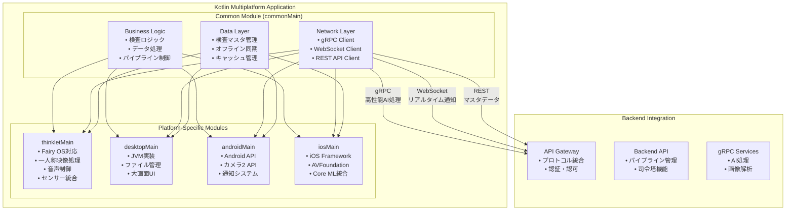

# Kotlin Multiplatform アプリ設計書

## 文書管理情報

| 項目       | 内容                                 |
| ---------- | ------------------------------------ |
| 文書名     | Kotlin Multiplatform アプリ設計書    |
| バージョン | 1.0                                  |
| 作成日     | 2025年8月7日                         |
| 更新日     | 2025年8月7日                         |

---

## 1. 概要

### 1.1. 本書の目的

本書は、ImageFlowCanvasシステムにおけるKotlin Multiplatformアプリケーションの設計について詳細に記述するものです。THINKLET（ウェアラブルデバイス）、Desktop、Android、iOSアプリで共通利用される機能を統一的に実装するための設計指針を提供します。

### 1.2. 対象読者

- アプリケーション開発者
- システム設計者
- プロジェクトマネージャー
- 品質保証担当者

### 1.3. Kotlin Multiplatformアプリの役割

ImageFlowCanvasシステムにおいて、Kotlin Multiplatformアプリは以下の役割を担います：

- **統一コードベース**: 複数プラットフォーム間でのビジネスロジック共有
- **ネイティブ性能**: 各プラットフォーム固有の最適化
- **デバイス統合**: カメラ、マイク、センサーなどの統合制御
- **クロスプラットフォーム通信**: サーバーとの高性能gRPC通信

---

## 2. アーキテクチャ概要

### 2.1. 全体構成



### 2.2. プラットフォーム対応マトリックス

| 機能分類           | THINKLET | Desktop | Android | iOS | 実装場所        |
| ------------------ | -------- | ------- | ------- | --- | --------------- |
| ビジネスロジック   | ✅        | ✅       | ✅       | ✅   | commonMain      |
| ネットワーク通信   | ✅        | ✅       | ✅       | ✅   | commonMain      |
| データ管理         | ✅        | ✅       | ✅       | ✅   | commonMain      |
| カメラ制御         | ✅        | ✅       | ✅       | ✅   | expect/actual   |
| 音声処理           | ✅        | 🔶       | ✅       | ✅   | expect/actual   |
| センサー統合       | ✅        | 🔶       | ✅       | ✅   | expect/actual   |
| ファイル管理       | ✅        | ✅       | ✅       | ✅   | expect/actual   |
| 通知システム       | ✅        | ✅       | ✅       | ✅   | expect/actual   |
| 一人称映像処理     | ✅        | ❌       | 🔶       | 🔶   | thinkletMain    |
| ウェアラブル最適化 | ✅        | ❌       | ❌       | ❌   | thinkletMain    |

**凡例**: ✅ フル対応、🔶 限定対応、❌ 対応外

---

## 3. 共通機能設計 (commonMain)

### 3.1. ビジネスロジック層

#### 3.1.1. 検査ワークフロー管理

```kotlin
// commonMain/src/commonMain/kotlin/workflow/InspectionWorkflow.kt
class InspectionWorkflow {
    /**
     * 検査プロセス全体を管理
     * プラットフォームに依存しない共通ロジック
     */
    suspend fun executeInspection(
        inspectionRequest: InspectionRequest
    ): InspectionResult {
        return when (inspectionRequest.type) {
            InspectionType.STILL_IMAGE -> executeStillImageInspection(inspectionRequest)
            InspectionType.VIDEO_STREAM -> executeVideoStreamInspection(inspectionRequest)
            InspectionType.REALTIME_FIRST_PERSON -> executeRealtimeFirstPersonInspection(inspectionRequest)
        }
    }
    
    private suspend fun executeRealtimeFirstPersonInspection(
        request: InspectionRequest
    ): InspectionResult {
        // THINKLETでの一人称映像リアルタイム検査
        // 1. 映像ストリーム開始
        // 2. AIパイプライン適用
        // 3. リアルタイム結果通知
        // 4. 不良検出時のアラート
    }
}
```

#### 3.1.2. パイプライン実行制御

```kotlin
// commonMain/src/commonMain/kotlin/pipeline/PipelineExecutor.kt
class PipelineExecutor(
    private val networkService: NetworkService,
    private val deviceService: DeviceService // expect/actual
) {
    /**
     * デバイス特性に応じたパイプライン実行
     */
    suspend fun executePipeline(
        pipelineDefinition: PipelineDefinition,
        inputData: InputData
    ): PipelineResult {
        
        // デバイス能力の確認
        val deviceCapabilities = deviceService.getDeviceCapabilities()
        
        // パイプライン最適化
        val optimizedPipeline = optimizePipelineForDevice(
            pipelineDefinition, 
            deviceCapabilities
        )
        
        // 実行
        return when (deviceCapabilities.platform) {
            Platform.THINKLET -> executeThinkletOptimizedPipeline(optimizedPipeline, inputData)
            Platform.MOBILE -> executeMobileOptimizedPipeline(optimizedPipeline, inputData)
            Platform.DESKTOP -> executeDesktopOptimizedPipeline(optimizedPipeline, inputData)
        }
    }
}
```

### 3.2. ネットワーク通信層

#### 3.2.1. 統合通信クライアント

```kotlin
// commonMain/src/commonMain/kotlin/network/ImageFlowCanvasClient.kt
class ImageFlowCanvasClient {
    private val grpcClient = GrpcClient()
    private val webSocketClient = WebSocketClient()
    private val restClient = RestClient()
    
    /**
     * 適材適所の通信プロトコル選択
     */
    suspend fun executePipeline(
        imageData: ByteArray,
        pipelineConfig: PipelineConfig
    ): PipelineResult {
        return grpcClient.executePipeline(imageData, pipelineConfig)
    }
    
    /**
     * リアルタイム進捗監視
     */
    fun observeProgress(executionId: String): Flow<ProgressUpdate> {
        return webSocketClient.observeProgress(executionId)
    }
    
    /**
     * 検査マスタデータ取得
     */
    suspend fun getInspectionMaster(): InspectionMaster {
        return restClient.getInspectionMaster()
    }
    
    /**
     * 映像ストリーミング（THINKLET専用）
     */
    suspend fun startVideoStream(
        streamConfig: VideoStreamConfig
    ): Flow<VideoStreamResult> {
        return grpcClient.startVideoStream(streamConfig)
    }
}
```

---

## 4. プラットフォーム固有実装

### 4.1. THINKLET実装 (thinkletMain)

#### 4.1.1. 一人称映像処理

```kotlin
// thinkletMain/src/thinkletMain/kotlin/camera/ThinkletCameraController.kt
actual class CameraController {
    private val thinkletSDK = ThinkletSDK()
    
    /**
     * THINKLET固有のカメラ制御
     * 8MP、120度視野角の一人称映像
     */
    actual suspend fun startVideoStream(
        config: VideoStreamConfig
    ): Flow<VideoFrame> = flow {
        val camera = thinkletSDK.getCamera()
        
        // THINKLETの広角カメラ設定
        camera.configure {
            resolution = Resolution.EIGHT_MP
            viewAngle = ViewAngle.WIDE_120_90  // 横120度×縦90度
            frameRate = 30
            quality = VideoQuality.HIGH
        }
        
        camera.startStream { frame ->
            emit(VideoFrame(
                data = frame.data,
                timestamp = frame.timestamp,
                metadata = VideoMetadata(
                    width = frame.width,
                    height = frame.height,
                    viewAngle = frame.viewAngle,
                    deviceOrientation = getDeviceOrientation()
                )
            ))
        }
    }
    
    /**
     * 一人称映像の録画
     */
    actual suspend fun startRecording(
        outputPath: String,
        config: RecordingConfig
    ): RecordingSession {
        return thinkletSDK.startRecording(outputPath) {
            resolution = config.resolution
            compressionQuality = config.quality
            includeAudio = config.includeAudio
            batteryOptimization = true // THINKLET特有の最適化
        }
    }
}
```

#### 4.1.2. 音声処理 (XFE技術統合)

```kotlin
// thinkletMain/src/thinkletMain/kotlin/audio/ThinkletAudioController.kt
actual class AudioController {
    private val thinkletSDK = ThinkletSDK()
    private val xfeProcessor = XFEProcessor() // XFEライブラリ
    
    /**
     * 5chマイクアレイを使用した高品質音声収集
     */
    actual suspend fun startVoiceRecording(
        config: VoiceConfig
    ): Flow<AudioFrame> = flow {
        val micArray = thinkletSDK.getMicrophoneArray()
        
        micArray.configure {
            channels = 5  // 5chマイクアレイ
            sampleRate = 48000  // 48kHz
            bitDepth = 24       // 24bit
            enableXFE = config.enableNoiseReduction
        }
        
        micArray.startRecording { rawAudio ->
            val processedAudio = if (config.enableNoiseReduction) {
                // XFE技術による騒音抑制と装着者音声抽出
                xfeProcessor.processAudio(rawAudio) {
                    suppressEnvironmentalNoise = true
                    focusOnWearer = true
                    adaptiveVolumeControl = true
                }
            } else {
                rawAudio
            }
            
            emit(AudioFrame(
                data = processedAudio.data,
                timestamp = processedAudio.timestamp,
                metadata = AudioMetadata(
                    sampleRate = 48000,
                    channels = if (config.enableXFE) 1 else 5, // XFE後は1ch
                    noiseLevel = processedAudio.noiseLevel,
                    confidenceScore = processedAudio.wearerVoiceConfidence
                )
            ))
        }
    }
    
    /**
     * 音声フィードバック (スピーカー制御)
     */
    actual suspend fun playAudioFeedback(
        audioData: ByteArray,
        config: PlaybackConfig
    ) {
        val speaker = thinkletSDK.getSpeaker()
        
        speaker.configure {
            volume = calculateOptimalVolume(config.baseVolume)
            clarity = PlaybackClarity.VOICE_OPTIMIZED
            adaptToEnvironment = true  // 環境騒音に応じた音量調整
        }
        
        speaker.play(audioData)
    }
    
    /**
     * 環境騒音レベルに応じた最適音量計算
     */
    private fun calculateOptimalVolume(baseVolume: Float): Float {
        val environmentNoise = thinkletSDK.getAmbientNoiseLevel()
        return when {
            environmentNoise > 80 -> baseVolume * 1.5f  // 高騒音環境
            environmentNoise > 60 -> baseVolume * 1.2f  // 中騒音環境  
            else -> baseVolume                          // 通常環境
        }
    }
}
```

#### 4.1.3. センサー統合

```kotlin
// thinkletMain/src/thinkletMain/kotlin/sensors/ThinkletSensorManager.kt
actual class SensorManager {
    private val thinkletSDK = ThinkletSDK()
    
    /**
     * THINKLET搭載センサーの統合管理
     */
    actual fun getAvailableSensors(): List<SensorType> {
        return listOf(
            SensorType.ACCELEROMETER,      // 加速度センサー
            SensorType.GYROSCOPE,          // ジャイロスコープ
            SensorType.MAGNETOMETER,       // 地磁気センサー
            SensorType.PROXIMITY,          // 近接センサー
            SensorType.GESTURE,            // ジェスチャーセンサー
            SensorType.GPS,                // GNSS
            SensorType.AMBIENT_LIGHT       // 環境光センサー
        )
    }
    
    /**
     * 装着状態の検出
     */
    actual fun observeWearingState(): Flow<WearingState> = flow {
        val proximityData = thinkletSDK.getProximitySensor().observe()
        val motionData = thinkletSDK.getMotionSensors().observe()
        
        combine(proximityData, motionData) { proximity, motion ->
            WearingState(
                isWorn = proximity.isNearBody,
                orientation = motion.deviceOrientation,
                stability = motion.stabilityLevel,
                timestamp = System.currentTimeMillis()
            )
        }.collect { emit(it) }
    }
}
```

---

## 5. デバイス統合管理

### 5.1. デバイス能力抽象化

```kotlin
// commonMain/src/commonMain/kotlin/device/DeviceCapabilities.kt
data class DeviceCapabilities(
    val platform: Platform,
    val camera: CameraCapabilities,
    val audio: AudioCapabilities,
    val sensors: List<SensorType>,
    val connectivity: ConnectivityCapabilities,
    val performance: PerformanceCapabilities
)

data class CameraCapabilities(
    val maxResolution: Resolution,
    val viewAngle: ViewAngle?,
    val supportedFormats: List<VideoFormat>,
    val canRecord: Boolean,
    val hasImageStabilization: Boolean
)

data class AudioCapabilities(
    val microphoneChannels: Int,
    val maxSampleRate: Int,
    val bitDepth: Int,
    val hasNoiseReduction: Boolean,
    val hasSpeaker: Boolean,
    val supportsBluetoothAudio: Boolean
)

enum class Platform {
    THINKLET,   // Fairy OS (AOSP-based)
    ANDROID,    // Android mobile
    IOS,        // iOS mobile  
    DESKTOP     // JVM desktop
}
```

---

## 6. 通信プロトコル統合

### 6.1. gRPC統合（高性能AI処理）

```kotlin
// commonMain/src/commonMain/kotlin/network/grpc/GrpcImageProcessingClient.kt
class GrpcImageProcessingClient {
    /**
     * 一人称映像のリアルタイム処理
     */
    suspend fun processFirstPersonVideoStream(
        videoStream: Flow<VideoFrame>
    ): Flow<ProcessedFrame> = callbackFlow {
        val responseObserver = object : StreamObserver<ProcessedFrame> {
            override fun onNext(value: ProcessedFrame) {
                trySend(value)
            }
            override fun onError(t: Throwable) {
                close(t)
            }
            override fun onCompleted() {
                close()
            }
        }
        
        val requestObserver = stub.processVideoStream(responseObserver)
        
        videoStream.collect { frame ->
            val request = VideoProcessingRequest.newBuilder()
                .setFrameData(ByteString.copyFrom(frame.data))
                .setTimestamp(frame.timestamp)
                .setDeviceId(getDeviceId())
                .build()
            
            requestObserver.onNext(request)
        }
        
        awaitClose {
            requestObserver.onCompleted()
        }
    }
}
```

---

## 7. まとめ

本設計書に基づいて、Kotlin Multiplatformアプリケーションは以下の特徴を実現します：

### 7.1. 実現される価値

1. **統一開発体験**: 4つのプラットフォーム（THINKLET、Desktop、Android、iOS）で共通のビジネスロジック
2. **プラットフォーム最適化**: 各プラットフォームの特性を活かした最適化
3. **高性能通信**: gRPC、WebSocket、RESTの適材適所利用
4. **オフライン対応**: ネットワーク不安定環境での業務継続性
5. **ウェアラブル特化**: THINKLETの一人称映像・音声機能を最大活用

### 7.2. 開発効率向上

- **コード共有率**: ビジネスロジックの80%以上を共通化
- **保守性**: 単一コードベースでの機能追加・バグ修正
- **テスタビリティ**: 共通テストによる品質担保
- **型安全性**: Kotlin言語による静的型チェック

### 7.3. スケーラビリティ

- **プラットフォーム拡張**: 新しいウェアラブルデバイスへの対応容易性
- **機能拡張**: 共通機能の一括追加
- **パフォーマンス向上**: プラットフォーム固有最適化の独立実装

この設計により、ImageFlowCanvasシステムは多様なデバイス環境での統一的な検査業務を実現し、特にTHINKLETウェアラブルデバイスを活用した革新的な一人称映像検査機能を提供できます。