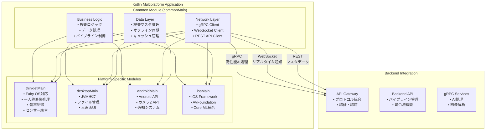

# Kotlin Multiplatform アプリ設計書

## 文書管理情報

| 項目       | 内容                                 |
| ---------- | ------------------------------------ |
| 文書名     | Kotlin Multiplatform アプリ設計書    |
| バージョン | 1.0                                  |
| 作成日     | 2025年8月7日                         |
| 更新日     | 2025年8月7日                         |

---

## 1. 概要

### 1.1. 本書の目的

本書は、ImageFlowCanvasシステムにおけるKotlin Multiplatformアプリケーションの設計について詳細に記述するものです。THINKLET（ウェアラブルデバイス）、Desktop、Android、iOSアプリで共通利用される機能を統一的に実装するための設計指針を提供します。

### 1.2. 対象読者

- アプリケーション開発者
- システム設計者
- プロジェクトマネージャー
- 品質保証担当者

### 1.3. Kotlin Multiplatformアプリの役割

ImageFlowCanvasシステムにおいて、Kotlin Multiplatformアプリは以下の役割を担います：

- **統一コードベース**: 複数プラットフォーム間でのビジネスロジック共有
- **ネイティブ性能**: 各プラットフォーム固有の最適化
- **デバイス統合**: カメラ、マイク、センサーなどの統合制御
- **クロスプラットフォーム通信**: サーバーとの高性能gRPC通信

---

## 2. アーキテクチャ概要

### 2.1. 全体構成

### 2.2. プラットフォーム対応マトリックス

| 機能分類           | THINKLET | Desktop | Android | iOS | 実装場所        |
| ------------------ | -------- | ------- | ------- | --- | --------------- |
| ビジネスロジック   | ✅        | ✅       | ✅       | ✅   | commonMain      |
| ネットワーク通信   | ✅        | ✅       | ✅       | ✅   | commonMain      |
| データ管理         | ✅        | ✅       | ✅       | ✅   | commonMain      |
| カメラ制御         | ✅        | ✅       | ✅       | ✅   | expect/actual   |
| 音声処理           | ✅        | 🔶       | ✅       | ✅   | expect/actual   |
| センサー統合       | ✅        | 🔶       | ✅       | ✅   | expect/actual   |
| ファイル管理       | ✅        | ✅       | ✅       | ✅   | expect/actual   |
| 通知システム       | ✅        | ✅       | ✅       | ✅   | expect/actual   |
| 一人称映像処理     | ✅        | ❌       | 🔶       | 🔶   | thinkletMain    |
| ウェアラブル最適化 | ✅        | ❌       | ❌       | ❌   | thinkletMain    |
| リアルタイム監視表示 | ❌      | ✅       | 🔶       | 🔶   | desktopMain     |
| 複数デバイス管理   | ❌        | ✅       | ❌       | ❌   | desktopMain     |

**凡例**: ✅ フル対応、🔶 限定対応、❌ 対応外

---

## 3. 共通機能設計 (commonMain)

### 3.1. ビジネスロジック層

#### 3.1.1. 検査ワークフロー管理

検査プロセス全体を管理するワークフロー層では、プラットフォームに依存しない共通ロジックを実装します。

**主要機能:**
- 静止画検査の実行制御
- 動画ストリーム検査の管理
- リアルタイム一人称映像検査の処理
- 検査タイプに応じた適切な処理フローの選択
- THINKLETでの一人称映像リアルタイム検査では、映像ストリーム開始、AIパイプライン適用、リアルタイム結果通知、不良検出時のアラートを順次実行します

#### 3.1.2. パイプライン実行制御

デバイス特性に応じたパイプライン実行制御では、各デバイスの能力を考慮した最適化処理を実装します。

**主要機能:**
- デバイス能力の確認と評価
- パイプライン最適化処理
- プラットフォーム別の実行戦略選択:
  - THINKLET: ウェアラブル特化最適化パイプライン
  - MOBILE: モバイル端末向け最適化パイプライン  
  - DESKTOP: デスクトップ向け高性能パイプライン
- リソース効率を考慮した処理配分

### 3.2. ネットワーク通信層

#### 3.2.1. 統合通信クライアント

統合通信クライアントでは、適材適所の通信プロトコル選択により効率的な処理を実現します。

**主要機能:**
- **gRPCクライアント**: 高性能AI処理向けのバイナリ通信
- **WebSocketクライアント**: リアルタイム進捗監視
- **RESTクライアント**: 検査マスタデータの取得・更新

**通信用途の最適化:**
- パイプライン実行: gRPCによる高性能バイナリ転送
- リアルタイム進捗監視: WebSocketによる双方向通信
- 検査マスタデータ取得: RESTful APIによる標準的なデータ交換
- 映像ストリーミング（THINKLET専用）: gRPCストリームによる高効率転送

---

## 4. プラットフォーム固有実装

### 4.1. THINKLET実装 (thinkletMain)

#### 4.1.1. 一人称映像処理

THINKLET固有のカメラ制御システムでは、8MP・120度視野角の一人称映像を最適化して処理します。

**主要機能:**
- **高品質映像設定**: 8MP解像度、120度視野角、30fps
- **広角カメラ最適化**: 横120度×縦90度の広視野角設定
- **安定化技術**: 肩掛け固定による映像安定化
- **自動調整機能**: オートフォーカス、自動露出制御
- **低照度対応**: 工場内照明環境への最適化

**録画機能の特徴:**
- バッテリー効率を考慮した録画設定
- 高品質圧縮による容量最適化
- 音声付き録画対応
- 8時間連続録画対応（バッテリー最適化）

### 4.2. Desktop実装 (desktopMain)

#### 4.2.1. リアルタイム監視ダッシュボード

Desktop特化の監視機能では、複数のウェアラブルデバイスからのリアルタイムデータを統合表示します。

**リアルタイム映像監視機能:**
- **マルチストリーム表示**: 複数THINKLETデバイスからの同時映像表示
- **グリッドレイアウト**: 4×4、3×3、2×2の可変レイアウト対応
- **映像品質自動調整**: ネットワーク状況に応じた解像度・フレームレート最適化
- **フルスクリーン切替**: 個別映像の拡大表示機能

**AI不良判定結果表示:**
- **リアルタイム判定結果**: OK/NG判定の即座表示（<100ms遅延）
- **信頼度スコア**: AI判定の確信度を0-100%で表示
- **不良箇所ハイライト**: 検出された不良部分の枠線・色分け表示
- **ヒートマップ表示**: 不良確率の濃淡マップ重畳表示
- **判定履歴**: 直近100件の判定結果履歴表示

**アラート・通知システム:**
- **重要度別色分け**: Critical（赤）、High（橙）、Medium（黄）、Low（緑）
- **音声アラート**: システム音による重要度別通知
- **ポップアップ通知**: デスクトップ通知との連携
- **エスカレーション**: 一定時間未対応の場合の上位者通知

**統計・分析機能:**
- **リアルタイム統計**: 検査数、合格率、不良率のリアルタイム更新
- **時間別傾向**: 1時間、1日、1週間単位での傾向グラフ
- **デバイス別パフォーマンス**: 各THINKLETの検査効率・精度分析
- **不良種別分析**: 検出された不良タイプの分類・集計

**デバイス管理機能:**
- **接続状態監視**: 各THINKLETの接続状況・電池残量表示
- **パフォーマンス監視**: CPU使用率、温度、ネットワーク品質
- **設定管理**: リモートでの検査パラメーター調整
- **ファームウェア管理**: デバイスソフトウェアの更新状況管理

#### 4.1.2. 音声処理 (XFE技術統合)

THINKLET音声制御システムでは、5chマイクアレイとXFE技術を活用した高品質音声処理を実現します。

**高品質音声収集機能:**
- **5chマイクアレイ**: 48kHz/24bit高品質音声収集
- **XFE技術対応**: 環境騒音抑制と装着者音声抽出
- **適応制御**: 騒音環境での自動音量調整
- **多チャンネル処理**: 5ch入力からXFE後1ch出力への最適化

**音声フィードバック機能:**
- **スピーカー制御**: 内蔵スピーカーによる音声出力
- **環境適応**: 環境騒音レベルに応じた最適音量計算
- **音声品質最適化**: 声認識向け高明度設定
- **音量レベル調整**: 
  - 高騒音環境（80dB超）: 基準音量×1.5倍
  - 中騒音環境（60-80dB）: 基準音量×1.2倍
  - 通常環境（60dB未満）: 基準音量維持

#### 4.1.3. センサー統合

THINKLET搭載センサーの統合管理では、多様なセンサーを活用した作業状態分析を実現します。

**対応センサー一覧:**
- **加速度センサー**: デバイスの動作・振動検出
- **ジャイロスコープ**: 回転・姿勢変化の検出
- **地磁気センサー**: 方向・向きの測定
- **近接センサー**: 装着状態の検出
- **ジェスチャーセンサー**: ハンズフリー操作対応
- **GNSS**: 位置情報の取得
- **環境光センサー**: 照明条件の自動調整

**装着状態検出機能:**
- **装着判定**: 近接センサーによる身体接触検出
- **動作安定性**: モーションセンサーによる安定度測定
- **デバイス向き**: 姿勢センサーによる装着方向確認
- **継続監視**: リアルタイムでの装着状態変化検出

---

## 5. デバイス統合管理

### 5.1. デバイス能力抽象化

デバイス能力抽象化では、プラットフォーム間の違いを統一的なインターフェースで管理します。

**デバイス能力の構成要素:**

**プラットフォーム分類:**
- **THINKLET**: Fairy OS (AOSP-based) ウェアラブルデバイス
- **ANDROID**: Android モバイルデバイス
- **iOS**: iOS モバイルデバイス
- **DESKTOP**: JVM デスクトップアプリケーション

**カメラ能力の定義:**
- 最大解像度、視野角、対応フォーマット
- 録画機能、手ブレ補正の有無

**音声能力の定義:**
- マイクチャンネル数、最大サンプリングレート、ビット深度
- ノイズリダクション、スピーカー、Bluetooth音声対応

**接続・性能能力:**
- ネットワーク接続タイプ
- 処理性能レベル
- バッテリー制約

---

## 6. 通信プロトコル統合

### 6.1. gRPC統合（高性能AI処理）

gRPC統合により、一人称映像のリアルタイム処理を高性能で実現します。

**一人称映像のリアルタイム処理機能:**
- **双方向ストリーミング**: クライアント-サーバー間でのリアルタイム映像送受信
- **低遅延処理**: gRPCストリームによる高効率バイナリ転送
- **メタデータ付与**: デバイスID、タイムスタンプ、位置情報の自動付与
- **エラーハンドリング**: 接続断絶時の自動再接続機能

**処理フロー:**
1. 映像フレームストリームの開始
2. リアルタイム映像データの送信（ByteString形式）
3. AIパイプラインでの並列処理
4. 処理結果のストリーミング受信
5. UI更新とフィードバック提供

---

## 7. まとめ

本設計書に基づいて、Kotlin Multiplatformアプリケーションは以下の特徴を実現します：

### 7.1. 実現される価値

1. **統一開発体験**: 4つのプラットフォーム（THINKLET、Desktop、Android、iOS）で共通のビジネスロジック
2. **プラットフォーム最適化**: 各プラットフォームの特性を活かした最適化
3. **高性能通信**: gRPC、WebSocket、RESTの適材適所利用
4. **オフライン対応**: ネットワーク不安定環境での業務継続性
5. **ウェアラブル特化**: THINKLETの一人称映像・音声機能を最大活用

### 7.2. 開発効率向上

- **コード共有率**: ビジネスロジックの80%以上を共通化
- **保守性**: 単一コードベースでの機能追加・バグ修正
- **テスタビリティ**: 共通テストによる品質担保
- **型安全性**: Kotlin言語による静的型チェック

### 7.3. スケーラビリティ

- **プラットフォーム拡張**: 新しいウェアラブルデバイスへの対応容易性
- **機能拡張**: 共通機能の一括追加
- **パフォーマンス向上**: プラットフォーム固有最適化の独立実装

この設計により、ImageFlowCanvasシステムは多様なデバイス環境での統一的な検査業務を実現し、特にTHINKLETウェアラブルデバイスを活用した革新的な一人称映像検査機能を提供できます。