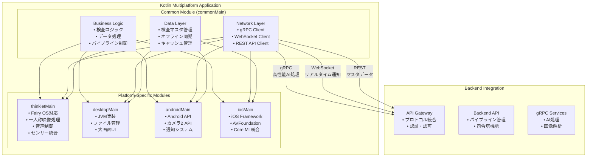

# Kotlin Multiplatform アプリ設計書

## 文書管理情報

| 項目       | 内容                              |
| ---------- | --------------------------------- |
| 文書名     | Kotlin Multiplatform アプリ設計書 |
| バージョン | 1.0                               |
| 作成日     | 2025年8月7日                      |
| 更新日     | 2025年8月8日                      |

---

## 1. 概要

### 1.1. 本書の目的

本書は、ImageFlowCanvasシステムにおけるKotlin Multiplatformアプリケーションの設計について詳細に記述するものです。THINKLET（ウェアラブルデバイス）、Desktop、Android、iOSアプリで共通利用される機能を統一的に実装するための設計指針を提供します。

### 1.2. 対象読者

- アプリケーション開発者
- システム設計者
- プロジェクトマネージャー
- 品質保証担当者

### 1.3. Kotlin Multiplatformアプリの役割

ImageFlowCanvasシステムにおいて、Kotlin Multiplatformアプリは以下の役割を担います：

- **統一コードベース**: 複数プラットフォーム間でのビジネスロジック共有
- **ネイティブ性能**: 各プラットフォーム固有の最適化
- **デバイス統合**: カメラ、マイク、センサーなどの統合制御
- **クロスプラットフォーム通信**: サーバーとの高性能gRPC通信

---

## 2. アーキテクチャ概要

### 2.1. 全体構成



### 2.2. プラットフォーム対応マトリックス

| 機能分類             | THINKLET | Desktop | Android | iOS | 実装場所      |
| -------------------- | -------- | ------- | ------- | --- | ------------- |
| ビジネスロジック     | ✅        | ✅       | ✅       | ✅   | commonMain    |
| ネットワーク通信     | ✅        | ✅       | ✅       | ✅   | commonMain    |
| データ管理           | ✅        | ✅       | ✅       | ✅   | commonMain    |
| カメラ制御           | ✅        | ✅       | ✅       | ✅   | expect/actual |
| 音声処理             | ✅        | 🔶       | ✅       | ✅   | expect/actual |
| センサー統合         | ✅        | 🔶       | ✅       | ✅   | expect/actual |
| ファイル管理         | ✅        | ✅       | ✅       | ✅   | expect/actual |
| 通知システム         | ✅        | ✅       | ✅       | ✅   | expect/actual |
| 一人称映像処理       | ✅        | ❌       | 🔶       | 🔶   | thinkletMain  |
| ウェアラブル最適化   | ✅        | ❌       | ❌       | ❌   | thinkletMain  |
| リアルタイム監視表示 | ❌        | ✅       | 🔶       | 🔶   | desktopMain   |
| 複数デバイス管理     | ❌        | ✅       | ❌       | ❌   | desktopMain   |

**凡例**: ✅ フル対応、🔶 限定対応、❌ 対応外

---

## 3. 共通機能設計 (commonMain)

### 3.1. ビジネスロジック層

#### 3.1.1. 検査ワークフロー管理（製品情報統合）

検査プロセス全体を管理するワークフロー層では、プラットフォームに依存しない共通ロジックを実装します。

**共通検査フロー（製品情報紐づけ対応）:**
1. **認証・ログイン**: JWT取得とロール確認
2. **ホーム画面**: デバイス状態確認とメニュー表示
3. **製品情報取得**: QRコードスキャンまたはサーバー検索による製品特定
   - **QRコードスキャン**: 指図番号・指示番号・型式・機番等の自動取得
   - **サーバー検索**: 型式・機番等による製品マスタ検索
   - **製品情報検証**: 取得した製品情報の整合性確認
4. **検査項目一覧**: 製品タイプに対応する検査項目の表示
5. **カメラ撮影/録画**: 静止画または動画の取得（製品情報自動埋め込み）
6. **AI検査実行**: パイプライン処理とリアルタイム結果取得（製品情報紐づけ）
7. **人手確認**: AI結果の検証と修正
8. **完了・保存**: 結果の確定とデータ同期（製品情報含む）
9. **履歴管理**: 製品情報ベースでの検査履歴参照・トレーサビリティ表示

**検査状態管理（製品情報ステートマシン）:**
検査実行の状態遷移を統一管理し、製品情報の整合性を維持：
- **PRODUCT_SCANNING** → **PRODUCT_IDENTIFIED** → **IN_PROGRESS** → **AI_COMPLETED** → **HUMAN_REVIEW** → **COMPLETED**
- **例外状態**: PRODUCT_NOT_FOUND, QR_DECODE_FAILED, FAILED, CANCELLED
- **進捗指標**: 項目単位進捗、全体進捗、製品処理時間、AI信頼度、人手修正率
- **製品トレーサビリティ**: 各ステータス変更時に製品履歴へ自動記録
- **リアルタイム通知**: WebSocketイベントによる製品情報含むステータス更新

**製品情報取得統合:**
expect/actualパターンで各プラットフォームの最適な機能を使用：
- **QRコードスキャン**: ML Kit/ZXing/AVFoundation連携による高速認識
- **製品検索UI**: オートコンプリート・履歴表示・キャッシュ機能
- **オフライン対応**: ローカル製品マスタキャッシュとサーバー同期
- **製品情報検証**: リアルタイム重複チェック・整合性検証

**QR/バーコードスキャン統合（製品情報デコード）:**
expect/actualパターンで各プラットフォームの最適なライブラリを使用：
- **Android**: ML Kit/ZXing連携による高速認識・製品情報パース
- **iOS**: AVFoundationバーコード機能・Core Data統合
- **Desktop**: 外部リーダー/カメラ+ZXing・SQLite管理
- **THINKLET**: 専用カメラAPIとの統合・音声フィードバック

**主要機能（製品情報対応）:**
- 製品情報紐づけ検査の実行制御
- 製品タイプ別検査項目の動的ロード
- 製品情報埋め込み静止画・動画検査の管理  
- リアルタイム一人称映像検査の処理（製品メタデータ自動付与）
- 検査タイプと製品仕様に応じた適切な処理フローの選択
- THINKLETでの製品情報連携一人称映像検査：製品スキャン、映像ストリーム開始、AIパイプライン適用、製品情報付きリアルタイム結果通知、不良検出時の製品特定アラート

#### 3.1.2. 製品情報管理ロジック

**製品マスタデータ管理:**
```kotlin
// commonMain - 製品情報共通データクラス
@Serializable
data class ProductInfo(
    val id: String,
    val workOrderId: String,      // 指図番号
    val instructionId: String,    // 指示番号
    val productType: String,      // 型式
    val machineNumber: String,    // 機番
    val productionDate: String,   // 生産年月日
    val monthlySequence: Int,     // 月連番
    val qrCodeData: String?,      // QRコード情報
    val specification: JsonObject?, // 製品仕様
    val status: ProductStatus
)

enum class ProductStatus {
    ACTIVE, INACTIVE, OBSOLETE
}
```

**QRコード処理ロジック:**
```kotlin
// commonMain - QRコード処理共通インターフェース
expect class QRCodeProcessor {
    suspend fun scanQRCode(): QRScanResult
    suspend fun decodeProductInfo(qrData: String): ProductInfo?
    fun validateQRFormat(qrData: String): Boolean
}

data class QRScanResult(
    val success: Boolean,
    val qrData: String?,
    val productInfo: ProductInfo?,
    val errorMessage: String?
)
```

**製品検索ロジック:**
```kotlin
// commonMain - 製品検索共通ロジック
class ProductSearchManager {
    suspend fun searchProducts(query: ProductSearchQuery): ProductSearchResult
    suspend fun getProductById(id: String): ProductInfo?
    suspend fun syncProductMaster(): SyncResult
    fun getCachedProducts(): List<ProductInfo>
}

data class ProductSearchQuery(
    val workOrderId: String? = null,
    val productType: String? = null,
    val machineNumber: String? = null,
    val productionDateFrom: String? = null,
    val productionDateTo: String? = null
)
```

#### 3.1.3. パイプライン実行制御（製品情報連携）

デバイス特性に応じたパイプライン実行制御では、各デバイスの能力を考慮した最適化処理を実装します。

**主要機能:**
- デバイス能力の確認と評価
- パイプライン最適化処理
- プラットフォーム別の実行戦略選択:
  - THINKLET: ウェアラブル特化最適化パイプライン
  - MOBILE: モバイル端末向け最適化パイプライン  
  - DESKTOP: デスクトップ向け高性能パイプライン
- リソース効率を考慮した処理配分

### 3.2. ネットワーク通信層

#### 3.2.1. 統合通信クライアント

統合通信クライアントでは、適材適所の通信プロトコル選択により効率的な処理を実現します。

**主要機能:**
- **gRPCクライアント**: 高性能AI処理向けのバイナリ通信
- **WebSocketクライアント**: リアルタイム進捗監視
- **RESTクライアント**: 検査マスタデータの取得・更新

**通信用途の最適化:**
- **パイプライン実行**: gRPCによる高性能バイナリ転送
- **リアルタイム進捗監視**: WebSocketによる双方向通信
- **検査マスタデータ取得**: RESTful APIによる標準的なデータ交換
- **映像ストリーミング（THINKLET専用）**: WebRTC/WHEPによる超低遅延転送

#### 3.2.2. データ同期戦略

**ローカルデータベース設計:**
- **実装技術**: SQLDelight/Realm等による型安全実装（推奨: SQLDelight）
- **主要テーブル**:
  - inspection_targets, inspection_items, inspection_executions, inspection_results
  - client_sync_queue（優先度制御付き同期キュー）
  - pipeline_cache, image_metadata

**同期機能:**
- **双方向同期**: サーバーとクライアント間の差分同期
- **優先度制御**: 重要度に応じた同期順序の制御
- **競合解決**: タイムスタンプ自動解決＋手動オプション
- **リトライ・バックオフ**: ネットワーク障害時の自動再試行

**オフライン対応:**
- **完全オフライン動作**: ネットワーク断絶時の業務継続
- **復旧時自動同期**: 接続回復時の差分データ自動同期
- **同期状況可視化**: 同期進捗とステータスのリアルタイム表示

#### 3.2.3. 通信・ネットワーク最適化

**統合API設計:**
- **Backend API司令塔**: 単一窓口による複数プロトコル統合
- **適材適所プロトコル**: gRPC（AI実行・大容量）、WebSocket（進捗・通知）、REST（マスタ・設定）
- **Kafka連携**: Kafka→WebSocket中継による通知基盤、トピック相当チャネルの購読

**パフォーマンス最適化:**
- **HTTP/2優先**: 効率的な多重化通信
- **転送圧縮**: gzip/brotli による帯域効率化
- **キャッシュ制御**: 結果・マスタデータの効率的キャッシュ
- **プリフェッチ**: パイプライン・マスタデータの先読み

---

## 4. プラットフォーム固有実装

### 4.1. THINKLET実装 (thinkletMain)

#### 4.1.1. 一人称映像処理

THINKLET固有のカメラ制御システムでは、8MP・120度視野角の一人称映像を最適化して処理します。

**主要機能:**
- **高品質映像設定**: 8MP解像度、120度視野角、30fps
- **広角カメラ最適化**: 横120度×縦90度の広視野角設定
- **安定化技術**: 肩掛け固定による映像安定化
- **自動調整機能**: オートフォーカス、自動露出制御
- **低照度対応**: 工場内照明環境への最適化

**録画機能の特徴:**
- バッテリー効率を考慮した録画設定
- 高品質圧縮による容量最適化
- 音声付き録画対応
- 8時間連続録画対応（バッテリー最適化）

### 4.2. Desktop実装 (desktopMain)

#### 4.2.1. リアルタイム監視ダッシュボード

Desktop特化の監視機能では、複数のウェアラブルデバイスからのリアルタイムデータを統合表示します。

**リアルタイム映像監視機能:**
- **マルチストリーム表示**: 複数THINKLETデバイスからの同時映像表示
- **グリッドレイアウト**: 4×4、3×3、2×2の可変レイアウト対応
- **映像品質自動調整**: ネットワーク状況に応じた解像度・フレームレート最適化
- **フルスクリーン切替**: 個別映像の拡大表示機能

**AI不良判定結果表示:**
- **リアルタイム判定結果**: OK/NG判定の即座表示（<100ms遅延）
- **信頼度スコア**: AI判定の確信度を0-100%で表示
- **不良箇所ハイライト**: 検出された不良部分の枠線・色分け表示
- **ヒートマップ表示**: 不良確率の濃淡マップ重畳表示
- **判定履歴**: 直近100件の判定結果履歴表示

**アラート・通知システム:**
- **重要度別色分け**: Critical（赤）、High（橙）、Medium（黄）、Low（緑）
- **音声アラート**: システム音による重要度別通知
- **ポップアップ通知**: デスクトップ通知との連携
- **エスカレーション**: 一定時間未対応の場合の上位者通知

**統計・分析機能:**
- **リアルタイム統計**: 検査数、合格率、不良率のリアルタイム更新
- **時間別傾向**: 1時間、1日、1週間単位での傾向グラフ
- **デバイス別パフォーマンス**: 各THINKLETの検査効率・精度分析
- **不良種別分析**: 検出された不良タイプの分類・集計

**デバイス管理機能:**
- **接続状態監視**: 各THINKLETの接続状況・電池残量表示
- **パフォーマンス監視**: CPU使用率、温度、ネットワーク品質
- **設定管理**: リモートでの検査パラメーター調整
- **ファームウェア管理**: デバイスソフトウェアの更新状況管理

#### 4.1.2. 音声処理 (XFE技術統合)

THINKLET音声制御システムでは、5chマイクアレイとXFE技術を活用した高品質音声処理を実現します。

**高品質音声収集機能:**
- **5chマイクアレイ**: 48kHz/24bit高品質音声収集
- **XFE技術対応**: 環境騒音抑制と装着者音声抽出
- **適応制御**: 騒音環境での自動音量調整
- **多チャンネル処理**: 5ch入力からXFE後1ch出力への最適化

**音声フィードバック機能:**
- **スピーカー制御**: 内蔵スピーカーによる音声出力
- **環境適応**: 環境騒音レベルに応じた最適音量計算
- **音声品質最適化**: 声認識向け高明度設定
- **音量レベル調整**: 
  - 高騒音環境（80dB超）: 基準音量×1.5倍
  - 中騒音環境（60-80dB）: 基準音量×1.2倍
  - 通常環境（60dB未満）: 基準音量維持

#### 4.1.3. センサー統合

THINKLET搭載センサーの統合管理では、多様なセンサーを活用した作業状態分析を実現します。

**対応センサー一覧:**
- **加速度センサー**: デバイスの動作・振動検出
- **ジャイロスコープ**: 回転・姿勢変化の検出
- **地磁気センサー**: 方向・向きの測定
- **近接センサー**: 装着状態の検出
- **ジェスチャーセンサー**: ハンズフリー操作対応
- **GNSS**: 位置情報の取得
- **環境光センサー**: 照明条件の自動調整

**装着状態検出機能:**
- **装着判定**: 近接センサーによる身体接触検出
- **動作安定性**: モーションセンサーによる安定度測定
- **デバイス向き**: 姿勢センサーによる装着方向確認
- **継続監視**: リアルタイムでの装着状態変化検出

---

## 5. デバイス統合管理

### 5.1. デバイス能力抽象化

デバイス能力抽象化では、プラットフォーム間の違いを統一的なインターフェースで管理します。

**デバイス能力の構成要素:**

**プラットフォーム分類:**
- **THINKLET**: Fairy OS (AOSP-based) ウェアラブルデバイス
- **ANDROID**: Android モバイルデバイス
- **iOS**: iOS モバイルデバイス
- **DESKTOP**: JVM デスクトップアプリケーション

**カメラ能力の定義:**
- 最大解像度、視野角、対応フォーマット
- 録画機能、手ブレ補正の有無

**音声能力の定義:**
- マイクチャンネル数、最大サンプリングレート、ビット深度
- ノイズリダクション、スピーカー、Bluetooth音声対応

**接続・性能能力:**
- ネットワーク接続タイプ
- 処理性能レベル
- バッテリー制約

---

## 6. 通信プロトコル統合

### 6.1. gRPC統合（高性能AI処理）

gRPC統合により、一人称映像のリアルタイム処理を高性能で実現します。

**一人称映像のリアルタイムAI処理機能:**
- **映像受信**: WebRTC/WHEPによる超低遅延映像ストリーミング受信
- **AI処理実行**: gRPCによる高性能AI推論パイプライン
- **メタデータ付与**: デバイスID、タイムスタンプ、位置情報の自動付与
- **エラーハンドリング**: 接続断絶時の自動再接続機能

**処理フロー:**
1. WebRTC/WHEPによる映像ストリーミング受信
2. 映像フレームのデコードと前処理
3. gRPCによるAIパイプライン実行（並列処理）
4. AI処理結果のgRPCストリーミング受信
5. UI更新とフィードバック提供

---

## 7. セキュリティ

### 7.1. 認証・認可システム

#### 7.1.1. 認証フロー
- **JWT取得・更新**: Backend APIからのトークン取得と自動更新
- **ロールベースアクセス制御（RBAC）**: 機能レベルでの権限制御
- **オフライン認証**: ネットワーク断絶時の認証キャッシュ継続
- **セッション管理**: 適切なタイムアウトとセキュアな状態管理

#### 7.1.2. 生体認証統合
プラットフォーム固有の生体認証機能を統一インターフェースで提供：
- **Android**: 指紋認証・顔認証による再認証
- **iOS**: Face ID・Touch IDによる再認証
- **Desktop**: Windows Hello・TouchBar統合
- **THINKLET**: 装着状態検出との連携

### 7.2. データ保護・暗号化

#### 7.2.1. セキュアストレージ
- **認証情報**: JWT・APIキーのKeychain/Keystore保存
- **ローカルDB**: SQLCipher等による暗号化
- **設定データ**: プラットフォーム標準の暗号化ストレージ活用

#### 7.2.2. 画像・録画データ保護
- **端末保存**: AES暗号化による機密性確保
- **通信保護**: TLS/SSLによる転送時暗号化
- **完全性保証**: チェックサム・デジタル署名のメタデータ保持
- **改ざん検知**: ハッシュ値による不正変更検出

---

## 8. 運用機能・履歴管理

### 8.1. 検査履歴・データ管理

#### 8.1.1. 履歴機能
- **検索・フィルタ**: 日付範囲、検査タイプ、結果ステータスによる絞り込み
- **詳細表示**: 検査結果、AI信頼度、修正履歴の確認
- **関連データ**: 画像・動画・音声データの関連付け表示

#### 8.1.2. エクスポート機能
- **データ形式**: CSV・JSON形式でのエクスポート
- **権限制御**: ユーザーロールに応じたエクスポート範囲制限
- **監査対応**: エクスポート操作の完全ログ記録
- **ID・バージョン管理**: サーバー側との整合性確保

### 8.2. データ同期・バックアップ

#### 8.2.1. 自動バックアップ
- **定期同期**: 設定可能な間隔での自動データ同期
- **差分バックアップ**: 変更分のみの効率的なバックアップ
- **復元機能**: デバイス交換時のデータ復元対応

#### 8.2.2. 災害対策
- **オフライン継続**: 長期間ネットワーク断絶時の業務継続
- **データ保全**: ローカルデータの冗長化・保護
- **緊急時手順**: 災害時のデータ救出・移行手順

本設計書に基づいて、Kotlin Multiplatformアプリケーションは以下の特徴を実現します：

### 7.1. 実現される価値

1. **統一開発体験**: 4つのプラットフォーム（THINKLET、Desktop、Android、iOS）で共通のビジネスロジック
2. **プラットフォーム最適化**: 各プラットフォームの特性を活かした最適化
3. **高性能通信**: gRPC、WebSocket、RESTの適材適所利用
4. **オフライン対応**: ネットワーク不安定環境での業務継続性
5. **ウェアラブル特化**: THINKLETの一人称映像・音声機能を最大活用

### 7.2. 開発効率向上

- **コード共有率**: ビジネスロジックの80%以上を共通化
- **保守性**: 単一コードベースでの機能追加・バグ修正
- **テスタビリティ**: 共通テストによる品質担保
- **型安全性**: Kotlin言語による静的型チェック

### 7.3. スケーラビリティ

- **プラットフォーム拡張**: 新しいウェアラブルデバイスへの対応容易性
- **機能拡張**: 共通機能の一括追加
- **パフォーマンス向上**: プラットフォーム固有最適化の独立実装

この設計により、ImageFlowCanvasシステムは多様なデバイス環境での統一的な検査業務を実現し、特にTHINKLETウェアラブルデバイスを活用した革新的な一人称映像検査機能を提供できます。

---

## 8. 録画同期・QoS・データモデル（共有ロジック）

本章は、録画機能に関する「クライアント側（KMP共通/thinkletMain）で共有する実装ロジック」を集約します。サーバー契約は「0304_API設計.md」、デバイス固有運用は「0311_THINKLETアプリ設計.md」を参照。

### 8.1. データモデル
```kotlin
data class RecordingSegment(
    val id: String,
    val deviceId: String,
    val executionId: String?,
    val startTs: Instant,
    val endTs: Instant,
    val durationMs: Long,
    val fps: Int,
    val resolution: String,
    val videoCodec: String = "h264",
    val audioCodec: String = "aac",
    val bitrateKbps: Int,
    val localPath: String?,
    val remoteUrl: String?,
    val checksum: String?,
    val labels: List<String> = emptyList(),
    val tags: Map<String, String> = emptyMap(),
    val status: SegmentStatus
)

enum class SegmentStatus { LOCAL, UPLOADING, SYNCED, FAILED }
```

メタの`schema_version`はJSONシリアライズ時に付与。検索キー: deviceId, executionId, startTs。

### 8.2. リングバッファ/容量管理
- 閾値: 使用率80%でクリーンアップ起動
- 削除順: 最古の「SYNCED」→ 次に「LOCAL」。`tags["protected"]=="true"`は保護
- クリーンアップはバックグラウンドで、I/Oスロットリングを考慮

### 8.3. 差分同期アルゴリズム
状態遷移: `LOCAL -> UPLOADING -> SYNCED`（失敗時`FAILED`→リトライ）
- マルチパート: サーバーから受領したpresign/part_urlsで並列PUT。各partのETagを保存
- 再開: 中断時は保存済みETagから不足partのみ再送
- バックオフ: 0.5s, 1s, 2s, 4s（最大N回=5）
- LTE時は同時アップロード本数を1-2本に制限。Wi-Fi時は4-6本

### 8.4. 帯域/電力に応じたQoSプリセット
```kotlin
data class QoSPreset(
    val name: String,
    val fps: Int,
    val resolution: String,
    val bitrateKbps: Int,
    val gopSeconds: Int
)

val High = QoSPreset("high", 30, "1920x1080", 6000, 2)
val Balanced = QoSPreset("balanced", 24, "1280x720", 3000, 2)
val Low = QoSPreset("low", 15, "960x540", 1500, 3)
```
- バッテリー>50%: High、20-50%: Balanced、<20%: Low
- 熱逼迫: 1段階ずつプリセットを降格、回復閾値で復帰

### 8.5. 同期ワーカー/再試行
- 優先度キュー: フォアグラウンド（最新）を優先、バックグラウンドは間引き
- エラー分類: 一時（ネットワーク/429）と恒久（認可/404）で扱い分け
- 監査ログ: 成否、リトライ回数、合計送信バイト、平均帯域

### 8.6. WebRTC送信の再接続
- 断検知でICE再収集→再Offer。最大3回、合計30秒
- 成功までローカル録画は継続、帯域回復後に一括同期

### 8.7. テスト項目（KMP共有）
- 再開同期（中断→復旧）での整合性
- 容量80%超での自動クリーンアップ
- QoS降格/復帰の境界テスト
- LTE/Wi-Fiの同時接続数制御