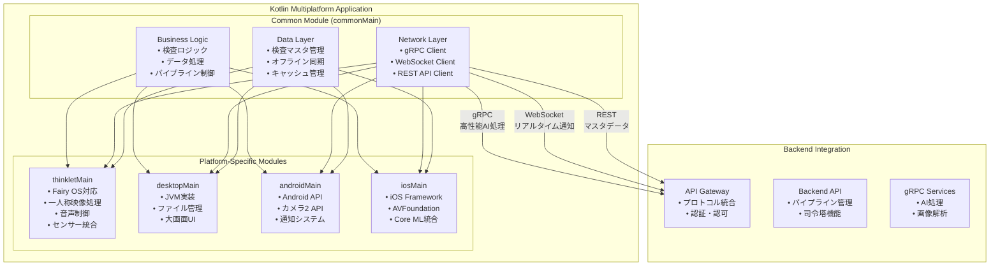

# Kotlin Multiplatform アプリ設計書

## 文書管理情報

| 項目       | 内容                              |
| ---------- | --------------------------------- |
| 文書名     | Kotlin Multiplatform アプリ設計書 |
| バージョン | 1.1                               |
| 作成日     | 2025年8月7日                      |
| 更新日     | 2025年8月11日                     |

---

## 1. 概要

### 1.1. 本書の目的

本書は、ImageFlowCanvasシステムにおけるKotlin Multiplatformアプリケーションの設計について詳細に記述するものです。THINKLET（ウェアラブルデバイス）、Desktop、Android、iOSアプリで共通利用される機能を統一的に実装するための設計指針を提供します。

### 1.2. 対象読者

- アプリケーション開発者
- システム設計者
- プロジェクトマネージャー
- 品質保証担当者

### 1.3. Kotlin Multiplatformアプリの役割

ImageFlowCanvasシステムにおいて、Kotlin Multiplatformアプリは以下の役割を担います：

- **統一コードベース**: 複数プラットフォーム間でのビジネスロジック共有
- **ネイティブ性能**: 各プラットフォーム固有の最適化
- **デバイス統合**: カメラ、マイク、センサーなどの統合制御
- **クロスプラットフォーム通信**: サーバーとの高性能gRPC通信

---

## 2. アーキテクチャ概要

### 2.1. 全体構成



### 2.2. プラットフォーム対応マトリックス

| 機能分類               | THINKLET | Desktop | Android | iOS | Handheld | 実装場所      |
| ---------------------- | -------- | ------- | ------- | --- | -------- | ------------- |
| ビジネスロジック       | ✅        | ✅       | ✅       | ✅   | ✅        | commonMain    |
| ネットワーク通信       | ✅        | ✅       | ✅       | ✅   | ✅        | commonMain    |
| データ管理             | ✅        | ✅       | ✅       | ✅   | ✅        | commonMain    |
| 製品情報管理           | ✅        | ✅       | ✅       | ✅   | ✅        | commonMain    |
| QRコード・バーコード   | ✅        | ✅       | ✅       | ✅   | ✅        | commonMain    |
| カメラ制御             | ✅        | ✅       | ✅       | ✅   | ✅        | expect/actual |
| 音声処理               | ✅        | 🔶       | ✅       | ✅   | ✅        | expect/actual |
| センサー統合           | ✅        | 🔶       | ✅       | ✅   | 🔶        | expect/actual |
| ファイル管理           | ✅        | ✅       | ✅       | ✅   | ✅        | expect/actual |
| 通知システム           | ✅        | ✅       | ✅       | ✅   | ✅        | expect/actual |
| 一人称映像処理         | ✅        | ❌       | 🔶       | 🔶   | ❌        | thinkletMain  |
| ウェアラブル最適化     | ✅        | ❌       | ❌       | ❌   | ❌        | thinkletMain  |
| リアルタイム監視表示   | ❌        | ✅       | 🔶       | 🔶   | ❌        | desktopMain   |
| 複数デバイス管理       | ❌        | ✅       | ❌       | ❌   | ❌        | desktopMain   |
| ハードウェアボタン制御 | 🔶        | 🔶       | ✅       | ❌   | ✅        | expect/actual |
| 小画面最適化UI         | ❌        | ❌       | ✅       | ✅   | ✅        | commonMain    |
| 振動フィードバック     | ❌        | ❌       | ✅       | ✅   | ✅        | expect/actual |
| 省電力制御             | 🔶        | ❌       | ✅       | ✅   | ✅        | expect/actual |

**凡例**: ✅ フル対応、🔶 限定対応、❌ 対応外

---

## 3. 共通機能設計 (commonMain)

### 3.1. ビジネスロジック層

#### 3.1.1. 検査ワークフロー管理（製品情報統合）

検査プロセス全体を管理するワークフロー層では、プラットフォームに依存しない共通ロジックを実装します。

**共通検査フロー（製品情報紐づけ対応）:**

| ステップ           | 処理内容                           | 製品情報連携                       |
| ------------------ | ---------------------------------- | ---------------------------------- |
| 1. 認証・ログイン  | JWT取得とロール確認                | ユーザー権限による製品アクセス制御 |
| 2. ホーム画面      | デバイス状態確認とメニュー表示     | 前回選択製品の復元表示             |
| 3. 製品情報取得    | QRコードスキャンまたはサーバー検索 | 指図番号・型式・機番等の自動特定   |
| 4. 検査項目一覧    | 製品タイプ対応検査項目表示         | 製品仕様に基づく動的項目ロード     |
| 5. カメラ撮影/録画 | 静止画・動画取得                   | 製品情報の自動メタデータ埋め込み   |
| 6. AI検査実行      | パイプライン処理                   | 製品情報紐づけリアルタイム結果     |
| 7. 人手確認        | AI結果検証・修正                   | 製品固有検査基準での判定支援       |
| 8. 完了・保存      | 結果確定・データ同期               | 製品トレーサビリティ情報更新       |
| 9. 履歴管理        | 検査履歴参照                       | 製品ベースでの履歴検索・表示       |

**検査状態管理（製品情報ステートマシン）:**

状態遷移を統一管理し、製品情報の整合性を維持する仕組みを提供します：

| 状態               | 説明                           | 次の状態                              |
| ------------------ | ------------------------------ | ------------------------------------- |
| PRODUCT_SCANNING   | QRコード・バーコードスキャン中 | PRODUCT_IDENTIFIED / QR_DECODE_FAILED |
| PRODUCT_IDENTIFIED | 製品情報特定完了               | IN_PROGRESS / PRODUCT_NOT_FOUND       |
| IN_PROGRESS        | 検査実行中                     | AI_COMPLETED / FAILED                 |
| AI_COMPLETED       | AI処理完了                     | HUMAN_REVIEW / COMPLETED              |
| HUMAN_REVIEW       | 人手検証中                     | COMPLETED / CANCELLED                 |
| COMPLETED          | 検査完了                       | -                                     |

**例外状態**: PRODUCT_NOT_FOUND（製品未発見）、QR_DECODE_FAILED（QR解析失敗）、FAILED（処理失敗）、CANCELLED（キャンセル）

**進捗管理指標**:
- 項目単位進捗と全体進捗の表示
- 製品処理時間の測定
- AI信頼度スコアの記録
- 人手修正率の算出
- 製品トレーサビリティの自動記録
- WebSocketによるリアルタイム状態更新

**製品情報取得統合:**

各プラットフォームの最適な機能を expect/actual パターンで統一的に活用：

| 機能分類       | THINKLET               | Android            | iOS           | Desktop            |
| -------------- | ---------------------- | ------------------ | ------------- | ------------------ |
| QRスキャン     | 専用カメラAPI + 音声FB | ML Kit 高速認識    | AVFoundation  | 外部リーダー/ZXing |
| 製品検索UI     | 音声制御対応           | オートコンプリート | SwiftUI最適化 | 大画面表示         |
| オフライン対応 | ローカルキャッシュ     | SQLite管理         | Core Data統合 | ファイルDB         |
| 製品情報検証   | リアルタイム音声通知   | 重複チェック       | 整合性検証    | バッチ検証         |

**QR/バーコードスキャン統合（製品情報デコード）:**

統一インターフェースによる製品情報の自動デコード処理：
- プラットフォーム別最適化ライブラリの使用
- 製品情報パース処理の共通化
- 音声フィードバック機能の統合
- エラーハンドリングの標準化

**主要機能（製品情報対応）:**

| 機能分類         | 説明                             | 製品情報連携                             |
| ---------------- | -------------------------------- | ---------------------------------------- |
| 検査実行制御     | 製品情報紐づけ検査の実行管理     | 製品ID・仕様に基づく自動パラメーター設定 |
| 検査項目管理     | 製品タイプ別検査項目の動的ロード | 型式・仕様書からの検査項目自動生成       |
| 静止画・動画検査 | 製品情報埋め込み画像・映像検査   | メタデータへの製品情報自動付与           |
| 一人称映像検査   | リアルタイム映像処理             | 製品メタデータの自動付与・関連付け       |
| 処理フロー選択   | 検査タイプ・製品仕様対応         | 製品特性に最適化されたパイプライン       |
| THINKLET特化機能 | 一人称映像検査の統合処理         | 製品スキャン→映像→AI→アラート統合        |

**THINKLETでの製品情報連携一人称映像検査フロー:**
1. 製品QRコードスキャンによる自動特定
2. 映像ストリーミング開始（製品情報付きメタデータ）
3. AIパイプライン適用（製品固有検査基準）
4. 製品情報付きリアルタイム結果通知
5. 不良検出時の製品特定アラート出力

#### 3.1.2. 製品情報管理ロジック

**製品マスタデータ管理:**

製品情報の統一データモデルを提供し、全プラットフォームで一貫した製品管理を実現します。

| データ項目 | 説明                     | 用途             |
| ---------- | ------------------------ | ---------------- |
| 基本情報   | ID、指図番号、指示番号   | 製品の一意特定   |
| 製品仕様   | 型式、機番、生産年月日   | 検査基準の決定   |
| 生産情報   | 月連番、QRコードデータ   | トレーサビリティ |
| ステータス | ACTIVE/INACTIVE/OBSOLETE | 検査可否の判定   |

**製品ステータス管理:**
- **ACTIVE**: 検査対象として有効な製品
- **INACTIVE**: 一時的に検査対象外の製品  
- **OBSOLETE**: 廃止された製品

**QRコード処理ロジック:**

統一されたQRコード処理インターフェースにより、プラットフォーム固有の実装を抽象化：
- QRコードスキャン結果の標準化
- 製品情報デコード処理の共通化
- QRフォーマット検証機能
- エラーハンドリングの統一

**製品検索ロジック:**

柔軟な検索条件による製品マスタ検索機能：
- 指図番号・型式・機番による複合検索
- 生産日範囲での絞り込み検索
- キャッシュされた製品情報の高速取得
- サーバー同期によるマスタデータ更新

#### 3.1.3. パイプライン実行制御（製品情報連携）

デバイス特性に応じたパイプライン実行制御では、各デバイスの能力を考慮した最適化処理を実装します。

**デバイス能力評価システム:**

| デバイス | 処理能力         | 最適化戦略           | 実行パイプライン   |
| -------- | ---------------- | -------------------- | ------------------ |
| THINKLET | ウェアラブル特化 | 低消費電力・軽量処理 | 一人称映像最適化   |
| MOBILE   | 中程度処理能力   | バッテリー効率重視   | モバイル向け最適化 |
| DESKTOP  | 高処理能力       | 高性能・並列処理     | デスクトップ向け   |

**パイプライン最適化機能:**
- デバイス能力の自動検出と評価
- リソース使用量に基づく動的最適化
- プラットフォーム固有の処理戦略選択
- 負荷分散による効率的な処理配分

**製品情報連携処理:**
- 製品仕様に基づくパイプライン設定の自動調整
- 製品タイプ別の検査基準適用
- 製品情報のメタデータ自動付与
- 製品固有の品質基準による判定処理

### 3.2. ネットワーク通信層

#### 3.2.1. 統合通信クライアント

統合通信クライアントでは、適材適所の通信プロトコル選択により効率的な処理を実現します。

**通信プロトコル選択表:**

| プロトコル  | 用途               | 特徴                 | 使用場面                     |
| ----------- | ------------------ | -------------------- | ---------------------------- |
| gRPC        | 高性能AI処理       | バイナリ通信・低遅延 | パイプライン実行・大容量転送 |
| WebSocket   | リアルタイム監視   | 双方向通信・即時性   | 進捗通知・状態更新           |
| REST        | マスタデータ取得   | 標準的・互換性       | 検査設定・製品情報           |
| WebRTC/WHEP | 映像ストリーミング | 超低遅延             | THINKLET一人称映像           |

**通信最適化戦略:**
- **パイプライン実行**: gRPCバイナリ転送による高性能処理
- **リアルタイム進捗**: WebSocket双方向通信による即時フィードバック
- **マスタデータ**: RESTful APIによる標準的なデータ交換
- **映像伝送**: WebRTC/WHEPによる超低遅延ストリーミング

#### 3.2.2. データ同期戦略

**ローカルデータベース設計:**

| 技術選択   | 推奨実装 | 特徴                             | 主要テーブル                         |
| ---------- | -------- | -------------------------------- | ------------------------------------ |
| SQLDelight | 推奨     | 型安全性・マルチプラットフォーム | inspection_targets, inspection_items |
| Realm      | 代替案   | オブジェクトDB・簡易性           | inspection_executions, results       |

**主要テーブル構成:**
- **検査関連**: inspection_targets（検査対象）、inspection_items（検査項目）、inspection_executions（検査実行）、inspection_results（検査結果）
- **同期管理**: client_sync_queue（優先度制御付き同期キュー）
- **キャッシュ**: pipeline_cache（パイプライン結果）、image_metadata（画像メタデータ）

**同期機能特徴:**

| 機能         | 説明                           | 実装方法                         |
| ------------ | ------------------------------ | -------------------------------- |
| 双方向同期   | サーバー・クライアント差分同期 | タイムスタンプベース差分検出     |
| 優先度制御   | 重要度による同期順序制御       | 優先度キューによる処理順序管理   |
| 競合解決     | データ競合時の自動解決         | タイムスタンプ自動解決+手動選択  |
| リトライ機能 | ネットワーク障害時の再試行     | 指数バックオフによる自動リトライ |

**オフライン対応機能:**
- **完全オフライン動作**: ネットワーク断絶時の業務継続性確保
- **復旧時自動同期**: 接続回復時の差分データ自動同期
- **同期状況可視化**: 同期進捗とステータスのリアルタイム表示
- **整合性保証**: データ整合性の検証と修復機能

#### 3.2.3. 通信・ネットワーク最適化

**統合API設計アーキテクチャ:**

| 構成要素          | 役割           | プロトコル          | 用途                         |
| ----------------- | -------------- | ------------------- | ---------------------------- |
| Backend API司令塔 | 単一窓口統合   | HTTP/gRPC/WebSocket | プロトコル仲介・ルーティング |
| gRPC通信          | 高性能処理     | gRPC                | AI実行・大容量データ転送     |
| WebSocket通信     | リアルタイム   | WebSocket           | 進捗通知・状態更新           |
| REST API          | 標準データ     | HTTP REST           | マスタデータ・設定管理       |
| Kafka連携         | メッセージング | Kafka→WebSocket     | 通知基盤・イベント配信       |

**パフォーマンス最適化戦略:**

| 最適化項目     | 実装方法               | 効果               |
| -------------- | ---------------------- | ------------------ |
| HTTP/2優先     | 多重化通信             | 効率的な並列通信   |
| 転送圧縮       | gzip/brotli            | 帯域使用量削減     |
| キャッシュ制御 | 結果・マスタキャッシュ | レスポンス時間短縮 |
| プリフェッチ   | 先読み処理             | ユーザー体験向上   |

**Kafka連携による通知システム:**
- Kafka トピックから WebSocket チャネルへの中継
- トピック相当チャネルの購読管理
- リアルタイム通知配信の最適化
- スケーラブルなメッセージング基盤

---

## 4. プラットフォーム固有実装

### 4.1. THINKLET実装 (thinkletMain)

#### 4.1.1. 一人称映像処理

THINKLET固有のカメラ制御システムでは、8MP・120度視野角の一人称映像を最適化して処理します。

**高品質映像設定仕様:**

| 項目           | 仕様                       | 最適化ポイント       |
| -------------- | -------------------------- | -------------------- |
| 解像度         | 8MP（3840×2160）           | 高精細な検査対象撮影 |
| 視野角         | 水平120度×垂直90度         | 広範囲作業領域カバー |
| フレームレート | 30fps                      | リアルタイム処理対応 |
| 安定化         | 肩掛け固定型               | 安定した映像品質     |
| 調整機能       | オートフォーカス・自動露出 | 工場環境への自動適応 |

**録画機能の最適化:**

| 最適化項目     | 実装内容        | 効果                 |
| -------------- | --------------- | -------------------- |
| バッテリー効率 | 動的品質調整    | 8時間連続録画対応    |
| 容量最適化     | H.264高効率圧縮 | ストレージ使用量削減 |
| 音声録画       | AAC音声付き     | 完全な作業記録       |
| 低照度対応     | 工場照明最適化  | 暗部での視認性向上   |

**一人称映像処理の特徴:**
- ウェアラブルデバイス特有の視点からの撮影最適化
- 作業者の手元・対象物の自動フォーカス調整
- 工場内照明条件に適応した画質自動調整
- 連続8時間使用を前提とした省電力設計

### 4.3. Handheld Terminal実装 (handheldMain)

#### 4.3.1. 小画面最適化処理

ハンディターミナル固有の小画面環境での最適化処理：

**画面サイズ適応設計:**

| 画面サイズ  | 解像度範囲         | UI最適化戦略     | 操作方法       |
| ----------- | ------------------ | ---------------- | -------------- |
| 3.5-4インチ | 800×480-1024×768   | 超コンパクト表示 | 片手操作特化   |
| 4-5インチ   | 1024×768-1280×800  | 標準モバイル表示 | 片手・両手混在 |
| 5-6インチ   | 1280×800-1920×1200 | 高密度表示       | 両手操作対応   |

**片手操作最適化:**
- **親指操作範囲**: 画面下部1/3エリアへの重要UI配置
- **タッチターゲット**: 最小44dp、推奨48dpのタッチ領域確保
- **情報密度制御**: 画面サイズに応じた表示情報の優先順位調整
- **ナビゲーション**: スワイプ・フリック操作による高速移動

**省電力モード統合:**

| バッテリー残量 | 動作モード     | 制御項目             | 効果                 |
| -------------- | -------------- | -------------------- | -------------------- |
| 80%以上        | 高性能モード   | 最大性能・標準輝度   | 快適な操作環境       |
| 50-80%         | バランスモード | 適度な制限・自動輝度 | 性能と電力のバランス |
| 20-50%         | 省電力モード   | 機能制限・低輝度     | 使用時間延長         |
| 20%未満        | 緊急モード     | 最小機能・最低輝度   | 緊急時継続使用       |

**環境適応機能:**
- 環境光センサー連動の画面輝度最適化
- CPUサーマルスロットリング対応
- 通信頻度のバッテリー残量連動調整

#### 4.3.2. QRコード・バーコードスキャン統合

**製品情報取得スキャン機能:**

統一されたスキャン処理により、製品情報の自動取得と検証を実現：

| スキャン形式 | 対応内容    | 製品情報抽出          | 用途         |
| ------------ | ----------- | --------------------- | ------------ |
| QRコード     | JIS規格対応 | 型式・機番・月連番    | 主要製品識別 |
| Code128      | GS1準拠     | JANコード・製品コード | 標準商品識別 |
| DataMatrix   | ISO/IEC準拠 | シリアル番号・ロット  | 精密部品識別 |
| PDF417       | 高密度2D    | 詳細製品仕様          | 複合情報管理 |

**スキャン最適化機能:**

| 最適化項目       | 実装内容                   | 効果                   |
| ---------------- | -------------------------- | ---------------------- |
| 工場環境対応     | 照明ノイズ除去・反射対策   | 読み取り精度向上       |
| バッテリー最適化 | スキャン頻度制御・スリープ | 長時間使用対応         |
| リアルタイム検証 | 即座サーバー照合           | データ整合性確保       |
| オフライン対応   | ローカルキャッシュ検索     | ネットワーク断絶時対応 |

**製品情報デコード処理:**
- スキャン結果から製品マスタ情報の自動抽出
- 型式・機番・月連番の構造化データ変換
- 製品存在確認とバリデーション処理
- エラー時の代替検索機能提供

#### 4.3.3. ハードウェア統合制御

**物理ボタン制御:**

ハンディターミナル固有の物理ボタンを活用した効率的な操作環境を提供：

| ボタン種類     | 機能割り当て   | 操作内容           | 使用場面       |
| -------------- | -------------- | ------------------ | -------------- |
| スキャンボタン | QRスキャン起動 | 即座スキャン開始   | 製品情報取得   |
| 音量ボタン     | ナビゲーション | 前項目・次項目移動 | 片手操作時     |
| 電源ボタン     | 省電力制御     | スリープ・復帰     | バッテリー節約 |
| カスタムボタン | メーカー固有   | 確認・キャンセル   | 専用端末対応   |

**振動フィードバック統合:**

| フィードバック種類 | 振動パターン        | 用途             | 効果               |
| ------------------ | ------------------- | ---------------- | ------------------ |
| スキャン成功       | 短振動（100ms）     | 読み取り完了通知 | 即座確認           |
| スキャン失敗       | 長振動（300ms）     | エラー通知       | 注意喚起           |
| ナビゲーション     | 軽振動（50ms）      | 画面移動確認     | 操作フィードバック |
| アラート           | 断続振動（200ms×3） | 警告通知         | 重要事項通知       |
| 確認操作           | パルス振動（150ms） | 操作確定         | 安心感提供         |

**産業環境対応機能:**

| 対応項目   | 仕様          | 効果                 |
| ---------- | ------------- | -------------------- |
| 防塵・防水 | IP65/IP67準拠 | 工場環境での安定動作 |
| 耐衝撃性   | 1.5m落下耐性  | 作業現場での堅牢性   |
| 動作温度   | -10℃〜+50℃    | 極端環境での信頼性   |
| 連続動作   | 8-12時間対応  | シフト業務への対応   |

#### 4.3.4. 製品情報管理特化機能

**製品情報キャッシュ戦略:**

効率的な製品情報管理により、オフライン環境での業務継続性を確保：

| キャッシュ種類   | 対象データ   | 容量制限 | 更新頻度     |
| ---------------- | ------------ | -------- | ------------ |
| 頻繁使用製品     | 最大1000件   | 50MB     | リアルタイム |
| 当日スケジュール | 予定検査製品 | 10MB     | 毎朝自動     |
| 製品マスタ       | 全製品情報   | 500MB    | 週次同期     |
| 検査履歴         | 直近30日分   | 100MB    | 随時更新     |

**キャッシュ最適化機能:**

| 最適化項目     | 実装内容                     | 効果                  |
| -------------- | ---------------------------- | --------------------- |
| ヒット率向上   | 使用頻度分析・予測先読み     | 90%以上のヒット率達成 |
| ストレージ効率 | 圧縮・重複排除               | 容量使用量50%削減     |
| 同期最適化     | 差分更新・バックグラウンド   | ネットワーク負荷軽減  |
| 整合性保証     | チェックサム・バージョン管理 | データ破損防止        |

**検査状態管理:**

製品紐づけ検査の状態を一元管理し、進捗の可視化と制御を実現：

| 状態管理項目   | 管理内容           | 表示情報                       |
| -------------- | ------------------ | ------------------------------ |
| 検査セッション | 製品別検査進行状況 | 開始時刻・進捗率・予想完了時間 |
| 検査項目進捗   | 項目別完了状況     | 完了数/総数・現在実行項目      |
| 検査結果履歴   | 過去検査記録       | 日付・結果・検査者・信頼度     |
| 同期状態       | サーバー同期状況   | 未同期数・最終同期時刻         |

#### 4.3.5. ローカルネットワーク統合

**工場内ネットワーク対応:**

産業環境に特化したネットワーク統合により、安定した通信環境を実現：

| 接続方式         | 用途         | 特徴                   | 適用場面               |
| ---------------- | ------------ | ---------------------- | ---------------------- |
| 有線LAN          | 固定設備接続 | 高速・安定・低遅延     | 据え置き型作業場       |
| 工場WiFi         | モバイル接続 | 移動対応・中速度       | 移動作業・点検業務     |
| ローカルサーバー | エッジ処理   | 低遅延・オフライン対応 | 独立ライン運用         |
| 冗長接続         | 障害対策     | 自動切り替え・継続性   | ミッションクリティカル |

**ネットワーク品質監視:**

| 監視項目 | 測定値      | 品質評価基準                                       | 対応アクション |
| -------- | ----------- | -------------------------------------------------- | -------------- |
| 信号強度 | -30〜-90dBm | 良好(-50以上)・普通(-70以上)・不良(-70未満)        | 接続先最適化   |
| 遅延時間 | 1-500ms     | 優秀(50ms未満)・良好(100ms未満)・要改善(100ms以上) | QoS調整        |
| 帯域幅   | 1-100Mbps   | 高速(10Mbps以上)・中速(1Mbps以上)・低速(1Mbps未満) | 転送最適化     |
| 信頼性   | 90-99.9%    | 高信頼(99%以上)・普通(95%以上)・要対策(95%未満)    | 冗長化検討     |

**通信プロトコル最適化:**

工場環境に適した通信最適化戦略：
- **サービス発見**: mDNS/Bonjourによる自動サーバー検出
- **接続最適化**: 信号強度・遅延による最適AP選択（5GHz/20MHz/非DFS/低出力の小型AP設計に準拠）
- **オフライン同期**: ネットワーク復旧時の効率的差分同期
- **負荷分散**: 複数接続経路による通信負荷分散

注: 現場ネットワークの詳細設計・運用は `0307_インフラ設計.md` の「8.1.3. 現場ネットワーク設計（小型AP＋有線バックホール）」を参照。

#### 4.2.1. リアルタイム監視ダッシュボード

Desktop特化の監視機能では、複数のウェアラブルデバイスからのリアルタイムデータを統合表示します。

**リアルタイム映像監視機能:**
- **マルチストリーム表示**: 複数THINKLETデバイスからの同時映像表示
- **グリッドレイアウト**: 4×4、3×3、2×2の可変レイアウト対応
- **映像品質自動調整**: ネットワーク状況に応じた解像度・フレームレート最適化
- **フルスクリーン切替**: 個別映像の拡大表示機能

**AI不良判定結果表示:**
- **リアルタイム判定結果**: OK/NG判定の即座表示（<100ms遅延）
- **信頼度スコア**: AI判定の確信度を0-100%で表示
- **不良箇所ハイライト**: 検出された不良部分の枠線・色分け表示
- **ヒートマップ表示**: 不良確率の濃淡マップ重畳表示
- **判定履歴**: 直近100件の判定結果履歴表示

**アラート・通知システム:**
- **重要度別色分け**: Critical（赤）、High（橙）、Medium（黄）、Low（緑）
- **音声アラート**: システム音による重要度別通知
- **ポップアップ通知**: デスクトップ通知との連携
- **エスカレーション**: 一定時間未対応の場合の上位者通知

**統計・分析機能:**
- **リアルタイム統計**: 検査数、合格率、不良率のリアルタイム更新
- **時間別傾向**: 1時間、1日、1週間単位での傾向グラフ
- **デバイス別パフォーマンス**: 各THINKLETの検査効率・精度分析
- **不良種別分析**: 検出された不良タイプの分類・集計

**デバイス管理機能:**
- **接続状態監視**: 各THINKLETの接続状況・電池残量表示
- **パフォーマンス監視**: CPU使用率、温度、ネットワーク品質
- **設定管理**: リモートでの検査パラメーター調整
- **ファームウェア管理**: デバイスソフトウェアの更新状況管理

### 4.2. Desktop実装 (desktopMain)

#### 4.2.1. リアルタイム監視ダッシュボード

Desktop特化の監視機能では、複数のウェアラブルデバイスからのリアルタイムデータを統合表示します。

**リアルタイム映像監視機能:**
- **マルチストリーム表示**: 複数THINKLETデバイスからの同時映像表示
- **グリッドレイアウト**: 4×4、3×3、2×2の可変レイアウト対応
- **映像品質自動調整**: ネットワーク状況に応じた解像度・フレームレート最適化
- **フルスクリーン切替**: 個別映像の拡大表示機能

**AI不良判定結果表示:**
- **リアルタイム判定結果**: OK/NG判定の即座表示（<100ms遅延）
- **信頼度スコア**: AI判定の確信度を0-100%で表示
- **不良箇所ハイライト**: 検出された不良部分の枠線・色分け表示
- **ヒートマップ表示**: 不良確率の濃淡マップ重畳表示
- **判定履歴**: 直近100件の判定結果履歴表示

**アラート・通知システム:**
- **重要度別色分け**: Critical（赤）、High（橙）、Medium（黄）、Low（緑）
- **音声アラート**: システム音による重要度別通知
- **ポップアップ通知**: デスクトップ通知との連携
- **エスカレーション**: 一定時間未対応の場合の上位者通知

**統計・分析機能:**
- **リアルタイム統計**: 検査数、合格率、不良率のリアルタイム更新
- **時間別傾向**: 1時間、1日、1週間単位での傾向グラフ
- **デバイス別パフォーマンス**: 各THINKLETの検査効率・精度分析
- **不良種別分析**: 検出された不良タイプの分類・集計

**デバイス管理機能:**
- **接続状態監視**: 各THINKLETの接続状況・電池残量表示
- **パフォーマンス監視**: CPU使用率、温度、ネットワーク品質
- **設定管理**: リモートでの検査パラメーター調整
- **ファームウェア管理**: デバイスソフトウェアの更新状況管理

THINKLET音声制御システムでは、5chマイクアレイとXFE技術を活用した高品質音声処理を実現します。

**高品質音声収集仕様:**

| 音声収集項目 | 仕様         | 技術特徴           |
| ------------ | ------------ | ------------------ |
| マイクアレイ | 5チャンネル  | 方向性・指向性制御 |
| サンプリング | 48kHz/24bit  | 高音質音声収集     |
| XFE技術      | 環境騒音抑制 | 装着者音声抽出     |
| 適応制御     | 自動音量調整 | 騒音環境対応       |
| 出力形式     | 1ch最適化    | 5ch→1ch集約処理    |

**音声フィードバック環境適応:**

| 騒音レベル | 環境分類   | 音量調整     | 最適化内容   |
| ---------- | ---------- | ------------ | ------------ |
| 60dB未満   | 通常環境   | 基準音量×1.0 | 標準音量維持 |
| 60-80dB    | 中騒音環境 | 基準音量×1.2 | 軽度音量増強 |
| 80dB超     | 高騒音環境 | 基準音量×1.5 | 大幅音量増強 |

**音声制御機能:**
- 内蔵スピーカーによる明瞭な音声出力
- 環境騒音レベルの自動検出と音量最適化
- 声認識向け高明度設定による品質向上
- リアルタイム音声フィードバック機能

#### 4.1.3. センサー統合

THINKLET搭載センサーの統合管理では、多様なセンサーを活用した作業状態分析を実現します。

**対応センサー仕様:**

| センサー種類         | 機能     | 検出内容           | 用途         |
| -------------------- | -------- | ------------------ | ------------ |
| 加速度センサー       | 動作検出 | デバイス移動・振動 | 作業状態分析 |
| ジャイロスコープ     | 回転検出 | 姿勢・向き変化     | 装着状態確認 |
| 地磁気センサー       | 方向測定 | 向き・方位         | 空間位置把握 |
| 近接センサー         | 接触検出 | 装着状態           | 装着判定     |
| ジェスチャーセンサー | 動作認識 | ハンズフリー操作   | 非接触制御   |
| GNSS                 | 位置測定 | 緯度経度・高度     | 位置情報記録 |
| 環境光センサー       | 照度測定 | 周囲明度           | 画面輝度調整 |

**装着状態検出システム:**

| 検出項目     | 使用センサー     | 判定基準             | 対応アクション |
| ------------ | ---------------- | -------------------- | -------------- |
| 装着判定     | 近接センサー     | 身体接触検出         | 自動画面ON/OFF |
| 動作安定性   | 加速度・ジャイロ | 振動レベル測定       | 手ぶれ補正調整 |
| デバイス向き | 地磁気・ジャイロ | 装着方向確認         | UI表示最適化   |
| 継続監視     | 全センサー統合   | リアルタイム状態更新 | 異常時アラート |

**作業状態分析機能:**
- モーションパターンによる作業種別の自動識別
- 作業効率性の定量的評価とフィードバック
- 異常動作検出による安全性確保
- 環境条件変化への自動適応制御

---

## 5. デバイス統合管理

### 5.1. デバイス能力抽象化

デバイス能力抽象化では、プラットフォーム間の違いを統一的なインターフェースで管理します。

**プラットフォーム分類と特徴:**

| プラットフォーム | OS基盤                | 主要用途         | 特化機能                   |
| ---------------- | --------------------- | ---------------- | -------------------------- |
| THINKLET         | Fairy OS (AOSP-based) | ウェアラブル検査 | 一人称映像・センサー統合   |
| ANDROID          | Android               | モバイル検査     | カメラ・通知・ハードウェア |
| iOS              | iOS                   | モバイル検査     | カメラ・生体認証・Core ML  |
| DESKTOP          | JVM                   | 監視・管理       | 大画面・複数デバイス管理   |

**カメラ能力統一管理:**

| 能力項目         | THINKLET        | Android          | iOS              | Desktop    |
| ---------------- | --------------- | ---------------- | ---------------- | ---------- |
| 最大解像度       | 8MP (3840×2160) | 端末依存         | 端末依存         | 外部カメラ |
| 視野角           | 120度×90度      | 標準             | 標準             | 設定可能   |
| 対応フォーマット | H.264/AAC       | Multiple         | Multiple         | Multiple   |
| 録画機能         | ✅ 8時間対応     | ✅ バッテリー依存 | ✅ バッテリー依存 | ✅ 制限なし |
| 手ぶれ補正       | 肩掛け固定      | 電子補正         | 光学/電子補正    | 外部依存   |

**音声能力統一管理:**

| 能力項目      | THINKLET         | Android  | iOS        | Desktop      |
| ------------- | ---------------- | -------- | ---------- | ------------ |
| マイク仕様    | 5ch・48kHz/24bit | 端末標準 | 端末標準   | 外部マイク   |
| ノイズ処理    | XFE技術          | OS標準   | Core Audio | ソフトウェア |
| スピーカー    | 内蔵・環境適応   | 端末標準 | 端末標準   | システム音声 |
| Bluetooth音声 | ✅                | ✅        | ✅          | ✅            |

**接続・性能統一管理:**

デバイス固有の性能特性を統一インターフェースで抽象化し、最適な処理戦略を自動選択します。

---

## 6. 通信プロトコル統合

### 6.1. gRPC統合（高性能AI処理）

gRPC統合により、一人称映像のリアルタイム処理を高性能で実現します。

**一人称映像リアルタイムAI処理アーキテクチャ:**

| 処理段階       | 技術要素     | 処理内容                 | 性能要件             |
| -------------- | ------------ | ------------------------ | -------------------- |
| 映像受信       | WebRTC/WHEP  | 超低遅延ストリーミング   | <100ms遅延           |
| AI処理実行     | gRPC         | 高性能推論パイプライン   | リアルタイム並列処理 |
| メタデータ付与 | 自動処理     | デバイス・位置・時刻情報 | 即時付与             |
| 結果配信       | gRPC Stream  | ストリーミング結果受信   | 低遅延配信           |
| UI更新         | リアクティブ | フィードバック提供       | 即座反映             |

**処理フロー詳細:**

| ステップ              | 処理内容                  | データ形式         | 最適化ポイント           |
| --------------------- | ------------------------- | ------------------ | ------------------------ |
| 1. 映像受信           | WebRTC/WHEPストリーミング | H.264/VP8          | 帯域最適化・品質調整     |
| 2. デコード・前処理   | フレーム抽出・正規化      | Raw pixel data     | GPU活用・並列処理        |
| 3. gRPC AI実行        | 並列推論パイプライン      | Protobuf binary    | バッチ処理・キューイング |
| 4. 結果ストリーミング | gRPCストリーミング受信    | Structured results | 非同期処理・優先度制御   |
| 5. UI・フィードバック | 結果表示・通知            | JSON/UI objects    | レスポンシブ更新         |

**エラーハンドリング・自動復旧:**
- 接続断絶時の自動再接続機能
- 品質劣化時の動的パラメーター調整
- フェールオーバー時の代替処理経路
- 処理遅延時の優先度制御とスキップ機能

**メタデータ統合:**
THINKLETデバイス固有の情報を AI処理結果に自動付与し、完全なトレーサビリティを実現します。

---

## 7. セキュリティ

### 7.1. 認証・認可システム

#### 7.1.1. 認証フロー
- **JWT取得・更新**: Backend APIからのトークン取得と自動更新
- **ロールベースアクセス制御（RBAC）**: 機能レベルでの権限制御
- **オフライン認証**: ネットワーク断絶時の認証キャッシュ継続
- **セッション管理**: 適切なタイムアウトとセキュアな状態管理

#### 7.1.2. 生体認証統合
プラットフォーム固有の生体認証機能を統一インターフェースで提供：
- **Android**: 指紋認証・顔認証による再認証
- **iOS**: Face ID・Touch IDによる再認証
- **Desktop**: Windows Hello・TouchBar統合
- **THINKLET**: 装着状態検出との連携

### 7.2. データ保護・暗号化

#### 7.2.1. セキュアストレージ
- **認証情報**: JWT・APIキーのKeychain/Keystore保存
- **ローカルDB**: SQLCipher等による暗号化
- **設定データ**: プラットフォーム標準の暗号化ストレージ活用

#### 7.2.2. 画像・録画データ保護
- **端末保存**: AES暗号化による機密性確保
- **通信保護**: TLS/SSLによる転送時暗号化
- **完全性保証**: チェックサム・デジタル署名のメタデータ保持
- **改ざん検知**: ハッシュ値による不正変更検出

---

## 8. 運用機能・履歴管理

### 8.1. 検査履歴・データ管理

#### 8.1.1. 履歴機能
- **検索・フィルタ**: 日付範囲、検査タイプ、結果ステータスによる絞り込み
- **詳細表示**: 検査結果、AI信頼度、修正履歴の確認
- **関連データ**: 画像・動画・音声データの関連付け表示

#### 8.1.2. エクスポート機能
- **データ形式**: CSV・JSON形式でのエクスポート
- **権限制御**: ユーザーロールに応じたエクスポート範囲制限
- **監査対応**: エクスポート操作の完全ログ記録
- **ID・バージョン管理**: サーバー側との整合性確保

### 8.2. データ同期・バックアップ

#### 8.2.1. 自動バックアップ
- **定期同期**: 設定可能な間隔での自動データ同期
- **差分バックアップ**: 変更分のみの効率的なバックアップ
- **復元機能**: デバイス交換時のデータ復元対応

#### 8.2.2. 災害対策
- **オフライン継続**: 長期間ネットワーク断絶時の業務継続
- **データ保全**: ローカルデータの冗長化・保護
- **緊急時手順**: 災害時のデータ救出・移行手順

---

## 9. ハンディターミナル統合実装 (handheldMain)

### 9.1. 製品情報管理特化機能

ハンディターミナル特有の小画面・片手操作環境に最適化された製品情報管理システム：

#### 9.1.1. 製品情報取得統合

**統合スキャンシステム:**

プラットフォーム横断的な製品情報取得インターフェースを提供：

| 取得方法     | 対応形式       | 実装要素                   | 最適化ポイント           |
| ------------ | -------------- | -------------------------- | ------------------------ |
| QRスキャン   | JIS X 0510準拠 | カメラ統合・デコード処理   | 高速認識・エラー処理     |
| サーバー検索 | REST API       | 検索UI・オートコンプリート | UX最適化・履歴活用       |
| 履歴参照     | ローカルDB     | 最近使用・頻度順           | 高速アクセス・キャッシュ |
| お気に入り   | ユーザー設定   | 個人設定・同期             | 個人化・効率向上         |

**製品情報データ統合:**

統一された製品情報データモデルにより、プラットフォーム間での一貫性を確保：

| データ分類   | 主要項目                 | 用途                       | 管理方法         |
| ------------ | ------------------------ | -------------------------- | ---------------- |
| 基本識別情報 | ID・指図番号・指示番号   | 一意特定・トレーサビリティ | 不変キー管理     |
| 製品仕様     | 型式・機番・生産年月日   | 検査基準決定・品質管理     | バージョン管理   |
| 生産管理     | 月連番・QRデータ・仕様書 | 生産追跡・設定管理         | 関連付け管理     |
| 状態管理     | ステータス・検査履歴     | 進捗管理・結果追跡         | リアルタイム更新 |

**スキャン結果データ構造:**

| 結果項目     | データ型    | 説明                         | 検証項目           |
| ------------ | ----------- | ---------------------------- | ------------------ |
| 成功可否     | Boolean     | スキャン処理結果             | エラーハンドリング |
| 製品情報     | ProductInfo | 取得された製品データ         | 整合性確認         |
| 生データ     | String      | QR/バーコード生データ        | フォーマット検証   |
| スキャン種別 | Enum        | QR/Code128/DataMatrix/PDF417 | 形式別最適化       |
| 信頼度       | Float       | 認識精度                     | 品質評価           |
| 検証状態     | Enum        | VALID/INVALID/NETWORK_ERROR  | 後続処理制御       |

#### 9.1.2. 製品選択状態管理

**ライフサイクル管理システム:**

製品選択から検査完了までの状態を一元管理：

| 状態                   | 説明           | 遷移条件     | UI表示       |
| ---------------------- | -------------- | ------------ | ------------ |
| IDLE                   | 製品未選択     | 初期状態     | 選択画面     |
| SCANNING               | QRスキャン中   | スキャン開始 | スキャン画面 |
| SEARCHING              | サーバー検索中 | 検索実行     | 検索進行表示 |
| CONFIRMING             | 製品情報確認中 | 候補選択     | 確認画面     |
| SELECTED               | 製品選択完了   | 確定操作     | 製品情報表示 |
| INSPECTION_READY       | 検査準備完了   | 検査開始準備 | 検査開始画面 |
| INSPECTION_IN_PROGRESS | 検査実行中     | 検査進行     | 進捗表示     |
| INSPECTION_COMPLETED   | 検査完了       | 検査終了     | 完了画面     |
| ERROR                  | エラー状態     | 例外発生     | エラー表示   |

**状態管理機能:**
- リアクティブな状態監視による UI自動更新
- 状態遷移時の自動バリデーション処理
- 異常状態検知時の自動復旧機能
- 進捗状況の永続化とセッション復元
    suspend fun clearSelection(): ClearResult
    suspend fun switchProduct(newProductInfo: ProductInfo): SwitchResult
    fun getCurrentInspectionProgress(): InspectionProgress?
    suspend fun saveSelectionState()
    suspend fun restoreSelectionState(): ProductInfo?
}

enum class ProductSelectionState {
    IDLE,                    // 製品未選択
    SCANNING,               // QRスキャン中
    SEARCHING,              // サーバー検索中
    CONFIRMING,             // 製品情報確認中
    SELECTED,               // 製品選択完了
    INSPECTION_READY,       // 検査準備完了
    INSPECTION_IN_PROGRESS, // 検査実行中
    INSPECTION_COMPLETED,   // 検査完了
    ERROR                   // エラー状態
}

data class SelectionResult(
    val success: Boolean,
    val product: ProductInfo?,
    val validationErrors: List<ValidationError>,
    val warnings: List<String>
)

#### 9.1.3. 製品検索・履歴機能

**インテリジェント検索システム:**

| 検索機能       | 実装内容               | 使用場面           | 最適化             |
| -------------- | ---------------------- | ------------------ | ------------------ |
| 履歴検索       | 最近アクセス・使用頻度 | 日常業務・反復作業 | 高速キャッシュ     |
| 頻度分析       | 使用パターン学習       | 予測表示・推奨     | 機械学習活用       |
| パターン検索   | 時間・担当者・ライン別 | 分析・レポート     | インデックス最適化 |
| お気に入り管理 | 個人設定・共有設定     | 個人効率化         | 同期・バックアップ |

**検索履歴統計分析:**

| 分析項目     | 測定内容                 | 活用方法           |
| ------------ | ------------------------ | ------------------ |
| アクセス統計 | 総数・ユニーク・平均時間 | パフォーマンス改善 |
| 使用傾向     | 最頻製品・時間帯パターン | 予測機能向上       |
| 効率性指標   | アクセス時間・成功率     | UI/UX最適化        |

**製品パターン検索:**

| パターン種別       | 検索条件       | 用途           |
| ------------------ | -------------- | -------------- |
| 時間範囲           | 日付・時刻指定 | 期間別分析     |
| 担当者別           | 検査者・責任者 | 個人実績確認   |
| 生産ライン別       | ライン・工程   | ライン効率分析 |
| 型式プレフィックス | 型式の前方一致 | 製品系統分析   |

### 9.2. 検査実行統合

#### 9.2.1. 製品紐づけ検査ワークフロー

**製品情報連携検査管理:**

統合された検査ワークフローにより、製品情報と検査処理を一元管理：

| ワークフロー段階 | 処理内容             | 製品情報連携                   | 出力           |
| ---------------- | -------------------- | ------------------------------ | -------------- |
| 検査開始         | 製品・検査タイプ指定 | 製品仕様に基づく検査項目ロード | 検査セッション |
| 項目実行         | 個別検査項目の実行   | 製品固有パラメーター適用       | 項目結果       |
| 進捗更新         | 検査進行状況の更新   | 製品トレーサビリティ記録       | 進捗状況       |
| 検査完了         | 全項目完了・結果確定 | 製品検査履歴への統合           | 完了結果       |
| 中断・再開       | 検査の一時停止・再開 | セッション状態の永続化         | 状態制御       |

**検査セッション管理:**

| セッション要素 | 内容                       | 管理方法                 |
| -------------- | -------------------------- | ------------------------ |
| セッションID   | 一意識別子                 | UUID生成・重複回避       |
| 製品情報       | 検査対象製品データ         | 不変参照・整合性保証     |
| 検査タイプ     | 静止画・動画・リアルタイム | 製品仕様対応             |
| 検査項目       | 製品別検査リスト           | 動的ロード・カスタマイズ |
| 時刻管理       | 開始・終了・所要時間       | タイムスタンプ記録       |
| 進捗状態       | 現在項目・完了率           | リアルタイム更新         |
| 結果集約       | 項目別結果・総合判定       | 製品履歴統合             |

**検査項目結果管理:**

| 結果要素     | データ型 | 説明                    | 活用方法     |
| ------------ | -------- | ----------------------- | ------------ |
| 項目ID       | String   | 検査項目識別子          | 項目別分析   |
| 判定結果     | Enum     | OK/NG/PENDING/CANCELLED | 品質判定     |
| AI信頼度     | Float    | 0.0-1.0の信頼度スコア   | 品質評価     |
| 人手確認     | Boolean  | 人による確認有無        | プロセス管理 |
| コメント     | String   | 追加情報・備考          | 詳細記録     |
| 添付メディア | List     | 画像・動画・音声        | 証跡管理     |
| 処理時間     | Duration | 項目処理にかかった時間  | 効率分析     |
    val sessionId: String,
    val productInfo: ProductInfo,
    val inspectionType: InspectionType,
    val inspectionItems: List<InspectionItem>,
    val startTime: Instant,
    val endTime: Instant? = null,
    val currentItemIndex: Int = 0,
    val status: InspectionSessionStatus,
    val inspector: String,
    val results: Map<String, InspectionItemResult> = emptyMap(),
    val metadata: Map<String, String> = emptyMap()
)

enum class InspectionSessionStatus {
    NOT_STARTED, IN_PROGRESS, PAUSED, COMPLETED, CANCELLED, ERROR
}

data class InspectionItemResult(
    val itemId: String,
    val result: InspectionResult,
    val aiConfidence: Float?,
    val humanReview: Boolean,
    val comments: String?,
#### 9.2.2. UI状態管理との統合

**検査進捗表示統合:**

検査進捗の可視化とユーザーインターフェースの統合管理：

| UI状態管理要素     | 機能             | 表示内容                | 更新タイミング           |
| ------------------ | ---------------- | ----------------------- | ------------------------ |
| 製品ヘッダー       | 選択製品情報表示 | 型式・機番・検査状況    | 製品選択時・状態変更時   |
| 進捗インジケーター | 検査進行状況表示 | 完了数/総数・進捗バー   | 項目完了時・リアルタイム |
| 項目結果表示       | 検査結果表示     | OK/NG・信頼度・コメント | 項目完了時・即座表示     |
| エラー表示         | エラー・警告表示 | エラー種別・対処方法    | 例外発生時・自動表示     |
| 同期状態表示       | サーバー同期状況 | 同期済・未同期・エラー  | 同期処理時・定期更新     |

**検査進捗データ構造:**

| 進捗要素             | データ型 | 説明               | 用途           |
| -------------------- | -------- | ------------------ | -------------- |
| 完了項目数           | Int      | 完了した検査項目数 | 進捗計算・表示 |
| 総項目数             | Int      | 全検査項目数       | 完了率計算     |
| 現在項目インデックス | Int      | 実行中項目の位置   | 現在位置表示   |
| 予想残り時間         | Duration | 完了までの予想時間 | 時間管理・計画 |
| 全体ステータス       | Enum     | 検査セッション状態 | 状態表示・制御 |

**UI状態遷移管理:**

検査プロセスに対応したUI状態の自動遷移：
- **製品選択** → **検査概要** → **項目実行** → **結果確認** → **完了サマリー**
- エラー時の例外状態表示と復旧パス
- 中断・再開時の状態復元機能

### 9.3. オフライン・同期特化機能

#### 9.3.1. 製品情報キャッシュ戦略

**製品マスタローカルキャッシュ:**

効率的な製品情報管理により、オフライン環境での業務継続性を確保：

| キャッシュ種類   | 対象データ         | 容量制限 | 更新頻度     | 保持期間 |
| ---------------- | ------------------ | -------- | ------------ | -------- |
| 頻繁使用製品     | 使用頻度上位1000件 | 50MB     | リアルタイム | 30日     |
| 当日スケジュール | 予定検査製品       | 10MB     | 毎朝自動     | 1日      |
| 製品マスタ       | 全製品情報         | 500MB    | 週次同期     | 永続     |
| 検査履歴         | 直近30日分         | 100MB    | 随時更新     | 30日     |

**キャッシュ統計・管理:**

| 統計項目           | 測定値           | 目標値          | 改善アクション       |
| ------------------ | ---------------- | --------------- | -------------------- |
| キャッシュヒット率 | リアルタイム計測 | 90%以上         | 予測アルゴリズム改善 |
| 平均アクセス時間   | ms単位測定       | 100ms未満       | インデックス最適化   |
| ストレージ使用量   | MB単位監視       | 制限値の80%未満 | 自動クリーンアップ   |
| 同期待ちアイテム数 | 件数カウント     | 100件未満       | 同期頻度調整         |

**同期結果管理:**

| 同期結果要素 | 内容                     | 監視項目         |
| ------------ | ------------------------ | ---------------- |
| 成功可否     | 同期処理の成否           | エラー率・成功率 |
| 同期件数     | 処理されたアイテム数     | スループット     |
| 失敗件数     | エラーとなったアイテム数 | 品質指標         |
| 競合件数     | データ競合が発生した件数 | 整合性指標       |
| 処理時間     | 同期にかかった総時間     | 性能指標         |
| エラー詳細   | 具体的なエラー内容       | 障害分析         |

data class SyncResult(
    val success: Boolean,
    val syncedCount: Int,
    val failedCount: Int,
    val conflictCount: Int,
    val totalTimeMs: Long,
    val errors: List<SyncError>
)
```

#### 9.3.2. オフライン検査継続機能

**ネットワーク断絶時の検査継続:**

オフライン環境でも継続的な業務遂行を可能にするシステム（前述の詳細仕様を参照）

data class OfflineStatus(
    val isOffline: Boolean,
    val offlineSince: Instant?,
    val pendingItems: Int,
    val cacheValidUntil: Instant?,
    val limitedFunctionality: List<String>
)
```

### 9.4. パフォーマンス最適化

#### 9.4.1. バッテリー最適化

**省電力制御統合:**

バッテリー残量に応じた動的な電力管理（前述の詳細仕様を参照）

#### 9.3.2. オフライン検査継続機能

**ネットワーク断絶時の検査継続:**

オフライン環境でも継続的な業務遂行を可能にするシステム：

| オフライン機能 | 実装内容               | 継続時間             | 制限事項             |
| -------------- | ---------------------- | -------------------- | -------------------- |
| 基本検査機能   | ローカル検査実行       | 無制限               | 新規製品情報取得不可 |
| 製品情報参照   | キャッシュデータ活用   | キャッシュ有効期限内 | 最新情報との差異     |
| 検査結果保存   | ローカル保存・同期待ち | ストレージ容量依存   | 容量制限あり         |
| AI処理         | ローカルAIエンジン     | バッテリー依存       | 精度制限あり         |
| 進捗管理       | ローカル状態管理       | 無制限               | サーバー状態との差異 |

**オフライン能力管理:**

| 能力項目           | 仕様                 | 制約条件           |
| ------------------ | -------------------- | ------------------ |
| 最大オフライン時間 | 最大72時間           | キャッシュ有効期限 |
| キャッシュ製品数   | 最大5000件           | ストレージ容量     |
| 利用可能検査タイプ | 静止画・動画・基本AI | 高度AI処理制限     |
| ローカルAI処理     | 基本判定のみ         | 複雑推論不可       |
| 同期待ちキュー容量 | 最大1000件           | メモリ制限         |

**ネットワーク復旧処理:**

復旧時の効率的なデータ同期戦略：
- 重要度別の優先順位付き同期
- 差分データのみの効率的転送
- 競合データの自動・手動解決
- 同期進捗の可視化とユーザー通知

### 9.4. パフォーマンス最適化

#### 9.4.1. バッテリー最適化

**省電力制御統合:**

バッテリー残量に応じた動的な電力管理：

| バッテリー残量 | 動作モード     | CPU制御  | 画面制御 | 通信制御   |
| -------------- | -------------- | -------- | -------- | ---------- |
| 80%以上        | 高性能モード   | 最大性能 | 最大輝度 | 常時接続   |
| 50-80%         | バランスモード | 適度制限 | 自動輝度 | 適応制御   |
| 20-50%         | 省電力モード   | 性能制限 | 低輝度   | 間欠接続   |
| 20%未満        | 極省電力モード | 最小性能 | 最低輝度 | 必要時のみ |

**バッテリー状態監視:**

| 監視項目     | 測定内容               | 正常範囲  | 異常時対応             |
| ------------ | ---------------------- | --------- | ---------------------- |
| 残量レベル   | 0.0-1.0の残量比率      | 0.2以上   | 省電力モード自動切替   |
| 充電状態     | 充電中・非充電         | -         | 充電時高性能モード復帰 |
| 予想稼働時間 | 現在使用量での予測時間 | 4時間以上 | 警告表示・省電力推奨   |
| 温度状態     | バッテリー温度         | 0-45℃     | 過熱時性能制限         |
| ヘルス状態   | バッテリー劣化状況     | GOOD      | 劣化時使用時間調整     |

**電力プロファイル管理:**

作業状況に応じた最適な電力プロファイルの自動選択：
- **高性能モード**: 重要検査・精密作業時の最大性能
- **バランスモード**: 通常業務での性能と電力のバランス
- **省電力モード**: 長時間使用時の電力効率優先
- **極省電力モード**: 緊急時の最小機能継続

この Kotlin Multiplatform 拡張により、ハンディターミナルアプリケーションは以下の統合機能を実現します：

1. **製品情報の一元管理**: QRスキャン・サーバー検索・履歴・お気に入りの統合
2. **状態管理の最適化**: 製品選択から検査完了までの一貫した状態追跡
3. **オフライン完全対応**: ネットワーク断絶時の業務継続性確保
4. **省電力最適化**: バッテリー残量に応じた動作モード調整
5. **パフォーマンス監視**: リアルタイムでの性能最適化

これらの技術実装により、工場現場での効率的な製品検査管理業務を実現し、作業者が「今どの型式・機番・月連番の製品を選択しているか」を常に明確に把握できる環境を提供します。

---

## 8. 録画同期・QoS・データモデル（共有ロジック）

本章は、録画機能に関する「クライアント側（KMP共通/thinkletMain）で共有する実装ロジック」を集約します。サーバー契約は「0304_API設計.md」、デバイス固有運用は「0311_THINKLETアプリ設計.md」を参照。

### 8.1. 録画データモデル

**録画セグメント管理:**

| データ要素   | 型      | 説明                          | 用途             |
| ------------ | ------- | ----------------------------- | ---------------- |
| セグメントID | String  | 一意識別子                    | 追跡・参照       |
| デバイスID   | String  | 録画デバイス識別子            | デバイス管理     |
| 実行ID       | String  | 検査実行との関連付け          | トレーサビリティ |
| 時刻情報     | Instant | 開始・終了タイムスタンプ      | 時系列管理       |
| 録画仕様     | 数値    | FPS・解像度・コーデック       | 品質管理         |
| ファイル情報 | String  | ローカル・リモートパス        | ファイル管理     |
| 同期状態     | Enum    | LOCAL/UPLOADING/SYNCED/FAILED | 同期管理         |

**セグメント状態管理:**

録画セグメントの状態遷移を統一的に管理：
- **LOCAL**: ローカル保存済み・未同期状態
- **UPLOADING**: サーバーへのアップロード中
- **SYNCED**: サーバー同期完了状態
- **FAILED**: 同期失敗・要リトライ状態
### 8.2. リングバッファ・容量管理

**ストレージ容量制御:**

| 管理項目             | 設定値                      | 制御方法       | 効果               |
| -------------------- | --------------------------- | -------------- | ------------------ |
| クリーンアップ閾値   | 使用率80%                   | 自動監視・起動 | ストレージ枯渇防止 |
| 削除優先順序         | 最古SYNCED→LOCAL            | 重要度順削除   | データ保護         |
| 保護データ           | `tags["protected"]=="true"` | 削除対象外     | 重要データ保持     |
| バックグラウンド処理 | I/Oスロットリング           | 性能影響軽減   | UX維持             |

### 8.3. 差分同期アルゴリズム

**同期状態遷移管理:**

録画データの効率的な同期処理：

| 同期段階         | 状態遷移         | 処理内容         | 失敗時対応         |
| ---------------- | ---------------- | ---------------- | ------------------ |
| 初期状態         | LOCAL            | ローカル保存完了 | -                  |
| アップロード開始 | LOCAL→UPLOADING  | マルチパート開始 | リトライ待ち       |
| アップロード完了 | UPLOADING→SYNCED | 全パート完了     | 正常終了           |
| 失敗処理         | UPLOADING→FAILED | エラー検出       | バックオフリトライ |

**マルチパートアップロード:**
- サーバーから受領したpresign/part_urlsで並列PUT実行
- 各partのETagを保存・管理
- 中断時は保存済みETagから不足partのみ再送
- 指数バックオフ: 0.5s→1s→2s→4s（最大5回リトライ）

**ネットワーク別最適化:**
- **LTE接続時**: 同時アップロード本数1-2本に制限
- **Wi-Fi接続時**: 同時アップロード本数4-6本で高速化

### 8.4. 帯域・電力対応QoSプリセット

**品質レベル別設定:**

| プリセット | FPS | 解像度    | ビットレート | GOP秒数 | 適用条件         |
| ---------- | --- | --------- | ------------ | ------- | ---------------- |
| High       | 30  | 1920×1080 | 6000kbps     | 2秒     | バッテリー>50%   |
| Balanced   | 24  | 1280×720  | 3000kbps     | 2秒     | バッテリー20-50% |
| Low        | 15  | 960×540   | 1500kbps     | 3秒     | バッテリー<20%   |

**動的品質調整:**
- バッテリー残量による自動プリセット選択
- 熱逼迫時の段階的品質降格
- 回復閾値での品質復帰制御

### 8.5. 同期ワーカー・再試行制御

**優先度制御システム:**

| 優先度 | 対象データ           | 処理方法   | 用途             |
| ------ | -------------------- | ---------- | ---------------- |
| 最高   | フォアグラウンド最新 | 即座処理   | リアルタイム要求 |
| 高     | 重要検査結果         | 優先キュー | 品質管理         |
| 中     | 通常録画データ       | 順次処理   | 標準業務         |
| 低     | バックグラウンド     | 間引き処理 | システム効率     |

**エラー分類・対応:**
- **一時エラー**: ネットワーク障害・429レート制限 → 自動リトライ
- **恒久エラー**: 認可エラー・404ファイル不存在 → 手動対応要求

**監査ログ記録:**
同期処理の完全な記録管理：
- 成否結果・リトライ回数
- 合計送信バイト・平均帯域幅
- エラー詳細・復旧時間

### 8.6. WebRTC送信再接続

**接続断絶時の自動復旧:**

| 復旧段階  | 処理内容               | タイムアウト | 最大試行 |
| --------- | ---------------------- | ------------ | -------- |
| 断絶検知  | 接続状態監視           | 5秒          | -        |
| ICE再収集 | 新ネットワーク経路探索 | 10秒         | 3回      |
| 再Offer   | 接続再確立             | 15秒         | 3回      |
| 合計制限  | 全体復旧処理           | 30秒         | -        |

**ローカル録画継続:**
- 接続断絶中もローカル録画は継続
- 帯域回復後に蓄積データの一括同期
- データ整合性の検証・保証

### 8.7. テスト検証項目

**KMP共有ロジック検証:**

| テスト分類 | 検証項目                    | 合格基準       |
| ---------- | --------------------------- | -------------- |
| 再開同期   | 中断→復旧での整合性         | データ欠損なし |
| 容量管理   | 80%超での自動クリーンアップ | 75%以下に削減  |
| QoS制御    | 降格/復帰の境界動作         | 設定値通り動作 |
| 接続制御   | LTE/Wi-Fiの同時接続数       | 制限値遵守     |
- 削除順: 最古の「SYNCED」→ 次に「LOCAL」。`tags["protected"]=="true"`は保護
- クリーンアップはバックグラウンドで、I/Oスロットリングを考慮

### 8.3. 差分同期アルゴリズム詳細

以下の内容は既に前節で図表化済みのため、重複を避けて削除しました。

### 8.4. 帯域・電力対応QoSプリセット詳細

以下の内容は既に前節で図表化済みのため、重複を避けて削除しました。

### 8.5. 同期ワーカー・再試行詳細

以下の内容は既に前節で図表化済みのため、重複を避けて削除しました。

### 8.6. WebRTC送信再接続詳細

以下の内容は既に前節で図表化済みのため、重複を避けて削除しました。

### 8.7. テスト検証項目詳細

以下の内容は既に前節で図表化済みのため、重複を避けて削除しました。
