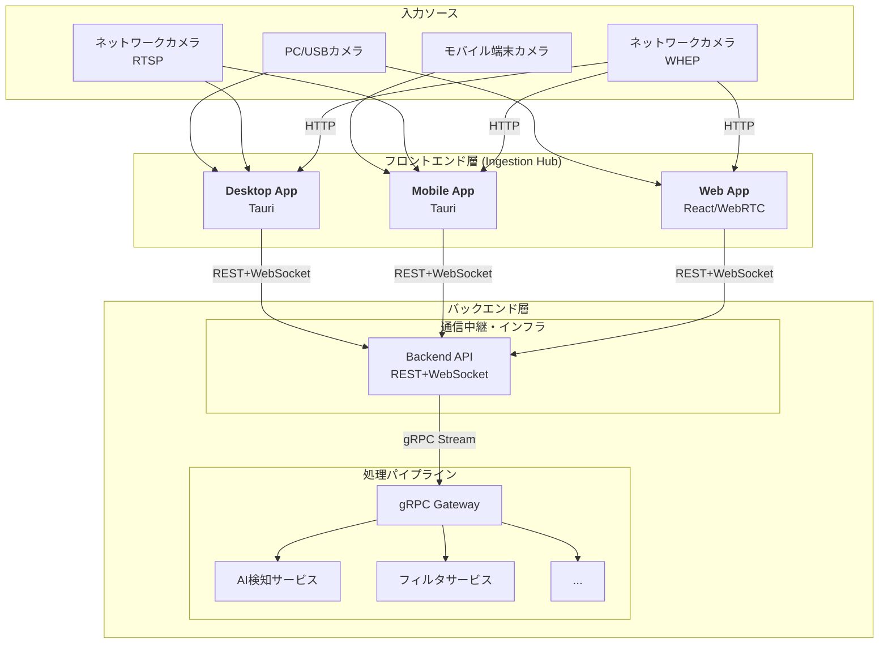

# **リアルタイム映像処理システム 全体設計書**

## **1. システム概要**

本システムは、PC、モバイル、ネットワークカメラなど、多種多様なカメラソースからの映像をリアルタイムで取得し、AIによる物体検知やフィルタリングなどの処理を低遅延で実行することを目的とする。常時実行可能なクライアントアプリケーションを入力ハブとし、堅牢性、拡張性、保守性を重視したバックエンドで処理を行うスケーラブルなアーキテクチャを採用する。

### **主な要件**

* **多様な入力ソース**: PC/USBカメラ、モバイル端末カメラ、ネットワークカメラ（RTSP, WHEP）に対応する。  
* **低遅延処理**: リアルタイム性を最優先とし、gRPCストリーミングを全面採用する。  
* **高い信頼性**: クライアントアプリによる安定した映像取得と、バックエンドの耐障害性を確保する。  
* **柔軟な拡張性**: 新しい映像処理サービス（マイクロサービス）を容易に追加できる設計とする。

## **2. 全体アーキテクチャ**

本システムは、映像を取得・正規化する「フロントエンド層」、通信を中継する「エッジ層」、そして映像処理を実行する「バックエンド処理層」の3層で構成される。  


## **3. フロントエンド層：Ingestion Hub (入力ハブ) アプリケーション**

多様なプラットフォームに対応するため、デスクトップアプリ、モバイルアプリ、ブラウザアプリの3つのクライアントアプリケーションを提供する。これらがシステム全体の入り口となる。

### **3.1. 共通の役割**

* **カメラ管理**: UIを通じて、接続するカメラの登録・選択・設定を行う。  
* **映像取得**: 各種プロトコル（getUserMedia, RTSP, WHEP）を用いて映像ストリームを取得する。  
* **データ正規化**: 取得した映像フレームを、システム共通のVideoFrameフォーマットに変換する。  
* **データ送信**: 正規化されたフレームを、WebSocketでBackend APIに送信する。

### **3.2. デスクトップアプリケーション**

* **技術スタック**: Electron, Tauri など（ReactによるUI実装を推奨）。  
* **対応ソース**:  
  * PC内蔵カメラ、USB接続カメラ (getUserMedia)  
  * ネットワークカメラ (RTSP, WHEP)

### **3.3. モバイルアプリケーション**

* **技術スタック**: Tauri  
* **対応ソース**:  
  * スマートフォン/タブレットの内蔵カメラ  
  * 同一LAN上のネットワークカメラ (RTSP, WHEP)  
* **特徴**: Tauriを採用することで、デスクトップアプリとUIコンポーネントやビジネスロジック（gRPC通信、状態管理など）のコードを共通化し、開発効率を向上させる。

### **3.4. ブラウザアプリケーション**

* **技術スタック**: React + TypeScript + WebSocket  
* **対応ソース**:  
  * PC内蔵カメラ、USB接続カメラ (getUserMedia)  
  * ネットワークカメラ (WHEP)  
* **制約と対応**:  
  * **プロトコル制約**: ブラウザのセキュリティ制約により、RTSPは直接サポートできない。  
  * **通信制約**: 統一されたREST+WebSocket通信でBackend APIと接続。  
  * **実行制約**: ブラウザタブが閉じられると処理が停止するため、長時間の監視用途には不向き。  
* **特徴**: 追加インストール不要で即座に利用可能。デモンストレーションや短時間の利用に最適。

## **4. バックエンド層**

### **4.1. 通信中継・インフラ**

* **Backend API**:  
  * **役割**: すべてのクライアントからの統一されたエントリーポイント。  
  * **機能**: REST APIとWebSocket接続の提供、受信したデータのgRPCサービスへの転送、認証・認可、負荷分散を担当する。

### **4.2. 処理パイプライン (マイクロサービス)**

* **gRPC Gateway**:  
  * **役割**: 受信したgRPCストリームを、適切な処理サービスへと振り分けるルーター。  
  * **機能**: VideoFrameメッセージのメタデータ（pipeline_idなど）を元に、どのサービス（AI検知、リサイズ等）をどの順番で呼び出すかを決定する。  
* **各種gRPCサービス (AI検知, フィルタなど)**:  
  * **役割**: 映像処理の各ステップを実行する独立したサービス群。  
  * **特徴**: 各サービスは特定の機能に特化しており、独立して開発・デプロイ・スケールアウトが可能。例えば、AI検知サービスの負荷が高まれば、そのサービスだけを複数インスタンスに増やすことができる。

## **5. 主要なデータフロー**

### **5.1. ローカルカメラ (PC/USB/Mobile/Browser)**

1. **アプリ**: getUserMedia APIでカメラ映像を取得。  
2. **アプリ**: 取得したフレームをVideoFrameに変換。  
3. **アプリ**: WebSocketでBackend APIへ送信。  
4. **Backend API**: 受信したデータをgRPCでgRPC Gatewayへ転送。
5. **バックエンド**: gRPC Gateway -> 各種処理サービスへと流れる。

### **5.2. ネットワークカメラ (RTSP)**

1. **アプリ**: ユーザーが登録したIPアドレスのRTSPストリームに接続。  
2. **アプリ**: 受信したストリームをデコードし、フレームをVideoFrameに変換。  
3. **アプリ**: WebSocketでBackend APIへ送信。  
4. **Backend API**: 受信したデータをgRPCでgRPC Gatewayへ転送。
5. **バックエンド**: 以降はローカルカメラと同様。  
   
   **注**: ブラウザアプリはセキュリティ制約によりRTSPに直接対応できません。

### **5.3. ネットワークカメラ (WHEP)**

1. **アプリ**: ユーザーが登録したWHEPエンドポイントURLに対してHTTP POSTリクエストを送信し、SDP Offerを送信。  
2. **接続確立**: WHEPサーバーからのSDP Answerを受信し、WebRTC接続を確立。  
3. **アプリ**: 確立したWebRTCコネクションからメディアストリームを取得し、フレームをVideoFrameに変換。  
4. **アプリ**: WebSocketでBackend APIへ送信。  
5. **Backend API**: 受信したデータをgRPCでgRPC Gatewayへ転送。
6. **バックエンド**: 以降はローカルカメラと同様。

## **6. 通信プロトコルとデータフォーマット**

システムのクライアント-Backend間通信は**REST+WebSocket**に統一し、Backend-gRPCサービス間は**gRPCストリーミング**を使用する。データフォーマットは**JSON**（WebSocket）と**Protocol Buffers**（gRPC）で定義し、システム全体での一貫性を保つ。
```protobuf
// camera_stream.proto

syntax = "proto3";

// --- サービス定義 ---  
service CameraStreamProcessor {  
  // 双方向ストリーミングRPC  
  rpc ProcessVideoStream(stream VideoFrame) returns (stream ProcessedFrame);  
}

// --- メッセージ定義 ---

// クライアントからサーバーへ送る映像フレーム  
message VideoFrame {  
  bytes frame_data = 1;      // JPEG/PNGなどでエンコードされた画像データ  
  int64 timestamp_ms = 2;    // フレーム取得時のタイムスタンプ (Unix ms)  
  VideoMetadata metadata = 3; // メタデータ  
}

// 映像フレームのメタデータ  
message VideoMetadata {  
  string source_id = 1;      // カメラの一意なID  
  int32 width = 2;           // 幅  
  int32 height = 3;          // 高さ  
  string pipeline_id = 4;    // 適用する処理パイプラインのID  
  map<string, string> processing_params = 5; // AIモデル名などの動的パラメータ  
}

// サーバーからクライアントへ返す処理済みフレーム  
message ProcessedFrame {  
  bytes processed_data = 1;   // 処理後の画像データ（オプション）  
  string source_id = 2;       // 元のカメラID  
  int64 processing_time_ms = 3; // サーバーサイドでの処理時間  
  repeated Detection detections = 4; // AIによる検出結果  
}

// 検出結果  
message Detection {  
  string class_name = 1;      // 物体クラス名 (e.g., "person", "car")  
  float confidence = 2;       // 信頼度 (0.0 ~ 1.0)  
  // バウンディングボックスなど、その他の情報  
}
```