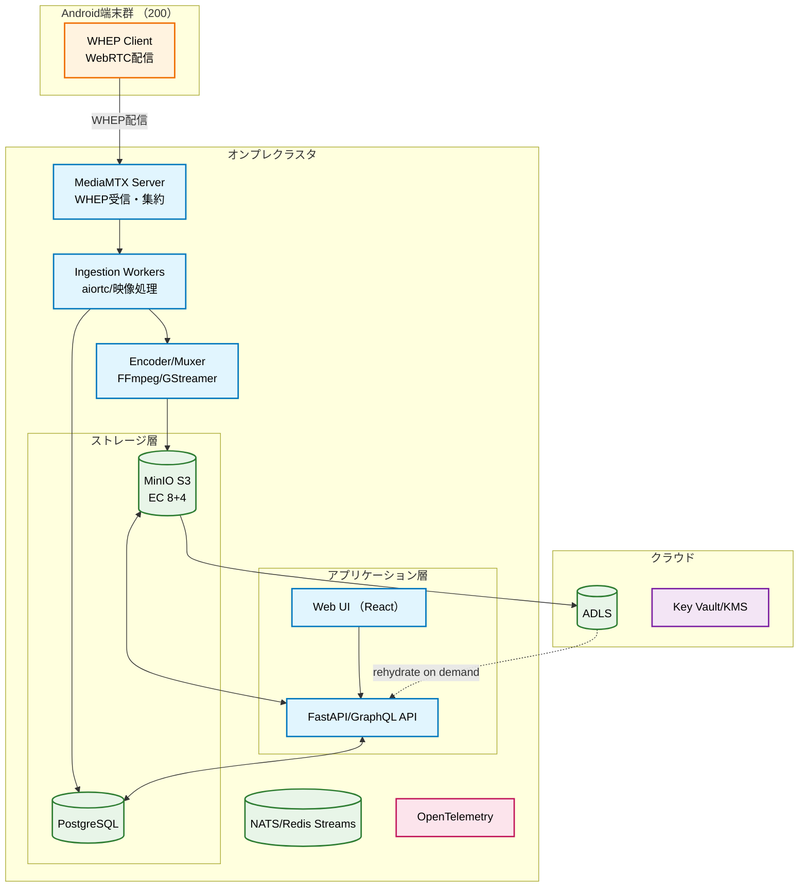
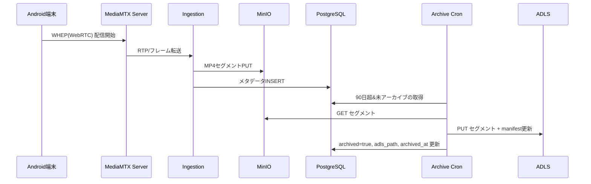

# 一人称映像活用システム設計書
---

## 文書管理情報

| 項目       | 内容                         |
| ---------- | ---------------------------- |
| 文書名     | 一人称映像活用システム設計書 |
| バージョン | 1.0                          |
| 作成日     | 2025年8月24日                |
| 更新日     |                              |

# 1. 概要
- **目的**: 200台のカメラを**毎日 13 時間**録画し、**オンプレ90日 + クラウド3年**で保存。メタデータ連携と高速検索・オンデマンド再生を提供。
- **方式**: オンプレ（即時アクセス/低遅延）× クラウド（長期保管/コスト最適）の**ハイブリッド・マイクロサービス**。
- **キーテクノロジー**: MediaMTX（WHEP/WebRTC）、FastAPI、React、MinIO（S3互換・EC 8+4）、PostgreSQL、ADLS、Kubernetes（HPA/CronJob）、OpenTelemetry、OIDC。
- **SLO提案**: API可用性 99.9%、検索P95 < 1.5s、再生開始P95 < 2.5s、アーカイブRPO ≤ 15分、RTO ≤ 4時間。
- **セキュリティ**: SRTP/TLS、KMS連携（MinIO SSE-S3/ADLS SSE-KMS）、ゼロトラスト（OIDC+RBAC）、監査ログとWORMオプション。

# 2. 要件精緻化（機能/非機能）
## 2.1. 機能要件
- 高度検索: カメラID/時間範囲/イベント種別/信頼度/タグ/領域（Polygon ROI）で検索。CSV/JSONエクスポート。
- 再生: タイムライン/サムネイルプレビュー、倍速、イベントジャンプ、ADLSの**コールド復元**対応（後述）。
- メタデータ: 物体検出（人物/車両/安全具）・トラッキングID・カウント、**独自スキーマ**で時系列付与。
- アーカイブ: 90日超のセグメントを**日次Cron**でADLSへ転送。整合性チェックサム、**再送/リトライ**、**マニフェスト**で完全性保証。

## 2.2. 非機能要件
- 可用性: 単一障害点無し（多副本/EC・HPA・複数AZ/ラック分散）。
- 性能: 200カメラ同時受信、集約 **最大ビットレート**はプロファイル依存（§6参照）。
- 規制: 個人情報/監視関連ポリシー順守、**最小権限**、保持/削除ポリシー（リーガルホールド含む）。

# 3. 全体アーキテクチャ


# 4. コンポーネント詳細
## 4.1. 受信/処理（Ingestion）
- **Android端末**（カメラ側）が**WHEP Client**としてMediaMTXサーバーに配信。
- サーバー側の**MediaMTX**がWHEP/WebRTCストリームを受信・集約。
- aiortc/映像処理ワーカーがMediaMTXからフレームを取得し**メタデータ**生成。**ROI/マスク**とFPSサンプリングでCPU/GPU負荷を制御。
- **可逆キュー**（例: NATS/Redis Streams）で一時バッファリングし、負荷波形を平滑化。
- エンコードはFFmpeg/GStreamerで**1〜2分セグメントMP4**（H.264/H.265）。

## 4.2. ストレージ（MinIO + PostgreSQL）
- MinIO: バケット設計 `vms/{camera_id}/{yyyy}/{mm}/{dd}/{hh}/{camera_id}_{ts}.mp4`。**Object Lock (WORM)** 任意。
- EC 8+4、**バケット別Lifecycle**（90日→削除/アーカイブ済み）。SSE-S3で**暗号化 at rest**。
- PostgreSQL: 時系列パーティション（1日/表）、GiST（時間範囲）+ btree（camera_id）+ GIN（JSONBタグ）。

## 4.3. アプリケーション/再生
- API: FastAPI + GraphQL。署名URL（MinIO/ADLS）生成。**再生レンジ取得**APIで区間合成。
- UI: タイムライン・サムネイル・イベントピン。**複数カメラ同期再生**（最大4up）対応。

## 4.4. アーカイブワーカー
- Kubernetes CronJob（毎日02:00）。PostgreSQLで「**90日超 & 未アーカイブ**」を選別。
- **マニフェスト**: `manifest.jsonl` にファイルパス/サイズ/MD5/SHA256/転送時刻/リトライ回数。
- 転送後 `archived_at` 更新。ADLSパス `adls://vms/{camera_id}/yyyy/mm/dd/`。

# 5. データモデルとAPI
## 5.1. 主要テーブル（抜粋・DDL）
```sql
CREATE TABLE cameras (
  camera_id      TEXT PRIMARY KEY,
  name           TEXT NOT NULL,
  location       TEXT,
  tags           JSONB DEFAULT '{}'::jsonb,
  created_at     TIMESTAMPTZ DEFAULT now()
);

-- 親テーブル
CREATE TABLE segments (
  segment_id     BIGSERIAL PRIMARY KEY,
  camera_id      TEXT NOT NULL REFERENCES cameras(camera_id),
  ts_start       TIMESTAMPTZ NOT NULL,
  ts_end         TIMESTAMPTZ NOT NULL,
  s3_path        TEXT NOT NULL,
  bytes          BIGINT NOT NULL,
  archived       BOOLEAN DEFAULT FALSE,
  archived_at    TIMESTAMPTZ,
  adls_path      TEXT,
  checksum_md5   TEXT,
  meta           JSONB DEFAULT '{}'::jsonb
) PARTITION BY RANGE (ts_start);

-- 例: 2025-08-24のパーティション
CREATE TABLE segments_y20250824 PARTITION OF segments FOR VALUES FROM ('2025-08-24') TO ('2025-08-25');

CREATE INDEX idx_segments_cam_time ON segments (camera_id, ts_start);
CREATE INDEX idx_segments_time ON segments USING GIST (ts_start, ts_end);
CREATE INDEX idx_segments_meta_gin ON segments USING GIN (meta);
```

## 5.2. 検索API（OpenAPI抜粋）
```yaml
paths:
  /search/segments:
    get:
      summary: 複合条件で録画セグメントを検索
      parameters:
        - in: query
          name: camera_id
          schema: { type: string }
        - in: query
          name: time_from
          schema: { type: string, format: date-time }
        - in: query
          name: time_to
          schema: { type: string, format: date-time }
        - in: query
          name: event
          schema: { type: string }
        - in: query
          name: confidence_gte
          schema: { type: number }
      responses:
        "200":
          description: 成功
```

# 6. 容量/性能見積と機器サイジング
## 6.1. 前提
- カメラ数: **200**
- 録画時間: **13h/日**
- オンプレ保存: **90日**
- アーカイブ保存: **3年（1095日）**
- MinIO EC: **8+4**（原則 RAW=USABLE×1.50）
- 余裕枠: **20%**

## 6.2. 集約ビットレート/容量（代表プロファイル）
| プロファイル                            | カメラ当たりビットレート | 1日/カメラ (SI) | 1日/全体 (SI) | 90日/全体 (SI) | 3年/全体 (SI) | MinIO必要容量（USABLE, +20%） | MinIO必要RAW（EC換算） | 集約受信レート |
| --------------------------------------- | -----------------------: | --------------: | ------------: | -------------: | ------------: | ----------------------------: | ---------------------: | -------------: |
| H.265 1080p/15fps（省ビットレート想定） |                 1.2 Mbps |         7.02 GB |       1.40 TB |      126.36 TB |       1.54 PB |                     151.63 TB |              227.45 TB |       240 Mbps |
| H.264 1080p/15fps（標準）               |                 2.5 Mbps |        14.62 GB |       2.92 TB |      263.25 TB |       3.20 PB |                     315.90 TB |              473.85 TB |       500 Mbps |
| H.264 1080p/30fps（高画質）             |                 4.0 Mbps |        23.40 GB |       4.68 TB |      421.20 TB |       5.12 PB |                     505.44 TB |              758.16 TB |       800 Mbps |

> ※ SIは10進（1 TB=10^12B）。容量はメタデータ等を含まないため+10%のバッファ推奨。

**参考MinIO構成**: **12ノード × 8台 × 16TB** = RAW **1,536 TB**（1.36 PiB） → EC適用後の**理論USABLE** ≈ **1.02 PB**（931.32 TiB）。

## 6.3. サーバーロール別 たたき台（例）
- **Ingestion/Compute**: 6台（各16 vCPU / 64GB / 10GbE）。GPUオプション（T4/A2）を2台に搭載しAI負荷ピークを吸収。
- **MinIO**: 上記 12台を**ラック分散**（3ラック×4台）・NICは25GbE以上、LACP。
- **PostgreSQL**: 2台（Primary/Sync-Standby）NVMe x2（RAID1）、WAL分離、pgBackRestでS3/ADLSバックアップ。

## 6.4. ネットワーク設計
- VLAN分離（CAMERA/APP/STORAGE/MGMT）。ToRスイッチは**25GbEアップリンク**。
- 受信ピークはプロファイル最大 **800 Mbps**。余裕係数1.5で設計。

# 7. 可観測性・運用・SRE
- **メトリクス**: 受信/エンコード遅延、ドロップ率、API P95、アーカイブ処理件数、失敗率。
- **ログ/トレース**: OpenTelemetryで**相関ID**（camera_id/segment_id）を全レイヤに伝搬。
- **アラート**: SLOベース（エラーバジェット消費）、容量しきい値、アーカイブ滞留、レプリカ不整合。
- **バックアップ**: PostgreSQLは**日次フル + 15分WAL**。MinIOは**バージョニング + オブジェクトロック**（要件次第）。
- **DR**: メタデータはDRサイトへ非同期レプリケーション。RTO/RPOは§1に準拠。

# 8. セキュリティ/ガバナンス
- **通信**: WebRTC(SRTP) / API+S3はTLS1.2+、証明書はcert-managerで自動更新。
- **認証/認可**: OIDC（Entra ID等）+ **RBAC**。監査ログ/管理操作は別DBへWORM保管。
- **鍵管理**: MinIO SSE-S3、ADLS SSE-KMS。KMSローテーションと暗号鍵アクセス監査。
- **プライバシー**: モザイク/マスキングを**保存前/配信時**の両方で選択可能。

# 9. データライフサイクルとアーカイブ

**コールド復元**（ADLS→オンデマンド再生）:
1) APIがADLS署名URLを返却 → プレイヤが直接取得（帯域平準化）。
2) 頻用区間は**キャッシュ**（MinIOの別バケット or CDN）。

# 10. リリース計画と移行
- **Phase 0**: PoC（20台/30日保持）で機能/性能と運用性を検証。
- **Phase 1**: 100台へ拡張、アーカイブ本番化、監査/権限統制の本番化。
- **Phase 2**: 200台へ、SLOベース運用、ADLSコスト最適化（階層化/圧縮）。

# 11. リスク登録簿と対応策
| リスク         | 影響       | 可能性 | 緩和策                                                   |
| -------------- | ---------- | ------ | -------------------------------------------------------- |
| WHEP相互運用性 | 接続失敗   | 中     | 事前相互検証、TURN冗長                                   |
| ストレージ障害 | データ損失 | 低     | EC 8+4、異ラック分散、定期リハーサル                     |
| メタDB輻輳     | 検索遅延   | 中     | 時系列分割、索引/VACUUM計画、リードレプリカ              |
| コスト増       | 予算超過   | 中     | 圧縮/H.265推進、期限切れ削除、アクセス頻度に応じた階層化 |


了解しました。設計書の内容に基づき、「12. コスト試算」を追記します。容量・サーバー台数・ネットワーク要件が整理されていたので、それを前提に**オンプレ/クラウド/運用費用**の観点で試算をまとめます。


# 12. コスト試算
## 12.1. 前提条件
* カメラ数: 200台
* 録画時間: 13時間/日
* 保存: オンプレ90日 + クラウド3年
* プロファイル基準: H.264 1080p/15fps（2.5Mbps, 標準画質）
* ストレージ: MinIO（EC 8+4, RAW=USABLE×1.5）、ADLS（階層型ストレージ利用想定）
* サーバー構成: Ingestion/Compute 6台、GPU 2台、MinIO 12台、PostgreSQL 2台

## 12.2. ストレージコスト
### 12.2.1. オンプレ（MinIO）
* 必要容量（90日保持 + 20%余裕）: 約316 TB（USABLE）、RAW換算 約474 TB
* 想定構成: 12台 × 8ドライブ × 16TB = 1,536 TB RAW → 1.02 PB USABLE
* 見積: HDD (16TB, エンタープライズ級, 約5万円/台) × 96本 ≈ 480万円
* サーバーハード（12台, 1台あたり約150万円） ≈ 1,800万円
* **合計: 約2,280万円（初期導入）**

### 12.2.2. クラウド（ADLS）
* 3年保存（全体で約3.2 PB）
* ホット/コールド階層化を適用
  * ホット層（直近6か月, 0.5 PB想定）: 約2.5円/GB/月 ≈ 1,250万円/年
  * コールド層（残り2.7 PB）: 約0.3円/GB/月 ≈ 972万円/年
* **合計: 約2,222万円/年**

## 12.3. サーバー/ネットワーク
* **Ingestion/Compute**: 6台 × 100万円 ≈ 600万円
* **GPU（T4相当）**: 2台 × 70万円 ≈ 140万円
* **PostgreSQL**: 2台 × 150万円 ≈ 300万円
* **ネットワーク機器（ToR 25GbE ×2, L3 SW, LACP対応）**: 約500万円
* **合計: 約1,540万円（初期導入）**

## 12.4. 運用・保守費用
* **オンプレ保守**: サーバー+ストレージ HW保守（5年, 初期導入額の15%/年） ≈ 600万円/年
* **クラウド利用料（ADLS）**: 約2,222万円/年（上記試算）
* **電力/ラック費**: サーバー・ストレージ合計 約30kW稼働、電力+ラック費 ≈ 400万円/年
* **運用人件費**: 1名相当（監視/障害対応） ≈ 800万円/年
* **合計: 約4,022万円/年**

## 12.5. 総額試算

| 区分           | 初期導入費用    | 年間運用費用       |
| -------------- | --------------- | ------------------ |
| オンプレ機器   | 約3,820万円     | 約1,000万円        |
| クラウド(ADLS) | -               | 約2,222万円        |
| 運用/人件費    | -               | 約800万円          |
| **合計**       | **約3,820万円** | **約4,022万円/年** |

## 12.6. コスト最適化の余地
* H.265利用率を高めることでストレージを約半分に削減可能（≒ADLS費用も半減）。
* 直近アクセス頻度に応じて「ホット:コールド:アーカイブ」階層比率を調整し、クラウド課金を最適化。
* 圧縮/サムネイルのみ保持のポリシーを組み合わせれば、さらに20～30%削減可能。

# 13. 参考
## 13.1. 付録A. 参考Kubernetesマニフェスト
**HorizontalPodAutoscaler（Ingestion）**
```yaml
apiVersion: autoscaling/v2
kind: HorizontalPodAutoscaler
spec:
  minReplicas: 6
  maxReplicas: 24
  metrics:
    - type: Resource
      resource:
        name: cpu
        target:
          type: Utilization
          averageUtilization: 65
```

## 13.2. 付録B. 参考DDL/クエリ
**イベント検索（期間+領域）**
```sql
SELECT segment_id, camera_id, ts_start, ts_end
FROM segments
WHERE camera_id = $1
  AND ts_start >= $2 AND ts_end <= $3
  AND (meta->>'event') = $4
ORDER BY ts_start DESC
LIMIT 500;
```
