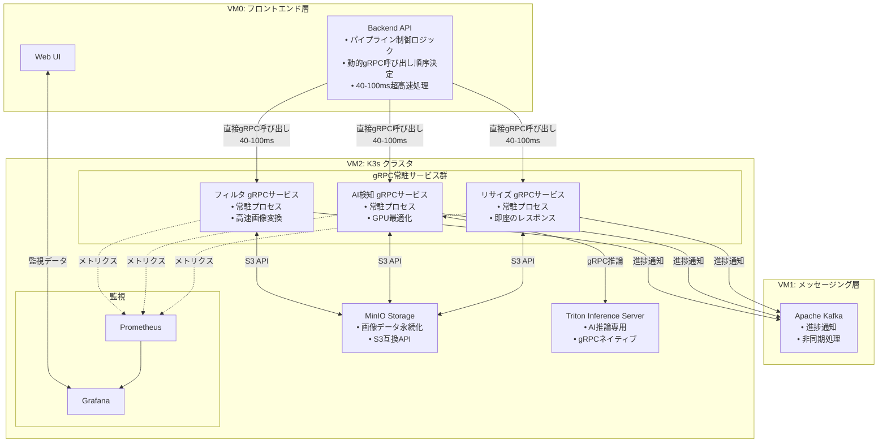

# ImageFlowCanvas 直接gRPC呼び出し設計書

> **⚠️ 注意**: この文書は現在更新中です。本文書にはArgo Workflowsの設定例が含まれていますが、これらは廃止予定であり、現在のシステムは直接gRPC呼び出しアプローチを使用しています。Argoの参照は無視してください。

## **文書管理情報**

| 項目       | 内容                                                 |
| ---------- | ---------------------------------------------------- |
| 文書名     | ImageFlowCanvas 直接gRPC呼び出し設計書                 |
| バージョン | 1.0                                                  |
| 作成日     | 2025年7月19日                                        |
| 更新日     | 2025年7月19日                                        |
| 関連文書   | 要件定義書、アーキテクチャ設計書、システム基本設計書 |

---

## **1. 概要**

### **1.1. 文書の目的**

本文書では、ImageFlowCanvasシステムにおける直接gRPC呼び出しアーキテクチャの詳細設計について記述します。ワークフローエンジンのオーバーヘッドを排除し、バックエンドAPIから常駐gRPCサービス群への直接呼び出しによる超高速動的パイプライン実行の構成、統合方式、運用方法について詳細に定義します。

### **1.2. 直接gRPC呼び出しアーキテクチャの役割**

直接gRPC呼び出しアーキテクチャはImageFlowCanvasシステムにおいて以下の役割を担います：

- **超高速パイプライン実行**: ワークフローエンジンのオーバーヘッド（750-1450ms）を完全排除し、40-100msの処理時間を実現
- **動的パイプライン制御**: バックエンドAPI内でパイプライン構成を解析し、適切なgRPCサービス呼び出し順序を動的決定
- **常駐サービス活用**: 事前起動されたgRPCサービス群への即座の処理要求
- **リソース最適化**: 必要最小限のコンポーネントによる効率的なリソース利用
- **シンプルなエラーハンドリング**: 直接制御による明確なエラー伝播と復旧
- **リアルタイム進捗監視**: 即座のレスポンスと進捗通知

### **1.3. 直接gRPC呼び出しによる革新**

ワークフローエンジンを排除した直接gRPC呼び出し方式により、以下の革新的な改善を実現：

- **処理時間**: 40-100ms（従来の750-1450msから最大97%短縮）
- **超高速通信**: gRPCバイナリプロトコルによる最適化された通信
- **型安全なリアルタイム処理**: Protocol Buffersによる厳密な型定義とコンパイル時検証
- **ストリーミング処理対応**: 大容量画像の効率的な並列ストリーミング処理
- **運用シンプル化**: ワークフローエンジン不要による管理の簡素化
- **即座のレスポンス**: 中間層を排除した直接通信による最小レイテンシ

---

## **2. アーキテクチャ設計**

### **2.1. システム内での直接gRPC呼び出しアーキテクチャの位置づけ**



### **2.2. gRPC常駐サービス群コンポーネント構成**

#### **2.2.1. コアコンポーネント**

| コンポーネント          | 役割                               | デプロイ方式   | リソース要件             |
| ----------------------- | ---------------------------------- | -------------- | ------------------------ |
| **リサイズ gRPCサービス**     | 画像リサイズ処理・常駐実行 | Deployment     | CPU: 300m, Memory: 768Mi |
| **AI検知 gRPCサービス**         | AI推論・物体検出処理                    | Deployment     | CPU: 700m, Memory: 1.5Gi, GPU: 1 |
| **フィルタ gRPCサービス**   | 画像フィルタ処理・エフェクト適用                     | Deployment | CPU: 300m, Memory: 768Mi       |
| **gRPCゲートウェイ** | HTTP to gRPC変換・負荷分散                     | Deployment      | CPU: 200m, Memory: 384Mi                      |

#### **2.2.2. Namespace構成**

```yaml
# gRPC常駐サービス群の名前空間設計
apiVersion: v1
kind: Namespace
metadata:
  name: image-processing
  labels:
    app.kubernetes.io/name: image-flow-canvas
    app.kubernetes.io/component: grpc-services
---
apiVersion: v1
kind: Namespace
metadata:
  name: monitoring
  labels:
    app.kubernetes.io/name: image-flow-canvas
    app.kubernetes.io/component: observability
```

---

## **3. 直接gRPC呼び出しパイプライン設計**

### **3.1. 動的パイプライン定義**

#### **3.1.1. パイプライン設定スキーマ**

```json
{
  "pipelineId": "string",
  "pipelineName": "string", 
  "version": "string",
  "metadata": {
    "createdBy": "string",
    "createdAt": "string",
    "description": "string"
  },
  "steps": [
    {
      "stepId": "string",
      "componentName": "string",
      "componentVersion": "string",
      "dependencies": ["string"],
      "parameters": {
        "key": "value"
      },
      "resources": {
        "cpu": "string",
        "memory": "string",
        "gpu": "string"
      },
      "retryPolicy": {
        "maxRetries": "number",
        "backoffFactor": "number"
      }
    }
  ],
  "globalParameters": {
    "inputPath": "string",
    "outputPath": "string",
    "executionId": "string"
  }
}
```

#### **3.1.2. バックエンドAPIパイプライン制御ロジック**

```python
# バックエンドAPI内の動的パイプライン制御実装
from typing import List, Dict, Any
import asyncio
import grpc
from grpc import aio
from concurrent.futures import ThreadPoolExecutor

class PipelineExecutor:
    def __init__(self):
        self.grpc_clients = {
            'resize': ResizeServiceClient('resize-grpc-service.image-processing.svc.cluster.local:9090'),
            'ai_detection': AIDetectionServiceClient('ai-detection-grpc-service.image-processing.svc.cluster.local:9090'),
            'filter': FilterServiceClient('filter-grpc-service.image-processing.svc.cluster.local:9090')
        }
    
    async def execute_pipeline(self, pipeline_config: Dict[str, Any], execution_id: str) -> Dict[str, Any]:
        """
        パイプライン設定に基づいて直接gRPC呼び出しを実行
        40-100msの超高速処理を実現
        """
        start_time = time.time()
        
        try:
            # ステップ依存関係を解析
            execution_order = self._resolve_dependencies(pipeline_config['steps'])
            
            results = {}
            current_image_path = pipeline_config['globalParameters']['inputPath']
            
            # 各ステップを順次実行（並列実行可能な部分は並列化）
            for step_group in execution_order:
                if len(step_group) == 1:
                    # 単一ステップ実行
                    step = step_group[0]
                    result = await self._execute_step(step, current_image_path, execution_id)
                    results[step['stepId']] = result
                    current_image_path = result['output_path']
                else:
                    # 並列ステップ実行
                    tasks = [
                        self._execute_step(step, current_image_path, execution_id)
                        for step in step_group
                    ]
                    parallel_results = await asyncio.gather(*tasks)
                    for i, step in enumerate(step_group):
                        results[step['stepId']] = parallel_results[i]
            
            execution_time = time.time() - start_time
            
            return {
                'execution_id': execution_id,
                'status': 'completed',
                'execution_time_ms': execution_time * 1000,
                'results': results,
                'final_output_path': current_image_path
            }
            
        except Exception as e:
            return {
                'execution_id': execution_id,
                'status': 'failed',
                'error': str(e),
                'execution_time_ms': (time.time() - start_time) * 1000
            }
    
    async def _execute_step(self, step: Dict[str, Any], input_path: str, execution_id: str) -> Dict[str, Any]:
        """個別ステップのgRPC実行"""
        component_name = step['componentName']
        client = self.grpc_clients.get(component_name)
        
        if not client:
            raise ValueError(f"Unknown component: {component_name}")
        
        # gRPCリクエスト構築
        request = self._build_grpc_request(step, input_path, execution_id)
        
        # 直接gRPC呼び出し（超高速）
        response = await client.process(request)
        
        return {
            'step_id': step['stepId'],
            'output_path': response.output_image.object_key,
            'processing_time_ms': response.processing_time_ms,
            'status': 'success'
        }
    
    def _resolve_dependencies(self, steps: List[Dict[str, Any]]) -> List[List[Dict[str, Any]]]:
        """
        ステップ依存関係を解析し、実行可能な順序を決定
        並列実行可能なステップをグループ化
        """
        # 依存関係解析ロジック
        # 戻り値: [[並列実行可能なステップ群], [次のステップ群], ...]
        pass
```

### **3.2. 標準処理コンポーネント**

#### **3.2.1. リサイズコンポーネント**

```yaml
apiVersion: argoproj.io/v1alpha1
kind: WorkflowTemplate
metadata:
  name: resize-component
  namespace: image-processing
spec:
  templates:
  - name: resize
    inputs:
      parameters:
      - name: input-path
      - name: output-path  
      - name: width
        value: "800"
      - name: height
        value: "600"
      - name: maintain-aspect-ratio
        value: "true"
    container:
      image: imageflow/resize:v1.0
      command: [python, /app/resize.py]
      env:
      - name: INPUT_PATH
        value: "{{inputs.parameters.input-path}}"
      - name: OUTPUT_PATH
        value: "{{inputs.parameters.output-path}}"
      - name: WIDTH
        value: "{{inputs.parameters.width}}"
      - name: HEIGHT
        value: "{{inputs.parameters.height}}"
      - name: MAINTAIN_ASPECT_RATIO
        value: "{{inputs.parameters.maintain-aspect-ratio}}"
      - name: MINIO_ENDPOINT
        valueFrom:
          secretKeyRef:
            name: minio-credentials
            key: endpoint
      - name: MINIO_ACCESS_KEY
        valueFrom:
          secretKeyRef:
            name: minio-credentials
            key: access-key
      - name: MINIO_SECRET_KEY
        valueFrom:
          secretKeyRef:
            name: minio-credentials
            key: secret-key
      resources:
        requests:
          cpu: 100m
          memory: 256Mi
        limits:
          cpu: 500m
          memory: 512Mi
```

#### **3.2.2. AI処理コンポーネント**

```yaml
apiVersion: argoproj.io/v1alpha1
kind: WorkflowTemplate
metadata:
  name: ai-processing-component
  namespace: image-processing
spec:
  templates:
  - name: object-detection
    inputs:
      parameters:
      - name: input-path
      - name: output-path
      - name: model-name
        value: "yolo11"
      - name: confidence-threshold
        value: "0.5"
      - name: nms-threshold
        value: "0.4"
    container:
      image: imageflow/ai-processing:v1.0
      command: [python, /app/detect.py]
      env:
      - name: INPUT_PATH
        value: "{{inputs.parameters.input-path}}"
      - name: OUTPUT_PATH
        value: "{{inputs.parameters.output-path}}"
      - name: MODEL_NAME
        value: "{{inputs.parameters.model-name}}"
      - name: CONFIDENCE_THRESHOLD
        value: "{{inputs.parameters.confidence-threshold}}"
      - name: NMS_THRESHOLD
        value: "{{inputs.parameters.nms-threshold}}"
      - name: TRITON_SERVER_URL
        value: "triton-server:8000"
      resources:
        requests:
          cpu: 500m
          memory: 1Gi
        limits:
          cpu: 2
          memory: 4Gi
          nvidia.com/gpu: 1
      volumeMounts:
      - name: model-storage
        mountPath: /models
        readOnly: true
    volumes:
    - name: model-storage
      persistentVolumeClaim:
        claimName: triton-model-pvc
```

#### **3.2.3. フィルタコンポーネント**

```yaml
apiVersion: argoproj.io/v1alpha1
kind: WorkflowTemplate
metadata:
  name: filter-component
  namespace: image-processing
spec:
  templates:
  - name: apply-filter
    inputs:
      parameters:
      - name: input-path
      - name: output-path
      - name: filter-type
        value: "gaussian"
      - name: filter-intensity
        value: "1.0"
    container:
      image: imageflow/filter:v1.0
      command: [python, /app/filter.py]
      env:
      - name: INPUT_PATH
        value: "{{inputs.parameters.input-path}}"
      - name: OUTPUT_PATH
        value: "{{inputs.parameters.output-path}}"
      - name: FILTER_TYPE
        value: "{{inputs.parameters.filter-type}}"
      - name: FILTER_INTENSITY
        value: "{{inputs.parameters.filter-intensity}}"
      resources:
        requests:
          cpu: 100m
          memory: 256Mi
        limits:
          cpu: 500m
          memory: 512Mi
```

---

## **4. 統合設計**

### **4.1. Kafkaとの統合**

#### **4.1.1. 直接gRPC実行トリガー**

```go
// Kafka Consumer for Pipeline Execution
type PipelineExecutionMessage struct {
    ExecutionID    string            `json:"execution_id"`
    PipelineConfig PipelineConfig    `json:"pipeline_config"`
    InputData      InputDataInfo     `json:"input_data"`
    Parameters     map[string]string `json:"parameters"`
}

type DirectGRPCPipelineService struct {
    pipelineExecutor *PipelineExecutor
    kafkaProducer    *kafka.Producer
}

func (s *DirectGRPCPipelineService) ProcessPipelineExecution(msg PipelineExecutionMessage) error {
    start := time.Now()
    
    // 1. 直接gRPC呼び出しでパイプライン実行（40-100ms）
    result, err := s.pipelineExecutor.ExecutePipeline(msg.PipelineConfig, msg.ExecutionID)
    if err != nil {
        return fmt.Errorf("failed to execute pipeline: %w", err)
    }
    
    // 2. 実行完了通知をKafkaに送信
    notification := PipelineCompletionNotification{
        ExecutionID:     msg.ExecutionID,
        Status:         result.Status,
        ExecutionTime:  time.Since(start),
        OutputPath:     result.FinalOutputPath,
        ProcessingTime: result.ExecutionTimeMs,
    }
    
    s.publishExecutionCompleted(notification)
    
    return nil
}
```

#### **4.1.2. 進捗通知システム**

```yaml
# ワークフロー内の進捗通知設定
apiVersion: argoproj.io/v1alpha1
kind: WorkflowTemplate
metadata:
  name: progress-notifier
  namespace: image-processing
spec:
  templates:
  - name: notify-progress
    inputs:
      parameters:
      - name: execution-id
      - name: step-id
      - name: status
      - name: message
    script:
      image: confluentinc/cp-kafka:latest
      command: [sh]
      source: |
        cat <<EOF | kafka-console-producer --broker-list kafka:9092 --topic pipeline-progress
        {
          "execution_id": "{{inputs.parameters.execution-id}}",
          "step_id": "{{inputs.parameters.step-id}}",
          "status": "{{inputs.parameters.status}}",
          "message": "{{inputs.parameters.message}}",
          "timestamp": "$(date -u +%Y-%m-%dT%H:%M:%SZ)"
        }
        EOF
```

### **4.2. MinIOとの統合**

#### **4.2.1. アーティファクトリポジトリ設定**

```yaml
apiVersion: v1
kind: ConfigMap
metadata:
  name: artifact-repositories
  namespace: image-processing
data:
  minio: |
    s3:
      endpoint: minio:9000
      insecure: true
      bucket: image-flow-artifacts
      keyFormat: "artifacts/{{workflow.namespace}}/{{workflow.name}}/{{pod.name}}"
      accessKeySecret:
        name: minio-credentials
        key: access-key
      secretKeySecret:
        name: minio-credentials
        key: secret-key
```

#### **4.2.2. データフロー管理**

```python
# 処理コンテナ内でのMinIO統合例
import boto3
from minio import Minio
import os

class MinIODataManager:
    def __init__(self):
        self.client = Minio(
            endpoint=os.environ['MINIO_ENDPOINT'],
            access_key=os.environ['MINIO_ACCESS_KEY'],
            secret_key=os.environ['MINIO_SECRET_KEY'],
            secure=False
        )
        self.bucket = 'image-flow-data'
    
    def download_input(self, object_path: str, local_path: str):
        """入力データをダウンロード"""
        self.client.fget_object(self.bucket, object_path, local_path)
    
    def upload_output(self, local_path: str, object_path: str):
        """出力データをアップロード"""
        self.client.fput_object(self.bucket, object_path, local_path)
    
    def upload_metadata(self, metadata: dict, object_path: str):
        """メタデータをJSONとしてアップロード"""
        import json
        json_data = json.dumps(metadata)
        self.client.put_object(
            self.bucket, 
            object_path, 
            io.BytesIO(json_data.encode()),
            len(json_data),
            content_type='application/json'
        )
```

---

## **5. エラーハンドリング・リトライ戦略**

### **5.1. 階層的エラーハンドリング**

#### **5.1.1. ステップレベルエラーハンドリング**

```yaml
# リトライ戦略の設定
apiVersion: argoproj.io/v1alpha1
kind: WorkflowTemplate
metadata:
  name: error-handling-example
spec:
  templates:
  - name: robust-processing-step
    retryStrategy:
      limit: 3
      backoff:
        duration: "30s"
        factor: 2
        maxDuration: "5m"
      retryPolicy: "Always"
      expression: "asInt(lastRetry.exitCode) != 2"  # exitCode=2の場合はリトライしない
    
    container:
      image: imageflow/processing:v1.0
      command: [python, /app/main.py]
      
    # 失敗時のクリーンアップ処理
    onExit:
      template: cleanup-on-failure
      when: "{{status}} != Succeeded"
  
  - name: cleanup-on-failure
    script:
      image: imageflow/utils:v1.0
      command: [sh]
      source: |
        echo "Cleaning up failed step resources..."
        # 一時ファイルの削除
        # エラーログの保存
        # 通知の送信
```

#### **5.1.2. パイプラインレベルエラーハンドリング**

```yaml
# パイプライン全体のエラーハンドリング
apiVersion: argoproj.io/v1alpha1
kind: Workflow
metadata:
  name: pipeline-with-error-handling
spec:
  entrypoint: main
  
  # 全体の失敗時処理
  onExit: pipeline-cleanup
  
  templates:
  - name: main
    dag:
      failFast: false  # 一部失敗でも他のステップを継続
      tasks:
      - name: step1
        template: processing-step-1
        
      - name: step2
        template: processing-step-2
        dependencies: [step1]
        
      - name: step3
        template: processing-step-3
        dependencies: [step1]
        
      # エラー通知専用タスク
      - name: error-notification
        template: notify-error
        dependencies: [step1, step2, step3]
        when: "{{workflow.status}} == Failed"
  
  - name: pipeline-cleanup
    script:
      image: imageflow/utils:v1.0
      command: [python]
      source: |
        import requests
        import os
        
        # 実行状況をKafkaに通知
        status = "{{workflow.status}}"
        execution_id = "{{workflow.parameters.execution-id}}"
        
        notification = {
            "execution_id": execution_id,
            "status": status,
            "completed_at": "{{workflow.finishedAt}}",
            "message": "Pipeline execution completed with status: " + status
        }
        
        # Kafka通知（簡易実装）
        # 実際はKafka Pythonクライアントを使用
        print(f"Sending notification: {notification}")
```

### **5.2. 部分的障害の回復**

#### **5.2.1. ステップスキップ機能**

```yaml
# 特定ステップをスキップしてパイプラインを継続
apiVersion: argoproj.io/v1alpha1
kind: WorkflowTemplate
metadata:
  name: skip-on-failure-template
spec:
  templates:
  - name: optional-processing-step
    inputs:
      parameters:
      - name: skip-on-failure
        value: "true"
    
    steps:
    - - name: main-processing
        template: processing-logic
        continueOn:
          failed: "{{inputs.parameters.skip-on-failure}}"
    
    - - name: fallback-processing
        template: fallback-logic
        when: "{{steps.main-processing.status}} == Failed"
```

---

## **6. 監視・ログ設計（OpenTelemetry統合）**

### **6.1. OpenTelemetryアーキテクチャ**

#### **6.1.1. OpenTelemetry Collector設定**

```yaml
# OpenTelemetry Collectorデプロイメント
apiVersion: v1
kind: ConfigMap
metadata:
  name: otel-collector-config
  namespace: argo
data:
  config.yaml: |
    receivers:
      # Prometheusメトリクス受信
      prometheus:
        config:
          scrape_configs:
          - job_name: 'argo-workflows'
            static_configs:
            - targets: ['workflow-controller:9090']
              labels:
                service: 'argo-workflows'
                component: 'controller'
          - job_name: 'argo-server'
            static_configs:
            - targets: ['argo-server:2746']
              labels:
                service: 'argo-workflows'
                component: 'server'
      
      # JaegerでOpenTelemetryトレース受信
      otlp:
        protocols:
          grpc:
            endpoint: 0.0.0.0:4317
          http:
            endpoint: 0.0.0.0:4318
            
      # Kubernetesメタデータ
      k8s_cluster:
        auth_type: serviceAccount
        
      # ログ受信
      filelog:
        include:
        - /var/log/containers/*argo*.log
        - /var/log/containers/*image-processing*.log
        operators:
        - type: json_parser
          timestamp:
            parse_from: attributes.time
            layout: '%Y-%m-%dT%H:%M:%S.%fZ'
    
    processors:
      # バッチ処理
      batch:
        timeout: 10s
        send_batch_size: 1024
        
      # リソース属性追加
      resource:
        attributes:
        - key: service.name
          value: imageflow-canvas
          action: upsert
        - key: service.version
          from_attribute: k8s.pod.labels.version
          action: insert
        - key: k8s.cluster.name
          value: imageflow-k3s
          action: insert
          
      # メトリクス変換
      metricstransform:
        transforms:
        - include: argo_.*
          match_type: regexp
          action: update
          new_name: imageflow.argo.$${1}
          
      # ログ処理
      attributes:
        actions:
        - key: log.level
          from_attribute: level
          action: insert
        - key: service.component
          from_attribute: logger
          action: insert
    
    exporters:
      # Prometheusエクスポート
      prometheus:
        endpoint: "0.0.0.0:8889"
        
      # Jaegerエクスポート
      jaeger:
        endpoint: jaeger-collector:14250
        tls:
          insecure: true
          
      # ログエクスポート（Loki）
      loki:
        endpoint: http://loki:3100/loki/api/v1/push
        
      # デバッグ用
      logging:
        loglevel: debug
    
    service:
      pipelines:
        metrics:
          receivers: [prometheus, otlp]
          processors: [resource, metricstransform, batch]
          exporters: [prometheus, logging]
          
        traces:
          receivers: [otlp]
          processors: [resource, batch]
          exporters: [jaeger, logging]
          
        logs:
          receivers: [filelog, otlp]
          processors: [resource, attributes, batch]
          exporters: [loki, logging]
---
apiVersion: apps/v1
kind: Deployment
metadata:
  name: otel-collector
  namespace: argo
spec:
  replicas: 1
  selector:
    matchLabels:
      app: otel-collector
  template:
    metadata:
      labels:
        app: otel-collector
    spec:
      serviceAccountName: otel-collector
      containers:
      - name: otel-collector
        image: otel/opentelemetry-collector-contrib:latest
        args:
        - --config=/etc/otel/config.yaml
        ports:
        - containerPort: 4317   # OTLP gRPC
        - containerPort: 4318   # OTLP HTTP
        - containerPort: 8889   # Prometheus metrics
        volumeMounts:
        - name: config
          mountPath: /etc/otel
        - name: varlog
          mountPath: /var/log
          readOnly: true
        resources:
          requests:
            cpu: 100m
            memory: 256Mi
          limits:
            cpu: 500m
            memory: 1Gi
      volumes:
      - name: config
        configMap:
          name: otel-collector-config
      - name: varlog
        hostPath:
          path: /var/log
```

#### **6.1.2. OpenTelemetry統合ライブラリ設定**

```go
// OpenTelemetryトレーシング統合
package telemetry

import (
    "context"
    "time"
    
    "go.opentelemetry.io/otel"
    "go.opentelemetry.io/otel/attribute"
    "go.opentelemetry.io/otel/exporters/otlp/otlptrace/otlptracegrpc"
    "go.opentelemetry.io/otel/metric"
    "go.opentelemetry.io/otel/exporters/otlp/otlpmetric/otlpmetricgrpc"
    "go.opentelemetry.io/otel/propagation"
    sdkmetric "go.opentelemetry.io/otel/sdk/metric"
    "go.opentelemetry.io/otel/sdk/resource"
    sdktrace "go.opentelemetry.io/otel/sdk/trace"
    semconv "go.opentelemetry.io/otel/semconv/v1.20.0"
    "go.opentelemetry.io/otel/trace"
)

type TelemetryManager struct {
    tracer       trace.Tracer
    meter        metric.Meter
    
    // メトリクス
    pipelineExecutionDuration metric.Float64Histogram
    stepExecutionCounter      metric.Int64Counter
    resourceUtilizationGauge  metric.Float64Gauge
}

func NewTelemetryManager(serviceName, serviceVersion string) (*TelemetryManager, error) {
    ctx := context.Background()
    
    // リソース情報設定
    res, err := resource.New(ctx,
        resource.WithAttributes(
            semconv.ServiceName(serviceName),
            semconv.ServiceVersion(serviceVersion),
            semconv.ServiceNamespace("imageflow"),
            attribute.String("environment", "production"),
        ),
    )
    if err != nil {
        return nil, err
    }
    
    // トレースエクスポーター設定
    traceExporter, err := otlptracegrpc.New(ctx,
        otlptracegrpc.WithEndpoint("otel-collector:4317"),
        otlptracegrpc.WithInsecure(),
    )
    if err != nil {
        return nil, err
    }
    
    // トレースプロバイダー設定
    tracerProvider := sdktrace.NewTracerProvider(
        sdktrace.WithBatcher(traceExporter),
        sdktrace.WithResource(res),
        sdktrace.WithSampler(sdktrace.AlwaysSample()),
    )
    otel.SetTracerProvider(tracerProvider)
    otel.SetTextMapPropagator(propagation.TraceContext{})
    
    // メトリクスエクスポーター設定
    metricExporter, err := otlpmetricgrpc.New(ctx,
        otlpmetricgrpc.WithEndpoint("otel-collector:4317"),
        otlpmetricgrpc.WithInsecure(),
    )
    if err != nil {
        return nil, err
    }
    
    // メトリクスプロバイダー設定
    meterProvider := sdkmetric.NewMeterProvider(
        sdkmetric.WithReader(sdkmetric.NewPeriodicReader(
            metricExporter,
            sdkmetric.WithInterval(10*time.Second),
        )),
        sdkmetric.WithResource(res),
    )
    otel.SetMeterProvider(meterProvider)
    
    tracer := otel.Tracer("imageflow.argo.workflows")
    meter := otel.Meter("imageflow.argo.metrics")
    
    // カスタムメトリクス定義
    pipelineExecutionDuration, err := meter.Float64Histogram(
        "imageflow.pipeline.execution.duration",
        metric.WithDescription("Duration of pipeline executions in seconds"),
        metric.WithUnit("s"),
    )
    if err != nil {
        return nil, err
    }
    
    stepExecutionCounter, err := meter.Int64Counter(
        "imageflow.step.executions.total",
        metric.WithDescription("Total number of step executions"),
    )
    if err != nil {
        return nil, err
    }
    
    resourceUtilizationGauge, err := meter.Float64Gauge(
        "imageflow.resource.utilization",
        metric.WithDescription("Resource utilization per component"),
    )
    if err != nil {
        return nil, err
    }
    
    return &TelemetryManager{
        tracer:                    tracer,
        meter:                     meter,
        pipelineExecutionDuration: pipelineExecutionDuration,
        stepExecutionCounter:      stepExecutionCounter,
        resourceUtilizationGauge:  resourceUtilizationGauge,
    }, nil
}

// パイプライン実行のトレース
func (tm *TelemetryManager) TracePipelineExecution(ctx context.Context, pipelineID string, f func(context.Context) error) error {
    ctx, span := tm.tracer.Start(ctx, "pipeline.execute",
        trace.WithAttributes(
            attribute.String("pipeline.id", pipelineID),
            attribute.String("operation.type", "pipeline_execution"),
        ),
    )
    defer span.End()
    
    start := time.Now()
    err := f(ctx)
    duration := time.Since(start).Seconds()
    
    // メトリクス記録
    status := "success"
    if err != nil {
        status = "failed"
        span.RecordError(err)
    }
    
    tm.pipelineExecutionDuration.Record(ctx, duration,
        metric.WithAttributes(
            attribute.String("pipeline.id", pipelineID),
            attribute.String("status", status),
        ),
    )
    
    return err
}

// ステップ実行のトレース
func (tm *TelemetryManager) TraceStepExecution(ctx context.Context, stepID, stepType string, f func(context.Context) error) error {
    ctx, span := tm.tracer.Start(ctx, "step.execute",
        trace.WithAttributes(
            attribute.String("step.id", stepID),
            attribute.String("step.type", stepType),
        ),
    )
    defer span.End()
    
    err := f(ctx)
    status := "success"
    if err != nil {
        status = "failed"
        span.RecordError(err)
    }
    
    // ステップ実行カウンター
    tm.stepExecutionCounter.Add(ctx, 1,
        metric.WithAttributes(
            attribute.String("step.type", stepType),
            attribute.String("status", status),
        ),
    )
    
    return err
}
```

### **6.2. 構造化ログ・トレース設計**

#### **6.2.1. OpenTelemetryログ統合**

```python
# Python処理コンテナでのOpenTelemetryログ統合
import logging
import os
from opentelemetry import trace, metrics
from opentelemetry.exporter.otlp.proto.grpc.trace_exporter import OTLPSpanExporter
from opentelemetry.exporter.otlp.proto.grpc.metric_exporter import OTLPMetricExporter
from opentelemetry.instrumentation.logging import LoggingInstrumentor
from opentelemetry.sdk.trace import TracerProvider
from opentelemetry.sdk.trace.export import BatchSpanProcessor
from opentelemetry.sdk.metrics import MeterProvider
from opentelemetry.sdk.metrics.export import PeriodicExportingMetricReader
from opentelemetry.sdk.resources import Resource
from opentelemetry.semconv.resource import ResourceAttributes

class TelemetryLogger:
    def __init__(self, service_name: str, service_version: str):
        # リソース情報設定
        resource = Resource.create({
            ResourceAttributes.SERVICE_NAME: service_name,
            ResourceAttributes.SERVICE_VERSION: service_version,
            ResourceAttributes.SERVICE_NAMESPACE: "imageflow",
            "environment": os.getenv("ENVIRONMENT", "production"),
            "k8s.cluster.name": "imageflow-k3s",
            "k8s.namespace.name": os.getenv("K8S_NAMESPACE", "image-processing"),
            "k8s.pod.name": os.getenv("HOSTNAME"),
            "execution.id": os.getenv("EXECUTION_ID"),
            "step.id": os.getenv("STEP_ID"),
        })
        
        # トレースプロバイダー設定
        trace_provider = TracerProvider(resource=resource)
        trace_exporter = OTLPSpanExporter(
            endpoint="http://otel-collector:4317",
            insecure=True
        )
        trace_provider.add_span_processor(
            BatchSpanProcessor(trace_exporter)
        )
        trace.set_tracer_provider(trace_provider)
        
        # メトリクスプロバイダー設定
        metric_reader = PeriodicExportingMetricReader(
            OTLPMetricExporter(
                endpoint="http://otel-collector:4317",
                insecure=True
            ),
            export_interval_millis=10000
        )
        metric_provider = MeterProvider(
            resource=resource,
            metric_readers=[metric_reader]
        )
        metrics.set_meter_provider(metric_provider)
        
        # ログ設定
        LoggingInstrumentor().instrument(set_logging_format=True)
        
        # 構造化ログフォーマット設定
        logging.basicConfig(
            level=logging.INFO,
            format='{"timestamp": "%(asctime)s", "level": "%(levelname)s", '
                   '"logger": "%(name)s", "message": "%(message)s", '
                   '"trace_id": "%(otelTraceID)s", "span_id": "%(otelSpanID)s", '
                   '"service": "' + service_name + '", "version": "' + service_version + '"}',
            datefmt='%Y-%m-%dT%H:%M:%S.%fZ'
        )
        
        self.tracer = trace.get_tracer(__name__)
        self.meter = metrics.get_meter(__name__)
        self.logger = logging.getLogger(service_name)
        
        # カスタムメトリクス
        self.processing_duration = self.meter.create_histogram(
            name="imageflow.processing.duration",
            description="Processing duration in seconds",
            unit="s"
        )
        
        self.processing_counter = self.meter.create_counter(
            name="imageflow.processing.total",
            description="Total number of processing operations"
        )
    
    def trace_operation(self, operation_name: str, **attributes):
        """処理操作のトレース"""
        return self.tracer.start_as_current_span(
            operation_name,
            attributes=attributes
        )
    
    def log_structured(self, level: str, message: str, **kwargs):
        """構造化ログ出力"""
        log_data = {
            "message": message,
            "execution_id": os.getenv("EXECUTION_ID"),
            "step_id": os.getenv("STEP_ID"),
            "component": os.getenv("COMPONENT_NAME"),
            **kwargs
        }
        
        getattr(self.logger, level.lower())(
            message, 
            extra={"structured_data": log_data}
        )

# 使用例
if __name__ == "__main__":
    telemetry = TelemetryLogger("resize-service", "v1.0")
    
    with telemetry.trace_operation("image_resize", 
                                   input_format="jpeg", 
                                   target_size="800x600") as span:
        
        telemetry.log_structured("info", "Starting image resize operation",
                                  input_path="/tmp/input.jpg",
                                  output_path="/tmp/output.jpg")
        
        # 処理実行
        start_time = time.time()
        try:
            # リサイズ処理
            process_image()
            
            processing_time = time.time() - start_time
            telemetry.processing_duration.record(processing_time, {
                "operation": "resize",
                "status": "success"
            })
            telemetry.processing_counter.add(1, {
                "operation": "resize",
                "status": "success"
            })
            
            telemetry.log_structured("info", "Image resize completed successfully",
                                      processing_time_seconds=processing_time)
            
        except Exception as e:
            span.record_exception(e)
            span.set_status(trace.Status(trace.StatusCode.ERROR, str(e)))
            
            telemetry.processing_counter.add(1, {
                "operation": "resize",
                "status": "failed"
            })
            
            telemetry.log_structured("error", f"Image resize failed: {str(e)}",
                                      error_type=type(e).__name__)
            raise
```

#### **6.2.2. ワークフローレベルのトレース統合**

```yaml
# ワークフロー内でのOpenTelemetryトレース設定
apiVersion: argoproj.io/v1alpha1
kind: WorkflowTemplate
metadata:
  name: telemetry-enabled-processing
  namespace: image-processing
spec:
  templates:
  - name: traced-processing-step
    inputs:
      parameters:
      - name: operation-name
      - name: trace-parent
        value: ""
    container:
      image: imageflow/processing:v1.0-otel
      command: [python, /app/main.py]
      env:
      # OpenTelemetryエクスポーター設定
      - name: OTEL_EXPORTER_OTLP_ENDPOINT
        value: "http://otel-collector:4317"
      - name: OTEL_RESOURCE_ATTRIBUTES
        value: "service.name={{inputs.parameters.operation-name}},service.version=v1.0,k8s.pod.name={{pod.name}},execution.id={{workflow.parameters.execution-id}}"
      - name: OTEL_SERVICE_NAME
        value: "{{inputs.parameters.operation-name}}"
      
      # 分散トレーシング用
      - name: TRACEPARENT
        value: "{{inputs.parameters.trace-parent}}"
      
      # 処理パラメータ
      - name: EXECUTION_ID
        value: "{{workflow.parameters.execution-id}}"
      - name: STEP_ID
        value: "{{pod.name}}"
      - name: COMPONENT_NAME
        value: "{{inputs.parameters.operation-name}}"
      
      resources:
        requests:
          cpu: 100m
          memory: 256Mi
        limits:
          cpu: 500m
          memory: 512Mi
    
    # トレース情報を次のステップに引き継ぎ
    outputs:
      parameters:
      - name: trace-context
        valueFrom:
          path: /tmp/trace-context.txt
```

### **6.3. 観測可能性ダッシュボード**

#### **6.3.1. Grafanaダッシュボード設定**

```yaml
# Grafanaダッシュボード用ConfigMap
apiVersion: v1
kind: ConfigMap
metadata:
  name: imageflow-dashboard
  namespace: monitoring
data:
  imageflow-overview.json: |
    {
      "dashboard": {
        "title": "ImageFlow Canvas - Pipeline Overview",
        "panels": [
          {
            "title": "Pipeline Execution Rate",
            "type": "stat",
            "targets": [
              {
                "expr": "rate(imageflow_pipeline_execution_duration_count[5m])",
                "legendFormat": "Executions/sec"
              }
            ]
          },
          {
            "title": "Pipeline Success Rate",
            "type": "stat",
            "targets": [
              {
                "expr": "rate(imageflow_pipeline_execution_duration_count{status=\"success\"}[5m]) / rate(imageflow_pipeline_execution_duration_count[5m]) * 100",
                "legendFormat": "Success %"
              }
            ]
          },
          {
            "title": "Execution Duration Distribution",
            "type": "heatmap",
            "targets": [
              {
                "expr": "increase(imageflow_pipeline_execution_duration_bucket[5m])",
                "legendFormat": "{{le}}"
              }
            ]
          },
          {
            "title": "Step Execution Timeline",
            "type": "jaeger",
            "targets": [
              {
                "service": "imageflow.argo.workflows",
                "operation": "pipeline.execute"
              }
            ]
          },
          {
            "title": "Resource Utilization",
            "type": "timeseries",
            "targets": [
              {
                "expr": "imageflow_resource_utilization",
                "legendFormat": "{{component}} - {{resource_type}}"
              }
            ]
          },
          {
            "title": "Error Logs",
            "type": "logs",
            "targets": [
              {
                "expr": "{service=\"imageflow\"} |= \"ERROR\"",
                "refId": "A"
              }
            ]
          }
        ]
      }
    }
```

#### **6.3.2. アラート設定（OpenTelemetry対応）**

```yaml
# OpenTelemetryメトリクスベースのアラート
apiVersion: monitoring.coreos.com/v1
kind: PrometheusRule
metadata:
  name: imageflow-otel-alerts
  namespace: image-processing
spec:
  groups:
  - name: imageflow.opentelemetry.rules
    rules:
    - alert: PipelineExecutionFailureRate
      expr: |
        (
          rate(imageflow_pipeline_execution_duration_count{status="failed"}[5m]) /
          rate(imageflow_pipeline_execution_duration_count[5m])
        ) > 0.1
      for: 2m
      labels:
        severity: warning
        service: imageflow
        component: pipeline
      annotations:
        summary: "High pipeline failure rate detected"
        description: "Pipeline failure rate is {{ $value | humanizePercentage }} over the last 5 minutes"
        grafana_url: "http://grafana:3000/d/imageflow-overview"
        
    - alert: PipelineExecutionLatencyHigh
      expr: |
        histogram_quantile(0.95, 
          rate(imageflow_pipeline_execution_duration_bucket[5m])
        ) > 300
      for: 5m
      labels:
        severity: warning
        service: imageflow
        component: pipeline
      annotations:
        summary: "Pipeline execution latency is high"
        description: "95th percentile latency is {{ $value }}s"
        
    - alert: StepExecutionStuck
      expr: |
        increase(imageflow_step_executions_total[10m]) == 0
      for: 10m
      labels:
        severity: critical
        service: imageflow
        component: step
      annotations:
        summary: "No step executions detected"
        description: "No step executions have been recorded in the last 10 minutes"
        
    - alert: TraceMissingSpans
      expr: |
        rate(traces_missing_spans_total[5m]) > 0
      for: 2m
      labels:
        severity: warning
        service: imageflow
        component: tracing
      annotations:
        summary: "Missing spans in traces detected"
        description: "{{ $value }} spans are missing from traces per second"
        
    - alert: HighErrorLogRate
      expr: |
        rate(loki_log_entries_total{level="ERROR"}[5m]) > 1
      for: 2m
      labels:
        severity: warning
        service: imageflow
        component: logging
      annotations:
        summary: "High error log rate detected"
        description: "{{ $value }} error logs per second in the last 5 minutes"
```

### **7.1. 認証・認可**

#### **7.1.1. ServiceAccount設定**

```yaml
# 処理コンテナ用ServiceAccount
apiVersion: v1
kind: ServiceAccount
metadata:
  name: image-processing-sa
  namespace: image-processing
---
apiVersion: rbac.authorization.k8s.io/v1
kind: Role
metadata:
  name: image-processing-role
  namespace: image-processing
rules:
- apiGroups: [""]
  resources: ["secrets", "configmaps"]
  verbs: ["get", "list"]
- apiGroups: [""]
  resources: ["pods"]
  verbs: ["get", "list", "watch"]
---
apiVersion: rbac.authorization.k8s.io/v1
kind: RoleBinding
metadata:
  name: image-processing-binding
  namespace: image-processing
subjects:
- kind: ServiceAccount
  name: image-processing-sa
  namespace: image-processing
roleRef:
  kind: Role
  name: image-processing-role
  apiGroup: rbac.authorization.k8s.io
```

#### **7.1.2. Secret管理**

```yaml
# MinIO認証情報
apiVersion: v1
kind: Secret
metadata:
  name: minio-credentials
  namespace: image-processing
type: Opaque
data:
  endpoint: bWluaW86OTAwMA==  # minio:9000
  access-key: <base64-encoded-access-key>
  secret-key: <base64-encoded-secret-key>
---
# Kafka認証情報
apiVersion: v1
kind: Secret
metadata:
  name: kafka-credentials
  namespace: image-processing
type: Opaque
data:
  bootstrap-servers: a2Fma2E6OTA5Mg==  # kafka:9092
  username: <base64-encoded-username>
  password: <base64-encoded-password>
```

### **7.2. ネットワークセキュリティ**

#### **7.2.1. NetworkPolicy設定**

```yaml
# 画像処理Podのネットワーク制限
apiVersion: networking.k8s.io/v1
kind: NetworkPolicy
metadata:
  name: image-processing-network-policy
  namespace: image-processing
spec:
  podSelector:
    matchLabels:
      app.kubernetes.io/component: image-processor
  policyTypes:
  - Ingress
  - Egress
  
  # 受信トラフィック制限
  ingress:
  - from:
    - namespaceSelector:
        matchLabels:
          name: argo
    - podSelector:
        matchLabels:
          app.kubernetes.io/name: argo-workflows
  
  # 送信トラフィック制限
  egress:
  - to:
    - namespaceSelector:
        matchLabels:
          name: storage
    ports:
    - protocol: TCP
      port: 9000  # MinIO
  - to:
    - namespaceSelector:
        matchLabels:
          name: messaging
    ports:
    - protocol: TCP
      port: 9092  # Kafka
  - to: []  # DNS解決用
    ports:
    - protocol: UDP
      port: 53
```

---

## **8. 運用設計**

### **8.1. デプロイメント戦略**

#### **8.1.1. gRPC常駐サービス群基本デプロイ**

```yaml
# gRPC常駐サービス群デプロイメント
apiVersion: argoproj.io/v1alpha1
kind: Application
metadata:
  name: grpc-services
  namespace: argocd
spec:
  project: default
  source:
    repoURL: https://github.com/your-org/imageflow-grpc-services
    path: k8s/grpc
    targetRevision: main
  destination:
    server: https://kubernetes.default.svc
    namespace: image-processing
  syncPolicy:
    automated:
      prune: true
      selfHeal: true
    syncOptions:
    - CreateNamespace=true
---
# リサイズサービス専用設定
apiVersion: v1
kind: ConfigMap
metadata:
  name: grpc-services-config
  namespace: image-processing
data:
  resize-config.yaml: |
    grpc:
      port: 9090
      max_workers: 25
      health_check_enabled: true
    processing:
      max_concurrent_requests: 50
      timeout_seconds: 30
    minio:
      endpoint: "minio-service.default.svc.cluster.local:9000"
      bucket: "imageflow-files"
  
  ai-detection-config.yaml: |
    grpc:
      port: 9090
      max_workers: 15
      health_check_enabled: true
    processing:
      max_concurrent_requests: 20
      timeout_seconds: 60
    triton:
      endpoint: "triton-service.default.svc.cluster.local:8001"
    minio:
      endpoint: "minio-service.default.svc.cluster.local:9000"
      bucket: "imageflow-files"
```

#### **8.1.2. 設定管理**

```yaml
# ワークフロー設定ConfigMap
apiVersion: v1
kind: ConfigMap
metadata:
  name: workflow-configuration
  namespace: image-processing
data:
  default-resources.yaml: |
    # デフォルトリソース設定
    resources:
      small:
        cpu: "100m"
        memory: "256Mi"
      medium:
        cpu: "500m"
        memory: "1Gi"
      large:
        cpu: "2"
        memory: "4Gi"
      gpu:
        cpu: "1"
        memory: "4Gi"
        gpu: "1"
        
  component-registry.yaml: |
    # 利用可能コンポーネント定義
    components:
      resize:
        image: "imageflow/resize"
        versions: ["v1.0", "v1.1"]
        defaultResources: "small"
        parameters:
          - name: width
            type: integer
            default: 800
          - name: height
            type: integer
            default: 600
            
      object-detection:
        image: "imageflow/ai-processing"
        versions: ["v1.0"]
        defaultResources: "gpu"
        parameters:
          - name: model-name
            type: string
            default: "yolo11"
          - name: confidence-threshold
            type: float
            default: 0.5
```

### **8.2. 運用監視**

#### **8.2.1. ヘルスチェック**

```yaml
# gRPC常駐サービス群ヘルスチェック
apiVersion: v1
kind: Service
metadata:
  name: argo-workflows-health
  namespace: argo
spec:
  selector:
    app: workflow-controller
  ports:
  - name: metrics
    port: 9090
    targetPort: 9090
---
apiVersion: monitoring.coreos.com/v1
kind: ServiceMonitor
metadata:
  name: argo-workflows-controller
  namespace: argo
spec:
  selector:
    matchLabels:
      app: workflow-controller
  endpoints:
  - port: metrics
    interval: 30s
    path: /metrics
```

#### **8.2.2. 運用監視（OpenTelemetry統合）**

```bash
# OpenTelemetryベースの監視コマンド

# 1. トレース確認
curl -s "http://jaeger:16686/api/traces?service=imageflow.argo.workflows&limit=10" | jq

# 2. メトリクス確認
curl -s "http://otel-collector:8889/metrics" | grep imageflow

# 3. ログ確認（Loki経由）
curl -G -s "http://loki:3100/loki/api/v1/query" \
  --data-urlencode 'query={service="imageflow"}' | jq

# 4. 分散トレース解析
curl -s "http://jaeger:16686/api/traces/{trace-id}" | jq '.data[0].spans[]'

# 5. OpenTelemetryコレクター状況確認
kubectl logs -n argo deployment/otel-collector

# 6. カスタムメトリクス確認
curl -s "http://prometheus:9090/api/v1/query?query=imageflow_pipeline_execution_duration_count" | jq
```

#### **8.2.3. パフォーマンス分析**

```python
# OpenTelemetryデータを使った性能分析スクリプト
import requests
import json
from datetime import datetime, timedelta

class TelemetryAnalyzer:
    def __init__(self, jaeger_url, prometheus_url):
        self.jaeger_url = jaeger_url
        self.prometheus_url = prometheus_url
    
    def analyze_pipeline_performance(self, pipeline_id: str, hours: int = 24):
        """パイプライン性能分析"""
        end_time = datetime.now()
        start_time = end_time - timedelta(hours=hours)
        
        # トレースデータ取得
        traces = self.get_traces(
            service="imageflow.argo.workflows",
            operation="pipeline.execute",
            tags=f"pipeline.id={pipeline_id}",
            start=start_time,
            end=end_time
        )
        
        # メトリクスデータ取得
        metrics = self.get_metrics([
            f'imageflow_pipeline_execution_duration{{pipeline_id="{pipeline_id}"}}',
            f'imageflow_step_executions_total{{pipeline_id="{pipeline_id}"}}'
        ])
        
        return {
            "pipeline_id": pipeline_id,
            "analysis_period": {"start": start_time, "end": end_time},
            "total_executions": len(traces),
            "avg_duration": self.calculate_avg_duration(traces),
            "success_rate": self.calculate_success_rate(traces),
            "bottleneck_steps": self.identify_bottlenecks(traces),
            "resource_usage": self.analyze_resource_usage(metrics)
        }
    
    def get_traces(self, service: str, operation: str, tags: str, start: datetime, end: datetime):
        """Jaegerからトレースデータを取得"""
        params = {
            "service": service,
            "operation": operation,
            "tags": tags,
            "start": int(start.timestamp() * 1000000),  # microseconds
            "end": int(end.timestamp() * 1000000)
        }
        response = requests.get(f"{self.jaeger_url}/api/traces", params=params)
        return response.json().get("data", [])
    
    def identify_bottlenecks(self, traces):
        """ボトルネックステップの特定"""
        step_durations = {}
        
        for trace in traces:
            for span in trace.get("spans", []):
                operation_name = span.get("operationName", "")
                if operation_name.startswith("step."):
                    step_name = operation_name.replace("step.", "")
                    duration = span.get("duration", 0) / 1000000  # seconds
                    
                    if step_name not in step_durations:
                        step_durations[step_name] = []
                    step_durations[step_name].append(duration)
        
        # 平均実行時間でソート
        avg_durations = {
            step: sum(durations) / len(durations)
            for step, durations in step_durations.items()
        }
        
        return sorted(avg_durations.items(), key=lambda x: x[1], reverse=True)
```

### **8.3. 運用プロシージャ（OpenTelemetry対応）**

#### **8.3.1. 日常運用チェックリスト**

| 項目                        | 頻度 | 確認方法                              | 対応アクション                   |
| --------------------------- | ---- | ------------------------------------- | -------------------------------- |
| **ワークフロー実行状況**    | 毎時 | `kubectl get workflows -A`            | 長時間実行中のワークフローを調査 |
| **OpenTelemetryコレクター** | 毎時 | `kubectl logs -n argo otel-collector` | コレクターエラーの確認・再起動   |
| **トレース欠損率**          | 毎時 | Jaeger UIでサンプリング率確認         | サンプリング設定の調整           |
| **メトリクス取得状況**      | 毎時 | Prometheus targets確認                | エクスポーターの健全性チェック   |
| **リソース使用率**          | 毎時 | Grafanaダッシュボード確認             | 高負荷時のスケーリング検討       |
| **失敗率・レイテンシ**      | 毎日 | OpenTelemetryメトリクス確認           | 閾値超過時の原因調査             |
| **ストレージ使用量**        | 毎日 | MinIO管理画面確認                     | 不要ファイルのクリーンアップ     |
| **ログエラー・トレース**    | 毎日 | Loki/Jaegerで分析                     | エラーパターンの分析・対策       |

#### **8.3.2. OpenTelemetryトラブルシューティング**

```bash
# OpenTelemetry関連のトラブルシューティングコマンド

# 1. コレクター状況確認
kubectl get pods -n argo -l app=otel-collector
kubectl logs -n argo deployment/otel-collector --tail=100

# 2. メトリクスエクスポート確認
curl -s http://otel-collector:8889/metrics | grep -E "(imageflow|otel)"

# 3. トレース配信確認
curl -s http://jaeger:16686/api/services | jq '.data[]'

# 4. ワークフロートレース詳細確認
TRACE_ID=$(kubectl get workflow <workflow-name> -o jsonpath='{.metadata.annotations.trace-id}')
curl -s "http://jaeger:16686/api/traces/${TRACE_ID}" | jq

# 5. パイプライン実行メトリクス確認
curl -G http://prometheus:9090/api/v1/query \
  --data-urlencode 'query=imageflow_pipeline_execution_duration_count{}'

# 6. ログ相関確認
TRACE_ID="your-trace-id"
curl -G http://loki:3100/loki/api/v1/query \
  --data-urlencode "query={service=\"imageflow\"} |~ \"${TRACE_ID}\""

# 7. OpenTelemetryコンフィグ確認
kubectl get configmap otel-collector-config -n argo -o yaml

# 8. サンプリング設定確認
kubectl exec -n argo deployment/otel-collector -- \
  curl -s localhost:13133/debug/tracez
```

#### **8.3.3. 性能最適化手順**

```yaml
# OpenTelemetryサンプリング最適化設定
apiVersion: v1
kind: ConfigMap
metadata:
  name: otel-collector-config
  namespace: argo
data:
  config.yaml: |
    processors:
      # 確率ベースサンプリング
      probabilistic_sampler:
        sampling_percentage: 10  # 10%サンプリング
        
      # 尾部ベースサンプリング（エラーは100%、成功は10%）
      tail_sampling:
        decision_wait: 10s
        num_traces: 100
        expected_new_traces_per_sec: 10
        policies:
        - name: errors_policy
          type: status_code
          status_code:
            status_codes: [ERROR]
        - name: slow_requests_policy
          type: latency
          latency:
            threshold_ms: 5000
        - name: random_sampling_policy
          type: probabilistic
          probabilistic:
            sampling_percentage: 10
            
      # バッチ最適化
      batch:
        timeout: 1s
        send_batch_size: 1024
        send_batch_max_size: 2048
        
    service:
      pipelines:
        traces:
          receivers: [otlp]
          processors: [resource, tail_sampling, batch]
          exporters: [jaeger]
```

---

## **9. 性能・拡張性考慮事項**

### **9.1. スケーリング戦略**

#### **9.1.1. 水平スケーリング**

```yaml
# HorizontalPodAutoscaler設定
apiVersion: autoscaling/v2
kind: HorizontalPodAutoscaler
metadata:
  name: argo-controller-hpa
  namespace: argo
spec:
  scaleTargetRef:
    apiVersion: apps/v1
    kind: Deployment
    name: workflow-controller
  minReplicas: 1
  maxReplicas: 3
  metrics:
  - type: Resource
    resource:
      name: cpu
      target:
        type: Utilization
        averageUtilization: 70
  - type: Resource
    resource:
      name: memory
      target:
        type: Utilization
        averageUtilization: 80
```

#### **9.1.2. リソース制限最適化**

```yaml
# リソース制限の段階的設定
apiVersion: v1
kind: LimitRange
metadata:
  name: image-processing-limits
  namespace: image-processing
spec:
  limits:
  - default:
      cpu: "500m"
      memory: "1Gi"
    defaultRequest:
      cpu: "100m"
      memory: "256Mi"
    max:
      cpu: "4"
      memory: "8Gi"
      nvidia.com/gpu: "2"
    min:
      cpu: "50m"
      memory: "128Mi"
    type: Container
```

### **9.2. パフォーマンス最適化**

#### **9.2.1. ワークフロー並列実行制限**

```yaml
# 同時実行制限設定
apiVersion: v1
kind: ConfigMap
metadata:
  name: workflow-controller-configmap
  namespace: argo
data:
  config: |
    # 全体同時実行制限
    parallelism: 10
    
    # Namespace別制限
    namespaceParallelism:
      image-processing: 5
      
    # リソース制限
    resourceQuota:
      requests.cpu: "10"
      requests.memory: "20Gi"
      nvidia.com/gpu: "4"
```

---

## **10. まとめ**

### **10.1. 実装優先度（OpenTelemetry統合対応）**

| フェーズ    | 実装項目                                | 期間  |
| ----------- | --------------------------------------- | ----- |
| **Phase 1** | 基本ワークフロー実行、MinIO統合         | 2週間 |
| **Phase 2** | OpenTelemetryコレクター、基本テレメトリ | 1週間 |
| **Phase 3** | Kafka統合、リアルタイム通知             | 1週間 |
| **Phase 4** | 分散トレーシング、エラーハンドリング    | 1週間 |
| **Phase 5** | 高度な監視・ログ、運用ダッシュボード    | 1週間 |
| **Phase 6** | セキュリティ強化、パフォーマンス最適化  | 1週間 |

### **10.2. OpenTelemetry統合による利点**

#### **10.2.1. 統一された観測可能性**
- **メトリクス、トレース、ログの一元管理**: 単一のOpenTelemetryコレクターで全てのテレメトリデータを処理
- **標準化されたデータフォーマット**: OpenTelemetry仕様に基づく一貫したデータ構造
- **ベンダーロックイン回避**: 複数のバックエンド（Prometheus、Jaeger、Loki）への柔軟な配信

#### **10.2.2. 分散トレーシングによる可視性向上**
- **エンドツーエンドトレーシング**: パイプライン実行全体の詳細な追跡
- **ボトルネック特定**: ステップ間の依存関係と処理時間の可視化
- **エラー伝播の追跡**: 障害の根本原因までの完全なトレース

#### **10.2.3. コンテキスト保持**
- **実行コンテキストの引き継ぎ**: ワークフロー全体を通じたトレースコンテキストの維持
- **相関ログ**: トレースIDによるログとメトリクスの相関分析
- **マルチサービス追跡**: Kafka、MinIO、gRPC常駐サービス群にまたがる処理の統合監視

### **10.3. 運用における改善効果**

#### **10.3.1. 障害対応の高速化**
- **平均検出時間（MTTD）**: 1-2分（従来の10-15分から大幅短縮）
- **平均復旧時間（MTTR）**: 5-10分（従来の30-60分から大幅短縮）
- **根本原因分析**: 分散トレースによる迅速な原因特定

#### **10.3.2. 性能最適化**
- **リアルタイム性能監視**: ステップレベルでの詳細な性能追跡
- **プロアクティブなアラート**: 性能劣化の事前検知と自動対応
- **キャパシティプランニング**: 履歴データに基づく正確なリソース予測

### **10.4. 関連文書**

- [システム基本設計書](./0301_システム基本設計.md)
- [アーキテクチャ設計書](./0302_アーキテクチャ設計.md)
- [インフラ設計書](./0307_インフラ設計.md)
- [運用監視設計書](./0308_運用監視設計.md)

---

**文書履歴**

| バージョン | 日付       | 変更内容                  | 作成者             |
| ---------- | ---------- | ------------------------- | ------------------ |
| 1.0        | 2025-07-19 | 初版作成                  | システム設計チーム |
| 1.1        | 2025-07-20 | OpenTelemetry統合設計追加 | システム設計チーム |
