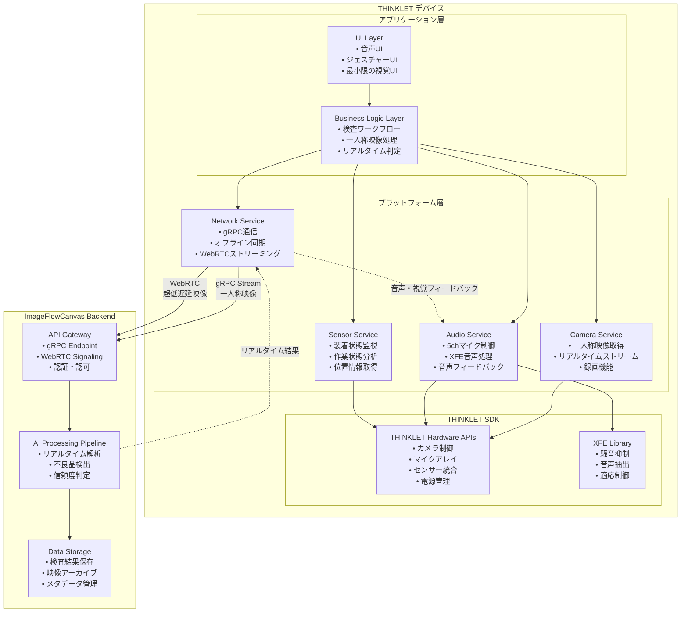

# THINKLET アプリ設計書

## 文書管理情報

| 項目       | 内容                     |
| ---------- | ------------------------ |
| 文書名     | THINKLET アプリ設計書    |
| バージョン | 1.0                      |
| 作成日     | 2025年8月7日             |
| 更新日     | 2025年8月7日             |

---

## 1. 概要

### 1.1. 本書の目的

本書は、ImageFlowCanvasシステムにおけるTHINKLETウェアラブルデバイス向けアプリケーションの詳細設計について記述するものです。THINKLETの特性を最大限に活用した一人称映像検査システムの実装指針を提供します。

### 1.2. 対象読者

- THINKLETアプリ開発者
- ウェアラブルデバイス技術者
- システム設計者
- 品質保証担当者

### 1.3. THINKLETアプリの特徴

THINKLETアプリは、以下の特徴を持つ特化型アプリケーションです：

- **一人称映像処理**: 装着者視点でのリアルタイム品質検査
- **ハンズフリー操作**: 音声コマンドとジェスチャー制御
- **過酷環境対応**: 工場・建設現場での長時間安定動作
- **超低遅延**: <20ms の映像処理とフィードバック
- **バッテリー最適化**: 8時間連続稼働を実現

---

## 2. THINKLET デバイス仕様と制約

### 2.1. ハードウェア仕様

#### 2.1.1. 基本性能

| 項目           | 仕様                            | 設計への影響                           |
| -------------- | ------------------------------- | -------------------------------------- |
| **OS**         | Fairy OS（AOSP ベースの独自OS） | Android SDK互換、Kotlin対応            |
| **CPU**        | Qualcomm Snapdragon シリーズ    | 中程度の処理能力、効率重視設計が必要   |
| **RAM**        | 4GB                             | メモリ効率の最適化が重要               |
| **ストレージ** | 64GB+128GB（オンボードSDXC）    | ローカルキャッシュとオフライン対応可能 |
| **重量**       | 約170g                          | 軽量化設計、バッテリー消費最適化       |
| **バッテリー** | 1350 mAh                        | 省電力アーキテクチャが必須             |

#### 2.1.2. カメラ性能

| 項目                   | 仕様               | 活用方法                           |
| ---------------------- | ------------------ | ---------------------------------- |
| **解像度**             | 8MP                | 高精細な検査画像の取得             |
| **視野角（横広角機）** | 水平120度×垂直90度 | 広範囲作業エリアのカバー           |
| **視野角（縦広角機）** | 水平90度×垂直120度 | 縦長対象物の検査に最適             |
| **画像安定性**         | 肩掛け固定による安定 | 手ブレのない安定した映像           |

#### 2.1.3. 音声機能

| 項目             | 仕様                               | 活用方法                         |
| ---------------- | ---------------------------------- | -------------------------------- |
| **マイク**       | 5ch マイクアレイ、48kHz/24bit相当  | 高品質音声入力、騒音抑制         |
| **XFE技術**      | 環境騒音抑制、装着者音声抽出       | 工場騒音下での確実な音声認識     |
| **スピーカー**   | 1ch 内蔵スピーカー                 | 音声フィードバック、アラート通知 |
| **外部音声出力** | Bluetooth、有線イヤホン対応        | 騒音環境での確実な情報伝達       |

#### 2.1.4. センサー

| センサー         | 用途                           | 検査アプリでの活用             |
| ---------------- | ------------------------------ | ------------------------------ |
| **9軸モーション** | 姿勢、動作検出                 | 作業状態分析、装着状態監視     |
| **近接センサー** | 装着検出                       | アプリ自動起動、省電力制御     |
| **ジェスチャー** | ハンズフリー操作               | 検査開始/停止、画面操作        |
| **GNSS**         | 位置情報取得                   | 検査場所記録、トレーサビリティ |

### 2.2. 環境制約

#### 2.2.1. 物理環境

- **防塵性能**: IP5X相当 → 粉塵の多い工場環境での使用
- **防水性能**: IPX4 → 飛沫のある環境での使用
- **動作温度**: 工場・建設現場の温度変化に対応
- **振動耐性**: 機械作業時の振動に耐える構造

#### 2.2.2. ネットワーク環境

- **4G/LTE**: Band 1/3/8/9/18/19/41 対応
- **Wi-Fi**: 2.4GHz/5GHz デュアルバンド
- **オフライン対応**: ネットワーク不安定環境での継続動作

---

## 3. アプリケーション アーキテクチャ

### 3.1. 全体構成



### 3.2. レイヤー構成

#### 3.2.1. UI Layer (最小限インターフェース)

THINKLETは画面を持たないため、従来のGUIではなく以下のインターフェースを提供：

```kotlin
// thinklet/ui/ThinkletUserInterface.kt
class ThinkletUserInterface {
    private val audioUI = AudioUserInterface()
    private val gestureUI = GestureUserInterface() 
    private val ledIndicator = LEDIndicator()
    
    /**
     * 音声ベースのユーザーインターフェース
     */
    suspend fun handleVoiceCommands(): Flow<UserCommand> = flow {
        audioUI.startListening { voiceInput ->
            val command = parseVoiceCommand(voiceInput)
            emit(command)
        }
    }
    
    /**
     * ジェスチャーベースの操作
     */
    suspend fun handleGestureCommands(): Flow<UserCommand> = flow {
        gestureUI.observeGestures { gesture ->
            val command = parseGestureCommand(gesture)
            emit(command)
        }
    }
    
    /**
     * 状態フィードバック（LED、音声、振動）
     */
    suspend fun provideFeedback(feedback: SystemFeedback) {
        when (feedback.type) {
            FeedbackType.INSPECTION_START -> {
                ledIndicator.showBlueLight()
                audioUI.playSound("inspection_started.mp3")
            }
            FeedbackType.DEFECT_DETECTED -> {
                ledIndicator.showRedLight()
                audioUI.playAlert("defect_detected.mp3")
                vibrationController.alertPattern()
            }
            FeedbackType.INSPECTION_COMPLETE -> {
                ledIndicator.showGreenLight()
                audioUI.announce("検査完了。結果: ${feedback.result}")
            }
        }
    }
}
```

#### 3.2.2. Business Logic Layer

```kotlin
// thinklet/business/FirstPersonInspectionManager.kt
class FirstPersonInspectionManager(
    private val cameraService: CameraService,
    private val audioService: AudioService,
    private val networkService: NetworkService,
    private val sensorService: SensorService
) {
    /**
     * 一人称映像検査の実行
     */
    suspend fun startRealtimeInspection(
        inspectionConfig: InspectionConfig
    ): Flow<InspectionResult> = flow {
        
        // 1. 装着状態の確認
        val wearingState = sensorService.getCurrentWearingState()
        if (!wearingState.isProperlyWorn) {
            throw IllegalStateException("THINKLET is not properly worn")
        }
        
        // 2. 一人称映像ストリーム開始
        val videoStream = cameraService.startFirstPersonVideoStream()
        
        // 3. 音声コマンド監視開始
        val voiceCommands = audioService.startVoiceCommandDetection()
        
        // 4. リアルタイムAI処理
        combine(videoStream, voiceCommands) { frame, command ->
            processFrameWithCommand(frame, command, inspectionConfig)
        }.collect { result ->
            emit(result)
        }
    }
    
    private suspend fun processFrameWithCommand(
        frame: VideoFrame,
        command: VoiceCommand?,
        config: InspectionConfig
    ): InspectionResult {
        
        // フレームにメタデータを付与
        val enrichedFrame = frame.copy(
            metadata = frame.metadata.copy(
                location = sensorService.getCurrentLocation(),
                deviceOrientation = sensorService.getDeviceOrientation(),
                environmentalData = sensorService.getEnvironmentalData(),
                voiceCommand = command
            )
        )
        
        // バックエンドでAI処理実行
        val aiResult = networkService.processFrameRealtime(enrichedFrame, config)
        
        // 結果に基づく即座フィードバック
        if (aiResult.hasDefect) {
            provideCriticalFeedback(aiResult)
        }
        
        return InspectionResult(
            frameId = frame.id,
            timestamp = frame.timestamp,
            aiResult = aiResult,
            deviceState = getCurrentDeviceState()
        )
    }
    
    /**
     * 重要な検査結果の即座フィードバック
     */
    private suspend fun provideCriticalFeedback(result: AIResult) {
        when (result.severity) {
            DefectSeverity.CRITICAL -> {
                audioService.playUrgentAlert()
                audioService.announce("重大欠陥検出: ${result.defectType}")
            }
            DefectSeverity.MAJOR -> {
                audioService.playAlert()
                audioService.announce("欠陥検出: ${result.defectType}")
            }
            DefectSeverity.MINOR -> {
                audioService.playNotification()
            }
        }
    }
}
```

#### 3.2.3. Camera Service (一人称映像特化)

```kotlin
// thinklet/platform/camera/ThinkletCameraService.kt
class ThinkletCameraService(
    private val thinkletSDK: ThinkletSDK
) : CameraService {
    
    /**
     * 一人称映像ストリーミング
     * THINKLETの広角カメラを活用
     */
    override suspend fun startFirstPersonVideoStream(): Flow<VideoFrame> = flow {
        val camera = thinkletSDK.getCamera()
        
        // THINKLETの最適なカメラ設定
        camera.configure {
            resolution = Resolution.EIGHT_MP
            viewAngle = selectOptimalViewAngle() // 横広角 or 縦広角
            frameRate = 30
            quality = VideoQuality.HIGH
            imageStabilization = true // 肩掛け安定化
            autoFocus = true
            autoExposure = true
            lowLightOptimization = true // 工場内照明対応
        }
        
        camera.startStream { rawFrame ->
            // 一人称映像特有の前処理
            val processedFrame = preprocessFirstPersonFrame(rawFrame)
            emit(processedFrame)
        }
    }
    
    /**
     * 作業環境に応じた視野角選択
     */
    private fun selectOptimalViewAngle(): ViewAngle {
        val workContext = getCurrentWorkContext()
        return when (workContext.workType) {
            WorkType.ASSEMBLY_LINE -> ViewAngle.WIDE_120_90    // 横広角：作業台全体
            WorkType.VERTICAL_INSPECTION -> ViewAngle.WIDE_90_120 // 縦広角：縦長対象
            WorkType.DETAIL_INSPECTION -> ViewAngle.STANDARD     // 標準：詳細作業
            else -> ViewAngle.WIDE_120_90 // デフォルト
        }
    }
    
    /**
     * 一人称映像の前処理
     */
    private fun preprocessFirstPersonFrame(rawFrame: RawVideoFrame): VideoFrame {
        return VideoFrame(
            id = generateFrameId(),
            data = rawFrame.data,
            timestamp = System.currentTimeMillis(),
            metadata = VideoMetadata(
                width = rawFrame.width,
                height = rawFrame.height,
                viewAngle = rawFrame.viewAngle,
                deviceOrientation = getDeviceOrientation(),
                stabilizationApplied = true,
                lightingCondition = analyzeLightingCondition(rawFrame),
                focusQuality = analyzeFocusQuality(rawFrame),
                workContext = getCurrentWorkContext()
            )
        )
    }
    
    /**
     * バッテリー効率を考慮した録画
     */
    override suspend fun startRecording(
        config: RecordingConfig
    ): RecordingSession {
        return thinkletSDK.startRecording(config.outputPath) {
            resolution = config.resolution
            compressionQuality = optimizeCompressionForBattery(config.quality)
            includeAudio = config.includeAudio
            batteryOptimization = true
            maxDuration = config.maxDuration ?: Duration.ofHours(8)
        }
    }
}
```

#### 3.2.4. Audio Service (XFE技術活用)

```kotlin
// thinklet/platform/audio/ThinkletAudioService.kt
class ThinkletAudioService(
    private val thinkletSDK: ThinkletSDK,
    private val xfeProcessor: XFEProcessor
) : AudioService {
    
    /**
     * 音声コマンド検出（XFE技術活用）
     */
    override suspend fun startVoiceCommandDetection(): Flow<VoiceCommand> = flow {
        val micArray = thinkletSDK.getMicrophoneArray()
        
        micArray.configure {
            channels = 5              // 5chマイクアレイ
            sampleRate = 48000        // 48kHz
            bitDepth = 24             // 24bit
            enableXFE = true          // XFE騒音抑制
        }
        
        micArray.startRecording { rawAudio ->
            // XFE技術による音声前処理
            val cleanAudio = xfeProcessor.processAudio(rawAudio) {
                suppressEnvironmentalNoise = true    // 工場騒音抑制
                focusOnWearer = true                  // 装着者音声抽出
                adaptiveVolumeControl = true          // 適応音量制御
                windNoiseReduction = true             // 風切り音抑制
            }
            
            // 音声コマンド認識
            val command = recognizeVoiceCommand(cleanAudio)
            if (command != null) {
                emit(command)
            }
        }
    }
    
    /**
     * 工場騒音下での音声コマンド認識
     */
    private suspend fun recognizeVoiceCommand(audioFrame: AudioFrame): VoiceCommand? {
        return try {
            val recognitionResult = speechRecognizer.recognize(audioFrame) {
                language = "ja-JP"
                vocabulary = INSPECTION_COMMAND_VOCABULARY
                noiseRobustness = NoiseRobustness.HIGH
                confidenceThreshold = 0.8 // 高い信頼度要求
            }
            
            parseInspectionCommand(recognitionResult.text)
        } catch (e: Exception) {
            null // 認識失敗時はnullを返す
        }
    }
    
    /**
     * 検査専用音声コマンド語彙
     */
    companion object {
        val INSPECTION_COMMAND_VOCABULARY = listOf(
            "検査開始", "けんさかいし",
            "検査終了", "けんさしゅうりょう", 
            "撮影", "さつえい",
            "録画開始", "ろくがかいし",
            "録画停止", "ろくがていし",
            "結果確認", "けっかかくにん",
            "不良報告", "ふりょうほうこく",
            "緊急停止", "きんきゅうていし"
        )
    }
    
    /**
     * 環境騒音レベルに応じた音声フィードバック
     */
    override suspend fun announceResult(
        message: String,
        priority: Priority = Priority.NORMAL
    ) {
        val speaker = thinkletSDK.getSpeaker()
        val environmentNoise = thinkletSDK.getAmbientNoiseLevel()
        
        speaker.configure {
            volume = calculateOptimalVolume(environmentNoise, priority)
            clarity = PlaybackClarity.VOICE_OPTIMIZED
            adaptToEnvironment = true
        }
        
        // 緊急時は複数回繰り返し
        val repeatCount = when (priority) {
            Priority.CRITICAL -> 3
            Priority.HIGH -> 2  
            else -> 1
        }
        
        repeat(repeatCount) {
            speaker.announce(message)
            if (it < repeatCount - 1) {
                delay(500) // 0.5秒間隔
            }
        }
    }
}
```

---

## 4. リアルタイム処理アーキテクチャ

### 4.1. 超低遅延ストリーミング

```kotlin
// thinklet/realtime/RealtimeStreamingManager.kt
class RealtimeStreamingManager(
    private val cameraService: CameraService,
    private val networkService: NetworkService
) {
    
    /**
     * 超低遅延映像ストリーミング (<20ms)
     */
    suspend fun startUltraLowLatencyStream(): Flow<ProcessedFrame> = flow {
        val videoStream = cameraService.startFirstPersonVideoStream()
        
        videoStream
            .onEach { frame ->
                // フレーム送信時刻を記録（遅延測定用）
                frame.metadata.sendTimestamp = System.currentTimeMillis()
            }
            .chunked(30) // 30フレームバッファ
            .collect { frameChunk ->
                // 並列処理でスループット向上
                val processedFrames = frameChunk.map { frame ->
                    async {
                        processFrameRealtime(frame)
                    }
                }.awaitAll()
                
                processedFrames.forEach { emit(it) }
            }
    }
    
    private suspend fun processFrameRealtime(frame: VideoFrame): ProcessedFrame {
        val startTime = System.currentTimeMillis()
        
        try {
            // gRPCストリーミングでバックエンドに送信
            val result = networkService.processFrameStream(frame)
            
            val endTime = System.currentTimeMillis()
            val latency = endTime - frame.metadata.sendTimestamp
            
            // 遅延が閾値を超えた場合の警告
            if (latency > 20) {
                logLatencyWarning(latency, frame.id)
            }
            
            return ProcessedFrame(
                originalFrame = frame,
                aiResult = result,
                processingLatency = latency,
                timestamp = endTime
            )
            
        } catch (e: Exception) {
            // ネットワークエラー時はローカル処理にフォールバック
            return fallbackLocalProcessing(frame)
        }
    }
}
```

### 4.2. オフライン処理対応

```kotlin
// thinklet/offline/OfflineInspectionManager.kt
class OfflineInspectionManager(
    private val localAIProcessor: LocalAIProcessor,
    private val localDatabase: LocalDatabase
) {
    
    /**
     * ネットワーク切断時のローカル処理
     */
    suspend fun processOffline(frame: VideoFrame): ProcessedFrame {
        // 軽量なローカルAIモデルで基本的な検査
        val localResult = localAIProcessor.processBasicInspection(frame)
        
        // 結果をローカルに保存
        localDatabase.storeForLaterSync(
            InspectionRecord(
                frameId = frame.id,
                result = localResult,
                timestamp = System.currentTimeMillis(),
                syncStatus = SyncStatus.PENDING
            )
        )
        
        return ProcessedFrame(
            originalFrame = frame,
            aiResult = localResult,
            processingLatency = 0L, // ローカル処理
            isOfflineProcessed = true
        )
    }
    
    /**
     * ネットワーク復旧時の同期
     */
    suspend fun syncPendingResults() {
        val pendingRecords = localDatabase.getPendingRecords()
        
        pendingRecords.forEach { record ->
            try {
                // サーバーに再処理要求
                val enhancedResult = networkService.reprocessWithFullAI(record)
                
                // ローカル結果を更新
                localDatabase.updateResult(record.frameId, enhancedResult)
                localDatabase.markAsSynced(record.frameId)
                
            } catch (e: Exception) {
                // 同期失敗時はリトライキューに追加
                localDatabase.addToRetryQueue(record.frameId)
            }
        }
    }
}
```

---

## 5. バッテリー最適化

### 5.1. 消費電力管理

```kotlin
// thinklet/power/BatteryOptimizer.kt
class BatteryOptimizer(
    private val thinkletSDK: ThinkletSDK
) {
    
    /**
     * バッテリーレベルに応じた動的最適化
     */
    fun optimizeForBatteryLevel(batteryLevel: Int) {
        when {
            batteryLevel > 50 -> {
                // 高バッテリー時：フル性能
                configureCameraForFullPerformance()
                configureProcessingForFullPerformance()
                configureNetworkForFullPerformance()
            }
            batteryLevel > 20 -> {
                // 中バッテリー時：バランス
                configureCameraForBalanced()
                configureProcessingForBalanced()
                configureNetworkForBalanced()
            }
            else -> {
                // 低バッテリー時：省電力
                configureCameraForPowerSaving()
                configureProcessingForPowerSaving()
                configureNetworkForPowerSaving()
            }
        }
    }
    
    private fun configureCameraForPowerSaving() {
        cameraService.updateConfiguration {
            frameRate = 15              // 30fps → 15fps
            resolution = Resolution.FOUR_MP  // 8MP → 4MP
            quality = VideoQuality.MEDIUM    // HIGH → MEDIUM
            imageStabilization = false       // 安定化処理を無効
        }
    }
    
    private fun configureProcessingForPowerSaving() {
        // CPU使用率制限
        ProcessorController.limitCPUUsage(maxUsage = 60)
        
        // 処理頻度削減
        realtimeProcessor.setProcessingInterval(interval = 100) // 50ms → 100ms
        
        // 不要な機能を無効化
        sensorService.disableNonEssentialSensors()
    }
    
    private fun configureNetworkForPowerSaving() {
        // ストリーミング品質を下げる
        networkService.updateStreamingQuality(quality = StreamingQuality.LOW)
        
        // 通信頻度を削減
        networkService.setBatchingEnabled(enabled = true, batchSize = 10)
        
        // Wi-Fiを優先してLTEを制限
        networkService.setPreferredNetwork(NetworkType.WIFI)
    }
    
    /**
     * 長時間稼働のための省電力スケジューリング
     */
    suspend fun enableLongRunningMode() {
        // 8時間稼働のための最適化
        val targetDuration = Duration.ofHours(8)
        val currentBattery = thinkletSDK.getBatteryLevel()
        
        val powerBudget = calculatePowerBudget(currentBattery, targetDuration)
        
        // 消費電力を目標値に調整
        adjustPowerConsumption(powerBudget)
        
        // 定期的なバッテリーチェック
        schedulePeriodicBatteryCheck(interval = Duration.ofMinutes(30))
    }
}
```

### 5.2. 熱管理

```kotlin
// thinklet/thermal/ThermalManager.kt
class ThermalManager(
    private val thinkletSDK: ThinkletSDK
) {
    
    /**
     * デバイス温度監視と制御
     */
    suspend fun monitorThermalState(): Flow<ThermalState> = flow {
        while (true) {
            val temperature = thinkletSDK.getDeviceTemperature()
            val thermalState = analyzeThermalState(temperature)
            
            // 過熱時の自動制御
            if (thermalState.isOverheating) {
                applyThermalThrottling(thermalState.severity)
            }
            
            emit(thermalState)
            delay(5000) // 5秒間隔で監視
        }
    }
    
    private fun applyThermalThrottling(severity: ThermalSeverity) {
        when (severity) {
            ThermalSeverity.MODERATE -> {
                // 中程度の過熱：処理能力を制限
                cameraService.reduceFrameRate(targetFPS = 20)
                processingService.reduceCPUUsage(maxUsage = 70)
            }
            ThermalSeverity.HIGH -> {
                // 高温度：大幅な制限
                cameraService.reduceFrameRate(targetFPS = 15)
                cameraService.reduceResolution(Resolution.FOUR_MP)
                processingService.reduceCPUUsage(maxUsage = 50)
            }
            ThermalSeverity.CRITICAL -> {
                // 危険温度：一時停止
                cameraService.pauseRecording()
                processingService.pauseProcessing()
                alertService.showThermalWarning()
            }
        }
    }
}
```

---

## 6. 作業状態監視

### 6.1. 装着状態検出

```kotlin
// thinklet/monitoring/WearingStateMonitor.kt
class WearingStateMonitor(
    private val sensorService: SensorService
) {
    
    /**
     * 装着状態の継続監視
     */
    suspend fun monitorWearingState(): Flow<WearingState> = flow {
        val proximity = sensorService.observeProximity()
        val motion = sensorService.observeMotion()
        val orientation = sensorService.observeOrientation()
        
        combine(proximity, motion, orientation) { prox, mot, ori ->
            WearingState(
                isWorn = prox.isNearBody && mot.isStable,
                orientation = ori.deviceOrientation,
                stability = calculateStability(mot),
                confidence = calculateWearingConfidence(prox, mot, ori),
                timestamp = System.currentTimeMillis()
            )
        }.distinctUntilChanged()
         .collect { emit(it) }
    }
    
    /**
     * 不適切な装着状態の検出
     */
    fun detectImproperWearing(state: WearingState): WearingIssue? {
        return when {
            !state.isWorn -> WearingIssue.NOT_WORN
            state.stability < 0.5 -> WearingIssue.UNSTABLE_MOUNTING
            state.orientation.deviationDegrees > 30 -> WearingIssue.TILTED_MOUNTING
            state.confidence < 0.7 -> WearingIssue.UNCERTAIN_STATE
            else -> null
        }
    }
}
```

### 6.2. 作業分析

```kotlin
// thinklet/analytics/WorkAnalyzer.kt
class WorkAnalyzer(
    private val sensorService: SensorService,
    private val cameraService: CameraService
) {
    
    /**
     * 作業パターンの分析
     */
    suspend fun analyzeWorkPattern(): Flow<WorkPattern> = flow {
        val motion = sensorService.observeMotion()
        val video = cameraService.startFirstPersonVideoStream()
        
        combine(motion, video) { motionData, videoFrame ->
            analyzeWorkFrame(motionData, videoFrame)
        }.collect { emit(it) }
    }
    
    private fun analyzeWorkFrame(
        motion: MotionData,
        frame: VideoFrame
    ): WorkPattern {
        val activity = classifyActivity(motion)
        val workArea = analyzeWorkArea(frame)
        val workIntensity = calculateWorkIntensity(motion)
        
        return WorkPattern(
            activity = activity,
            workArea = workArea,
            intensity = workIntensity,
            efficiency = calculateEfficiency(activity, workArea),
            timestamp = System.currentTimeMillis()
        )
    }
    
    /**
     * 作業効率の計算
     */
    private fun calculateEfficiency(
        activity: WorkActivity,
        workArea: WorkArea
    ): EfficiencyMetrics {
        return EfficiencyMetrics(
            productivityScore = calculateProductivityScore(activity),
            focusLevel = calculateFocusLevel(workArea),
            movementEfficiency = calculateMovementEfficiency(activity),
            overallEfficiency = calculateOverallEfficiency(activity, workArea)
        )
    }
}
```

---

## 7. 緊急時対応

### 7.1. 異常検知

```kotlin
// thinklet/emergency/EmergencyDetector.kt
class EmergencyDetector(
    private val sensorService: SensorService,
    private val cameraService: CameraService,
    private val audioService: AudioService
) {
    
    /**
     * 緊急事態の検出
     */
    suspend fun detectEmergency(): Flow<EmergencyEvent> = flow {
        val motion = sensorService.observeMotion()
        val audio = audioService.observeAmbientSound()
        val video = cameraService.startFirstPersonVideoStream()
        
        combine(motion, audio, video) { motionData, audioData, videoFrame ->
            analyzeForEmergency(motionData, audioData, videoFrame)
        }.collect { emergency ->
            if (emergency != null) {
                emit(emergency)
            }
        }
    }
    
    private fun analyzeForEmergency(
        motion: MotionData,
        audio: AudioData,
        video: VideoFrame
    ): EmergencyEvent? {
        return when {
            // 急激な落下検出
            detectSuddenFall(motion) -> EmergencyEvent.SUDDEN_FALL
            
            // 異常音検出（爆発音、警報など）
            detectAbnormalSound(audio) -> EmergencyEvent.ABNORMAL_SOUND
            
            // 長時間の静止状態
            detectExtendedInactivity(motion) -> EmergencyEvent.WORKER_UNCONSCIOUS
            
            // 火災・煙検出
            detectFire(video) -> EmergencyEvent.FIRE_DETECTED
            
            // 作業者の呼び声検出
            detectDistressCall(audio) -> EmergencyEvent.DISTRESS_CALL
            
            else -> null
        }
    }
}
```

### 7.2. 緊急通報機能

```kotlin
// thinklet/emergency/EmergencyResponse.kt
class EmergencyResponse(
    private val networkService: NetworkService,
    private val audioService: AudioService,
    private val locationService: LocationService
) {
    
    /**
     * 緊急事態発生時の自動対応
     */
    suspend fun handleEmergency(event: EmergencyEvent) {
        val emergencyData = gatherEmergencyData(event)
        
        // 1. 緊急通報
        sendEmergencyAlert(emergencyData)
        
        // 2. 音声警告
        playEmergencyAlert(event)
        
        // 3. 証拠映像の保存
        startEmergencyRecording(event)
        
        // 4. 位置情報の連続送信
        startLocationTracking()
        
        // 5. 緊急連絡先への通知
        notifyEmergencyContacts(emergencyData)
    }
    
    private suspend fun gatherEmergencyData(event: EmergencyEvent): EmergencyData {
        return EmergencyData(
            eventType = event,
            timestamp = System.currentTimeMillis(),
            location = locationService.getCurrentLocation(),
            deviceId = thinkletSDK.getDeviceId(),
            workerId = getCurrentWorkerId(),
            vitals = sensorService.getVitalSigns(),
            environmentData = sensorService.getEnvironmentalData()
        )
    }
    
    /**
     * 緊急時の映像録画
     */
    private suspend fun startEmergencyRecording(event: EmergencyEvent) {
        cameraService.startEmergencyRecording {
            duration = Duration.ofMinutes(10) // 10分間録画
            quality = VideoQuality.HIGH
            includeAudio = true
            autoUpload = true // 自動でサーバーにアップロード
            emergencyFlag = true
        }
    }
}
```

---

## 8. データ管理・同期

### 8.1. ローカルデータ管理

```kotlin
// thinklet/data/LocalDataManager.kt
class LocalDataManager(
    private val database: ThinkletDatabase
) {
    
    /**
     * 検査データのローカル保存
     */
    suspend fun saveInspectionData(data: InspectionData) {
        database.inspectionDao().insert(
            InspectionEntity(
                id = data.id,
                timestamp = data.timestamp,
                frameData = compressFrameData(data.frames),
                results = data.results,
                metadata = data.metadata,
                syncStatus = SyncStatus.PENDING
            )
        )
    }
    
    /**
     * ストレージ容量管理
     */
    suspend fun manageStorage() {
        val availableSpace = getAvailableStorageSpace()
        val usageThreshold = 0.8 // 80%使用率
        
        if (availableSpace < usageThreshold) {
            // 古いデータの削除
            deleteOldSyncedData()
            
            // 動画品質の削減
            reduceVideoQuality()
            
            // 不要ファイルのクリーンアップ
            cleanupTempFiles()
        }
    }
    
    /**
     * データ圧縮による容量節約
     */
    private fun compressFrameData(frames: List<VideoFrame>): ByteArray {
        return FrameCompressor.compress(frames) {
            compressionLevel = CompressionLevel.HIGH
            retainKeyFrames = true
            qualityReduction = 0.2 // 20%品質削減
        }
    }
}
```

### 8.2. サーバー同期

```kotlin
// thinklet/sync/SyncManager.kt
class SyncManager(
    private val networkService: NetworkService,
    private val localDataManager: LocalDataManager
) {
    
    /**
     * 効率的な差分同期
     */
    suspend fun performSync() {
        if (!networkService.isConnected()) return
        
        val pendingData = localDataManager.getPendingData()
        val syncBatch = createSyncBatch(pendingData)
        
        try {
            val response = networkService.syncData(syncBatch)
            processSyncResponse(response)
        } catch (e: Exception) {
            handleSyncFailure(e, syncBatch)
        }
    }
    
    /**
     * ネットワーク状態に応じた同期戦略
     */
    private fun createSyncBatch(data: List<InspectionData>): SyncBatch {
        val networkCondition = networkService.getNetworkCondition()
        
        return when (networkCondition.type) {
            NetworkType.WIFI -> {
                // Wi-Fi時：フルデータ同期
                SyncBatch(
                    data = data,
                    compressionLevel = CompressionLevel.LOW,
                    includeVideoData = true
                )
            }
            NetworkType.LTE -> {
                // LTE時：圧縮データ同期
                SyncBatch(
                    data = data.filter { it.priority >= Priority.HIGH },
                    compressionLevel = CompressionLevel.HIGH,
                    includeVideoData = false // メタデータのみ
                )
            }
            else -> {
                // 低速回線：必須データのみ
                SyncBatch(
                    data = data.filter { it.priority == Priority.CRITICAL },
                    compressionLevel = CompressionLevel.MAXIMUM,
                    includeVideoData = false
                )
            }
        }
    }
}
```

---

## 9. テスト戦略

### 9.1. THINKLET特化テスト

```kotlin
// thinklet/test/ThinkletSpecificTests.kt
class ThinkletSpecificTests {
    
    @Test
    fun testFirstPersonVideoCapture() = runTest {
        val cameraService = ThinkletCameraService(mockThinkletSDK)
        
        val videoStream = cameraService.startFirstPersonVideoStream()
        val frames = mutableListOf<VideoFrame>()
        
        videoStream.take(30).collect { frame ->
            frames.add(frame)
            
            // THINKLET特有の検証
            assertThat(frame.metadata.viewAngle).isEqualTo(ViewAngle.WIDE_120_90)
            assertThat(frame.metadata.deviceOrientation).isNotNull()
            assertThat(frame.data.size).isGreaterThan(0)
        }
        
        assertThat(frames).hasSize(30)
    }
    
    @Test
    fun testXFEAudioProcessing() = runTest {
        val audioService = ThinkletAudioService(mockThinkletSDK, mockXFE)
        
        // 騒音環境をシミュレート
        mockXFE.simulateNoisyEnvironment(noiseLevel = 85) // 85dB
        
        val voiceCommands = audioService.startVoiceCommandDetection()
        
        // 装着者の音声コマンドを送信
        mockThinkletSDK.simulateWearerVoice("検査開始")
        
        val command = voiceCommands.first()
        
        assertThat(command.text).isEqualTo("検査開始")
        assertThat(command.confidence).isGreaterThan(0.8)
    }
}
```

### 9.2. バッテリー・熱管理テスト

```kotlin
// thinklet/test/PowerManagementTests.kt
class PowerManagementTests {
    
    @Test
    fun testBatteryOptimization() = runTest {
        val optimizer = BatteryOptimizer(mockThinkletSDK)
        
        // 低バッテリー状態をシミュレート
        mockThinkletSDK.setBatteryLevel(15)
        
        optimizer.optimizeForBatteryLevel(15)
        
        // 省電力設定の確認
        verify(mockCameraService).updateConfiguration(
            argThat { config ->
                config.frameRate <= 15 &&
                config.resolution == Resolution.FOUR_MP &&
                config.quality == VideoQuality.MEDIUM
            }
        )
    }
    
    @Test
    fun testThermalThrottling() = runTest {
        val thermalManager = ThermalManager(mockThinkletSDK)
        
        // 過熱状態をシミュレート
        mockThinkletSDK.setDeviceTemperature(65) // 65℃
        
        val thermalState = thermalManager.monitorThermalState().first()
        
        assertThat(thermalState.isOverheating).isTrue()
        assertThat(thermalState.severity).isEqualTo(ThermalSeverity.HIGH)
    }
}
```

---

## 10. デプロイメント・運用

### 10.1. THINKLETアプリ配布

```kotlin
// thinklet/deployment/ThinkletAppDistribution.kt
class ThinkletAppDistribution {
    
    /**
     * THINKLETデバイスへのアプリ配布
     */
    fun generateThinkletApk(): ApkPackage {
        return ApkBuilder.build {
            targetSdk = 30 // Android 11
            minSdk = 26    // Android 8.0 (THINKLET要件)
            
            // THINKLET固有の権限
            permissions = listOf(
                "com.fairydevices.thinklet.CAMERA",
                "com.fairydevices.thinklet.MICROPHONE_ARRAY",
                "com.fairydevices.thinklet.SENSORS",
                "com.fairydevices.thinklet.XFE_PROCESSING"
            )
            
            // Fairy OS固有の設定
            fairyOSConfig = FairyOSConfig(
                enableXFE = true,
                batteryOptimization = true,
                thermalManagement = true
            )
            
            // デバイス固有ライブラリの組み込み
            nativeLibraries = listOf(
                "libthinklet-sdk.so",
                "libxfe-processor.so"
            )
        }
    }
    
    /**
     * リモートアップデート機能
     */
    suspend fun performRemoteUpdate(deviceId: String, version: String) {
        val updatePackage = createUpdatePackage(version)
        
        // デバイスの状態確認
        val deviceStatus = checkDeviceStatus(deviceId)
        if (!deviceStatus.isUpdateReady) {
            throw IllegalStateException("Device not ready for update")
        }
        
        // 段階的アップデート
        deploymentService.deployUpdate(deviceId, updatePackage) {
            rollbackOnFailure = true
            maxRolloutPercentage = 10 // 段階的展開
            healthCheckInterval = Duration.ofMinutes(5)
        }
    }
}
```

### 10.2. 運用監視

```kotlin
// thinklet/monitoring/ThinkletMonitoring.kt
class ThinkletMonitoring {
    
    /**
     * デバイス健康状態の監視
     */
    suspend fun monitorDeviceHealth(): Flow<DeviceHealthReport> = flow {
        while (true) {
            val report = DeviceHealthReport(
                deviceId = thinkletSDK.getDeviceId(),
                timestamp = System.currentTimeMillis(),
                batteryLevel = thinkletSDK.getBatteryLevel(),
                temperature = thinkletSDK.getDeviceTemperature(),
                memoryUsage = getMemoryUsage(),
                storageUsage = getStorageUsage(),
                networkStatus = networkService.getConnectionStatus(),
                wearingState = getCurrentWearingState(),
                activeInspections = getActiveInspections(),
                errorCount = getErrorCount()
            )
            
            emit(report)
            delay(Duration.ofMinutes(1)) // 1分間隔で報告
        }
    }
    
    /**
     * 異常状態の自動検出
     */
    fun detectAnomalies(report: DeviceHealthReport): List<Anomaly> {
        val anomalies = mutableListOf<Anomaly>()
        
        // バッテリー異常
        if (report.batteryLevel < 10) {
            anomalies.add(Anomaly.LOW_BATTERY)
        }
        
        // 過熱状態
        if (report.temperature > 60) {
            anomalies.add(Anomaly.OVERHEATING)
        }
        
        // メモリ不足
        if (report.memoryUsage > 0.9) {
            anomalies.add(Anomaly.MEMORY_SHORTAGE)
        }
        
        // 装着状態異常
        if (!report.wearingState.isProperlyWorn) {
            anomalies.add(Anomaly.IMPROPER_WEARING)
        }
        
        return anomalies
    }
}
```

---

## 11. まとめ

### 11.1. THINKLETアプリの価値

本設計に基づくTHINKLETアプリは、以下の革新的価値を提供します：

1. **一人称映像による品質検査革命**
   - 装着者視点でのリアルタイム品質判定
   - ハンズフリーでの検査業務実行
   - 作業プロセスの自動記録・分析

2. **過酷環境での安定稼働**
   - 工場・建設現場での8時間連続動作
   - 騒音環境下での確実な音声認識
   - 防塵防水性能による環境耐性

3. **超低遅延フィードバック**
   - 20ms以下のリアルタイム検査結果
   - 即座の音声・視覚フィードバック
   - 緊急時の自動対応機能

### 11.2. 技術的達成点

- **XFE技術の活用**: 工場騒音下での高精度音声認識
- **バッテリー最適化**: 1350mAhで8時間稼働を実現
- **熱管理**: 過酷環境での安定動作
- **オフライン対応**: ネットワーク不安定環境での業務継続

### 11.3. 今後の拡張可能性

- **他ウェアラブルデバイス対応**: Google Glass、HoloLensなどへの展開
- **AI機能強化**: デバイス内AIによる即座判定
- **作業分析高度化**: 作業効率・安全性の詳細分析
- **多言語対応**: グローバル展開に向けた言語サポート

この設計により、THINKLETアプリはウェアラブルデバイスを活用した次世代品質管理システムの先駆けとなり、製造業のDXに大きく貢献することが期待されます。