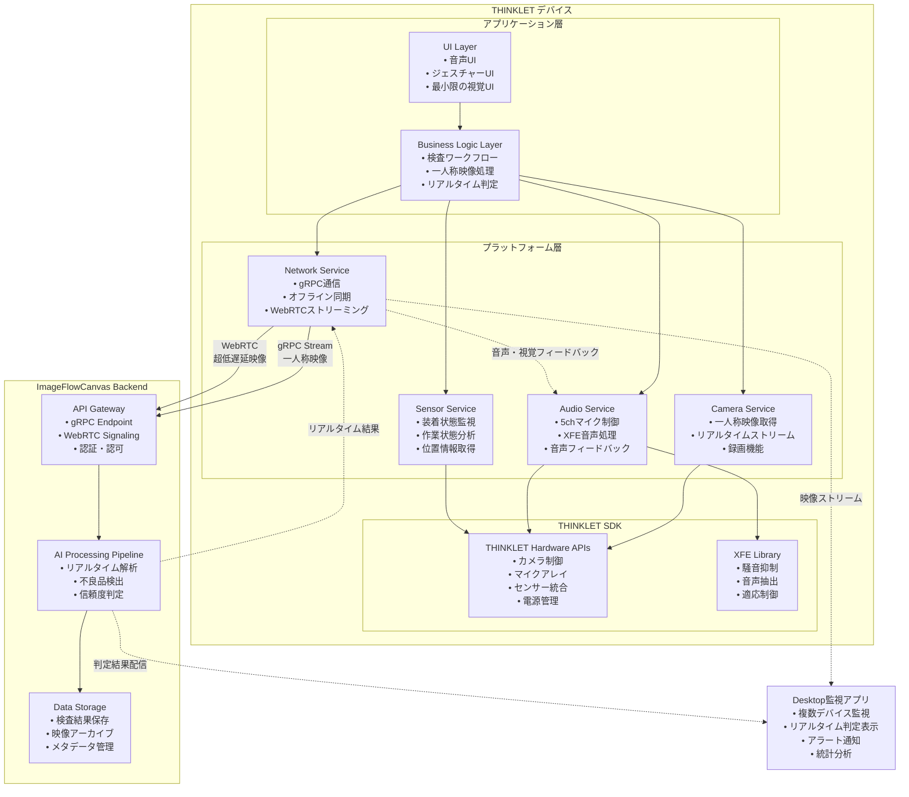

# THINKLET アプリ設計書

## 文書管理情報

| 項目       | 内容                     |
| ---------- | ------------------------ |
| 文書名     | THINKLET アプリ設計書    |
| バージョン | 1.0                      |
| 作成日     | 2025年8月7日             |
| 更新日     | 2025年8月7日             |

---

## 1. 概要

### 1.1. 本書の目的

本書は、ImageFlowCanvasシステムにおけるTHINKLETウェアラブルデバイス向けアプリケーションの詳細設計について記述するものです。THINKLETの特性を最大限に活用した一人称映像検査システムの実装指針を提供します。

### 1.2. 対象読者

- THINKLETアプリ開発者
- ウェアラブルデバイス技術者
- システム設計者
- 品質保証担当者

### 1.3. THINKLETアプリの特徴

THINKLETアプリは、以下の特徴を持つ特化型アプリケーションです：

- **一人称映像処理**: 装着者視点でのリアルタイム品質検査
- **ハンズフリー操作**: 音声コマンドとジェスチャー制御
- **過酷環境対応**: 工場・建設現場での長時間安定動作
- **超低遅延**: <20ms の映像処理とフィードバック
- **バッテリー最適化**: 8時間連続稼働を実現
- **デスクトップ連携**: リアルタイム検査結果のデスクトップアプリ表示

---

## 2. THINKLET デバイス仕様と制約

### 2.1. ハードウェア仕様

#### 2.1.1. 基本性能

| 項目           | 仕様                            | 設計への影響                           |
| -------------- | ------------------------------- | -------------------------------------- |
| **OS**         | Fairy OS（AOSP ベースの独自OS） | Android SDK互換、Kotlin対応            |
| **CPU**        | Qualcomm Snapdragon シリーズ    | 中程度の処理能力、効率重視設計が必要   |
| **RAM**        | 4GB                             | メモリ効率の最適化が重要               |
| **ストレージ** | 64GB+128GB（オンボードSDXC）    | ローカルキャッシュとオフライン対応可能 |
| **重量**       | 約170g                          | 軽量化設計、バッテリー消費最適化       |
| **バッテリー** | 1350 mAh                        | 省電力アーキテクチャが必須             |

#### 2.1.2. カメラ性能

| 項目                   | 仕様               | 活用方法                           |
| ---------------------- | ------------------ | ---------------------------------- |
| **解像度**             | 8MP                | 高精細な検査画像の取得             |
| **視野角（横広角機）** | 水平120度×垂直90度 | 広範囲作業エリアのカバー           |
| **視野角（縦広角機）** | 水平90度×垂直120度 | 縦長対象物の検査に最適             |
| **画像安定性**         | 肩掛け固定による安定 | 手ブレのない安定した映像           |

#### 2.1.3. 音声機能

| 項目             | 仕様                               | 活用方法                         |
| ---------------- | ---------------------------------- | -------------------------------- |
| **マイク**       | 5ch マイクアレイ、48kHz/24bit相当  | 高品質音声入力、騒音抑制         |
| **XFE技術**      | 環境騒音抑制、装着者音声抽出       | 工場騒音下での確実な音声認識     |
| **スピーカー**   | 1ch 内蔵スピーカー                 | 音声フィードバック、アラート通知 |
| **外部音声出力** | Bluetooth、有線イヤホン対応        | 騒音環境での確実な情報伝達       |

#### 2.1.4. センサー

| センサー         | 用途                           | 検査アプリでの活用             |
| ---------------- | ------------------------------ | ------------------------------ |
| **9軸モーション** | 姿勢、動作検出                 | 作業状態分析、装着状態監視     |
| **近接センサー** | 装着検出                       | アプリ自動起動、省電力制御     |
| **ジェスチャー** | ハンズフリー操作               | 検査開始/停止、画面操作        |
| **GNSS**         | 位置情報取得                   | 検査場所記録、トレーサビリティ |

### 2.2. 環境制約

#### 2.2.1. 物理環境

- **防塵性能**: IP5X相当 → 粉塵の多い工場環境での使用
- **防水性能**: IPX4 → 飛沫のある環境での使用
- **動作温度**: 工場・建設現場の温度変化に対応
- **振動耐性**: 機械作業時の振動に耐える構造

#### 2.2.2. ネットワーク環境

- **4G/LTE**: Band 1/3/8/9/18/19/41 対応
- **Wi-Fi**: 2.4GHz/5GHz デュアルバンド
- **オフライン対応**: ネットワーク不安定環境での継続動作

---

## 3. アプリケーション アーキテクチャ

### 3.1. 全体構成

### 3.2. レイヤー構成

#### 3.2.1. UI Layer (最小限インターフェース)

THINKLETは画面を持たないため、従来のGUIではなく以下のインターフェースを提供します：

**音声ベースユーザーインターフェース:**
- 音声コマンドの継続監視
- 音声入力の解析と制御コマンド変換
- システムからの音声フィードバック

**ジェスチャーベース操作:**
- ジェスチャーセンサーによる操作検出
- ハンズフリーでの基本操作対応
- 直感的な動作による機器制御

**状態フィードバックシステム:**
- **LEDインジケーター**: 視覚的状態表示
  - 青色光: 検査開始状態
  - 赤色光: 不良検出アラート
  - 緑色光: 検査完了通知
- **音声フィードバック**: 状況に応じた音声案内
- **振動フィードバック**: 緊急時のアラートパターン

#### 3.2.2. Business Logic Layer

一人称映像検査管理では、THINKLETの特性を活かしたリアルタイム検査機能と、デスクトップアプリケーションとの連携を実装します。

**一人称映像検査の実行フロー:**
1. **装着状態確認**: センサーによる適切な装着状態の検証
2. **一人称映像ストリーム開始**: 高品質映像の継続取得
3. **音声コマンド監視**: 作業者の音声指示の同時監視
4. **リアルタイムAI処理**: バックエンドでの並列画像解析
5. **デスクトップ結果配信**: 検査結果のリアルタイム配信

**フレーム処理とフィードバック:**
- 映像フレームへのメタデータ付与（位置情報、デバイス姿勢、環境データ、音声コマンド）
- バックエンドAI処理の実行
- 検査結果に基づく即座フィードバック提供
- デスクトップアプリへのリアルタイム結果配信

**重要検査結果の緊急フィードバック:**
- **重大欠陥検出**: 緊急アラート音 + 音声案内「重大欠陥検出: [欠陥タイプ]」+ デスクトップ緊急通知
- **一般欠陥検出**: 警告音 + 音声案内「欠陥検出: [欠陥タイプ]」+ デスクトップアラート表示
- **軽微欠陥検出**: 通知音のみ + デスクトップ通常表示

**デスクトップ連携機能:**
- **リアルタイム映像配信**: 一人称映像のデスクトップストリーミング
- **判定結果即座表示**: <100ms遅延でのAI判定結果表示
- **アラート通知**: 不良検出時のデスクトップ緊急通知
- **統計データ送信**: 検査パフォーマンスデータの定期送信

#### 3.2.3. Camera Service (一人称映像特化)

THINKLET専用カメラサービスでは、広角カメラを活用した一人称映像処理を最適化します。

**一人称映像ストリーミング機能:**
- **最適カメラ設定**: 8MP解像度、30fps、高品質映像
- **視野角最適化**: 作業環境に応じた最適視野角の自動選択
- **映像安定化**: 肩掛け固定に対応した手ブレ補正
- **自動調整**: オートフォーカス、自動露出、低照度最適化

**作業環境別視野角選択:**
- **組立ライン作業**: 横広角（120度×90度）- 作業台全体をカバー
- **縦型検査作業**: 縦広角（90度×120度）- 縦長対象物に最適化
- **詳細検査作業**: 標準視野角 - 細部作業に集中
- **デフォルト**: 横広角設定

**一人称映像の前処理:**
- フレームID生成とタイムスタンプ付与
- デバイス姿勢情報の付与
- 照明状態とフォーカス品質の分析
- 作業コンテキストの記録

**バッテリー効率録画:**
- 圧縮品質のバッテリー最適化
- 最大8時間連続録画対応
- 音声付き録画機能

#### 3.2.4. Audio Service (XFE技術活用)

THINKLET音声サービスでは、XFE技術を活用した高性能音声処理を実現します。

**音声コマンド検出（XFE技術活用）:**
- **5chマイクアレイ設定**: 48kHz/24bit高品質音声収集
- **XFE音声前処理**: 
  - 工場騒音抑制機能
  - 装着者音声抽出機能
  - 適応音量制御機能
  - 風切り音抑制機能

**工場騒音下での音声コマンド認識:**
- **高精度認識**: 日本語音声認識（信頼度閾値0.8以上）
- **騒音耐性**: 高騒音環境対応設計
- **専用語彙**: 検査業務特化語彙セット

**検査専用音声コマンド語彙:**
- 検査制御: 「検査開始」「検査終了」「緊急停止」
- 撮影制御: 「撮影」「録画開始」「録画停止」
- 結果確認: 「結果確認」「不良報告」

**環境騒音対応音声フィードバック:**
- **適応音量調整**: 環境騒音レベルに応じた自動音量調整
- **音声品質最適化**: 音声認識向け高明度設定
- **緊急時対応**: 重要度に応じた繰り返し回数調整
  - 緊急時（Critical）: 3回繰り返し
  - 高優先度（High）: 2回繰り返し
  - 通常（Normal）: 1回のみ

---

### 4. リアルタイム処理アーキテクチャ

#### 4.1. 超低遅延ストリーミング

超低遅延映像ストリーミング（20ms未満）では、高効率な並列処理により高性能を実現します。

**超低遅延ストリーミング機能:**
- **フレーム送信時刻記録**: 遅延測定用タイムスタンプ付与
- **バッファリング最適化**: 30フレームチャンク単位での効率処理
- **並列処理**: 複数フレームの同時処理によるスループット向上
- **遅延監視**: 20ms閾値超過時の警告機能

**リアルタイム処理フロー:**
1. 映像フレームの受信とタイムスタンプ記録
2. 30フレーム単位でのチャンク処理
3. gRPCストリーミングによるバックエンド送信
4. 並列AI処理の実行
5. 遅延測定と性能監視
6. エラー時のローカル処理フォールバック

#### 4.2. オフライン処理対応

ネットワーク切断時には、ローカルAI処理による業務継続性を確保します。

**オフライン処理機能:**
- **軽量ローカルAI**: 基本的な検査機能をローカルで実行
- **データ保存**: 検査結果をローカルデータベースに一時保存
- **同期状態管理**: ネットワーク復旧時の自動同期準備

**ネットワーク復旧時同期:**
- **保留レコード処理**: ローカル保存された未同期データの自動送信
- **サーバー再処理**: 高精度AIによる再解析実行
- **結果更新**: ローカル結果の高精度バージョンへの更新
- **エラーハンドリング**: 同期失敗時のリトライキュー管理

---

## 5. バッテリー最適化

### 5.1. 消費電力管理

バッテリーレベルに応じた動的最適化により、8時間連続稼働を実現します。

**バッテリーレベル別最適化戦略:**

**高バッテリー時（50%超）: フル性能モード**
- カメラ: 最高品質設定、フル解像度、30fps
- 処理: 最大性能、全機能有効
- ネットワーク: 高品質ストリーミング

**中バッテリー時（20-50%）: バランスモード**
- カメラ: 中品質設定、解像度・フレームレート調整
- 処理: 適度な性能制限
- ネットワーク: 標準品質ストリーミング

**低バッテリー時（20%未満）: 省電力モード**
- カメラ設定: 15fps、4MP解像度、中品質、手ブレ補正無効
- 処理制限: CPU使用率60%制限、処理間隔100ms
- ネットワーク: 低品質ストリーミング、バッチ処理有効

**長時間稼働最適化:**
- **目標稼働時間**: 8時間連続動作
- **電力配分計算**: 現在バッテリーレベルから最適配分を算出
- **定期監視**: 30分間隔でのバッテリーチェック
- **動的調整**: 消費電力の継続的最適化

### 5.2. 熱管理

デバイス温度監視により、過熱防止と安定動作を確保します。

**熱管理監視システム:**
- **温度監視**: 5秒間隔での継続的デバイス温度測定
- **熱状態分析**: 温度データから過熱リスクを評価
- **自動制御**: 過熱検出時の自動スロットリング実行

**過熱時の段階的制御:**

**中程度過熱時の制御:**
- フレームレート: 30fps → 20fps
- CPU使用率: 最大70%制限

**高温度時の制御:**
- フレームレート: 30fps → 15fps  
- 解像度: 8MP → 4MP
- CPU使用率: 最大50%制限

**危険温度時の緊急制御:**
- 録画一時停止
- 処理一時停止
- 熱警告アラート表示

---

## 6. 作業状態監視

### 6.1. 装着状態検出

装着状態の継続監視により、適切な機器使用状況を確保します。

**装着状態監視機能:**
- **近接センサー監視**: 身体接触の継続検出
- **モーションセンサー監視**: デバイスの動作安定性測定
- **姿勢センサー監視**: デバイスの装着角度・向き確認
- **統合判定**: 複数センサーデータの組み合わせ評価

**不適切装着の検出:**
- **装着なし**: デバイスが身体から離れている状態
- **不安定装着**: 振動や揺れによる不安定な装着状態
- **傾斜装着**: 30度を超える傾斜での装着状態
- **不確実状態**: センサー信頼度が低い状態

### 6.2. 作業分析

作業パターンの分析により、作業効率と品質の向上を支援します。

**作業パターン分析機能:**
- **活動分類**: モーションデータから作業活動の種類を判定
- **作業エリア分析**: 映像から作業対象領域を特定
- **作業強度計算**: 動作データから作業負荷を測定
- **効率性評価**: 作業パターンと成果の相関分析

**作業効率指標:**
- **生産性スコア**: 活動パターンに基づく生産性評価
- **集中度レベル**: 作業エリアへの注意集中度測定
- **動作効率性**: 無駄な動作の検出と改善提案
- **総合効率性**: 全体的な作業効率の統合評価

---

## 7. 緊急時対応

### 7.1. 異常検知

緊急事態の自動検出により、作業者の安全を確保します。

**緊急事態検出機能:**
- **動作センサー分析**: 急激な落下や異常な動作パターンの検出
- **音声分析**: 異常音（爆発音、警報音）や救助要請の検出
- **映像分析**: 火災・煙・危険物の視覚的検出
- **行動分析**: 長時間の静止状態や意識不明の可能性検出

**検出対象の緊急事態:**
- **急激な落下**: 転倒や事故による急激な姿勢変化
- **異常音検出**: 工場警報や危険を示す音響信号
- **作業者意識不明**: 長時間の静止状態
- **火災検出**: 炎や煙の映像解析
- **救助要請**: 作業者の呼び声や救助信号

### 7.2. 緊急通報機能

緊急事態発生時の自動対応により、迅速な救助活動を支援します。

**緊急事態発生時の自動対応フロー:**
1. **緊急通報**: 即座のアラート送信
2. **音声警告**: 緊急事態の音声案内
3. **証拠映像保存**: 事故状況の記録保存
4. **位置追跡開始**: 継続的な位置情報送信
5. **緊急連絡先通知**: 関係者への自動通知

**緊急データ収集項目:**
- 事象タイプ、発生時刻、位置情報
- デバイスID、作業者ID
- バイタルサイン、環境データ

**緊急時映像録画:**
- **録画時間**: 10分間の自動録画
- **品質設定**: 高品質での証拠保全
- **音声付き**: 現場音声の同時記録
- **自動アップロード**: サーバーへの即座転送

---

## 8. データ管理・同期

### 8.1. ローカルデータ管理

効率的なローカルデータ管理により、オフライン環境での業務継続性を確保します。

**検査データのローカル保存:**
- データベースへの検査結果格納
- フレームデータの圧縮保存
- メタデータの構造化保存
- 同期状態の管理

**ストレージ容量管理:**
- **容量監視**: 使用可能ストレージ領域の継続監視
- **使用率閾値**: 80%使用率での自動クリーンアップ
- **データ削除**: 古い同期済みデータの自動削除
- **品質調整**: 動画品質の段階的削減
- **クリーンアップ**: 一時ファイルの定期削除

**データ圧縮による容量節約:**
- **高圧縮レベル**: ストレージ効率の最大化
- **キーフレーム保持**: 重要フレームの品質維持
- **品質削減**: 20%品質削減による容量節約

### 8.2. サーバー同期

ネットワーク状態に応じた効率的な差分同期を実現します。

**差分同期機能:**
- **接続状態確認**: ネットワーク接続の可用性チェック
- **保留データ取得**: 未同期データの抽出
- **同期バッチ作成**: ネットワーク条件に応じた最適化
- **エラーハンドリング**: 同期失敗時の適切な処理

**ネットワーク状態別同期戦略:**

**Wi-Fi接続時: フルデータ同期**
- 全データの完全同期
- 低圧縮レベル設定
- 動画データを含む完全転送

**LTE接続時: 圧縮データ同期**
- 高優先度データのみ選択同期
- 高圧縮レベル設定
- メタデータ中心の転送

**低速回線時: 必須データのみ**
- 重要度最高データのみ
- 最大圧縮レベル設定
- 動画データ除外

---

## 9. テスト戦略

### 9.1. THINKLET特化テスト

THINKLET特有の機能に対する包括的なテスト戦略を実装します。

**一人称映像キャプチャーテスト:**
- **映像ストリーム検証**: 30フレーム/秒での安定ストリーミング
- **メタデータ検証**: 視野角120度×90度、デバイス姿勢情報付与
- **品質確認**: フレームデータの整合性と完全性
- **THINKLET仕様適合**: ハードウェア固有設定の正確性

**XFE音声処理テスト:**
- **騒音環境シミュレート**: 85dB騒音環境での音声認識テスト
- **装着者音声抽出**: XFE技術による選択的音声集音検証
- **認識精度確認**: 音声コマンド「検査開始」の高精度認識（信頼度0.8以上）
- **環境適応性**: 様々な騒音レベルでの認識性能評価

### 9.2. バッテリー・熱管理テスト

長時間稼働における安定性と効率性を検証します。

**バッテリー最適化テスト:**
- **低バッテリー状態**: 15%バッテリーレベルでの自動最適化検証
- **省電力設定確認**: フレームレート15fps、4MP解像度、中品質への自動調整
- **機能制限検証**: バッテリーレベルに応じた段階的機能制限の動作確認

**熱管理テスト:**
- **過熱状態シミュレート**: 65℃環境での熱制御機能検証
- **過熱判定**: 高温度での過熱状態検出の正確性
- **自動制御確認**: 過熱時の自動スロットリング動作の検証

---

## 10. デプロイメント・運用

### 10.1. THINKLETアプリ配布

THINKLET専用アプリケーションの効率的な配布とアップデート機能を提供します。

**THINKLETアプリケーション配布仕様:**
- **ターゲットSDK**: Android 11 (API Level 30)
- **最小SDK**: Android 8.0 (API Level 26) - THINKLET要件準拠
- **THINKLET固有権限**:
  - カメラアクセス権限
  - 5chマイクアレイアクセス権限
  - センサー統合アクセス権限
  - XFE処理ライブラリアクセス権限

**Fairy OS固有設定:**
- **XFE機能**: 有効化設定
- **バッテリー最適化**: 8時間稼働対応
- **熱管理**: 工場環境での安定動作保証

**ネイティブライブラリ組み込み:**
- THINKLET SDK ライブラリ
- XFE音声処理ライブラリ

**リモートアップデート機能:**
- **デバイス状態確認**: アップデート可能状態の事前検証
- **段階的アップデート**: 10%ずつの段階的展開によるリスク管理
- **健康チェック**: 5分間隔でのアップデート状況監視
- **ロールバック対応**: 失敗時の自動復旧機能

### 10.2. 運用監視

THINKLETデバイスの健康状態と運用状況を包括的に監視します。

**デバイス健康状態監視項目:**
- **デバイス識別**: THINKLET固有ID
- **バッテリーレベル**: 充電状況と消費パターン
- **温度監視**: デバイス温度と過熱リスク
- **メモリ使用量**: アプリケーション使用メモリ
- **ストレージ使用量**: 映像データ蓄積状況
- **ネットワーク状態**: 接続安定性と通信品質
- **装着状態**: 適切な装着状況の確認
- **検査状況**: 実行中検査の状況
- **エラー発生状況**: システムエラーの頻度と種類

**異常状態の自動検出:**
- **低バッテリー警告**: 10%未満での警告発出
- **過熱警告**: 60℃超過での警告発出  
- **メモリ不足警告**: 90%使用率超過での警告発出
- **装着異常警告**: 不適切な装着状態の検出

**監視レポート:**
- **1分間隔**: デバイス健康状態の定期報告
- **リアルタイム**: 異常検出時の即座通知
- **傾向分析**: 長期的な性能変化の追跡

---

## 11. まとめ

### 11.1. THINKLETアプリの価値

本設計に基づくTHINKLETアプリは、以下の革新的価値を提供します：

1. **一人称映像による品質検査革命**
   - 装着者視点でのリアルタイム品質判定
   - ハンズフリーでの検査業務実行
   - 作業プロセスの自動記録・分析

2. **過酷環境での安定稼働**
   - 工場・建設現場での8時間連続動作
   - 騒音環境下での確実な音声認識
   - 防塵防水性能による環境耐性

3. **超低遅延フィードバック**
   - 20ms以下のリアルタイム検査結果
   - 即座の音声・視覚フィードバック
   - 緊急時の自動対応機能

4. **デスクトップ統合監視**
   - 複数ウェアラブルデバイスの統合監視
   - リアルタイム不良判定結果のデスクトップ表示
   - 管理者・品質保証担当者向けの包括的ダッシュボード

### 11.2. 技術的達成点

- **XFE技術の活用**: 工場騒音下での高精度音声認識
- **バッテリー最適化**: 1350mAhで8時間稼働を実現
- **熱管理**: 過酷環境での安定動作
- **オフライン対応**: ネットワーク不安定環境での業務継続

### 11.3. 今後の拡張可能性

- **他ウェアラブルデバイス対応**: Google Glass、HoloLensなどへの展開
- **AI機能強化**: デバイス内AIによる即座判定
- **作業分析高度化**: 作業効率・安全性の詳細分析
- **多言語対応**: グローバル展開に向けた言語サポート

この設計により、THINKLETアプリはウェアラブルデバイスを活用した次世代品質管理システムの先駆けとなり、製造業のDXに大きく貢献することが期待されます。特に、一人称映像のリアルタイム解析とデスクトップアプリケーションでの統合監視により、現場作業者と管理者が連携した効率的な品質管理プロセスを実現します。