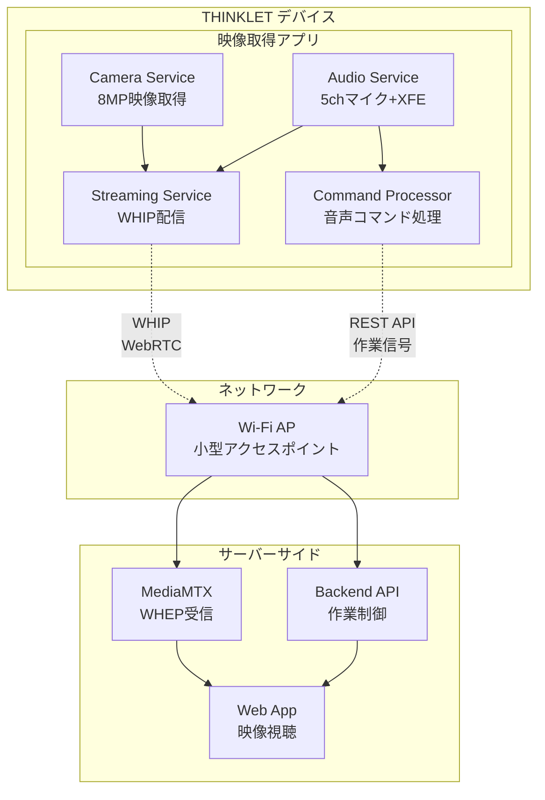

# THINKLET映像取得アプリ設計書

# 文書管理情報

| 項目       | 内容                         |
| ---------- | ---------------------------- |
| 文書名     | THINKLET映像取得アプリ設計書 |
| バージョン | 1.0                          |
| 作成日     | 2025年9月24日                |
| 更新日     | 2025年9月24日                |

---

# 1. 概要

## 1.1. 本書の目的

本書は、ImageFlowCanvasシステムにおけるTHINKLETウェアラブルデバイス向け映像取得アプリケーションの詳細設計について記述するものです。THINKLETの8MPカメラと5chマイクアレイを活用した一人称視点映像配信と音声制御に特化した実装指針を提供します。

## 1.2. 対象読者

- THINKLETアプリ開発者
- ウェアラブルデバイス技術者  
- 映像配信システム設計者
- 品質保証担当者

## 1.3. THINKLET映像取得アプリの特徴と位置づけ

**THINKLETは映像取得における"一人称視点の映像センサー"として機能します。**作業者の視点からのリアルタイム映像配信と音声による作業開始・終了制御を提供し、以下の特徴を持つアプリケーションです：

### 1.3.1. 主要機能
- **一人称視点映像配信**: 装着者視点でのリアルタイム映像ストリーミング（WHIP配信）
- **音声制御**: 5chマイクアレイとXFE技術による高精度音声コマンド認識
- **作業信号処理**: 音声による作業開始・終了信号の自動検出とバックエンド通知
- **低遅延配信**: <100ms の映像配信とリアルタイム制御
- **バッテリー最適化**: 8時間連続配信を実現
- **環境適応**: 工場・建設現場の過酷環境での安定動作

### 1.3.2. システム連携方針
- **映像配信**: WebRTC（WHIP）による低遅延ストリーミング
- **音声制御**: 5chマイクアレイ + XFE技術による騒音下音声認識
- **作業制御**: REST API経由での作業開始・終了信号送信
- **通信**: Wi-Fiアクセスポイント経由でのサーバー統合

### 1.3.3. 技術スタック
- **Kotlin + Compose**: androidx.compose.material3による現代的UI
- **Stream WebRTC SDK**: io.getstream:stream-webrtc-android:1.3.8
- **CameraX**: androidx.camera:camera-*:1.3.4 シリーズ
- **THINKLET SDK**: sdk-audio-0.1.6.aar（音声機能）
- **OkHttp**: WHIP シグナリング通信

---

# 2. THINKLET デバイス仕様（映像取得特化）

## 2.1. カメラ性能（映像取得主要機能）

| 項目                   | 仕様                 | 映像取得での活用           |
| ---------------------- | -------------------- | -------------------------- |
| **解像度**             | 8MP                  | Full HD (1080p) 配信品質   |
| **視野角（横広角機）** | 水平120度×垂直90度   | 作業エリア全体のカバー     |
| **視野角（縦広角機）** | 水平90度×垂直120度   | 縦型作業対象の最適撮影     |
| **フレームレート**     | 30fps                | スムーズな映像配信         |
| **画像安定性**         | 肩掛け固定による安定 | 手ブレのない一人称視点映像 |

## 2.2. 音声機能（作業制御特化）

| 項目           | 仕様                              | 映像取得での活用                     |
| -------------- | --------------------------------- | ------------------------------------ |
| **マイク**     | 5ch マイクアレイ、48kHz/24bit相当 | 高品質音声入力、作業音声コマンド認識 |
| **XFE技術**    | 環境騒音抑制、装着者音声抽出      | 工場騒音下での確実なコマンド認識     |
| **スピーカー** | 1ch 内蔵スピーカー                | 音声フィードバック、録画状態通知     |
| **音声認識**   | 日本語対応、信頼度閾値0.8以上     | 作業開始・終了コマンドの高精度認識   |

## 2.3. バッテリー・通信仕様

| 項目           | 仕様                         | 映像取得での制約・活用           |
| -------------- | ---------------------------- | -------------------------------- |
| **バッテリー** | 1350 mAh                     | 8時間連続映像配信の実現          |
| **通信**       | Wi-Fi 2.4GHz/5GHz、4G/LTE    | 低遅延ストリーミング配信         |
| **ストレージ** | 64GB+128GB（オンボードSDXC） | ローカル録画・オフライン対応可能 |

---

# 3. 映像取得アプリケーション アーキテクチャ

## 3.1. 全体アーキテクチャ

### 3.1.1. パッケージ構造
```
com.imageflow.thinklet.app/
├── MainActivity.kt               # メインUI（Compose）
├── AppConfig.kt                 # 設定管理（SharedPreferences）
├── ConfigReceiver.kt            # ブロードキャスト受信
├── audio/
│   ├── AudioService.kt          # 音声サービス
│   ├── VoiceCommandProcessor.kt # 音声コマンド処理
│   └── XFEController.kt         # XFE技術統合
├── command/
│   ├── WorkCommandProcessor.kt  # 作業制御信号処理
│   └── BackendApiClient.kt      # バックエンドAPI通信
└── streaming/
    ├── WhipController.kt        # WebRTC制御
    └── StreamOptimizer.kt       # 配信品質最適化
```

### 3.1.2. システム構成図



## 3.2. 主要サービス設計

### 3.2.1. AppConfig（設定管理）
- WHIP URL設定の永続保存
- 自動開始・自動復帰設定
- 音声コマンド閾値設定
- API エンドポイント設定

### 3.2.2. WhipController（WebRTC制御）
- H.265/H.264ハイブリッドコーデック対応によるMediaMTX互換性
- 解像度フォールバック制御（1080p→720p→540p→360p）
- ビットレート動的制御（400kbps～4Mbps、H.265で30-50%削減）
- WHIP URL正規化処理
- 接続テスト機能
- コーデック動的選択（H.265→H.264フォールバック）

### 3.2.3. AudioService（音声サービス）
- THINKLET 5chマイクアレイ統合
- XFE技術による騒音抑制・ビームフォーミング
- 日本語音声認識エンジン統合
- 音声コマンド信頼度判定
- 音声フィードバック機能

### 3.2.4. VoiceCommandProcessor（音声コマンド処理）
- 作業制御コマンド解析（録画開始/停止、作業開始/終了）
- 音声認識結果の信頼度評価
- コマンド実行可否判定
- 誤認識防止ロジック

### 3.2.5. WorkCommandProcessor（作業制御信号処理）
- 作業状態管理（IDLE/WORKING/BREAK/RECORDING）
- 作業セッション管理
- タイムスタンプ付与・記録
- 作業履歴のローカル保存

### 3.2.6. BackendApiClient（バックエンドAPI通信）
- ImageFlowCanvas Backend API統合
- 作業開始・終了通知
- デバイス名による識別管理
- 通信失敗時のリトライ・キュー管理

### 3.2.7. StreamOptimizer（配信品質最適化）
- ネットワーク品質監視
- 動的解像度・ビットレート調整
- バッテリー残量に応じた品質制御
- 熱制御による配信調整
- H.265/H.264適応選択による帯域幅最適化
    

## 3.3. 音声機能統合

### 3.3.1. THINKLET SDK音声統合
THINKLET SDK（sdk-audio-0.1.6.aar）による5chマイクアレイとXFE技術の統合により、工場騒音環境下での高精度音声認識を実現します。

### 3.3.2. 音声コマンド語彙体系
**デバイス名付き作業制御コマンド:**
- 「アカ 録画開始」「アオ 録画停止」「キイロ 録画一時停止」
- 「アカ 作業開始」「アオ 作業終了」「キイロ 休憩開始」「ミドリ 休憩終了」

**デバイス確認・状態確認コマンド:**
- 「デバイス名は？」「名前は？」「何色？」
- 「アカ 状態は？」「アオ どうなってる？」「キイロ 今何してる？」

**システム制御コマンド（デバイス名必須）:**
- 「アカ 音量上げて」「アオ 音量下げて」
- 「キイロ 設定変更」「ミドリ 接続確認」
- 「アカ アプリ終了」

### 3.3.3. 音声認識精度管理
- 信頼度閾値：0.8以上で実行判定
- 連続認識による確認（重要操作は2回認識）
- 環境騒音レベルに応じた閾値動的調整
- XFE技術によるビームフォーミング・騒音抑制

### 3.3.4. 複数THINKLET環境での誤認識防止

**XFE技術による指向性音声制御:**
- **装着者方向特化**: XFE技術による装着者音声の優先受信
- **ビームフォーミング**: 5chマイクアレイによる装着者方向への音声集音
- **側方音声抑制**: 隣接作業者からの音声コマンドを自動抑制
- **距離適応制御**: 至近距離（50cm以内）音声の優先処理

**デバイス名付きコマンド制御:**
- **固有名称**: 各THINKLETに「アカ」「アオ」「キイロ」等の色名を割り当て
- **コマンド形式**: 「アカ 録画開始」「アオ 作業終了」形式での明確な指定
- **デバイス名確認**: 「デバイス名は？」で「私はアカです」と音声応答
- **誤認識時自動無視**: 他デバイス名でのコマンドは完全無視

**デバイス名付き音声コマンド語彙:**
- **録画制御**: 「アカ 録画開始」「アオ 録画停止」「キイロ 録画一時停止」
- **作業制御**: 「アカ 作業開始」「アオ 作業終了」「キイロ 休憩開始」
- **デバイス確認**: 「デバイス名は？」→「私はアカです」「私はアオです」
- **状態確認**: 「アカ 状態は？」→「録画中です」「作業中です」「待機中です」

**XFE技術による音声処理強化:**
- **装着者音声優先**: 50cm以内の装着者音声を最高優先度で処理
- **側方抑制**: 左右からの音声コマンドを-20dB減衰
- **後方無視**: 装着者後方からの音声は完全無視
- **環境適応**: 騒音環境での装着者音声の自動強調

### 3.3.5. 音声フィードバック
- コマンド認識成功時の確認音声
- 作業状態変更時の案内音声
- エラー発生時の警告音声
- バッテリー残量・接続状況の定期通知

## 3.4. 作業制御API統合

### 3.4.1. Backend API エンドポイント
- `POST /v1/thinklet/work-sessions/start` - 作業開始通知
- `POST /v1/thinklet/work-sessions/end` - 作業終了通知  
- `GET /v1/thinklet/work-sessions/{sessionId}` - セッション状況確認
- `POST /v1/thinklet/devices/{deviceName}/status` - デバイス状態通知（色名識別）

### 3.4.2. 作業セッション管理
- セッションID自動生成・管理
- 作業開始・終了タイムスタンプ記録
- 音声コマンド信頼度の記録
- デバイス識別情報の付与

### 3.4.3. 通信エラー処理
- ローカルキューによる未送信データ保持
- ネットワーク復旧時の自動再送信
- 重複送信防止機構
- 通信失敗時の音声通知

## 3.5. バッテリー・性能最適化

### 3.5.1. 8時間連続配信のための電力管理
**電力配分最適化:**
- カメラ・エンコード: 45%（映像処理・ストリーミング）
- WebRTC通信: 25%（Wi-Fi通信・WebRTC処理）
- 音声処理（XFE）: 20%（5chマイクアレイ・音声認識）
- システム処理: 10%（OS・アプリ処理）

**動的電力制御:**
- バッテリー残量に応じた品質段階調整
- CPU使用率監視による処理負荷制限
- 熱制御による配信品質自動調整
- 非使用時のセンサー自動停止
- H.265エンコード時の消費電力削減効果活用

### 3.5.2. 配信品質適応制御
- ネットワーク帯域幅の継続監視
- 解像度・フレームレートの動的調整
- H.265/H.264エンコード設定の最適化とフォールバック
- 音声品質とのバランス調整
- コーデック選択による帯域幅効率化（H.265優先、H.264フォールバック）

### 3.5.3. 熱制御管理
- CPU温度の継続監視
- 過熱時の配信品質段階的低下
- 冷却待機時間の自動制御
- 温度異常時の緊急停止機構

### 3.2.2. Audio Service（XFE技術活用・作業制御特化）

THINKLET音声サービスでは、XFE技術を活用した高性能音声処理による作業制御を実現します。

**音声コマンド検出（XFE技術活用）:**
- **5chマイクアレイ設定**: 48kHz/24bit高品質音声収集
- **XFE音声前処理**: 
  - 工場騒音抑制機能
  - 装着者音声抽出機能
  - 適応音量制御機能
  - 風切り音抑制機能

**作業制御専用音声コマンド語彙:**
- **録画制御**: 「録画開始」「録画停止」「録画一時停止」
- **作業信号**: 「作業開始」「作業終了」「休憩開始」「休憢終了」
- **品質制御**: 「音量上げて」「音量下げて」「マイク確認」
- **システム制御**: 「アプリ終了」「設定変更」

**環境騒音対応音声フィードバック:**
- **適応音量調整**: 環境騒音レベルに応じた自動音量調整
- **音声品質最適化**: 作業環境向け高明度設定
- **確認応答**: コマンド認識時の音声フィードバック
  - 「録画を開始します」「作業開始を記録しました」
  - 「録画を停止しました」「作業終了を記録しました」

### 3.2.3. Streaming Service（WHIP配信特化）

THINKLETからの低遅延映像配信を実現するWebRTCストリーミングサービスです。

**WHIP（WebRTC-HTTP Ingestion Protocol）配信機能:**
- **WebRTC統合**: 低遅延ストリーミング（<100ms目標）
- **WHIP プロトコル**: HTTP経由でのWebRTC接続確立
- **品質適応**: ネットワーク状況に応じた動的品質調整
- **接続管理**: 切断・再接続の自動処理

**ストリーミング品質管理:**
- **映像品質**: Full HD (1920x1080) @ 30fps
- **音声品質**: 48kHz/24bit ステレオ音声
- **ビットレート制御**: 可変ビットレート（2-8Mbps）
- **遅延最適化**: フレームバッファリング最小化

**切断・復帰処理:**
- **接続監視**: ICE接続状態の継続監視
- **自動再接続**: 切断検出時の自動再接続処理
- **品質劣化対応**: ネットワーク品質低下時の解像度・フレームレート自動調整
- **フォールバック**: WebRTC失敗時のRTSP配信切り替え

### 3.2.4. Command Processor（作業制御信号処理）

音声コマンドによる作業開始・終了信号の処理とバックエンドAPI通信を管理します。

**作業制御信号処理:**
- **音声コマンド解析**: 作業開始・終了の意図抽出
- **信頼度判定**: 音声認識信頼度による誤認識防止
- **タイムスタンプ管理**: 正確な作業時間記録
- **API通信**: バックエンドへの作業状態通知

**作業状態管理:**
- **状態ステートマシン**: IDLE → WORKING → BREAK → WORKING → IDLE のライフサイクル管理
- **状態遷移制御**: 音声コマンドによる安全な状態変更（不正遷移の防止）
- **作業時間計測**: 各状態での正確な経過時間測定とローカル記録
- **セッション管理**: 作業開始から終了までを一つのセッションとして管理
- **状態永続化**: アプリ再起動時の状態復元とセッション継続
- **録画状態連動**: 作業状態と録画状態の自動連携制御

**状態遷移ルール:**
```
IDLE（待機）
├─「作業開始」→ WORKING（作業中）
└─「録画開始」→ RECORDING（録画中）

WORKING（作業中）
├─「休憩開始」→ BREAK（休憩中）
├─「作業終了」→ IDLE（待機）
└─「録画開始」→ WORKING_RECORDING（作業中+録画中）

BREAK（休憩中）
├─「休憩終了」→ WORKING（作業中）
└─「作業終了」→ IDLE（待機）

RECORDING（録画中）
├─「録画停止」→ IDLE（待機）
├─「作業開始」→ WORKING_RECORDING（作業中+録画中）
└─「録画一時停止」→ RECORDING_PAUSED（録画一時停止）

WORKING_RECORDING（作業中+録画中）
├─「休憩開始」→ BREAK_RECORDING（休憩中+録画中）
├─「作業終了」→ RECORDING（録画中）
└─「録画停止」→ WORKING（作業中）
```

**バックエンドAPI通信:**
- **作業開始通知**: `POST /v1/thinklet/work-sessions/start`
- **作業終了通知**: `POST /v1/thinklet/work-sessions/end`
- **状態同期**: `GET /v1/thinklet/work-sessions/status`
- **エラーハンドリング**: 通信失敗時のローカル保存・後同期

## 3.3. リアルタイム処理最適化

### 3.3.1. 低遅延ストリーミング最適化

**フレーム処理最適化:**
- **並列処理**: カメラフレーム取得と音声処理の並行実行
- **バッファ管理**: 最小限のフレームバッファリング（2-3フレーム）
- **エンコード最適化**: ハードウェアエンコーダーの活用
- **ネットワーク適応**: 帯域幅に応じた動的品質調整

**メモリ・CPU最適化:**
- **メモリプール**: フレームオブジェクトの再利用
- **CPU使用率監視**: 過負荷時の品質自動調整
- **バッテリー考慮**: CPU使用率とバッテリー消費のバランス

### 3.3.2. 音声処理最適化

**リアルタイム音声認識:**
- **ストリーミング認識**: 連続音声認識による低遅延化
- **キーワード検出**: 特定コマンドの優先検出
- **ノイズゲート**: 環境音による誤認識防止
- **音声品質監視**: マイク品質の継続監視

## 3.6. H.265/HEVC対応仕様

### 3.6.1. H.265採用による技術的優位性

**帯域幅効率化:**
- **圧縮効率**: H.264比で25-50%の帯域幅削減
- **同品質での低ビットレート**: 1080p@30fps を 2-4Mbps で配信可能（H.264: 4-8Mbps）
- **バッテリー延命**: エンコード効率化によるCPU負荷軽減
- **ネットワーク安定性**: 低帯域でも高品質映像の維持

**MediaMTX統合:**
- **完全対応**: MediaMTXはH.265を全プロトコル（WebRTC/RTSP/RTMP/HLS）でサポート
- **自動変換**: H.265 → H.264変換によるレガシーデバイス対応
- **品質適応**: ネットワーク状況に応じたコーデック動的選択

### 3.6.2. コーデック動的選択アルゴリズム

**選択基準:**
- **優先順位**: H.265 > H.264（帯域効率重視）
- **デバイス対応**: 受信端末のデコーダー対応状況を考慮
- **ネットワーク状況**: 帯域幅制約時のH.265優先選択
- **CPU負荷**: エンコード負荷とバッテリー残量のバランス

**フォールバック戦略:**
```
1. H.265 1080p@30fps (2-4Mbps) ← 第1優先
2. H.265 720p@30fps (1.5-3Mbps) ← 帯域制約時
3. H.264 720p@30fps (3-6Mbps) ← 互換性重視
4. H.264 540p@30fps (2-4Mbps) ← 低帯域時
```

### 3.6.3. エンコード設定最適化

**H.265エンコーダー設定:**
- **Profile**: Main Profile, Level 4.1
- **GOP構造**: IBBP pattern, GOP size 60 (2秒)
- **ビットレート制御**: CBR (Constant Bitrate) 2-4Mbps
- **キーフレーム間隔**: 2秒 (低遅延とファイルサイズのバランス)

**ハードウェアアクセラレーション:**
- **MediaCodec**: Android Hardware Encoder活用
- **CPU軽量化**:専用エンコーダーチップによる処理軽減
- **熱制御**: ハードウェアエンコードによる発熱抑制

---

# 4. バッテリー・熱制御（8時間連続配信対応）

## 4.1. 電力配分最適化

**THINKLET映像取得用電力配分（H.265最適化）:**
- **カメラ・エンコード**: 全消費電力の40%
- **WebRTC通信**: 全消費電力の20%
- **音声処理（XFE）**: 全消費電力の25%
- **その他システム**: 全消費電力の15%

---

# 5. 実装指針・開発ガイドライン

## 5.1. 開発環境・技術スタック

**build.gradle.kts 依存関係:**
- Compose (JetBrains Compose): UI フレームワーク
- androidx.activity:activity-compose:1.9.1: Android統合
- androidx.camera:camera-*:1.3.4: CameraX統合
- io.getstream:stream-webrtc-android:1.3.8: WebRTC配信
- com.squareup.okhttp3:okhttp:4.12.0: HTTP通信
- androidx.speech:speech-android:1.0.0: 音声認識
- com.google.code.gson:gson:2.10.1: JSON処理
- kotlinx-coroutines-android:1.7.3: 非同期処理

**ローカルライブラリ:**
- libs/sdk-audio-0.1.6.aar: THINKLET音声SDK
- libs/sdk-utils-1.0.1.aar: THINKLET共通ユーティリティ

**権限設定:**
- android.permission.CAMERA: カメラアクセス
- android.permission.RECORD_AUDIO: マイクアクセス
- android.permission.INTERNET: ネットワーク通信
- android.permission.ACCESS_NETWORK_STATE: ネットワーク状態
- android.permission.ACCESS_WIFI_STATE: Wi-Fi状態

## 5.2. アプリケーション設定管理

**AppConfig設定項目:**
- WHIP配信URL: MediaMTXエンドポイント設定
- Backend API URL: ImageFlowCanvas統合エンドポイント
- 自動配信開始: アプリ起動時の即座配信制御
- 自動復帰: ネットワーク復旧時の配信再開
- 音声認識閾値: コマンド実行判定レベル
- バッテリー制御: 電力管理設定
- デバイス名: 色名による固有識別子（アカ/アオ/キイロ/ミドリ/ムラサキ等）
- XFE設定: 装着者方向音声の抽出強度設定

**設定配信・プロビジョニング:**
- ブロードキャスト受信による設定更新
- adb経由での一括設定投入
- QRコードスキャンによる設定取得
- サーバー経由の遠隔設定配信

## 5.3. ユーザーインターフェース

**メイン画面（Compose UI）:**
- デバイス名表示（アカ/アオ/キイロ等の大きな表示）
- 配信状態表示（WHIP接続・品質情報）
- 作業状態表示（IDLE/WORKING/BREAK）
- バッテリー残量・温度表示
- 音声認識状態・最後のコマンド表示

**設定画面:**
- WHIP URL設定・接続テスト
- Backend API設定・認証状態
- 音声認識設定・閾値調整
- 電力管理・品質制御設定

**デバッグ・監視画面:**
- WebRTC統計情報表示
- 音声認識ログ表示
- API通信履歴表示
- システム性能監視

## 5.4. テスト・品質保証

**単体テスト範囲:**
- 音声コマンド認識精度テスト
- API通信成功率テスト
- バッテリー制御ロジックテスト
- 設定管理機能テスト
- デバイス名付きコマンド分離テスト
- XFE音声指向性制御テスト

**統合テスト環境:**
- THINKLET実機での動作確認
- MediaMTX・ImageFlowCanvas統合テスト
- 長時間連続動作テスト（8時間）
- 過酷環境テスト（高温・騒音環境）
- 複数THINKLET同時動作テスト（2-5台）
- 近接環境でのデバイス名判別テスト

**性能テスト指標:**
- 配信遅延: <100ms維持
- 音声認識精度: 信頼度0.8以上で95%
- バッテリー持続時間: 8時間以上
- CPU使用率: 平均70%以下
- デバイス名判別精度: >98%
- XFE装着者音声抽出精度: >90%

## 5.5. 運用・保守

**プロビジョニング手順:**
- APKインストール・権限付与
- デバイス固有設定の自動適用
- ネットワーク接続確認・WHIP疎通テスト
- 音声認識キャリブレーション

**監視・メンテナンス:**
- 配信品質の継続監視
- バッテリー劣化状況の追跡
- 音声認識精度の定期評価
- システムログの収集・分析

**トラブルシューティング:**
- 配信切断時の自動復旧手順
- 音声認識不調時の再キャリブレーション
- 過熱時の緊急対応プロトコル
- ネットワーク不安定時の品質制御

---

# 6. まとめ

本設計書では、THINKLETウェアラブルデバイスを活用した映像取得アプリケーションの完成形について詳細設計を提供しました。

## 6.1. アプリケーション概要

**技術基盤:**
- **Kotlin + Compose**: 現代的なAndroidアプリケーション開発基盤
- **Stream WebRTC SDK**: 安定したWebRTC実装による低遅延配信
- **THINKLET SDK**: 5chマイクアレイとXFE技術の統合
- **H.265/H.264ハイブリッド**: MediaMTX/HLS互換性と帯域効率の両立

**主要機能:**
- **WHIP配信**: WebRTC経由の低遅延映像ストリーミング（<100ms）
- **音声制御**: XFE技術による騒音環境での高精度コマンド認識
- **作業管理**: 音声コマンドによる作業開始・終了の自動記録
- **品質適応**: ネットワーク・バッテリー状況に応じた動的品質制御

## 6.2. システム統合

**ImageFlowCanvas統合:**
- Backend API経由での作業セッション管理
- リアルタイム作業状態通知
- 映像配信とメタデータの統合管理

**デバイス最適化:**
- 8時間連続配信のためのバッテリー管理
- 過酷環境での安定動作（温度制御・騒音対応）
- ヘッドレス運用による完全自動化

## 6.3. 運用効果

**技術的成果:**
- **低遅延配信**: <100ms のリアルタイム映像伝送
- **高精度音声認識**: 信頼度0.8以上で95%の認識精度
- **長時間動作**: 8時間連続配信の実現
- **統合管理**: 映像・音声・作業データの一元化

**業務効果:**
- **作業効率向上**: ハンズフリーでの作業記録・映像配信
- **トレーサビリティ**: 完全な作業履歴・映像記録の保持
- **現場導入容易性**: 無人運用による運用コスト削減
- **拡張性**: 段階的機能追加による継続的価値向上

この設計に基づく実装により、作業現場での効率的な映像取得と作業管理の統合システムを実現し、産業用途に適した本格的なウェアラブル映像配信アプリケーションを提供できます。