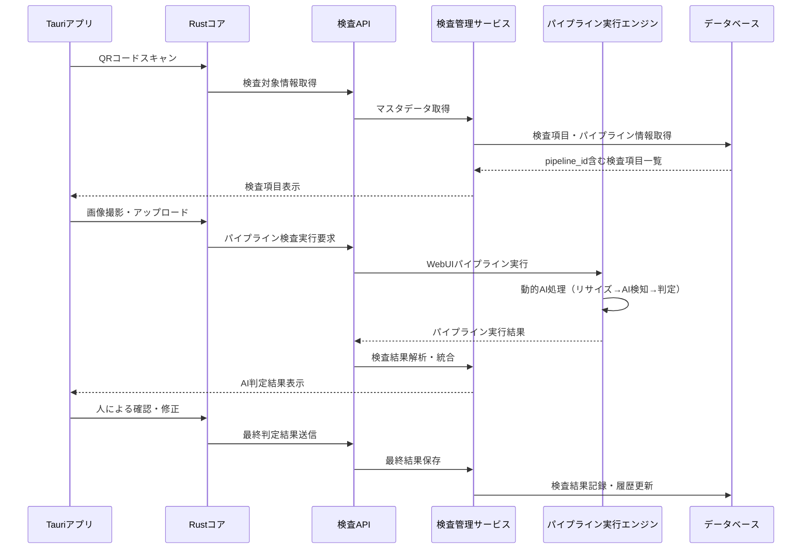
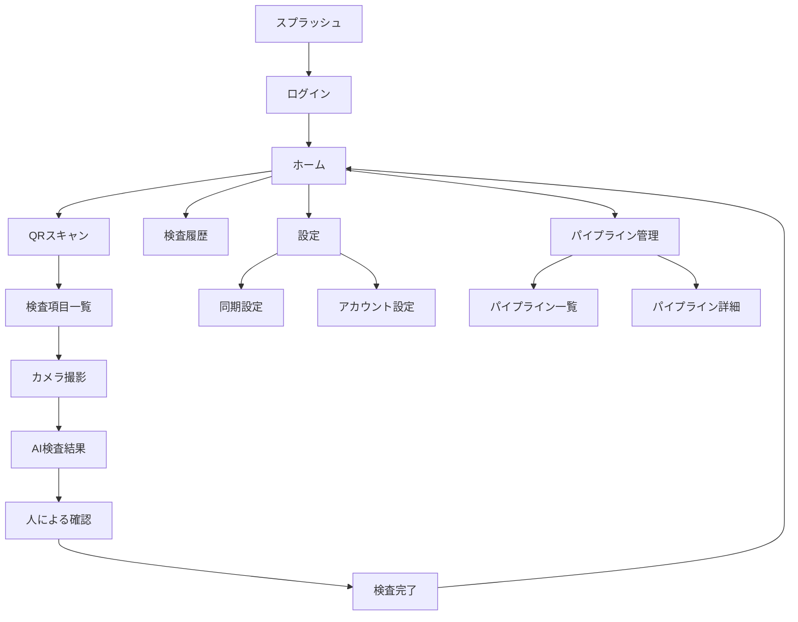

# Tauriクロスプラットフォームアプリ設計書

## **文書管理情報**

| 項目       | 内容                                    |
| ---------- | --------------------------------------- |
| 文書名     | Tauriクロスプラットフォームアプリ設計書 |
| バージョン | 1.0                                     |
| 作成日     | 2025年7月26日                           |
| 更新日     | 2025年7月26日                           |

---

## **1. 概要**

本書では、ImageFlowCanvasシステムの検査機能で使用するTauriベースのクロスプラットフォームアプリケーションの総合設計について記述する。このアプリは現場作業者が直感的に検査業務を実行できるよう設計され、モバイル・デスクトップ・タブレットで統一されたUXを提供し、WebUIで定義されたパイプラインを活用した検査機能を実現する。オフライン対応や堅牢性を重視し、製造業の現場環境に最適化されている。

- **HTTP/2活用**: 並列通信による高速化
- **データ圧縮**: gzip/brotli圧縮による転送量削減
- **CDN活用**: 静的リソースの高速配信
- **キャッシュ戦略**: 適切なキャッシュヘッダー設定
- **プリフェッチ**: 予測的なデータ読み込み

## **2. アプリケーション要件**

### **2.1. 機能要件**

- QRコード/バーコードスキャン
- カメラによる高品質画像撮影
- 検査項目表示・進捗管理
- **WebUIで定義されたパイプラインを使用したAI検査実行**
- **パイプライン実行結果の表示・確認**
- 人による検査結果入力・修正
- オフライン動作・自動同期
- 多言語対応（日本語・英語）
- **クロスプラットフォーム対応（iOS/Android/Windows/macOS/Linux）**
- リアルタイム進捗監視・通知
- 検査履歴管理・エクスポート

### **2.2. 技術要件**

- **プラットフォーム**: iOS 12.0+, Android 8.0+ (API Level 24+), Windows 10+, macOS 10.15+, Ubuntu 18.04+
- **開発フレームワーク**: Tauri (Rust + Web Frontend)
- **Frontend**: React + TypeScript + Material UI
- **Backend**: Rust (Tauri Core)
- **データベース**: SQLite (ローカル)
- **通信**: REST API, WebSocket, gRPC
- **認証**: JWT Token, Platform Biometric
- **画像処理**: 高品質撮影・圧縮・検証
- **同期**: オフライン対応・競合解決

### **2.3. 非機能要件**

- **パフォーマンス**: 起動時間3秒以内、AI検査結果表示1秒以内
- **可用性**: オフライン環境での完全動作
- **拡張性**: パイプライン追加・修正への対応
- **保守性**: モジュール化・テスト自動化
- **セキュリティ**: データ暗号化・認証強化
- **ユーザビリティ**: 直感的操作・多言語対応

## **3. Tauriアーキテクチャ概要**

## **4. Tauriアーキテクチャ設計**

### **4.1. 技術スタック構成**

```
┌─────────────────────────────────────────────────────────┐
│                    Frontend Layer                       │
│  React + TypeScript + Material UI                      │
│  • 検査UI画面                                           │
│  • パイプライン実行結果表示                              │
│  • リアルタイム進捗監視                                 │
└─────────────────────────────────────────────────────────┘
┌─────────────────────────────────────────────────────────┐
│                    Tauri Bridge                         │
│  JavaScript ⟷ Rust IPC Commands                       │
│  • invoke() - 非同期コマンド実行                         │
│  • listen() - イベント監視                              │
│  • emit() - イベント送信                                │
└─────────────────────────────────────────────────────────┘
┌─────────────────────────────────────────────────────────┐
│                  Rust Backend Core                     │
│  • 検査ロジック実装                                     │
│  • パイプライン統合処理                                 │
│  • デバイス固有機能（カメラ、ファイル、ネットワーク）     │
│  • SQLite ローカルデータベース                          │
└─────────────────────────────────────────────────────────┘
┌─────────────────────────────────────────────────────────┐
│                Platform Native Layer                    │
│  iOS/Android/Windows/macOS/Linux                       │
│  • OS固有API呼び出し                                    │
│  • ハードウェアアクセス                                 │
│  • ファイルシステム操作                                 │
└─────────────────────────────────────────────────────────┘
```

### **4.2. アプリケーション構成**

```
┌─────────────────────────────────────────────────────────┐
│                    Frontend Layer (Web)                │
├─────────────────────────────────────────────────────────┤
│  React Components │ State Management │ UI Library      │
└─────────────────────────────────────────────────────────┘
┌─────────────────────────────────────────────────────────┐
│                    Tauri Bridge Layer                   │
├─────────────────────────────────────────────────────────┤
│  IPC Commands │ Events │ Plugins │ Platform APIs       │
└─────────────────────────────────────────────────────────┘
┌─────────────────────────────────────────────────────────┐
│                 Rust Backend (Tauri Core)              │
├─────────────────────────────────────────────────────────┤
│  Business Logic │ API Client │ Local Storage │ Camera  │
└─────────────────────────────────────────────────────────┘
┌─────────────────────────────────────────────────────────┐
│                   Platform Layer                        │
├─────────────────────────────────────────────────────────┤
│  OS APIs │ File System │ Network │ Hardware           │
└─────────────────────────────────────────────────────────┘
```

### **4.3. クロスプラットフォーム対応**

| プラットフォーム | 対応バージョン               | 特記事項                      |
| ---------------- | ---------------------------- | ----------------------------- |
| **iOS**          | 12.0+                        | App Store配布、TestFlight対応 |
| **Android**      | API Level 24+ (Android 7.0+) | Google Play配布、APK配布対応  |
| **Windows**      | Windows 10+                  | MSI/EXEインストーラー         |
| **macOS**        | 10.15+                       | App Store/DMG配布             |
| **Linux**        | Ubuntu 18.04+, CentOS 8+     | AppImage/DEB/RPMパッケージ    |

### **2.2. クロスプラットフォーム対応**

| プラットフォーム | 対応バージョン               | 特記事項                      |
| ---------------- | ---------------------------- | ----------------------------- |
| **iOS**          | 12.0+                        | App Store配布、TestFlight対応 |
| **Android**      | API Level 24+ (Android 7.0+) | Google Play配布、APK配布対応  |
| **Windows**      | Windows 10+                  | MSI/EXEインストーラー         |
| **macOS**        | 10.15+                       | App Store/DMG配布             |
| **Linux**        | Ubuntu 18.04+, CentOS 8+     | AppImage/DEB/RPMパッケージ    |

## **5. 検査機能詳細設計**

### **5.1. 検査システム全体構成**

#### **5.1.1. システムアーキテクチャ**

```
┌─────────────────┐    ┌─────────────────┐    ┌─────────────────┐
│  Tauriアプリ     │◄───┤   検査API Gateway  │◄───┤   検査管理サービス  │
│ (全プラットフォーム)│    │    (REST/gRPC)   │    │   (Inspection     │
└─────────────────┘    └─────────────────┘    │    Management)    │
                                              └─────────────────┘
                                                        │
                       ┌─────────────────┐              │
                       │WebUIパイプライン │◄─────────────┤
                       │   実行エンジン    │              │
                       └─────────────────┘              │
                                                        │
                       ┌─────────────────┐              │
                       │   データベース    │◄─────────────┘
                       │   (PostgreSQL)  │
                       └─────────────────┘
```

#### **5.1.2. 主要コンポーネント**

- **検査管理サービス**: 検査マスタ管理、検査フロー制御、結果管理
- **WebUIパイプライン実行エンジン**: 動的AI処理、画像解析、判定レポート生成
- **検査API Gateway**: API統合、認証・認可、レート制限
- **Tauriアプリ**: クロスプラットフォーム現場検査UI、オフライン対応

### **5.2. 検査マスタ管理**

#### **5.2.1. データ構造**

- **検査対象マスタ**: 製品情報、バージョン管理、検査項目関連付け
- **検査項目マスタ**: 項目詳細、パイプライン設定、判定基準、実行順序
- **検査基準マスタ**: OK/NG判定基準、数値範囲、許容誤差、単位情報
- **パイプライン設定**: WebUIで定義されたパイプラインとの関連付け

#### **5.2.2. API機能**

- **検査対象CRUD**: 新規登録、詳細取得、更新、削除
- **検査項目管理**: 項目一覧取得、パイプライン関連付け、基準設定
- **バルク操作**: 複数項目の一括登録・更新
- **バージョン管理**: 検査仕様の履歴管理・ロールバック

### **5.3. WebUIパイプライン統合AI検査エンジン**

#### **5.3.1. 統合検査フロー**

1. **パイプライン取得**: WebUIで定義されたパイプライン設定の動的取得
2. **実行パラメータ設定**: 検査項目固有のパラメータ適用
3. **画像前処理**: 品質検証、フォーマット変換、メタデータ抽出
4. **パイプライン実行**: 動的AI処理（リサイズ→AI検知→判定）の実行
5. **結果解析**: パイプライン出力の検査基準との照合・判定
6. **統合レポート**: AI結果と検査分析の統合レポート生成

#### **5.3.2. パイプライン結果解析**

- **AI検出結果解析**: 検出信頼度、欠陥分類、位置情報の検査基準照合
- **寸法測定解析**: 測定値の許容範囲チェック、精度評価
- **色彩解析**: 色差計算、色合い判定、許容範囲評価
- **総合判定**: 各ステップ結果の統合評価、最終OK/NG判定

#### **5.3.3. 検査実行監視**

- **リアルタイム進捗**: パイプライン実行状況の逐次更新
- **エラー処理**: 実行失敗時の自動リトライ・エラー詳細記録
- **タイムアウト管理**: 長時間実行時の適切な処理中断
- **リソース監視**: CPU・メモリ使用量の監視・最適化

### **5.4. 検査実行フロー設計**

#### **5.4.1. ワークフロー概要**



#### **5.4.2. 検査状態管理**

- **PENDING**: 検査待ち状態
- **IN_PROGRESS**: 検査実行中
- **AI_COMPLETED**: AI検査完了・人による確認待ち
- **HUMAN_REVIEW**: 人による確認中
- **COMPLETED**: 検査完了
- **FAILED**: 検査失敗
- **CANCELLED**: 検査キャンセル

#### **5.4.3. 進捗管理**

- **項目単位進捗**: 個別検査項目の実行状況
- **全体進捗**: 検査対象全体の完了率
- **時間管理**: 各フェーズの所要時間記録
- **品質指標**: AI信頼度、人による修正率の追跡

### **5.5. オフライン対応・データ同期**

#### **5.5.1. オフライン検査機能**

- **ローカルマスタ**: 検査項目・基準のローカルキャッシュ
- **オフライン撮影**: ネットワーク切断時の画像保存
- **結果キューイング**: オフライン時の検査結果一時保存
- **同期復旧**: 接続復旧時の自動データアップロード

#### **5.5.2. 同期戦略**

- **双方向同期**: サーバー⇔Tauriアプリ間完全同期
- **差分同期**: 変更分のみ転送でトラフィック削減
- **競合解決**: タイムスタンプベース自動解決
- **優先度制御**: 緊急データの優先処理
- **整合性確保**: データ不整合の自動検出・修復

#### **5.5.3. 同期品質管理**

- **データ検証**: 同期データの整合性チェック
- **エラーハンドリング**: 同期失敗時の適切な処理
- **リトライ機構**: ネットワーク障害時の自動復旧
- **ログ記録**: 同期履歴・エラーの詳細記録

## **6. UI/UX設計**

### **6.1. 画面遷移図**



### **6.2. 主要画面詳細設計**

#### **5.2.1. ホーム画面**
- **概要**: 検査業務の開始点となるダッシュボード画面
- **機能**: 
  - 新規検査開始ボタン
  - 検査進捗状況表示
  - 同期ステータス確認
  - 通知・アラート表示
  - クイックアクセスメニュー

#### **5.2.2. QRスキャン画面**
- **概要**: 検査対象を特定するためのスキャン画面
- **機能**:
  - リアルタイムQRコード検出
  - スキャンフレーム・ガイドライン表示
  - 手動入力オプション
  - フラッシュライト制御
  - スキャン履歴確認

#### **5.2.3. 検査項目一覧画面**
- **概要**: 検査対象の項目リストと進捗管理
- **機能**:
  - 検査項目リスト表示
  - 進捗状況可視化
  - 項目別詳細情報
  - 検査順序カスタマイズ
  - 一括操作機能

#### **5.2.4. カメラ撮影画面**
- **概要**: 高品質な検査画像撮影
- **機能**:
  - プレビュー・撮影機能
  - 撮影ガイドライン表示
  - 画質調整・フラッシュ制御
  - 画像品質自動検証
  - 再撮影・確認機能

#### **5.2.5. AI検査結果画面**
- **概要**: パイプライン実行結果の表示・確認
- **機能**:
  - AI判定結果詳細表示
  - パイプライン実行ステップ確認
  - 検出問題のハイライト表示
  - 信頼度・処理時間情報
  - 詳細ログ・メタデータ確認

#### **5.2.6. 人による確認画面**
- **概要**: AI結果の検証・最終判定入力
- **機能**:
  - AI判定との比較表示
  - 判定選択（OK/NG/保留）
  - コメント・注釈入力
  - 判定根拠の記録
  - 最終結果確定

#### **5.2.7. 検査履歴画面**
- **概要**: 過去の検査結果閲覧・管理
- **機能**:
  - 検査結果一覧表示
  - 詳細検索・フィルタリング
  - 結果エクスポート機能
  - 統計情報・傾向分析
  - レポート生成

## **7. データ管理設計**

### **7.1. ローカルデータベース設計**

#### **7.1.1. 主要テーブル構成**

- **inspection_targets**: 検査対象マスター情報
- **inspection_items**: 検査項目詳細（pipeline_id含む）
- **inspection_executions**: 検査実行情報
- **inspection_results**: 検査結果（AI結果+人による判定）
- **tauri_sync_queue**: Tauri専用同期キュー
- **pipeline_cache**: パイプライン定義キャッシュ
- **image_metadata**: 画像メタデータ管理

#### **7.1.2. データアクセス戦略**

- **ORM風アクセス**: 型安全なデータアクセス層
- **トランザクション管理**: 一貫性保証
- **インデックス最適化**: 高速検索・集計
- **データ圧縮**: ストレージ効率化
- **暗号化**: 機密データ保護

### **7.2. 同期機能設計**

#### **7.2.1. 同期戦略**

- **双方向同期**: サーバー⇔Tauriアプリ間での完全同期
- **差分同期**: 変更分のみ転送でトラフィック削減
- **競合解決**: タイムスタンプベース＋手動解決オプション
- **優先度制御**: 緊急データの優先処理
- **リトライ機構**: ネットワーク障害時の自動復旧

#### **7.2.2. オフライン対応**

- **完全オフライン動作**: ネットワーク接続なしでの全機能利用
- **自動同期開始**: 接続復旧時の自動データ同期
- **同期状況可視化**: ユーザーへの明確な状況表示
- **データ整合性確保**: オフライン期間中の一貫性維持
- **ストレージ管理**: 効率的なローカルデータ管理

## **8. セキュリティ設計**

### **8.1. 認証・認可**

#### **8.1.1. 認証機能**

- **生体認証統合**: iOS Face ID/Touch ID、Android指紋認証
- **JWT トークン管理**: 安全なトークン保存・更新
- **多要素認証**: セキュリティレベルに応じた認証強化
- **セッション管理**: 適切なタイムアウト・自動ログアウト
- **認証キャッシュ**: オフライン時の認証継続

#### **8.1.2. データ保護**

- **エンドツーエンド暗号化**: 通信データの完全保護
- **ローカルデータ暗号化**: SQLiteデータベースの暗号化
- **画像データ保護**: 撮影画像の暗号化保存
- **キー管理**: プラットフォーム標準キーストア活用
- **セキュアストレージ**: 機密情報の安全な保存

### **8.2. プライバシー保護**

- **データ最小化**: 必要最小限のデータ収集
- **ローカル処理優先**: プライバシー情報のローカル処理
- **データ保持期間**: 適切なデータ削除ポリシー
- **匿名化**: 個人識別情報の適切な匿名化
- **監査ログ**: アクセス履歴の記録・監視

## **9. 検査システム性能要件**

### **9.1. AI検査性能**

#### **9.1.1. 検査処理性能**

- **画像解析時間**: 1枚あたり5秒以内（WebUIパイプライン実行含む）
- **同時検査数**: 最大50件の並列処理
- **AI判定精度**: 95%以上の判定精度維持
- **レスポンス時間**: API応答2秒以内
- **パイプライン実行時間**: 複雑なパイプラインでも10秒以内完了

#### **9.1.2. データ処理性能**

- **画像ファイル**: 最大20MBの高解像度画像対応
- **データベース応答**: 100ms以内のクエリ応答
- **同期処理**: オフライン復旧時30秒以内の完全同期
- **バッチ処理**: 大量検査結果の効率的一括処理

#### **9.1.3. モバイル性能**

- **アプリ起動**: 3秒以内の高速起動
- **画面遷移**: 1秒以内のスムーズな画面切り替え
- **バッテリー効率**: 8時間連続使用可能な電力効率
- **ストレージ効率**: 端末容量の効率的活用

### **9.2. 検査システムセキュリティ要件**

#### **9.2.1. データ保護強化**

- **検査画像暗号化**: 撮影画像の強制暗号化保存
- **結果データ保護**: 検査結果の改ざん防止・デジタル署名
- **通信暗号化**: エンドツーエンド暗号化による通信保護
- **ローカル暗号化**: SQLiteデータベースの透明暗号化
- **キー管理**: プラットフォーム標準キーストアの活用

#### **9.2.2. アクセス制御・監査**

- **役割ベースアクセス**: 検査員・監督者・管理者の権限分離
- **生体認証**: 顔認証・指紋認証による本人確認
- **操作ログ**: 全検査操作の詳細ログ記録
- **監査証跡**: 改ざん不可能な監査ログ生成
- **セッション管理**: 適切なタイムアウト・自動ログアウト

#### **9.2.3. 品質データ保護**

- **データ完全性**: 検査データの完全性検証
- **バックアップ暗号化**: 暗号化された自動バックアップ
- **削除ポリシー**: 適切なデータ保持期間・削除処理
- **匿名化処理**: 個人識別情報の適切な匿名化
- **コンプライアンス**: 製造業規制・品質基準への準拠

## **10. パフォーマンス最適化**

### **10.1. アプリケーション最適化**

#### **10.1.1. 起動時間最適化**

- **遅延初期化**: 必要な機能の段階的読み込み
- **キャッシュ活用**: 頻繁に使用するデータの事前キャッシュ
- **バックグラウンド処理**: UI描画と重い処理の分離
- **リソース最適化**: 不要なリソース読み込みの回避

#### **10.1.2. 画像処理最適化**

- **画像圧縮**: 品質を保ちつつファイルサイズ削減
- **サムネイル生成**: 一覧表示用の高速サムネイル
- **フォーマット最適化**: 用途に応じた最適フォーマット選択
- **メモリ管理**: 大容量画像の効率的メモリ利用

### **10.2. ネットワーク最適化**

- **HTTP/2活用**: 並列通信による高速化
- **データ圧縮**: gzip/brotli圧縮による転送量削減
- **CDN活用**: 静的リソースの高速配信
- **キャッシュ戦略**: 適切なキャッシュヘッダー設定
- **プリフェッチ**: 予測的なデータ読み込み

## **11. テスト設計**

### **11.1. テスト戦略**

#### **11.1.1. ユニットテスト**

- **Rustコア機能**: ビジネスロジック・データアクセス層
- **TypeScript/React**: フロントエンドコンポーネント・サービス
- **カバレッジ目標**: 80%以上のコードカバレッジ
- **自動化**: CI/CDパイプラインでの自動実行

#### **11.1.2. 統合テスト**

- **API統合**: サーバーAPIとの連携テスト
- **データベース**: SQLite操作・同期機能テスト
- **パイプライン統合**: WebUIパイプライン実行テスト
- **クロスプラットフォーム**: 各OS固有機能のテスト
- **検査フロー統合**: QRスキャン→撮影→AI検査→人確認の全フロー
- **オフライン同期**: ネットワーク断・復旧時の動作検証
- **マルチデバイス**: 複数デバイス間でのデータ整合性確認
- **プラットフォーム**: iOS/Android/Desktop間の機能互換性

#### **11.1.3. E2Eテスト**

- **ユーザーシナリオ**: 実際の検査業務フローテスト
- **クロスプラットフォーム**: 各プラットフォームでの動作検証
- **パフォーマンス**: レスポンス時間・メモリ使用量測定
- **セキュリティ**: 認証・データ保護機能の検証

#### **11.1.4. AI検査テスト**

- **パイプライン実行テスト**: WebUIパイプラインの正常実行検証
- **精度回帰テスト**: AI判定精度の継続的検証
- **エッジケーステスト**: 異常画像・境界条件での動作確認
- **性能テスト**: 大量画像処理・並列実行の負荷テスト
  

### **11.3. テスト自動化**

#### **11.3.1. 継続的テスト**

- **CI/CDパイプライン**: コード変更時の自動テスト実行
- **夜間テスト**: 大規模データセットでの包括的テスト
- **デバイスファーム**: 実機での自動テスト実行
- **クラウドテスト**: スケーラブルなテスト環境での検証

#### **11.3.2. テストデータ管理**

- **検査画像データセット**: 多様な検査対象・条件の画像収集
- **期待値データベース**: 各テストケースの期待結果管理
- **マスターデータ**: テスト用検査マスタ・設定データ
- **プライバシー保護**: テストデータの匿名化・セキュリティ確保


## **12. ビルド・配布設計**

### **12.1. ビルド設定**

#### **12.1.1. Tauri設定**

- **基本設定**: プロダクト名、バージョン、識別子
- **権限設定**: カメラ、ファイルシステム、ネットワーク権限
- **セキュリティ設定**: CSP（Content Security Policy）、allowlist
- **更新機能**: 自動更新サーバー設定、公開鍵管理
- **ウィンドウ設定**: サイズ、リサイズ可否、最小サイズ

#### **12.1.2. 依存関係管理**

- **Rustクレート**: Tauri、SQLite、HTTP クライアント、暗号化
- **Node.js パッケージ**: React、TypeScript、Material UI、テスト
- **ネイティブ依存**: プラットフォーム固有ライブラリ
- **バージョン固定**: 安定したビルドのための依存バージョン管理

### **12.2. 配布戦略**

#### **12.2.1. プラットフォーム別配布**

| プラットフォーム | 配布方法           | パッケージ形式        | 配布チャネル          |
| ---------------- | ------------------ | --------------------- | --------------------- |
| **iOS**          | App Store配布      | .ipa                  | App Store、TestFlight |
| **Android**      | Store/Direct配布   | .apk, .aab            | Google Play、直接配布 |
| **Windows**      | インストーラー配布 | .msi, .exe            | Microsoft Store、Web  |
| **macOS**        | Store/DMG配布      | .dmg, .app            | Mac App Store、Web    |
| **Linux**        | パッケージ配布     | .deb, .rpm, .AppImage | リポジトリ、Web       |

#### **12.2.2. CI/CD パイプライン**

- **自動ビルド**: プラットフォーム別並列ビルド
- **自動テスト**: ユニット・統合・E2Eテスト実行
- **コード品質**: 静的解析・セキュリティスキャン
- **自動配布**: テスト成功後の自動リリース
- **バージョン管理**: セマンティックバージョニング

### **12.3. 運用監視設計**

#### **12.3.1. アプリケーション監視**

- **クラッシュレポート**: 自動クラッシュ検出・レポート
- **パフォーマンス監視**: レスポンス時間・メモリ使用量
- **ユーザー分析**: 機能使用状況・ユーザー行動
- **エラー追跡**: カスタムエラー・例外の追跡
- **ビジネス指標**: 検査実行数・成功率・効率性

#### **12.3.2. 運用サポート**

- **ログ管理**: 構造化ログ・レベル別管理
- **トラブルシューティング**: 問題診断・解決ガイド
- **アップデート管理**: 段階的ロールアウト・ロールバック
- **ユーザーサポート**: FAQ・ヘルプドキュメント
- **フィードバック収集**: ユーザー意見・改善要望の収集

## **13. 将来拡張計画**

### **13.1. 高度AI機能拡張**

#### **13.1.1. 3D・動画検査**

- **3D形状検査**: 立体形状の自動測定・欠陥検出
- **動画解析**: 連続画像・動画による動的検査
- **時系列分析**: 製造工程の時系列データ解析
- **予測保全**: 劣化予測・保全時期の自動判定

#### **13.1.2. 機械学習強化**

- **自動学習**: 検査結果からの自動パイプライン改善
- **転移学習**: 既存モデルの新製品への適用
- **強化学習**: 検査効率の継続的最適化
- **説明可能AI**: AI判定根拠の可視化・解釈

### **13.2. システム連携拡張**

#### **13.2.1. エンタープライズ統合**

- **ERP/MESシステム連携**: 生産管理システムとの完全統合
- **IoTセンサー連携**: 環境センサー・設備データとの連携
- **ブロックチェーン**: 品質証明の改ざん防止・トレーサビリティ
- **サプライチェーン**: 上下流企業との品質情報共有

#### **13.2.2. 新技術対応**

- **AR/VR検査支援**: 拡張現実・仮想現実による検査ガイド
- **5G活用**: 高速通信による大容量データ処理
- **エッジコンピューティング**: 現場でのリアルタイムAI処理
- **デジタルツイン**: 実機と仮想モデルの連携検査

### **13.3. 分析機能強化**

#### **13.3.1. 高度分析**

- **リアルタイム品質ダッシュボード**: 製造ライン全体の品質可視化
- **予測分析**: 品質問題の事前予測・早期警告
- **異常検知**: 通常パターンからの逸脱自動検出
- **品質トレンド**: 長期品質傾向の統計分析

#### **13.3.2. 自動化推進**

- **自動レポート生成**: 検査結果の自動文書化
- **自動改善提案**: AIによる工程改善提案
- **自動設定調整**: 検査条件の動的最適化
- **自動品質保証**: 人手を介さない品質管理

## **14. まとめ**

### **14.1. 達成される価値**

本設計により、以下が実現されます：

1. **統一されたクロスプラットフォーム体験**: モバイル・デスクトップ・タブレットで一貫したUX
2. **WebUIパイプライン統合**: 管理画面で定義されたパイプラインを検査で活用
3. **包括的検査システム**: AI検査と人による確認を組み合わせた高品質検査
4. **高性能な処理**: Rustバックエンドによる高速で安全な処理
5. **柔軟な配布**: 各プラットフォームの標準的な配布チャネルに対応
6. **統合された開発体験**: 単一のコードベースでマルチプラットフォーム対応
7. **リアルタイム機能**: 進捗監視や同期機能の統合実装
8. **オフライン対応**: ネットワーク環境に依存しない安定動作

### **14.2. 技術的優位性**

- **Tauriの採用**: 軽量・高速・セキュアなクロスプラットフォーム開発
- **Rust + Web技術**: 安全性と開発効率の両立
- **パイプライン統合**: WebUIとの密な連携による柔軟なAI処理
- **検査業務特化**: 製造現場のニーズに特化した機能設計
- **包括的なテスト**: 品質と信頼性の確保
- **拡張性**: 将来的な高度機能・連携への対応

### **14.3. 期待される効果**

- **作業効率向上**: 直感的なUI・高速処理による検査業務の効率化
- **品質向上**: AI + 人による二重チェックによる検査精度向上
- **コスト削減**: クロスプラットフォーム対応による開発・保守コスト削減
- **拡張性確保**: パイプライン統合による将来的な機能拡張対応
- **運用負荷軽減**: 自動同期・監視機能による運用業務の軽減
- **現場業務改善**: オフライン対応・使いやすいUIによる現場作業の改善

この設計により、現場での検査業務とWebUIでのパイプライン管理がシームレスに統合された、製造業の品質管理に特化したスケーラブルで保守性の高いシステムが構築されます。
- **Rust + Web技術**: 安全性と開発効率の両立
- **パイプライン統合**: WebUIとの密な連携による柔軟なAI処理
- **オフライン対応**: ネットワーク環境に依存しない安定動作
- **包括的なテスト**: 品質と信頼性の確保

この設計により、現場での検査業務とWebUIでのパイプライン管理がシームレスに統合された、スケーラブルで保守性の高いシステムが構築されます。
