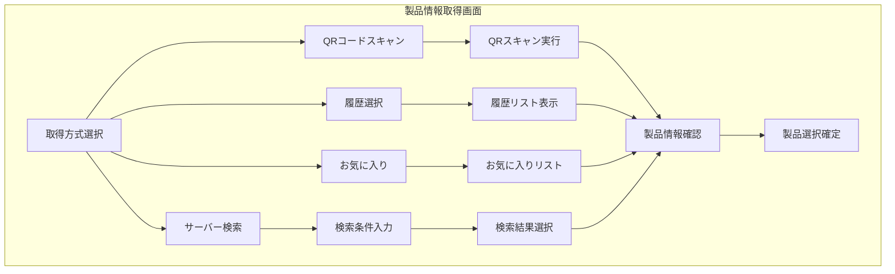
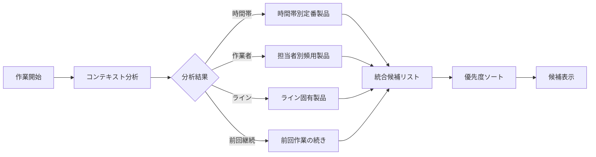
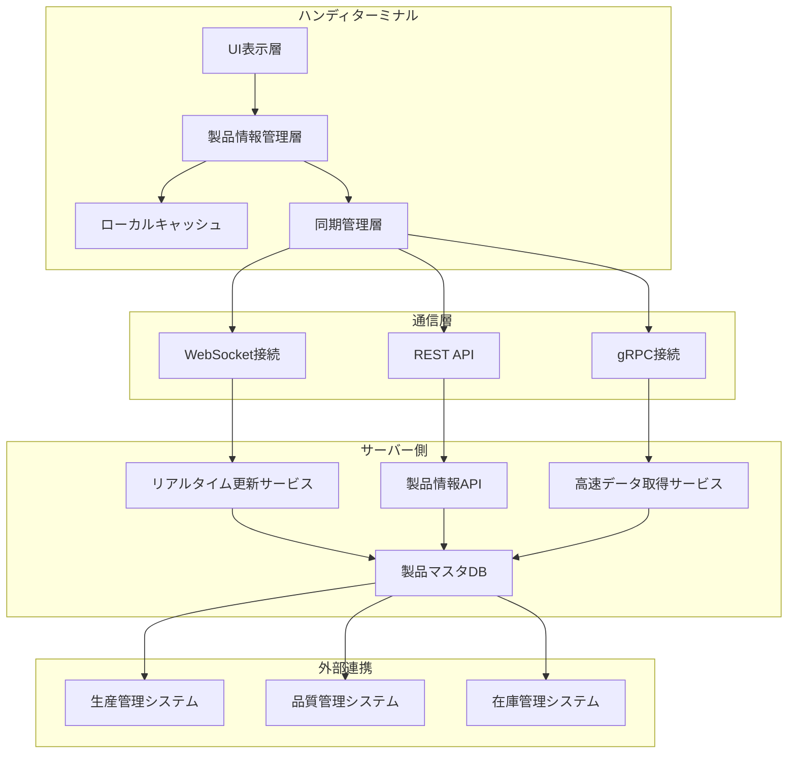
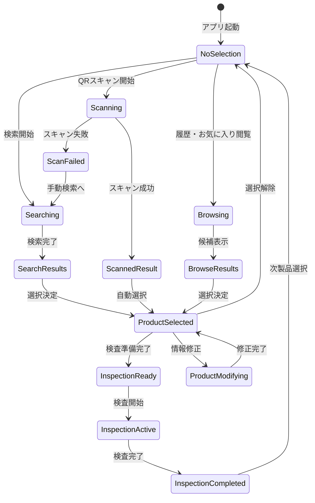
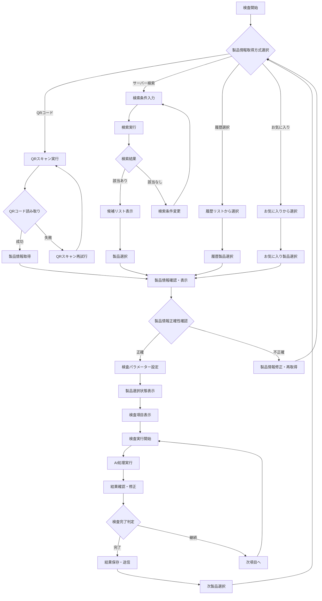

# ハンディターミナルアプリ UI/UX設計書

# 文書管理情報

| 項目       | 内容                                 |
| ---------- | ------------------------------------ |
| 文書名     | ハンディターミナルアプリ UI/UX設計書 |
| バージョン | 1.0                                  |
| 作成日     | 2025年8月9日                         |
| 更新日     | 2025年8月9日                         |

---

# 1. 概要

## 1.1. 本書の目的

本書は、ImageFlowCanvasシステムにおけるハンディターミナルアプリケーションのUI/UX設計について詳細に記述するものです。小画面デバイスでの片手操作最適化、製品情報表示、検査管理インターフェースの設計指針を提供します。

**技術実装詳細**: Kotlin Multiplatformによる実装詳細は `docs/0300_設計_アプローチ1/0310_KotlinMultiplatformアプリ設計.md` を参照してください。

## 1.2. 対象読者

- UI/UXデザイナー
- アプリケーション開発者
- システム設計者
- プロジェクトマネージャー
- 品質保証担当者

## 1.3. ハンディターミナルアプリの役割

ImageFlowCanvasシステムにおいて、ハンディターミナルアプリは以下の重要な役割を担います：

- **現場検査管理**: バーコード・QRコード読み取りと即座の検査実行
- **ポータブル作業**: 片手操作による効率的な現場作業
- **リアルタイムデータ入力**: その場での検査結果記録と送信
- **オフライン対応**: 通信環境に依存しない業務継続性
- **堅牢性**: 工場環境での耐久性と安定動作

---

---

# 2. UI/UX設計アプローチ

## 2.1. ハンディターミナル特化設計原則

### 2.1.1. 小画面最適化原則

ハンディターミナルの限られた画面領域を効率的に活用するための設計原則：

**画面サイズ分類:**
- **Small Terminal** (3.5-4インチ): 800×480～1024×600
- **Medium Terminal** (4.5-5インチ): 1280×720～1280×800  
- **Large Terminal** (5.5-6インチ): 1920×1080～1920×1200

**設計原則:**
1. **情報階層の明確化**: 重要度に応じた表示優先順位
2. **操作エリアの最適化**: 片手操作を考慮したボタン配置
3. **視認性の確保**: 工場環境での高コントラスト表示
4. **レスポンシブ対応**: 画面サイズに応じた適応的レイアウト

### 2.1.2. 片手操作最適化

**操作ゾーン設計:**

| 操作ゾーン         | 画面領域 | 配置要素             | 操作頻度 |
| ------------------ | -------- | -------------------- | -------- |
| **親指ゾーン**     | 下部1/3  | 主要アクションボタン | 高       |
| **人差し指ゾーン** | 上部1/3  | 補助操作・設定       | 中       |
| **両手ゾーン**     | 中央1/3  | 情報表示・閲覧       | 低       |

**タッチターゲット設計:**
- **最小サイズ**: 44dp × 44dp
- **推奨サイズ**: 48dp × 48dp  
- **間隔**: 最小8dp、推奨12dp
- **フィードバック**: 触覚・視覚・音声の複合フィードバック

## 2.2. 製品情報表示システム

## 2.2. 製品情報表示システム

### 2.2.1. 製品選択状態の常時表示

**ヘッダー製品情報表示エリア:**

画面上部に固定表示される現在選択中の製品情報：

```
┌─────────────────────────────────────────────┐
│ 📦 型式: ABC-123 | 機番: 456789 | 月連番: 001 │
│ ✅ 検査対象 | 📅 2024/01/15 | 🔧 ライン A   │
└─────────────────────────────────────────────┘
```

**情報表示の優先順位と階層:**

| 優先度 | 情報項目          | 表示形式        | 条件           |
| ------ | ----------------- | --------------- | -------------- |
| **1**  | 型式 (Model)      | 太字・大文字    | 常時表示       |
| **2**  | 機番 (Serial)     | 中文字          | 常時表示       |
| **3**  | 月連番 (Sequence) | 中文字          | 常時表示       |
| **4**  | 検査状態          | アイコン+色分け | 状態変更時更新 |
| **5**  | 生産日            | 小文字          | 詳細表示時     |
| **6**  | 生産ライン        | 小文字          | 詳細表示時     |

### 2.2.2. 製品情報取得インターフェース

**統合製品情報取得画面:**

QRコードスキャンとサーバー検索の両方に対応した統合インターフェース：

```
┌─────────────────────────────────────────────┐
│ 🔍 製品検索・選択                           │
├─────────────────────────────────────────────┤
│ [📷 QRスキャン] [🔎 サーバー検索]            │
│ [📋 履歴選択]   [⭐ お気に入り]              │
├─────────────────────────────────────────────┤
│ 🔤 クイック入力                             │
│ ┌─────────────────────────────────────────┐ │
│ │ 型式・機番・月連番を入力...             │ │
│ └─────────────────────────────────────────┘ │
├─────────────────────────────────────────────┤
│ 📊 最近使用した製品                         │
│ • ABC-123 | 456789 | 001 (2分前)           │
│ • DEF-456 | 789012 | 002 (5分前)           │
│ • GHI-789 | 012345 | 003 (10分前)          │
└─────────────────────────────────────────────┘
```

**製品情報取得方式:**

| 取得方式             | 主な用途               | 操作方法             | 応答時間 | 精度     |
| -------------------- | ---------------------- | -------------------- | -------- | -------- |
| **QRコードスキャン** | 現場での即座特定       | カメラスキャン       | <1秒     | 99.9%    |
| **サーバー検索**     | 手動検索・候補選択     | 検索条件入力         | 1-3秒    | 検索精度 |
| **履歴選択**         | 最近使用製品の再選択   | リストから選択       | <0.5秒   | 100%     |
| **お気に入り**       | 頻繁利用製品の快速選択 | ブックマークから選択 | <0.5秒   | 100%     |

---

# 3. メイン画面設計

### 3.1.1. ハンディターミナル特化レイアウト

ハンディターミナルの小画面と片手操作を考慮した専用UI設計：

**画面サイズ分類:**
- **Small Terminal** (3.5-4インチ): 800×480～1024×600
- **Medium Terminal** (4.5-5インチ): 1280×720～1280×800  
- **Large Terminal** (5.5-6インチ): 1920×1080～1920×1200

**レイアウトパターン:**

画面サイズに応じた適応的レイアウト設計：

| 画面サイズ分類      | レイアウト構成 | 表示内容                         |
| ------------------- | -------------- | -------------------------------- |
| **Small** (小画面)  | シングルビュー | 単一機能に集中、最小限の情報表示 |
| **Medium** (中画面) | リスト＋詳細   | メイン操作＋簡易詳細の組み合わせ |
| **Large** (大画面)  | 分割ビュー     | リスト表示＋詳細パネルの2分割    |

**レイアウト適応の仕組み:**
- **自動検出**: 画面サイズとデバイス向きを動的に検出
- **片手操作最適化**: 親指操作範囲内への重要ボタン配置
- **大きなタッチターゲット**: 最小44dp以上のタッチ領域確保

### 3.1.2. メインインターフェース設計

**コンパクトメインインターフェース構成:**

ハンディターミナルの限られた画面領域を効率的に活用した設計：

| 領域名                 | 配置位置     | 主要機能                 | 表示情報                           |
| ---------------------- | ------------ | ------------------------ | ---------------------------------- |
| **ステータスバー**     | 画面最上部   | システム状態表示         | 電池残量・通信状態・時刻           |
| **アクションバー**     | 上部固定     | 主要操作・ナビゲーション | 戻る・ホーム・メニュー・スキャン   |
| **メインコンテンツ**   | 中央可変領域 | 主要作業エリア           | 検査リスト・スキャン画面・結果表示 |
| **クイックアクション** | 下部固定     | 頻繁操作                 | スキャン・送信・設定・ヘルプ       |

**片手操作最適化:**
- **親指範囲内配置**: 重要なボタンを親指で届く範囲（画面下部1/3）に配置
- **大きなタッチターゲット**: 最小44dp、推奨48dp以上のタッチ領域
- **視認性向上**: 高コントラスト・大きなフォントサイズの採用

## 3.2. 検査管理UI

### 3.2.1. バーコード・QRスキャン画面

ハンディターミナルの主要機能であるスキャン機能の最適化設計：

**スキャン画面構成:**

| 表示要素             | 配置位置       | 表示内容                     | 機能                   |
| -------------------- | -------------- | ---------------------------- | ---------------------- |
| **カメラプレビュー** | 画面中央上部   | リアルタイム映像表示         | スキャン対象の視覚確認 |
| **スキャンガイド**   | プレビュー重畳 | ターゲット枠・ガイドライン   | 正確な位置合わせ支援   |
| **スキャン結果表示** | 画面中央下部   | 読み取り結果・製品情報       | 即座の結果確認         |
| **アクションボタン** | 画面下部       | 決定・再スキャン・キャンセル | 次の操作への遷移       |
| **設定・ヘルプ**     | 画面隅         | カメラ設定・操作説明         | 環境に応じた調整       |

**スキャン最適化機能:**
- **自動フォーカス**: 距離に応じた自動ピント調整
- **照明補正**: 環境光に応じた露出・コントラスト調整
- **振動フィードバック**: 成功時の触覚フィードバック
- **音声フィードバック**: 成功・失敗時の音声通知

### 3.2.1-1. 製品情報取得機能統合

QRコードスキャンとサーバー検索の両方に対応した製品情報取得機能：

**製品情報取得方式:**

| 取得方式             | 主な用途               | 操作方法             | 応答時間 | 精度     |
| -------------------- | ---------------------- | -------------------- | -------- | -------- |
| **QRコードスキャン** | 現場での即座特定       | カメラスキャン       | <1秒     | 99.9%    |
| **サーバー検索**     | 手動検索・候補選択     | 検索条件入力         | 1-3秒    | 検索精度 |
| **履歴選択**         | 最近使用製品の再選択   | リストから選択       | <0.5秒   | 100%     |
| **お気に入り**       | 頻繁利用製品の快速選択 | ブックマークから選択 | <0.5秒   | 100%     |

**統合製品情報画面構成:**



**製品情報検索インターフェース:**

| 検索項目       | 入力方式     | 検索演算子         | オートコンプリート |
| -------------- | ------------ | ------------------ | ------------------ |
| **製品名**     | テキスト入力 | 部分一致・前方一致 | ✅                  |
| **型式**       | テキスト入力 | 完全一致・部分一致 | ✅                  |
| **機番**       | テキスト入力 | 完全一致・範囲検索 | ✅                  |
| **指図番号**   | テキスト入力 | 完全一致・前方一致 | ✅                  |
| **指示番号**   | テキスト入力 | 完全一致・前方一致 | ✅                  |
| **生産年月日** | 日付選択     | 期間検索・単日検索 | -                  |
| **月連番**     | 数値入力     | 完全一致・範囲検索 | -                  |

### 3.2.1-2. 製品選択状態表示機能

選択中の製品情報を常時表示し、作業者が現在対象としている製品を明確に把握できる機能：

**製品選択状態バー:**

| 表示要素                 | 配置位置          | 表示内容                               | 更新タイミング |
| ------------------------ | ----------------- | -------------------------------------- | -------------- |
| **製品識別情報**         | 画面最上部固定    | 型式・機番・月連番（太字・大きめ表示） | 製品選択時     |
| **製品基本情報**         | 上部固定（2行目） | 製品名・指図番号・指示番号             | 製品選択時     |
| **生産情報**             | 上部固定（3行目） | 生産年月日・作業者・ライン情報         | 製品選択時     |
| **検査進捗インジケータ** | 右端              | 完了済み検査数/総検査数                | 検査実行時     |
| **ステータスアイコン**   | 左端              | 選択状態・未選択・エラー状態           | 状態変更時     |

**製品情報表示の視覚設計:**

```
┌─────────────────────────────────────────────────────────┐
│ 🟢 [TYPE-ABC] [MACH001] [#025] ［検査状況: 3/5完了］      │
│    製品名: 高精度センサーユニット                        │
│    指図: WO123456 | 指示: INST789 | 2025/08/09          │
└─────────────────────────────────────────────────────────┘
```

**製品選択状態管理:**

| 状態         | 表示色   | アイコン | 表示内容                     |
| ------------ | -------- | -------- | ---------------------------- |
| **選択済み** | 緑色背景 | ✅        | 製品情報詳細表示             |
| **未選択**   | 灰色背景 | ⚪        | "製品を選択してください"     |
| **選択中**   | 青色背景 | 🔄        | "製品情報を取得中..."        |
| **エラー**   | 赤色背景 | ❌        | "製品情報取得に失敗しました" |
| **期限切れ** | 黄色背景 | ⚠️        | "製品情報の更新が必要です"   |

### 3.2.2. 検査実行画面

**検査実行インターフェース:**

スキャンした製品の検査実行を行う画面設計：

**検査実行画面構成:**

| 表示要素                 | 配置位置   | 表示内容                         | 更新頻度       |
| ------------------------ | ---------- | -------------------------------- | -------------- |
| **選択製品情報ヘッダー** | 画面最上部 | 型式・機番・月連番・製品名       | 静的           |
| **製品詳細情報**         | 上部       | 指図番号・指示番号・生産年月日   | 静的           |
| **検査項目リスト**       | 画面中央上 | 進行中項目・完了項目・残り項目   | リアルタイム   |
| **AI判定結果**           | 画面中央   | OK/NG判定・信頼度・検出箇所      | AI処理完了時   |
| **手動確認**             | 画面中央下 | 人手による判定修正・コメント入力 | ユーザー操作時 |
| **アクションボタン**     | 画面下部   | 次項目・完了・中断・やり直し     | 静的           |

**製品情報ヘッダー設計:**

選択中の製品を常に表示し、検査対象を明確にする固定ヘッダー：

```
┌─────────────────────────────────────────────────────────┐
│ 📦 現在の検査対象製品                                    │
│ ┌─────────────────────────────────────────────────────┐ │
│ │ 🏷️ TYPE-ABC | 🔧 MACH001 | 📝 #025                   │ │
│ │ 📋 高精度センサーユニット                            │ │
│ │ 📄 指図: WO123456 | 指示: INST789 | 📅 2025/08/09    │ │
│ │ ✅ 検査進捗: 3/5項目完了 (60%)                       │ │
│ └─────────────────────────────────────────────────────┘ │
└─────────────────────────────────────────────────────────┘
```

**検査項目表示と進捗管理:**

| 検査項目状態   | 表示スタイル       | アイコン | 操作可能性   |
| -------------- | ------------------ | -------- | ------------ |
| **未実施**     | 灰色・通常フォント | ⚪        | 実行可能     |
| **実行中**     | 青色・太字         | 🔄        | 実行中表示   |
| **完了（OK）** | 緑色・取り消し線   | ✅        | 再実行可能   |
| **完了（NG）** | 赤色・太字         | ❌        | 再実行可能   |
| **要確認**     | 黄色・点滅         | ⚠️        | 確認要求     |
| **スキップ**   | 薄灰色・斜体       | ⏭️        | 再有効化可能 |

**製品切り替え機能:**

検査実行中でも別の製品に簡単に切り替えられる機能：

| 操作方法               | アクセス方法           | 注意事項                     |
| ---------------------- | ---------------------- | ---------------------------- |
| **ヘッダータップ**     | 製品情報ヘッダー長押し | 現在の検査状況確認ダイアログ |
| **クイック検索**       | フローティングボタン   | 検査データ一時保存           |
| **QRコード再スキャン** | カメラボタン           | 現在検査の中断確認           |
| **履歴選択**           | メニューから履歴選択   | 未完了検査の継続確認         |

**検査結果表示最適化:**
- **明確な判定表示**: 大きなOK/NGアイコンと色分け
- **詳細情報展開**: タップで詳細情報の段階的表示
- **音声読み上げ**: 結果の音声フィードバック（オプション）
- **履歴参照**: 過去の同製品検査結果の簡易表示

**ストリーム表示レイアウト:**

| ストリーム数 | グリッド構成 | 個別ストリームサイズ | 用途                         |
| ------------ | ------------ | -------------------- | ---------------------------- |
| 1個          | 1×1 (全画面) | 画面全体             | 詳細監視・プレゼンテーション |
| 2-4個        | 2×2          | 画面の1/4            | 重要ストリーム集中監視       |
| 5-9個        | 3×3          | 画面の1/9            | 標準的な複数ストリーム監視   |
| 10-16個      | 4×4          | 画面の1/16           | 大規模監視・概要把握         |

**映像オーバーレイ情報:**

各映像ストリームに重畳表示される情報要素：

| オーバーレイ要素       | 表示位置 | 表示内容                   | 表示条件     |
| ---------------------- | -------- | -------------------------- | ------------ |
| **AI判定結果**         | 左上角   | OK/NGバッジ・信頼度数値    | AI処理実行時 |
| **不良箇所ハイライト** | 映像内   | 赤枠線・ヒートマップ重畳   | NG判定時     |
| **デバイス情報**       | 右上角   | デバイス名・接続状態       | 常時表示     |
| **タイムスタンプ**     | 左下角   | 現在時刻・録画時間         | 常時表示     |
| **製品情報**           | 右下角   | 製品ID・検査項目           | 検査実行時   |
| **操作ボタン**         | 中央下部 | 音量・品質・フルスクリーン | ホバー時表示 |

## 4.2. 製品情報表示とリアルタイム管理

### 4.2.1. 製品選択状態の常時表示

**ヘッダー製品情報表示エリア:**

画面上部に固定表示される現在選択中の製品情報：

```
┌─────────────────────────────────────────────┐
│ 📦 型式: ABC-123 | 機番: 456789 | 月連番: 001 │
│ ✅ 検査対象 | 📅 2024/01/15 | 🔧 ライン A   │
└─────────────────────────────────────────────┘
```

**情報表示の優先順位と階層:**

| 優先度 | 情報項目          | 表示形式        | 条件           |
| ------ | ----------------- | --------------- | -------------- |
| **1**  | 型式 (Model)      | 太字・大文字    | 常時表示       |
| **2**  | 機番 (Serial)     | 中文字          | 常時表示       |
| **3**  | 月連番 (Sequence) | 中文字          | 常時表示       |
| **4**  | 検査状態          | アイコン+色分け | 状態変更時更新 |
| **5**  | 生産日            | 小文字          | 詳細表示時     |
| **6**  | 生産ライン        | 小文字          | 詳細表示時     |

**動的情報更新表示:**

- **選択変更アニメーション**: 製品切り替え時のフェードイン・アウト効果
- **状態変化インジケーター**: 検査完了項目の即座反映
- **同期状態表示**: サーバーとの同期状況を色とアイコンで表示

### 4.2.2. 進捗表示とナビゲーション

**検査進捗の視覚化:**

```
検査進捗: [■■■□□] 3/5 完了 (60%)
┌─────────────────────────────────────────────┐
│ ✅ 外観検査    ⏳ 寸法測定    ❌ 機能検査    │
│ □ 梱包検査    □ 最終確認                    │
└─────────────────────────────────────────────┘
```

**製品順序表示とナビゲーション:**

ロット内での現在製品の位置を明確に表示：

| 表示項目       | 表示方法                | 操作                     |
| -------------- | ----------------------- | ------------------------ |
| **現在位置**   | "3/20" + プログレスバー | タップで一覧表示         |
| **前後製品**   | 左右スワイプ            | ダイレクト移動           |
| **ロット全体** | ミニマップ表示          | 任意製品への直接ジャンプ |

**クイックアクセス機能:**

- **最近の製品**: 履歴から即座選択
- **お気に入り**: よく検査する製品をブックマーク
- **問題製品**: NG履歴のある製品を優先表示

### 4.2.3. 製品情報の詳細表示機能

**展開可能な詳細パネル:**

基本情報から詳細情報への段階的展開：

**基本表示 (常時):**
```
型式: ABC-123 | 機番: 456789 | 月連番: 001
```

**詳細表示 (タップ時):**
```
┌─────────────────────────────────────────────┐
│ 📦 製品情報                                 │
├─────────────────────────────────────────────┤
│ 型式:     ABC-123-XL                        │
│ 機番:     456789                            │
│ 月連番:   001                               │
│ 生産日:   2024/01/15 14:30                  │
│ ライン:   A系列-3番                         │
│ ロット:   L240115-A (15/20)                 │
│ 図面:     DWG-ABC123-v2.1                   │
│ 仕様:     標準仕様+オプションX              │
├─────────────────────────────────────────────┤
│ 🔍 検査履歴                                 │
│ 前回: 2024/01/10 ✅合格 (田中)              │
│ 平均: 合格率95% (過去30日)                  │
└─────────────────────────────────────────────┘
```

**コンテキスト連動情報:**

現在の検査段階に応じた関連情報の動的表示：

- **検査前**: 仕様書・図面・注意事項
- **検査中**: 基準値・測定ポイント・合格基準
- **検査後**: 結果履歴・改善提案・次工程情報

### 4.2.4. エラー・警告表示の統合

**製品関連警告の即座表示:**

| 警告レベル | 表示方法                 | 対応アクション           |
| ---------- | ------------------------ | ------------------------ |
| **緊急**   | 赤背景+点滅+音声アラート | 検査停止・管理者連絡     |
| **警告**   | 黄背景+アイコン          | 注意喚起・確認プロンプト |
| **情報**   | 青背景+通知ドット        | 情報確認・後で対応可能   |
| **成功**   | 緑背景+チェックマーク    | 正常完了・次ステップ案内 |

**製品固有の警告例:**

- **仕様変更通知**: "この型式は仕様変更されています (v2.1→v2.2)"
- **検査注意**: "過去にNG履歴あり - 重点チェック項目: 寸法精度"
- **期限警告**: "生産から7日経過 - 早期検査推奨"
- **ロット情報**: "同ロット内で3件のNG報告 - 慎重検査要"

## 4.3. 製品検索・選択機能の拡張

### 4.3.1. 統合検索インターフェース

**検索方式の統合UI設計:**

ハンディターミナルの小画面に最適化された統合検索画面：

```
┌─────────────────────────────────────────────┐
│ 🔍 製品検索・選択                           │
├─────────────────────────────────────────────┤
│ [📷 QRスキャン] [🔎 サーバー検索]            │
│ [📋 履歴選択]   [⭐ お気に入り]              │
├─────────────────────────────────────────────┤
│ 🔤 クイック入力                             │
│ ┌─────────────────────────────────────────┐ │
│ │ 型式・機番・月連番を入力...             │ │
│ └─────────────────────────────────────────┘ │
├─────────────────────────────────────────────┤
│ 📊 最近使用した製品                         │
│ • ABC-123 | 456789 | 001 (2分前)           │
│ • DEF-456 | 789012 | 002 (5分前)           │
│ • GHI-789 | 012345 | 003 (10分前)          │
└─────────────────────────────────────────────┘
```

**QRコードスキャン機能の拡張:**

| 機能                       | 説明                           | UI要素                 |
| -------------------------- | ------------------------------ | ---------------------- |
| **インスタントスキャン**   | カメラ起動と同時に自動検出     | フルスクリーンカメラ   |
| **マルチフォーマット対応** | QR・バーコード・DataMatrix対応 | 形式自動判定表示       |
| **照明制御**               | 自動・手動フラッシュ制御       | フラッシュトグルボタン |
| **位置ガイド**             | 最適スキャン位置の表示         | オーバーレイガイド     |
| **履歴保存**               | スキャン履歴の自動保存         | 履歴アクセスボタン     |

**サーバー検索機能の詳細:**

**段階的検索フィルター:**

```
┌─────────────────────────────────────────────┐
│ 🔎 詳細検索                                 │
├─────────────────────────────────────────────┤
│ 基本条件:                                   │
│ 型式: [ABC-___] 機番: [______] 連番: [___]  │
│                                             │
│ 詳細条件:                                   │
│ 生産日: [2024/01/10] ～ [2024/01/20]        │
│ ライン: [すべて ▼] 状態: [すべて ▼]        │
│                                             │
│ [🔍 検索実行] [🗑️ クリア] [💾 条件保存]     │
└─────────────────────────────────────────────┘
```

**検索結果表示の最適化:**

| 表示モード         | 用途                     | 情報密度 | 操作性     |
| ------------------ | ------------------------ | -------- | ---------- |
| **リスト表示**     | 多数の候補から選択       | 高       | スクロール |
| **カード表示**     | 詳細情報付きで比較選択   | 中       | スワイプ   |
| **テーブル表示**   | 数値データの比較         | 最高     | タップ     |
| **サムネイル表示** | 画像付き製品の視覚的選択 | 低       | グリッド   |

### 4.3.2. 履歴・お気に入り機能

**スマート履歴管理:**

使用頻度と時系列を組み合わせた最適化履歴表示：

| 履歴カテゴリ       | 表示基準             | 表示件数 | 並び順     |
| ------------------ | -------------------- | -------- | ---------- |
| **直近使用**       | 過去1時間以内        | 5件      | 時系列降順 |
| **本日頻用**       | 本日2回以上アクセス  | 3件      | 頻度順     |
| **週間レギュラー** | 過去1週間で3回以上   | 5件      | 頻度順     |
| **月間定番**       | 過去1ヶ月で週1回以上 | 10件     | 頻度順     |

**動的お気に入り機能:**

- **自動お気に入り**: 頻繁にアクセスする製品の自動登録
- **グループ分類**: プロジェクト・ライン別のお気に入りグループ
- **共有お気に入り**: チーム全体での共通お気に入り
- **期間限定**: 短期プロジェクト用の一時お気に入り

### 4.3.3. 予測・提案機能

**インテリジェント製品候補:**

作業コンテキストに基づく製品候補の自動提案：



**学習型検索支援:**

- **入力補完**: 部分入力からの自動補完候補
- **類似製品**: 検索製品の類似品・関連品表示
- **代替案**: 在庫切れ・非対応時の代替製品提案
- **チーム学習**: 他のオペレーターの選択パターン学習

### 4.3.4. オフライン・同期機能

**ローカルキャッシュ戦略:**

| データカテゴリ   | キャッシュ期間 | 同期頻度           | オフライン動作     |
| ---------------- | -------------- | ------------------ | ------------------ |
| **基本製品情報** | 7日間          | 4時間毎            | 完全動作           |
| **検査履歴**     | 30日間         | 1時間毎            | 閲覧・更新可能     |
| **画像・図面**   | 3日間          | 手動・オンデマンド | キャッシュ済みのみ |
| **仕様書**       | 14日間         | 8時間毎            | 重要データのみ     |

**同期状態の可視化:**

```
同期状態: 🔄 同期中 | ✅ 最新 | ⚠️ 古い | ❌ 未接続
┌─────────────────────────────────────────────┐
│ 📊 データ同期状況                           │
├─────────────────────────────────────────────┤
│ 製品マスタ: ✅ 2分前更新 (1,234件)          │
│ 検査履歴:   🔄 同期中... (45%)              │
│ 画像データ: ⚠️ 6時間前 (要更新)             │
│ [🔄 今すぐ同期] [⚙️ 同期設定]              │
└─────────────────────────────────────────────┘
```

## 4.4. データ統合とリアルタイム同期

### 4.4.1. 製品情報のリアルタイム管理

**製品情報の一元管理アーキテクチャ:**



**データ整合性の保証:**

| データ種別           | 整合性レベル     | 更新方式         | 競合解決方法       |
| -------------------- | ---------------- | ---------------- | ------------------ |
| **製品基本情報**     | 強整合性         | 即座同期         | サーバー側優先     |
| **検査進捗状況**     | 結果整合性       | バッチ同期       | タイムスタンプ比較 |
| **製品選択状態**     | セッション整合性 | リアルタイム同期 | 最終操作者優先     |
| **履歴・お気に入り** | 弱整合性         | 定期同期         | マージ処理         |

### 4.4.2. 状態管理の詳細設計

**製品選択状態のライフサイクル管理:**



**状態変更イベントの管理:**

| イベント種別               | トリガー条件           | 影響範囲           | 通知方法             |
| -------------------------- | ---------------------- | ------------------ | -------------------- |
| **ProductSelected**        | 製品選択決定           | 全UI要素           | 即座UI更新           |
| **ProductInfoUpdated**     | サーバーからの情報更新 | 詳細情報表示エリア | バックグラウンド更新 |
| **InspectionStateChanged** | 検査状態変更           | 進捗表示・ヘッダー | リアルタイム反映     |
| **SyncStatusChanged**      | 同期状態変更           | 同期インジケーター | 状態アイコン更新     |
| **ErrorOccurred**          | エラー発生             | エラー表示エリア   | 警告表示・音声通知   |

### 4.4.3. パフォーマンス最適化

**レスポンス時間の目標値:**

| 操作種別             | 目標時間 | 許容時間 | 最適化手法         |
| -------------------- | -------- | -------- | ------------------ |
| **QRスキャン認識**   | <50ms    | <100ms   | ローカル処理最適化 |
| **製品情報表示**     | <100ms   | <300ms   | キャッシュ活用     |
| **検索結果表示**     | <200ms   | <500ms   | インデックス最適化 |
| **詳細情報読み込み** | <300ms   | <1秒     | 非同期ローディング |
| **サーバー同期**     | <500ms   | <2秒     | 差分同期・圧縮通信 |

**メモリ使用量の最適化:**

| データ種別         | 保持期間     | メモリ使用量上限 | クリーンアップ条件     |
| ------------------ | ------------ | ---------------- | ---------------------- |
| **アクティブ製品** | セッション中 | 50MB             | セッション終了時       |
| **検索キャッシュ** | 1時間        | 30MB             | 時間経過・メモリ不足時 |
| **画像キャッシュ** | 30分         | 100MB            | LRU方式クリーンアップ  |
| **履歴データ**     | 7日間        | 20MB             | 古いデータ自動削除     |

### 4.4.4. エラーハンドリングと復旧

**エラー分類と対応戦略:**

| エラーカテゴリ         | 検出方法               | 自動復旧           | ユーザー対応             |
| ---------------------- | ---------------------- | ------------------ | ------------------------ |
| **ネットワークエラー** | 通信タイムアウト       | 自動リトライ(3回)  | オフライン継続・手動同期 |
| **データ不整合**       | 整合性チェック         | サーバー再取得     | 確認ダイアログ表示       |
| **QRスキャンエラー**   | 読み取り失敗・無効形式 | 再スキャン促進     | 手動入力切り替え         |
| **認証エラー**         | トークン無効・権限不足 | 自動ログイン試行   | 認証画面表示             |
| **ストレージ不足**     | 容量監視               | 古いデータ自動削除 | 容量警告・手動クリア     |

**復旧処理の優先順位:**

1. **緊急復旧**: 検査継続に必要な最小限データの確保
2. **段階復旧**: 段階的なデータ復元・機能回復
3. **完全復旧**: 全機能・全データの正常状態復帰
4. **予防対策**: 再発防止のための設定・プロセス改善

## 4.5. ユーザーエクスペリエンス設計

### 4.5.1. 製品選択からの統合ワークフロー

**拡張された検査ワークフロー:**



### 4.5.2. 検査状態管理の詳細化

**検査状態とUI表示の対応:**

| 状態名称                 | 前提条件             | 次状態候補           | 表示内容                       |
| ------------------------ | -------------------- | -------------------- | ------------------------------ |
| **IDLE**                 | アプリ起動完了       | 製品情報取得開始     | "製品を選択してください"       |
| **PRODUCT_SELECTION**    | 取得方式選択完了     | 各取得方式実行       | "製品情報を取得中..."          |
| **QR_SCANNING**          | QRスキャン開始       | QR読み取り完了・失敗 | QRスキャン画面表示             |
| **SERVER_SEARCHING**     | 検索条件入力完了     | 検索結果取得・失敗   | "サーバーを検索中..."          |
| **PRODUCT_CONFIRMING**   | 製品情報取得完了     | 確認完了・修正要求   | 製品情報確認画面表示           |
| **PRODUCT_IDENTIFIED**   | 製品確認完了         | 検査パラメーター設定 | 選択製品情報ヘッダー表示       |
| **INSPECTION_READY**     | パラメーター設定完了 | 検査開始             | 検査項目リスト表示             |
| **IN_PROGRESS**          | 検査実行中           | AI処理完了           | 進捗表示・実行中アニメーション |
| **AI_COMPLETED**         | AI処理完了           | 人手確認開始         | AI判定結果表示                 |
| **HUMAN_REVIEW**         | 人手確認中           | 最終判定完了         | 確認画面・修正インターフェース |
| **ITEM_COMPLETED**       | 単項目完了           | 次項目・全完了判定   | 完了マーク・進捗更新           |
| **INSPECTION_COMPLETED** | 全項目完了           | 結果保存・次製品選択 | 完了サマリー表示               |

### 4.5.3. エラー状態への対応拡張

**エラー状態と復旧フロー:**

| エラー状態                | 発生条件             | 復旧方法                 | ユーザー操作                     |
| ------------------------- | -------------------- | ------------------------ | -------------------------------- |
| **QR_DECODE_FAILED**      | QRコード読み取り失敗 | 再スキャン・手動入力     | 位置調整・照明改善・検索切替     |
| **PRODUCT_NOT_FOUND**     | 製品情報未登録・無効 | 手動検索・製品登録要求   | サーバー検索・管理者連絡         |
| **SEARCH_NO_RESULTS**     | 検索条件に該当なし   | 検索条件緩和・別方式選択 | 条件変更・QRコード利用           |
| **NETWORK_ERROR**         | サーバー接続失敗     | オフライン対応・再試行   | ローカルキャッシュ利用           |
| **PRODUCT_INFO_OUTDATED** | 製品情報が古い       | サーバー再同期           | 情報更新・継続確認               |
| **VALIDATION_FAILED**     | 製品情報整合性エラー | データ検証・修正         | 手動修正・管理者エスカレーション |

### 4.5.4. ワークフロー最適化機能

**効率化機能の詳細:**

- **製品情報キャッシュ**: 頻繁にアクセスする製品情報の高速表示
- **スマート候補**: 使用履歴に基づく製品候補の優先表示
- **作業継続支援**: 中断した検査の自動復元
- **エラー予防**: 無効な製品選択の事前検出
- **効率分析**: 製品選択・検査実行時間の分析と改善提案

**学習機能による改善:**

| 学習項目           | データソース         | 改善効果               | 反映方法             |
| ------------------ | -------------------- | ---------------------- | -------------------- |
| **検索パターン**   | 検索履歴・選択結果   | 候補の精度向上         | 検索順位調整         |
| **操作効率**       | 操作時間・エラー頻度 | インターフェース最適化 | UI改善提案           |
| **製品選択傾向**   | 選択頻度・時間帯     | 予測候補精度向上       | 推奨リスト更新       |
| **エラーパターン** | エラー発生・復旧履歴 | 予防措置強化           | 警告・ガイダンス改善 |

```mermaid
graph TD
    A[検査開始] --> B{製品情報取得方式選択}
    
    B -->|QRコード| C[QRスキャン実行]
    B -->|サーバー検索| D[検索条件入力]
    B -->|履歴選択| E[履歴リストから選択]
    B -->|お気に入り| F[お気に入りから選択]
    
    C --> G{QRコード読み取り}
    G -->|成功| H[製品情報取得]
    G -->|失敗| I[QRスキャン再試行]
    I --> C
    
    D --> J[検索実行]
    J --> K{検索結果}
    K -->|該当あり| L[候補リスト表示]
    K -->|該当なし| M[検索条件変更]
    M --> D
    L --> N[製品選択]
    
    E --> O[履歴製品選択]
    F --> P[お気に入り製品選択]
    
    H --> Q[製品情報確認・表示]
    N --> Q
    O --> Q
    P --> Q
---

# 4. 運用・メンテナンス機能

## 4.1. ユーザビリティ最適化

### 4.1.1. アクセシビリティ対応

工場環境での多様な作業者に配慮したアクセシビリティ機能：

**視覚的アクセシビリティ:**
- **高コントラスト表示**: 工場照明下での視認性確保
- **大きな文字サイズ**: 最小16sp、推奨18sp以上
- **色覚対応**: 色だけに依存しない情報伝達
- **明度調整**: 環境光に応じた自動調整

**操作アクセシビリティ:**
- **大きなタッチターゲット**: 手袋着用時も操作可能
- **音声フィードバック**: 成功・失敗・警告の音声通知
- **振動フィードバック**: 触覚による操作確認
- **ジェスチャー操作**: スワイプ・長押しによる快速操作

### 4.1.2. 多言語対応

国際的な製造環境に対応した多言語インターフェース：

**対応言語:**
- **基本対応**: 日本語、英語
- **拡張対応**: 中国語、韓国語、ドイツ語、スペイン語

**言語切替機能:**
- **自動検出**: システム言語の自動適用
- **手動切替**: 設定画面からの即座切替
- **混在表示**: 技術用語は英語、操作は現地語

### 4.1.3. カスタマイズ機能

各工場・作業者の要求に応じたインターフェースカスタマイズ：

**表示カスタマイズ:**
- **テーマ選択**: ダーク・ライト・高コントラスト
- **レイアウト変更**: ボタン配置・画面構成の調整
- **情報密度**: 表示項目・詳細レベルの選択

**操作カスタマイズ:**
- **ショートカット設定**: 頻用機能への快速アクセス
- **ジェスチャー設定**: カスタムジェスチャーの定義
- **音声・振動**: フィードバック強度・種類の調整

## 4.2. 教育・サポート機能

### 4.2.1. オンボーディング

新規作業者向けの段階的な操作習得支援：

**初回セットアップガイド:**
1. **デバイス設定**: ネットワーク・権限・基本設定
2. **機能説明**: 主要機能の概要説明
3. **実習モード**: 安全な環境での操作練習
4. **習熟度確認**: 基本操作の理解度テスト

**インタラクティブチュートリアル:**
- **ステップバイステップ**: 実際の画面での操作案内
- **進捗追跡**: 学習進捗の可視化
- **繰り返し学習**: 理解不足部分の重点学習
- **実作業連携**: 実際の業務での段階的サポート

### 4.2.2. ヘルプ・サポート機能

作業中の疑問・問題に対するリアルタイム支援：

**文脈依存ヘルプ:**
- **画面別ヘルプ**: 現在の操作に関連する説明
- **エラー解決**: 発生したエラーの具体的な対処法
- **FAQ検索**: よくある質問の即座検索
- **動画ガイド**: 操作手順の動画説明

**サポート連絡機能:**
- **問題報告**: スクリーンショット付きの問題報告
- **チャットサポート**: リアルタイムでの技術支援
- **リモート支援**: 画面共有による遠隔サポート
- **エスカレーション**: 複雑な問題の上位者連絡

---

# 5. 品質・性能要件

## 5.1. パフォーマンス要件

### 5.1.1. 応答性能要件

**操作応答時間目標:**

| 操作種別           | 目標時間 | 許容時間 | 測定条件           |
| ------------------ | -------- | -------- | ------------------ |
| **QRスキャン認識** | <1秒     | <2秒     | 標準的な工場照明下 |
| **製品情報表示**   | <0.5秒   | <1秒     | ローカルキャッシュ |
| **検索結果表示**   | <2秒     | <5秒     | サーバー検索時     |
| **画面遷移**       | <0.3秒   | <0.5秒   | アニメーション含む |
| **データ同期**     | <10秒    | <30秒    | 差分同期実行時     |

### 5.1.2. 安定性要件

**システム安定性指標:**

| 指標                 | 目標値       | 測定期間 | 対応措置                     |
| -------------------- | ------------ | -------- | ---------------------------- |
| **アプリクラッシュ** | <0.1%        | 月次     | 自動エラー報告・修正リリース |
| **応答無し**         | <0.5%        | 週次     | パフォーマンス監視・最適化   |
| **データ損失**       | 0%           | 継続監視 | 自動バックアップ・復旧機能   |
| **メモリリーク**     | 検出時即修正 | 継続監視 | メモリ使用量監視・アラート   |

## 5.2. セキュリティ要件

### 5.2.1. データ保護

**機密性保護:**
- **暗号化**: AES-256による保存データ暗号化
- **通信保護**: TLS 1.3による通信暗号化
- **アクセス制御**: ロールベースアクセス制御（RBAC）
- **監査ログ**: 全データアクセスの記録・監視

**完全性保証:**
- **デジタル署名**: 重要データの改ざん検出
- **チェックサム**: ファイル転送時の整合性確認
- **バージョン管理**: データ変更履歴の追跡
- **バックアップ**: 定期的なデータバックアップ

### 5.2.2. 認証・認可

**認証強化:**
- **多要素認証**: パスワード + 生体認証
- **セッション管理**: 適切なタイムアウト設定
- **不正ログイン検出**: 異常アクセスパターンの監視
- **アカウントロック**: 連続失敗時の自動ロック

**権限管理:**
- **最小権限の原則**: 必要最小限の権限付与
- **動的権限制御**: 時間・場所による権限変更
- **権限継承**: 組織階層に基づく権限設計
- **監査証跡**: 権限変更・使用の完全記録

---

# 6. 保守・運用

## 6.1. 監視・分析

### 6.1.1. 使用状況分析

**ユーザー行動分析:**
- **操作パターン**: 効率的な操作フローの特定
- **エラー頻度**: 問題の多い操作・画面の特定
- **所要時間**: 各作業の平均実行時間測定
- **満足度**: ユーザーフィードバックの定量評価

**性能監視:**
- **応答時間**: リアルタイムでの応答性能監視
- **リソース使用**: CPU・メモリ・ストレージ使用状況
- **ネットワーク**: 通信品質・エラー率の監視
- **バッテリー**: 消費電力パターンの分析

### 6.1.2. 品質改善

**継続的改善プロセス:**
- **データ収集**: 使用状況・エラー・フィードバックの体系的収集
- **問題分析**: 収集データの統計的分析・パターン発見
- **改善計画**: 優先度に基づく改善施策の立案
- **効果測定**: 改善後の効果検証・KPI測定

**フィードバックループ:**
- **ユーザーフィードバック**: 定期的な満足度調査・要望収集
- **技術指標**: システム性能・安定性指標の監視
- **ビジネス指標**: 生産性・品質向上への貢献度測定
- **改善実装**: フィードバックに基づく継続的な機能改善

---

# 7. まとめ

## 7.1. 設計価値の実現

本設計書により実現される主要価値：

### 7.1.1. 現場作業効率化
- **片手操作最適化**: 工場環境での直感的操作
- **製品情報統合**: QRスキャンとサーバー検索の統合による柔軟な製品特定
- **リアルタイム進捗**: 検査状況の即座把握・共有

### 7.1.2. 堅牢性・信頼性
- **オフライン対応**: ネットワーク不安定環境での業務継続
- **エラー回復**: 自動回復機能による稼働率向上
- **データ保護**: 暗号化・バックアップによる情報資産保護

### 7.1.3. 拡張性・保守性
- **プラットフォーム統一**: 複数OS対応による導入柔軟性
- **モジュール設計**: 機能追加・変更の容易性
- **運用支援**: 監視・分析による継続的改善

## 7.2. 技術実装詳細

**Kotlin Multiplatform実装詳細**: `docs/0300_設計_アプローチ1/0310_KotlinMultiplatformアプリ設計.md` を参照

**API・データベース設計詳細**: 
- API設計: `docs/0300_設計_アプローチ1/0304_API設計.md`
- データベース設計: `docs/0300_設計_アプローチ1/0303_データベース設計.md`

このUI/UX設計により、ハンディターミナルアプリケーションは工場現場での効率的な検査管理業務を実現し、特に製品情報の確実な特定・表示による作業品質向上を提供します。

**Linux Embedded:**
- **ディストリビューション**: Ubuntu Core 20 LTS 以上
- **デスクトップ環境**: 軽量WM (Openbox等)

# 7. まとめ

本ハンディターミナルアプリ設計書では、Kotlin MultiplatformとCompose Multiplatformを活用した統一的な検査管理アプリケーションの実現方針を示しました。

## 7.1. 主要な特徴

1. **統一コードベース**: 複数プラットフォームでのビジネスロジック共有（80%以上）
2. **小画面最適化**: ハンディターミナル特有の小画面を活用したUI/UX設計
3. **現場作業特化**: バーコード・QRスキャンと即座の検査実行
4. **オフライン対応**: ネットワーク制約下での業務継続性
5. **堅牢性**: 工場環境での耐久性と安定動作

## 7.2. 実現される価値

- **現場作業効率化**: 片手操作による効率的な検査作業
- **即座の情報入力**: その場でのデータ記録と送信
- **ポータブル運用**: 移動しながらの柔軟な作業実行
- **高信頼性**: オフライン対応による業務継続性
- **スケーラビリティ**: 将来的な機能拡張への対応

このハンディターミナルアプリケーションにより、ImageFlowCanvasシステムは現場での検査管理をより効率的かつ迅速に実現し、製造業のDX推進に大きく貢献することができます。
