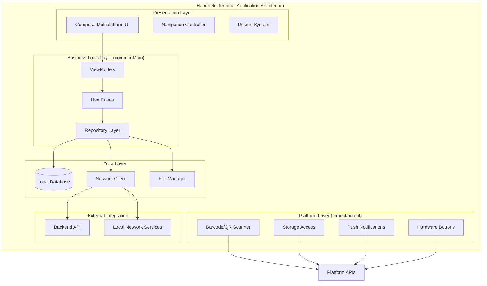

# Kotlin Multiplatform & Compose Multiplatform ハンディターミナルアプリ設計書

## 文書管理情報

| 項目       | 内容                                                                    |
| ### 3.2. 検査管理UI

#### 3.2.1. バーコード・QRスキャン画面

ハンディターミナルの主要機能であるスキャン機能の最適化設計：

**スキャン画面構成:**

| 表示要素             | 配置位置       | 表示内容                     | 機能                   |
| -------------------- | -------------- | ---------------------------- | ---------------------- |
| **カメラプレビュー** | 画面中央上部   | リアルタイム映像表示         | スキャン対象の視覚確認 |
| **スキャンガイド**   | プレビュー重畳 | ターゲット枠・ガイドライン   | 正確な位置合わせ支援   |
| **スキャン結果表示** | 画面中央下部   | 読み取り結果・製品情報       | 即座の結果確認         |
| **アクションボタン** | 画面下部       | 決定・再スキャン・キャンセル | 次の操作への遷移       |
| **設定・ヘルプ**     | 画面隅         | カメラ設定・操作説明         | 環境に応じた調整       |

**スキャン最適化機能:**
- **自動フォーカス**: 距離に応じた自動ピント調整
- **照明補正**: 環境光に応じた露出・コントラスト調整
- **振動フィードバック**: 成功時の触覚フィードバック
- **音声フィードバック**: 成功・失敗時の音声通知----- | ----------------------------------------------------------------------- |
| 文書名     | Kotlin Multiplatform & Compose Multiplatform ハンディターミナルアプリ設計書 |
| バージョン | 1.0                                                                     |
| 作成日     | 2025年8月9日                                                            |
| 更新日     | 2025年8月9日                                                            |

---

## 1. 概要

### 1.1. 本書の目的

本書は、ImageFlowCanvasシステムにおけるハンディターミナルアプリケーションの設計について詳細に記述するものです。Kotlin MultiplatformとCompose Multiplatformを活用し、Android・Windows・Linux搭載のハンディターミナルで統一的な検査管理体験を提供するための設計指針を提供します。

### 1.2. 対象読者

- アプリケーション開発者
- UI/UXデザイナー
- システム設計者
- プロジェクトマネージャー
- 品質保証担当者

### 1.3. ハンディターミナルアプリの役割

ImageFlowCanvasシステムにおいて、ハンディターミナルアプリは以下の重要な役割を担います：

- **現場検査管理**: バーコード・QRコード読み取りと即座の検査実行
- **ポータブル作業**: 片手操作による効率的な現場作業
- **リアルタイムデータ入力**: その場での検査結果記録と送信
- **オフライン対応**: 通信環境に依存しない業務継続性
- **堅牢性**: 工場環境での耐久性と安定動作

---

## 2. アーキテクチャ概要

### 2.1. 全体構成

### 2.2. プラットフォーム対応マトリックス

| 機能分類                 | Android | Windows | Linux | 実装場所      |
| ------------------------ | ------- | ------- | ----- | ------------- |
| 検査管理UI               | ✅       | ✅       | ✅     | commonMain    |
| バーコード・QRスキャン   | ✅       | ✅       | ✅     | commonMain    |
| データ同期               | ✅       | ✅       | ✅     | commonMain    |
| 小画面最適化UI           | ✅       | ✅       | ✅     | commonMain    |
| ハードウェアボタン制御   | ✅       | 🔶       | 🔶     | expect/actual |
| ファイル管理             | ✅       | ✅       | ✅     | expect/actual |
| カメラ統合（基本）       | ✅       | 🔶       | 🔶     | expect/actual |
| 振動フィードバック       | ✅       | 🔶       | ❌     | expect/actual |
| プッシュ通知             | ✅       | ✅       | 🔶     | expect/actual |
| ローカルネットワーク検索 | ✅       | ✅       | ✅     | expect/actual |
| USB/シリアル接続         | ✅       | ✅       | ✅     | expect/actual |
| 省電力制御               | ✅       | 🔶       | 🔶     | expect/actual |

**凡例**: ✅ フル対応、🔶 限定対応、❌ 対応外

---

## 3. UI/UX設計 (Compose Multiplatform)

### 3.1. 小画面最適化設計

#### 3.1.1. ハンディターミナル特化レイアウト

ハンディターミナルの小画面と片手操作を考慮した専用UI設計：

**画面サイズ分類:**
- **Small Terminal** (3.5-4インチ): 800×480～1024×600
- **Medium Terminal** (4.5-5インチ): 1280×720～1280×800  
- **Large Terminal** (5.5-6インチ): 1920×1080～1920×1200

**レイアウトパターン:**

画面サイズに応じた適応的レイアウト設計：

| 画面サイズ分類      | レイアウト構成 | 表示内容                         |
| ------------------- | -------------- | -------------------------------- |
| **Small** (小画面)  | シングルビュー | 単一機能に集中、最小限の情報表示 |
| **Medium** (中画面) | リスト＋詳細   | メイン操作＋簡易詳細の組み合わせ |
| **Large** (大画面)  | 分割ビュー     | リスト表示＋詳細パネルの2分割    |

**レイアウト適応の仕組み:**
- **自動検出**: 画面サイズとデバイス向きを動的に検出
- **片手操作最適化**: 親指操作範囲内への重要ボタン配置
- **大きなタッチターゲット**: 最小44dp以上のタッチ領域確保

#### 3.1.2. メインインターフェース設計

**コンパクトメインインターフェース構成:**

ハンディターミナルの限られた画面領域を効率的に活用した設計：

| 領域名                 | 配置位置     | 主要機能                 | 表示情報                           |
| ---------------------- | ------------ | ------------------------ | ---------------------------------- |
| **ステータスバー**     | 画面最上部   | システム状態表示         | 電池残量・通信状態・時刻           |
| **アクションバー**     | 上部固定     | 主要操作・ナビゲーション | 戻る・ホーム・メニュー・スキャン   |
| **メインコンテンツ**   | 中央可変領域 | 主要作業エリア           | 検査リスト・スキャン画面・結果表示 |
| **クイックアクション** | 下部固定     | 頻繁操作                 | スキャン・送信・設定・ヘルプ       |

**片手操作最適化:**
- **親指範囲内配置**: 重要なボタンを親指で届く範囲（画面下部1/3）に配置
- **大きなタッチターゲット**: 最小44dp、推奨48dp以上のタッチ領域
- **視認性向上**: 高コントラスト・大きなフォントサイズの採用

### 3.2. 検査管理UI

#### 3.2.2. 検査実行画面

**検査実行インターフェース:**

スキャンした製品の検査実行を行う画面設計：

**検査実行画面構成:**

| 表示要素             | 配置位置   | 表示内容                         | 更新頻度       |
| -------------------- | ---------- | -------------------------------- | -------------- |
| **製品情報**         | 画面上部   | 製品名・型式・機番・検査項目     | 静的           |
| **検査進捗**         | 画面中央上 | 進行中項目・完了項目・残り項目   | リアルタイム   |
| **AI判定結果**       | 画面中央   | OK/NG判定・信頼度・検出箇所      | AI処理完了時   |
| **手動確認**         | 画面中央下 | 人手による判定修正・コメント入力 | ユーザー操作時 |
| **アクションボタン** | 画面下部   | 次項目・完了・中断・やり直し     | 静的           |

**検査結果表示最適化:**
- **明確な判定表示**: 大きなOK/NGアイコンと色分け
- **詳細情報展開**: タップで詳細情報の段階的表示
- **音声読み上げ**: 結果の音声フィードバック（オプション）
- **履歴参照**: 過去の同製品検査結果の簡易表示

**ストリーム表示レイアウト:**

| ストリーム数 | グリッド構成 | 個別ストリームサイズ | 用途                         |
| ------------ | ------------ | -------------------- | ---------------------------- |
| 1個          | 1×1 (全画面) | 画面全体             | 詳細監視・プレゼンテーション |
| 2-4個        | 2×2          | 画面の1/4            | 重要ストリーム集中監視       |
| 5-9個        | 3×3          | 画面の1/9            | 標準的な複数ストリーム監視   |
| 10-16個      | 4×4          | 画面の1/16           | 大規模監視・概要把握         |

**映像オーバーレイ情報:**

各映像ストリームに重畳表示される情報要素：

| オーバーレイ要素       | 表示位置 | 表示内容                   | 表示条件     |
| ---------------------- | -------- | -------------------------- | ------------ |
| **AI判定結果**         | 左上角   | OK/NGバッジ・信頼度数値    | AI処理実行時 |
| **不良箇所ハイライト** | 映像内   | 赤枠線・ヒートマップ重畳   | NG判定時     |
| **デバイス情報**       | 右上角   | デバイス名・接続状態       | 常時表示     |
| **タイムスタンプ**     | 左下角   | 現在時刻・録画時間         | 常時表示     |
| **製品情報**           | 右下角   | 製品ID・検査項目           | 検査実行時   |
| **操作ボタン**         | 中央下部 | 音量・品質・フルスクリーン | ホバー時表示 |

### 3.3. 製品情報管理UI

#### 3.3.1. 製品検索・一覧画面

**コンパクト検索インターフェース設計:**

ハンディターミナルの小画面に最適化された製品検索機能：

**検索機能の階層構造:**

| 検索レベル       | 検索方法                 | 対象データ           | 応答時間 |
| ---------------- | ------------------------ | -------------------- | -------- |
| **クイック検索** | バーコード・QRスキャン   | 製品識別コード       | <50ms    |
| **即座検索**     | 入力中のリアルタイム検索 | キャッシュ済みデータ | <100ms   |
| **ローカル検索** | ローカルデータベース検索 | 同期済み全データ     | <500ms   |
| **サーバー検索** | API経由の詳細検索        | 全製品マスタデータ   | <2秒     |

**シンプルフィルター構成:**

| フィルター項目 | 入力方式               | 特徴                         |
| -------------- | ---------------------- | ---------------------------- |
| **製品コード** | スキャン・テキスト入力 | 最優先・最速検索             |
| **生産日**     | 日付範囲選択           | 当日・昨日・今週のプリセット |
| **検査状態**   | ボタン選択             | 未検査・完了・NG のみ        |

**リスト表示最適化:**

小画面でも視認性を確保したリスト設計：

- **製品カード**: 1行表示・重要情報のみ表示
- **階層表示**: タップで詳細展開
- **スワイプアクション**: 左右スワイプで検査開始・詳細表示
- **無限スクロール**: 大量データの段階的読み込み

#### 3.3.2. 製品詳細・検査履歴画面

**コンパクト詳細情報表示:**

ハンディターミナルでの効率的な詳細情報表示：

| 表示セクション   | 表示内容                     | 表示方法               |
| ---------------- | ---------------------------- | ---------------------- |
| **製品基本情報** | 指図番号・型式・機番・生産日 | 画面上部・常時表示     |
| **検査状況**     | 進行状態・最新結果・次回検査 | 中央・ステータス色分け |
| **履歴サマリー** | 検査回数・合格率・最終検査日 | 下部・統計表示         |

**タブ式詳細表示:**

画面領域を効率活用するタブ式詳細表示：

- **基本情報タブ**: 製品仕様・製造情報
- **検査履歴タブ**: 過去の検査結果一覧
- **画像タブ**: 関連画像・動画のサムネイル
- **メモタブ**: 検査時のコメント・特記事項
- **検査履歴**: 時系列での検査結果・AI判定・人手修正
- **関連ファイル**: 画像・動画・音声・レポート
- **トレーサビリティ**: 製造工程・品質履歴

---

## 4. 共通機能実装 (commonMain)

### 4.1. 検査管理ロジック

#### 4.1.1. 検査ワークフロー管理

**検査ワークフロー状態遷移:**

製品検査プロセスの統一的な状態管理により、複雑な検査フローを体系的に制御します。

**主要状態とその役割:**

| 状態名                 | 説明           | 前提条件                 | 次の状態への遷移条件     |
| ---------------------- | -------------- | ------------------------ | ------------------------ |
| **IDLE**               | 待機状態       | システム起動完了         | 製品情報取得開始         |
| **PRODUCT_SCANNING**   | 製品情報取得中 | QRスキャンまたは検索開始 | 製品情報特定完了         |
| **PRODUCT_IDENTIFIED** | 製品特定完了   | 有効な製品情報取得       | 検査パラメーター設定完了 |
| **IN_PROGRESS**        | 検査実行中     | AI処理パイプライン開始   | AI処理完了               |
| **AI_COMPLETED**       | AI処理完了     | AI判定結果受信           | 人手確認開始             |
| **HUMAN_REVIEW**       | 人手確認中     | 作業者による結果確認     | 最終判定完了             |
| **COMPLETED**          | 検査完了       | 結果保存・同期完了       | 次回検査準備             |

**エラー状態への対応:**

| エラー状態            | 発生条件                   | 復旧方法         | ユーザー操作               |
| --------------------- | -------------------------- | ---------------- | -------------------------- |
| **PRODUCT_NOT_FOUND** | 無効なQRコード・未登録製品 | 製品情報再入力   | 手動検索またはQR再スキャン |
| **QR_DECODE_FAILED**  | QRコード読み取り失敗       | カメラ再試行     | QRコード位置調整・照明改善 |
| **FAILED**            | システムエラー・通信障害   | システム復旧待機 | エラー報告・管理者連絡     |
| **CANCELLED**         | ユーザーによる検査中断     | 状態リセット     | 検査再開または別製品選択   |

**ワークフロー最適化機能:**

- **自動復旧**: 一時的なエラーからの自動回復メカニズム
- **状態永続化**: アプリ終了時の状態保存・復元機能
- **並列処理**: 複数製品の同時検査対応
- **進捗同期**: 他デバイスとの状態共有・同期

### 4.2. データ同期・管理

#### 4.2.1. ローカルデータベース設計

**データベース構造設計:**

ハンディターミナルアプリケーションにおけるローカルデータベースは、オフライン機能と高速データアクセスを実現するための重要な基盤です。

**主要テーブル構成:**

| テーブル名                | 主な用途             | レコード数想定  | 更新頻度     |
| ------------------------- | -------------------- | --------------- | ------------ |
| **products**              | 製品マスタ情報       | 10,000-50,000件 | 日次同期     |
| **inspection_items**      | 検査項目定義         | 1,000-5,000件   | 週次更新     |
| **inspection_executions** | 検査実行履歴         | 100,000件以上   | リアルタイム |
| **inspection_results**    | 検査結果詳細         | 500,000件以上   | リアルタイム |
| **media_files**           | 画像・動画メタデータ | 1,000,000件以上 | リアルタイム |
| **sync_queue**            | 同期待ちデータ       | 可変            | リアルタイム |

**データ関連性とインデックス設計:**

| 関連性                | プライマリキー | 外部キー             | インデックス設計             |
| --------------------- | -------------- | -------------------- | ---------------------------- |
| **製品-検査実行**     | product_id     | execution.product_id | (product_id, execution_date) |
| **検査実行-結果**     | execution_id   | result.execution_id  | (execution_id, item_id)      |
| **検査結果-メディア** | result_id      | media.result_id      | (result_id, media_type)      |

**データベース最適化戦略:**

- **パーティショニング**: 日付ベースでの履歴データ分割
- **アーカイブ戦略**: 古いデータの段階的アーカイブ
- **インデックス最適化**: クエリパターンに基づく効率的なインデックス設計
- **圧縮**: 大容量テキストデータの自動圧縮

#### 4.2.2. オフライン対応・同期戦略

**データ同期アーキテクチャ:**

ネットワーク状況に関わらず業務継続性を確保するための包括的な同期戦略です。

**同期レベル分類:**

| 同期レベル     | 対象データ               | 同期タイミング | 優先度 |
| -------------- | ------------------------ | -------------- | ------ |
| **緊急同期**   | 安全関連・品質異常データ | 即座           | 最高   |
| **高優先同期** | 検査結果・AI判定         | 5分以内        | 高     |
| **標準同期**   | 検査実行履歴・統計       | 30分以内       | 中     |
| **低優先同期** | 設定変更・ログ           | 2時間以内      | 低     |

**競合解決戦略:**

データの競合が発生した場合の自動解決ルール：

| 競合タイプ               | 解決方針         | 適用条件           | 手動解決が必要な場合 |
| ------------------------ | ---------------- | ------------------ | -------------------- |
| **タイムスタンプベース** | 最新データを優先 | 設定・マスタデータ | 重要度が同等の場合   |
| **業務優先度ベース**     | 重要な変更を優先 | 検査結果・判定     | 矛盾する判定結果     |
| **ユーザー選択**         | 手動解決UI表示   | 複雑な競合         | システムが判断不能   |

**オフライン機能保証:**

| 機能分類         | オフライン可能期間 | 制限事項           | 復旧時の自動処理   |
| ---------------- | ------------------ | ------------------ | ------------------ |
| **検査実行**     | 72時間             | 新製品情報取得不可 | 全データ自動同期   |
| **結果確認**     | 無制限             | 過去データのみ     | 差分同期           |
| **デバイス管理** | 24時間             | リモート制御不可   | 状態同期・設定更新 |
| **レポート作成** | 48時間             | 最新統計情報なし   | 統計データ再計算   |

**同期性能最適化:**

- **差分同期**: 変更されたデータのみの効率的な転送
- **圧縮転送**: 大容量データの圧縮による帯域節約
- **バックグラウンド同期**: ユーザー作業を妨げない非同期処理
- **優先度制御**: 重要なデータの優先的な同期実行

### 4.3. 通信・ネットワーク管理

#### 4.3.1. 統合APIクライアント

**適材適所通信プロトコル戦略:**

各処理の特性に最適化された通信プロトコルの使い分けにより、効率的なデータ交換を実現します。

**プロトコル別用途分類:**

| プロトコル    | 主要用途            | 適用場面                 | 性能特性               |
| ------------- | ------------------- | ------------------------ | ---------------------- |
| **gRPC**      | AI パイプライン実行 | 大容量データ・高性能処理 | 低遅延・バイナリ転送   |
| **WebSocket** | リアルタイム通信    | 進捗監視・デバイス制御   | 双方向・低遅延         |
| **REST API**  | 標準データ交換      | マスタデータ・設定管理   | 汎用性・キャッシュ対応 |

**通信品質管理:**

| 品質指標         | 目標値                     | 測定方法             | 劣化時対応                   |
| ---------------- | -------------------------- | -------------------- | ---------------------------- |
| **応答時間**     | gRPC: <100ms, REST: <500ms | エンドツーエンド測定 | タイムアウト調整・リトライ   |
| **スループット** | 10MB/s以上                 | 転送速度監視         | 圧縮・並列化                 |
| **エラー率**     | 1%未満                     | 失敗率統計           | 回線品質確認・フォールバック |
| **可用性**       | 99.5%以上                  | 接続成功率           | 代替サーバー・オフライン移行 |

**API呼び出し最適化:**

- **接続プール管理**: 効率的な接続再利用
- **リクエスト並列化**: 複数API呼び出しの同時実行
- **キャッシュ戦略**: 頻繁にアクセスされるデータの局所保存
- **フェイルオーバー**: 主系障害時の自動切り替え

---

## 5. プラットフォーム固有実装 (expect/actual)

### 5.1. ファイル管理・ストレージ

#### 5.1.1. クロスプラットフォームファイル操作

#### 5.1.1. クロスプラットフォームファイル操作

**統一ファイル管理システム:**

プラットフォーム間の差異を吸収し、一貫したファイル操作体験を提供する設計です。

**ファイル操作の抽象化レイヤー:**

| 操作分類         | 共通インターフェース | プラットフォーム固有実装                                                                        | 特徴                       |
| ---------------- | -------------------- | ----------------------------------------------------------------------------------------------- | -------------------------- |
| **保存操作**     | saveFile()           | Android: External Storage iOS: Documents Directory Windows: AppData Linux: ~/.local | セキュリティ・権限管理     |
| **読み込み操作** | readFile()           | プラットフォーム最適化されたI/O                                                                 | バッファリング・メモリ効率 |
| **削除操作**     | deleteFile()         | 安全な削除・復旧可能性                                                                          | ゴミ箱・完全削除の選択     |
| **一覧取得**     | listFiles()          | ディレクトリ構造の統一                                                                          | フィルタリング・ソート機能 |

**ストレージ情報管理:**

各プラットフォームのストレージ特性を統一的に管理：

| 情報項目         | 取得方法         | 活用目的           | 警告閾値         |
| ---------------- | ---------------- | ------------------ | ---------------- |
| **総容量**       | システムAPI取得  | 容量計画・制限設定 | -                |
| **使用容量**     | 実使用量計算     | 効率性分析         | 80%で警告        |
| **空き容量**     | 利用可能領域     | 保存可否判定       | 1GB以下で警告    |
| **読み書き速度** | ベンチマーク測定 | 性能最適化         | 低速時の処理調整 |

**ファイル形式最適化:**

| ファイル種類     | 最適化手法                 | 圧縮率     | アクセス特性     |
| ---------------- | -------------------------- | ---------- | ---------------- |
| **画像ファイル** | JPEG最適化・WebP変換       | 60-80%削減 | 頻繁アクセス     |
| **動画ファイル** | H.264圧縮・解像度調整      | 70-90%削減 | 段階的読み込み   |
| **データベース** | SQLite最適化・インデックス | 30-50%削減 | ランダムアクセス |
| **ログファイル** | gzip圧縮・ローテーション   | 80-95%削減 | 順次アクセス     |

### 5.2. カメラ統合

#### 5.2.1. ハンディターミナルカメラ機能

**統合カメラ制御システム:**

各プラットフォームのカメラ機能を統一的に制御し、高品質な画像・動画取得を実現します。

**カメラ機能の統合管理:**

| 機能分類       | 実装レベル           | プラットフォーム対応                                                           | 特徴                |
| -------------- | -------------------- | ------------------------------------------------------------------------------ | ------------------- |
| **静止画撮影** | 共通インターフェース | Android: CameraX iOS: AVFoundation Windows: DirectShow Linux: V4L2 | 高解像度・RAW対応   |
| **動画録画**   | 共通インターフェース | 同上 + 専用エンコーダー                                                        | H.264/H.265・4K対応 |
| **カメラ切替** | 共通インターフェース | フロント・リア・外部カメラ                                                     | 動的切替・設定保持  |
| **画質制御**   | 共通インターフェース | 解像度・FPS・ビットレート                                                      | リアルタイム調整    |

**画質最適化パラメーター:**

| 設定項目             | 推奨値                   | 調整範囲             | 最適化目的           |
| -------------------- | ------------------------ | -------------------- | -------------------- |
| **解像度**           | 1920×1080 (静止画は最大) | 720p～4K             | 品質と容量のバランス |
| **フレームレート**   | 30fps                    | 15-60fps             | 滑らかさと処理負荷   |
| **ビットレート**     | 8Mbps                    | 2-20Mbps             | 画質と転送効率       |
| **フォーカスモード** | 自動フォーカス           | 手動・自動・マクロ   | 対象物に応じた最適化 |
| **露出制御**         | 自動露出                 | 手動・自動・シーン別 | 照明環境対応         |

**カメラ選択・切替機能:**

| カメラタイプ       | 用途             | 画質仕様     | 特殊機能                     |
| ------------------ | ---------------- | ------------ | ---------------------------- |
| **リアカメラ**     | 検査対象撮影     | 8MP以上推奨  | オートフォーカス・手振れ補正 |
| **フロントカメラ** | 作業者記録・会議 | 2MP以上      | 広角・顔認識                 |
| **外部カメラ**     | 高品質撮影       | 要件に応じて | 専門レンズ・照明制御         |

**撮影データ管理:**

- **メタデータ付与**: GPS位置・撮影時刻・デバイス情報の自動記録
- **品質検証**: 画像解析による品質チェック・再撮影推奨
- **自動分類**: AI による撮影内容の自動タグ付け
- **クラウド同期**: 撮影と同時のバックアップ・共有

### 5.3. 生体認証

#### 5.3.1. 統合生体認証

**多要素認証システム:**

セキュリティと利便性を両立する統合認証システムの設計です。

**生体認証方式の対応状況:**

| 認証方式     | プラットフォーム対応        | 精度  | セキュリティレベル | 適用場面               |
| ------------ | --------------------------- | ----- | ------------------ | ---------------------- |
| **指紋認証** | Android・Windows・一部Linux | 99.8% | 高                 | 通常ログイン・機能解除 |
| **顔認証**   | Android・iOS・Windows       | 99.5% | 中～高             | ハンズフリーログイン   |
| **虹彩認証** | 一部Android                 | 99.9% | 最高               | 機密データアクセス     |
| **音声認証** | 全プラットフォーム          | 98.5% | 中                 | 音声コマンド認証       |

**認証レベル分類:**

| セキュリティレベル | 要求認証                 | 適用機能                     | 有効期間 |
| ------------------ | ------------------------ | ---------------------------- | -------- |
| **Level 1 (基本)** | パスワードまたは生体認証 | 一般機能・データ閲覧         | 8時間    |
| **Level 2 (重要)** | 生体認証 + PIN           | 検査結果変更・設定変更       | 2時間    |
| **Level 3 (機密)** | 複数生体認証             | 管理機能・データエクスポート | 30分     |
| **Level 4 (最高)** | 生体認証 + 物理トークン  | システム管理・監査機能       | 15分     |

**認証フロー最適化:**

- **段階的認証**: 操作の重要度に応じた認証レベル調整
- **継続認証**: バックグラウンドでの生体認証状態監視
- **緊急アクセス**: 緊急時の認証バイパス機能
- **認証ログ**: 全認証試行の詳細記録・監査対応

**フォールバック機能:**

| 主認証失敗時         | 代替認証方法         | 制限事項       | セキュリティ対策           |
| -------------------- | -------------------- | -------------- | -------------------------- |
| **生体認証失敗**     | PIN・パスワード      | 機能制限あり   | 試行回数制限・ロックアウト |
| **デバイス故障**     | バックアップデバイス | 手動承認必要   | 管理者確認・ログ記録       |
| **ネットワーク断絶** | ローカル認証         | オフライン制限 | 復旧時の再認証             |

---

## 12. 技術仕様・要件

### 12.1. システム要件

#### 12.1.1. ハードウェア要件

**最小要件:**
- **RAM**: 2GB以上
- **ストレージ**: 8GB以上の空き容量
- **ディスプレイ**: 3.5インチ以上、800×480以上
- **ネットワーク**: Wi-Fi 802.11n以上、4G LTE対応
- **スキャナー**: 1D・2Dバーコード対応
- **バッテリー**: 8時間以上の連続使用

**推奨要件:**
- **RAM**: 4GB以上
- **ストレージ**: 32GB以上の空き容量
- **ディスプレイ**: 5インチ以上、1280×720以上
- **ネットワーク**: Wi-Fi 802.11ac以上、5G対応
- **スキャナー**: 高性能2Dイメージスキャナー
- **バッテリー**: 12時間以上の連続使用
- **堅牢性**: IP65以上の防塵・防滴性能

#### 12.1.2. ソフトウェア要件

**Android:**
- **OS**: Android 8.0 (API level 26) 以上
- **推奨**: Android 12 (API level 31) 以上

**Windows Embedded/IoT:**
- **OS**: Windows 10 IoT Enterprise LTSC 以上
- **推奨**: Windows 11 IoT Enterprise

**Linux Embedded:**
- **ディストリビューション**: Ubuntu Core 20 LTS 以上
- **デスクトップ環境**: 軽量WM (Openbox等)

### 12.2. セキュリティ要件

#### 12.2.1. データ保護要件

- **暗号化**: AES-256による保存時暗号化
- **通信**: TLS 1.3による転送時暗号化
- **認証**: 多要素認証対応
- **アクセス制御**: ロールベースアクセス制御（RBAC）
- **監査**: 全操作の監査ログ記録

## 14. まとめ

本ハンディターミナルアプリ設計書では、Kotlin MultiplatformとCompose Multiplatformを活用した統一的な検査管理アプリケーションの実現方針を示しました。

### 14.1. 主要な特徴

1. **統一コードベース**: 複数プラットフォームでのビジネスロジック共有（80%以上）
2. **小画面最適化**: ハンディターミナル特有の小画面を活用したUI/UX設計
3. **現場作業特化**: バーコード・QRスキャンと即座の検査実行
4. **オフライン対応**: ネットワーク制約下での業務継続性
5. **堅牢性**: 工場環境での耐久性と安定動作

### 14.2. 実現される価値

- **現場作業効率化**: 片手操作による効率的な検査作業
- **即座の情報入力**: その場でのデータ記録と送信
- **ポータブル運用**: 移動しながらの柔軟な作業実行
- **高信頼性**: オフライン対応による業務継続性
- **スケーラビリティ**: 将来的な機能拡張への対応

このハンディターミナルアプリケーションにより、ImageFlowCanvasシステムは現場での検査管理をより効率的かつ迅速に実現し、製造業のDX推進に大きく貢献することができます。
