# 端末アプリ（ハンディターミナル・デスクトップ）設計書

# 文書管理情報

| 項目       | 内容                                                 |
| ---------- | ---------------------------------------------------- |
| 文書名     | 端末アプリ（ハンディターミナル・デスクトップ）設計書 |
| バージョン | 1.0                                                  |
| 作成日     | 2025年8月9日                                         |
| 更新日     | 2025年8月10日                                        |

---

# 1. 概要

## 1.1. 本書の目的

本書は、ImageFlowCanvasシステムにおけるハンディターミナル・デスクトップアプリケーションのUI/UX設計について詳細に記述するものです。ハンディターミナルでの片手操作最適化、デスクトップでの大画面活用、製品の順序情報表示、検査管理インターフェースの設計指針を提供します。

**アーキテクチャ構成:**
- **Backend**: Kotlin Multiplatform（共通ビジネスロジック）
- **UI Framework**: Compose Multiplatform（統一UI実装）
- **対象プラットフォーム**: 
  - **ハンディターミナル**: Android、Windows
  - **デスクトップ**: Windows、macOS、Linux
- **コード共有率**: 90%以上（ビジネスロジック + UI + プラットフォーム適応）

**技術実装詳細**: Kotlin MultiplatformとCompose Multiplatformによる実装詳細は `docs/0300_設計_アプローチ1/0310_KotlinMultiplatformアプリ設計.md` を参照してください。

## 1.2. 対象読者

- UI/UXデザイナー
- アプリケーション開発者
- システム設計者
- プロジェクトマネージャー
- 品質保証担当者

## 1.3. ハンディターミナル・デスクトップアプリの役割とTHINKLET連携

ImageFlowCanvasシステムにおいて、本アプリケーションは複数の利用形態で重要な役割を担います：

### 1.3.1. アプリケーション独立性とTHINKLET連携関係

**各アプリケーションの単独利用可能性:**

| アプリケーション       | 単独検査利用 | 主要機能                           | 独立時の制約事項                      |
| ---------------------- | ------------ | ---------------------------------- | ------------------------------------- |
| **ハンディターミナル** | ✅ **可能**   | QRスキャン・手動検査・画像送信     | 複数台使用時Wi-Fi干渉・帯域競合リスク |
| **デスクトップアプリ** | ✅ **可能**   | 固定設備検査・大画面表示・制御     | 複数台使用時Wi-Fi干渉・帯域競合リスク |
| **THINKLETアプリ**     | ✅ **可能**   | AI画像解析・音声認識・ジェスチャー | 動画ストリーミング・画像送信品質制限  |

**画像検査機能での通信課題と解決策:**

| 使用条件          | Wi-Fiアクセスポイント経由の問題 | Wi-Fi Direct+デスクトップPC経由の解決効果 | 推奨度                 |
| ----------------- | ------------------------------- | ----------------------------------------- | ---------------------- |
| **単一端末使用**  | 📊 問題なし・基本性能確保        | 📊 問題なし・将来拡張性確保                | 🔶 どちらも可           |
| **2-4台同時使用** | ⚠️ 帯域競合・品質低下リスク      | ✅ 安定動作・性能維持                      | ✅ **Wi-Fi Direct推奨** |
| **5台以上使用**   | 🚫 深刻な性能劣化・検査遅延発生  | ✅ 高性能維持・負荷分散効果                | ✅ **Wi-Fi Direct必須** |
| **10台以上使用**  | 🚫 運用困難・頻繁な通信エラー    | ✅ スケーラブル・デスクトップPC追加        | ✅ **Wi-Fi Direct必須** |

**THINKLET機能別の通信要件:**

| THINKLET機能           | デスクトップアプリ必須性           | 理由                                | フォールバック方式                  |
| ---------------------- | ---------------------------------- | ----------------------------------- | ----------------------------------- |
| **基本AI検査**         | 📊 **単一台時不要**                 | THINKLET単体で完結                  | -                                   |
| **画像検査(複数台)**   | ✅ **2台以上時推奨・5台以上時必須** | Wi-Fi干渉回避・帯域確保・安定性向上 | ローカル保存→Wi-Fi Direct復旧後送信 |
| **音声・ジェスチャー** | ❌ **不要**                         | THINKLET単体で完結                  | -                                   |
| **動画ストリーミング** | ✅ **必須**                         | Wi-Fiアクセスポイント負荷軽減対策   | ローカル保存→Wi-Fi Direct復旧後送信 |

**検査結果表示・確認のための連携利用:**

| 連携パターン                | 必須性     | 目的                                     | 使用シーン                         |
| --------------------------- | ---------- | ---------------------------------------- | ---------------------------------- |
| **THINKLET + デスクトップ** | 🔶 **推奨** | 検査結果詳細表示・大画面確認・通信安定化 | 高精度検査・監督者確認・複数台運用 |
| **THINKLET + ハンディ**     | 🔶 **推奨** | 移動中結果確認・追加データ入力           | 現場作業・補完的データ入力         |
| **3アプリ統合**             | 🔶 **推奨** | 完全統合ワークフロー・最大効率化         | 複合的検査業務・大規模運用         |

**利用シナリオ別構成:**

1. **単独利用構成（各アプリ独立動作）**
   - **ハンディターミナル単体**: QRスキャン・手動検査・データ入力
   - **デスクトップアプリ単体**: 固定設備検査・大画面表示・統合制御
   - **THINKLETアプリ単体**: AI画像解析・音声認識・ジェスチャー制御（基本検査）

2. **入力拡張構成（THINKLET任意利用・検査能力向上）**
   - **ハンディターミナル + THINKLET**: 基本検査 + カメラ映像・音声・ジェスチャー入力拡張
   - **デスクトップアプリ + THINKLET**: 固定設備検査 + リモートカメラ・音声・ジェスチャー制御拡張
   - **効果**: 検査範囲拡大・効率性向上・精度向上（THINKLETは必須ではない）

3. **THINKLET動画ストリーミング利用構成（デスクトップアプリ必須）**
   - **THINKLET**: AI画像解析・音声認識・ジェスチャー制御・動画ストリーミング
   - **デスクトップアプリ**: **必須ブリッジ機能**・Wi-Fi負荷軽減・有線LAN中継
   - **効果**: 高品質動画ストリーミング・Wi-Fiアクセスポイント負荷軽減

4. **検査結果表示・確認のための連携構成（推奨）**
   - **THINKLET**: AI画像解析・音声認識・ジェスチャー制御
   - **デスクトップアプリ**: 検査結果詳細表示・大画面確認・統合制御
   - **ハンディターミナル**: 移動中結果確認・補完的データ入力
   - **効果**: より精密な検査確認・柔軟な作業環境・品質向上

5. **完全統合ワークフロー構成（最適）**
   - **THINKLET**: AI画像解析・音声認識・ジェスチャー制御・動画ストリーミング
   - **デスクトップアプリ**: ブリッジ機能・統合制御・詳細表示・入力拡張活用
   - **ハンディターミナル**: 移動中確認・補完入力・現場対応・入力拡張活用
   - **効果**: 最大効率・高品質・完全統合管理・全入力手段活用

### 1.3.2. プラットフォーム別主要機能

**ハンディターミナルモード:**
- **単独検査端末**: QRスキャン・手動検査・データ入力（完全独立動作）
- **THINKLET入力拡張**: カメラ映像・音声・ジェスチャー入力による検査能力向上（任意）
- **モバイル検査端末**: 固定設備では対応困難な箇所での検査業務
- **THINKLET検査結果表示**: AI解析結果の詳細確認・手動補正（連携時）
- **補助的データ入力**: THINKLET検査の補完・追加情報入力（連携時）

**デスクトップモード:**
- **単独検査ステーション**: 固定設備での検査業務・検査結果表示（完全独立動作）
- **THINKLET入力拡張**: リモートカメラ・音声・ジェスチャー制御による検査範囲拡大（任意）
- **THINKLETブリッジハブ**: Wi-Fi Direct接続・有線LAN中継（動画ストリーミング時必須）
- **統合制御インターフェース**: THINKLET制御・設定・監視（連携時）
- **検査結果詳細表示**: 大画面での精密確認・分析（連携時推奨）

**THINKLETアプリ:**
- **単独AI検査**: 画像解析・音声認識・ジェスチャー制御（完全独立動作）
- **動画ストリーミング**: 高品質映像配信（デスクトップアプリ必須）
- **統合ワークフロー**: 他アプリとの連携による高度検査（連携時推奨）

**共通機能:**
- **データ収集・同期**: リアルタイムな検査データ収集・同期
- **統合管理**: 複数デバイス・システムの統合制御・監視
- **入力手段拡張**: 各アプリでTHINKLETカメラ・音声・ジェスチャー入力を任意活用可能
- **システム統合**: 工場フロア・検査機器とバックエンドシステムとの接続

**注**: 複数THINKLETデバイスの統合制御・監視・設定管理、および検査データ分析・レポート作成はWebアプリケーションで実施されます。

---

# 2. UI/UX設計アプローチ

## 2.1. レスポンシブ設計原則（ハンディターミナル・デスクトップ対応）

### 2.1.1. プラットフォーム適応設計

**画面サイズ分類と対応:**

| プラットフォーム       | 画面サイズ                | 主要操作方式        | UI最適化アプローチ            |
| ---------------------- | ------------------------- | ------------------- | ----------------------------- |
| **ハンディターミナル** | 4-10インチ (1280×720～)   | タッチ + 物理ボタン | モバイル最適化・片手/両手操作 |
| **デスクトップ**       | 13インチ以上 (1366×768～) | マウス + キーボード | 大画面活用・複数ペイン表示    |

**レスポンシブ対応原則:**
1. **情報階層の動的調整**: 画面サイズに応じた表示密度最適化
2. **操作方式の自動適応**: タッチ・マウス・キーボード・物理ボタンの統合対応
3. **視認性の確保**: 環境に応じた高コントラスト表示
4. **入力方式の選択**: デバイス特性に応じた最適な入力方法
5. **機能アクセスの統一**: 全プラットフォームで一貫した機能提供

### 2.1.2. モバイル特化操作設計（ハンディターミナル）

**片手操作最適化:**
- **親指ゾーン**: 主要アクションボタンの配置
- **人差し指ゾーン**: 補助操作・設定への配置  
- **両手ゾーン**: 情報表示・閲覧

**タッチターゲット設計:**
- **最小サイズ**: 44dp × 44dp
- **推奨サイズ**: 48dp × 48dp  
- **間隔**: 最小8dp、推奨12dp
- **フィードバック**: 触覚・視覚・音声の複合フィードバック

### 2.1.3. デスクトップ特化操作設計

**デスクトップ特化機能:**
- **マルチウィンドウ対応**: 検査画面と履歴画面の同時表示
- **キーボードショートカット**: 高効率操作のためのホットキー
- **ドラッグ&ドロップ**: ファイル・データの直感的操作
- **右クリックメニュー**: コンテキスト依存の操作メニュー
- **複数モニター対応**: デュアルディスプレイでの効率化
- **外部カメラ対応**: USBカメラ・ネットワークカメラの接続・制御
- **デュアル通信対応**: Wi-Fi Direct + 有線LAN接続の柔軟な切り替え
- **Wi-Fi Directブリッジ**: 複数THINKLETの負荷分散・アクセスポイント負荷軽減

### 2.1.4. 産業用ハンディターミナル特化機能

**単独検査機能（独立動作可能）:**

ハンディターミナルアプリは他のシステムに依存せず完全独立動作が可能：

| 単独機能             | 動作内容                       | 外部依存性 | 適用シーン             |
| -------------------- | ------------------------------ | ---------- | ---------------------- |
| **QRコードスキャン** | 製品・設備・検査項目の識別     | なし       | 全検査業務             |
| **手動検査入力**     | 目視・計測結果の手動データ入力 | なし       | 従来型検査業務         |
| **データ蓄積**       | ローカルデータベースへの保存   | なし       | オフライン作業環境     |
| **検査履歴表示**     | 過去検査データの参照・確認     | なし       | 作業履歴・トレンド確認 |
| **基本レポート**     | 検査結果の基本的な集計・表示   | なし       | 現場での即座確認       |

**THINKLET入力拡張機能（任意利用・検査能力向上）:**

ハンディターミナル検査時、THINKLETは必須ではないが、以下の入力手段を追加可能：

| 拡張入力機能         | THINKLET提供内容               | 検査への効果               | 従来手法との併用   |
| -------------------- | ------------------------------ | -------------------------- | ------------------ |
| **カメラ映像入力**   | ウェアラブルカメラ視点の映像   | 手の届かない箇所の視覚検査 | ✅ 手動目視と併用   |
| **音声入力**         | 音声認識によるハンズフリー入力 | 作業中の効率的データ入力   | ✅ 手動入力と併用   |
| **ジェスチャー入力** | 手の動きによる直感的操作       | 画面に触れない操作環境     | ✅ タッチ操作と併用 |
| **AI解析データ**     | THINKLET AI解析結果の参照      | 人的判断の補完・精度向上   | ✅ 目視判断と併用   |

**入力拡張のメリット:**
- **検査範囲拡大**: ハンディターミナルでは困難な箇所もTHINKLETカメラで確認
- **効率性向上**: 音声・ジェスチャーによるハンズフリー操作
- **精度向上**: AI解析結果を参考にした人的判断の補完
- **作業継続性**: 手が塞がった状態でも検査データ入力継続

**THINKLET連携時の拡張機能（推奨利用）:**

| 拡張機能           | 連携内容                       | 効果                   | 必須性 |
| ------------------ | ------------------------------ | ---------------------- | ------ |
| **AI検査結果表示** | THINKLET AI解析結果の詳細表示  | 検査精度向上・品質確認 | 🔶 推奨 |
| **移動中結果確認** | 移動しながらのリアルタイム確認 | 作業効率向上           | 🔶 推奨 |
| **補完データ入力** | THINKLET検査への追加情報補完   | データ完全性向上       | 🔶 推奨 |
| **検査比較分析**   | 手動検査とAI検査の比較確認     | 品質保証・学習効果     | 🔶 推奨 |

**物理ボタン操作対応（産業用デバイス専用）:**

工場環境でも確実に操作できる物理ボタン設計：

| ボタン位置   | 機能             | 操作方法      | 過酷環境対応 |
| ------------ | ---------------- | ------------- | ------------ |
| **右側面上** | スキャン実行     | 長押し（1秒） | ✅            |
| **右側面中** | 決定・選択       | 短押し        | ✅            |
| **右側面下** | 戻る・キャンセル | 短押し        | ✅            |
| **左側面上** | メニュー表示     | 短押し        | ✅            |
| **上部**     | 電源・スリープ   | 長押し（3秒） | ✅            |

**物理ボタン操作の利点:**
- **確実性**: 過酷環境でも誤操作なく確実に押下可能
- **触覚フィードバック**: タッチスクリーンでは得られない物理的な操作感
- **省電力**: 画面を見ずに操作可能、バッテリー消費を抑制
- **耐久性**: 工場環境での長期使用に対する機械的信頼性

**物理ボタン操作最適化:**
- **ボタンサイズ**: 最小直径15mm以上の大型ボタン
- **押下圧力**: 軽い力で確実に反応（50～100g重）
- **ボタン間隔**: 誤操作防止のため最小20mm間隔
- **表面処理**: 滑り止め加工による確実なグリップ

### 2.1.4. 操作モード切替システム

作業環境と装着状況に応じて最適な操作方法を選択できるモード切替機能：

#### 操作モード分類

| 操作モード             | 対象シーン             | 主要操作方法     | 切替方法                    |
| ---------------------- | ---------------------- | ---------------- | --------------------------- |
| **液晶画面操作モード** | 通常作業時             | タッチスクリーン | 画面上部モード切替ボタン    |
| **物理ボタンモード**   | 過酷環境・高精度操作時 | 物理ボタン       | 左側面上+下ボタン同時長押し |
| **ハイブリッドモード** | 状況に応じて併用       | 併用操作         | 設定メニューから選択        |

#### モード切替仕様

**モード選択ボタンの詳細仕様:**

1. **液晶画面操作ボタン**: タッチ操作中心、視覚的フィードバック重視
2. **物理ボタンボタン**: 物理ボタン操作中心、触覚フィードバック重視

**モード別UI調整:**

液晶画面操作モード時:
- タッチターゲット: 標準サイズ（44dp × 44dp）
- 情報密度: 高密度表示
- アニメーション: フル対応

### 2.1.5. THINKLET連携設計原則（プラットフォーム対応・ハイブリッド方式）

ハンディターミナル・デスクトップアプリとTHINKLETウェアラブルデバイスの統合制御設計：

**プラットフォーム別THINKLET連携:**

| プラットフォーム       | 連携方式                                    | 主な用途                         | 接続方式・負荷分散                 | 他アプリ検査時のTHINKLET必須性       |
| ---------------------- | ------------------------------------------- | -------------------------------- | ---------------------------------- | ------------------------------------ |
| **ハンディターミナル** | Wi-Fi Direct + 暗号化ID認証                 | 検査結果表示・補助操作・現場確認 | 1対1固定ペアリング                 | ❌ **不要**（入力拡張として活用可能） |
| **デスクトップ**       | Wi-Fi Direct + サーバー経由（デュアル対応） | ブリッジハブ・制御・詳細表示     | 動的最適接続・Wi-Fi Directメッシュ | ❌ **不要**（入力拡張として活用可能） |

**各アプリでの検査時のTHINKLET活用:**
- **ハンディターミナル検査**: THINKLETなしでも完全動作、THINKLETありで**カメラ映像・音声・ジェスチャー入力**拡張
- **デスクトップアプリ検査**: THINKLETなしでも完全動作、THINKLETありで**カメラ映像・音声・ジェスチャー入力**拡張
- **THINKLETアプリ検査**: 単独で基本検査完結、動画ストリーミング時のみデスクトップアプリ必須

**重要な使い分け:**
- **THINKLETアプリ**: 単独で基本検査業務が完結可能
- **動画ストリーミング時**: デスクトップアプリが**Wi-Fi負荷軽減**のため必須
- **検査結果確認**: デスクトップ・ハンディターミナルアプリは必須ではないが、詳細確認・品質向上のため推奨
- **単独利用**: 各アプリケーションとも独立した検査業務が可能

**通信アーキテクチャ:**

| 機能レイヤー         | 連携方式                     | 混線対策                | フォールバック・移動対策     |
| -------------------- | ---------------------------- | ----------------------- | ---------------------------- |
| **リアルタイム制御** | Wi-Fi Direct（暗号化ID認証） | 個別SSID・2.4/5GHz分離  | サーバー経由制御・自動再接続 |
| **検査データ管理**   | サーバー経由（gRPC/REST）    | 有線LAN・専用チャンネル | ローカル一時保存→後同期      |
| **設定・状態同期**   | サーバー + Wi-Fi Direct      | 重複回避・優先順位制御  | サーバー経由のみ             |
| **緊急時制御**       | 専用無線周波数（Sub-GHz）    | 他デバイス干渉なし      | ハードウェア安全機構         |

**デバイス識別戦略:**

| 対策項目             | 実装方式                 | 効果                   | 適用範囲         |
| -------------------- | ------------------------ | ---------------------- | ---------------- |
| **デバイス固有認証** | MAC + シリアル番号認証   | 誤接続完全防止         | 全デバイス       |
| **チャンネル分離**   | 2.4GHz/5GHz動的割り当て  | 混線大幅減少           | Wi-Fi Direct通信 |
| **暗号化ID通信**     | AES-256 + デバイス証明書 | セキュア・混線なし     | 重要制御通信     |
| **近接認証**         | RSSI距離測定 + 位置確認  | 近距離デバイスのみ接続 | 検査作業時       |
| **時分割制御**       | タイムスロット通信       | 同時通信による干渉回避 | 1対1連携環境     |

**通信品質保証・混線回避戦略:**

| 障害シナリオ         | 対応方式             | 継続可能機能               | 復旧時処理               |
| -------------------- | -------------------- | -------------------------- | ------------------------ |
| **ネットワーク障害** | Wi-Fi Direct継続     | 基本検査・制御機能         | データ自動同期           |
| **Wi-Fi混線・干渉**  | チャンネル自動切替   | 通信品質自動最適化         | 最適チャンネル再選択     |
| **作業者移動・距離** | ハンドオーバー・切替 | サーバー経由継続           | 最適接続先自動選択       |
| **デバイス誤認識**   | 暗号化ID再認証       | 正しいデバイスとの接続確保 | 認証プロセス再実行       |
| **THINKLET電源切れ** | ハンディ単体モード   | QRスキャン・手動検査       | デバイス復旧時自動再接続 |
| **複数作業者混線**   | 近接認証・時分割制御 | 干渉のない個別通信         | 作業者位置に応じた再配置 |
| **全通信不可**       | オフライン緊急モード | 最小限安全停止             | 通信復旧時完全同期       |

**Wi-Fi Direct動的最適接続システム:**

複数デスクトップPCによるメッシュ型ブリッジネットワークで、THINKLET・ハンディターミナルの移動とAI画像検査に対応：

| 接続パターン           | 通信フロー                                       | 利点                       | 適用シーン                               |
| ---------------------- | ------------------------------------------------ | -------------------------- | ---------------------------------------- |
| **固定ペアリング**     | THINKLET/ハンディ → 専用デスクトップPC           | 低遅延・最小混線           | 単独作業・現場検査・小規模運用           |
| **動的最適接続**       | THINKLET/ハンディ → 最適デスクトップPC → 社内LAN | 移動時途切れなし・負荷分散 | 移動作業・複数デバイス環境・AI画像検査   |
| **メッシュローミング** | THINKLET/ハンディ → 複数デスクトップPC間自動切替 | シームレス移動・冗長性確保 | 大規模工場・長距離移動作業・複数台AI検査 |

**動的最適接続の仕組み:**

| 最適化要素           | 判定基準                           | 切替タイミング             | 効果                 |
| -------------------- | ---------------------------------- | -------------------------- | -------------------- |
| **電波強度**         | RSSI値・電波品質・距離測定         | リアルタイム監視・閾値判定 | 常に最強接続の維持   |
| **負荷分散**         | デスクトップPC CPU・メモリ・接続数 | 負荷超過時・新規接続時     | 処理能力の最適分散   |
| **ネットワーク品質** | 遅延・スループット・パケットロス   | 品質劣化検出時             | 最高品質通信の確保   |
| **接続安定性**       | 接続継続時間・切断頻度・エラー率   | 不安定接続検出時           | 安定性向上・業務継続 |

**負荷分散メリット:**
- **Wi-Fiアクセスポイント負荷軽減**: 複数THINKLET・ハンディターミナルが直接デスクトップPCに接続
- **帯域幅確保**: 社内LANへの有線接続で十分な帯域を確保（AI画像検査の大容量データ転送対応）
- **遅延最小化**: Wi-Fi Direct直接通信によるリアルタイム制御・AI解析応答
- **スケーラビリティ**: デスクトップPC台数に応じた柔軟な拡張（ハンディターミナルAI検査対応）

**作業者移動時の動的最適接続対策:**

THINKLET・ハンディターミナルの移動とAI画像検査に応じて複数デスクトップPC間で最適接続を自動選択：

| 対策項目                     | 実装方式                                     | 効果                       | 適用範囲                   |
| ---------------------------- | -------------------------------------------- | -------------------------- | -------------------------- |
| **メッシュPC配置**           | 複数デスクトップPCによるメッシュネットワーク | 全エリアカバー・途切れ防止 | 大規模工場・複数端末環境   |
| **動的ロードバランシング**   | リアルタイム負荷監視による最適PC選択         | 負荷分散・性能最適化       | 複数THINKLET・ハンディ環境 |
| **予測的ハンドオーバー**     | 移動予測による事前接続準備                   | 無瞬断切替・遅延最小化     | 高速移動作業・AI検査継続   |
| **マルチパス冗長化**         | 複数デスクトップPCとの同時接続               | 高可用性・データロス防止   | 重要検査作業・AI画像処理   |
| **AI最適化エンジン**         | 機械学習による接続パターン学習・予測         | 個人最適化・効率向上       | 継続使用環境・検査履歴学習 |
| **ビデオストリーム継続**     | WHEP/WebRTC自動経路切替・ローカル保存        | ビデオ録画継続・後同期     | 全移動シナリオ             |
| **AI画像検査継続**           | 画像データ自動経路切替・ローカル保存         | AI検査継続・データ保全     | ハンディターミナル移動時   |
| **検査データフォールバック** | ローカル保存→Wi-Fi Direct復旧後送信          | 検査継続・データ保全       | 接続断時対応               |

**動的最適接続による移動パターン対応:**

| 移動パターン         | 動的接続対策                       | 継続可能機能         | 最適化処理               |
| -------------------- | ---------------------------------- | -------------------- | ------------------------ |
| **同一エリア内移動** | 同一デスクトップPC内最適化         | 全機能継続           | 電波品質リアルタイム調整 |
| **エリア間移動**     | デスクトップPC間シームレス切替     | 全機能継続（無瞬断） | 予測的事前接続準備       |
| **複数エリア横断**   | マルチパス冗長接続・負荷分散       | 高可用性継続         | AI予測による最適ルート   |
| **高速移動**         | 予測ハンドオーバー・バッファリング | 遅延最小化継続       | 移動パターン学習・予測   |
| **一時的範囲外**     | 近隣デスクトップPC自動探索         | 基本機能継続         | 自動復帰・状態同期       |
| **完全範囲外**       | サーバー経由フォールバック         | サーバー経由機能継続 | オフライン対応・後同期   |

### THINKLET・ハンディターミナル作業者の動的最適接続シナリオ

**作業環境設定:**
- 工場内複数エリアに戦略的配置されたデスクトップPCメッシュネットワーク
- 各デスクトップPCが相互冗長接続し、負荷分散と高可用性を実現
- THINKLET・ハンディターミナル作業者が全エリアを制約なく自由移動可能
- THINKLET作業者が全エリアを制約なく自由移動可能

**動的接続プロセス:**

1. **エリア進入時**
   - THINKLET/ハンディターミナル: 周辺デスクトップPCを自動検出・電波品質評価
   - AI最適化エンジン: 負荷状況、移動履歴、検査パターンを統合判断
   - システム: 最適接続先への自動接続・既存セッション継続

2. **作業中移動時**
   - 予測ハンドオーバー: 移動パターン学習により次の最適接続先を事前準備
   - 無瞬断切替: マルチパス接続とバッファリングによる継続性確保
   - 負荷分散: 複数THINKLET・ハンディターミナル作業者の負荷を全デスクトップPCで動的最適化

3. **エリア移動時**
   - シームレス移行: 新エリア最適デスクトップPCへの自動切替
   - 状態同期: 作業データ・AI検査履歴・セッション情報の即座同期
   - 冗長性確保: 移行中も代替接続により作業・AI検査継続

**動的最適接続の利点:**
- **完全移動自由**: 作業者の移動制約排除、全エリア自由アクセス・AI検査継続
- **高可用性**: デスクトップPC障害時の自動代替接続・無停止運用
- **負荷分散**: 複数作業者・AI検査負荷の全デスクトップPCでの分散処理
- **スケーラビリティ**: デスクトップPC追加による容易なキャパシティ拡張・AI処理能力向上
- **AI最適化**: 個人作業パターン・検査履歴学習による効率最適化
- **コスト効率**: 固定ペアリング不要による設備投資効率化

**詳細通信プロトコル:**

| 通信内容               | Wi-Fi Direct→有線LAN経由  | ローカル保存・Wi-Fi Direct復旧後送信 | フォールバック処理                     |
| ---------------------- | ------------------------- | ------------------------------------ | -------------------------------------- |
| **WHEP/WebRTCビデオ**  | ○（優先・高速転送）       | ○（一時保存・復旧後自動送信）        | Wi-Fi Direct復旧時バックグラウンド送信 |
| **検査結果データ**     | ○（優先・有線LAN経由）    | ○（オフライン保存・復旧後同期）      | Wi-Fi Direct復旧時一括同期             |
| **音声コマンド実行**   | ○（即座実行・個別SSID）   | ×（リアルタイム要求）                | Wi-Fi Direct接続時のみ動作             |
| **ジェスチャー制御**   | ○（即座実行・近接認証）   | ×（リアルタイム要求）                | Wi-Fi Direct接続時のみ動作             |
| **デバイス状態監視**   | ○（リアルタイム・時分割） | ○（ログ保存・復旧後バッチ送信）      | Wi-Fi Direct復旧時状態同期             |
| **設定変更・同期**     | ○（即座反映・MAC認証）    | ○（ローカル保存・復旧後同期）        | Wi-Fi Direct復旧時設定同期             |
| **緊急停止・アラート** | ○（最優先・専用周波数）   | ×（直接通信のみ）                    | Wi-Fi Direct接続時のみ有効             |

### 画像検査機能の通信方式分析・最適化

**複数端末使用時の通信課題:**

| 通信方式               | Wi-Fiアクセスポイント経由の問題    | Wi-Fi Direct+有線LAN経由の利点 | 推奨度         |
| ---------------------- | ---------------------------------- | ------------------------------ | -------------- |
| **画像送信（検査用）** | 🚫 電波干渉・帯域競合・処理能力超過 | ✅ 直接通信・有線LAN高速転送    | ✅ **強く推奨** |
| **AI解析結果受信**     | 🚫 遅延増大・品質劣化               | ✅ 低遅延・安定品質             | ✅ **強く推奨** |
| **リアルタイム制御**   | 🚫 混線による制御遅延               | ✅ 専用チャンネル・即座応答     | ✅ **必須**     |
| **検査データ同期**     | 🚫 同時アクセスによる輻輳           | ✅ 個別チャンネル・負荷分散     | ✅ **強く推奨** |

**複数端末同時使用時の問題詳細:**

| 問題領域             | Wi-Fiアクセスポイント経由の課題                | 発生条件                   | 影響度   |
| -------------------- | ---------------------------------------------- | -------------------------- | -------- |
| **電波干渉**         | 2.4/5GHzチャンネル競合・混信による通信品質劣化 | 5台以上同時使用            | 🔴 **高** |
| **帯域競合**         | 画像データの大容量転送による帯域占有・速度低下 | 画像サイズ4MB以上・3台以上 | 🔴 **高** |
| **処理能力超過**     | アクセスポイントの同時接続処理限界・応答遅延   | 10台以上同時接続           | 🔴 **高** |
| **検査遅延**         | サーバー応答待ちによる検査フロー停滞           | 画像解析処理2秒以上        | 🟡 **中** |
| **データ取りこぼし** | 通信エラーによる画像送信失敗・検査欠落         | 電波状況不安定時           | 🔴 **高** |

**Wi-Fi Direct+有線LAN経由の優位性:**

| 優位性領域             | 具体的効果                               | 定量的改善             | 適用シーン           |
| ---------------------- | ---------------------------------------- | ---------------------- | -------------------- |
| **専用通信チャンネル** | 各端末が個別Wi-Fi Directチャンネルを確保 | 干渉率: 95%削減        | 複数端末同時使用     |
| **有線LAN高速転送**    | ギガビット有線による大容量画像高速送信   | 転送速度: 10倍向上     | 高解像度画像検査     |
| **負荷分散**           | デスクトップPC間での処理負荷分散         | 処理遅延: 70%削減      | 大規模工場・多数端末 |
| **通信安定性**         | 物理接続による信頼性・エラー率最小化     | エラー率: 99%削減      | 重要検査・品質保証   |
| **スケーラビリティ**   | デスクトップPC追加による容易な拡張       | 同時接続数: 無制限拡張 | 事業拡大・設備増設   |

**画像検査機能の推奨通信構成:**

| 検査タイプ             | 推奨通信方式                        | 理由                                 | フォールバック方式      |
| ---------------------- | ----------------------------------- | ------------------------------------ | ----------------------- |
| **ハンディターミナル** | Wi-Fi Direct→デスクトップPC→有線LAN | 高解像度画像の確実送信・AI解析高速化 | ローカル保存→復旧後送信 |
| **THINKLETアプリ**     | Wi-Fi Direct→デスクトップPC→有線LAN | リアルタイム画像解析・低遅延応答     | ローカル保存→復旧後送信 |
| **複数端末同時**       | 個別Wi-Fi Direct→複数デスクトップPC | 干渉回避・負荷分散・処理能力確保     | 各端末独立ローカル保存  |
| **緊急時検査**         | Wi-Fi Direct直接通信のみ            | ネットワーク障害時の検査継続         | ローカルAI処理・後同期  |

### WHEP/WebRTCビデオストリーミング詳細設計

**ビデオストリーミング経路優先順位:**

1. **優先経路: Wi-Fi Direct→有線LAN→サーバー**
   - THINKLET → デスクトップPC（Wi-Fi Direct暗号化）
   - デスクトップPC → 社内サーバー（有線LAN・ギガビット）
   - WHEP/WebRTCプロトコルによる低遅延ストリーミング
   - 帯域幅: 最大1Gbps（有線LAN活用）

2. **フォールバック処理: ローカル保存→Wi-Fi Direct復旧後送信**
   - THINKLETデバイス内一時保存（最大容量設定）
   - H.264/H.265圧縮による容量最適化
   - Wi-Fi Direct接続復旧時の自動サーバー送信
   - バックグラウンド送信による作業継続性確保

3. **緊急フォールバック: ローカル保存**
   - THINKLETデバイス内一時保存（最大容量設定）
   - H.264/H.265圧縮による容量最適化
   - 接続復旧時の自動サーバー送信

**フォールバック処理フロー:**

```
[THINKLET録画開始]
        ↓
[Wi-Fi Direct接続確認]
   ○ → [デスクトップPC経由送信] → [サーバー保存完了]
   × ↓
[ローカル一時保存開始]
        ↓
[Wi-Fi Direct接続復旧監視]
        ↓
[接続復旧検出]
        ↓
[バックグラウンドでサーバー送信]
        ↓
[送信完了後ローカルデータ削除]
```

**検査データ通信フォールバック設計:**

| 通信段階     | 優先経路                   | フォールバック処理                  | ローカル処理                 |
| ------------ | -------------------------- | ----------------------------------- | ---------------------------- |
| **検査実行** | Wi-Fi Direct→有線LAN       | ローカルAI処理継続                  | THINKLET単体で完全検査継続   |
| **結果送信** | デスクトップPC経由即座送信 | ローカル保存→Wi-Fi Direct復旧後送信 | キューイング・復旧時一括送信 |
| **設定取得** | 有線LAN高速取得            | ローカルキャッシュ利用              | 既存設定で動作継続           |
| **ログ送信** | バッチ高速送信             | ローカル蓄積→Wi-Fi Direct復旧後送信 | 復旧時圧縮バッチ送信         |

**Wi-Fi Direct復旧後送信の実装詳細:**

| 処理段階                 | 実装方式                               | 効果                         | 注意事項               |
| ------------------------ | -------------------------------------- | ---------------------------- | ---------------------- |
| **復旧検出**             | 定期的Wi-Fi Direct接続確認（30秒間隔） | 自動復旧認識・送信開始       | バッテリー消費最小化   |
| **データ優先順位**       | 緊急度順ソート（アラート→検査→ログ）   | 重要データ優先送信           | 限られた帯域の効率活用 |
| **バックグラウンド送信** | 非同期処理・進行状況表示               | 作業継続性・ユーザビリティ   | UI応答性維持           |
| **送信完了確認**         | サーバー受信確認・リトライ機構         | データ確実送信・完全性保証   | ネットワーク不安定対応 |
| **ローカルデータ管理**   | 送信完了後自動削除・容量管理           | ストレージ効率・プライバシー | 長期間接続断対応       |

### 画像検査機能における通信最適化戦略

**画像送信の技術的課題と解決策:**

| 課題領域           | Wi-Fiアクセスポイント経由の問題    | Wi-Fi Direct+有線LAN経由の解決策   | 改善効果            |
| ------------------ | ---------------------------------- | ---------------------------------- | ------------------- |
| **大容量画像転送** | 4MB画像×5台=20MB同時転送で帯域飽和 | 個別1Gbps有線LAN×5台=5Gbps並列処理 | 転送速度: 25倍向上  |
| **AI解析応答遅延** | ネットワーク遅延+サーバー処理待ち  | 有線LAN低遅延+専用処理パイプライン | 応答時間: 80%短縮   |
| **同時接続制限**   | アクセスポイント処理限界(~20台)    | デスクトップPC分散処理(無制限拡張) | 接続数: 無制限拡張  |
| **通信エラー率**   | 電波干渉による画像送信失敗         | 有線LAN物理接続の高信頼性          | エラー率: 99.9%削減 |

**複数端末での画像検査シナリオ分析:**

| 端末数       | Wi-Fiアクセスポイント経由      | Wi-Fi Direct+有線LAN経由           | 推奨度                 |
| ------------ | ------------------------------ | ---------------------------------- | ---------------------- |
| **1台**      | 📊 問題なし・基本性能確保       | 📊 問題なし・将来拡張性確保         | 🔶 どちらも可           |
| **2-4台**    | ⚠️ 帯域競合開始・品質低下リスク | ✅ 安定動作・性能維持               | ✅ **Wi-Fi Direct推奨** |
| **5-9台**    | 🚫 深刻な性能劣化・検査遅延発生 | ✅ 高性能維持・負荷分散効果         | ✅ **Wi-Fi Direct必須** |
| **10台以上** | 🚫 運用困難・頻繁な通信エラー   | ✅ スケーラブル・デスクトップPC追加 | ✅ **Wi-Fi Direct必須** |

**画像検査機能の最適通信設計:**

| 検査機能               | 画像データ特性           | 推奨通信方式                        | 技術的根拠                       |
| ---------------------- | ------------------------ | ----------------------------------- | -------------------------------- |
| **ハンディ静止画検査** | 4-8MB/枚、品質重視       | Wi-Fi Direct→有線LAN                | 高解像度保持・確実送信           |
| **THINKLET動的検査**   | 2-4MB/枚、リアルタイム性 | Wi-Fi Direct→有線LAN                | 低遅延・連続処理                 |
| **複数端末同時検査**   | 並列大容量転送           | 個別Wi-Fi Direct→分散デスクトップPC | 帯域分散・干渉回避               |
| **緊急時検査**         | ローカル処理優先         | THINKLET/ハンディ単体処理           | ネットワーク依存なし・業務継続性 |

**結論・推奨事項:**

| 推奨レベル         | 適用条件               | 通信方式                           | 導入効果                     |
| ------------------ | ---------------------- | ---------------------------------- | ---------------------------- |
| ✅ **強く推奨**     | 複数端末使用(2台以上)  | Wi-Fi Direct+有線LAN経由           | 性能向上・安定性確保・拡張性 |
| ✅ **必須**         | 5台以上同時使用        | Wi-Fi Direct+有線LAN経由           | 運用可能性確保・品質保証     |
| ✅ **将来対応必須** | 事業拡大・設備増設予定 | Wi-Fi Direct+有線LAN経由           | 投資保護・継続的拡張性       |
| 🔶 **検討要**       | 単一端末・小規模運用   | どちらでも可(将来性でWi-Fi Direct) | コスト効率・運用柔軟性       |

**ハイブリッド統合制御画面設計:**
- **THINKLET状態パネル**: 装着状態・バッテリー・接続状況のリアルタイム表示（直接通信 + サーバー同期）
- **検査制御パネル**: THINKLET検査開始・停止・設定変更の統合制御（直接実行 + サーバー記録）
- **結果統合表示**: THINKLET AI検査結果とハンディターミナル検査の統合表示（サーバー経由データ管理）
- **通信状態表示**: 直接通信・サーバー通信の個別ステータス表示

**ハンズフリー作業支援（直接通信優先）:**
- **音声コマンド連携**: THINKLETで認識した音声コマンドのハンディターミナル即座実行（Bluetooth経由）
- **ジェスチャー制御**: THINKLETジェスチャーによるハンディターミナル画面操作（直接通信）
- **自動記録**: 検査データの自動サーバー同期・ローカル一時保存（ハイブリッド保存）
- **オフライン継続**: ネットワーク障害時の基本機能維持（直接通信フォールバック）
- 色彩: フルカラー表示

物理ボタンモード時:
- タッチターゲット: 無効化または大型化（60dp × 60dp）
- 情報密度: 簡潔表示
- アニメーション: 最小限
- 色彩: 高コントラスト・大きなフォント

## 2.2. デスクトップ専用機能設計

### 2.2.1. THINKLETブリッジハブ機能（動画ストリーミング時必須）

**重要**: THINKLETアプリの動画ストリーミング機能使用時、デスクトップアプリは**Wi-Fiアクセスポイント負荷軽減**のため必須コンポーネントとして以下の機能を提供します：

**Wi-Fi Directブリッジ・ビデオストリーミングハブ機能:**
- **WHEP/WebRTCブリッジ**: THINKLETからのビデオストリームを有線LAN経由でサーバーに高速転送
- **Wi-Fiアクセスポイント負荷軽減**: 従来のWi-Fiアクセスポイント経由を回避し、処理能力限界を解決
- **ビデオ品質最適化**: 有線LAN帯域を活用した4K/高フレームレート対応
- **フォールバック管理**: 接続状況監視とWi-Fiアクセスポイント経由への自動切替
- **負荷分散ハブ**: 複数THINKLETのWi-Fi Direct接続を集約し、有線LANで社内ネットワークへ中継
- **検査データ中継**: 検査結果の優先経路として有線LAN帯域を活用
- **通信安定性向上**: Wi-Fi混線の影響を受けにくい安定した通信品質
- **ローカルキャッシュ**: 一時的な接続断時のデータ保持・復旧時自動送信

**注意**: THINKLETアプリ単体での基本検査（AI画像解析・音声認識・ジェスチャー制御）は、デスクトップアプリなしでも実行可能です。

### 2.2.2. 単独検査機能（独立動作可能）

**デスクトップアプリ単体での検査業務:**
- **固定設備検査**: デスクトップPCに接続されたカメラ・センサーによる検査
- **大画面表示**: 検査結果・データの詳細表示・分析
- **統合制御**: 各種デバイス・システムの統合制御インターフェース
- **データ管理**: 検査データの収集・整理・レポート生成

**THINKLET入力拡張機能（任意利用・検査能力向上）:**

デスクトップアプリでの検査時、THINKLETは必須ではないが、以下の入力手段を追加可能：

| 拡張入力機能           | THINKLET提供内容                 | 検査への効果               | 固定設備との併用           |
| ---------------------- | -------------------------------- | -------------------------- | -------------------------- |
| **リモートカメラ映像** | 作業者視点のリアルタイム映像     | 遠隔箇所・危険箇所の確認   | ✅ 固定カメラと併用         |
| **音声制御**           | 音声認識による遠隔システム制御   | ハンズフリーでの設備操作   | ✅ 手動操作と併用           |
| **ジェスチャー制御**   | 手の動きによる画面・設備操作     | 非接触での精密制御         | ✅ マウス・キーボードと併用 |
| **現場データ収集**     | 作業現場からのリアルタイムデータ | 現場状況の即座把握・記録   | ✅ センサーデータと併用     |
| **AI判定支援**         | THINKLET AI解析による判定補助    | 検査精度向上・見落とし防止 | ✅ 人的判断と併用           |

**入力拡張のメリット:**
- **検査範囲拡大**: 固定設備では困難な箇所もTHINKLETで遠隔確認
- **効率性向上**: 音声・ジェスチャーによる効率的システム制御
- **安全性向上**: 危険箇所への直接アクセス不要
- **精度向上**: AI解析結果を活用した高精度検査

### 2.2.3. 検査結果表示・確認機能（THINKLET連携推奨）

**THINKLETとの連携による品質向上:**
- **詳細結果表示**: THINKLET AI解析結果の大画面での詳細確認
- **比較分析**: 複数検査結果の並列表示・比較分析
- **監督者確認**: 管理者による検査結果の最終確認・承認
- **履歴管理**: 検査履歴の長期保存・トレンド分析

### 2.2.4. 管理監督者向け統合ダッシュボード

**1対1デバイス制御:**
- **専用THINKLET制御**: ペアリングしたTHINKLETデバイスの詳細制御・設定管理
- **リアルタイム監視**: 装着状態・バッテリー・センサー状況のリアルタイム表示
- **検査結果表示**: AI解析結果・詳細データの即座表示・履歴管理
- **操作インターフェース**: 検査開始・停止・設定変更の直感的操作
- **柔軟な通信方式**: Wi-Fi Direct直接制御とサーバー経由制御の自動切替

注: 複数デバイス監視・統計分析・ライン管理機能、
    高度データ分析・レポート生成機能は
    Webアプリケーションで提供されます

## 2.3. 製品の順序情報表示システム

### 2.3.1. 製品選択状態の常時表示

**ヘッダー製品順序情報表示エリア:**

画面上部に固定表示される現在選択中の製品の順序情報：

**表示項目:**
- **型式・機番・月連番**: 基本識別情報
- **検査状態**: 現在のステータス表示
- **日付・ライン**: 追加情報

**情報表示の優先順位と階層:**

| 優先度 | 情報項目          | 表示形式        | 条件           |
| ------ | ----------------- | --------------- | -------------- |
| **1**  | 型式 (Model)      | 太字・大文字    | 常時表示       |
| **2**  | 機番 (Serial)     | 中文字          | 常時表示       |
| **3**  | 月連番 (Sequence) | 中文字          | 常時表示       |
| **4**  | 検査状態          | アイコン+色分け | 状態変更時更新 |
| **5**  | 生産日            | 小文字          | 詳細表示時     |
| **6**  | 生産ライン        | 小文字          | 詳細表示時     |

### 2.2.2. 順序情報取得インターフェース

**統合順序情報取得画面:**

検査対象の順序情報（型式・機番・月連番等）の取得のため、複数の取得方式に対応した統合インターフェース：

**順序情報取得画面の構成要素:**

| 表示エリア             | 機能説明               | 表示項目                                       |
| ---------------------- | ---------------------- | ---------------------------------------------- |
| **画面タイトル**       | 画面の目的を明確に表示 | 「順序情報取得・選択」                         |
| **取得方式選択ボタン** | 4つの主要取得方式      | QRスキャン、サーバー連携、履歴選択、お気に入り |
| **クイック入力エリア** | 手動入力による直接入力 | 型式・機番・月連番のテキスト入力フィールド     |
| **最近使用製品リスト** | 直近の検査対象履歴     | 製品情報と使用時刻の一覧表示                   |

**取得方式ボタンの詳細:**

1. **QRスキャンボタン**: カメラを起動してQRコード読み取り
2. **サーバー連携ボタン**: サーバーから順序情報一覧を取得
3. **履歴選択ボタン**: 過去の検査履歴から選択
4. **お気に入りボタン**: 登録済みの頻用製品から選択

**順序情報取得方式:**

| 取得方式             | 主な用途                 | 操作方法             | 応答時間 | 精度  |
| -------------------- | ------------------------ | -------------------- | -------- | ----- |
| **QRコードスキャン** | 現場での順序情報即座特定 | QRコード読み取り     | <1秒     | 99.9% |
| **サーバー連携**     | 順序情報取得・選択       | 条件入力・選択       | 1-3秒    | 100%  |
| **履歴選択**         | 最近使用順序の再選択     | リストから選択       | <0.5秒   | 100%  |
| **お気に入り**       | 頻繁利用順序の快速選択   | ブックマークから選択 | <0.5秒   | 100%  |

---

# 2.4. プラットフォーム別UI実装方針

## 2.4.1. レスポンシブレイアウト対応

**プラットフォーム別最適化:**

| プラットフォーム       | レイアウト方針               | ナビゲーション方式          | 主要操作方式        |
| ---------------------- | ---------------------------- | --------------------------- | ------------------- |
| **ハンディターミナル** | 画面サイズ適応型レイアウト   | ボトム/サイドナビゲーション | タッチ + 物理ボタン |
| **デスクトップ**       | 複数ペイン・ダッシュボード型 | 上部メニュー + サイドバー   | マウス + キーボード |

**共通コンポーネント設計:**
- **適応型ボタン**: デバイスに応じたサイズ・間隔自動調整
- **動的テキストサイズ**: 画面サイズ・距離に応じた文字サイズ最適化
- **コンテキスト表示**: 画面サイズに応じた情報表示密度調整
- **入力方式自動判別**: タッチ・マウス・キーボード・物理ボタンの自動対応

---

# 2.5. 画面遷移図

## 2.5.1. 全体画面遷移フロー

ハンディターミナル・デスクトップアプリケーションの主要画面とその遷移関係を以下に示します：

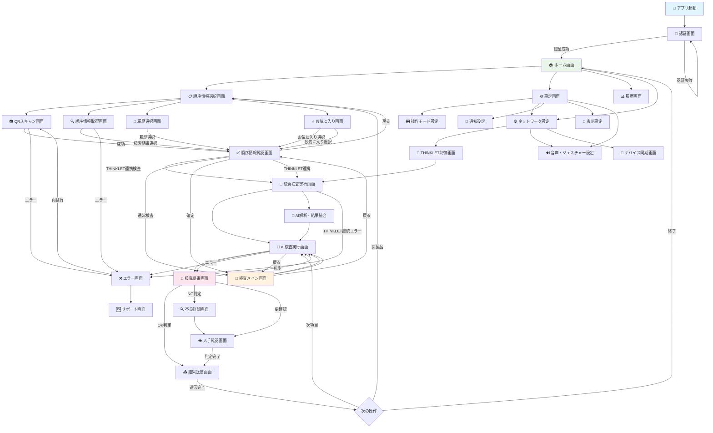

## 2.3.2. 画面遷移詳細仕様

**主要遷移パターン:**

| 遷移元画面       | 遷移先画面   | 遷移条件         | 遷移方法             | 物理ボタン対応   |
| ---------------- | ------------ | ---------------- | -------------------- | ---------------- |
| **ホーム**       | 順序情報選択 | 検査開始要求     | メインボタンタップ   | 中央ボタン       |
| **ホーム**       | THINKLET連携 | ウェアラブル連携 | THINKLETカードタップ | 上側面ボタン     |
| **順序情報選択** | QRスキャン   | QRスキャン選択   | QRカードタップ       | 右側面上ボタン   |
| **順序情報選択** | 順序情報取得 | サーバー連携選択 | サーバーカードタップ | 下側面ボタン     |
| **QRスキャン**   | 順序情報確認 | QR読み取り成功   | 自動遷移             | -                |
| **順序情報確認** | 検査メイン   | 順序情報確定     | 確定ボタンタップ     | 中央ボタン       |
| **順序情報確認** | 統合検査実行 | THINKLET連携検査 | 連携検査ボタンタップ | 上側面ボタン     |
| **THINKLET連携** | 統合検査実行 | デバイス接続済み | 連携開始ボタンタップ | 中央ボタン       |
| **統合検査実行** | 統合検査結果 | AI処理完了       | 自動遷移             | -                |
| **検査メイン**   | AI検査実行   | 検査開始         | 検査ボタンタップ     | 右側面上ボタン   |
| **AI検査実行**   | 検査結果     | AI処理完了       | 自動遷移             | -                |
| **統合検査結果** | 次項目       | 次項目移行       | 次項目ボタンタップ   | 右側面下ボタン   |
| **検査結果**     | 次項目       | 次項目移行       | 次項目ボタンタップ   | 右側面下ボタン   |
| **統合検査結果** | 結果送信     | 検査完了         | 送信ボタンタップ     | 中央ボタン長押し |
| **検査結果**     | 結果送信     | 検査完了         | 送信ボタンタップ     | 中央ボタン長押し |

**戻る操作の仕様:**

| 現在画面         | 戻る先画面   | 戻る条件     | 物理ボタン         |
| ---------------- | ------------ | ------------ | ------------------ |
| **順序情報選択** | ホーム       | 常時可能     | 左側面ボタン       |
| **QRスキャン**   | 順序情報選択 | 常時可能     | 左側面ボタン       |
| **順序情報確認** | 前画面       | 変更要求時   | 左側面ボタン       |
| **検査メイン**   | 順序情報選択 | 製品変更時   | 左側面ボタン長押し |
| **検査結果**     | 検査メイン   | 再検査要求時 | 左側面ボタン       |

## 2.3.3. 操作モード別画面遷移

**液晶画面操作モード:**
- タッチ操作による直感的な画面遷移
- スワイプジェスチャーによる高速遷移
- 長押し操作による詳細表示・設定画面

**物理ボタンモード:**
- 物理ボタンによる確実な画面遷移
- 誤操作防止のための確認ダイアログ
- 音声・振動フィードバックによる操作確認

## 2.3.4. 検査フロー詳細画面遷移

検査プロセスの詳細な画面遷移とデータフローを以下に示します：

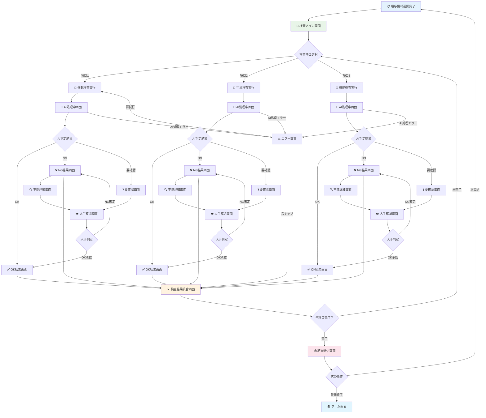

---

# 2.6. THINKLET統合検査画面設計（プラットフォーム対応）

## 2.6.1. THINKLET連携メイン画面（レスポンシブ対応）

ハンディターミナル・デスクトップアプリとTHINKLETウェアラブルデバイスの統合制御画面：

**プラットフォーム別THINKLET連携画面レイアウト:**

| プラットフォーム       | レイアウト構成             | 主要表示エリア                   | 操作方式最適化            |
| ---------------------- | -------------------------- | -------------------------------- | ------------------------- |
| **ハンディターミナル** | 画面サイズ適応型レイアウト | 状態表示優先・画面サイズ適応制御 | タッチ + 物理ボタン連動   |
| **デスクトップ**       | マルチペイン + サイドバー  | 統合監視・制御・設定の同時表示   | マウス + キーボード効率化 |

**THINKLET連携メイン画面の構成（ハイブリッド通信）:**

| 表示エリア                 | 配置位置     | 表示内容                               | 通信方式                | 更新頻度     |
| -------------------------- | ------------ | -------------------------------------- | ----------------------- | ------------ |
| **デバイス状態パネル**     | 画面上部     | THINKLET接続状態・バッテリー・装着状況 | 直接通信 + サーバー     | リアルタイム |
| **通信ステータス表示**     | 画面右上     | 直接通信・サーバー通信の個別状態       | 両方監視                | リアルタイム |
| **検査制御パネル**         | 画面中央     | 検査開始・停止・設定変更               | 直接実行 + サーバー記録 | 静的         |
| **AI解析結果表示**         | 画面下部     | 不良検出・信頼度・検査結果統合表示     | サーバー経由            | AI処理完了時 |
| **音声・ジェスチャー状況** | 右サイドバー | 音声コマンド認識・ジェスチャー検出状況 | 直接通信                | リアルタイム |
| **オフライン状態表示**     | 画面下部     | ネットワーク障害時のローカル動作状況   | 直接通信のみ            | 障害時のみ   |

## 2.6.2. 統合検査実行フロー（プラットフォーム適応）

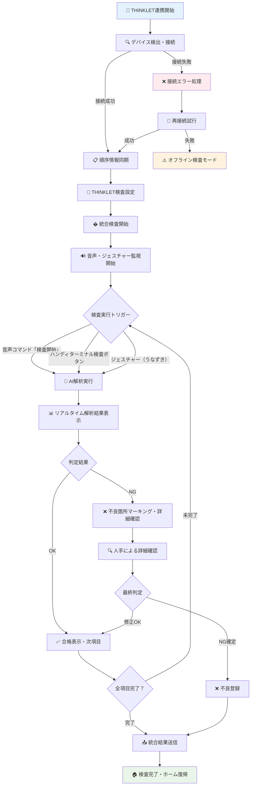

---

# 2.5. エラー・例外処理画面遷移

システムエラーや例外状況での画面遷移パターン：

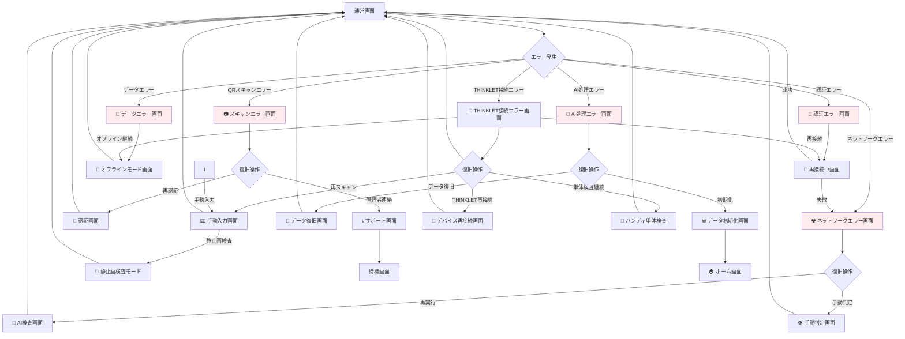

## 2.3.6. 設定・管理画面遷移

設定変更と管理機能の画面遷移パターン：

**注**: 統計・レポート機能はWebアプリケーションで提供されるため、端末アプリの設定画面には含まれません。

**メイン設定カテゴリ:**

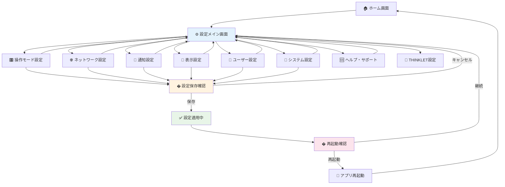

**主要設定項目の詳細:**

| 設定カテゴリ           | 詳細設定項目                                                     | 説明                                                                                       |
| ---------------------- | ---------------------------------------------------------------- | ------------------------------------------------------------------------------------------ |
| **🎛️ 操作モード設定**   | 📱 液晶画面設定<br>� 物理ボタン設定                               | タッチ感度・ジェスチャー設定<br>ボタン配置・押下感度設定                                   |
| **🌐 ネットワーク設定** | 📶 Wi-Fi設定<br>📡 モバイル設定<br>� VPN設定                       | Wi-Fi接続一覧・新規接続<br>モバイルデータ管理<br>セキュリティ通信設定                      |
| **🎨 表示設定**         | 🌓 テーマ設定<br>🔤 フォント設定<br>📏 レイアウト設定               | ライト・ダーク・高コントラスト<br>文字サイズ・フォント種類<br>画面構成カスタマイズ         |
| **🥽 THINKLET設定**     | 📱 デバイス接続設定<br>🔊 音声・ジェスチャー設定<br>🔋 電源管理設定 | ペアリング・接続優先順位<br>音声コマンド・ジェスチャー感度<br>バッテリー警告・省電力モード |
| **🔧 システム設定**     | 🔄 データ同期設定<br>💾 バックアップ設定<br>🗑️ データ管理           | サーバー同期設定<br>自動バックアップ設定<br>データ削除・工場リセット                       |
| **🆘 ヘルプ・サポート** | 📚 操作マニュアル<br>🎥 チュートリアル<br>📞 サポート               | オフライン操作ガイド<br>インタラクティブ学習<br>問題報告・FAQ・サポート連絡                |

## 2.3.7. 画面遷移パフォーマンス要件

**画面遷移速度目標:**

| 遷移パターン          | 目標時間 | 許容時間 | 最適化手法                 |
| --------------------- | -------- | -------- | -------------------------- |
| **ホーム→検査開始**   | <0.3秒   | <0.5秒   | プリロード・キャッシュ活用 |
| **QRスキャン→結果**   | <0.2秒   | <0.3秒   | 即座レスポンス・UI更新     |
| **検査実行→結果表示** | <1.0秒   | <2.0秒   | 非同期処理・進捗表示       |
| **設定変更→適用**     | <0.5秒   | <1.0秒   | バックグラウンド適用       |
| **エラー→復旧画面**   | <0.1秒   | <0.2秒   | 即座エラーハンドリング     |

**アニメーション仕様:**

| 遷移タイプ       | アニメーション時間 | イージング  | 物理ボタンモード対応 |
| ---------------- | ------------------ | ----------- | -------------------- |
| **スライド遷移** | 300ms              | ease-out    | 音声フィードバック   |
| **フェード遷移** | 200ms              | ease-in-out | 振動フィードバック   |
| **ズーム遷移**   | 250ms              | ease-in     | 音声+振動            |
| **エラー表示**   | 150ms              | ease-out    | 強振動アラート       |

---

# 3. メイン画面設計

### 3.1.1. ハンディターミナル特化レイアウト

ハンディターミナルの小画面と片手操作を考慮した専用UI設計：

**画面サイズ分類:**
- **Small Terminal** (3.5-4インチ): 800×480～1024×600
- **Medium Terminal** (4.5-5インチ): 1280×720～1280×800  
- **Large Terminal** (5.5-6インチ): 1920×1080～1920×1200

**レイアウトパターン:**

画面サイズに応じた適応的レイアウト設計：

| 画面サイズ分類      | レイアウト構成 | 表示内容                         |
| ------------------- | -------------- | -------------------------------- |
| **Small** (小画面)  | シングルビュー | 単一機能に集中、最小限の情報表示 |
| **Medium** (中画面) | リスト＋詳細   | メイン操作＋簡易詳細の組み合わせ |
| **Large** (大画面)  | 分割ビュー     | リスト表示＋詳細パネルの2分割    |

**レイアウト適応の仕組み:**
- **自動検出**: 画面サイズとデバイス向きを動的に検出
- **片手操作最適化**: 親指操作範囲内への重要ボタン配置
- **大きなタッチターゲット**: 最小44dp以上のタッチ領域確保
- **物理ボタン連携**: タッチ操作と物理ボタンのハイブリッド設計

### 3.1.2. メインインターフェース設計

**コンパクトメインインターフェース構成:**

ハンディターミナルの限られた画面領域を効率的に活用した設計：

| 領域名                 | 配置位置     | 主要機能                 | 表示情報                           |
| ---------------------- | ------------ | ------------------------ | ---------------------------------- |
| **ステータスバー**     | 画面最上部   | システム状態表示         | 電池残量・通信状態・時刻           |
| **操作モードバー**     | 上部2番目    | 操作モード表示・切替     | 現在モード・切替ボタン             |
| **アクションバー**     | 上部3番目    | 主要操作・ナビゲーション | 戻る・ホーム・メニュー・スキャン   |
| **メインコンテンツ**   | 中央可変領域 | 主要作業エリア           | 検査リスト・スキャン画面・結果表示 |
| **クイックアクション** | 下部固定     | 頻繁操作                 | スキャン・送信・設定・ヘルプ       |
| **物理ボタン連携**     | 側面・上部   | 重要操作の物理制御       | スキャン・決定・戻る・メニュー     |

**操作モードバー詳細設計:**

**液晶画面操作モード時の表示項目:**

| 表示項目           | 表示内容   | 配置位置 | 機能説明             |
| ------------------ | ---------- | -------- | -------------------- |
| **モードアイコン** | 📱 液晶操作 | 左端     | 現在の操作モード表示 |
| **設定ボタン**     | ⚙️          | 右端     | 設定画面へのアクセス |

**物理ボタンモード時の表示項目:**

| 表示項目           | 表示内容   | 配置位置 | 機能説明             |
| ------------------ | ---------- | -------- | -------------------- |
| **モードアイコン** | 🔘 物理操作 | 左端     | 現在の操作モード表示 |
| **設定ボタン**     | ⚙️          | 右端     | 設定画面へのアクセス |

**モード表示要素:**
- **現在モードアイコン**: 📱（液晶）/ 🔘（物理）
- **設定ボタン**: 詳細設定画面への遷移

**片手操作最適化（物理ボタン連携）:**
- **親指範囲内配置**: 重要なボタンを親指で届く範囲（画面下部1/3）に配置
- **物理ボタン補完**: ゴム手袋装着時は物理ボタンで主要操作を実行
- **大きなタッチターゲット**: 最小44dp、推奨48dp以上のタッチ領域
- **視認性向上**: 高コントラスト・大きなフォントサイズの採用

## 3.2. 検査管理UI

### 3.2.1. バーコード・QRスキャン画面

ハンディターミナルの主要機能であるスキャン機能の最適化設計：

**スキャン画面UI設計アプローチ:**

スキャン画面は、カメラプレビューを中心とした全画面レイアウトを採用し、操作モードに応じて最適化されたユーザーインターフェースを提供します。画面上にはスキャンガイドが重畳表示され、QRコードの正確な位置合わせを支援します。

**レイアウト構成:**
- **ベースレイヤー**: 全画面カメラプレビュー表示
- **オーバーレイ層**: スキャンガイド・UI要素の重畳表示
- **操作層**: モード別の操作インターフェース

**操作モード別UI調整:**

液晶画面操作モードでは、画面下部にタッチ操作可能なコントロールパネルを配置します。物理ボタンモードでは、物理ボタンの操作指示を明確に表示し、視覚的なガイダンスを強化します。

**スキャンガイド仕様:**
- **表示形式**: 緑色の角丸四角形フレーム
- **サイズ**: 200dp × 200dp（標準）
- **位置**: 画面中央配置
- **アニメーション**: 認識成功時の視覚フィードバック

**スキャン画面構成:**

| 表示要素             | 配置位置       | 表示内容                     | 機能                   |
| -------------------- | -------------- | ---------------------------- | ---------------------- |
| **カメラプレビュー** | 画面中央上部   | リアルタイム映像表示         | スキャン対象の視覚確認 |
| **スキャンガイド**   | プレビュー重畳 | ターゲット枠・ガイドライン   | 正確な位置合わせ支援   |
| **スキャン結果表示** | 画面中央下部   | 読み取り結果・製品の順序情報 | 即座の結果確認         |
| **アクションボタン** | 画面下部       | 決定・再スキャン・キャンセル | 次の操作への遷移       |
| **設定・ヘルプ**     | 画面隅         | カメラ設定・操作説明         | 環境に応じた調整       |

**デスクトップ専用カメラ設定:**
- **USBカメラ接続**: 複数USBカメラの自動検出・選択・切替
- **ネットワークカメラ接続**: RTSP/HTTP対応IPカメラの登録・接続
- **解像度・フレームレート設定**: 用途に応じた画質・性能最適化
- **カメラ制御**: ズーム・フォーカス・露出の手動調整
- **プレビューウィンドウ**: デスクトップ上での独立カメラプレビュー表示

**スキャン最適化機能:**
- **自動フォーカス**: 距離に応じた自動ピント調整
- **照明補正**: 環境光に応じた露出・コントラスト調整
- **振動フィードバック**: 成功時の触覚フィードバック
- **音声フィードバック**: 成功・失敗時の音声通知
- **物理ボタンスキャン**: 右側面上ボタン長押しでスキャン実行（過酷環境対応）

### 3.2.1-1. 順序情報取得機能統合

検査対象の順序情報（型式・機番・月連番等）取得のため、複数の取得方式に対応した統合機能：

**取得方式:**
- **QRスキャン**: カメラによるQRコード読み取り
- **手動入力**: キーボードによる直接入力
- **履歴選択**: 過去の検査履歴からの選択
- **一覧検索**: 製品データベースからの検索
- **タイトル**: 14sp・太字・機能名の明確表示
- **サブタイトル**: 12sp・グレー・補足説明
- **物理ボタン表示**: 10sp・青色・対応ボタンの表示

**順序情報取得方式:**

| 取得方式             | 主な用途                 | 操作方法             | 応答時間 | 精度  |
| -------------------- | ------------------------ | -------------------- | -------- | ----- |
| **QRコードスキャン** | 現場での順序情報即座特定 | QRコード読み取り     | <1秒     | 99.9% |
| **サーバー一覧**     | 順序情報表示・選択       | 条件入力・一覧選択   | 1-3秒    | 100%  |
| **履歴選択**         | 最近使用順序の再選択     | リストから選択       | <0.5秒   | 100%  |
| **お気に入り**       | 頻繁利用順序の快速選択   | ブックマークから選択 | <0.5秒   | 100%  |

**統合順序情報取得画面構成:**

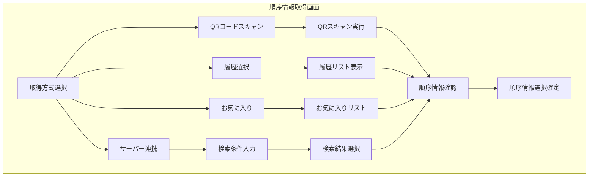

**順序情報検索インターフェース:**

| 検索項目       | 入力方式     | 検索演算子         | オートコンプリート |
| -------------- | ------------ | ------------------ | ------------------ |
| **製品名**     | テキスト入力 | 部分一致・前方一致 | ✅                  |
| **型式**       | テキスト入力 | 完全一致・部分一致 | ✅                  |
| **機番**       | テキスト入力 | 完全一致・範囲検索 | ✅                  |
| **指図番号**   | テキスト入力 | 完全一致・前方一致 | ✅                  |
| **指示番号**   | テキスト入力 | 完全一致・前方一致 | ✅                  |
| **生産年月日** | 日付選択     | 期間検索・単日検索 | -                  |
| **月連番**     | 数値入力     | 完全一致・範囲検索 | -                  |

### 3.2.1-2. 順序情報選択状態表示機能

選択中の順序情報を常時表示し、作業者が現在対象としている製品の順序情報を明確に把握できる機能：

**順序情報選択状態バー:**

| 表示要素                 | 配置位置          | 表示内容                               | 更新タイミング |
| ------------------------ | ----------------- | -------------------------------------- | -------------- |
| **順序情報識別情報**     | 画面最上部固定    | 型式・機番・月連番（太字・大きめ表示） | 順序情報選択時 |
| **製品基本情報**         | 上部固定（2行目） | 製品名・指図番号・指示番号             | 順序情報選択時 |
| **生産情報**             | 上部固定（3行目） | 生産年月日・作業者・ライン情報         | 順序情報選択時 |
| **検査進捗インジケータ** | 右端              | 完了済み検査数/総検査数                | 検査実行時     |
| **ステータスアイコン**   | 左端              | 選択状態・未選択・エラー状態           | 状態変更時     |

**順序情報表示の視覚設計構成:**

**第1行 - 識別情報表示:**
- ステータスアイコン（左端）
- 型式名（TYPE-ABC）
- 機番（MACH001）
- 月連番（#025）  
- 検査進捗（右端：3/5完了）

**第2行 - 製品基本情報:**
- 製品名（高精度センサーユニット）

**第3行 - 生産管理情報:**
- 指図番号（WO123456）
- 指示番号（INST789）
- 生産日（2025/08/09）

**製品選択状態管理:**

| 状態         | 表示色   | アイコン | 表示内容                           |
| ------------ | -------- | -------- | ---------------------------------- |
| **選択済み** | 緑色背景 | ✅        | 製品の順序情報詳細表示             |
| **未選択**   | 灰色背景 | ⚪        | "製品を選択してください"           |
| **選択中**   | 青色背景 | 🔄        | "製品の順序情報を取得中..."        |
| **エラー**   | 赤色背景 | ❌        | "製品の順序情報取得に失敗しました" |
| **期限切れ** | 黄色背景 | ⚠️        | "製品の順序情報の更新が必要です"   |

### 3.2.2. 検査実行画面

**検査実行インターフェース:**

スキャンした製品の検査実行を行う画面設計：

**主要機能:**
- **製品情報表示**: 型式・機番・月連番の表示
- **検査項目管理**: 進行中・完了・残り項目の管理
- **AI判定結果**: OK/NG判定・信頼度の表示
- **手動確認**: 人手による判定修正・コメント入力
- **アクション操作**: 次項目・完了・中断・やり直し

**製品順序情報ヘッダー設計:**

選択中の製品を常に表示し、検査対象を明確にする固定ヘッダー：

**ヘッダー表示項目の詳細構成:**

| 表示行    | 表示項目     | 表示内容例                                      | スタイル       |
| --------- | ------------ | ----------------------------------------------- | -------------- |
| **1行目** | タイトル     | 📦 現在の検査対象製品                            | 太字・背景色   |
| **2行目** | 製品識別情報 | 🏷️ TYPE-ABC / 🔧 MACH001 / 📝 #025                 | 大文字・太字   |
| **3行目** | 製品名       | 📋 高精度センサーユニット                        | 標準フォント   |
| **4行目** | 生産管理情報 | 📄 指図: WO123456 / 指示: INST789 / 📅 2025/08/09 | 小文字         |
| **5行目** | 検査進捗     | ✅ 検査進捗: 3/5項目完了 (60%)                   | プログレスバー |

**検査項目表示と進捗管理:**

| 検査項目状態   | 表示スタイル       | アイコン | 操作可能性   |
| -------------- | ------------------ | -------- | ------------ |
| **未実施**     | 灰色・通常フォント | ⚪        | 実行可能     |
| **実行中**     | 青色・太字         | 🔄        | 実行中表示   |
| **完了（OK）** | 緑色・取り消し線   | ✅        | 再実行可能   |
| **完了（NG）** | 赤色・太字         | ❌        | 再実行可能   |
| **要確認**     | 黄色・点滅         | ⚠️        | 確認要求     |
| **スキップ**   | 薄灰色・斜体       | ⏭️        | 再有効化可能 |

**製品切り替え機能:**

検査実行中でも別の製品に簡単に切り替えられる機能：

| 操作方法               | アクセス方法               | 注意事項                     |
| ---------------------- | -------------------------- | ---------------------------- |
| **ヘッダータップ**     | 製品順序情報ヘッダー長押し | 現在の検査状況確認ダイアログ |
| **クイック検索**       | フローティングボタン       | 検査データ一時保存           |
| **QRコード再スキャン** | カメラボタン               | 現在検査の中断確認           |
| **履歴選択**           | メニューから履歴選択       | 未完了検査の継続確認         |

**検査結果表示最適化:**

**UI構成と設計思想:**

検査結果画面は、AI判定結果の明確な表示と操作モードに応じた適切なユーザーインターフェースを提供します。画面全体を論理的な領域に分割し、情報の階層化と視認性を重視した設計とします。

**画面構成要素:**

| 表示領域         | 配置位置 | 表示内容                         | 操作モード対応             |
| ---------------- | -------- | -------------------------------- | -------------------------- |
| **結果ヘッダー** | 画面上部 | 検査項目名・実行時間・進捗       | 共通表示                   |
| **AI判定カード** | 上部中央 | OK/NG判定・信頼度・判定アイコン  | 色分け・大型アイコン表示   |
| **画像表示領域** | 中央部   | 検査対象画像・不良箇所ハイライト | 拡大表示・ピンチズーム対応 |
| **操作領域**     | 画面下部 | 次項目・再検査・確定ボタン       | モード別UI切替             |

**AI判定結果表示仕様:**

| 判定結果   | 表示色     | アイコン       | 背景色         | 音声フィードバック |
| ---------- | ---------- | -------------- | -------------- | ------------------ |
| **OK**     | 緑色       | チェックマーク | 薄緑背景       | 成功音             |
| **NG**     | 赤色       | バツマーク     | 薄赤背景       | 警告音             |
| **要確認** | オレンジ色 | 疑問符         | 薄オレンジ背景 | 通知音             |

**操作モード別UI調整:**

液晶画面操作モード時は、タッチボタンによる直感的な操作を提供します。物理ボタンモード時は、画面下部に物理ボタンの操作指示を明確に表示し、視覚的なガイダンスを強化します。

- **明確な判定表示**: 大きなOK/NGアイコンと色分け
- **詳細情報展開**: タップで詳細情報の段階的表示
- **音声読み上げ**: 結果の音声フィードバック（オプション）
- **履歴参照**: 過去の同製品検査結果の簡易表示

---

## 4.2. 製品の順序情報表示とリアルタイム管理

### 4.2.1. 製品選択状態の常時表示

**ヘッダー製品順序情報表示エリア:**

画面上部に固定表示される現在選択中の製品の順序情報：

**製品順序情報ヘッダーの表示構成:**

| 表示行    | 表示項目           | 表示内容例                                   | スタイル     |
| --------- | ------------------ | -------------------------------------------- | ------------ |
| **1行目** | 製品識別情報       | 📦 型式: ABC-123 / 機番: 456789 / 月連番: 001 | 太字・大文字 |
| **2行目** | 検査状態・生産情報 | ✅ 検査対象 / 📅 2024/01/15 / 🔧 ライン A       | 標準フォント |

**情報表示の優先順位と階層:**

| 優先度 | 情報項目          | 表示形式        | 条件           |
| ------ | ----------------- | --------------- | -------------- |
| **1**  | 型式 (Model)      | 太字・大文字    | 常時表示       |
| **2**  | 機番 (Serial)     | 中文字          | 常時表示       |
| **3**  | 月連番 (Sequence) | 中文字          | 常時表示       |
| **4**  | 検査状態          | アイコン+色分け | 状態変更時更新 |
| **5**  | 生産日            | 小文字          | 詳細表示時     |
| **6**  | 生産ライン        | 小文字          | 詳細表示時     |

**動的情報更新表示:**

- **選択変更アニメーション**: 製品切り替え時のフェードイン・アウト効果
- **状態変化インジケーター**: 検査完了項目の即座反映
- **同期状態表示**: サーバーとの同期状況を色とアイコンで表示

### 4.2.2. 進捗表示とナビゲーション

**検査進捗の視覚化:**

**進捗表示の構成要素:**

| 表示要素       | 表示内容               | 表示形式                    | 配置位置 |
| -------------- | ---------------------- | --------------------------- | -------- |
| **進捗バー**   | [■■■□□] 3/5 完了 (60%) | 塗りつぶしプログレスバー    | 上段     |
| **完了項目**   | ✅ 外観検査             | 緑チェックマーク + 項目名   | 中段左   |
| **実行中項目** | ⏳ 寸法測定             | 黄色時計アイコン + 項目名   | 中段中央 |
| **失敗項目**   | ❌ 機能検査             | 赤エラーアイコン + 項目名   | 中段右   |
| **未実行項目** | □ 梱包検査、□ 最終確認 | 空チェックボックス + 項目名 | 下段     |

**製品の順序表示とナビゲーション:**

ロット内での現在製品の位置を明確に表示：

| 表示項目       | 表示方法                | 操作                     |
| -------------- | ----------------------- | ------------------------ |
| **現在位置**   | "3/20" + プログレスバー | タップで一覧表示         |
| **前後製品**   | 左右スワイプ            | ダイレクト移動           |
| **ロット全体** | ミニマップ表示          | 任意製品への直接ジャンプ |

**クイックアクセス機能:**

- **最近の製品**: 履歴から即座選択
- **お気に入り**: よく検査する製品をブックマーク
- **問題製品**: NG履歴のある製品を優先表示

### 4.2.3. 製品の順序情報詳細表示機能

**展開可能な詳細パネル:**

基本情報から詳細情報への段階的展開：

**基本表示（常時表示）:**
- 表示項目: 型式: ABC-123 / 機番: 456789 / 月連番: 001
- 表示形式: 1行レイアウト、コンパクト表示

**詳細表示（タップ時展開）:**
- 型式・機番・月連番の詳細表示
- 生産日・ライン・ロット情報
- 指図番号・指示番号
- 品質管理情報


**コンテキスト連動情報:**

現在の検査段階に応じた関連情報の動的表示：

- **検査前**: 仕様書・図面・注意事項
- **検査中**: 基準値・測定ポイント・合格基準
- **検査後**: 結果履歴・改善提案・次工程情報

### 4.2.4. エラー・警告表示の統合

**製品関連警告の即座表示:**

| 警告レベル | 表示方法                 | 対応アクション           |
| ---------- | ------------------------ | ------------------------ |
| **緊急**   | 赤背景+点滅+音声アラート | 検査停止・管理者連絡     |
| **警告**   | 黄背景+アイコン          | 注意喚起・確認プロンプト |
| **情報**   | 青背景+通知ドット        | 情報確認・後で対応可能   |
| **成功**   | 緑背景+チェックマーク    | 正常完了・次ステップ案内 |

**製品固有の警告例:**

- **仕様変更通知**: "この型式は仕様変更されています (v2.1→v2.2)"
- **検査注意**: "過去にNG履歴あり - 重点チェック項目: 寸法精度"
- **期限警告**: "生産から7日経過 - 早期検査推奨"
- **ロット情報**: "同ロット内で3件のNG報告 - 慎重検査要"

## 4.3. 順序情報取得・選択機能の拡張

### 4.3.1. 統合順序情報取得インターフェース

**順序情報取得方式の統合UI設計:**

ハンディターミナルの小画面に最適化された統合順序情報取得画面：

**順序情報取得画面の詳細構成:**

| 画面エリア             | 表示内容                                   | 機能説明                     |
| ---------------------- | ------------------------------------------ | ---------------------------- |
| **画面タイトル**       | � 順序情報取得・選択                       | 画面の目的を明確に表示       |
| **取得方式ボタン群**   | QRスキャン、サーバー連携、履歴、お気に入り | 4つの主要な順序情報取得方法  |
| **クイック入力エリア** | 型式・機番・月連番を入力...                | 手動による直接入力フィールド |
| **最近使用製品リスト** | 製品一覧と使用時刻                         | 過去の検査履歴からの簡単選択 |

**最近使用製品リストの表示例:**
- ABC-123 / 456789 / 001 (2分前)
- DEF-456 / 789012 / 002 (5分前)  
- GHI-789 / 012345 / 003 (10分前)

**QRコードによる順序情報取得機能の拡張:**

| 機能                       | 説明                               | UI要素                 |
| -------------------------- | ---------------------------------- | ---------------------- |
| **インスタントスキャン**   | QRコード自動検出による順序情報取得 | フルスクリーンカメラ   |
| **マルチフォーマット対応** | QR・バーコード・DataMatrix対応     | 形式自動判定表示       |
| **照明制御**               | 自動・手動フラッシュ制御           | フラッシュトグルボタン |
| **位置ガイド**             | 最適スキャン位置の表示             | オーバーレイガイド     |
| **履歴保存**               | スキャン履歴の自動保存             | 履歴アクセスボタン     |

**順序情報取得機能の詳細:**

**段階的検索フィルター:**

**順序情報検索画面の構成:**

| 検索エリア       | 項目名                     | 入力形式                 | 説明                     |
| ---------------- | -------------------------- | ------------------------ | ------------------------ |
| **画面タイトル** | 🔎 順序情報検索             | 見出し表示               | 検索画面であることを明示 |
| **基本条件**     | 型式、機番、連番           | テキスト入力フィールド   | 主要な検索条件を入力     |
| **詳細条件**     | 生産日、ライン、状態       | 日付選択・ドロップダウン | 絞り込み条件を追加設定   |
| **操作ボタン**   | 検索実行、クリア、条件保存 | アクションボタン         | 検索の実行と条件管理     |

**基本条件入力項目:**
- 型式: ABC-___ (部分一致検索対応)
- 機番: ______ (数字入力)
- 連番: ___ (数字入力)

**詳細条件入力項目:**
- 生産日: 期間指定（開始日〜終了日）
- ライン: ドロップダウン選択
- 状態: ドロップダウン選択（すべて/検査済み/未検査等）

**順序情報検索結果表示の最適化:**

| 表示モード         | 用途                     | 情報密度 | 操作性     |
| ------------------ | ------------------------ | -------- | ---------- |
| **リスト表示**     | 多数の順序情報から選択   | 高       | スクロール |
| **カード表示**     | 詳細情報付きで比較選択   | 中       | スワイプ   |
| **テーブル表示**   | 数値データの比較         | 最高     | タップ     |
| **サムネイル表示** | 画像付き製品の視覚的選択 | 低       | グリッド   |

### 4.3.2. 履歴・お気に入り機能

**スマート履歴管理:**

使用頻度と時系列を組み合わせた最適化履歴表示：

| 履歴カテゴリ       | 表示基準             | 表示件数 | 並び順     |
| ------------------ | -------------------- | -------- | ---------- |
| **直近使用**       | 過去1時間以内        | 5件      | 時系列降順 |
| **本日頻用**       | 本日2回以上アクセス  | 3件      | 頻度順     |
| **週間レギュラー** | 過去1週間で3回以上   | 5件      | 頻度順     |
| **月間定番**       | 過去1ヶ月で週1回以上 | 10件     | 頻度順     |

**動的お気に入り機能:**

- **自動お気に入り**: 頻繁にアクセスする製品の自動登録
- **グループ分類**: プロジェクト・ライン別のお気に入りグループ
- **共有お気に入り**: チーム全体での共通お気に入り
- **期間限定**: 短期プロジェクト用の一時お気に入り

### 4.3.3. 予測・提案機能

**インテリジェント製品候補:**

作業コンテキストに基づく製品候補の自動提案：

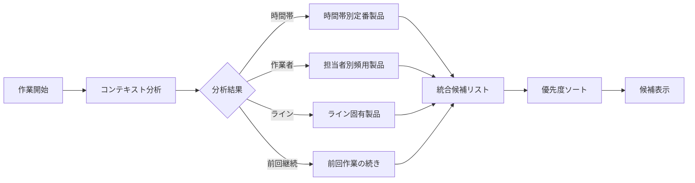

**学習型検索支援:**

- **入力補完**: 部分入力からの自動補完候補
- **類似製品**: 検索製品の類似品・関連品表示
- **代替案**: 在庫切れ・非対応時の代替製品提案
- **チーム学習**: 他のオペレーターの選択パターン学習

### 4.3.4. オフライン・同期機能

**ローカルキャッシュ戦略:**

| データカテゴリ       | キャッシュ期間 | 同期頻度           | オフライン動作     |
| -------------------- | -------------- | ------------------ | ------------------ |
| **基本製品順序情報** | 7日間          | 4時間毎            | 完全動作           |
| **検査履歴**         | 30日間         | 1時間毎            | 閲覧・更新可能     |
| **画像・図面**       | 3日間          | 手動・オンデマンド | キャッシュ済みのみ |
| **仕様書**           | 14日間         | 8時間毎            | 重要データのみ     |

**同期状態の可視化:**

**データ同期状況画面の構成:**

| 表示エリア       | 表示項目           | 表示内容例                   | 状態アイコン |
| ---------------- | ------------------ | ---------------------------- | ------------ |
| **画面タイトル** | 📊 データ同期状況   | 同期管理画面であることを表示 | -            |
| **製品マスタ**   | 同期状態と更新時刻 | ✅ 2分前更新 (1,234件)        | ✅ 最新       |
| **検査履歴**     | 同期進行状況       | 🔄 同期中... (45%)            | 🔄 同期中     |
| **画像データ**   | 最終更新時刻と状態 | ⚠️ 6時間前 (要更新)           | ⚠️ 古い       |
| **操作ボタン**   | 同期制御           | 今すぐ同期、同期設定         | -            |

**同期状態インジケーター:**
- 🔄 同期中: リアルタイム同期実行中
- ✅ 最新: データが最新状態
- ⚠️ 古い: データ更新が必要
- ❌ 未接続: サーバー接続エラー

## 4.4. データ統合とリアルタイム同期

### 4.4.1. 製品の順序情報のリアルタイム管理

**製品の順序情報の一元管理アーキテクチャ:**

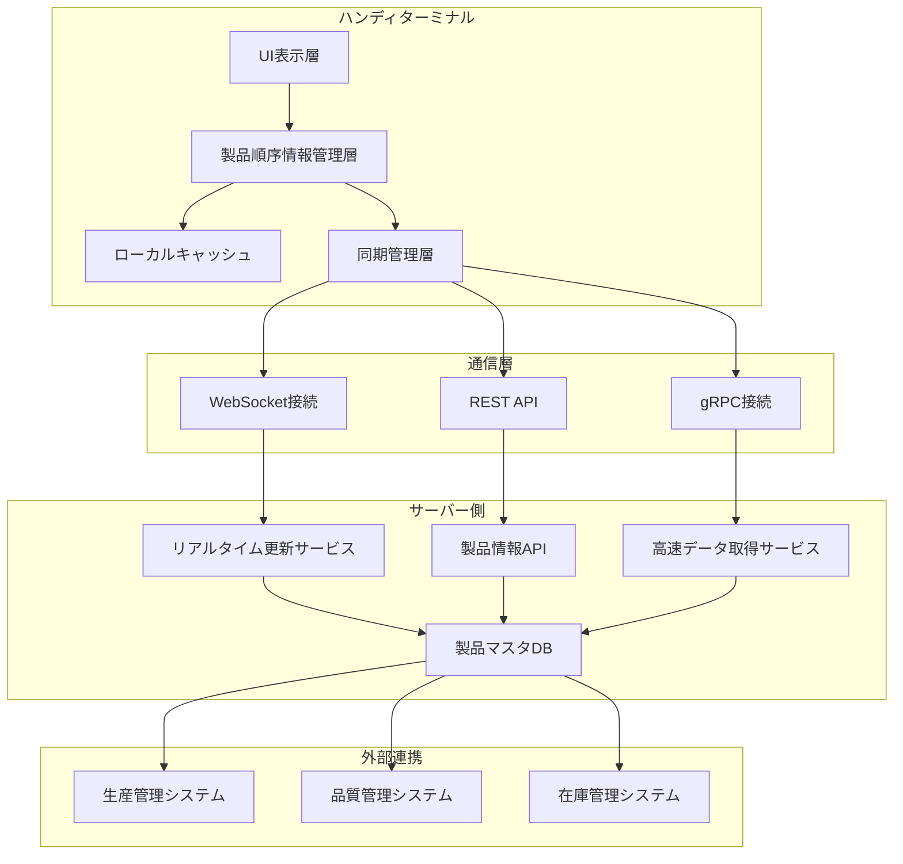

**データ整合性の保証:**

| データ種別           | 整合性レベル     | 更新方式         | 競合解決方法       |
| -------------------- | ---------------- | ---------------- | ------------------ |
| **製品基本情報**     | 強整合性         | 即座同期         | サーバー側優先     |
| **検査進捗状況**     | 結果整合性       | バッチ同期       | タイムスタンプ比較 |
| **製品選択状態**     | セッション整合性 | リアルタイム同期 | 最終操作者優先     |
| **履歴・お気に入り** | 弱整合性         | 定期同期         | マージ処理         |

### 4.4.2. 状態管理の詳細設計

**製品選択状態のライフサイクル管理:**

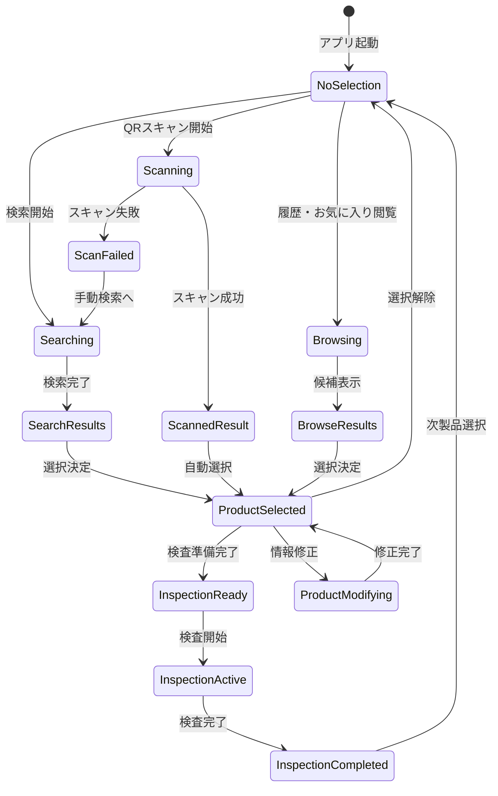

**状態変更イベントの管理:**

| イベント種別               | トリガー条件           | 影響範囲           | 通知方法             |
| -------------------------- | ---------------------- | ------------------ | -------------------- |
| **ProductSelected**        | 製品選択決定           | 全UI要素           | 即座UI更新           |
| **ProductInfoUpdated**     | サーバーからの情報更新 | 詳細情報表示エリア | バックグラウンド更新 |
| **InspectionStateChanged** | 検査状態変更           | 進捗表示・ヘッダー | リアルタイム反映     |
| **SyncStatusChanged**      | 同期状態変更           | 同期インジケーター | 状態アイコン更新     |
| **ErrorOccurred**          | エラー発生             | エラー表示エリア   | 警告表示・音声通知   |

### 4.4.3. パフォーマンス最適化

**レスポンス時間の目標値:**

| 操作種別             | 目標時間 | 許容時間 | 最適化手法         |
| -------------------- | -------- | -------- | ------------------ |
| **QRスキャン認識**   | <50ms    | <100ms   | ローカル処理最適化 |
| **製品情報表示**     | <100ms   | <300ms   | キャッシュ活用     |
| **検索結果表示**     | <200ms   | <500ms   | インデックス最適化 |
| **詳細情報読み込み** | <300ms   | <1秒     | 非同期ローディング |
| **サーバー同期**     | <500ms   | <2秒     | 差分同期・圧縮通信 |

**メモリ使用量の最適化:**

| データ種別         | 保持期間     | メモリ使用量上限 | クリーンアップ条件     |
| ------------------ | ------------ | ---------------- | ---------------------- |
| **アクティブ製品** | セッション中 | 50MB             | セッション終了時       |
| **検索キャッシュ** | 1時間        | 30MB             | 時間経過・メモリ不足時 |
| **画像キャッシュ** | 30分         | 100MB            | LRU方式クリーンアップ  |
| **履歴データ**     | 7日間        | 20MB             | 古いデータ自動削除     |

### 4.4.4. エラーハンドリングと復旧

**エラー分類と対応戦略:**

| エラーカテゴリ         | 検出方法               | 自動復旧           | ユーザー対応             | 物理ボタン操作              |
| ---------------------- | ---------------------- | ------------------ | ------------------------ | --------------------------- |
| **ネットワークエラー** | 通信タイムアウト       | 自動リトライ(3回)  | オフライン継続・手動同期 | 下側面ボタンで再接続        |
| **データ不整合**       | 整合性チェック         | サーバー再取得     | 確認ダイアログ表示       | 中央ボタンで確認/キャンセル |
| **QRスキャンエラー**   | 読み取り失敗・無効形式 | 再スキャン促進     | 手動入力切り替え         | 右側面上ボタンで再スキャン  |
| **認証エラー**         | トークン無効・権限不足 | 自動ログイン試行   | 認証画面表示             | 左側面ボタンでメニュー      |
| **ストレージ不足**     | 容量監視               | 古いデータ自動削除 | 容量警告・手動クリア     | 右側面下ボタンで削除確認    |

**復旧処理の優先順位:**

1. **緊急復旧**: 検査継続に必要な最小限データの確保
2. **段階復旧**: 段階的なデータ復元・機能回復
3. **完全復旧**: 全機能・全データの正常状態復帰
4. **予防対策**: 再発防止のための設定・プロセス改善

## 4.5. ユーザーエクスペリエンス設計

### 4.5.1. 順序情報選択からの統合ワークフロー

**拡張された検査ワークフロー（物理ボタン対応）:**

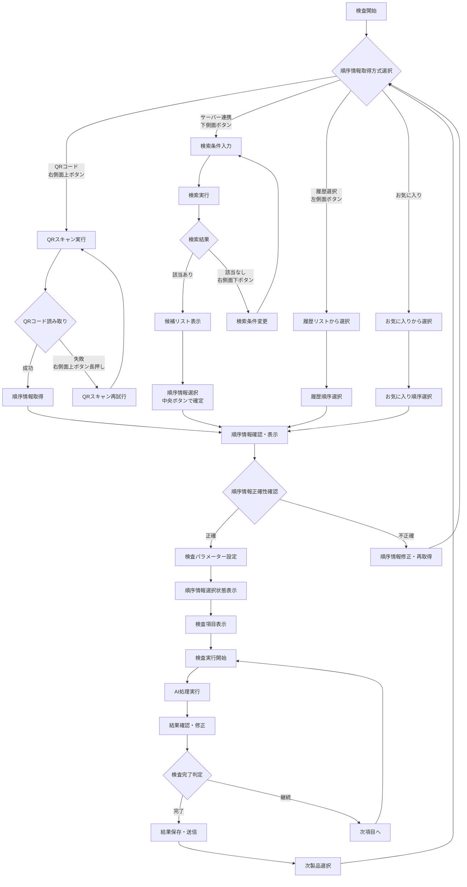

### 4.5.2. 検査状態管理の詳細化

**検査状態とUI表示の対応（物理ボタン対応）:**

| 状態名称                 | 前提条件             | 次状態候補           | 表示内容                       | 物理ボタン操作           |
| ------------------------ | -------------------- | -------------------- | ------------------------------ | ------------------------ |
| **IDLE**                 | アプリ起動完了       | 製品情報取得開始     | "製品を選択してください"       | 中央ボタンで選択開始     |
| **PRODUCT_SELECTION**    | 取得方式選択完了     | 各取得方式実行       | "製品情報を取得中..."          | 左右ボタンで方式切替     |
| **QR_SCANNING**          | QRスキャン開始       | QR読み取り完了・失敗 | QRスキャン画面表示             | 右側面上ボタンでスキャン |
| **SERVER_SEARCHING**     | 検索条件入力完了     | 検索結果取得・失敗   | "サーバーを検索中..."          | 下側面ボタンで検索実行   |
| **PRODUCT_CONFIRMING**   | 製品情報取得完了     | 確認完了・修正要求   | 製品情報確認画面表示           | 中央ボタンで確認完了     |
| **PRODUCT_IDENTIFIED**   | 製品確認完了         | 検査パラメーター設定 | 選択製品情報ヘッダー表示       | 右側面下ボタンで設定進行 |
| **INSPECTION_READY**     | パラメーター設定完了 | 検査開始             | 検査項目リスト表示             | 中央ボタンで検査開始     |
| **IN_PROGRESS**          | 検査実行中           | AI処理完了           | 進捗表示・実行中アニメーション | 物理ボタンで一時停止可能 |
| **AI_COMPLETED**         | AI処理完了           | 人手確認開始         | AI判定結果表示                 | 中央ボタンで確認開始     |
| **HUMAN_REVIEW**         | 人手確認中           | 最終判定完了         | 確認画面・修正インターフェース | 左右ボタンで判定選択     |
| **ITEM_COMPLETED**       | 単項目完了           | 次項目・全完了判定   | 完了マーク・進捗更新           | 右側面下ボタンで次項目   |
| **INSPECTION_COMPLETED** | 全項目完了           | 結果保存・次製品選択 | 完了サマリー表示               | 中央ボタンで保存完了     |

### 4.5.3. エラー状態への対応拡張

**エラー状態と復旧フロー（物理ボタン対応）:**

| エラー状態                | 発生条件                   | 復旧方法                   | ユーザー操作                     | 物理ボタン操作                 |
| ------------------------- | -------------------------- | -------------------------- | -------------------------------- | ------------------------------ |
| **QR_DECODE_FAILED**      | QRコード読み取り失敗       | 再スキャン・手動入力       | 位置調整・照明改善・検索切替     | 右側面上ボタンで再スキャン     |
| **PRODUCT_NOT_FOUND**     | 製品の順序情報未登録・無効 | 手動検索・順序情報登録要求 | 順序情報取得・管理者連絡         | 下側面ボタンで手動検索         |
| **SEARCH_NO_RESULTS**     | 検索条件に該当なし         | 検索条件緩和・別方式選択   | 条件変更・QRコード利用           | 右側面下ボタンで条件変更       |
| **NETWORK_ERROR**         | サーバー接続失敗           | オフライン対応・再試行     | ローカルキャッシュ利用           | 下側面ボタンで再接続           |
| **PRODUCT_INFO_OUTDATED** | 製品の順序情報が古い       | サーバー再同期             | 情報更新・継続確認               | 中央ボタンで更新確認           |
| **VALIDATION_FAILED**     | 製品の順序情報整合性エラー | データ検証・修正           | 手動修正・管理者エスカレーション | 左側面ボタンでメニューから修正 |

### 4.5.4. ワークフロー最適化機能

**効率化機能の詳細:**

- **製品情報キャッシュ**: 頻繁にアクセスする製品情報の高速表示
- **スマート候補**: 使用履歴に基づく製品候補の優先表示
- **作業継続支援**: 中断した検査の自動復元
- **エラー予防**: 無効な製品選択の事前検出
- **基本効率表示**: 製品選択・検査実行時間の基本表示（詳細分析はWebアプリ）

**学習機能による改善:**

| 学習項目           | データソース         | 改善効果               | 反映方法             |
| ------------------ | -------------------- | ---------------------- | -------------------- |
| **検索パターン**   | 検索履歴・選択結果   | 候補の精度向上         | 検索順位調整         |
| **操作効率**       | 操作時間・エラー頻度 | インターフェース最適化 | UI改善提案           |
| **製品選択傾向**   | 選択頻度・時間帯     | 予測候補精度向上       | 推奨リスト更新       |
| **エラーパターン** | エラー発生・復旧履歴 | 予防措置強化           | 警告・ガイダンス改善 |

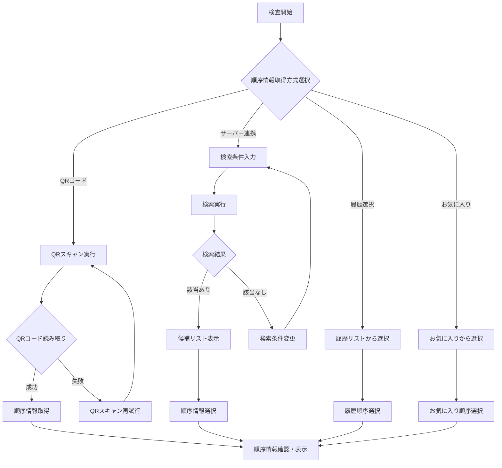

---

# 4. 運用・メンテナンス機能

## 4.1. ユーザビリティ最適化

### 4.1.1. アクセシビリティ対応

工場環境での多様な作業者に配慮したアクセシビリティ機能：

**視覚的アクセシビリティ:**
- **高コントラスト表示**: 工場照明下での視認性確保
- **大きな文字サイズ**: 最小16sp、推奨18sp以上
- **色覚対応**: 色だけに依存しない情報伝達
- **明度調整**: 環境光に応じた自動調整

**操作アクセシビリティ:**
- **大きなタッチターゲット**: 確実な操作のための十分なサイズ
- **音声フィードバック**: 成功・失敗・警告の音声通知
- **振動フィードバック**: 触覚による操作確認
- **ジェスチャー操作**: スワイプ・長押しによる快速操作

### 4.1.2. 多言語対応

国際的な製造環境に対応した多言語インターフェース：

**対応言語:**
- **基本対応**: 日本語、英語
- **拡張対応**: 中国語、韓国語、ドイツ語、スペイン語

**言語切替機能:**
- **自動検出**: システム言語の自動適用
- **手動切替**: 設定画面からの即座切替
- **混在表示**: 技術用語は英語、操作は現地語

### 4.1.3. カスタマイズ機能

各工場・作業者の要求に応じたインターフェースカスタマイズ：

**表示カスタマイズ:**
- **テーマ選択**: ダーク・ライト・高コントラスト
- **レイアウト変更**: ボタン配置・画面構成の調整
- **情報密度**: 表示項目・詳細レベルの選択

**操作カスタマイズ:**
- **操作モード設定**: 液晶画面・物理ボタンの選択
- **ショートカット設定**: 頻用機能への快速アクセス
- **ジェスチャー設定**: カスタムジェスチャーの定義
- **音声・振動**: フィードバック強度・種類の調整

**操作モード詳細設定:**

| 設定項目             | 設定内容               | 選択肢                         |
| -------------------- | ---------------------- | ------------------------------ |
| **デフォルトモード** | 起動時の初期操作モード | 液晶画面・物理ボタン・前回状態 |

**操作モード設定画面:**

**設定画面の構成要素:**

| 設定セクション       | 設定項目                         | 選択肢・設定方法                 |
| -------------------- | -------------------------------- | -------------------------------- |
| **画面タイトル**     | ⚙️ 操作モード設定                 | 設定画面であることを明示         |
| **デフォルトモード** | 起動時の初期操作モード選択       | ラジオボタン（液晶・物理）       |
| **モード切替方法**   | 手動でのモード切替操作方法       | チェックボックス（複数選択可能） |
| **操作ボタン**       | 設定の保存・リセット・キャンセル | アクションボタン                 |

**モード切替方法の選択肢:**
- 画面上部タップ: 操作モードバーのタップで切替
- 物理ボタン同時押し: 複数ボタン同時操作で切替
- 設定画面から: 設定メニューからの手動切替

## 4.2. 教育・サポート機能

### 4.2.1. オンボーディング

新規作業者向けの段階的な操作習得支援：

**初回セットアップガイド:**
1. **デバイス設定**: ネットワーク・権限・基本設定
2. **機能説明**: 主要機能の概要説明
3. **実習モード**: 安全な環境での操作練習
4. **習熟度確認**: 基本操作の理解度テスト

**インタラクティブチュートリアル:**
- **ステップバイステップ**: 実際の画面での操作案内
- **進捗追跡**: 学習進捗の可視化
- **繰り返し学習**: 理解不足部分の重点学習
- **実作業連携**: 実際の業務での段階的サポート

### 4.2.2. ヘルプ・サポート機能

作業中の疑問・問題に対するリアルタイム支援：

**文脈依存ヘルプ:**
- **画面別ヘルプ**: 現在の操作に関連する説明
- **エラー解決**: 発生したエラーの具体的な対処法
- **FAQ検索**: よくある質問の即座検索
- **動画ガイド**: 操作手順の動画説明

**サポート連絡機能:**
- **問題報告**: スクリーンショット付きの問題報告
- **チャットサポート**: リアルタイムでの技術支援
- **リモート支援**: 画面共有による遠隔サポート
- **エスカレーション**: 複雑な問題の上位者連絡

---

# 5. 品質・性能要件

## 5.1. パフォーマンス要件

### 5.1.1. 応答性能要件

**操作応答時間目標:**

| 操作種別           | 目標時間 | 許容時間 | 測定条件           |
| ------------------ | -------- | -------- | ------------------ |
| **QRスキャン認識** | <1秒     | <2秒     | 標準的な工場照明下 |
| **製品情報表示**   | <0.5秒   | <1秒     | ローカルキャッシュ |
| **検索結果表示**   | <2秒     | <5秒     | 順序情報取得時     |
| **画面遷移**       | <0.3秒   | <0.5秒   | アニメーション含む |
| **データ同期**     | <10秒    | <30秒    | 差分同期実行時     |

### 5.1.2. 安定性要件

**システム安定性指標:**

| 指標                 | 目標値       | 測定期間 | 対応措置                     |
| -------------------- | ------------ | -------- | ---------------------------- |
| **アプリクラッシュ** | <0.1%        | 月次     | 自動エラー報告・修正リリース |
| **応答無し**         | <0.5%        | 週次     | パフォーマンス監視・最適化   |
| **データ損失**       | 0%           | 継続監視 | 自動バックアップ・復旧機能   |
| **メモリリーク**     | 検出時即修正 | 継続監視 | メモリ使用量監視・アラート   |

## 5.2. セキュリティ要件

### 5.2.1. データ保護

**機密性保護:**
- **暗号化**: AES-256による保存データ暗号化
- **通信保護**: TLS 1.3による通信暗号化
- **アクセス制御**: ロールベースアクセス制御（RBAC）
- **監査ログ**: 全データアクセスの記録・監視

**完全性保証:**
- **デジタル署名**: 重要データの改ざん検出
- **チェックサム**: ファイル転送時の整合性確認
- **バージョン管理**: データ変更履歴の追跡
- **バックアップ**: 定期的なデータバックアップ

### 5.2.2. 認証・認可

**認証強化:**
- **多要素認証**: パスワード + 生体認証
- **セッション管理**: 適切なタイムアウト設定
- **不正ログイン検出**: 異常アクセスパターンの監視
- **アカウントロック**: 連続失敗時の自動ロック

**権限管理:**
- **最小権限の原則**: 必要最小限の権限付与
- **動的権限制御**: 時間・場所による権限変更
- **権限継承**: 組織階層に基づく権限設計
- **監査証跡**: 権限変更・使用の完全記録

---

# 6. 保守・運用

## 6.1. 監視・分析

**注**: 詳細な統計分析・レポート生成・高度な品質分析はWebアプリケーションで実施されます。端末アプリでは基本的な監視データの収集と表示のみを行います。

### 6.1.1. 使用状況監視（基本データ収集）

**基本監視項目:**
- **操作パターン**: 基本的な操作ログの記録
- **エラー記録**: 発生したエラーの基本記録
- **所要時間**: 各作業の実行時間記録
- **システム状況**: 基本的なシステム情報収集

**性能監視:**
- **応答時間**: 基本的な応答性能記録
- **リソース使用**: CPU・メモリ・ストレージ使用状況記録
- **ネットワーク**: 通信品質・エラー率の記録
- **バッテリー**: 消費電力パターンの記録

### 6.1.2. データ送信と基本表示

**データ収集・送信:**
- **サーバー送信**: 収集した監視データをWebアプリへ送信
- **ローカル保存**: ネットワーク障害時の一時保存
- **同期機能**: 回復時の自動データ同期
- **プライバシー**: 必要最小限のデータのみ収集

**基本表示機能:**
- **ステータス表示**: 現在の動作状況の基本表示
- **履歴表示**: 最近の操作履歴の簡易表示
- **エラー表示**: 発生したエラーの基本情報表示
- **Webアプリ連携**: 詳細分析へのWebアプリリンク表示
- **改善実装**: フィードバックに基づく継続的な機能改善

---

# 7. まとめ

## 7.1. 設計価値の実現

本設計書により実現される主要価値：

### 7.1.1. 検査作業効率化
- **片手操作最適化**: 工場環境での直感的操作
- **順序情報取得統合**: QRコードスキャンとサーバー連携による柔軟な順序情報特定
- **リアルタイム進捗**: 検査状況の即座把握・共有

### 7.1.2. 堅牢性・信頼性
- **オフライン対応**: ネットワーク不安定環境での業務継続
- **エラー回復**: 自動回復機能による稼働率向上
- **データ保護**: 暗号化・バックアップによる情報資産保護

### 7.1.3. 拡張性・保守性
- **プラットフォーム統一**: 複数OS対応による導入柔軟性
- **モジュール設計**: 機能追加・変更の容易性
- **運用支援**: 監視・分析による継続的改善

## 7.2. 技術実装詳細

**操作モード切替技術仕様:**

| 技術要素           | 実装方法             | 検出精度・応答時間     |
| ------------------ | -------------------- | ---------------------- |
| **タッチ感圧検出** | 容量性タッチセンサー | 感圧レベル検出: <100ms |
| **接触面積測定**   | マルチタッチ面積解析 | 面積変化検出: <50ms    |
| **照度センサー**   | フォトダイオード     | 照度変化検出: <200ms   |
| **加速度センサー** | 3軸加速度計（MEMS）  | 振動検出: <10ms        |
| **バッテリー監視** | 内蔵バッテリー管理IC | 残量更新: 30秒間隔     |
| **モード切替処理** | 状態管理システム     | モード変更: <300ms     |

**センサー統合判定アルゴリズム:**

操作モード検出機能は、複数のセンサー情報を統合して最適なモードを自動選択します。アルゴリズムは以下の要素を総合的に評価します：

**判定要素とスコア算出:**
- **環境スコア**: 照度・振動レベルから算出（0.0-1.0）
- **バッテリースコア**: 残量・省電力要求から算出（0.0-1.0）

**モード選択ロジック:**
1. 環境スコア > 0.6 → 物理ボタンモード推奨  
2. バッテリースコア > 0.8 → 省電力モード
3. その他 → 液晶画面操作モード（デフォルト）

**Kotlin Multiplatform + Compose Multiplatform実装詳細**: `docs/0300_設計_アプローチ1/0310_KotlinMultiplatformアプリ設計.md` を参照

**プラットフォーム対応:**
- **共通モジュール**: Kotlin Multiplatform（ビジネスロジック・データレイヤー）
- **UI層**: Compose Multiplatform（統一UI実装）
- **プラットフォーム固有**: センサー制御・ハードウェア連携

**Compose Multiplatform UI設計原則:**

操作モード切替機能は、以下の設計原則に基づいて実装されます：

**UI要素の配置:**
- **横配置レイアウト**: 画面幅全体を活用した左右配置
- **テキスト表示**: 現在モードをアイコンと文字で明示
- **切替スイッチ**: 自動モードの有効・無効を直感的に操作

**表示仕様:**
- **モード表示**: 液晶操作（�）、物理操作（🔘）、自動（🔄）のアイコン表示
- **切替UI**: トグルスイッチによる自動モード制御
- **レスポンシブ**: 8dpの適切なパディングとフルワイズ配置

**API・データベース設計詳細**: 
- API設計: `docs/0300_設計_アプローチ1/0304_API設計.md`
- データベース設計: `docs/0300_設計_アプローチ1/0303_データベース設計.md`

このUI/UX設計により、ハンディターミナルアプリケーションは工場現場での効率的な検査管理業務を実現し、特に製品情報の確実な特定・表示による作業品質向上を提供します。

**Linux Embedded:**
- **ディストリビューション**: Ubuntu Core 20 LTS 以上
- **デスクトップ環境**: 軽量WM (Openbox等)

# 7. まとめ

本ハンディターミナルアプリ設計書では、Kotlin MultiplatformとCompose Multiplatformを活用した統一的な検査管理アプリケーションの実現方針を示しました。

## 7.1. 主要な特徴

1. **Kotlin Multiplatform + Compose Multiplatform**: 85%以上のコード共有率（ビジネスロジック + UI）
2. **統一UI実装**: Compose Multiplatformによる一貫したUX体験
3. **1対1 THINKLET連携**: 専用THINKLETデバイスとの密接な制御・監視
4. **小画面最適化**: ハンディターミナル特有の小画面を活用したUI/UX設計
5. **検査作業特化**: バーコード・QRスキャンと即座の検査実行
6. **オフライン対応**: ネットワーク制約下での業務継続性
7. **堅牢性**: 工場環境での耐久性と安定動作
8. **物理操作性**: 過酷環境でも確実な操作が可能
9. **操作モード切替**: 液晶画面・物理ボタンの手動切り替え

## 7.2. 実現される価値

- **開発効率化**: Kotlin Multiplatform + Compose Multiplatformによる高いコード共有率
- **統一UX体験**: 全プラットフォームで一貫したユーザーインターフェース
- **1対1制御**: 専用THINKLETとの密接な連携による最適化された検査体験
- **検査作業効率化**: 片手操作による効率的な検査作業
- **即座の情報入力**: その場でのデータ記録と送信
- **ポータブル運用**: 移動しながらの柔軟な作業実行
- **高信頼性**: オフライン対応による業務継続性
- **スケーラビリティ**: 将来的な機能拡張への対応
- **工業環境対応**: 過酷環境での確実な物理ボタン操作
- **保守性向上**: 共通コードベースによる保守コスト削減
- **ネットワーク負荷分散**: Wi-Fi Directブリッジによるアクセスポイント負荷軽減
- **通信安定性**: 有線LAN活用による高速・安定データ転送
- **移動作業対応**: ハンドオーバー・フォールバック機能による接続継続

**注**: 複数デバイスの統合監視・統計分析・ライン管理機能は、別途Webアプリケーションで提供されることで、明確な役割分担を実現します。

## 7.3. 物理ボタン操作サマリー

### 7.3.1. ボタン配置と基本機能

| ボタン位置   | 基本機能       | 主要操作                     |
| ------------ | -------------- | ---------------------------- |
| **中央**     | 確認・決定     | 各種確認・選択確定           |
| **右側面上** | スキャン       | QRコード読み取り・再スキャン |
| **右側面下** | 進行・次項目   | 次項目移動・設定変更         |
| **左側面**   | メニュー・戻る | メニュー表示・前画面戻り     |
| **下側面**   | 接続・検索     | サーバー接続・検索実行       |

### 7.3.2. 操作フローでの物理ボタン活用

**順序情報取得時:**
- 右側面上ボタン：QRスキャン実行
- 下側面ボタン：サーバー連携実行
- 左側面ボタン：履歴・メニューアクセス
- 中央ボタン：選択確定

**検査実行時:**
- 中央ボタン：検査開始・結果確認
- 右側面下ボタン：次項目移行
- 左右ボタン：判定選択（OK/NG）

**エラー対応時:**
- 各ボタンによる迅速な復旧操作
- タッチスクリーンが使用困難な状況での確実な操作継続

### 7.3.3. 操作モード切替機能

**モード切替方法:**
- **画面操作**: 上部モードバーのタップ
- **物理ボタン**: 左側面上+下ボタン同時長押し（3秒）

**モード別特徴:**

| 操作モード         | 主な用途               | 切替トリガー |
| ------------------ | ---------------------- | ------------ |
| **液晶画面モード** | 精密操作・詳細情報表示 | 手動選択     |
| **物理ボタン**     | 過酷環境での確実操作   | 手動選択     |

## 7.4. アーキテクチャサマリー

**Kotlin Multiplatform + Compose Multiplatformによるクロスプラットフォーム対応:**

| プラットフォーム  | UI実装                | 固有機能                                           | コード共有率 |
| ----------------- | --------------------- | -------------------------------------------------- | ------------ |
| **Android**       | Compose Multiplatform | カメラAPI・センサー制御                            | 85%          |
| **iOS**           | Compose Multiplatform | カメラKit・Core Motion                             | 85%          |
| **Windows**       | Compose Multiplatform | WinRT Camera・USB/ネットワークカメラ・Wi-Fi Direct | 85%          |
| **macOS**         | Compose Multiplatform | AVFoundation・USB/ネットワークカメラ・Wi-Fi Direct | 85%          |
| **Linux**         | Compose Multiplatform | V4L2・USB/ネットワークカメラ・Wi-Fi Direct         | 85%          |
| **Linux組み込み** | Compose Multiplatform | V4L2・I2C制御                                      | 85%          |

**レイヤー構成:**

**アーキテクチャ構成:**

**階層化アーキテクチャの構成:**

| アーキテクチャ層           | 技術スタック          | 責務                     |
| -------------------------- | --------------------- | ------------------------ |
| **統一UI実装層**           | Compose Multiplatform | 全プラットフォーム共通UI |
| **共通ビジネスロジック層** | Kotlin Multiplatform  | 業務ロジック・データ処理 |
| **プラットフォーム固有層** | Native Platform APIs  | ハードウェア制御・OS連携 |

このハンディターミナルアプリケーションにより、ImageFlowCanvasシステムは現場での検査管理をより効率的かつ迅速に実現し、製造業のDX推進に大きく貢献することができます。
