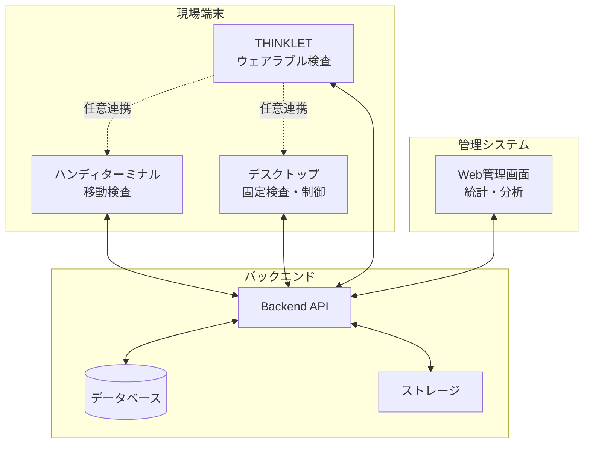
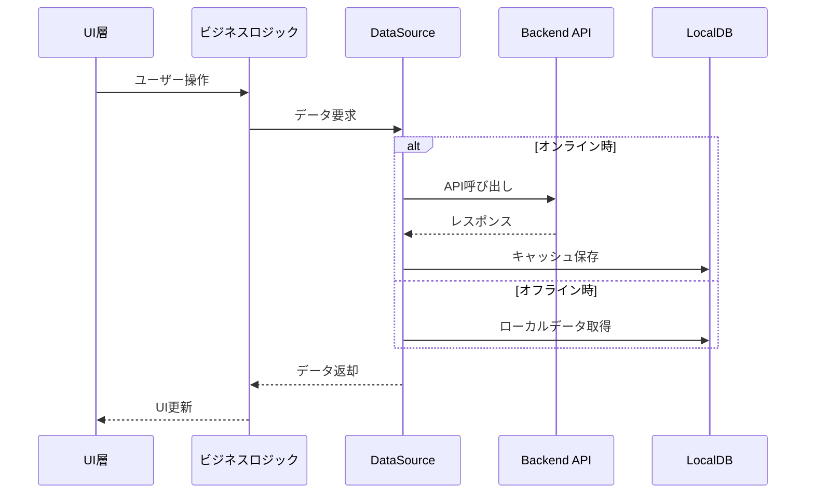
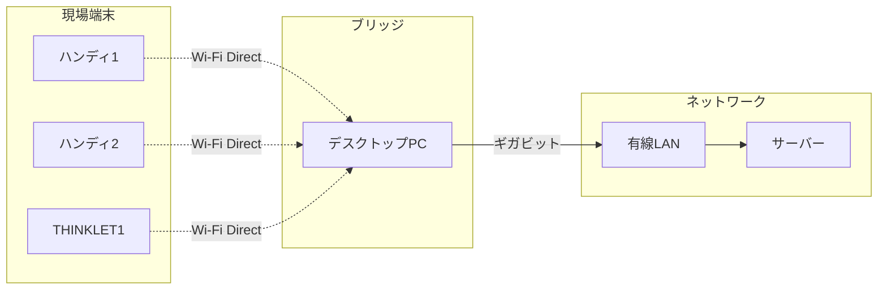
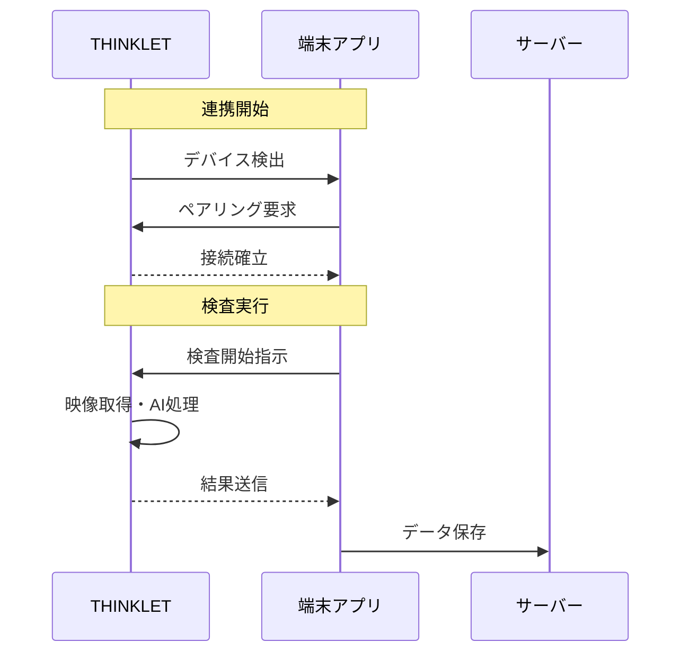
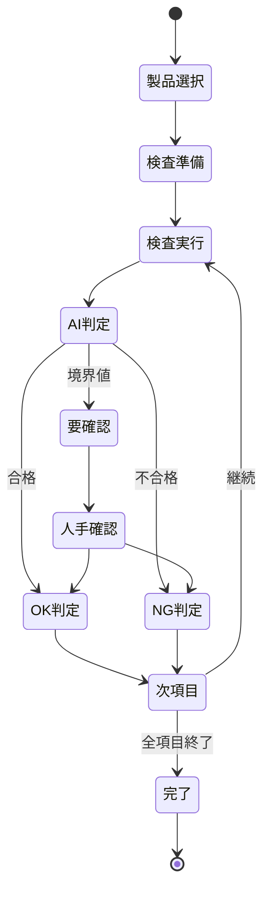
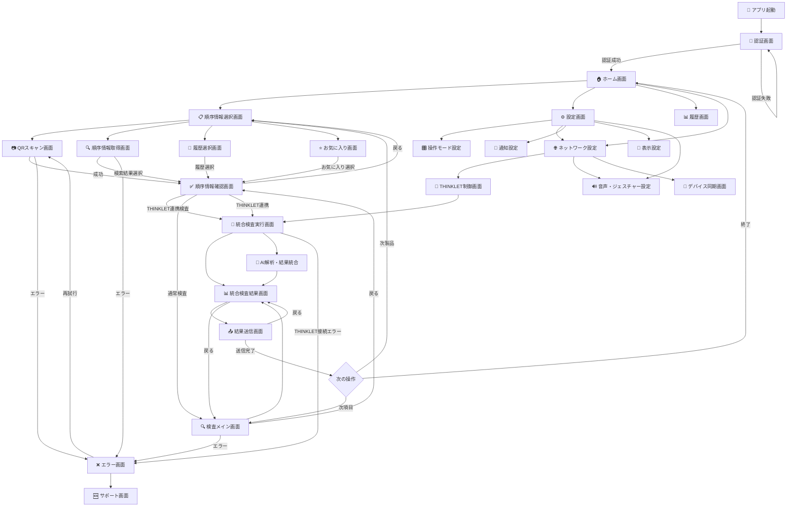
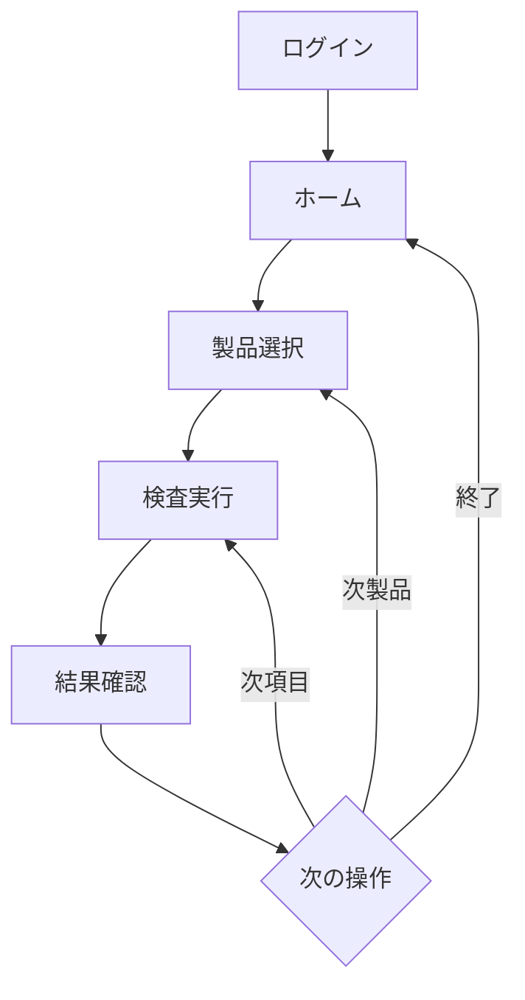
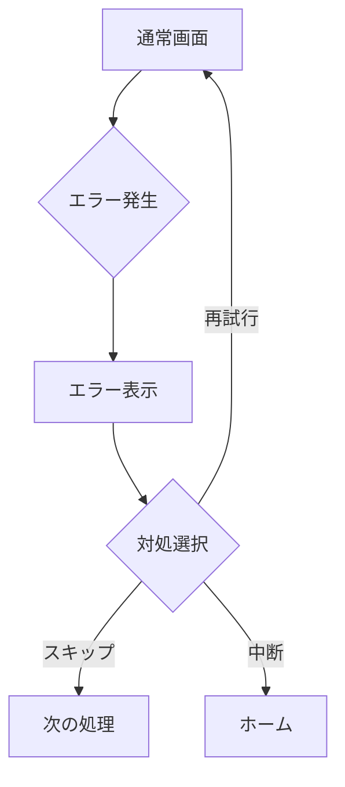

# 端末アプリ（ハンディターミナル・デスクトップ）設計書

## 文書管理情報

| 項目       | 内容                                                 |
| ---------- | ---------------------------------------------------- |
| 文書名     | 端末アプリ（ハンディターミナル・デスクトップ）設計書 |
| バージョン | 2.0                                                  |
| 作成日     | 2025年8月9日                                         |
| 更新日     | 2025年8月10日                                        |

---

# 1. はじめに

## 1.1. 本書の目的

本書は、ImageFlowCanvasシステムにおけるハンディターミナル・デスクトップアプリケーションの設計について詳細に記述するものです。ハンディターミナルでの片手操作最適化、デスクトップでの大画面活用、製品の順序情報表示、検査管理インターフェースの設計指針を提供します。

**アーキテクチャ構成:**
- **Backend**: Kotlin Multiplatform（共通ビジネスロジック）
- **UI Framework**: Compose Multiplatform（統一UI実装）
- **対象プラットフォーム**: 
  - **ハンディターミナル**: Android、Windows
  - **デスクトップ**: Windows、macOS、Linux
- **コード共有率**: 90%以上（ビジネスロジック + UI + プラットフォーム適応）

**技術実装詳細**: Kotlin MultiplatformとCompose Multiplatformによる実装詳細は `docs/0300_設計_アプローチ1/0310_KotlinMultiplatformアプリ設計.md` を参照してください。

## 1.2. 対象読者

- UI/UXデザイナー
- アプリケーション開発者
- システム設計者
- プロジェクトマネージャー
- 品質保証担当者

## 1.3. 関連文書

- `0310_KotlinMultiplatformアプリ設計.md` - 技術実装詳細
- `0311_THINKLETアプリ設計.md` - THINKLET側の設計仕様
- `0302_サーバーBackend設計.md` - バックエンド連携仕様
- `0303_データベース設計.md` - データ構造仕様

---

# 2. システム概要

## 2.1. アプリケーションの位置づけ

本アプリケーションは、ImageFlowCanvasシステムにおいて以下の役割を担います：

### 2.1.1. システム全体での役割



### 2.1.2. 各アプリケーションの独立性

| アプリケーション       | 単独動作 | 主要機能                           | 制約事項           |
| ---------------------- | -------- | ---------------------------------- | ------------------ |
| **ハンディターミナル** | ✅ 可能   | QRスキャン・手動検査・データ入力   | 移動範囲内での使用 |
| **デスクトップ**       | ✅ 可能   | 固定設備検査・大画面表示・統合制御 | 設置場所での使用   |
| **THINKLET**           | ✅ 可能   | AI画像解析・音声認識・ジェスチャー | 装着者依存         |

## 2.2. 主要機能一覧

### 2.2.1. 共通機能

- **製品情報管理**: QRコード読取・製品検索・履歴管理
- **検査実行**: 検査項目管理・結果記録・品質判定
- **データ同期**: オンライン/オフライン対応・自動同期
- **ユーザー管理**: 認証・権限制御・作業者識別

### 2.2.2. プラットフォーム別専用機能

| 機能カテゴリ | ハンディターミナル       | デスクトップ                           |
| ------------ | ------------------------ | -------------------------------------- |
| **入力方式** | タッチ・物理ボタン       | マウス・キーボード                     |
| **画面表示** | 単一画面・片手操作最適化 | マルチウィンドウ・大画面活用           |
| **カメラ**   | 内蔵カメラ               | USB/ネットワークカメラ                 |
| **特殊機能** | バッテリー管理・耐環境性 | Wi-Fi Directブリッジ・複数デバイス管理 |

## 2.3. 動作環境

### 2.3.1. ハードウェア要件

| プラットフォーム       | 最小要件                              | 推奨要件                                 |
| ---------------------- | ------------------------------------- | ---------------------------------------- |
| **ハンディターミナル** | Android 8.0以上、RAM 2GB、画面4インチ | Android 10以上、RAM 4GB、画面5インチ以上 |
| **Windows**            | Windows 10、RAM 4GB、Core i3          | Windows 11、RAM 8GB、Core i5以上         |
| **macOS**              | macOS 10.15、RAM 4GB                  | macOS 12以上、RAM 8GB                    |
| **Linux**              | Ubuntu 20.04、RAM 4GB                 | Ubuntu 22.04、RAM 8GB                    |

### 2.3.2. ソフトウェア要件

- **開発フレームワーク**: Kotlin Multiplatform + Compose Multiplatform
- **通信**: gRPC、REST API、WebSocket、Wi-Fi Direct
- **データベース**: SQLite（ローカル）
- **コード共有率**: 90%以上（ビジネスロジック + UI）

## 2.4. 他システムとの連携

### 2.4.1. バックエンド連携

- **通信プロトコル**: REST API（基本）、gRPC（高速処理）、WebSocket（リアルタイム）
- **認証方式**: JWT トークン認証
- **データ形式**: JSON（REST）、Protocol Buffers（gRPC）

### 2.4.2. THINKLET連携（任意）

THINKLETとの連携は必須ではありませんが、連携により以下の機能が拡張されます：

| 連携レベル | 説明                               | 用途                 |
| ---------- | ---------------------------------- | -------------------- |
| **不要**   | 各アプリ独立で完全動作             | 基本的な検査業務     |
| **推奨**   | 連携により品質・効率向上           | 高精度検査・詳細確認 |
| **必須**   | 特定機能（動画ストリーミング）のみ | リアルタイム映像処理 |

---

# 3. アーキテクチャ設計

## 3.1. 全体構成

### 3.1.1. レイヤー構成

```
┌─────────────────────────────────────────────────┐
│              プレゼンテーション層                  │
│        Compose Multiplatform (共通UI)            │
├─────────────────────────────────────────────────┤
│              ビジネスロジック層                   │
│      Kotlin Multiplatform (共通ロジック)         │
├─────────────────────────────────────────────────┤
│                 データ層                         │
│        Repository / DataSource (共通)            │
├─────────────────────────────────────────────────┤
│            プラットフォーム固有層                  │
│    Android / iOS / Desktop 固有実装              │
└─────────────────────────────────────────────────┘
```

### 3.1.2. モジュール構成

- **commonMain**: 共通ビジネスロジック・データモデル
- **commonUI**: Compose Multiplatform共通UI
- **androidMain**: Android固有実装（カメラ、センサー）
- **desktopMain**: Desktop固有実装（ファイルシステム、USB）
- **iosMain**: iOS固有実装（カメラ、Core Motion）

## 3.2. 技術スタック

| レイヤー         | 技術                  | 用途                     |
| ---------------- | --------------------- | ------------------------ |
| **UI**           | Compose Multiplatform | クロスプラットフォームUI |
| **ロジック**     | Kotlin Multiplatform  | 共通ビジネスロジック     |
| **通信**         | Ktor Client           | HTTP/WebSocket通信       |
| **データベース** | SQLDelight            | ローカルDB               |
| **DI**           | Koin                  | 依存性注入               |
| **非同期処理**   | Kotlin Coroutines     | 非同期・並行処理         |

## 3.3. データフロー



## 3.4. 通信設計

### 3.4.1. 通信方式の使い分け

| 通信方式         | 用途               | 選定理由             |
| ---------------- | ------------------ | -------------------- |
| **REST API**     | 基本的なCRUD操作   | シンプル・汎用性     |
| **gRPC**         | 高速データ転送     | バイナリ転送・型安全 |
| **WebSocket**    | リアルタイム通信   | 双方向・低遅延       |
| **Wi-Fi Direct** | デバイス間直接通信 | ネットワーク負荷軽減 |

### 3.4.2. Wi-Fi Direct活用（複数端末使用時）

#### 必要性と効果

| 端末数  | Wi-Fiアクセスポイント経由 | Wi-Fi Direct経由 |
| ------- | ------------------------- | ---------------- |
| 1台     | 問題なし                  | 将来拡張性確保   |
| 2-4台   | 帯域競合リスク            | 安定動作         |
| 5台以上 | 深刻な性能劣化            | 高性能維持       |


**Wi-Fiアクセスポイント改善の限界と技術制約:**

Wi-Fiアクセスポイントの改善によって複数端末同時利用の課題を解決できるかを詳細分析した結果、以下の技術的・経済的制約により困難であることが判明しました。

#### エンタープライズAPへのアップグレード検討

| 改善内容                             | 期待効果                                        | 実際の課題・限界                                                                                                    | 投資コスト                                            |
| ------------------------------------ | ----------------------------------------------- | ------------------------------------------------------------------------------------------------------------------- | ----------------------------------------------------- |
| **高性能AP導入**<br>(Cisco, Aruba等) | 同時接続数: 200-500台<br>スループット: 5-10Gbps | **画像検査には不十分**<br>• 4MB画像×10台=40MB同時転送<br>• 実効速度は理論値の30-50%<br>• 電波干渉は物理的に解決不可 | 1台30-50万円<br>×設置必要台数<br>**総額1000万円以上** |
| **Wi-Fi 6E対応**                     | 6GHz帯追加による<br>低遅延・高速化              | **端末側の全面対応必須**<br>• 既存端末の買い替え必要<br>• 産業用端末は対応遅れ<br>• 工場環境での6GHz減衰            | AP+端末総入替<br>**数千万円規模**                     |
| **専用5G導入**                       | 超低遅延・専用帯域                              | **免許取得・専門技術者必要**<br>• 初期投資1億円以上<br>• 年間運用費数千万円                                         | **1億円以上**                                         |

#### アクセスポイント増設の物理的限界

**電波干渉の根本的問題:**
- **2.4GHz帯**: 実質3チャンネルのみ（1, 6, 11ch）→ 4台以上のAPで必ず干渉発生
- **5GHz帯**: 19チャンネル存在するが、DFS（動的周波数選択）により実質半分に制限
- **電波増設パラドックス**: APを増やすほど干渉が増加し、かえって性能劣化

#### 製造現場特有の技術的制約

**画像データ転送要件と現実:**
```
検査画像の転送要件:
  • 画像サイズ: 4-8MB/枚
  • 必要転送速度: 32-64Mbps/端末（1秒以内転送）
  • 10台同時使用: 320-640Mbps実効速度必要
  • Wi-Fi実効速度: 理論値の30-50%
  → 1.5Gbps以上の理論値が必要（現実的に困難）

工場環境の電波阻害要因:
  • 金属設備による電波反射・遮蔽・マルチパス干渉
  • モーター・インバーターによる電磁ノイズ
  • 移動する人・搬送設備による電波状況の動的変化
  • 既存の産業用無線システムとの周波数競合
```

#### Wi-Fi Direct方式の妥当性

**コスト・効果・期間の比較分析:**

| 項目           | Wi-Fiアクセスポイント全面改善                | Wi-Fi Direct + デスクトップPC方式           |
| -------------- | -------------------------------------------- | ------------------------------------------- |
| **初期投資**   | **1000万円以上**<br>(AP総入替+工事+端末更新) | **200-300万円**<br>(デスクトップPC追加のみ) |
| **端末対応**   | 全端末のWi-Fi 6E更新必要                     | 既存端末で即座に対応可能                    |
| **拡張性**     | APの物理的・電波干渉限界あり                 | デスクトップPC追加で線形拡張                |
| **保守運用**   | 専門業者必要・年間100万円以上                | 社内IT部門で対応可能                        |
| **導入期間**   | **6-12ヶ月**（設計・工事・検証）             | **1-2ヶ月**（PC設置・設定）                 |
| **技術リスク** | 電波干渉は解決不可・性能保証困難             | 有線LAN活用により性能確実                   |
| **ROI**        | 不確実・投資回収困難                         | 確実・短期回収可能                          |

**結論：Wi-Fi Direct方式の妥当性**
- **コスト効率**: 1/5以下の投資で同等以上の効果
- **技術確実性**: 電波干渉の物理的制約を回避
- **実装速度**: 短期間で確実な効果を実現
- **拡張性**: 段階的拡張によるリスク最小化


#### Wi-Fi Directの技術制約と対応策

**1. P2P接続の技術制約**
- Wi-Fi Directは本来1対1接続を前提とした技術仕様
- Group Owner（GO）モードで1対多接続は可能だが、真のメッシュネットワークではない
- 接続先切り替えには必ず一時的な切断・再接続プロセスが必要

**2. 動的切り替えの課題**
```
接続切替プロセス: デバイスA ←→ デスクトップPC1
                ↓
          1. PC1との接続を切断
          2. PC2を発見・認証
          3. PC2と新規接続確立
          ↓
      切替時間: 2-3秒の通信断が発生
```

**3. 実現可能な代替アプローチ**

複数デスクトップPCによるハイブリッド型ブリッジネットワークで、THINKLET・ハンディターミナルの移動とAI画像検査に対応：

| 接続パターン                 | 通信フロー                                       | 利点                                  | 適用シーン                               | 技術制約                    |
| ---------------------------- | ------------------------------------------------ | ------------------------------------- | ---------------------------------------- | --------------------------- |
| **固定ペアリング**           | THINKLET/ハンディ → 専用デスクトップPC           | 低遅延・最小混線・安定接続            | 単独作業・現場検査・小規模運用           | 制約なし（基本機能）        |
| **半自動動的最適接続**       | THINKLET/ハンディ → 最適デスクトップPC → 社内LAN | 負荷分散・2-3秒切替時間許容・手動承認 | 移動作業・複数デバイス環境・AI画像検査   | 2-3秒の切替遅延・手動操作   |
| **擬似メッシュローミング**   | THINKLET/ハンディ → 複数デスクトップPC間再接続   | 自動切替・冗長性確保・切替遅延許容    | 大規模工場・長距離移動作業・複数台AI検査 | 2-3秒の切替遅延・完全自動化 |
| **プリエンプティブ接続準備** | 事前認証・バックグラウンド探索・バッファリング   | 切替時間短縮（1-2秒）・データロス防止 | 高速移動・重要検査・リアルタイム制御     | 事前認証要・追加処理負荷    |

#### 実装方式



#### 段階的実装アプローチ（実現可能性重視）

| Phase | 実装内容                             | 技術難易度 | 切替時間 | 実装期間 | 効果                         |
| ----- | ------------------------------------ | ---------- | -------- | -------- | ---------------------------- |
| **1** | 固定ペアリング（1対1接続）           | ⭐ 低       | なし     | 1ヶ月    | 基本通信安定性の確保         |
| **2** | 半自動切替（電波強度による推奨表示） | ⭐⭐ 中      | 5-10秒   | 2ヶ月    | ユーザー主導の最適接続       |
| **3** | 自動切替（閾値による自動切替）       | ⭐⭐⭐ 高     | 2-3秒    | 4ヶ月    | 擬似メッシュローミング       |
| **4** | プリエンプティブ準備（事前認証）     | ⭐⭐⭐⭐ 高    | 1-2秒    | 6ヶ月    | 切替時間短縮・データロス防止 |
| **5** | AI予測最適化（機械学習による予測）   | ⭐⭐⭐⭐⭐      | 1秒以下  | 12ヶ月   | 個人最適化・効率最大化       |

---

# 4. 機能仕様

## 4.1. 単独動作機能

### 4.1.1. ハンディターミナル単独機能

#### 基本検査機能
- **QRコード/バーコードスキャン**: 製品・検査項目の識別
- **手動データ入力**: 数値・テキスト・選択式入力
- **検査結果記録**: OK/NG判定・コメント入力
- **写真撮影**: 検査対象の画像記録
- **オフライン動作**: ローカルデータ保存・後日同期

#### 物理ボタン操作

| ボタン位置 | 基本機能         | 長押し機能   | 過酷環境対応 |
| ---------- | ---------------- | ------------ | ------------ |
| 右側面上   | スキャン実行     | 連続スキャン | ✅            |
| 右側面中   | 決定・選択       | -            | ✅            |
| 右側面下   | 戻る・キャンセル | ホーム画面   | ✅            |
| 左側面上   | メニュー表示     | 設定画面     | ✅            |

**物理ボタン操作の利点:**
- **確実性**: 過酷環境でも誤操作なく確実に押下可能
- **触覚フィードバック**: タッチスクリーンでは得られない物理的な操作感
- **省電力**: 画面を見ずに操作可能、バッテリー消費を抑制
- **耐久性**: 工場環境での長期使用に対する機械的信頼性

**物理ボタン操作最適化:**
- **ボタンサイズ**: 最小直径15mm以上の大型ボタン
- **押下圧力**: 軽い力で確実に反応（50～100g重）
- **ボタン間隔**: 誤操作防止のため最小20mm間隔
- **表面処理**: 滑り止め加工による確実なグリップ

#### 操作モード切替システム

作業環境と装着状況に応じて最適な操作方法を選択できるモード切替機能：

**操作モード分類:**

| 操作モード             | 対象シーン             | 主要操作方法     | 切替方法                    |
| ---------------------- | ---------------------- | ---------------- | --------------------------- |
| **液晶画面操作モード** | 通常作業時             | タッチスクリーン | 画面上部モード切替ボタン    |
| **物理ボタンモード**   | 過酷環境・高精度操作時 | 物理ボタン       | 左側面上+下ボタン同時長押し |
| **ハイブリッドモード** | 状況に応じて併用       | 併用操作         | 設定メニューから選択        |

**モード別UI調整:**

液晶画面操作モード時:
- タッチターゲット: 標準サイズ（44dp × 44dp）
- 情報密度: 高密度表示
- アニメーション: フル対応

物理ボタンモード時:
- ボタンサイズ: 大型（48dp × 48dp以上）
- 情報密度: 必要最小限表示
- アニメーション: 省電力対応

### 4.1.2. デスクトップ単独機能

#### 固定設備検査機能
- **外部カメラ制御**: USB/ネットワークカメラの接続・制御
- **マルチウィンドウ**: 複数の検査画面同時表示
- **詳細データ表示**: 大画面を活用した統計・グラフ表示
- **キーボードショートカット**: 効率的な操作

#### Wi-Fi Directブリッジ機能（複数端末環境）
- **負荷分散**: 複数端末の通信を有線LANに中継
- **帯域確保**: ギガビット有線による高速転送
- **接続管理**: デバイスの自動検出・接続

## 4.2. THINKLET連携機能

### 4.2.1. 連携による機能拡張

#### THINKLET入力拡張機能（任意利用・検査能力向上）

ハンディターミナル検査時、THINKLETは必須ではないが、以下の入力手段を追加可能：

| 拡張入力機能         | THINKLET提供内容               | 検査への効果               | 従来手法との併用   |
| -------------------- | ------------------------------ | -------------------------- | ------------------ |
| **カメラ映像入力**   | ウェアラブルカメラ視点の映像   | 手の届かない箇所の視覚検査 | ✅ 手動目視と併用   |
| **音声入力**         | 音声認識によるハンズフリー入力 | 作業中の効率的データ入力   | ✅ 手動入力と併用   |
| **ジェスチャー入力** | 手の動きによる直感的操作       | 画面に触れない操作環境     | ✅ タッチ操作と併用 |
| **AI解析データ**     | THINKLET AI解析結果の参照      | 人的判断の補完・精度向上   | ✅ 目視判断と併用   |

**入力拡張のメリット:**
- **検査範囲拡大**: ハンディターミナルでは困難な箇所もTHINKLETカメラで確認
- **効率性向上**: 音声・ジェスチャーによるハンズフリー操作
- **精度向上**: AI解析結果を参考にした人的判断の補完
- **作業継続性**: 手が塞がった状態でも検査データ入力継続

#### THINKLET連携時の拡張機能（推奨利用）

| 拡張機能           | 連携内容                       | 効果                   | 必須性 |
| ------------------ | ------------------------------ | ---------------------- | ------ |
| **AI検査結果表示** | THINKLET AI解析結果の詳細表示  | 検査精度向上・品質確認 | 🔶 推奨 |
| **移動中結果確認** | 移動しながらのリアルタイム確認 | 作業効率向上           | 🔶 推奨 |
| **補完データ入力** | THINKLET検査への追加情報補完   | データ完全性向上       | 🔶 推奨 |
| **検査比較分析**   | 手動検査とAI検査の比較確認     | 品質保証・学習効果     | 🔶 推奨 |

#### 入力手段の拡張（任意利用）

| 拡張機能         | 提供内容               | 効果                   |
| ---------------- | ---------------------- | ---------------------- |
| **カメラ映像**   | ウェアラブル視点の映像 | 手の届かない箇所の確認 |
| **音声入力**     | ハンズフリー操作       | 作業効率向上           |
| **ジェスチャー** | 非接触操作             | 衛生的な操作           |
| **AI解析**       | リアルタイム品質判定   | 検査精度向上           |

#### 連携時の動作フロー



### 4.2.2. 連携不要時の動作

各アプリケーションは完全に独立して動作可能：
- ハンディターミナル：QRスキャン→手動検査→結果記録
- デスクトップ：固定カメラ→画像解析→結果表示
- THINKLET：映像取得→AI解析→結果通知

## 4.3. 検査機能

### 4.3.1. 製品情報管理

#### 製品の順序情報表示システム

**ヘッダー製品順序情報表示エリア:**

画面上部に固定表示される現在選択中の製品の順序情報：

**表示項目:**
- **型式・機番・月連番**: 基本識別情報
- **検査状態**: 現在のステータス表示
- **日付・ライン**: 追加情報

**情報表示の優先順位と階層:**

| 優先度 | 情報項目          | 表示形式        | 条件           |
| ------ | ----------------- | --------------- | -------------- |
| **1**  | 型式 (Model)      | 太字・大文字    | 常時表示       |
| **2**  | 機番 (Serial)     | 中文字          | 常時表示       |
| **3**  | 月連番 (Sequence) | 中文字          | 常時表示       |
| **4**  | 検査状態          | アイコン+色分け | 状態変更時更新 |
| **5**  | 生産日            | 小文字          | 詳細表示時     |
| **6**  | 生産ライン        | 小文字          | 詳細表示時     |

**順序情報取得インターフェース:**

検査対象の順序情報（型式・機番・月連番等）の取得のため、複数の取得方式に対応した統合インターフェース：

**順序情報取得画面の構成要素:**

| 表示エリア             | 機能説明               | 表示項目                                       |
| ---------------------- | ---------------------- | ---------------------------------------------- |
| **画面タイトル**       | 画面の目的を明確に表示 | 「順序情報取得・選択」                         |
| **取得方式選択ボタン** | 4つの主要取得方式      | QRスキャン、サーバー連携、履歴選択、お気に入り |
| **クイック入力エリア** | 手動入力による直接入力 | 型式・機番・月連番のテキスト入力フィールド     |
| **最近使用製品リスト** | 直近の検査対象履歴     | 製品情報と使用時刻の一覧表示                   |

#### 製品情報取得方式

| 方式             | 操作時間 | 精度  | 用途             |
| ---------------- | -------- | ----- | ---------------- |
| **QRコード**     | <1秒     | 99.9% | 現場での即座特定 |
| **サーバー検索** | 1-3秒    | 100%  | 条件指定での検索 |
| **履歴選択**     | <0.5秒   | 100%  | 繰り返し作業     |
| **お気に入り**   | <0.5秒   | 100%  | 定番製品の選択   |

#### 製品情報の表示

```
┌─────────────────────────────────────┐
│ 📦 型式: ABC-123 機番: 456 月連番: 001 │
│ ✅ 検査中 | 3/5完了 | ライン: A       │
└─────────────────────────────────────┘
```

### 4.3.2. 検査実行フロー



### 4.3.3. 検査結果管理

- **結果記録**: 判定結果・信頼度・タイムスタンプ
- **証跡管理**: 画像・ログ・作業者情報
- **同期管理**: オンライン時自動送信・オフライン時保存

---

# 5. UI/UX設計

## 5.1. 画面一覧

### 5.1.1. 共通画面

| 画面名   | 用途           | 主要機能                    |
| -------- | -------------- | --------------------------- |
| ログイン | 認証           | ID/パスワード入力・生体認証 |
| ホーム   | メインメニュー | 機能選択・ステータス表示    |
| 製品選択 | 検査対象選択   | QR/検索/履歴/お気に入り     |
| 検査実行 | 検査作業       | 項目表示・結果入力          |
| 結果確認 | 検査結果表示   | 判定結果・詳細情報          |
| 設定     | アプリ設定     | 各種設定変更                |

### 5.1.2. プラットフォーム専用画面

| 画面名           | ハンディ | デスクトップ | 用途              |
| ---------------- | -------- | ------------ | ----------------- |
| **スキャン専用** | ✅        | ❌            | QR/バーコード読取 |
| **統合ダッシュ** | ❌        | ✅            | 全体状況監視      |
| **カメラ制御**   | ❌        | ✅            | 外部カメラ操作    |
| **ブリッジ設定** | ❌        | ✅            | Wi-Fi Direct管理  |

## 5.2. 画面遷移設計

### 5.2.1. 全体画面遷移フロー

ハンディターミナル・デスクトップアプリケーションの主要画面とその遷移関係を以下に示します：



### 5.2.2. 画面遷移詳細仕様（物理ボタン対応）

**主要遷移パターン:**

| 遷移元画面       | 遷移先画面   | 遷移条件         | 遷移方法             | 物理ボタン対応   |
| ---------------- | ------------ | ---------------- | -------------------- | ---------------- |
| **ホーム**       | 順序情報選択 | 検査開始要求     | メインボタンタップ   | 中央ボタン       |
| **ホーム**       | THINKLET連携 | ウェアラブル連携 | THINKLETカードタップ | 上側面ボタン     |
| **順序情報選択** | QRスキャン   | QRスキャン選択   | QRカードタップ       | 右側面上ボタン   |
| **順序情報選択** | 順序情報取得 | サーバー連携選択 | サーバーカードタップ | 下側面ボタン     |
| **QRスキャン**   | 順序情報確認 | QR読み取り成功   | 自動遷移             | -                |
| **順序情報確認** | 検査メイン   | 順序情報確定     | 確定ボタンタップ     | 中央ボタン       |
| **順序情報確認** | 統合検査実行 | THINKLET連携検査 | 連携検査ボタンタップ | 上側面ボタン     |
| **THINKLET連携** | 統合検査実行 | デバイス接続済み | 連携開始ボタンタップ | 中央ボタン       |
| **統合検査実行** | 統合検査結果 | AI処理完了       | 自動遷移             | -                |
| **検査メイン**   | AI検査実行   | 検査開始         | 検査ボタンタップ     | 右側面上ボタン   |
| **AI検査実行**   | 検査結果     | AI処理完了       | 自動遷移             | -                |
| **統合検査結果** | 次項目       | 次項目移行       | 次項目ボタンタップ   | 右側面下ボタン   |
| **検査結果**     | 次項目       | 次項目移行       | 次項目ボタンタップ   | 右側面下ボタン   |
| **統合検査結果** | 結果送信     | 検査完了         | 送信ボタンタップ     | 中央ボタン長押し |
| **検査結果**     | 結果送信     | 検査完了         | 送信ボタンタップ     | 中央ボタン長押し |

**戻る操作の仕様:**

| 画面レベル       | 戻る先画面 | 戻る方法                         | 物理ボタン操作     |
| ---------------- | ---------- | -------------------------------- | ------------------ |
| **第1階層**      | アプリ終了 | 確認ダイアログ表示               | 左側面ボタン長押し |
| **第2階層**      | ホーム画面 | 直接戻り                         | 左側面ボタン       |
| **第3階層以降**  | 前画面     | スタック管理による前画面復帰     | 左側面ボタン       |
| **モーダル画面** | 元画面     | モーダル閉じて元画面復帰         | 左側面ボタン       |
| **全画面処理中** | 処理継続   | 戻る操作無効（進行中は中断不可） | 操作無効           |


## 5.2. 画面遷移

### 5.2.1. 基本フロー



### 5.2.2. エラー処理フロー



## 5.3. プラットフォーム別UI

### 5.3.1. ハンディターミナルUI

#### レイアウト設計
- **画面サイズ**: 4-6インチ対応
- **操作**: 片手操作最適化
- **タッチターゲット**: 最小44dp
- **情報密度**: 必要最小限の表示

#### 画面構成
```
┌────────────────────┐
│  ステータスバー     │
├────────────────────┤
│  製品情報          │
├────────────────────┤
│                    │
│  メインコンテンツ   │
│                    │
├────────────────────┤
│  操作ボタン        │
└────────────────────┘
```

### 5.3.2. デスクトップUI

#### レイアウト設計
- **画面サイズ**: 13インチ以上対応
- **操作**: マウス・キーボード最適化
- **ウィンドウ**: リサイズ・マルチウィンドウ対応
- **情報密度**: 詳細情報の同時表示

#### 画面構成
```
┌─────────────────────────────────────┐
│  メニューバー                        │
├─────────┬───────────────────────────┤
│         │                           │
│  サイド  │   メインコンテンツ         │
│  バー   │                           │
│         │                           │
├─────────┴───────────────────────────┤
│  ステータスバー                      │
└─────────────────────────────────────┘
```

## 5.4. 操作方式

### 5.4.1. 操作モード

| モード         | 用途         | 切替方法                 |
| -------------- | ------------ | ------------------------ |
| **タッチ操作** | 通常作業     | デフォルト               |
| **物理ボタン** | 過酷環境     | 設定またはボタン同時押し |
| **キーボード** | デスクトップ | 自動検出                 |

### 5.4.2. フィードバック

- **視覚**: 色変化・アニメーション
- **聴覚**: 成功音・エラー音
- **触覚**: 振動（対応デバイスのみ）

---

# 6. 技術仕様

## 6.1. Kotlin Multiplatform実装

### 6.1.1. プロジェクト構成

```kotlin
// 共通モジュール
commonMain/
  - models/        // データモデル
  - repository/    // リポジトリ
  - usecase/       // ユースケース
  - ui/           // Compose UI

// プラットフォーム固有
androidMain/
  - camera/       // カメラ制御
  - sensor/       // センサー制御
  
desktopMain/
  - usb/          // USB機器制御
  - file/         // ファイルシステム
```

### 6.1.2. 依存関係

```kotlin
// build.gradle.kts
kotlin {
    sourceSets {
        commonMain.dependencies {
            implementation("org.jetbrains.compose.runtime:runtime")
            implementation("org.jetbrains.compose.foundation:foundation")
            implementation("io.ktor:ktor-client-core")
            implementation("org.jetbrains.kotlinx:kotlinx-coroutines-core")
        }
    }
}
```

## 6.2. 通信プロトコル詳細

### 6.2.1. REST API

```kotlin
// API呼び出し例
suspend fun getProduct(id: String): Product {
    return httpClient.get("api/products/$id")
}
```

### 6.2.2. Wi-Fi Direct

#### 接続確立フロー
1. デバイス検出
2. ペアリング要求
3. 認証・暗号化
4. データ転送開始

#### 切替時の処理
- **切替時間**: 2-3秒
- **データ保護**: バッファリング
- **自動復旧**: 接続断時の再接続

## 6.3. データ管理

### 6.3.1. ローカルDB構造

```sql
-- 製品情報
CREATE TABLE products (
    id TEXT PRIMARY KEY,
    model TEXT NOT NULL,
    serial_number TEXT NOT NULL,
    sequence_number INTEGER
);

-- 検査結果
CREATE TABLE inspections (
    id TEXT PRIMARY KEY,
    product_id TEXT,
    result TEXT,
    timestamp INTEGER,
    synced INTEGER DEFAULT 0
);
```

### 6.3.2. 同期戦略

| データ種別 | 同期タイミング       | 優先度 |
| ---------- | -------------------- | ------ |
| 検査結果   | 即時（オンライン時） | 高     |
| 製品マスタ | 定期（4時間毎）      | 中     |
| 画像データ | バックグラウンド     | 低     |

### 6.3.3. オフライン対応の詳細設計

**ローカルキャッシュ戦略:**

| データカテゴリ       | キャッシュ期間 | 同期頻度           | オフライン動作     |
| -------------------- | -------------- | ------------------ | ------------------ |
| **基本製品順序情報** | 7日間          | 4時間毎            | 完全動作           |
| **検査履歴**         | 30日間         | 1時間毎            | 閲覧・更新可能     |
| **画像・図面**       | 3日間          | 手動・オンデマンド | キャッシュ済みのみ |
| **仕様書**           | 14日間         | 8時間毎            | 重要データのみ     |

**同期状態の可視化:**

**データ同期状況画面の構成:**

| 表示エリア       | 表示項目           | 表示内容例                   | 状態アイコン |
| ---------------- | ------------------ | ---------------------------- | ------------ |
| **画面タイトル** | 📊 データ同期状況   | 同期管理画面であることを表示 | -            |
| **製品マスタ**   | 同期状態と更新時刻 | ✅ 2分前更新 (1,234件)        | ✅ 最新       |
| **検査履歴**     | 同期進行状況       | 🔄 同期中... (45%)            | 🔄 同期中     |
| **画像データ**   | 最終更新時刻と状態 | ⚠️ 6時間前 (要更新)           | ⚠️ 古い       |
| **操作ボタン**   | 同期制御           | 今すぐ同期、同期設定         | -            |

**同期状態インジケーター:**
- 🔄 同期中: リアルタイム同期実行中
- ✅ 最新: データが最新状態
- ⚠️ 古い: データ更新が必要
- ❌ 未接続: サーバー接続エラー

### 6.3.4. エラーハンドリングと復旧

**エラー分類と対応戦略:**

| エラーカテゴリ         | 検出方法               | 自動復旧           | ユーザー対応             | 物理ボタン操作              |
| ---------------------- | ---------------------- | ------------------ | ------------------------ | --------------------------- |
| **ネットワークエラー** | 通信タイムアウト       | 自動リトライ(3回)  | オフライン継続・手動同期 | 下側面ボタンで再接続        |
| **データ不整合**       | 整合性チェック         | サーバー再取得     | 確認ダイアログ表示       | 中央ボタンで確認/キャンセル |
| **QRスキャンエラー**   | 読み取り失敗・無効形式 | 再スキャン促進     | 手動入力切り替え         | 右側面上ボタンで再スキャン  |
| **認証エラー**         | トークン無効・権限不足 | 自動ログイン試行   | 認証画面表示             | 左側面ボタンでメニュー      |
| **ストレージ不足**     | 容量監視               | 古いデータ自動削除 | 容量警告・手動クリア     | 右側面下ボタンで削除確認    |

**復旧処理の優先順位:**

1. **緊急復旧**: 検査継続に必要な最小限データの確保
2. **段階復旧**: 段階的なデータ復元・機能回復
3. **完全復旧**: 全機能・全データの正常状態復帰
4. **予防対策**: 再発防止のための設定・プロセス改善

**エラー状態と復旧フロー（物理ボタン対応）:**

| エラー状態                | 発生条件                   | 復旧方法                   | ユーザー操作                     | 物理ボタン操作                 |
| ------------------------- | -------------------------- | -------------------------- | -------------------------------- | ------------------------------ |
| **QR_DECODE_FAILED**      | QRコード読み取り失敗       | 再スキャン・手動入力       | 位置調整・照明改善・検索切替     | 右側面上ボタンで再スキャン     |
| **PRODUCT_NOT_FOUND**     | 製品の順序情報未登録・無効 | 手動検索・順序情報登録要求 | 順序情報取得・管理者連絡         | 下側面ボタンで手動検索         |
| **SEARCH_NO_RESULTS**     | 検索条件に該当なし         | 検索条件緩和・別方式選択   | 条件変更・QRコード利用           | 右側面下ボタンで条件変更       |
| **NETWORK_ERROR**         | サーバー接続失敗           | オフライン対応・再試行     | ローカルキャッシュ利用           | 下側面ボタンで再接続           |
| **PRODUCT_INFO_OUTDATED** | 製品の順序情報が古い       | サーバー再同期             | 情報更新・継続確認               | 中央ボタンで更新確認           |
| **VALIDATION_FAILED**     | 製品の順序情報整合性エラー | データ検証・修正           | 手動修正・管理者エスカレーション | 左側面ボタンでメニューから修正 |

## 6.4. セキュリティ

### 6.4.1. データ保護
- **暗号化**: AES-256
- **通信**: TLS 1.3
- **認証**: JWT トークン

### 6.4.2. アクセス制御
- **認証**: 多要素認証対応
- **権限**: RBAC（ロールベース）
- **監査**: 全操作のログ記録

---

# 7. 非機能要件

## 7.1. 性能要件

| 項目       | 目標値 | 測定条件         |
| ---------- | ------ | ---------------- |
| 起動時間   | <3秒   | コールドスタート |
| 画面遷移   | <0.5秒 | 通常操作         |
| QRスキャン | <1秒   | 標準環境         |
| データ同期 | <10秒  | 100件のデータ    |

## 7.2. 可用性要件

| 項目           | 目標値 | 対策                 |
| -------------- | ------ | -------------------- |
| 稼働率         | 99.9%  | 冗長化・自動復旧     |
| オフライン動作 | 100%   | ローカルキャッシュ   |
| データ保全性   | 100%   | トランザクション管理 |

## 7.3. 保守性要件

- **コード共有率**: 90%以上
- **テストカバレッジ**: 80%以上
- **ドキュメント**: 自動生成（KDoc）
- **CI/CD**: 自動ビルド・テスト

---

# 8. まとめ

## 8.1. 主要な特徴

1. **独立動作可能**: 各アプリケーション単体で完全な検査業務を実行
2. **任意連携**: THINKLETとの連携による機能拡張（必須ではない）
3. **クロスプラットフォーム**: Kotlin Multiplatform による統一実装
4. **オフライン対応**: ネットワーク環境に依存しない動作
5. **柔軟な通信**: 状況に応じた最適な通信方式の選択

## 8.2. 導入効果

- **開発効率**: 90%のコード共有による開発・保守コスト削減
- **運用柔軟性**: 現場状況に応じた最適な端末選択
- **拡張性**: 将来的な機能追加・デバイス追加への対応
- **信頼性**: オフライン対応による業務継続性の確保
- **操作性**: 物理ボタンによる確実な操作と省電力化

## 8.3. 物理ボタン操作サマリー

### 8.3.1. ボタン配置と基本機能

| ボタン位置   | 基本機能       | 主要操作                     |
| ------------ | -------------- | ---------------------------- |
| **中央**     | 確認・決定     | 各種確認・選択確定           |
| **右側面上** | スキャン       | QRコード読み取り・再スキャン |
| **右側面下** | 進行・次項目   | 次項目移動・設定変更         |
| **左側面**   | メニュー・戻る | メニュー表示・前画面戻り     |
| **下側面**   | 接続・検索     | サーバー接続・検索実行       |

### 8.3.2. 操作フローでの物理ボタン活用

**順序情報取得時:**
- 右側面上ボタン：QRスキャン実行
- 下側面ボタン：サーバー連携実行
- 左側面ボタン：履歴・メニューアクセス
- 中央ボタン：選択確定

**検査実行時:**
- 中央ボタン：検査開始・結果確認
- 右側面下ボタン：次項目移行
- 左右ボタン：判定選択（OK/NG）

**エラー対応時:**
- 各ボタンによる迅速な復旧操作
- タッチスクリーンが使用困難な状況での確実な操作継続

### 8.3.3. 操作モード切替機能

**モード切替方法:**
- **画面操作**: 上部モードバーのタップ
- **物理ボタン**: 左側面上+下ボタン同時長押し（3秒）

**モード別特徴:**

| 操作モード         | 主な用途               | 切替トリガー |
| ------------------ | ---------------------- | ------------ |
| **液晶画面モード** | 精密操作・詳細情報表示 | 手動選択     |
| **物理ボタン**     | 過酷環境での確実操作   | 手動選択     |

## 8.4. 今後の展開

- 新しいプラットフォームへの対応
- AI機能の強化
- より高度な連携機能の追加
- パフォーマンスの継続的改善

---

# 付録

## A. 用語集

| 用語                      | 説明                                        |
| ------------------------- | ------------------------------------------- |
| **Kotlin Multiplatform**  | 複数プラットフォームで コードを共有する技術 |
| **Compose Multiplatform** | 統一的なUIフレームワーク                    |
| **Wi-Fi Direct**          | アクセスポイントを経由しない直接通信        |
| **THINKLET**              | ウェアラブル検査デバイス                    |
| **ハンディターミナル**    | 産業用携帯端末                              |

## B. 参考資料

- Kotlin Multiplatform 公式ドキュメント
- Compose Multiplatform ガイド
- ImageFlowCanvas システム設計書
- 各種API仕様書